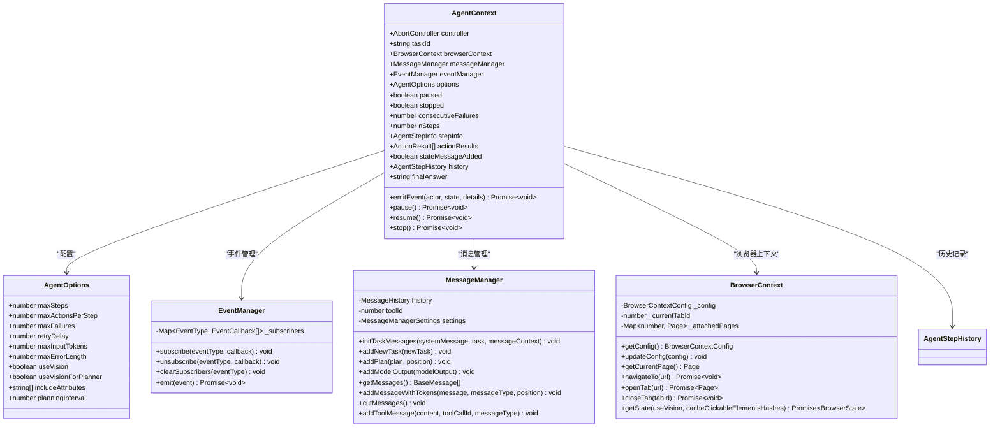
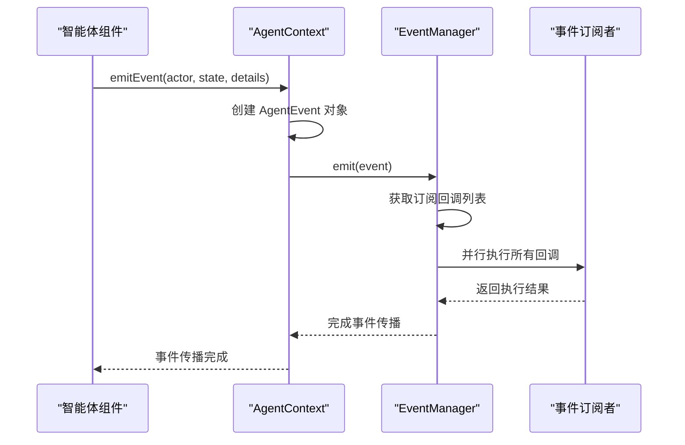
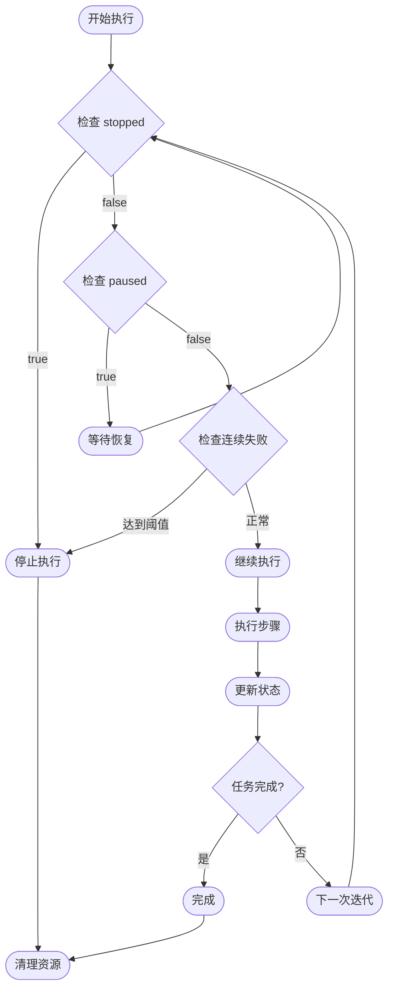

# AgentContext API 文档

<cite>
**本文档中引用的文件**
- [types.ts](file://chrome-extension/src/background/agent/types.ts)
- [executor.ts](file://chrome-extension/src/background/agent/executor.ts)
- [event/manager.ts](file://chrome-extension/src/background/agent/event/manager.ts)
- [event/types.ts](file://chrome-extension/src/background/agent/event/types.ts)
- [messages/service.ts](file://chrome-extension/src/background/agent/messages/service.ts)
- [history.ts](file://chrome-extension/src/background/agent/history.ts)
- [agents/navigator.ts](file://chrome-extension/src/background/agent/agents/navigator.ts)
- [browser/context.ts](file://chrome-extension/src/background/browser/context.ts)
</cite>

## 目录
1. [简介](#简介)
2. [核心架构](#核心架构)
3. [AgentContext 类详解](#agentcontext-类详解)
4. [任务管理状态](#任务管理状态)
5. [消息管理与事件系统](#消息管理与事件系统)
6. [执行状态跟踪](#执行状态跟踪)
7. [控制方法详解](#控制方法详解)
8. [使用示例](#使用示例)
9. [最佳实践](#最佳实践)
10. [故障排除](#故障排除)

## 简介

AgentContext 是 NanoBrowser 智能体系统的核心执行上下文，负责管理任务执行状态、协调各个组件之间的通信，并提供统一的状态管理和控制接口。它作为 Executor、Planner 和 Navigator 之间的共享状态枢纽，在整个智能体执行流程中发挥着关键作用。

## 核心架构



**图表来源**
- [types.ts](file://chrome-extension/src/background/agent/types.ts#L35-L99)
- [event/manager.ts](file://chrome-extension/src/background/agent/event/manager.ts#L5-L51)
- [messages/service.ts](file://chrome-extension/src/background/agent/messages/service.ts#L43-L439)
- [browser/context.ts](file://chrome-extension/src/background/browser/context.ts#L14-L359)

## AgentContext 类详解

AgentContext 类是智能体执行的核心容器，包含了所有必要的状态信息和管理功能。

### 核心属性

| 属性名 | 类型 | 描述 |
|--------|------|------|
| `controller` | `AbortController` | 用于控制任务取消的控制器 |
| `taskId` | `string` | 唯一的任务标识符 |
| `browserContext` | `BrowserContext` | 浏览器操作上下文 |
| `messageManager` | `MessageManager` | 消息管理系统 |
| `eventManager` | `EventManager` | 事件管理系统 |
| `options` | `AgentOptions` | 智能体配置选项 |
| `paused` | `boolean` | 任务暂停标志 |
| `stopped` | `boolean` | 任务停止标志 |
| `consecutiveFailures` | `number` | 连续失败次数 |
| `nSteps` | `number` | 已执行步骤数 |
| `stepInfo` | `AgentStepInfo \| null` | 当前步骤信息 |
| `actionResults` | `ActionResult[]` | 动作执行结果列表 |
| `stateMessageAdded` | `boolean` | 是否已添加状态消息 |
| `history` | `AgentStepHistory` | 执行历史记录 |
| `finalAnswer` | `string \| null` | 最终答案 |

**节来源**
- [types.ts](file://chrome-extension/src/background/agent/types.ts#L35-L99)

### 构造函数

AgentContext 的构造函数接受以下参数：

```typescript
constructor(
  taskId: string,
  browserContext: BrowserContext,
  messageManager: MessageManager,
  eventManager: EventManager,
  options: Partial<AgentOptions>,
)
```

构造函数初始化默认状态：
- `paused`: false（未暂停）
- `stopped`: false（未停止）
- `nSteps`: 0（初始步骤数）
- `consecutiveFailures`: 0（初始连续失败次数）
- `stepInfo`: null（无当前步骤信息）

**节来源**
- [types.ts](file://chrome-extension/src/background/agent/types.ts#L52-L73)

## 任务管理状态

### taskId（任务标识符）

`taskId` 是每个智能体任务的唯一标识符，用于区分不同的执行会话和历史记录。

### 控制标志详解

#### paused（暂停标志）

- **类型**: `boolean`
- **默认值**: `false`
- **用途**: 标识任务是否处于暂停状态
- **设置时机**: 调用 `pause()` 方法时设置为 `true`
- **检查时机**: 在执行循环中定期检查以决定是否暂停

#### stopped（停止标志）

- **类型**: `boolean`
- **默认值**: `false`
- **用途**: 标识任务是否被请求停止
- **设置时机**: 调用 `stop()` 方法时设置为 `true`
- **影响**: 导致执行循环提前终止

#### consecutiveFailures（连续失败次数）

- **类型**: `number`
- **默认值**: `0`
- **用途**: 记录连续执行失败的次数
- **重置条件**: 成功执行后重置为 0
- **停止阈值**: 达到 `options.maxFailures` 时停止执行

**节来源**
- [types.ts](file://chrome-extension/src/background/agent/types.ts#L52-L73)
- [executor.ts](file://chrome-extension/src/background/agent/executor.ts#L315-L335)

## 消息管理与事件系统

### MessageManager 集成

AgentContext 通过 `messageManager` 属性集成消息管理系统，负责：

- **任务消息初始化**: [`initTaskMessages()`](file://chrome-extension/src/background/agent/messages/service.ts#L43-L100)
- **新任务添加**: [`addNewTask()`](file://chrome-extension/src/background/agent/messages/service.ts#L150-L170)
- **计划消息管理**: [`addPlan()`](file://chrome-extension/src/background/agent/messages/service.ts#L172-L185)
- **模型输出处理**: [`addModelOutput()`](file://chrome-extension/src/background/agent/messages/service.ts#L187-L205)
- **工具消息管理**: [`addToolMessage()`](file://chrome-extension/src/background/agent/messages/service.ts#L430-L439)

### EventManager 集成

AgentContext 通过 `eventManager` 属性集成事件管理系统，提供统一的事件传播机制。

#### emitEvent 方法详解

```typescript
async emitEvent(actor: Actors, state: ExecutionState, eventDetails: string)
```

该方法负责创建并触发事件，包含以下关键功能：

1. **事件数据构建**: 包含任务ID、当前步骤数、最大步骤数和详细信息
2. **事件类型**: 默认为 `EventType.EXECUTION`
3. **时间戳**: 自动记录事件发生时间
4. **异步传播**: 使用 `await` 确保事件完全传播

**节来源**
- [types.ts](file://chrome-extension/src/background/agent/types.ts#L75-L85)
- [messages/service.ts](file://chrome-extension/src/background/agent/messages/service.ts#L43-L439)
- [event/manager.ts](file://chrome-extension/src/background/agent/event/manager.ts#L41-L50)

### 事件传播模式



**图表来源**
- [types.ts](file://chrome-extension/src/background/agent/types.ts#L75-L85)
- [event/manager.ts](file://chrome-extension/src/background/agent/event/manager.ts#L41-L50)

**节来源**
- [event/manager.ts](file://chrome-extension/src/background/agent/event/manager.ts#L41-L50)

## 执行状态跟踪

### nSteps（执行步骤计数）

- **类型**: `number`
- **用途**: 记录当前任务已执行的步骤数量
- **更新时机**: 每次成功执行导航动作后递增
- **检查点**: 用于规划器的周期性调用决策

### stepInfo（步骤信息）

`stepInfo` 提供当前步骤的详细信息：

```typescript
class AgentStepInfo {
  stepNumber: number;
  maxSteps: number;
}
```

- **stepNumber**: 当前步骤编号
- **maxSteps**: 任务允许的最大步骤数

### ActionResults（动作结果）

`actionResults` 数组存储每次执行的动作结果，包含：

- **isDone**: 是否完成任务
- **success**: 动作是否成功
- **extractedContent**: 提取的内容
- **error**: 错误信息
- **includeInMemory**: 是否包含在记忆中
- **interactedElement**: 交互的元素

**节来源**
- [types.ts](file://chrome-extension/src/background/agent/types.ts#L87-L109)
- [types.ts](file://chrome-extension/src/background/agent/types.ts#L111-L127)

## 控制方法详解

### pause() 方法

```typescript
async pause(): Promise<void>
```

- **功能**: 将 `paused` 标志设置为 `true`
- **行为**: 导致执行循环等待，直到调用 `resume()`
- **使用场景**: 用户请求暂停任务执行

### resume() 方法

```typescript
async resume(): Promise<void>
```

- **功能**: 将 `paused` 标志设置为 `false`
- **行为**: 解除执行循环的等待状态
- **使用场景**: 用户恢复暂停的任务

### stop() 方法

```typescript
async stop(): Promise<void>
```

- **功能**: 设置 `stopped` 标志为 `true`
- **额外行为**: 启动延迟 300ms 的 `AbortController` 中止信号
- **影响**: 立即终止执行循环，触发清理过程
- **使用场景**: 用户请求立即停止任务

### 执行控制流程



**图表来源**
- [executor.ts](file://chrome-extension/src/background/agent/executor.ts#L315-L335)

**节来源**
- [types.ts](file://chrome-extension/src/background/agent/types.ts#L87-L109)

## 使用示例

### 基本任务执行控制

```typescript
// 创建 AgentContext 实例
const context = new AgentContext(
  taskId,
  browserContext,
  messageManager,
  eventManager,
  options
);

// 开始执行任务
try {
  // 执行过程中暂停任务
  await context.pause();
  
  // 检查暂停状态
  if (context.paused) {
    console.log('任务已暂停');
  }
  
  // 恢复任务执行
  await context.resume();
  
  // 检查恢复状态
  if (!context.paused) {
    console.log('任务已恢复');
  }
  
  // 取消任务
  await context.stop();
  
  // 检查停止状态
  if (context.stopped) {
    console.log('任务已停止');
  }
} catch (error) {
  console.error('任务执行出错:', error);
}
```

### 事件监听和处理

```typescript
// 订阅执行事件
context.eventManager.subscribe(EventType.EXECUTION, async (event) => {
  console.log(`[${event.timestamp}] ${event.actor} - ${event.state}`);
  console.log('事件详情:', event.data);
  
  // 根据事件状态采取行动
  switch (event.state) {
    case ExecutionState.TASK_START:
      console.log('任务开始:', event.data.taskId);
      break;
    case ExecutionState.TASK_OK:
      console.log('任务完成:', event.data.details);
      break;
    case ExecutionState.TASK_FAIL:
      console.log('任务失败:', event.data.details);
      break;
    case ExecutionState.TASK_PAUSE:
      console.log('任务暂停');
      break;
    case ExecutionState.TASK_CANCEL:
      console.log('任务取消');
      break;
  }
});

// 发送自定义事件
await context.emitEvent(
  Actors.USER,
  ExecutionState.ACT_START,
  '用户手动触发的操作'
);
```

### 状态监控和调试

```typescript
// 监控执行状态
function monitorExecution(context: AgentContext): void {
  console.log('=== 执行状态监控 ===');
  console.log('任务ID:', context.taskId);
  console.log('已执行步骤:', context.nSteps);
  console.log('最大步骤数:', context.options.maxSteps);
  console.log('连续失败次数:', context.consecutiveFailures);
  console.log('最大失败次数:', context.options.maxFailures);
  console.log('暂停状态:', context.paused);
  console.log('停止状态:', context.stopped);
  console.log('最终答案:', context.finalAnswer);
  console.log('动作结果数量:', context.actionResults.length);
  console.log('=== 状态监控结束 ===');
}

// 在执行过程中定期监控
setInterval(() => {
  monitorExecution(context);
}, 5000);
```

### 复杂任务协调

```typescript
class AdvancedTaskCoordinator {
  private context: AgentContext;
  
  constructor(context: AgentContext) {
    this.context = context;
    
    // 监听所有执行事件
    this.context.eventManager.subscribe(
      EventType.EXECUTION,
      this.handleExecutionEvent.bind(this)
    );
  }
  
  private async handleExecutionEvent(event: AgentEvent): Promise<void> {
    switch (event.state) {
      case ExecutionState.STEP_START:
        await this.handleStepStart(event);
        break;
      case ExecutionState.STEP_OK:
        await this.handleStepSuccess(event);
        break;
      case ExecutionState.STEP_FAIL:
        await this.handleStepFailure(event);
        break;
      case ExecutionState.TASK_PAUSE:
        await this.handleTaskPause(event);
        break;
    }
  }
  
  private async handleStepStart(event: AgentEvent): Promise<void> {
    // 记录步骤开始
    console.log(`步骤 ${event.data.step} 开始`);
    
    // 如果连续失败超过阈值，暂停任务
    if (this.context.consecutiveFailures >= this.context.options.maxFailures) {
      console.log('连续失败过多，暂停任务');
      await this.context.pause();
    }
  }
  
  private async handleStepSuccess(event: AgentEvent): Promise<void> {
    // 清除连续失败计数
    this.context.consecutiveFailures = 0;
    
    // 检查是否需要额外的步骤
    if (this.needsMoreSteps()) {
      console.log('需要更多步骤，继续执行');
    } else {
      console.log('任务接近完成');
    }
  }
  
  private async handleStepFailure(event: AgentEvent): Promise<void> {
    // 增加连续失败计数
    this.context.consecutiveFailures++;
    
    // 根据失败情况决定策略
    if (this.context.consecutiveFailures >= this.context.options.maxFailures) {
      console.log('达到最大失败次数，停止任务');
      await this.context.stop();
    } else {
      console.log(`第 ${this.context.consecutiveFailures} 次失败，继续尝试`);
    }
  }
  
  private async handleTaskPause(event: AgentEvent): Promise<void> {
    // 保存当前状态
    await this.saveCheckpoint();
    
    // 等待恢复
    console.log('等待任务恢复...');
    while (this.context.paused) {
      await new Promise(resolve => setTimeout(resolve, 1000));
    }
    
    // 恢复后重新评估状态
    await this.resumeFromCheckpoint();
  }
  
  private needsMoreSteps(): boolean {
    return this.context.nSteps < this.context.options.maxSteps * 0.8;
  }
  
  private async saveCheckpoint(): Promise<void> {
    // 保存当前执行状态
    const checkpoint = {
      taskId: this.context.taskId,
      nSteps: this.context.nSteps,
      consecutiveFailures: this.context.consecutiveFailures,
      actionResults: this.context.actionResults,
      timestamp: Date.now()
    };
    
    // 存储到持久化存储
    localStorage.setItem('agent-checkpoint', JSON.stringify(checkpoint));
  }
  
  private async resumeFromCheckpoint(): Promise<void> {
    // 从持久化存储加载状态
    const savedState = localStorage.getItem('agent-checkpoint');
    if (savedState) {
      const checkpoint = JSON.parse(savedState);
      console.log('从检查点恢复:', checkpoint);
      
      // 恢复状态
      this.context.nSteps = checkpoint.nSteps;
      this.context.consecutiveFailures = checkpoint.consecutiveFailures;
      this.context.actionResults = checkpoint.actionResults;
      
      // 清理检查点
      localStorage.removeItem('agent-checkpoint');
    }
  }
}
```

## 最佳实践

### 1. 状态管理最佳实践

- **及时响应状态变化**: 在执行循环中定期检查 `paused` 和 `stopped` 状态
- **优雅处理中断**: 使用 `AbortController` 确保资源正确释放
- **状态一致性**: 确保所有状态变更都通过 AgentContext 提供的方法进行

### 2. 事件处理最佳实践

- **避免阻塞事件处理**: 事件回调应尽快返回，避免长时间阻塞
- **错误处理**: 在事件回调中妥善处理可能的异常
- **性能考虑**: 避免在高频事件中执行重量级操作

### 3. 内存管理最佳实践

- **及时清理**: 在任务完成后清理不必要的状态和历史记录
- **限制历史大小**: 使用 `MessageManager.cutMessages()` 控制消息历史长度
- **合理使用缓存**: 根据需要启用或禁用状态缓存

### 4. 错误处理最佳实践

- **分层错误处理**: 在不同层次设置适当的错误处理逻辑
- **错误分类**: 根据错误类型采取不同的恢复策略
- **日志记录**: 充分记录关键状态变化和错误信息

## 故障排除

### 常见问题及解决方案

#### 1. 任务无法暂停

**症状**: 调用 `pause()` 后任务仍然继续执行

**原因**: 
- 执行循环没有正确检查 `paused` 状态
- 异步操作没有正确响应中断信号

**解决方案**:
```typescript
// 确保在关键位置检查暂停状态
if (context.paused) {
  // 退出当前操作
  return;
}

// 在异步操作中使用 AbortController
const signal = context.controller.signal;
try {
  await someAsyncOperation(signal);
} catch (error) {
  if (signal.aborted) {
    // 操作被中断
    return;
  }
  // 处理其他错误
}
```

#### 2. 事件不触发

**症状**: 订阅的事件回调没有被调用

**原因**:
- 事件类型不匹配
- 回调函数注册失败
- 事件被过滤或阻止

**解决方案**:
```typescript
// 检查事件订阅
console.log('当前订阅的事件类型:', Array.from(context.eventManager.subscribers.keys()));

// 确保正确订阅
context.eventManager.subscribe(EventType.EXECUTION, (event) => {
  console.log('收到事件:', event);
});

// 检查事件发射
await context.emitEvent(Actors.SYSTEM, ExecutionState.TASK_START, '测试事件');
```

#### 3. 内存泄漏

**症状**: 长时间运行后内存使用持续增长

**原因**:
- 事件订阅未正确清理
- 历史记录无限增长
- 异步操作未正确清理

**解决方案**:
```typescript
// 清理事件订阅
context.eventManager.unsubscribe(EventType.EXECUTION, callback);

// 定期清理历史记录
context.messageManager.cutMessages();

// 确保正确清理资源
await context.browserContext.cleanup();
```

#### 4. 并发问题

**症状**: 多个操作同时修改状态导致不一致

**原因**:
- 缺乏适当的同步机制
- 状态更新顺序不当

**解决方案**:
```typescript
// 使用互斥锁确保状态更新原子性
class SafeAgentContext {
  private mutex = new Mutex();
  
  async updateState(newState: Partial<AgentContext>): Promise<void> {
    await this.mutex.acquire();
    try {
      Object.assign(this.context, newState);
    } finally {
      this.mutex.release();
    }
  }
}
```

### 调试技巧

#### 1. 状态快照

```typescript
function createStatusSnapshot(context: AgentContext): any {
  return {
    taskId: context.taskId,
    nSteps: context.nSteps,
    paused: context.paused,
    stopped: context.stopped,
    consecutiveFailures: context.consecutiveFailures,
    options: {
      maxSteps: context.options.maxSteps,
      maxFailures: context.options.maxFailures
    },
    actionResults: context.actionResults.length,
    historySize: context.history.history.length
  };
}
```

#### 2. 事件追踪

```typescript
class EventTracer {
  private events: AgentEvent[] = [];
  
  constructor(context: AgentContext) {
    context.eventManager.subscribe(EventType.EXECUTION, this.recordEvent.bind(this));
  }
  
  private recordEvent(event: AgentEvent): void {
    this.events.push(event);
    
    // 限制事件数量
    if (this.events.length > 1000) {
      this.events = this.events.slice(-500);
    }
  }
  
  getEventLog(): AgentEvent[] {
    return this.events;
  }
  
  dumpEventLog(filename: string): void {
    const log = this.events.map(e => ({
      timestamp: e.timestamp,
      actor: e.actor,
      state: e.state,
      details: e.data.details
    }));
    
    console.log(`事件日志已保存到 ${filename}`);
  }
}
```

**节来源**
- [executor.ts](file://chrome-extension/src/background/agent/executor.ts#L315-L335)
- [event/manager.ts](file://chrome-extension/src/background/agent/event/manager.ts#L41-L50)

## 总结

AgentContext API 提供了智能体执行环境的核心基础设施，通过统一的状态管理、事件驱动的通信机制和灵活的控制接口，实现了复杂任务的协调和执行。掌握其核心概念和使用方法对于开发可靠的智能体应用至关重要。

关键要点：
- **状态管理**: 通过 `paused`、`stopped` 和 `consecutiveFailures` 实现精细的执行控制
- **事件系统**: 基于 `EventManager` 的异步事件传播机制
- **消息管理**: 通过 `MessageManager` 协调对话历史和状态信息
- **生命周期**: 清晰的创建、执行、暂停、恢复和清理流程

通过遵循最佳实践和适当的错误处理策略，可以构建稳定可靠的智能体应用程序。