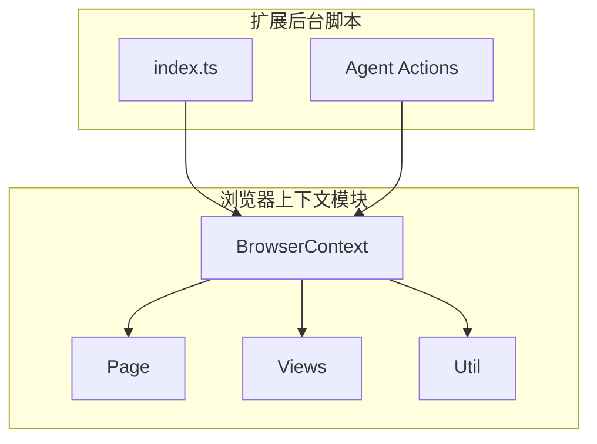
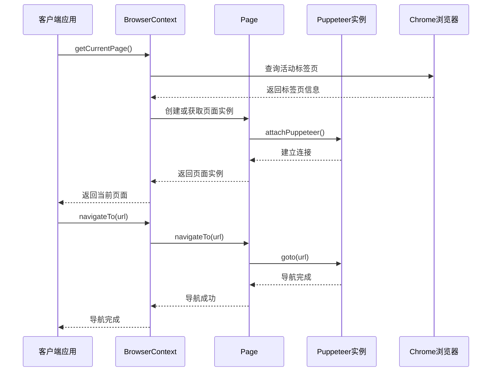
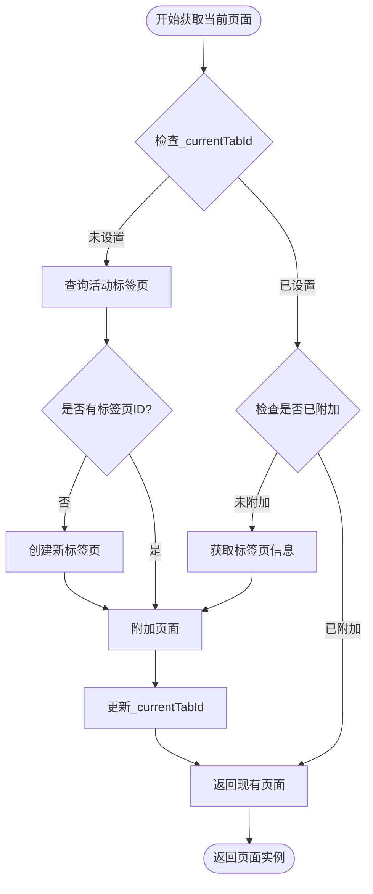
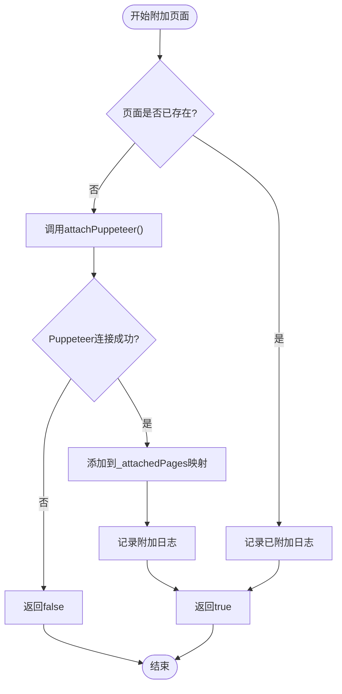
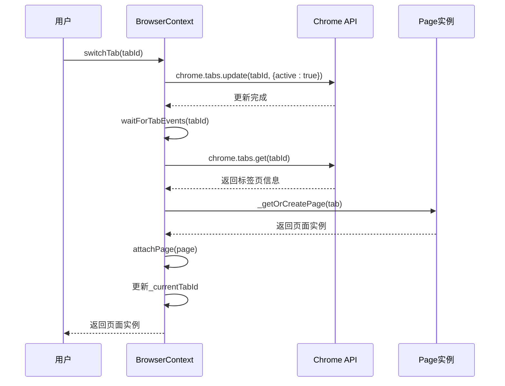
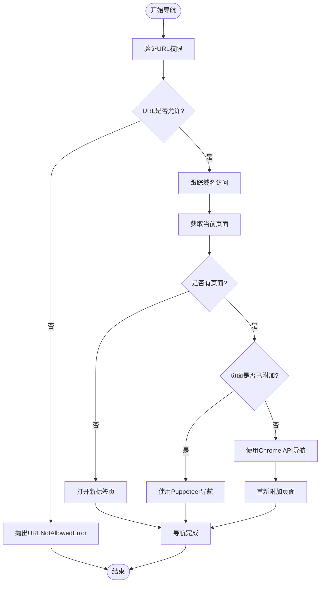
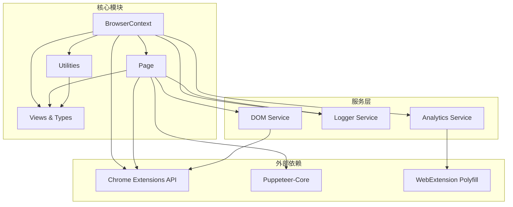

# BrowserContext API 文档

<cite>
**本文档中引用的文件**
- [context.ts](file://chrome-extension/src/background/browser/context.ts)
- [page.ts](file://chrome-extension/src/background/browser/page.ts)
- [views.ts](file://chrome-extension/src/background/browser/views.ts)
- [util.ts](file://chrome-extension/src/background/browser/util.ts)
- [index.ts](file://chrome-extension/src/background/index.ts)
- [builder.ts](file://chrome-extension/src/background/agent/actions/builder.ts)
</cite>

## 目录
1. [简介](#简介)
2. [项目结构](#项目结构)
3. [核心组件](#核心组件)
4. [架构概览](#架构概览)
5. [详细组件分析](#详细组件分析)
6. [依赖关系分析](#依赖关系分析)
7. [性能考虑](#性能考虑)
8. [故障排除指南](#故障排除指南)
9. [结论](#结论)

## 简介

BrowserContext API 是一个强大的浏览器上下文管理系统，专为 Chrome 扩展设计，提供了完整的页面管理和标签页操作功能。该 API 允许开发者在扩展中高效地管理多个浏览器标签页的状态、执行导航操作，并获取当前浏览器环境信息。

主要功能包括：
- 页面生命周期管理（创建、附加、分离）
- 标签页操作（切换、打开、关闭）
- 导航控制和 URL 验证
- 浏览器状态获取和缓存
- 错误处理和超时机制
- 视觉信息处理选项

## 项目结构

BrowserContext API 的核心文件组织结构如下：

**图表来源**
- [context.ts](file://chrome-extension/src/background/browser/context.ts#L1-L361)
- [page.ts](file://chrome-extension/src/background/browser/page.ts#L1-L1623)
- [views.ts](file://chrome-extension/src/background/browser/views.ts#L1-L152)

**章节来源**
- [context.ts](file://chrome-extension/src/background/browser/context.ts#L1-L50)
- [page.ts](file://chrome-extension/src/background/browser/page.ts#L1-L50)

## 核心组件

### BrowserContext 类

BrowserContext 是整个系统的核心类，负责管理浏览器上下文和页面生命周期。

#### 主要属性
- `_config`: 浏览器上下文配置对象
- `_currentTabId`: 当前活动标签页 ID
- `_attachedPages`: 已附加页面的映射表

#### 核心方法
- `getCurrentPage()`: 获取当前页面实例
- `attachPage(page)`: 附加页面到上下文
- `detachPage(tabId)`: 从上下文分离页面
- `switchTab(tabId)`: 切换到指定标签页
- `openTab(url)`: 在新标签页打开指定 URL
- `closeTab(tabId)`: 关闭指定标签页

### Page 类

Page 类代表单个浏览器标签页，提供页面特定的操作和状态管理。

#### 主要属性
- `_tabId`: 标签页 ID
- `_browser`: Puppeteer 浏览器实例
- `_puppeteerPage`: Puppeteer 页面实例
- `_state`: 页面状态对象
- `_validWebPage`: 页面有效性标志

#### 核心方法
- `attachPuppeteer()`: 连接到 Puppeteer 实例
- `detachPuppeteer()`: 断开 Puppeteer 连接
- `navigateTo(url)`: 导航到指定 URL
- `getState(useVision)`: 获取页面状态
- `takeScreenshot()`: 截取页面截图

**章节来源**
- [context.ts](file://chrome-extension/src/background/browser/context.ts#L14-L359)
- [page.ts](file://chrome-extension/src/background/browser/page.ts#L60-L628)

## 架构概览

BrowserContext API 采用分层架构设计，确保了良好的可维护性和扩展性：

**图表来源**
- [context.ts](file://chrome-extension/src/background/browser/context.ts#L89-L154)
- [page.ts](file://chrome-extension/src/background/browser/page.ts#L480-L520)

## 详细组件分析

### 页面管理方法

#### getCurrentPage()

获取当前活动页面的完整实现流程：

**图表来源**
- [context.ts](file://chrome-extension/src/background/browser/context.ts#L89-L154)

**方法签名**: `async getCurrentPage(): Promise<Page>`

**参数约束**: 无

**异步行为**: 
- 异步查询 Chrome 标签页 API
- 可能触发页面创建和附加操作
- 支持自动创建空白标签页作为后备方案

**使用场景**:
- 获取当前正在浏览的页面
- 自动恢复用户会话状态
- 实现页面状态同步

#### attachPage()

页面附加机制确保页面与 Puppeteer 实例正确连接：

**图表来源**
- [context.ts](file://chrome-extension/src/background/browser/context.ts#L64-L80)

**方法签名**: `async attachPage(page: Page): Promise<boolean>`

**参数约束**:
- `page`: 必须是有效的 Page 实例
- 页面必须有有效的标签页 ID

**异步行为**:
- 调用 Puppeteer 连接建立过程
- 添加页面到内部管理映射
- 处理连接失败情况

#### detachPage()

页面分离操作清理资源并移除页面引用：

**方法签名**: `async detachPage(tabId: number): Promise<void>`

**参数约束**:
- `tabId`: 必须是存在的标签页 ID

**异步行为**:
- 调用页面的 `detachPuppeteer()` 方法
- 从内部映射中删除页面引用
- 清理相关资源

**章节来源**
- [context.ts](file://chrome-extension/src/background/browser/context.ts#L82-L89)
- [context.ts](file://chrome-extension/src/background/browser/context.ts#L64-L80)

### 标签页操作 API

#### switchTab()

标签页切换功能支持在不同标签页之间无缝导航：

**图表来源**
- [context.ts](file://chrome-extension/src/background/browser/context.ts#L200-L220)

**方法签名**: `async switchTab(tabId: number): Promise<Page>`

**参数约束**:
- `tabId`: 必须是存在的标签页 ID
- 标签页必须可访问

**异步行为**:
- 更新 Chrome 标签页激活状态
- 等待标签页事件完成
- 重新附加页面实例
- 更新当前标签页标识

#### openTab()

新标签页创建功能支持程序化打开网页：

**方法签名**: `async openTab(url: string): Promise<Page>`

**参数约束**:
- `url`: 必须是有效的 URL 字符串
- URL 必须通过防火墙验证

**异步行为**:
- 创建新标签页
- 等待标签页加载完成
- 获取更新后的标签页信息
- 创建并附加页面实例

#### closeTab()

标签页关闭操作清理相关资源：

**方法签名**: `async closeTab(tabId: number): Promise<void>`

**参数约束**:
- `tabId`: 必须是存在的标签页 ID

**异步行为**:
- 分离页面实例
- 删除标签页
- 更新当前标签页标识（如果需要）

**章节来源**
- [context.ts](file://chrome-extension/src/background/browser/context.ts#L200-L220)
- [context.ts](file://chrome-extension/src/background/browser/context.ts#L240-L275)
- [context.ts](file://chrome-extension/src/background/browser/context.ts#L275-L285)

### 导航控制功能

#### navigateTo()

URL 导航功能包含完整的验证和处理机制：

**图表来源**
- [context.ts](file://chrome-extension/src/background/browser/context.ts#L232-L258)

**方法签名**: `async navigateTo(url: string): Promise<void>`

**参数约束**:
- `url`: 必须是有效的 URL 字符串
- URL 必须通过防火墙验证

**URL 验证机制**:
- 检查危险 URL 前缀（javascript:, data:, file: 等）
- 验证允许/拒绝列表
- 处理协议规范化
- 支持域名级过滤

**异步行为**:
- 并行等待页面加载和网络稳定
- 处理导航超时情况
- 自动重试机制
- 错误恢复策略

**章节来源**
- [context.ts](file://chrome-extension/src/background/browser/context.ts#L232-L258)
- [util.ts](file://chrome-extension/src/background/browser/util.ts#L1-L106)

### 浏览器状态获取

#### getState() vs getCachedState()

两种状态获取方法的区别和适用场景：

| 方法 | 缓存策略 | 性能特点 | 适用场景 |
|------|----------|----------|----------|
| `getState()` | 不使用缓存 | 最新状态，可能较慢 | 需要精确状态时 |
| `getCachedState()` | 使用缓存 | 快速响应，可能有延迟 | 实时交互场景 |

**方法签名**:
- `async getState(useVision = false, cacheClickableElementsHashes = false): Promise<BrowserState>`
- `async getCachedState(useVision = false, cacheClickableElementsHashes = false): Promise<BrowserState>`

**参数约束**:
- `useVision`: 是否启用视觉信息处理
- `cacheClickableElementsHashes`: 是否缓存可点击元素哈希值

**视觉信息处理选项**:
- `useVision = true`: 包含页面截图和视觉元素信息
- `cacheClickableElementsHashes = true`: 启用元素变化检测

**章节来源**
- [context.ts](file://chrome-extension/src/background/browser/context.ts#L325-L359)
- [context.ts](file://chrome-extension/src/background/browser/context.ts#L300-L324)

## 依赖关系分析

BrowserContext API 的依赖关系图展示了各组件之间的交互：

**图表来源**
- [context.ts](file://chrome-extension/src/background/browser/context.ts#L1-L13)
- [page.ts](file://chrome-extension/src/background/browser/page.ts#L1-L18)

**章节来源**
- [context.ts](file://chrome-extension/src/background/browser/context.ts#L1-L13)
- [page.ts](file://chrome-extension/src/background/browser/page.ts#L1-L18)

## 性能考虑

### 状态缓存优化

BrowserContext API 实现了多层次的缓存策略来提升性能：

1. **页面状态缓存**: 避免重复的 DOM 解析和状态计算
2. **可点击元素哈希缓存**: 检测元素变化而无需完全重新解析
3. **Puppeteer 连接复用**: 减少连接建立的开销
4. **异步操作批处理**: 并行处理多个标签页操作

### 资源管理

- **自动清理机制**: 标签页关闭时自动清理相关资源
- **内存泄漏防护**: 及时断开 Puppeteer 连接
- **事件监听器管理**: 正确移除不再需要的事件监听器

### 网络优化

- **智能等待策略**: 根据页面内容动态调整等待时间
- **超时处理**: 防止长时间阻塞操作
- **重试机制**: 处理临时性网络问题

## 故障排除指南

### 常见错误类型

#### URLNotAllowedError

**原因**: 尝试访问被防火墙规则阻止的 URL

**解决方案**:
- 检查 `allowedUrls` 和 `deniedUrls` 配置
- 验证 URL 格式和协议
- 使用 `isUrlAllowed()` 函数进行预验证

#### 页面连接失败

**原因**: Puppeteer 连接建立失败或页面不可访问

**解决方案**:
- 检查页面是否有效（非 chrome:// 协议）
- 验证标签页是否仍然存在
- 重新尝试页面附加操作

#### 导航超时

**原因**: 页面加载时间超过最大等待时间

**解决方案**:
- 调整 `maximumWaitPageLoadTime` 配置
- 检查网络连接状况
- 使用更宽松的等待条件

### 调试技巧

1. **启用详细日志**: 设置适当的日志级别查看详细执行信息
2. **监控状态变化**: 使用 `getState()` 和 `getCachedState()` 检查状态差异
3. **检查连接状态**: 验证 Puppeteer 连接是否正常
4. **验证配置**: 确认防火墙和权限配置正确

**章节来源**
- [util.ts](file://chrome-extension/src/background/browser/util.ts#L1-L106)
- [page.ts](file://chrome-extension/src/background/browser/page.ts#L480-L520)

## 结论

BrowserContext API 提供了一个功能完整且高性能的浏览器上下文管理解决方案。其设计充分考虑了 Chrome 扩展开发的需求，通过分层架构、智能缓存和完善的错误处理机制，为开发者提供了可靠的页面管理和标签页操作能力。

### 主要优势

1. **完整的生命周期管理**: 从页面创建到销毁的全流程控制
2. **智能状态缓存**: 平衡性能和数据准确性
3. **强大的错误处理**: 完善的异常捕获和恢复机制
4. **灵活的配置选项**: 支持多种使用场景和需求定制
5. **高效的资源管理**: 自动清理和连接复用机制

### 最佳实践建议

1. **合理使用缓存**: 根据具体需求选择合适的缓存策略
2. **及时清理资源**: 在不需要时主动释放页面资源
3. **配置防火墙规则**: 根据安全要求设置适当的 URL 过滤
4. **监控性能指标**: 定期检查 API 性能和资源使用情况
5. **处理异步操作**: 正确处理所有异步方法的返回值和错误

通过遵循这些指导原则和最佳实践，开发者可以充分利用 BrowserContext API 的强大功能，构建高质量的 Chrome 扩展应用。