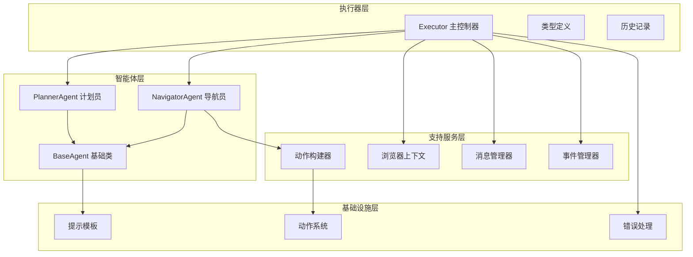
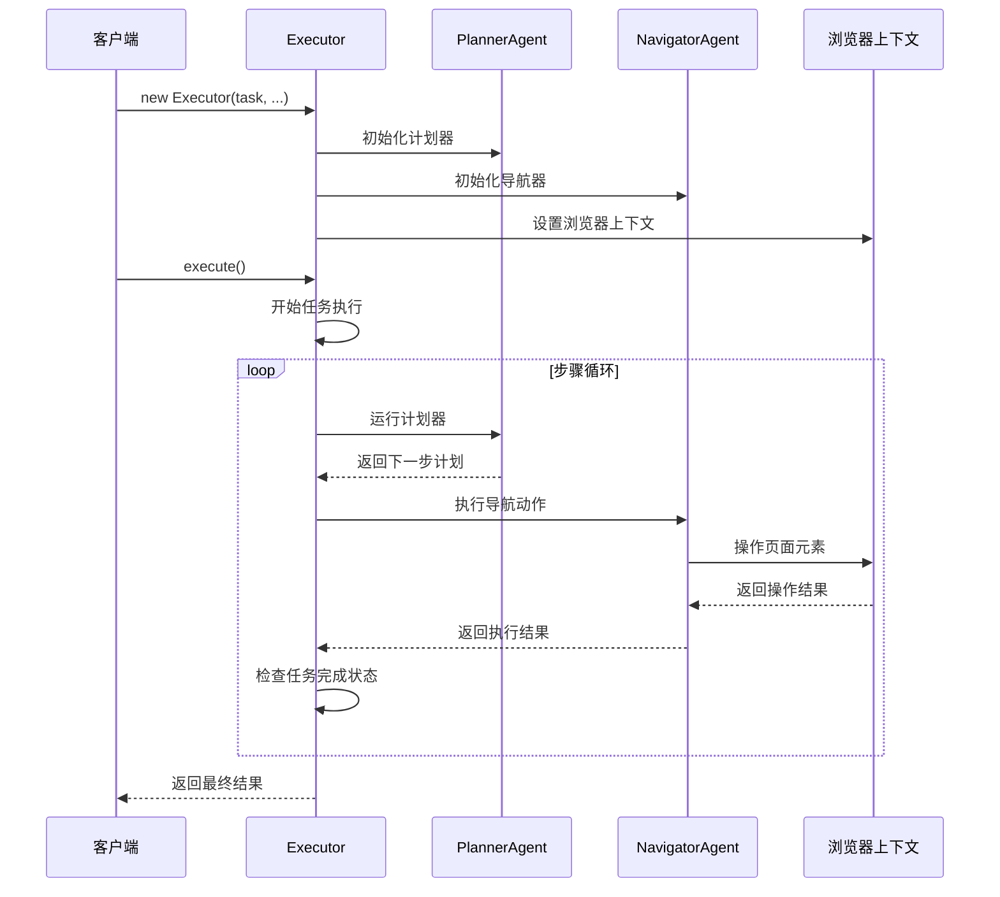
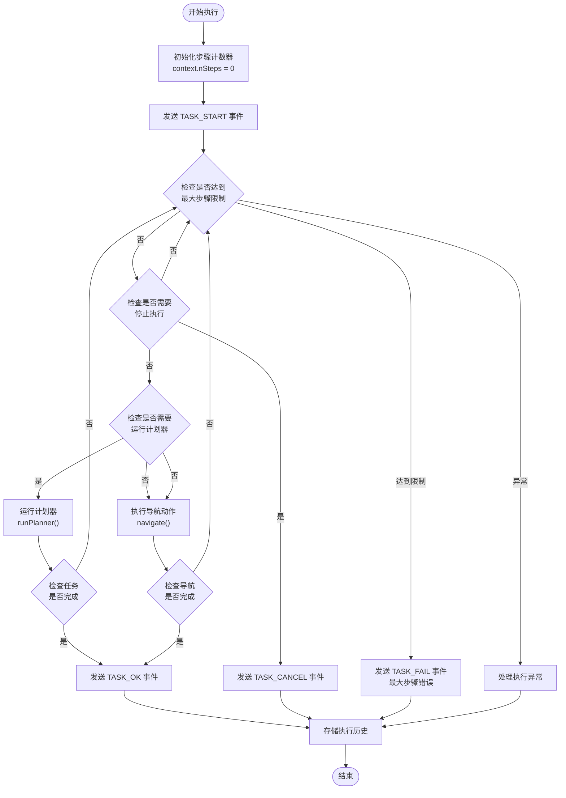
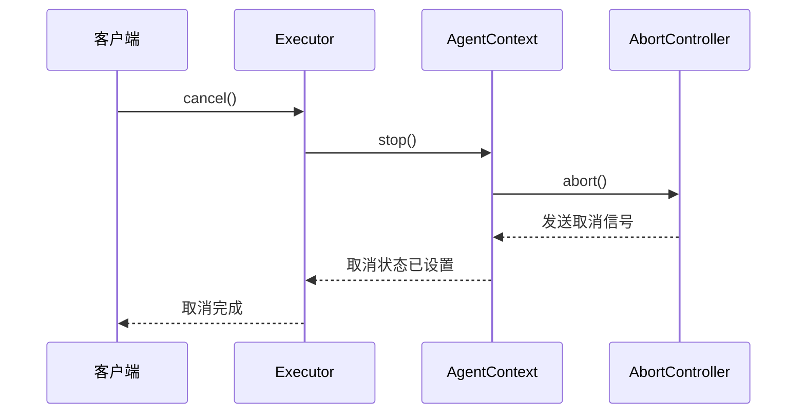
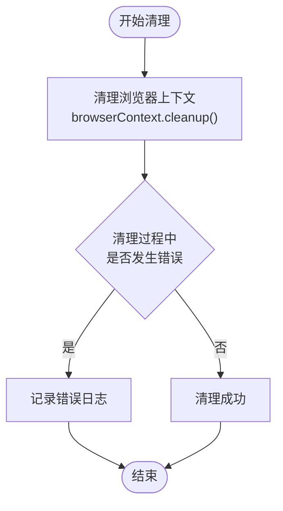
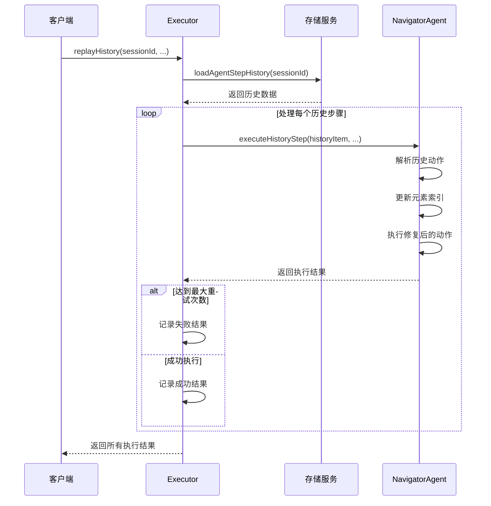
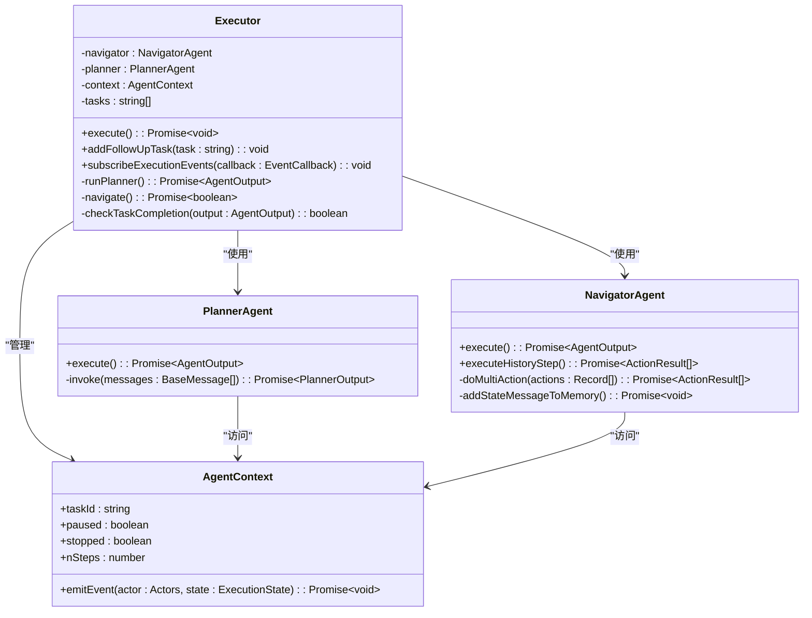
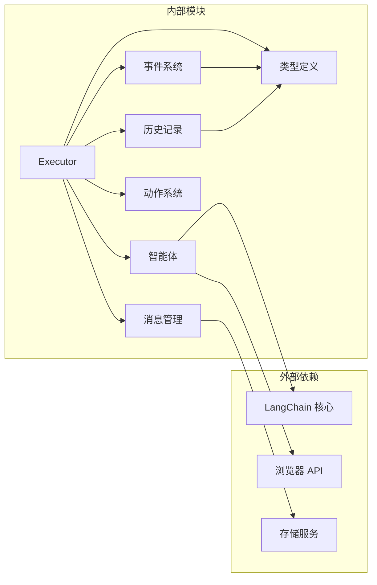
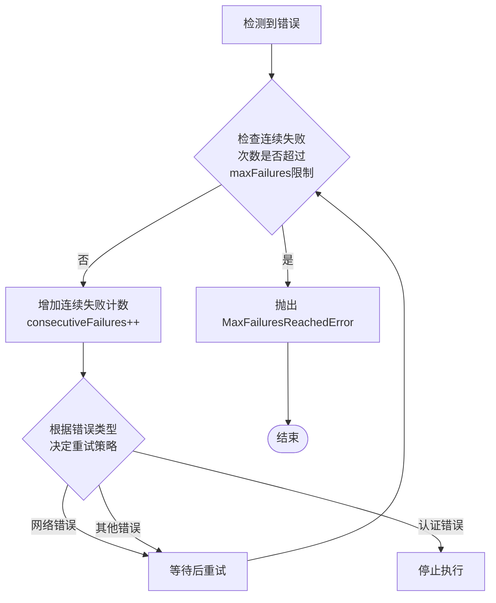

# Executor API 文档

<cite>
**本文档中引用的文件**
- [executor.ts](file://chrome-extension/src/background/agent/executor.ts)
- [types.ts](file://chrome-extension/src/background/agent/types.ts)
- [history.ts](file://chrome-extension/src/background/agent/history.ts)
- [planner.ts](file://chrome-extension/src/background/agent/agents/planner.ts)
- [navigator.ts](file://chrome-extension/src/background/agent/agents/navigator.ts)
- [base.ts](file://chrome-extension/src/background/agent/agents/base.ts)
- [index.ts](file://chrome-extension/src/background/index.ts)
- [event/types.ts](file://chrome-extension/src/background/agent/event/types.ts)
</cite>

## 目录
1. [简介](#简介)
2. [项目结构](#项目结构)
3. [核心组件](#核心组件)
4. [架构概览](#架构概览)
5. [详细组件分析](#详细组件分析)
6. [依赖关系分析](#依赖关系分析)
7. [性能考虑](#性能考虑)
8. [故障排除指南](#故障排除指南)
9. [结论](#结论)

## 简介

Executor 类是 NanoBrowser 扩展中的核心控制器，负责协调多智能体系统的任务执行。它作为任务生命周期管理和智能体协作的中央枢纽，实现了复杂的多步骤网页操作自动化。Executor 通过整合 Planner 智能体的任务规划能力和 Navigator 智能体的页面导航能力，为用户提供强大的网页自动化解决方案。

该系统采用事件驱动架构，支持实时状态监控、任务暂停/恢复、错误重试和历史任务重放等高级功能。Executor 的设计充分考虑了生产环境的稳定性要求，提供了完善的错误处理机制和性能优化策略。

## 项目结构

Executor API 的项目结构体现了清晰的分层架构设计：

**图表来源**
- [executor.ts](file://chrome-extension/src/background/agent/executor.ts#L1-L435)
- [types.ts](file://chrome-extension/src/background/agent/types.ts#L1-L181)
- [base.ts](file://chrome-extension/src/background/agent/agents/base.ts#L1-L211)

**章节来源**
- [executor.ts](file://chrome-extension/src/background/agent/executor.ts#L1-L50)
- [types.ts](file://chrome-extension/src/background/agent/types.ts#L1-L30)

## 核心组件

### Executor 类概述

Executor 类是整个系统的核心控制器，负责：
- 任务生命周期管理（启动、执行、暂停、恢复、取消）
- Planner 和 Navigator 智能体的协调调度
- 任务状态监控和事件通知
- 错误处理和重试机制
- 历史任务重放功能

### 构造函数详解

Executor 的构造函数接受以下参数：

| 参数名 | 类型 | 描述 | 必需 |
|--------|------|------|------|
| task | string | 要执行的任务描述 | 是 |
| taskId | string | 任务唯一标识符 | 是 |
| browserContext | BrowserContext | 浏览器上下文实例 | 是 |
| navigatorLLM | BaseChatModel | 导航器使用的语言模型 | 是 |
| extraArgs | ExecutorExtraArgs | 额外配置参数 | 否 |

#### 额外配置参数

| 配置项 | 类型 | 默认值 | 描述 |
|--------|------|--------|------|
| plannerLLM | BaseChatModel | navigatorLLM | 计划器专用的语言模型 |
| extractorLLM | BaseChatModel | navigatorLLM | 内容提取专用的语言模型 |
| agentOptions | Partial<AgentOptions> | {} | 智能体通用配置选项 |
| generalSettings | GeneralSettingsConfig | undefined | 全局设置配置 |

**章节来源**
- [executor.ts](file://chrome-extension/src/background/agent/executor.ts#L35-L85)
- [types.ts](file://chrome-extension/src/background/agent/types.ts#L10-L25)

## 架构概览

Executor 采用事件驱动的异步架构，通过智能体协作实现复杂任务的分解和执行：

**图表来源**
- [executor.ts](file://chrome-extension/src/background/agent/executor.ts#L95-L180)
- [planner.ts](file://chrome-extension/src/background/agent/agents/planner.ts#L35-L85)
- [navigator.ts](file://chrome-extension/src/background/agent/agents/navigator.ts#L130-L200)

## 详细组件分析

### execute 方法执行流程

execute 方法是 Executor 的核心执行引擎，实现了复杂的任务执行逻辑：

**图表来源**
- [executor.ts](file://chrome-extension/src/background/agent/executor.ts#L95-L230)

#### 关键执行阶段

1. **初始化阶段**：设置执行上下文，初始化计数器和事件管理器
2. **计划器周期性调用**：每 N 步调用一次 Planner 获取新的执行计划
3. **导航执行阶段**：执行单个导航动作，处理页面交互
4. **状态检查阶段**：验证任务完成状态或错误条件
5. **清理和存储阶段**：保存执行历史，触发相关事件

**章节来源**
- [executor.ts](file://chrome-extension/src/background/agent/executor.ts#L95-L230)

### 生命周期控制方法

#### cancel 方法

取消当前正在执行的任务：

**图表来源**
- [executor.ts](file://chrome-extension/src/background/agent/executor.ts#L340-L345)
- [types.ts](file://chrome-extension/src/background/agent/types.ts#L85-L95)

#### pause 和 resume 方法

任务暂停和恢复机制：

| 方法 | 功能 | 实现方式 | 使用场景 |
|------|------|----------|----------|
| pause() | 暂停任务执行 | 设置 context.paused = true | 用户主动暂停 |
| resume() | 恢复任务执行 | 设置 context.paused = false | 用户恢复执行 |
| shouldStop() | 检查停止条件 | 轮询 context.paused 状态 | 循环中定期检查 |

#### cleanup 方法

清理浏览器上下文资源：

**图表来源**
- [executor.ts](file://chrome-extension/src/background/agent/executor.ts#L350-L360)

**章节来源**
- [executor.ts](file://chrome-extension/src/background/agent/executor.ts#L340-L360)

### replayHistory 方法

历史任务重放机制提供了强大的调试和重现功能：

**图表来源**
- [executor.ts](file://chrome-extension/src/background/agent/executor.ts#L365-L435)

#### 重放参数配置

| 参数名 | 类型 | 默认值 | 描述 |
|--------|------|--------|------|
| maxRetries | number | 3 | 每个动作的最大重试次数 |
| skipFailures | boolean | true | 是否跳过失败的动作 |
| delayBetweenActions | number | 2.0 | 动作间的延迟时间（秒） |

**章节来源**
- [executor.ts](file://chrome-extension/src/background/agent/executor.ts#L365-L435)

### 智能体协作机制

Executor 通过精心设计的协作模式协调 Planner 和 Navigator 智能体：

**图表来源**
- [executor.ts](file://chrome-extension/src/background/agent/executor.ts#L30-L85)
- [planner.ts](file://chrome-extension/src/background/agent/agents/planner.ts#L35-L50)
- [navigator.ts](file://chrome-extension/src/background/agent/agents/navigator.ts#L60-L85)

#### 协作流程详解

1. **计划器阶段**：Planner 分析当前页面状态，制定下一步行动计划
2. **导航执行阶段**：Navigator 根据计划执行具体的操作动作
3. **状态同步阶段**：两个智能体通过共享的 AgentContext 进行状态同步
4. **结果验证阶段**：验证导航结果是否符合预期计划

**章节来源**
- [executor.ts](file://chrome-extension/src/background/agent/executor.ts#L130-L180)
- [planner.ts](file://chrome-extension/src/background/agent/agents/planner.ts#L35-L85)
- [navigator.ts](file://chrome-extension/src/background/agent/agents/navigator.ts#L130-L200)

## 依赖关系分析

Executor 的依赖关系体现了模块化设计的优势：

**图表来源**
- [executor.ts](file://chrome-extension/src/background/agent/executor.ts#L1-L20)
- [types.ts](file://chrome-extension/src/background/agent/types.ts#L1-L15)

### 核心依赖说明

| 依赖模块 | 版本要求 | 用途 | 替代方案 |
|----------|----------|------|----------|
| @langchain/core | 最新版本 | 语言模型集成 | 自定义 LLM 接口 |
| 浏览器扩展 API | Chrome 扩展规范 | 页面操作控制 | Puppeteer 等替代方案 |
| 存储服务 | 内置存储接口 | 历史记录持久化 | IndexedDB 或其他存储 |

**章节来源**
- [executor.ts](file://chrome-extension/src/background/agent/executor.ts#L1-L20)
- [types.ts](file://chrome-extension/src/background/agent/types.ts#L1-L15)

## 性能考虑

### 最大步骤数配置

合理的最大步骤数配置对系统性能至关重要：

| 配置项 | 推荐值 | 影响因素 | 优化建议 |
|--------|--------|----------|----------|
| maxSteps | 100 | 任务复杂度、页面加载时间 | 根据具体任务调整 |
| maxActionsPerStep | 10 | 页面元素数量、操作复杂度 | 平衡效率和准确性 |
| planningInterval | 3 | 任务动态性、页面变化频率 | 频繁变化的页面可设为2 |

### 错误重试策略

系统实现了多层次的错误处理和重试机制：

**图表来源**
- [executor.ts](file://chrome-extension/src/background/agent/executor.ts#L280-L320)

### 内存管理优化

1. **消息历史管理**：通过 `includeInMemory` 标志控制哪些结果应该保留在内存中
2. **状态消息去重**：避免重复添加相同的状态消息到记忆中
3. **及时清理**：执行完成后自动清理浏览器上下文资源

**章节来源**
- [executor.ts](file://chrome-extension/src/background/agent/executor.ts#L110-L130)
- [navigator.ts](file://chrome-extension/src/background/agent/agents/navigator.ts#L350-L400)

## 故障排除指南

### 常见错误类型

| 错误类型 | 错误代码 | 原因分析 | 解决方案 |
|----------|----------|----------|----------|
| MaxStepsReachedError | MAX_STEPS_REACHED | 达到最大执行步骤限制 | 增加 maxSteps 或优化任务计划 |
| MaxFailuresReachedError | MAX_FAILURES_REACHED | 连续失败次数过多 | 检查网络连接和页面稳定性 |
| RequestCancelledError | REQUEST_CANCELLED | 用户主动取消任务 | 检查用户交互逻辑 |
| ChatModelAuthError | AUTH_ERROR | LLM 认证失败 | 检查 API 密钥配置 |

### 调试技巧

1. **启用开发模式日志**：设置 `import.meta.env.DEV = true` 查看详细执行日志
2. **监控事件流**：通过 `subscribeExecutionEvents()` 监控任务执行状态
3. **检查历史记录**：使用 `replayHistory()` 重现问题场景
4. **分析执行统计**：观察步骤计数和失败率指标

### 性能优化建议

1. **合理设置超时时间**：根据目标网站响应速度调整超时参数
2. **优化提示模板**：精简提示内容，提高模型响应速度
3. **批量操作优化**：合并相似的操作请求，减少 API 调用次数
4. **缓存策略**：利用浏览器缓存减少重复的页面加载

**章节来源**
- [executor.ts](file://chrome-extension/src/background/agent/executor.ts#L200-L230)
- [types.ts](file://chrome-extension/src/background/agent/types.ts#L15-L25)

## 结论

Executor API 作为 NanoBrowser 扩展的核心组件，展现了现代 AI 驱动的网页自动化系统的最佳实践。通过精心设计的架构，它成功地将复杂的多智能体协作转化为简单易用的 API 接口。

### 主要优势

1. **模块化设计**：清晰的职责分离使得系统易于维护和扩展
2. **事件驱动架构**：实时状态反馈和灵活的事件处理机制
3. **容错性强**：完善的错误处理和重试策略确保系统稳定性
4. **可调试性好**：丰富的日志记录和历史重放功能便于问题诊断

### 应用场景

Executor API 特别适用于以下场景：
- 自动化测试和质量保证
- 数据采集和信息提取
- 重复性网页操作任务
- 智能表单填写和提交
- 网页内容分析和监控

### 未来发展方向

1. **性能优化**：进一步优化执行效率和资源利用率
2. **功能扩展**：支持更多类型的网页操作和交互
3. **智能增强**：集成更先进的机器学习算法提升任务理解能力
4. **生态建设**：构建更丰富的插件和扩展生态系统

通过本文档的详细介绍，开发者可以全面理解 Executor API 的设计理念、使用方法和最佳实践，为构建高质量的网页自动化应用奠定坚实基础。