# 后台脚本API

<cite>
**本文档中引用的文件**
- [executor.ts](file://chrome-extension/src/background/agent/executor.ts)
- [context.ts](file://chrome-extension/src/background/browser/context.ts)
- [manager.ts](file://chrome-extension/src/background/agent/event/manager.ts)
- [types.ts](file://chrome-extension/src/background/agent/types.ts)
- [page.ts](file://chrome-extension/src/background/browser/page.ts)
- [views.ts](file://chrome-extension/src/background/browser/views.ts)
- [history.ts](file://chrome-extension/src/background/agent/history.ts)
- [views.ts](file://chrome-extension/src/background/browser/dom/views.ts)
- [service.ts](file://chrome-extension/src/background/agent/messages/service.ts)
- [types.ts](file://chrome-extension/src/background/agent/event/types.ts)
- [errors.ts](file://chrome-extension/src/background/agent/agents/errors.ts)
- [index.ts](file://chrome-extension/src/background/index.ts)
</cite>

## 目录
1. [简介](#简介)
2. [项目结构](#项目结构)
3. [核心组件](#核心组件)
4. [架构概览](#架构概览)
5. [详细组件分析](#详细组件分析)
6. [依赖关系分析](#依赖关系分析)
7. [性能考虑](#性能考虑)
8. [故障排除指南](#故障排除指南)
9. [结论](#结论)

## 简介

NanoBrowser是一个基于Chrome扩展的智能网页自动化系统，提供了强大的后台脚本API。该系统通过Executor类协调多个智能代理（Navigator和Planner）完成复杂的网页交互任务，同时提供了完善的浏览器上下文管理和事件驱动架构。

本文档详细介绍了系统的核心API，包括Executor类的构造函数、执行方法、状态管理，BrowserContext类的页面操作和导航控制，以及各个核心类之间的协作机制。

## 项目结构

系统采用模块化架构，主要分为以下几个核心模块：


**图表来源**
- [executor.ts](file://chrome-extension/src/background/agent/executor.ts#L1-L50)
- [context.ts](file://chrome-extension/src/background/browser/context.ts#L1-L30)
- [manager.ts](file://chrome-extension/src/background/agent/event/manager.ts#L1-L20)

**章节来源**
- [executor.ts](file://chrome-extension/src/background/agent/executor.ts#L1-L435)
- [context.ts](file://chrome-extension/src/background/browser/context.ts#L1-L361)

## 核心组件

### Executor类 - 主执行器

Executor类是整个系统的核心控制器，负责协调所有代理的执行流程。

#### 构造函数

```typescript
constructor(
  task: string,
  taskId: string,
  browserContext: BrowserContext,
  navigatorLLM: BaseChatModel,
  extraArgs?: Partial<ExecutorExtraArgs>,
)
```

**参数说明：**
- `task`: 要执行的任务描述
- `taskId`: 唯一的任务标识符
- `browserContext`: 浏览器上下文实例
- `navigatorLLM`: 导航代理使用的语言模型
- `extraArgs`: 可选的额外参数配置

**配置选项：**
- `plannerLLM`: 规划代理使用的语言模型（可选，默认与导航模型相同）
- `extractorLLM`: 提取器使用的语言模型（可选，默认与导航模型相同）
- `agentOptions`: 代理配置选项
- `generalSettings`: 通用设置配置

#### 核心方法

##### execute()

异步执行任务的主要方法，包含完整的执行生命周期：


**图表来源**
- [executor.ts](file://chrome-extension/src/background/agent/executor.ts#L120-L200)

##### cancel()

取消当前正在执行的任务：

```typescript
async cancel(): Promise<void>
```

##### pause()

暂停任务执行：

```typescript
async pause(): Promise<void>
```

##### resume()

恢复暂停的任务：

```typescript
async resume(): Promise<void>
```

##### cleanup()

清理浏览器上下文资源：

```typescript
async cleanup(): Promise<void>
```

##### replayHistory()

重放历史操作记录：

```typescript
async replayHistory(
  sessionId: string,
  maxRetries?: number,
  skipFailures?: boolean,
  delayBetweenActions?: number
): Promise<ActionResult[]>
```

**参数说明：**
- `sessionId`: 历史记录会话ID
- `maxRetries`: 最大重试次数（默认3次）
- `skipFailures`: 是否跳过失败的操作
- `delayBetweenActions`: 操作间延迟（秒）

**章节来源**
- [executor.ts](file://chrome-extension/src/background/agent/executor.ts#L40-L435)

### BrowserContext类 - 浏览器上下文管理

BrowserContext类负责管理浏览器窗口、标签页和页面状态。

#### 核心方法

##### getCurrentPage()

获取当前活动页面：

```typescript
async getCurrentPage(): Promise<Page>
```

##### switchTab()

切换到指定标签页：

```typescript
async switchTab(tabId: number): Promise<Page>
```

##### openTab()

打开新标签页：

```typescript
async openTab(url: string): Promise<Page>
```

##### closeTab()

关闭指定标签页：

```typescript
async closeTab(tabId: number): Promise<void>
```

##### navigateTo()

导航到指定URL：

```typescript
async navigateTo(url: string): Promise<void>
```

**章节来源**
- [context.ts](file://chrome-extension/src/background/browser/context.ts#L80-L361)

### AgentContext类 - 代理上下文

AgentContext类为代理提供共享的状态和资源访问。

#### 核心属性

- `controller`: 中止控制器
- `taskId`: 任务唯一标识符
- `browserContext`: 浏览器上下文引用
- `messageManager`: 消息管理器
- `eventManager`: 事件管理器
- `options`: 代理配置选项
- `paused`: 暂停状态标志
- `stopped`: 停止状态标志
- `consecutiveFailures`: 连续失败计数
- `nSteps`: 已执行步骤数
- `actionResults`: 操作结果列表

**章节来源**
- [types.ts](file://chrome-extension/src/background/agent/types.ts#L30-L120)

## 架构概览

系统采用事件驱动的架构模式，通过多个核心类的协作实现复杂的网页自动化功能：


**图表来源**
- [executor.ts](file://chrome-extension/src/background/agent/executor.ts#L120-L200)
- [context.ts](file://chrome-extension/src/background/browser/context.ts#L80-L150)
- [manager.ts](file://chrome-extension/src/background/agent/event/manager.ts#L1-L53)

## 详细组件分析

### Executor类详细分析

#### 执行生命周期管理

Executor类实现了完整的任务执行生命周期，包括初始化、执行、监控和清理阶段：


**图表来源**
- [executor.ts](file://chrome-extension/src/background/agent/executor.ts#L120-L250)

#### 错误处理机制

系统实现了分层的错误处理机制：

```mermaid
flowchart TD
Error[捕获错误] --> CheckType{错误类型判断}
CheckType --> |认证错误| AuthError[ChatModelAuthError]
CheckType --> |权限错误| ForbiddenError[ChatModelForbiddenError]
CheckType --> |请求错误| BadRequestError[ChatModelBadRequestError]
CheckType --> |扩展冲突| ConflictError[ExtensionConflictError]
CheckType --> |其他错误| GenericError[通用错误处理]
AuthError --> LogError[记录错误日志]
ForbiddenError --> LogError
BadRequestError --> LogError
ConflictError --> LogError
GenericError --> LogError
LogError --> CheckRetry{检查重试条件}
CheckRetry --> |可重试| Retry[执行重试]
CheckRetry --> |不可重试| EmitFail[发出失败事件]
Retry --> Success{重试成功?}
Success --> |是| Continue[继续执行]
Success --> |否| MaxFailures{达到最大失败次数?}
MaxFailures --> |是| EmitFail
MaxFailures --> |否| Continue
Continue --> CheckStop{检查停止状态}
CheckStop --> |已停止| EmitCancel[发出取消事件]
CheckStop --> |未停止| NextStep[下一步骤]
```



**图表来源**
- [executor.ts](file://chrome-extension/src/background/agent/executor.ts#L200-L250)
- [errors.ts](file://chrome-extension/src/background/agent/agents/errors.ts#L1-L315)

**章节来源**
- [executor.ts](file://chrome-extension/src/background/agent/executor.ts#L200-L300)
- [errors.ts](file://chrome-extension/src/background/agent/agents/errors.ts#L1-L100)

### BrowserContext类详细分析

#### 页面管理机制

BrowserContext类实现了智能的页面管理策略：


**图表来源**
- [context.ts](file://chrome-extension/src/background/browser/context.ts#L15-L100)
- [page.ts](file://chrome-extension/src/background/browser/page.ts#L50-L150)
- [views.ts](file://chrome-extension/src/background/browser/views.ts#L80-L120)

#### 标签页操作流程


**图表来源**
- [context.ts](file://chrome-extension/src/background/browser/context.ts#L200-L280)

**章节来源**
- [context.ts](file://chrome-extension/src/background/browser/context.ts#L200-L361)

### EventManager类详细分析

EventManager类实现了事件驱动的通信机制：

#### 事件订阅和发布


**图表来源**
- [manager.ts](file://chrome-extension/src/background/agent/event/manager.ts#L1-L53)
- [types.ts](file://chrome-extension/src/background/agent/event/types.ts#L60-L78)

**章节来源**
- [manager.ts](file://chrome-extension/src/background/agent/event/manager.ts#L1-L53)

### MessageManager类详细分析

MessageManager类负责管理与语言模型的对话历史：

#### 消息管理流程


**图表来源**
- [service.ts](file://chrome-extension/src/background/agent/messages/service.ts#L50-L150)

**章节来源**
- [service.ts](file://chrome-extension/src/background/agent/messages/service.ts#L1-L441)

## 依赖关系分析

系统的依赖关系体现了清晰的分层架构：


**图表来源**
- [index.ts](file://chrome-extension/src/background/index.ts#L1-L50)
- [executor.ts](file://chrome-extension/src/background/agent/executor.ts#L1-L30)
- [context.ts](file://chrome-extension/src/background/browser/context.ts#L1-L20)

**章节来源**
- [index.ts](file://chrome-extension/src/background/index.ts#L1-L100)

## 性能考虑

### 状态缓存机制

系统实现了多层缓存机制以提高性能：

1. **页面状态缓存**: Page类维护了页面状态的缓存，避免重复计算
2. **DOM元素哈希缓存**: 使用哈希值快速比较DOM元素变化
3. **历史记录缓存**: 支持历史任务的重放和缓存

### 内存管理

- **自动清理**: 执行完成后自动清理浏览器上下文
- **连接池管理**: Puppeteer连接的智能管理
- **消息历史限制**: 消息历史的令牌限制和自动截断

### 并发控制

- **事件队列**: 事件管理器使用队列确保事件顺序
- **异步操作**: 所有长时间操作都使用异步模式
- **超时控制**: 关键操作设置了合理的超时时间

## 故障排除指南

### 常见错误及解决方案

#### 认证错误处理

当遇到认证相关错误时，系统会：
1. 检查API密钥的有效性
2. 验证权限设置
3. 提供详细的错误信息和解决建议

#### 扩展冲突问题

当检测到扩展冲突时：
1. 显示友好的错误提示
2. 建议在新配置文件中使用
3. 自动清理冲突资源

#### 网页加载超时

对于网页加载超时：
1. 实现智能等待策略
2. 提供网络空闲检测
3. 设置最大等待时间限制

**章节来源**
- [errors.ts](file://chrome-extension/src/background/agent/agents/errors.ts#L100-L200)

### 性能优化建议

1. **合理设置超时时间**: 根据目标网站特性调整等待时间
2. **启用视觉模式**: 对于复杂界面启用视觉识别
3. **优化令牌使用**: 合理配置消息历史长度
4. **使用状态缓存**: 充分利用内置的缓存机制

## 结论

NanoBrowser的后台脚本API提供了一个完整而强大的网页自动化解决方案。通过Executor类的统一调度、BrowserContext类的智能页面管理、EventManger类的事件驱动架构，以及各代理的专业化分工，系统能够高效地完成复杂的网页交互任务。

系统的设计充分考虑了可扩展性、可靠性和易用性，为开发者提供了丰富的API接口和完善的错误处理机制。通过合理的配置和使用，可以满足各种复杂的网页自动化需求。