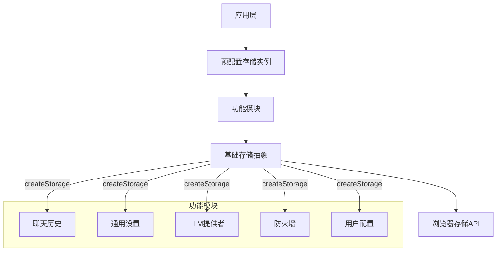
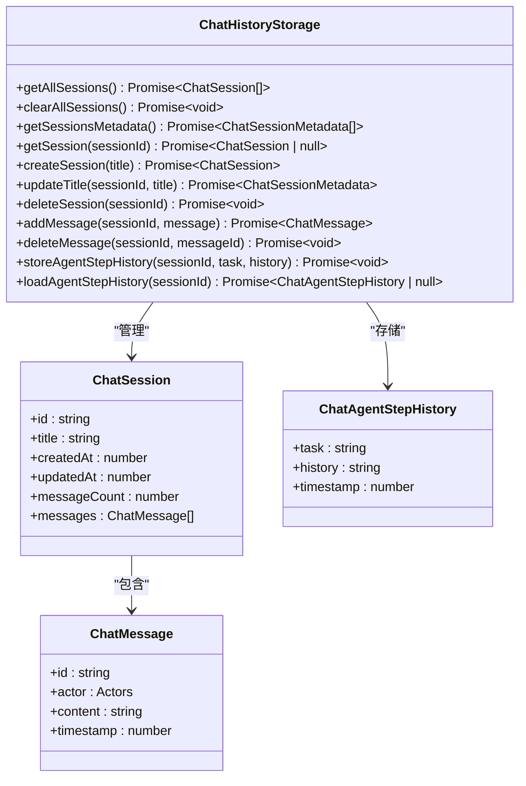
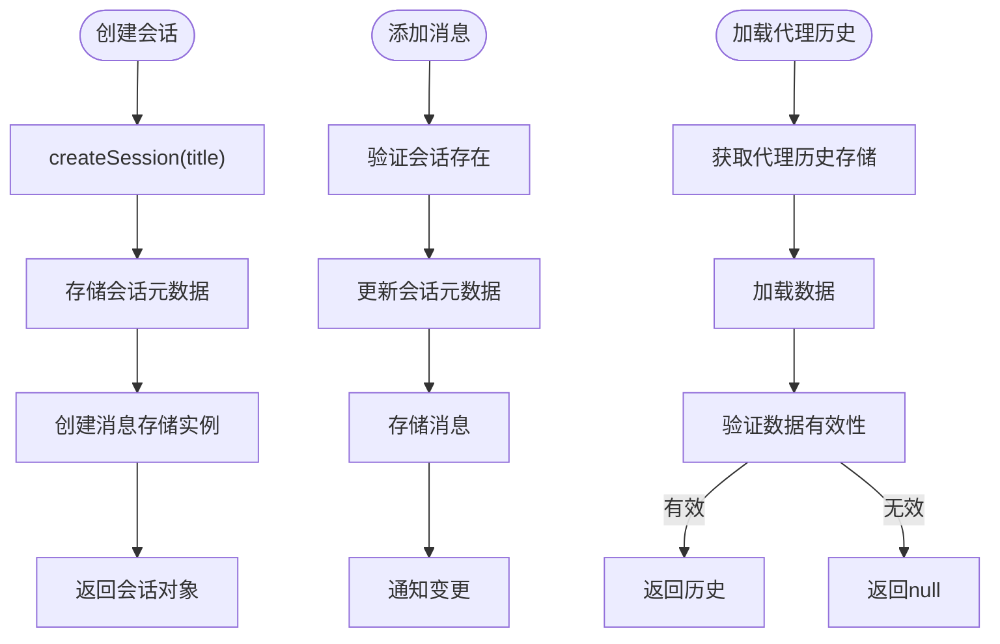
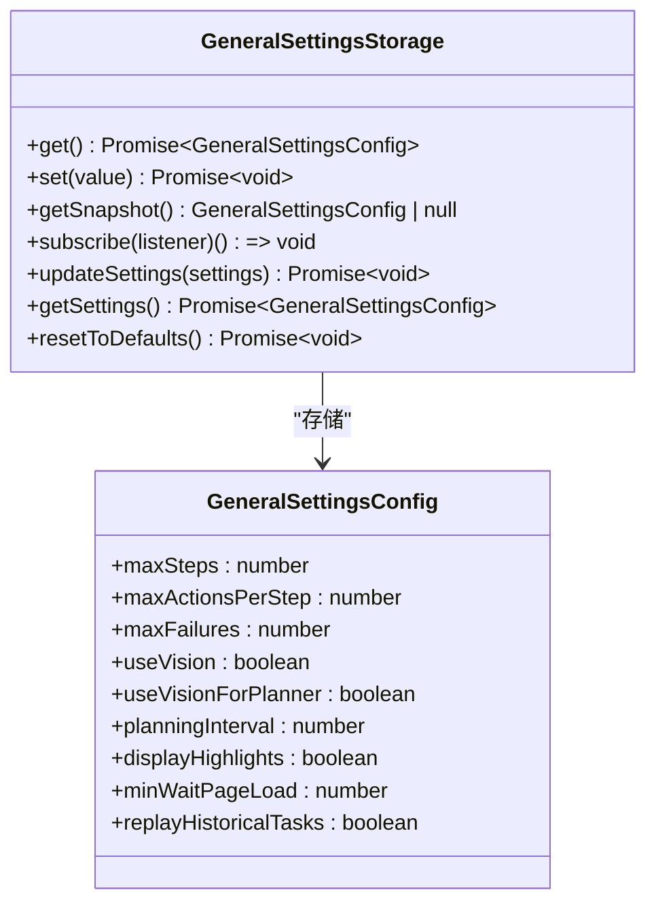
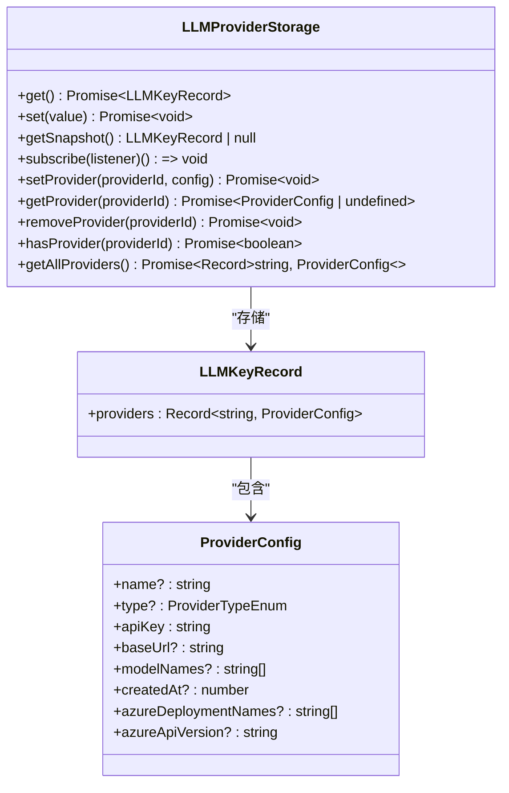
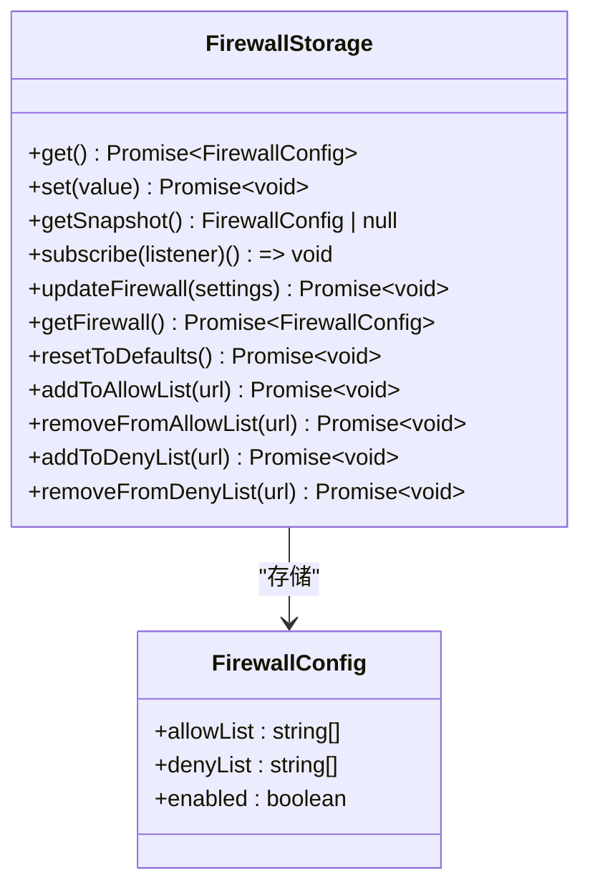
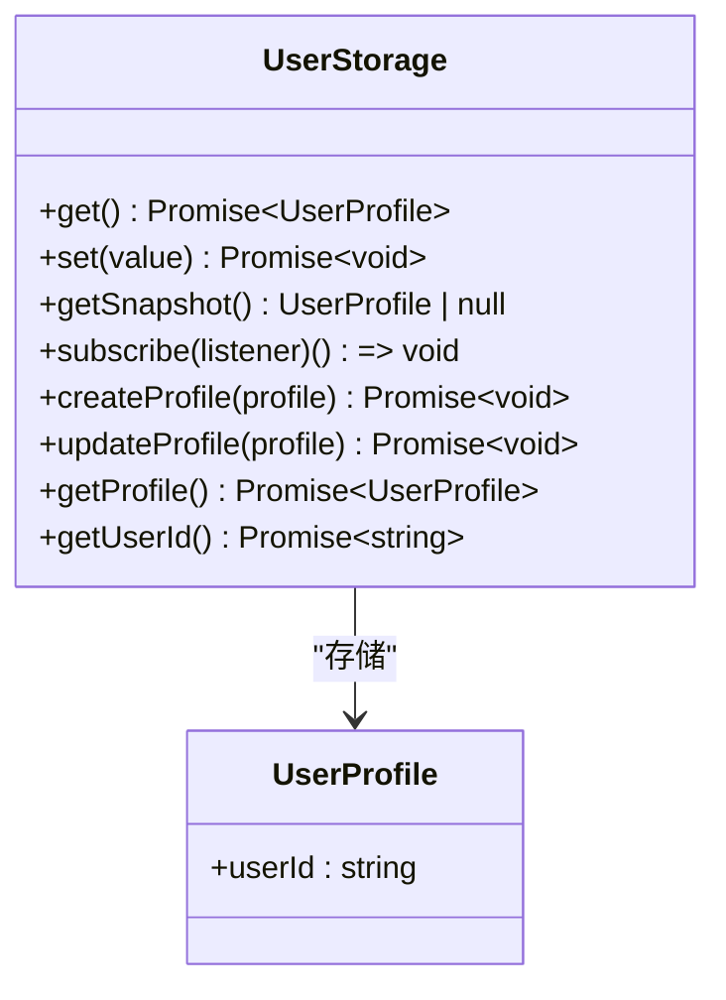
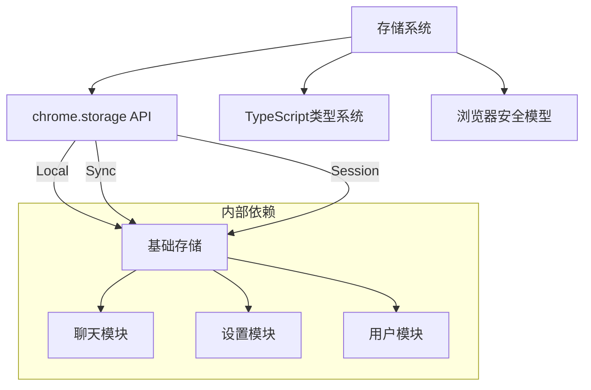

# 存储系统API

<cite>
**本文档中引用的文件**  
- [index.ts](file://packages/storage/index.ts)
- [lib/index.ts](file://packages/storage/lib/index.ts)
- [base/types.ts](file://packages/storage/lib/base/types.ts)
- [base/base.ts](file://packages/storage/lib/base/base.ts)
- [base/enums.ts](file://packages/storage/lib/base/enums.ts)
- [chat/types.ts](file://packages/storage/lib/chat/types.ts)
- [chat/history.ts](file://packages/storage/lib/chat/history.ts)
- [settings/types.ts](file://packages/storage/lib/settings/types.ts)
- [settings/generalSettings.ts](file://packages/storage/lib/settings/generalSettings.ts)
- [settings/firewall.ts](file://packages/storage/lib/settings/firewall.ts)
- [settings/llmProviders.ts](file://packages/storage/lib/settings/llmProviders.ts)
- [profile/user.ts](file://packages/storage/lib/profile/user.ts)
</cite>

## 目录
1. [简介](#简介)
2. [项目结构](#项目结构)
3. [核心组件](#核心组件)
4. [架构概述](#架构概述)
5. [详细组件分析](#详细组件分析)
6. [依赖分析](#依赖分析)
7. [性能考虑](#性能考虑)
8. [故障排除指南](#故障排除指南)
9. [结论](#结论)

## 简介
本API文档详细描述了`packages/storage`包中的存储系统，该系统为浏览器扩展提供类型安全、异步的持久化存储功能。系统包含聊天历史、用户配置文件和各种设置的存储模块，支持本地存储、同步存储和会话存储等多种存储类型。文档重点介绍聊天历史存储、设置存储和用户配置文件管理的核心接口和使用模式。

## 项目结构
存储系统采用模块化设计，核心功能位于`packages/storage/lib`目录下，通过`index.ts`文件对外暴露统一接口。系统分为基础层、聊天模块、设置模块和用户配置模块。

```mermaid
graph TB
subgraph "存储系统"
Base[基础存储]
Chat[聊天模块]
Settings[设置模块]
Profile[用户配置模块]
end
Base --> Chat
Base --> Settings
end
Base --> Profile
Chat --> ChatHistory["聊天历史存储"]
Settings --> General["通用设置"]
Settings --> LLM["LLM提供者"]
Settings --> Firewall["防火墙设置"]
Profile --> User["用户存储"]
```

**Diagram sources**
- [index.ts](file://packages/storage/index.ts)
- [lib/index.ts](file://packages/storage/lib/index.ts)

**Section sources**
- [index.ts](file://packages/storage/index.ts)
- [lib/index.ts](file://packages/storage/lib/index.ts)

## 核心组件
存储系统的核心组件包括基础存储抽象、聊天历史管理、各类设置存储和用户配置文件管理。系统通过`createStorage`工厂函数创建类型安全的存储实例，所有操作均为异步，确保与浏览器存储API的兼容性。

**Section sources**
- [base/base.ts](file://packages/storage/lib/base/base.ts)
- [base/types.ts](file://packages/storage/lib/base/types.ts)

## 架构概述
存储系统采用分层架构，底层为基础存储抽象层，中间为具体功能模块，顶层为预配置的存储实例。系统通过类型系统确保数据结构的安全性，并通过事件订阅机制实现跨组件的状态同步。



**Diagram sources**
- [base/base.ts](file://packages/storage/lib/base/base.ts)
- [base/types.ts](file://packages/storage/lib/base/types.ts)

## 详细组件分析
本节详细分析存储系统的各个核心组件，包括其接口定义、实现细节和使用方法。

### 聊天历史存储分析
聊天历史存储模块负责管理用户会话和代理执行历史，提供完整的CRUD操作接口。

#### 类图


**Diagram sources**
- [chat/types.ts](file://packages/storage/lib/chat/types.ts)
- [chat/history.ts](file://packages/storage/lib/chat/history.ts)

#### 聊天历史操作流程


**Diagram sources**
- [chat/history.ts](file://packages/storage/lib/chat/history.ts)

**Section sources**
- [chat/types.ts](file://packages/storage/lib/chat/types.ts)
- [chat/history.ts](file://packages/storage/lib/chat/history.ts)

### 设置存储分析
设置存储模块管理各种系统配置，包括通用设置、LLM提供者配置和防火墙规则。

#### 通用设置存储


**Diagram sources**
- [settings/generalSettings.ts](file://packages/storage/lib/settings/generalSettings.ts)

#### LLM提供者存储


**Diagram sources**
- [settings/llmProviders.ts](file://packages/storage/lib/settings/llmProviders.ts)

#### 防火墙设置存储


**Diagram sources**
- [settings/firewall.ts](file://packages/storage/lib/settings/firewall.ts)

**Section sources**
- [settings/types.ts](file://packages/storage/lib/settings/types.ts)
- [settings/generalSettings.ts](file://packages/storage/lib/settings/generalSettings.ts)
- [settings/llmProviders.ts](file://packages/storage/lib/settings/llmProviders.ts)
- [settings/firewall.ts](file://packages/storage/lib/settings/firewall.ts)

### 用户配置文件分析
用户配置文件模块管理用户身份信息，提供用户ID的生成和管理功能。



**Diagram sources**
- [profile/user.ts](file://packages/storage/lib/profile/user.ts)

**Section sources**
- [profile/user.ts](file://packages/storage/lib/profile/user.ts)

## 依赖分析
存储系统依赖浏览器的chrome.storage API，通过抽象层隔离具体实现。各模块之间通过基础存储层进行通信，避免了直接依赖。



**Diagram sources**
- [base/base.ts](file://packages/storage/lib/base/base.ts)
- [base/enums.ts](file://packages/storage/lib/base/enums.ts)

**Section sources**
- [base/base.ts](file://packages/storage/lib/base/base.ts)
- [base/enums.ts](file://packages/storage/lib/base/enums.ts)

## 性能考虑
存储系统通过多种机制优化性能：会话元数据与消息内容分离存储，减少不必要的数据加载；使用缓存机制减少重复的存储访问；通过liveUpdate选项实现跨组件的状态同步，避免频繁的存储读取。

## 故障排除指南
当存储系统出现问题时，可检查以下方面：确保manifest.json中已声明storage权限；检查存储键名是否冲突；验证数据序列化/反序列化是否正确；确认会话存储的访问级别设置是否正确。

**Section sources**
- [base/base.ts](file://packages/storage/lib/base/base.ts)
- [base/enums.ts](file://packages/storage/lib/base/enums.ts)

## 结论
存储系统为应用提供了类型安全、异步的持久化解决方案，通过模块化设计和清晰的接口定义，实现了高内聚低耦合的架构。系统支持多种存储类型和复杂的使用场景，是应用数据管理的核心基础设施。