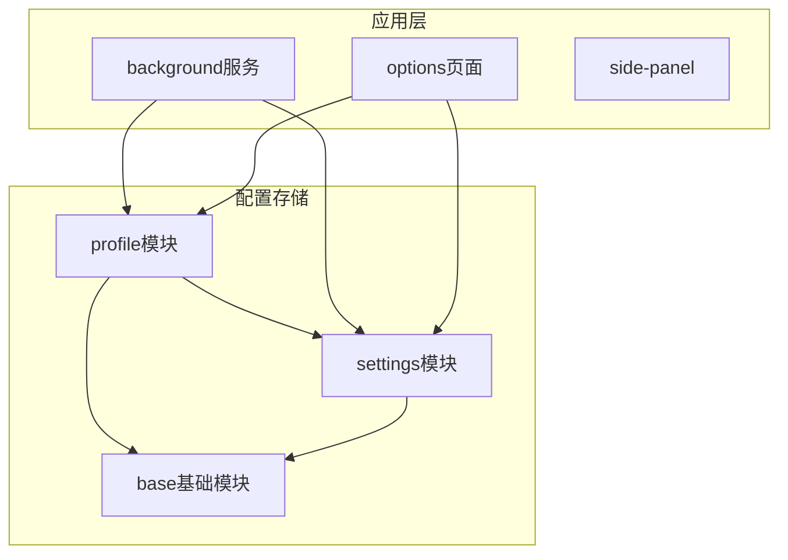
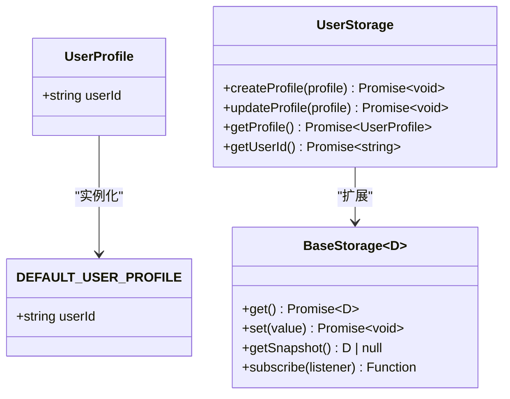
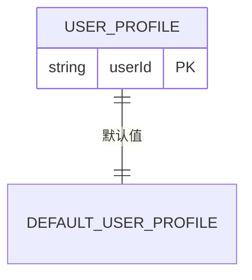
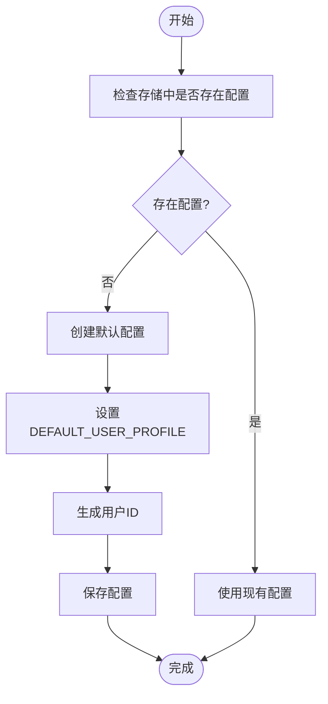
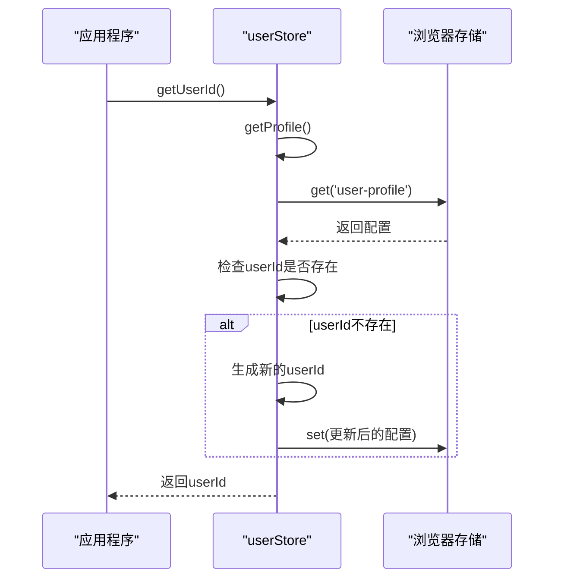
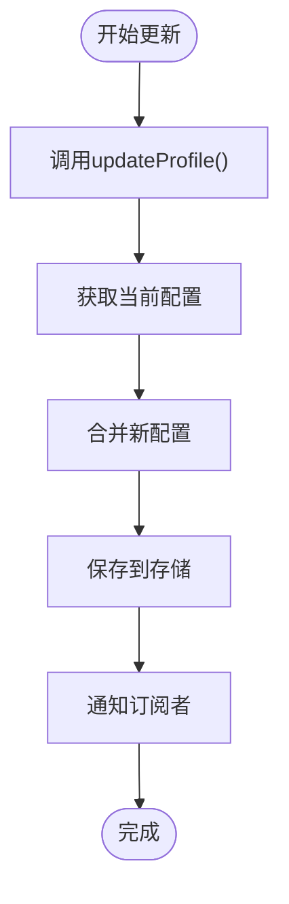
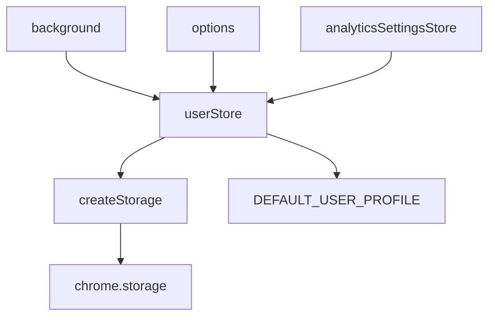

# 用户配置存储

<cite>
**本文档引用的文件**
- [user.ts](file://packages/storage/lib/profile/user.ts)
- [base.ts](file://packages/storage/lib/base/base.ts)
- [types.ts](file://packages/storage/lib/base/types.ts)
- [analyticsSettings.ts](file://packages/storage/lib/settings/analyticsSettings.ts)
- [index.ts](file://packages/storage/lib/profile/index.ts)
- [background/index.ts](file://chrome-extension/src/background/index.ts)
- [AnalyticsSettings.tsx](file://pages/options/src/components/AnalyticsSettings.tsx)
</cite>

## 目录
1. [简介](#简介)
2. [项目结构](#项目结构)
3. [核心组件](#核心组件)
4. [架构概述](#架构概述)
5. [详细组件分析](#详细组件分析)
6. [依赖分析](#依赖分析)
7. [性能考虑](#性能考虑)
8. [故障排除指南](#故障排除指南)
9. [结论](#结论)

## 简介
本文档详细介绍了Nanobrowser扩展中的用户配置存储系统，重点分析了UserProfile接口和DEFAULT_USER_PROFILE常量的设计与使用。文档涵盖了用户配置数据模型、初始化过程、默认值处理机制、使用示例以及与其他系统的集成方式。同时，还讨论了配置的持久化策略、数据生命周期管理、隐私和安全考虑。

## 项目结构
用户配置存储系统位于packages/storage/lib/profile目录下，是整个扩展配置体系的核心部分。该系统与其他设置模块协同工作，为扩展提供统一的配置管理解决方案。

**图示来源**
- [user.ts](file://packages/storage/lib/profile/user.ts)
- [analyticsSettings.ts](file://packages/storage/lib/settings/analyticsSettings.ts)
- [base.ts](file://packages/storage/lib/base/base.ts)

**本节来源**
- [user.ts](file://packages/storage/lib/profile/user.ts)
- [analyticsSettings.ts](file://packages/storage/lib/settings/analyticsSettings.ts)

## 核心组件
用户配置存储系统的核心是UserProfile接口和userStore实例，它们定义了用户配置的数据结构和操作方法。DEFAULT_USER_PROFILE常量提供了配置的默认值，确保系统在初始化时具有一致的状态。该系统基于通用的存储基类构建，实现了类型安全的配置管理。

**本节来源**
- [user.ts](file://packages/storage/lib/profile/user.ts#L1-L57)
- [base.ts](file://packages/storage/lib/base/base.ts#L1-L157)

## 架构概述
用户配置存储系统采用分层架构设计，上层是特定于用户配置的接口和实现，下层是通用的存储基类。这种设计实现了关注点分离，使得配置管理既具有针对性又保持了通用性。

**图示来源**
- [user.ts](file://packages/storage/lib/profile/user.ts#L1-L57)
- [types.ts](file://packages/storage/lib/base/types.ts#L1-L45)

## 详细组件分析

### 用户配置分析
用户配置系统通过UserProfile接口定义了用户配置的数据结构，目前主要包含userId字段。系统提供了完整的CRUD操作，包括创建、更新、读取配置以及获取用户ID的功能。

#### 数据模型

**图示来源**
- [user.ts](file://packages/storage/lib/profile/user.ts#L1-L57)

#### 初始化流程

**图示来源**
- [user.ts](file://packages/storage/lib/profile/user.ts#L1-L57)

**本节来源**
- [user.ts](file://packages/storage/lib/profile/user.ts#L1-L57)

### 配置使用示例
以下示例展示了如何在应用中使用用户配置存储系统。

#### 获取用户ID

**图示来源**
- [user.ts](file://packages/storage/lib/profile/user.ts#L1-L57)

#### 更新用户配置

**图示来源**
- [user.ts](file://packages/storage/lib/profile/user.ts#L1-L57)

**本节来源**
- [user.ts](file://packages/storage/lib/profile/user.ts#L1-L57)

## 依赖分析
用户配置存储系统依赖于底层的通用存储基类，同时与其他配置模块和应用组件存在集成关系。

**图示来源**
- [user.ts](file://packages/storage/lib/profile/user.ts)
- [base.ts](file://packages/storage/lib/base/base.ts)
- [background/index.ts](file://chrome-extension/src/background/index.ts)

**本节来源**
- [user.ts](file://packages/storage/lib/profile/user.ts)
- [base.ts](file://packages/storage/lib/base/base.ts)

## 性能考虑
用户配置存储系统在设计时考虑了性能因素，通过缓存机制和实时更新功能优化了读写性能。系统在初始化时会从浏览器存储中加载配置到内存缓存中，后续的读取操作可以直接从内存获取，避免了频繁的异步存储访问。同时，通过liveUpdate配置，系统能够在配置发生变化时实时通知所有订阅者，确保了配置的一致性。

## 故障排除指南
当用户配置存储出现问题时，可以参考以下排查步骤：

1. **检查存储权限**：确保manifest.json中已声明storage权限
2. **验证配置键名**：确认'user-profile'键名在存储中正确存在
3. **检查默认值**：确认DEFAULT_USER_PROFILE常量定义正确
4. **调试异步操作**：由于所有存储操作都是异步的，需要正确处理Promise
5. **查看浏览器控制台**：检查是否有存储相关的错误信息

**本节来源**
- [user.ts](file://packages/storage/lib/profile/user.ts#L1-L57)
- [base.ts](file://packages/storage/lib/base/base.ts#L1-L157)

## 结论
用户配置存储系统为Nanobrowser扩展提供了一个健壮、类型安全的配置管理解决方案。通过清晰的接口设计和合理的默认值处理，系统确保了用户配置的一致性和可靠性。与其他系统的良好集成使得用户配置能够支持分析服务、个性化功能等关键特性。系统的模块化设计也为未来的扩展和维护提供了便利。