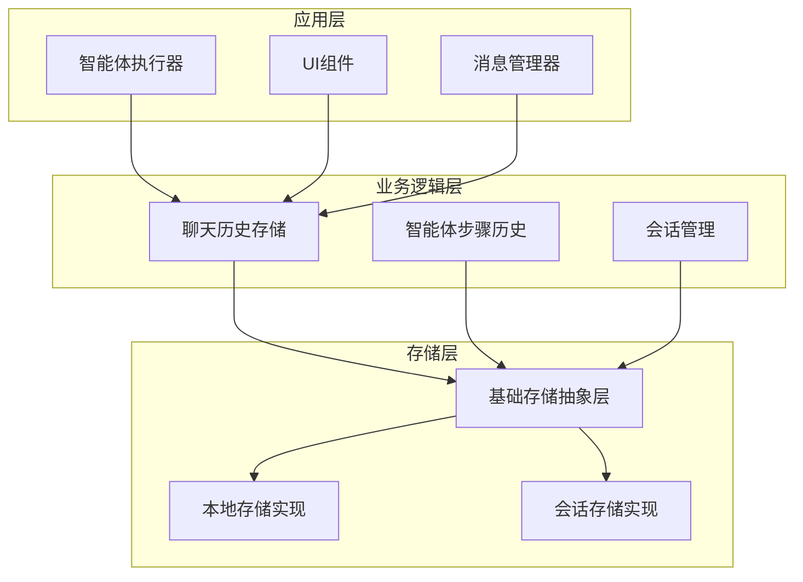
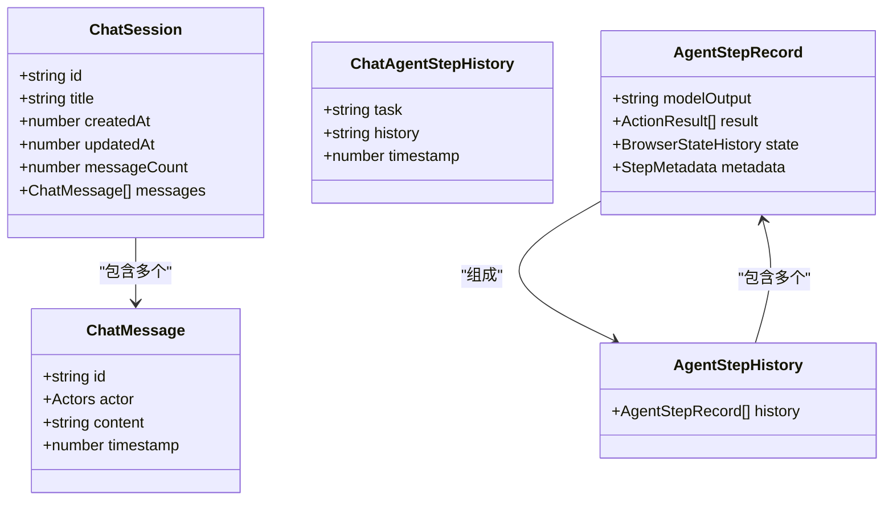
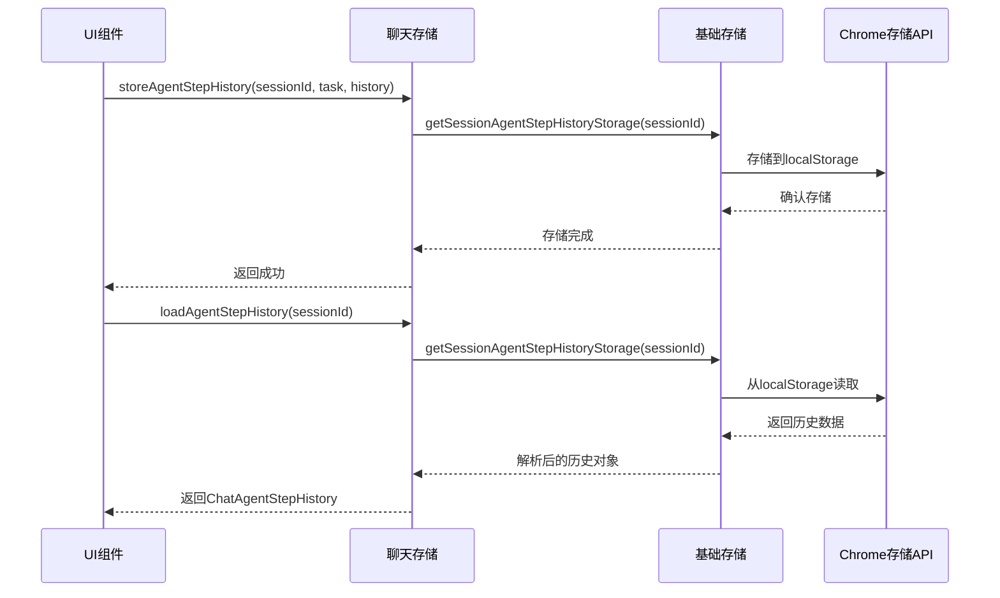
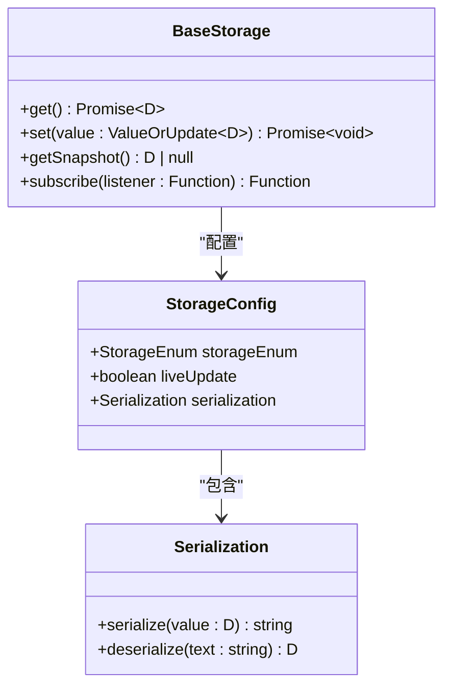
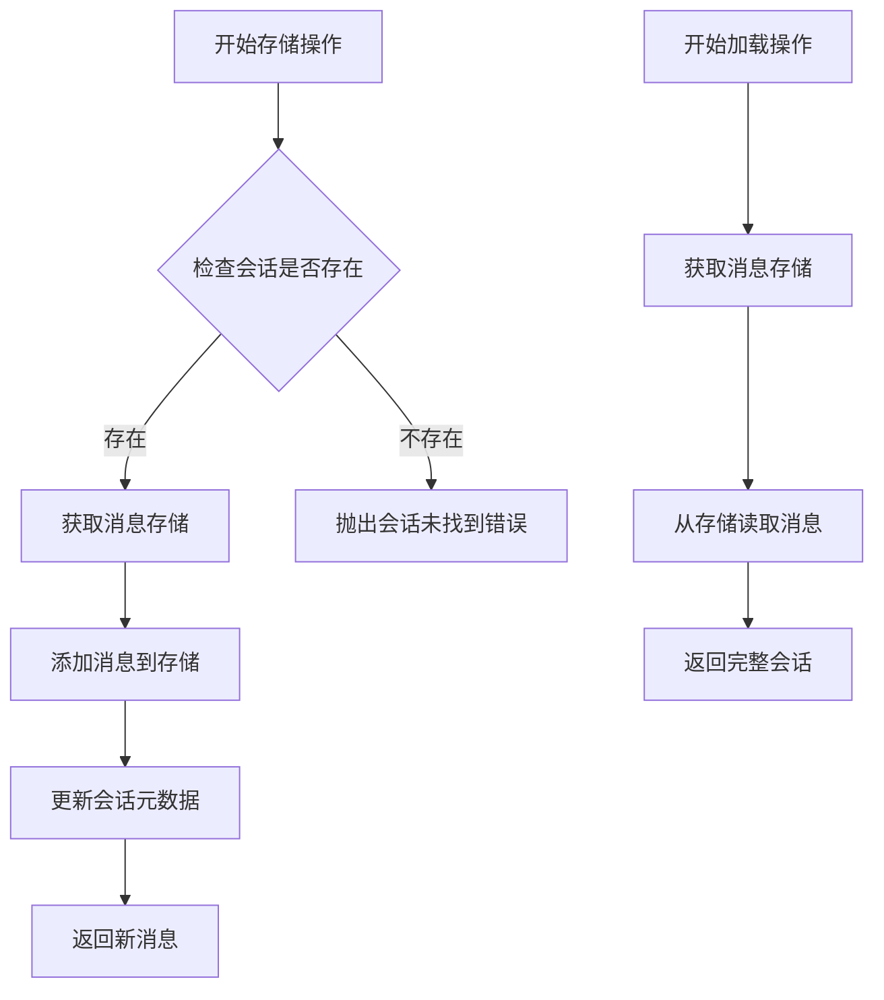
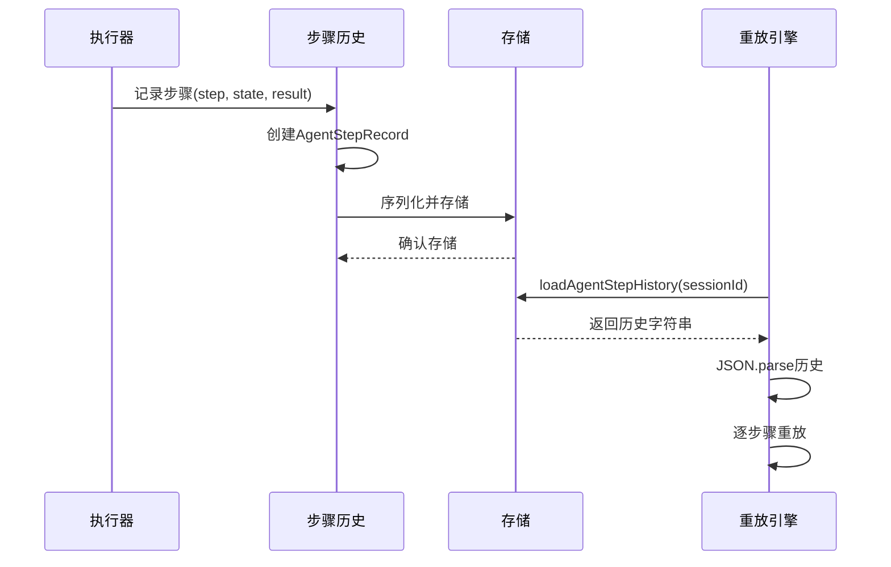
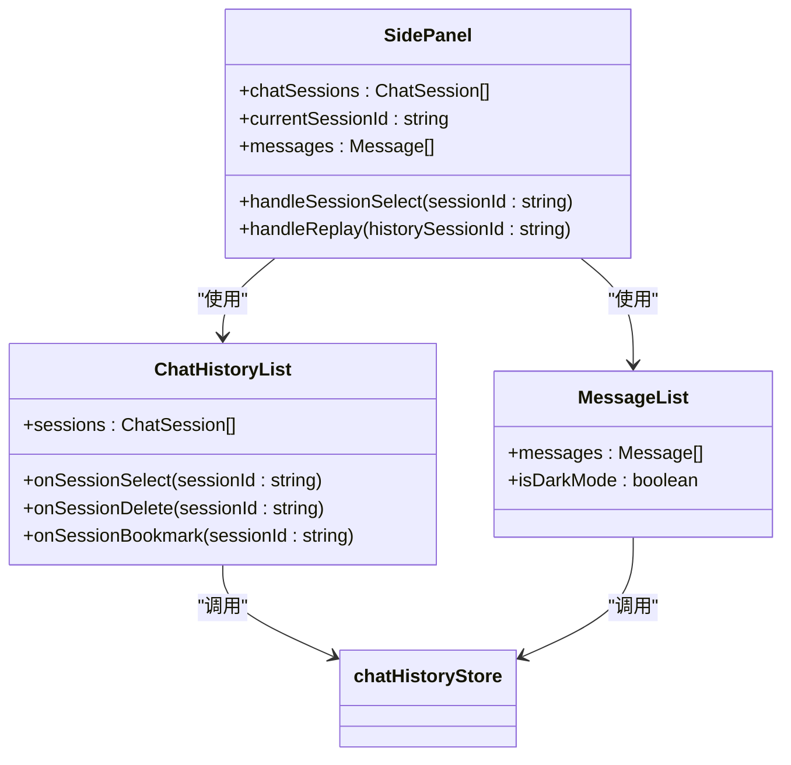
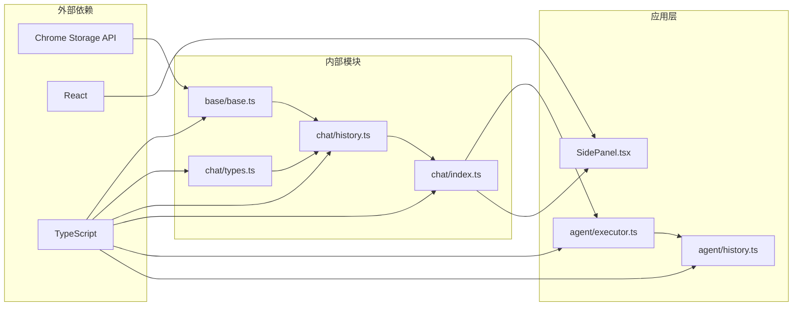

# 聊天存储模块详细文档

<cite>
**本文档中引用的文件**
- [packages/storage/lib/chat/history.ts](file://packages/storage/lib/chat/history.ts)
- [packages/storage/lib/chat/types.ts](file://packages/storage/lib/chat/types.ts)
- [packages/storage/lib/chat/index.ts](file://packages/storage/lib/chat/index.ts)
- [chrome-extension/src/background/agent/history.ts](file://chrome-extension/src/background/agent/history.ts)
- [chrome-extension/src/background/agent/executor.ts](file://chrome-extension/src/background/agent/executor.ts)
- [packages/storage/lib/base/base.ts](file://packages/storage/lib/base/base.ts)
- [packages/storage/lib/base/types.ts](file://packages/storage/lib/base/types.ts)
- [packages/storage/lib/base/enums.ts](file://packages/storage/lib/base/enums.ts)
- [pages/side-panel/src/components/ChatHistoryList.tsx](file://pages/side-panel/src/components/ChatHistoryList.tsx)
- [pages/side-panel/src/components/MessageList.tsx](file://pages/side-panel/src/components/MessageList.tsx)
- [pages/side-panel/src/SidePanel.tsx](file://pages/side-panel/src/SidePanel.tsx)
</cite>

## 目录
1. [简介](#简介)
2. [项目结构](#项目结构)
3. [核心组件](#核心组件)
4. [架构概览](#架构概览)
5. [详细组件分析](#详细组件分析)
6. [依赖关系分析](#依赖关系分析)
7. [性能考虑](#性能考虑)
8. [故障排除指南](#故障排除指南)
9. [结论](#结论)

## 简介

聊天存储模块是NanoBrowser扩展的核心数据管理组件，负责持久化和管理智能体执行过程中的所有聊天历史、会话信息和执行步骤记录。该模块采用分层架构设计，提供了高效的数据存储、检索和同步机制，支持浏览器扩展的实时交互需求。

主要功能包括：
- 智能体执行步骤的历史记录存储
- 对话会话的持久化管理
- 实时数据同步和状态更新
- 数据序列化和反序列化处理
- 错误处理和数据完整性保障

## 项目结构

聊天存储模块采用模块化设计，分为以下几个层次：



**图表来源**
- [packages/storage/lib/base/base.ts](file://packages/storage/lib/base/base.ts#L58-L157)
- [packages/storage/lib/chat/history.ts](file://packages/storage/lib/chat/history.ts#L34-L255)

**章节来源**
- [packages/storage/lib/chat/history.ts](file://packages/storage/lib/chat/history.ts#L1-L256)
- [packages/storage/lib/chat/types.ts](file://packages/storage/lib/chat/types.ts#L1-L73)

## 核心组件

### 存储接口定义

聊天存储模块定义了完整的存储接口，包含以下核心方法：

| 方法名 | 功能描述 | 参数类型 | 返回类型 |
|--------|----------|----------|----------|
| `getAllSessions` | 获取所有聊天会话（带空消息数组） | `void` | `Promise<ChatSession[]>` |
| `createSession` | 创建新的聊天会话 | `title: string` | `Promise<ChatSession>` |
| `getSession` | 获取指定会话及其消息 | `sessionId: string` | `Promise<ChatSession \| null>` |
| `updateTitle` | 更新会话标题 | `sessionId: string, title: string` | `Promise<ChatSessionMetadata>` |
| `deleteSession` | 删除指定会话 | `sessionId: string` | `Promise<void>` |
| `addMessage` | 向会话添加消息 | `sessionId: string, message: Message` | `Promise<ChatMessage>` |
| `deleteMessage` | 删除会话中的消息 | `sessionId: string, messageId: string` | `Promise<void>` |
| `storeAgentStepHistory` | 存储智能体步骤历史 | `sessionId: string, task: string, history: string` | `Promise<void>` |
| `loadAgentStepHistory` | 加载智能体步骤历史 | `sessionId: string` | `Promise<ChatAgentStepHistory \| null>` |

### 数据结构设计



**图表来源**
- [packages/storage/lib/chat/types.ts](file://packages/storage/lib/chat/types.ts#L10-L40)
- [chrome-extension/src/background/agent/history.ts](file://chrome-extension/src/background/agent/history.ts#L4-L29)

**章节来源**
- [packages/storage/lib/chat/types.ts](file://packages/storage/lib/chat/types.ts#L48-L71)
- [chrome-extension/src/background/agent/history.ts](file://chrome-extension/src/background/agent/history.ts#L1-L30)

## 架构概览

聊天存储模块采用分层架构，确保了良好的可维护性和扩展性：



**图表来源**
- [packages/storage/lib/chat/history.ts](file://packages/storage/lib/chat/history.ts#L203-L254)
- [packages/storage/lib/base/base.ts](file://packages/storage/lib/base/base.ts#L85-L119)

## 详细组件分析

### 基础存储抽象层

基础存储层提供了统一的存储抽象，支持多种存储后端：



**图表来源**
- [packages/storage/lib/base/types.ts](file://packages/storage/lib/base/types.ts#L5-L45)
- [packages/storage/lib/base/base.ts](file://packages/storage/lib/base/base.ts#L58-L157)

#### 存储配置选项

| 配置项 | 类型 | 默认值 | 描述 |
|--------|------|--------|------|
| `storageEnum` | `StorageEnum` | `Local` | 存储区域类型 |
| `liveUpdate` | `boolean` | `false` | 是否启用实时更新 |
| `sessionAccessForContentScripts` | `boolean` | `false` | 会话存储是否允许内容脚本访问 |
| `serialization` | `Serialization` | `undefined` | 自定义序列化配置 |

### 聊天历史存储实现

聊天历史存储是核心业务逻辑层，实现了完整的会话管理和历史记录功能：



**图表来源**
- [packages/storage/lib/chat/history.ts](file://packages/storage/lib/chat/history.ts#L120-L180)

#### 性能优化策略

1. **延迟加载**: 会话列表只加载元数据，消息内容按需加载
2. **缓存机制**: 内存缓存减少重复读取
3. **批量操作**: 支持批量更新以提高效率
4. **增量更新**: 只更新变化的部分

### 智能体步骤历史管理

智能体步骤历史记录了每个执行步骤的详细信息：



**图表来源**
- [chrome-extension/src/background/agent/executor.ts](file://chrome-extension/src/background/agent/executor.ts#L280-L320)
- [chrome-extension/src/background/agent/agents/navigator.ts](file://chrome-extension/src/background/agent/agents/navigator.ts#L227-L265)

**章节来源**
- [packages/storage/lib/chat/history.ts](file://packages/storage/lib/chat/history.ts#L203-L254)
- [chrome-extension/src/background/agent/executor.ts](file://chrome-extension/src/background/agent/executor.ts#L280-L320)

### UI集成组件

UI组件通过React Hook与存储层集成，提供响应式数据绑定：



**图表来源**
- [pages/side-panel/src/components/ChatHistoryList.tsx](file://pages/side-panel/src/components/ChatHistoryList.tsx#L10-L25)
- [pages/side-panel/src/components/MessageList.tsx](file://pages/side-panel/src/components/MessageList.tsx#L5-L10)

**章节来源**
- [pages/side-panel/src/components/ChatHistoryList.tsx](file://pages/side-panel/src/components/ChatHistoryList.tsx#L1-L105)
- [pages/side-panel/src/components/MessageList.tsx](file://pages/side-panel/src/components/MessageList.tsx#L1-L122)

## 依赖关系分析

聊天存储模块的依赖关系图展示了各组件间的相互依赖：



**图表来源**
- [packages/storage/lib/base/base.ts](file://packages/storage/lib/base/base.ts#L1-L10)
- [packages/storage/lib/chat/history.ts](file://packages/storage/lib/chat/history.ts#L1-L15)

### 关键依赖说明

1. **Chrome Storage API**: 提供底层数据持久化能力
2. **React**: 用于UI组件的状态管理
3. **TypeScript**: 提供类型安全和开发体验
4. **LangChain**: 智能体框架集成

**章节来源**
- [packages/storage/lib/base/base.ts](file://packages/storage/lib/base/base.ts#L1-L158)
- [packages/storage/lib/chat/history.ts](file://packages/storage/lib/chat/history.ts#L1-L256)

## 性能考虑

### 存储性能优化

1. **内存缓存**: 避免频繁的磁盘I/O操作
2. **批量操作**: 减少存储API调用次数
3. **延迟初始化**: 只在需要时加载数据
4. **增量更新**: 只更新变化的数据部分

### 内存管理

1. **弱引用**: 避免内存泄漏
2. **定期清理**: 清理过期的会话数据
3. **压缩存储**: 对大型历史记录进行压缩

### 并发控制

1. **原子操作**: 确保数据一致性
2. **锁机制**: 防止并发写入冲突
3. **队列管理**: 有序处理存储请求

## 故障排除指南

### 常见问题及解决方案

#### 1. 存储权限问题

**症状**: 存储操作失败，抛出权限错误
**原因**: manifest.json中缺少storage权限
**解决方案**: 确保manifest.json包含以下权限：
```json
{
  "permissions": [
    "storage"
  ]
}
```

#### 2. 数据损坏问题

**症状**: 加载历史时出现解析错误
**原因**: 数据序列化/反序列化失败
**解决方案**: 实现数据验证和修复机制

#### 3. 性能问题

**症状**: 存储操作响应缓慢
**原因**: 大量数据或频繁操作
**解决方案**: 
- 使用批量操作
- 实现数据分页
- 优化索引结构

#### 4. 同步问题

**症状**: 多个标签页间数据不一致
**原因**: 缺少实时更新监听
**解决方案**: 启用`liveUpdate`配置

**章节来源**
- [packages/storage/lib/base/base.ts](file://packages/storage/lib/base/base.ts#L42-L50)
- [packages/storage/lib/chat/history.ts](file://packages/storage/lib/chat/history.ts#L203-L254)

## 结论

聊天存储模块为NanoBrowser扩展提供了强大而灵活的数据管理能力。通过分层架构设计，模块实现了以下关键目标：

1. **数据持久化**: 确保智能体执行历史和对话记录的安全存储
2. **实时同步**: 支持多页面间的数据实时同步
3. **性能优化**: 通过缓存和延迟加载提升用户体验
4. **类型安全**: 利用TypeScript提供完整的类型检查
5. **易于扩展**: 模块化设计便于功能扩展和维护

该模块的成功实施为整个扩展系统的稳定运行奠定了坚实基础，特别是在智能体执行和用户交互方面发挥了关键作用。未来的发展方向包括进一步优化存储性能、增强数据压缩能力和改进错误恢复机制。