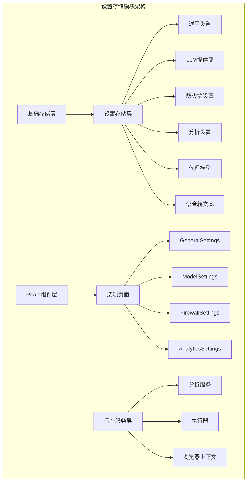
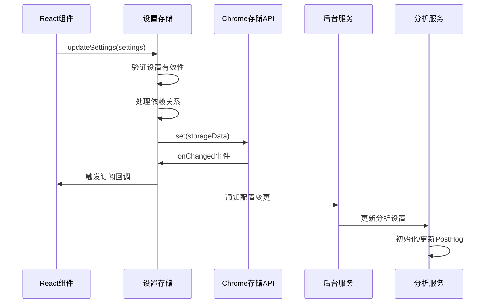
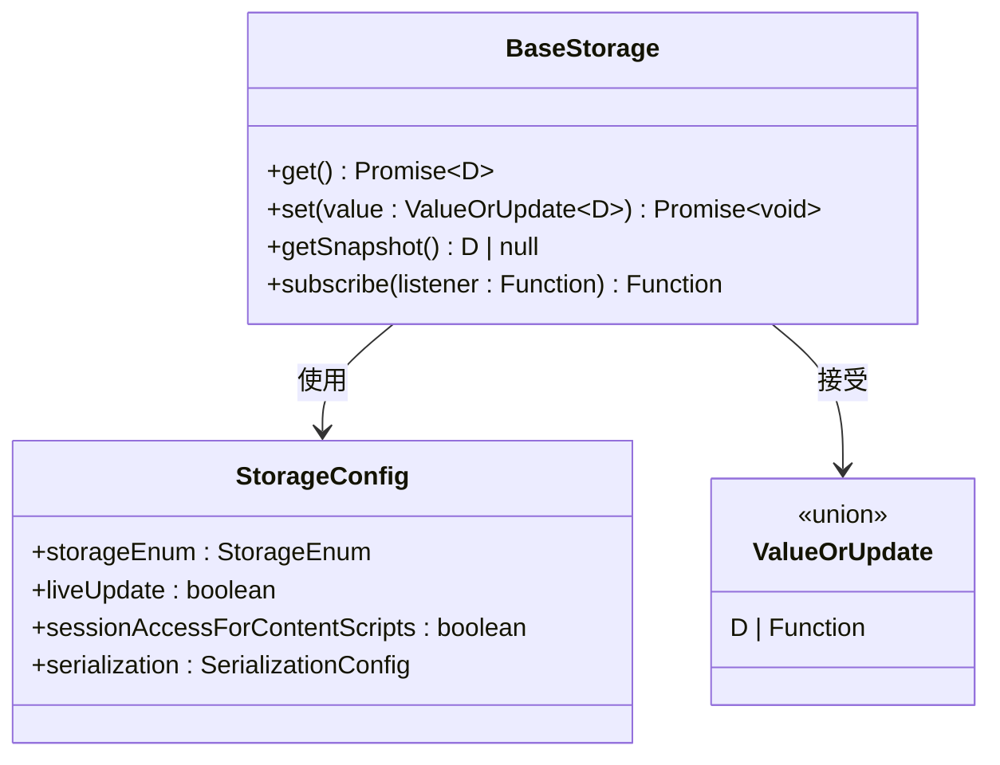
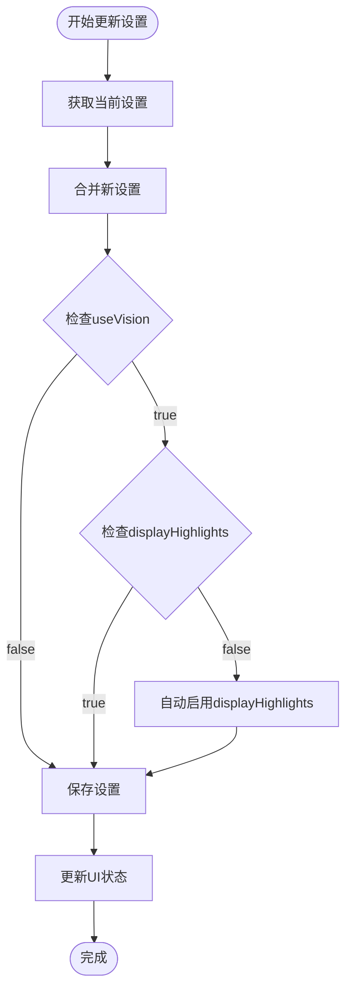
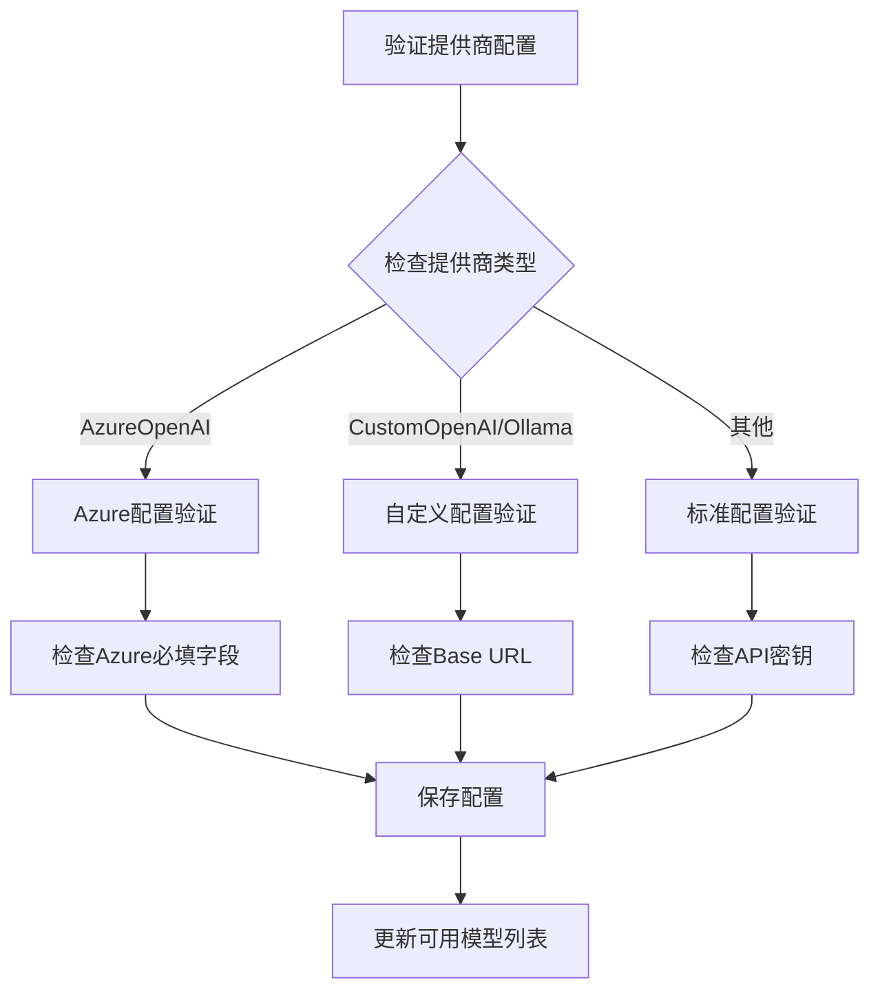
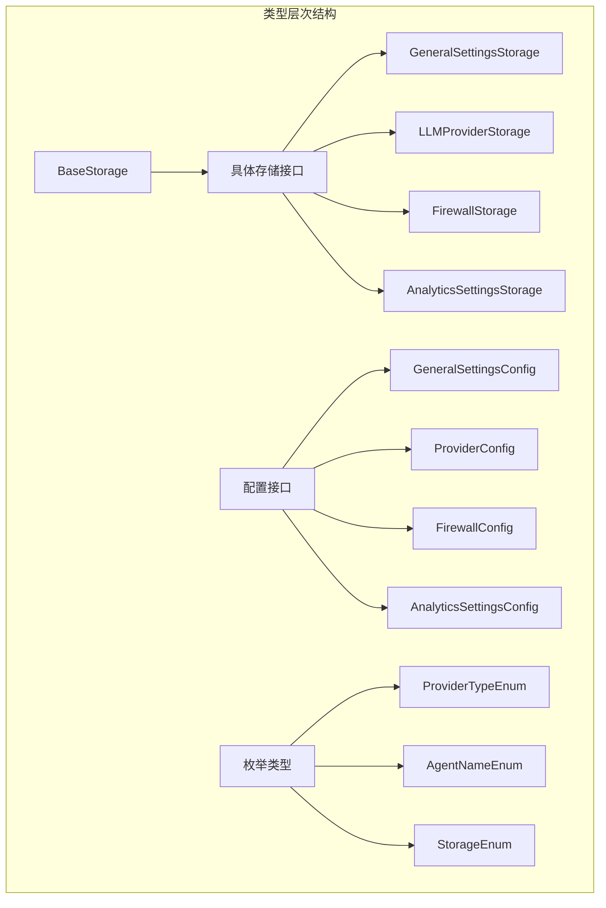
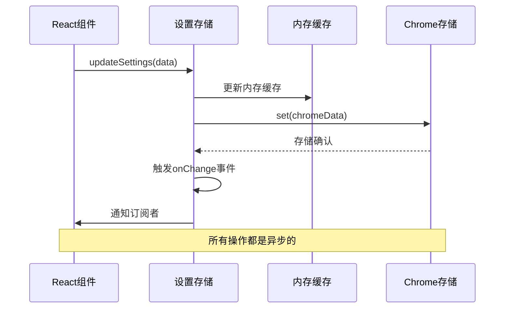
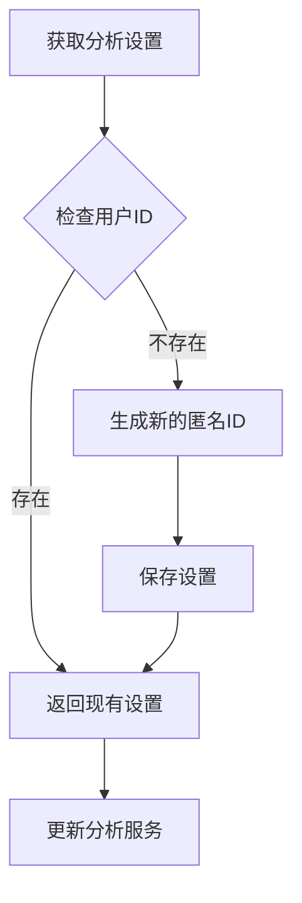
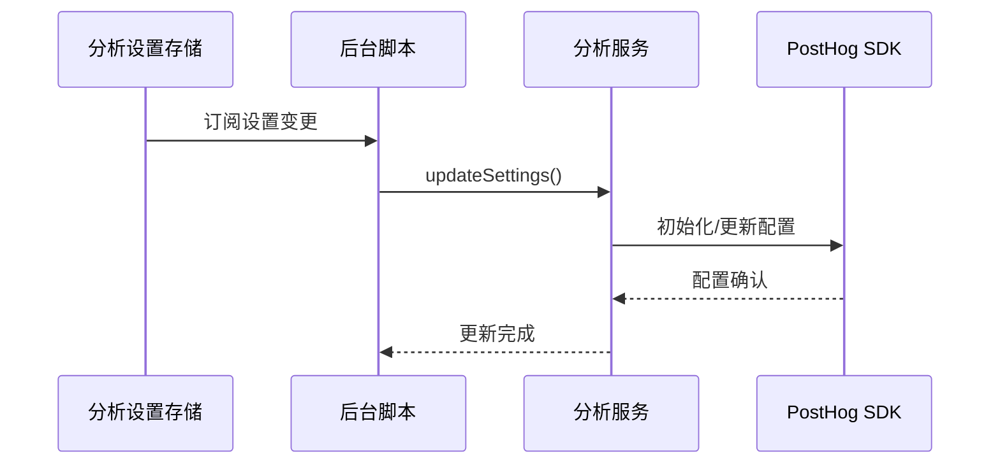

# 设置存储模块详细文档

<cite>
**本文档中引用的文件**
- [packages/storage/lib/settings/index.ts](file://packages/storage/lib/settings/index.ts)
- [packages/storage/lib/settings/generalSettings.ts](file://packages/storage/lib/settings/generalSettings.ts)
- [packages/storage/lib/settings/llmProviders.ts](file://packages/storage/lib/settings/llmProviders.ts)
- [packages/storage/lib/settings/firewall.ts](file://packages/storage/lib/settings/firewall.ts)
- [packages/storage/lib/settings/analyticsSettings.ts](file://packages/storage/lib/settings/analyticsSettings.ts)
- [packages/storage/lib/settings/agentModels.ts](file://packages/storage/lib/settings/agentModels.ts)
- [packages/storage/lib/settings/speechToText.ts](file://packages/storage/lib/settings/speechToText.ts)
- [packages/storage/lib/settings/types.ts](file://packages/storage/lib/settings/types.ts)
- [packages/storage/lib/base/base.ts](file://packages/storage/lib/base/base.ts)
- [packages/storage/lib/base/types.ts](file://packages/storage/lib/base/types.ts)
- [pages/options/src/components/GeneralSettings.tsx](file://pages/options/src/components/GeneralSettings.tsx)
- [pages/options/src/components/ModelSettings.tsx](file://pages/options/src/components/ModelSettings.tsx)
- [pages/options/src/components/FirewallSettings.tsx](file://pages/options/src/components/FirewallSettings.tsx)
- [pages/options/src/components/AnalyticsSettings.tsx](file://pages/options/src/components/AnalyticsSettings.tsx)
- [chrome-extension/src/background/services/analytics.ts](file://chrome-extension/src/background/services/analytics.ts)
- [chrome-extension/src/background/index.ts](file://chrome-extension/src/background/index.ts)
</cite>

## 目录
1. [简介](#简介)
2. [项目结构](#项目结构)
3. [核心设置存储实例](#核心设置存储实例)
4. [架构概览](#架构概览)
5. [详细组件分析](#详细组件分析)
6. [类型安全设计](#类型安全设计)
7. [异步操作模式](#异步操作模式)
8. [设置变更的副作用处理](#设置变更的副作用处理)
9. [与其他系统的交互](#与其他系统的交互)
10. [使用示例](#使用示例)
11. [故障排除指南](#故障排除指南)
12. [总结](#总结)

## 简介

NanoBrowser扩展的设置存储模块是一个高度类型化的状态管理系统，负责管理扩展的各种配置选项。该模块提供了统一的接口来处理通用设置、LLM提供商配置、防火墙规则、分析设置等多种类型的配置数据。通过Chrome浏览器的存储API，实现了跨标签页和组件的实时同步功能。

## 项目结构

设置存储模块采用分层架构设计，主要包含以下层次：



**图表来源**
- [packages/storage/lib/settings/index.ts](file://packages/storage/lib/settings/index.ts#L1-L8)
- [packages/storage/lib/base/base.ts](file://packages/storage/lib/base/base.ts#L1-L158)

**章节来源**
- [packages/storage/lib/settings/index.ts](file://packages/storage/lib/settings/index.ts#L1-L8)

## 核心设置存储实例

### generalSettingsStore - 通用设置存储

通用设置存储管理扩展的核心行为配置，包括任务执行参数、视觉处理选项等关键设置。

| 设置项 | 类型 | 默认值 | 约束条件 |
|--------|------|--------|----------|
| maxSteps | number | 100 | 最小值：1，最大值：50 |
| maxActionsPerStep | number | 5 | 最小值：1，最大值：10 |
| maxFailures | number | 3 | 最小值：1，最大值：5 |
| useVision | boolean | false | 视觉处理开关 |
| useVisionForPlanner | boolean | false | 规划器专用视觉处理 |
| planningInterval | number | 3 | 规划间隔时间 |
| displayHighlights | boolean | true | 显示元素高亮 |
| minWaitPageLoad | number | 250 | 页面加载最小等待时间 |
| replayHistoricalTasks | boolean | false | 重放历史任务 |

**重要依赖关系**：
- 当`useVision`为`true`时，`displayHighlights`必须同时为`true`
- 所有数值类型设置都有明确的范围限制

### llmProviderStore - LLM提供商存储

LLM提供商存储管理各种大语言模型提供商的配置信息，支持多种提供商类型和自定义配置。

| 提供商类型 | 支持的模型 | 特殊字段 |
|------------|------------|----------|
| OpenAI | gpt-5, gpt-4系列 | apiKey, baseUrl |
| Anthropic | claude系列 | apiKey, baseUrl |
| AzureOpenAI | 部署名称 | apiKey, baseUrl, azureDeploymentNames, azureApiVersion |
| Ollama | 本地模型 | apiKey='ollama', baseUrl |
| CustomOpenAI | 用户定义 | apiKey, baseUrl, modelNames |

### firewallStore - 防火墙设置存储

防火墙设置存储管理URL访问控制列表，提供网站访问的安全控制机制。

| 设置项 | 类型 | 默认值 | 功能描述 |
|--------|------|--------|----------|
| allowList | string[] | [] | 允许访问的URL列表 |
| denyList | string[] | [] | 拒绝访问的URL列表 |
| enabled | boolean | true | 防火墙启用状态 |

### analyticsSettingsStore - 分析设置存储

分析设置存储管理用户同意的分析数据收集配置，包含匿名用户标识符的生成和管理。

| 设置项 | 类型 | 默认值 | 功能描述 |
|--------|------|--------|----------|
| enabled | boolean | true | 分析数据收集启用状态 |
| anonymousUserId | string | 自动生成 | 匿名用户唯一标识符 |

**章节来源**
- [packages/storage/lib/settings/generalSettings.ts](file://packages/storage/lib/settings/generalSettings.ts#L1-L69)
- [packages/storage/lib/settings/llmProviders.ts](file://packages/storage/lib/settings/llmProviders.ts#L1-L317)
- [packages/storage/lib/settings/firewall.ts](file://packages/storage/lib/settings/firewall.ts#L1-L105)
- [packages/storage/lib/settings/analyticsSettings.ts](file://packages/storage/lib/settings/analyticsSettings.ts#L1-L75)

## 架构概览

设置存储模块采用观察者模式和单向数据流架构，确保状态的一致性和可预测性。



**图表来源**
- [packages/storage/lib/base/base.ts](file://packages/storage/lib/base/base.ts#L100-L158)
- [chrome-extension/src/background/services/analytics.ts](file://chrome-extension/src/background/services/analytics.ts#L36-L69)

## 详细组件分析

### 基础存储层

基础存储层提供了类型安全的存储抽象，封装了Chrome浏览器存储API的功能。



**图表来源**
- [packages/storage/lib/base/types.ts](file://packages/storage/lib/base/types.ts#L1-L46)
- [packages/storage/lib/base/base.ts](file://packages/storage/lib/base/base.ts#L1-L158)

### 通用设置存储实现

通用设置存储实现了复杂的依赖关系处理逻辑，特别是`useVision`和`displayHighlights`之间的约束关系。



**图表来源**
- [packages/storage/lib/settings/generalSettings.ts](file://packages/storage/lib/settings/generalSettings.ts#L41-L67)

### LLM提供商存储验证机制

LLM提供商存储实现了严格的验证机制，确保不同提供商类型的配置完整性。



**图表来源**
- [packages/storage/lib/settings/llmProviders.ts](file://packages/storage/lib/settings/llmProviders.ts#L200-L280)

**章节来源**
- [packages/storage/lib/base/base.ts](file://packages/storage/lib/base/base.ts#L1-L158)
- [packages/storage/lib/settings/generalSettings.ts](file://packages/storage/lib/settings/generalSettings.ts#L41-L67)
- [packages/storage/lib/settings/llmProviders.ts](file://packages/storage/lib/settings/llmProviders.ts#L200-L280)

## 类型安全设计

设置存储模块采用了强类型设计，通过TypeScript确保编译时的类型安全。

### 类型定义层次



**图表来源**
- [packages/storage/lib/base/types.ts](file://packages/storage/lib/base/types.ts#L1-L46)
- [packages/storage/lib/settings/types.ts](file://packages/storage/lib/settings/types.ts#L1-L154)

### 泛型类型约束

所有设置存储都遵循相同的泛型模式，确保类型安全：

- `BaseStorage<D>`：基础存储接口，其中`D`是配置数据的类型
- `Partial<Config>`：允许部分更新配置
- `ValueOrUpdate<D>`：支持函数式更新模式

**章节来源**
- [packages/storage/lib/base/types.ts](file://packages/storage/lib/base/types.ts#L1-L46)
- [packages/storage/lib/settings/types.ts](file://packages/storage/lib/settings/types.ts#L1-L154)

## 异步操作模式

设置存储模块完全基于异步操作，确保不会阻塞主线程。

### 异步操作流程



**图表来源**
- [packages/storage/lib/base/base.ts](file://packages/storage/lib/base/base.ts#L100-L158)

### 订阅机制

设置存储提供了强大的订阅机制，支持组件实时响应配置变更：

- `subscribe(listener: () => void)`: 注册变更监听器
- `unsubscribe()`: 返回取消订阅的函数
- 自动处理内存泄漏和重复注册问题

**章节来源**
- [packages/storage/lib/base/base.ts](file://packages/storage/lib/base/base.ts#L100-L158)

## 设置变更的副作用处理

### 匿名用户ID生成策略

分析设置存储实现了智能的匿名用户ID生成和保留策略：



**图表来源**
- [packages/storage/lib/settings/analyticsSettings.ts](file://packages/storage/lib/settings/analyticsSettings.ts#L45-L65)

### 配置重置策略

设置存储在重置时保持重要的用户数据：

- **分析设置**：保留现有的匿名用户ID
- **LLM提供商**：保留已有的提供商配置
- **通用设置**：恢复到默认值但保留用户ID

**章节来源**
- [packages/storage/lib/settings/analyticsSettings.ts](file://packages/storage/lib/settings/analyticsSettings.ts#L45-L75)

## 与其他系统的交互

### 分析服务集成

设置存储与分析服务建立了紧密的集成关系：



**图表来源**
- [chrome-extension/src/background/services/analytics.ts](file://chrome-extension/src/background/services/analytics.ts#L36-L69)
- [chrome-extension/src/background/index.ts](file://chrome-extension/src/background/index.ts#L50-L55)

### LLM集成配置传播

LLM提供商配置的变化会自动传播到执行器和聊天模型创建器：

- 实时更新代理模型配置
- 自动重新初始化聊天模型
- 保持执行器状态一致性

**章节来源**
- [chrome-extension/src/background/services/analytics.ts](file://chrome-extension/src/background/services/analytics.ts#L36-L69)
- [chrome-extension/src/background/index.ts](file://chrome-extension/src/background/index.ts#L50-L55)

## 使用示例

### 读取设置

```typescript
// 读取通用设置
const settings = await generalSettingsStore.getSettings();
console.log('最大步骤数:', settings.maxSteps);

// 获取LLM提供商配置
const providers = await llmProviderStore.getAllProviders();
console.log('可用提供商:', Object.keys(providers));
```

### 更新设置

```typescript
// 更新单一设置
await generalSettingsStore.updateSettings({ maxSteps: 150 });

// 更新多个设置
await generalSettingsStore.updateSettings({
  maxSteps: 150,
  useVision: true,
  displayHighlights: true
});

// 添加LLM提供商
await llmProviderStore.setProvider('openai', {
  apiKey: 'sk-...',
  name: 'OpenAI',
  type: ProviderTypeEnum.OpenAI
});
```

### 监听设置变化

```typescript
// 监听通用设置变化
const unsubscribe = generalSettingsStore.subscribe(() => {
  console.log('通用设置已更新');
});

// 清理订阅
unsubscribe();
```

### 错误处理

```typescript
try {
  await llmProviderStore.setProvider('azure_openai', {
    apiKey: 'valid-key',
    baseUrl: 'https://endpoint.openai.azure.com/',
    azureDeploymentNames: ['gpt-4'],
    azureApiVersion: '2025-04-01-preview'
  });
} catch (error) {
  console.error('提供商配置失败:', error.message);
}
```

**章节来源**
- [pages/options/src/components/GeneralSettings.tsx](file://pages/options/src/components/GeneralSettings.tsx#L1-L59)
- [pages/options/src/components/ModelSettings.tsx](file://pages/options/src/components/ModelSettings.tsx#L1-L799)

## 故障排除指南

### 常见问题及解决方案

| 问题 | 可能原因 | 解决方案 |
|------|----------|----------|
| 设置无法保存 | API密钥格式错误 | 检查密钥格式和权限 |
| 防火墙规则不生效 | URL格式不正确 | 使用normalizeUrl处理 |
| 分析数据收集失败 | 匿名ID生成失败 | 检查存储权限 |
| LLM提供商连接超时 | 网络或配置问题 | 验证网络连接和配置 |

### 调试技巧

1. **启用详细日志**：在开发环境中查看控制台输出
2. **检查存储权限**：确保manifest.json中有正确的存储权限
3. **验证配置格式**：使用内置验证器检查配置格式
4. **监控订阅事件**：使用subscribe方法调试设置变更

### 性能优化建议

- 使用批量更新减少存储写入次数
- 实现防抖机制避免频繁更新
- 利用内存缓存减少不必要的读取
- 合理使用订阅机制避免过度监听

**章节来源**
- [packages/storage/lib/settings/llmProviders.ts](file://packages/storage/lib/settings/llmProviders.ts#L200-L280)
- [packages/storage/lib/settings/firewall.ts](file://packages/storage/lib/settings/firewall.ts#L60-L105)

## 总结

NanoBrowser的设置存储模块是一个设计精良的状态管理系统，具有以下特点：

1. **类型安全**：完整的TypeScript类型定义确保编译时安全
2. **异步操作**：基于Promise的异步API避免阻塞主线程
3. **实时同步**：通过Chrome存储API实现跨组件实时同步
4. **依赖处理**：智能处理设置间的依赖关系
5. **错误恢复**：完善的错误处理和回退机制
6. **扩展性**：模块化设计便于添加新的设置类型

该模块为NanoBrowser扩展提供了稳定可靠的配置管理基础设施，支持复杂的应用场景和用户需求。通过合理的抽象和封装，开发者可以轻松地添加新的设置类型和功能，而无需担心底层实现细节。