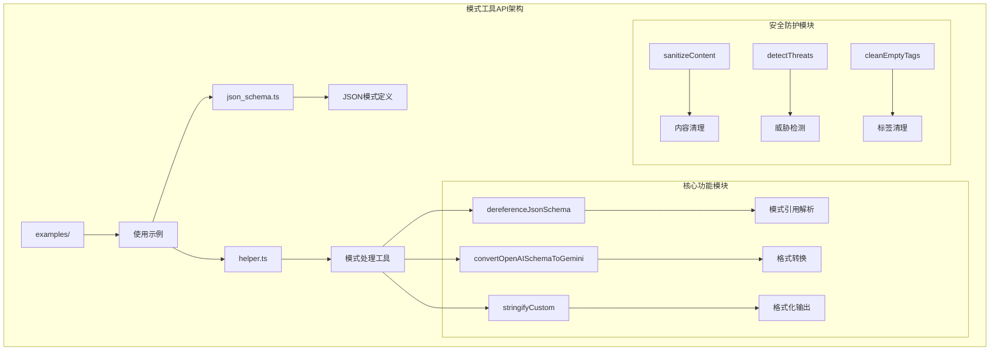
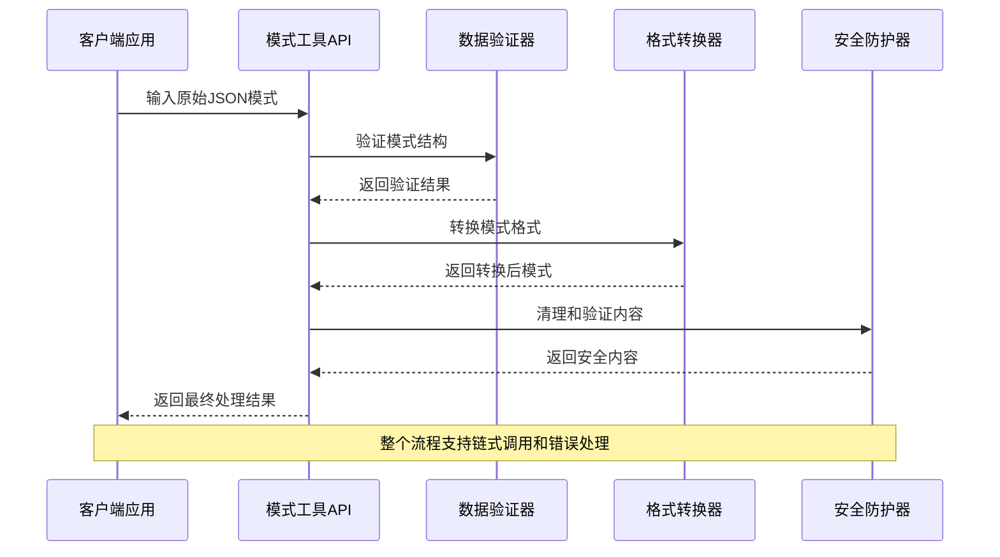
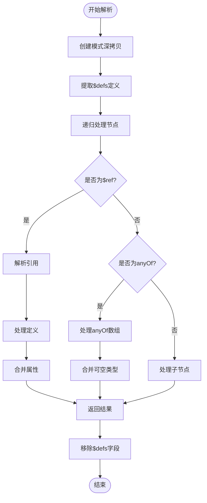
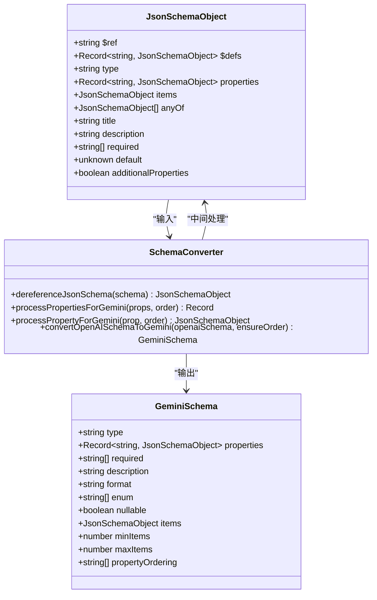
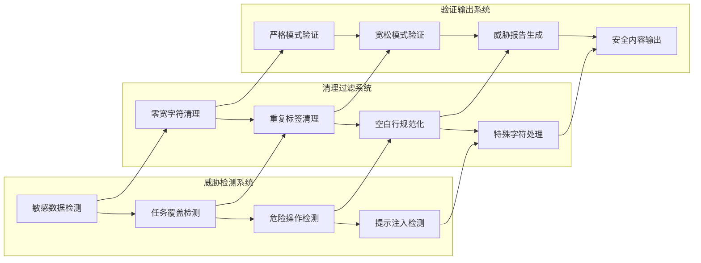
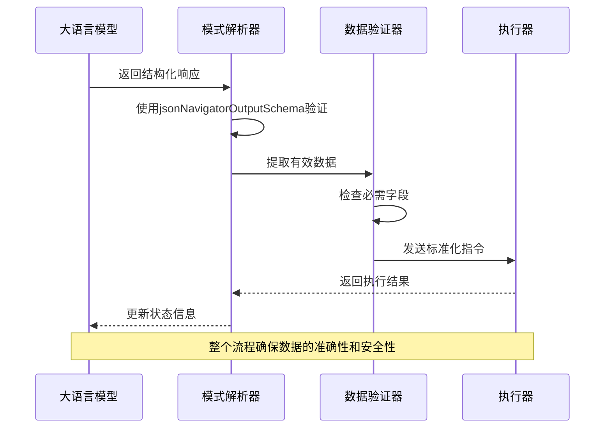

# 模式工具API

<cite>
**本文档中引用的文件**
- [packages/schema-utils/lib/json_schema.ts](file://packages/schema-utils/lib/json_schema.ts)
- [packages/schema-utils/lib/helper.ts](file://packages/schema-utils/lib/helper.ts)
- [packages/schema-utils/examples/convert.ts](file://packages/schema-utils/examples/convert.ts)
- [packages/schema-utils/examples/flatten.ts](file://packages/schema-utils/examples/flatten.ts)
- [packages/schema-utils/index.ts](file://packages/schema-utils/index.ts)
- [packages/schema-utils/package.json](file://packages/schema-utils/package.json)
- [packages/schema-utils/README.md](file://packages/schema-utils/README.md)
- [chrome-extension/src/background/services/guardrails/sanitizer.ts](file://chrome-extension/src/background/services/guardrails/sanitizer.ts)
- [chrome-extension/src/background/services/guardrails/types.ts](file://chrome-extension/src/background/services/guardrails/types.ts)
- [chrome-extension/src/background/agent/helper.ts](file://chrome-extension/src/background/agent/helper.ts)
</cite>

## 目录
1. [简介](#简介)
2. [项目结构](#项目结构)
3. [核心组件](#核心组件)
4. [架构概览](#架构概览)
5. [详细组件分析](#详细组件分析)
6. [依赖关系分析](#依赖关系分析)
7. [性能考虑](#性能考虑)
8. [故障排除指南](#故障排除指南)
9. [结论](#结论)

## 简介

模式工具API是一个专门设计用于处理JSON模式验证、转换和操作的工具包，主要服务于智能体输出解析、数据验证和模式生成等核心功能。该工具包提供了强大的JSON模式处理能力，支持复杂的模式转换、扁平化和格式化操作，为浏览器扩展中的智能体系统提供了坚实的数据验证基础。

该工具包的核心价值在于：
- 提供统一的JSON模式处理接口
- 支持多种模式格式之间的转换（如OpenAI到Gemini）
- 实现高效的模式引用解析和扁平化
- 集成安全防护机制，防止恶意内容注入
- 优化智能体输出的结构化处理流程

## 项目结构

模式工具API采用模块化设计，主要包含以下核心模块：



**图表来源**
- [packages/schema-utils/lib/json_schema.ts](file://packages/schema-utils/lib/json_schema.ts#L1-L535)
- [packages/schema-utils/lib/helper.ts](file://packages/schema-utils/lib/helper.ts#L1-L343)

**章节来源**
- [packages/schema-utils/index.ts](file://packages/schema-utils/index.ts#L1-L5)
- [packages/schema-utils/package.json](file://packages/schema-utils/package.json#L1-L28)

## 核心组件

### JSON模式定义模块

JSON模式定义模块提供了完整的导航器输出模式规范，支持复杂的动作模型和状态管理：

- **ActionModel**: 定义了所有可用的操作类型，包括点击元素、输入文本、导航等
- **AgentBrain**: 描述智能体的当前状态，包括评估、记忆和目标规划
- **具体操作**: 如ClickElementAction、InputTextAction、GoToUrlAction等详细参数定义

### 辅助工具模块

辅助工具模块包含了核心的模式处理功能：

- **dereferenceJsonSchema**: 实现深度模式引用解析
- **convertOpenAISchemaToGemini**: 支持OpenAI到Gemini格式的转换
- **stringifyCustom**: 提供美观的模式格式化输出

**章节来源**
- [packages/schema-utils/lib/json_schema.ts](file://packages/schema-utils/lib/json_schema.ts#L1-L535)
- [packages/schema-utils/lib/helper.ts](file://packages/schema-utils/lib/helper.ts#L1-L343)

## 架构概览

模式工具API采用分层架构设计，确保功能的模块化和可扩展性：



**图表来源**
- [packages/schema-utils/lib/helper.ts](file://packages/schema-utils/lib/helper.ts#L15-L45)
- [chrome-extension/src/background/services/guardrails/sanitizer.ts](file://chrome-extension/src/background/services/guardrails/sanitizer.ts#L15-L60)

## 详细组件分析

### JSON模式验证与处理

#### 模式引用解析器

dereferenceJsonSchema函数实现了复杂的模式引用解析机制：



**图表来源**
- [packages/schema-utils/lib/helper.ts](file://packages/schema-utils/lib/helper.ts#L15-L45)
- [packages/schema-utils/lib/helper.ts](file://packages/schema-utils/lib/helper.ts#L47-L148)

#### OpenAI到Gemini格式转换器

convertOpenAISchemaToGemini函数提供了跨平台的模式兼容性：



**图表来源**
- [packages/schema-utils/lib/helper.ts](file://packages/schema-utils/lib/helper.ts#L150-L234)
- [packages/schema-utils/lib/helper.ts](file://packages/schema-utils/lib/helper.ts#L236-L285)

**章节来源**
- [packages/schema-utils/lib/helper.ts](file://packages/schema-utils/lib/helper.ts#L150-L285)

### 数据验证与安全防护

#### 内容安全防护系统

安全防护系统提供了多层次的内容保护机制：



**图表来源**
- [chrome-extension/src/background/services/guardrails/sanitizer.ts](file://chrome-extension/src/background/services/guardrails/sanitizer.ts#L15-L60)
- [chrome-extension/src/background/services/guardrails/types.ts](file://chrome-extension/src/background/services/guardrails/types.ts#L1-L42)

#### 类型检查与数据验证工具

helper模块提供了丰富的类型检查和数据验证功能：

| 功能类别 | 主要函数 | 描述 | 应用场景 |
|---------|---------|------|----------|
| 模式解析 | dereferenceJsonSchema | 解析JSON模式中的引用关系 | 智能体输出解析 |
| 格式转换 | convertOpenAISchemaToGemini | 转换OpenAI格式到Gemini格式 | 多平台兼容性 |
| 格式化输出 | stringifyCustom | 自定义JSON格式化 | 调试和日志记录 |
| 类型检查 | JsonSchemaObject接口 | 定义JSON模式结构类型 | TypeScript集成 |

**章节来源**
- [packages/schema-utils/lib/helper.ts](file://packages/schema-utils/lib/helper.ts#L1-L343)
- [chrome-extension/src/background/services/guardrails/sanitizer.ts](file://chrome-extension/src/background/services/guardrails/sanitizer.ts#L1-L129)

### 实际应用场景

#### 智能体输出解析

在智能体系统中，模式工具API主要用于处理LLM响应的结构化输出：



**图表来源**
- [packages/schema-utils/lib/json_schema.ts](file://packages/schema-utils/lib/json_schema.ts#L520-L535)
- [chrome-extension/src/background/agent/helper.ts](file://chrome-extension/src/background/agent/helper.ts#L300-L384)

#### 数据验证最佳实践

以下是使用模式工具API进行数据验证的最佳实践：

1. **严格模式验证**: 在生产环境中启用严格模式，确保最高级别的安全性
2. **渐进式验证**: 先进行基本格式验证，再进行业务逻辑验证
3. **错误处理**: 实现完善的错误捕获和恢复机制
4. **性能优化**: 对频繁使用的模式进行缓存和预编译

**章节来源**
- [chrome-extension/src/background/services/guardrails/sanitizer.ts](file://chrome-extension/src/background/services/guardrails/sanitizer.ts#L80-L128)

## 依赖关系分析

模式工具API的依赖关系体现了清晰的分层架构：

```mermaid
graph TB
subgraph "外部依赖"
A[@langchain/core] --> B[语言模型接口]
C[TypeScript] --> D[类型系统]
E[Node.js] --> F[运行时环境]
end
subgraph "内部模块依赖"
G[json_schema.ts] --> H[helper.ts]
I[examples/] --> G
I --> H
J[guardrails/] --> H
end
subgraph "导出接口"
K[index.ts] --> G
K --> H
K --> L[helpers]
end
A --> G
C --> H
E --> I
```

**图表来源**
- [packages/schema-utils/package.json](file://packages/schema-utils/package.json#L15-L25)
- [packages/schema-utils/index.ts](file://packages/schema-utils/index.ts#L1-L5)

**章节来源**
- [packages/schema-utils/package.json](file://packages/schema-utils/package.json#L1-L28)

## 性能考虑

### 模式处理性能优化

1. **内存管理**: 使用深拷贝避免修改原始模式，但注意内存使用
2. **递归优化**: 对于深层嵌套的模式，实现尾递归优化
3. **缓存策略**: 对常用的模式转换结果进行缓存
4. **异步处理**: 对于大型模式，考虑使用Web Worker进行异步处理

### 安全防护性能

1. **正则表达式优化**: 使用预编译的正则表达式提高匹配效率
2. **批量处理**: 对多个内容同时进行威胁检测
3. **流式处理**: 对大文本内容进行分块处理
4. **智能过滤**: 根据内容特征选择合适的检测策略

## 故障排除指南

### 常见问题及解决方案

#### 模式解析失败

**问题描述**: dereferenceJsonSchema函数抛出异常

**可能原因**:
- 模式结构不完整或损坏
- 循环引用导致栈溢出
- 缺少必要的$defs定义

**解决方案**:
1. 验证模式的完整性
2. 检查是否存在循环引用
3. 确保所有引用都有对应的定义

#### 格式转换错误

**问题描述**: convertOpenAISchemaToGemini无法正确转换

**可能原因**:
- OpenAI格式不符合预期
- Gemini格式要求不满足
- 特殊类型的处理缺失

**解决方案**:
1. 检查输入模式的格式规范
2. 验证Gemini格式的要求
3. 添加特殊类型的处理逻辑

#### 安全防护失效

**问题描述**: sanitizeContent未能检测到威胁

**可能原因**:
- 威胁模式配置不完整
- 正则表达式匹配失败
- 内容编码问题

**解决方案**:
1. 更新威胁检测模式库
2. 测试正则表达式的准确性
3. 处理不同编码格式的内容

**章节来源**
- [packages/schema-utils/lib/helper.ts](file://packages/schema-utils/lib/helper.ts#L15-L45)
- [chrome-extension/src/background/services/guardrails/sanitizer.ts](file://chrome-extension/src/background/services/guardrails/sanitizer.ts#L15-L60)

## 结论

模式工具API为智能体系统提供了强大而灵活的JSON模式处理能力。通过其模块化的架构设计和丰富的功能特性，该工具包能够有效支持复杂的应用场景需求。

### 主要优势

1. **功能完整性**: 提供了从模式定义到安全防护的全套解决方案
2. **跨平台兼容**: 支持多种主流AI平台的模式格式
3. **安全可靠**: 内置多层安全防护机制
4. **易于集成**: 清晰的API设计和完善的文档

### 应用前景

随着智能体技术的不断发展，模式工具API将在以下方面发挥更大作用：
- 更复杂的智能体交互模式
- 多模态数据的统一处理
- 实时的安全监控和防护
- 高性能的大规模数据处理

该工具包为构建安全、可靠、高效的智能体系统奠定了坚实的技术基础，是现代浏览器扩展开发中不可或缺的重要组件。