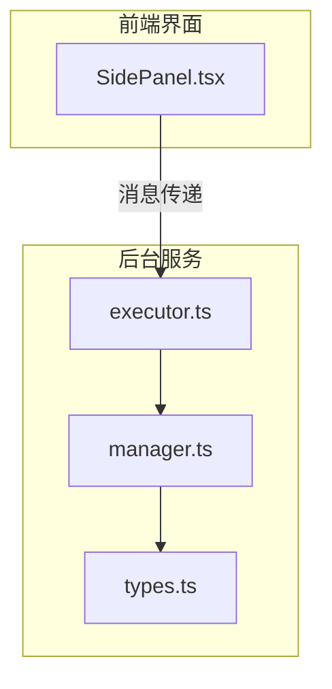
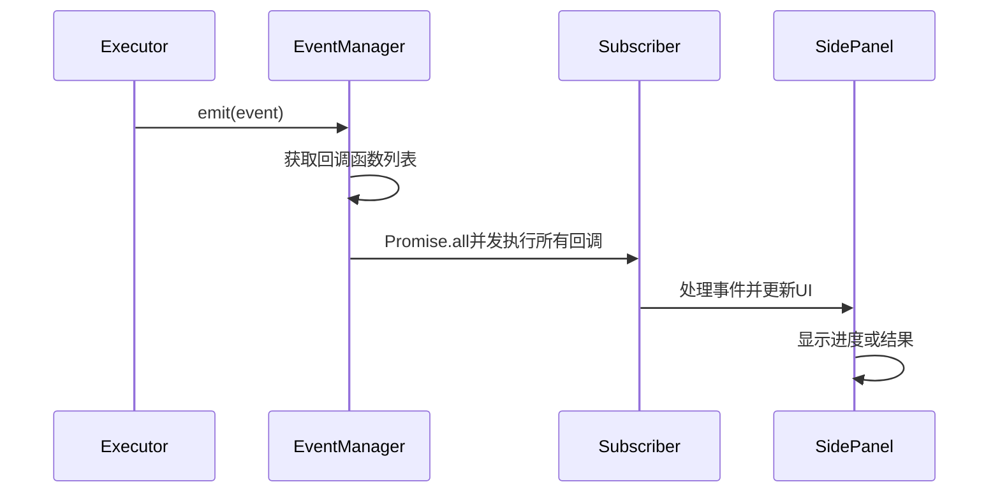
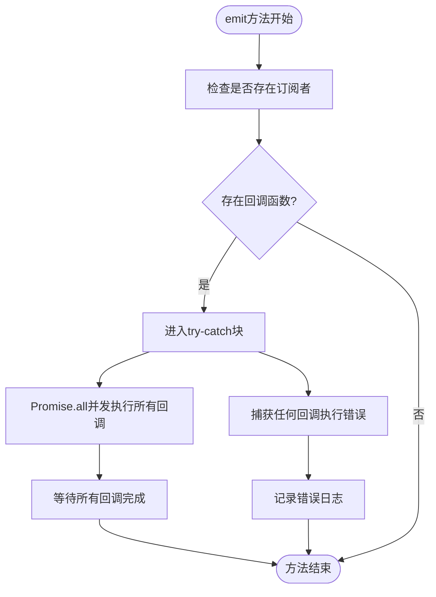
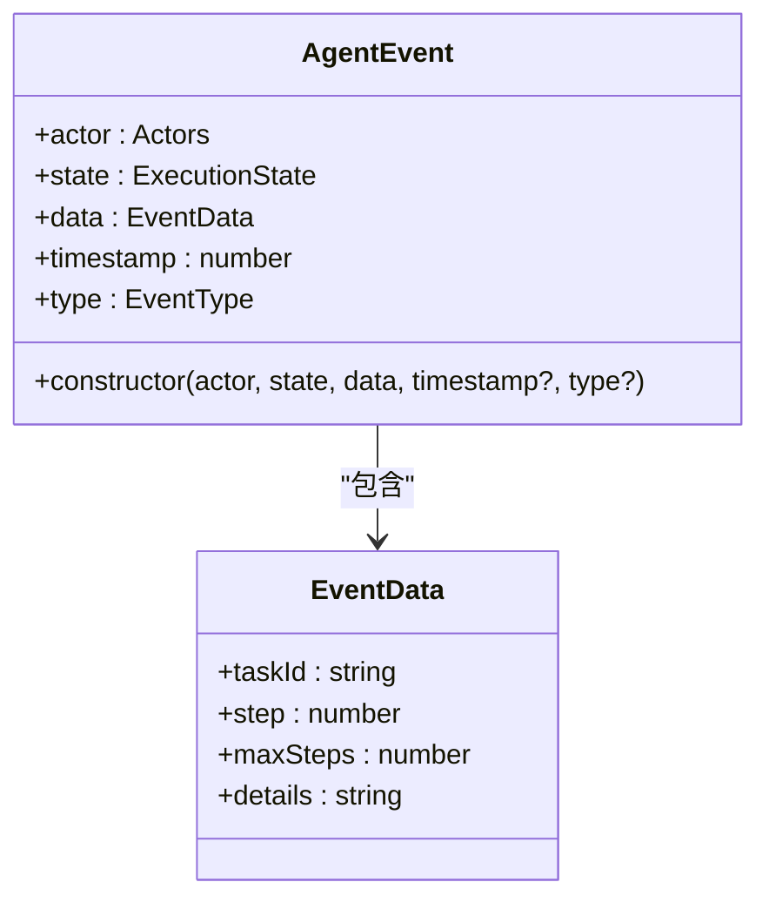
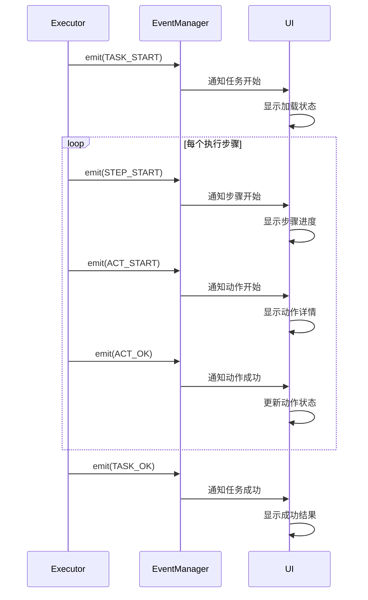
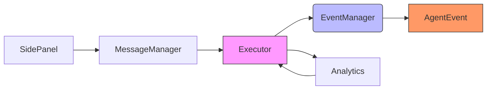

# 事件发射机制

<cite>
**本文档中引用的文件**
- [manager.ts](file://chrome-extension/src/background/agent/event/manager.ts)
- [types.ts](file://chrome-extension/src/background/agent/event/types.ts)
- [executor.ts](file://chrome-extension/src/background/agent/executor.ts)
- [SidePanel.tsx](file://pages/side-panel/src/SidePanel.tsx)
- [types.ts](file://pages/side-panel/src/types/event.ts)
</cite>

## 目录
1. [简介](#简介)
2. [项目结构](#项目结构)
3. [核心组件](#核心组件)
4. [架构概述](#架构概述)
5. [详细组件分析](#详细组件分析)
6. [依赖分析](#依赖分析)
7. [性能考虑](#性能考虑)
8. [故障排除指南](#故障排除指南)
9. [结论](#结论)

## 简介
本文档深入解析EventManager的emit方法实现机制，重点阐述异步事件广播如何通过Promise.all并发执行所有注册的回调函数，确保事件通知的高效性。详细描述了错误捕获策略，当某个回调函数抛出异常时，系统如何通过try-catch阻止异常冒泡并记录错误日志而不影响其他监听器的执行。同时解释了AgentEvent对象的构造参数及其在事件传递中的作用，包括actor、state、data等字段的语义。通过展示任务执行过程中从TASK_START到TASK_OK的完整事件流示例，强调该机制在解耦Executor核心逻辑与UI更新、分析服务之间的桥梁作用，以及其对系统可扩展性的贡献。

## 项目结构
本项目采用模块化架构，主要分为chrome-extension和多个packages。事件管理系统位于chrome-extension/src/background/agent/event目录下，包含manager.ts和types.ts两个核心文件。该系统被Executor组件使用，并通过消息传递与side-panel前端界面进行通信。

**图示来源**
- [manager.ts](file://chrome-extension/src/background/agent/event/manager.ts)
- [types.ts](file://chrome-extension/src/background/agent/event/types.ts)
- [executor.ts](file://chrome-extension/src/background/agent/executor.ts)
- [SidePanel.tsx](file://pages/side-panel/src/SidePanel.tsx)

**章节来源**
- [manager.ts](file://chrome-extension/src/background/agent/event/manager.ts)
- [types.ts](file://chrome-extension/src/background/agent/event/types.ts)

## 核心组件
EventManager是本系统的核心组件，负责管理事件订阅和发布。它通过Map数据结构存储不同事件类型对应的回调函数数组，提供了subscribe、unsubscribe、clearSubscribers和emit等方法。AgentEvent类封装了事件的所有必要信息，包括触发者(actor)、状态(state)、数据(data)、时间戳(timestamp)和事件类型(type)。

**章节来源**
- [manager.ts](file://chrome-extension/src/background/agent/event/manager.ts#L1-L52)
- [types.ts](file://chrome-extension/src/background/agent/event/types.ts#L1-L77)

## 架构概述
事件管理系统采用发布-订阅模式，实现了组件间的松耦合。当Executor执行任务时，会通过emit方法发布各种执行状态事件，这些事件被分发给所有订阅了EXECUTION事件类型的回调函数。前端SidePanel通过建立与后台的连接，接收并处理这些事件，实现UI的实时更新。

**图示来源**
- [manager.ts](file://chrome-extension/src/background/agent/event/manager.ts#L40-L51)
- [executor.ts](file://chrome-extension/src/background/agent/executor.ts#L150-L155)
- [SidePanel.tsx](file://pages/side-panel/src/SidePanel.tsx#L200-L250)

## 详细组件分析

### EventManager.emit方法分析
EventManager的emit方法是事件广播的核心实现。该方法采用异步并发处理机制，确保事件通知的高效性。

#### 并发执行机制

**图示来源**
- [manager.ts](file://chrome-extension/src/background/agent/event/manager.ts#L40-L51)

#### 错误处理策略
emit方法采用了稳健的错误处理策略，确保单个回调函数的异常不会影响其他监听器的执行：

1. 使用try-catch包裹整个Promise.all执行过程
2. 当某个回调抛出异常时，错误被捕获并记录到日志中
3. 其他正常的回调函数继续执行，不受影响
4. 异常信息通过createLogger记录，便于后续调试

这种设计保证了系统的健壮性，即使某个UI组件出现故障，也不会导致整个事件系统崩溃。

**章节来源**
- [manager.ts](file://chrome-extension/src/background/agent/event/manager.ts#L40-L51)
- [log.ts](file://chrome-extension/src/background/log.ts)

### AgentEvent对象分析
AgentEvent对象是事件传递的核心数据结构，封装了事件的所有必要信息。

#### 构造参数语义

**图示来源**
- [types.ts](file://chrome-extension/src/background/agent/event/types.ts#L60-L76)

#### 字段作用说明
- **actor**: 表示事件的触发者，可以是SYSTEM、USER、PLANNER或NAVIGATOR
- **state**: 表示执行状态，如TASK_START、TASK_OK、TASK_FAIL等
- **data**: 包含事件相关的具体数据，如任务ID、当前步骤、最大步骤数和详细信息
- **timestamp**: 事件发生的时间戳，默认为当前时间
- **type**: 事件类型，默认为EXECUTION

这些字段共同构成了完整的事件上下文，使监听器能够准确理解事件的含义并做出相应处理。

**章节来源**
- [types.ts](file://chrome-extension/src/background/agent/event/types.ts#L1-L77)

### 事件流示例分析
以下展示了一个完整的任务执行事件流，从开始到成功完成。

#### 任务执行流程

**图示来源**
- [executor.ts](file://chrome-extension/src/background/agent/executor.ts#L150-L250)
- [types.ts](file://chrome-extension/src/background/agent/event/types.ts#L10-L50)

#### 具体事件序列
1. **TASK_START**: 任务开始执行，UI显示加载动画
2. **STEP_START**: 每个步骤开始，更新步骤计数器
3. **ACT_START**: 每个动作开始，显示具体操作内容
4. **ACT_OK**: 动作成功完成，标记该动作为已完成
5. **TASK_OK**: 任务整体成功完成，显示最终结果

这个事件流展示了系统如何通过细粒度的状态更新，实现对执行过程的精确跟踪和可视化。

**章节来源**
- [executor.ts](file://chrome-extension/src/background/agent/executor.ts#L150-L350)

## 依赖分析
事件管理系统与其他组件存在紧密的依赖关系，形成了一个高效的通信网络。

**图示来源**
- [executor.ts](file://chrome-extension/src/background/agent/executor.ts)
- [manager.ts](file://chrome-extension/src/background/agent/event/manager.ts)
- [types.ts](file://chrome-extension/src/background/agent/event/types.ts)

## 性能考虑
EventManager的设计充分考虑了性能因素：

1. **并发执行**: 使用Promise.all实现回调函数的并发执行，最大化利用异步I/O能力
2. **内存效率**: 使用Map数据结构存储订阅者，提供O(1)的查找性能
3. **错误隔离**: 通过try-catch机制隔离错误，避免单个回调的异常影响整体性能
4. **轻量级**: AgentEvent对象仅包含必要字段，减少序列化和传输开销

这些设计决策确保了事件系统在高负载情况下的稳定性和响应性。

## 故障排除指南
当事件系统出现问题时，可参考以下排查步骤：

1. **检查订阅状态**: 确认相关组件已正确订阅EXECUTION事件
2. **验证连接**: 检查前后端之间的消息通道是否正常建立
3. **查看日志**: 检查createLogger输出的错误信息，特别是"Error executing event callbacks"相关记录
4. **调试事件流**: 在关键节点添加调试信息，跟踪事件的发布和接收过程
5. **验证数据结构**: 确保AgentEvent对象的字段符合预期格式

**章节来源**
- [manager.ts](file://chrome-extension/src/background/agent/event/manager.ts#L45-L50)
- [log.ts](file://chrome-extension/src/background/log.ts)

## 结论
EventManager的emit方法通过Promise.all实现的并发执行机制，确保了事件通知的高效性。其稳健的错误处理策略保证了系统的可靠性，即使个别监听器出现故障也不会影响整体功能。AgentEvent对象精心设计的字段结构提供了丰富的上下文信息，支持复杂的业务逻辑处理。该事件机制成功解耦了Executor核心逻辑与UI更新、分析服务，极大地提升了系统的可扩展性和可维护性。通过标准化的事件流，不同组件能够协同工作，共同构建出一个响应迅速、稳定可靠的自动化执行系统。