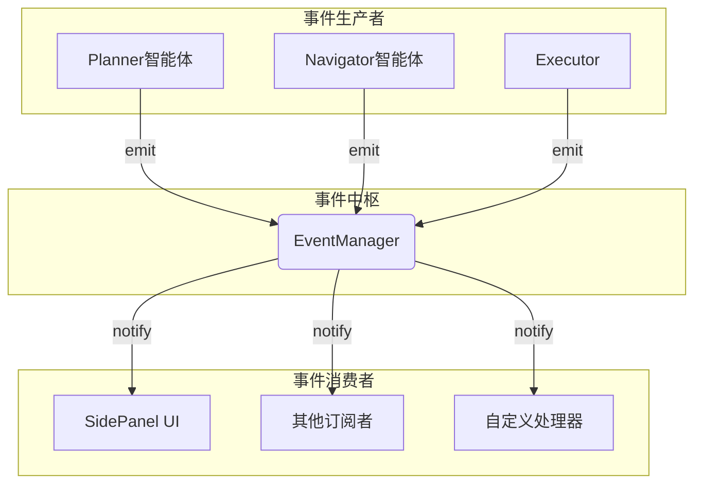
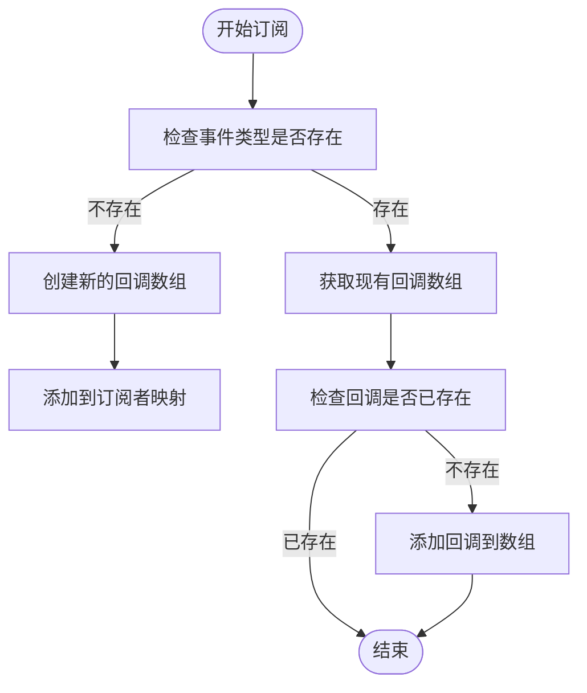
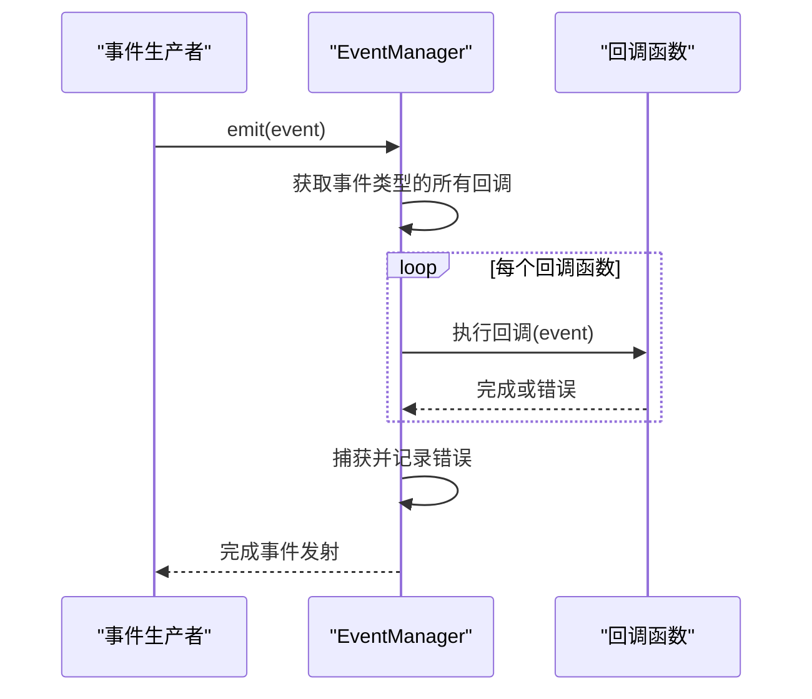
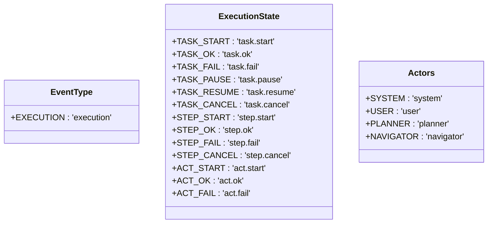
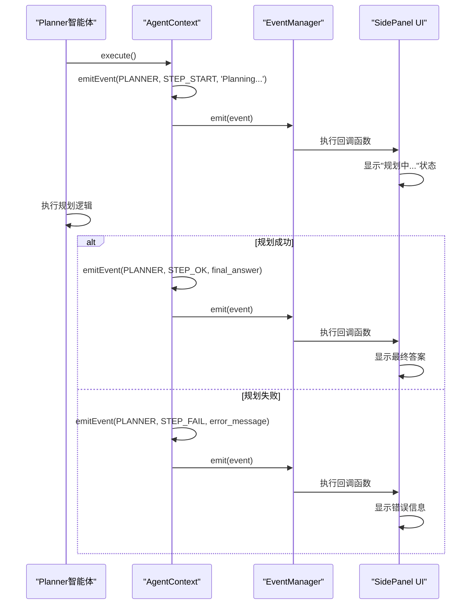
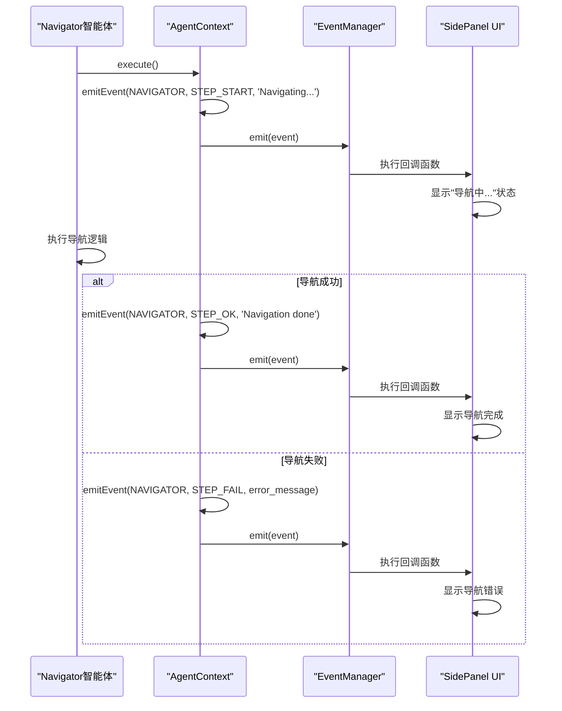
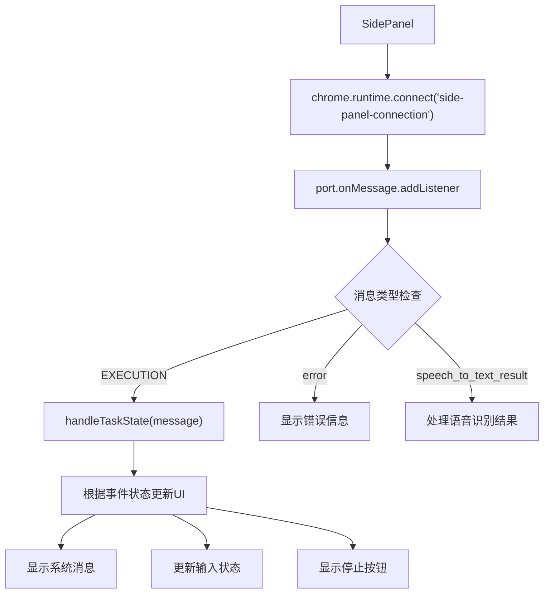
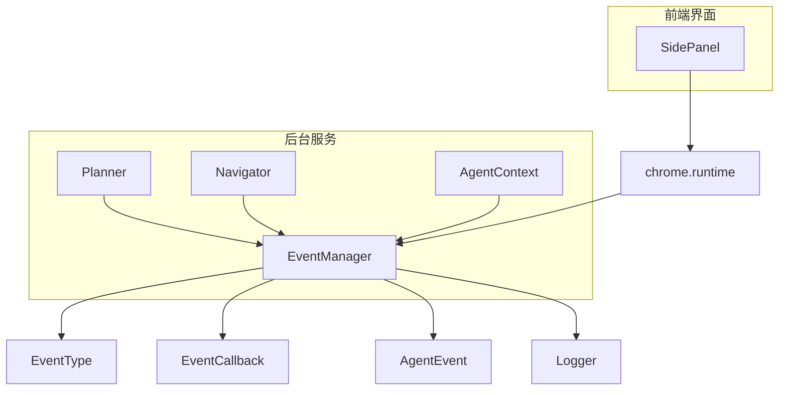

# 事件管理器

<cite>
**本文档中引用的文件**  
- [manager.ts](file://chrome-extension/src/background/agent/event/manager.ts)
- [types.ts](file://chrome-extension/src/background/agent/event/types.ts)
- [planner.ts](file://chrome-extension/src/background/agent/agents/planner.ts)
- [navigator.ts](file://chrome-extension/src/background/agent/agents/navigator.ts)
- [base.ts](file://chrome-extension/src/background/agent/agents/base.ts)
- [types.ts](file://chrome-extension/src/background/agent/types.ts)
- [SidePanel.tsx](file://pages/side-panel/src/SidePanel.tsx)
</cite>

## 目录
1. [简介](#简介)
2. [核心组件](#核心组件)
3. [架构概述](#架构概述)
4. [详细组件分析](#详细组件分析)
5. [依赖分析](#依赖分析)
6. [性能考虑](#性能考虑)
7. [故障排除指南](#故障排除指南)
8. [结论](#结论)

## 简介
事件管理器（EventManager）是纳米浏览器扩展中的核心事件驱动架构组件，实现了基于发布-订阅模式的事件系统。该系统为Planner和Navigator智能体提供了一种松耦合的通信机制，使它们能够通过事件进行状态同步和协调。事件管理器不仅支持核心执行器与UI组件之间的解耦，还为扩展自定义事件处理器提供了灵活的基础架构。

**Section sources**
- [manager.ts](file://chrome-extension/src/background/agent/event/manager.ts#L1-L52)
- [types.ts](file://chrome-extension/src/background/agent/event/types.ts#L1-L77)

## 核心组件
事件管理器的核心组件包括EventManager类、EventType枚举、EventCallback回调函数类型和AgentEvent事件对象。EventManager类实现了订阅、取消订阅和清除订阅者的方法，以及异步发射事件的机制。EventType枚举定义了系统支持的事件类型，目前主要支持执行事件。EventCallback定义了事件订阅者的回调函数签名，而AgentEvent则封装了事件的完整数据模型，包括触发者、状态、数据和时间戳。

**Section sources**
- [manager.ts](file://chrome-extension/src/background/agent/event/manager.ts#L1-L52)
- [types.ts](file://chrome-extension/src/background/agent/event/types.ts#L1-L77)

## 架构概述
事件管理器采用经典的发布-订阅模式，实现了生产者-消费者架构。该架构将事件的发射者（如Planner和Navigator智能体）与事件的消费者（如UI组件）解耦，使得系统组件可以独立演化和扩展。事件管理器作为中央枢纽，负责维护订阅者列表，并在事件发生时通知所有相关的订阅者。



**Diagram sources**
- [manager.ts](file://chrome-extension/src/background/agent/event/manager.ts#L1-L52)
- [planner.ts](file://chrome-extension/src/background/agent/agents/planner.ts#L1-L131)
- [navigator.ts](file://chrome-extension/src/background/agent/agents/navigator.ts#L1-L666)

## 详细组件分析

### EventManager类分析
EventManager类是事件系统的核心实现，提供了完整的发布-订阅功能。该类使用Map数据结构存储每个事件类型对应的回调函数数组，实现了高效的事件分发机制。

#### 类图
```mermaid
classDiagram
class EventManager {
-_subscribers : Map~EventType, EventCallback[]~
+subscribe(eventType : EventType, callback : EventCallback) : void
+unsubscribe(eventType : EventType, callback : EventCallback) : void
+clearSubscribers(eventType : EventType) : void
+emit(event : AgentEvent) : Promise~void~
}
class EventCallback {
<<type>>
(event : AgentEvent) : Promise~void~
}
EventManager --> EventCallback : "has"
```

**Diagram sources**
- [manager.ts](file://chrome-extension/src/background/agent/event/manager.ts#L1-L52)

### 订阅机制分析
EventManager的订阅机制通过`subscribe`方法实现，该方法确保了订阅者的唯一性，防止重复订阅。当订阅一个事件类型时，如果该类型还没有订阅者列表，则创建一个新的空数组；然后检查回调函数是否已经存在，如果不存在则添加到列表中。



**Diagram sources**
- [manager.ts](file://chrome-extension/src/background/agent/event/manager.ts#L15-L25)

### 事件发射机制分析
事件发射机制通过`emit`方法实现，该方法异步执行所有注册的回调函数，并包含完善的错误处理策略。系统使用Promise.all来并行执行所有回调，确保事件处理的高效性，同时通过try-catch块捕获并记录执行过程中的任何错误。



**Diagram sources**
- [manager.ts](file://chrome-extension/src/background/agent/event/manager.ts#L45-L51)
- [types.ts](file://chrome-extension/src/background/agent/event/types.ts#L60-L76)

### EventType枚举分析
EventType枚举定义了系统中所有可用的事件类型。目前系统主要支持EXECUTION执行事件类型，这为未来的扩展提供了基础。枚举的设计遵循了清晰的命名约定，便于理解和维护。



**Diagram sources**
- [types.ts](file://chrome-extension/src/background/agent/event/types.ts#L1-L59)

### 实际使用示例分析
事件系统在Planner和Navigator智能体中有实际应用，展示了智能体如何通过事件系统进行通信和状态同步。当智能体执行任务时，它们会发射各种状态事件，这些事件被UI组件捕获并用于更新用户界面。

#### Planner智能体事件流


**Diagram sources**
- [planner.ts](file://chrome-extension/src/background/agent/agents/planner.ts#L1-L131)
- [types.ts](file://chrome-extension/src/background/agent/types.ts#L50-L120)

#### Navigator智能体事件流


**Diagram sources**
- [navigator.ts](file://chrome-extension/src/background/agent/agents/navigator.ts#L1-L666)
- [types.ts](file://chrome-extension/src/background/agent/types.ts#L50-L120)

### UI组件集成分析
SidePanel UI组件作为事件系统的主要消费者，通过Chrome运行时连接订阅事件，实现了与后台智能体的实时通信。这种设计模式有效地解耦了核心执行器与UI组件，使得两者可以独立开发和维护。



**Diagram sources**
- [SidePanel.tsx](file://pages/side-panel/src/SidePanel.tsx#L1-L200)

## 依赖分析
事件管理器的依赖关系清晰地展示了其在系统架构中的位置和作用。EventManager类依赖于事件类型定义和日志系统，而智能体类则依赖于事件管理器来发射状态变化事件。UI组件通过运行时API依赖于事件系统，实现了跨上下文的通信。



**Diagram sources**
- [manager.ts](file://chrome-extension/src/background/agent/event/manager.ts#L1-L52)
- [planner.ts](file://chrome-extension/src/background/agent/agents/planner.ts#L1-L131)
- [navigator.ts](file://chrome-extension/src/background/agent/agents/navigator.ts#L1-L666)
- [types.ts](file://chrome-extension/src/background/agent/types.ts#L50-L120)
- [SidePanel.tsx](file://pages/side-panel/src/SidePanel.tsx#L1-L200)

## 性能考虑
事件管理器的设计考虑了性能因素，使用Map数据结构确保了O(1)的查找时间复杂度。事件发射采用Promise.all并行执行所有回调函数，最大化利用了JavaScript的异步特性。错误处理机制确保了单个回调函数的失败不会影响其他订阅者的执行，提高了系统的健壮性。

事件管理器的内存使用是可控的，订阅者列表按事件类型组织，可以通过clearSubscribers方法清理特定类型的订阅者。系统没有实现自动清理机制，需要调用者负责管理订阅生命周期，这既提供了灵活性，也要求开发者注意潜在的内存泄漏问题。

## 故障排除指南
当事件系统出现问题时，可以从以下几个方面进行排查：

1. **订阅问题**：确保订阅者正确注册到正确的事件类型，检查回调函数是否被重复添加或未正确移除。
2. **事件发射问题**：验证事件对象的构造是否正确，特别是事件类型、触发者和状态字段。
3. **跨上下文通信问题**：检查Chrome运行时连接是否正常建立，端口名称是否匹配。
4. **错误处理问题**：查看日志中是否有"Error executing event callbacks"的错误信息，这表明某个回调函数执行失败。

调试时可以利用系统内置的日志功能，EventManager会记录回调执行中的任何错误，帮助定位问题根源。

**Section sources**
- [manager.ts](file://chrome-extension/src/background/agent/event/manager.ts#L45-L51)
- [SidePanel.tsx](file://pages/side-panel/src/SidePanel.tsx#L304-L338)

## 结论
事件管理器成功实现了基于发布-订阅模式的事件驱动架构，为纳米浏览器扩展提供了灵活、可扩展的通信机制。该系统有效地解耦了核心执行器与UI组件，使得Planner和Navigator智能体能够通过标准化的事件接口进行状态同步。EventManager的设计简洁而强大，支持异步事件处理和完善的错误处理，为系统的稳定运行提供了保障。未来可以通过扩展EventType枚举来支持更多类型的事件，进一步增强系统的功能和灵活性。