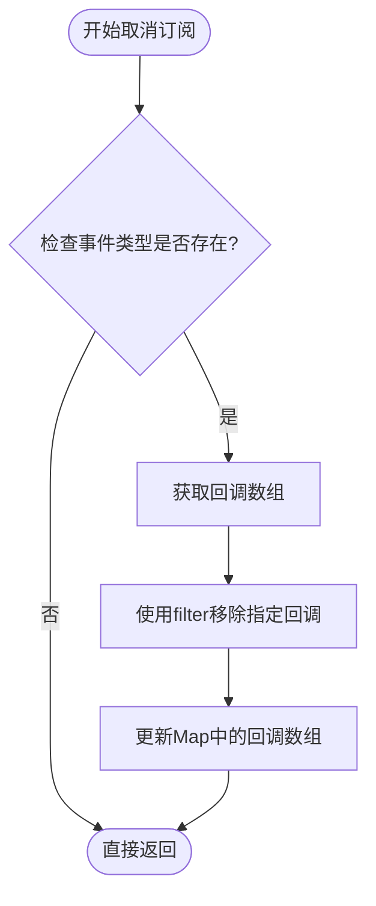

# 事件订阅机制

<cite>
**本文档中引用的文件**
- [manager.ts](file://chrome-extension/src/background/agent/event/manager.ts)
- [types.ts](file://chrome-extension/src/background/agent/event/types.ts)
- [base.ts](file://chrome-extension/src/background/agent/agents/base.ts)
- [planner.ts](file://chrome-extension/src/background/agent/agents/planner.ts)
- [navigator.ts](file://chrome-extension/src/background/agent/agents/navigator.ts)
- [types.ts](file://pages/side-panel/src/types/event.ts)
- [executor.ts](file://chrome-extension/src/background/agent/executor.ts)
- [builder.ts](file://chrome-extension/src/background/agent/actions/builder.ts)
- [types.ts](file://chrome-extension/src/background/agent/types.ts)
</cite>

## 目录
1. [简介](#简介)
2. [项目结构](#项目结构)
3. [核心组件](#核心组件)
4. [架构概览](#架构概览)
5. [详细组件分析](#详细组件分析)
6. [依赖关系分析](#依赖关系分析)
7. [性能考虑](#性能考虑)
8. [故障排除指南](#故障排除指南)
9. [结论](#结论)

## 简介

事件订阅机制是NanoBrowser系统中的核心通信组件，负责在不同智能体（Agent）之间建立松耦合的事件传递通道。该机制基于发布-订阅模式，通过EventManager类实现事件的注册、分发和管理功能，支持任务执行过程中的状态变化通知和错误处理。

## 项目结构

事件订阅机制的核心文件组织如下：


**图表来源**
- [manager.ts](file://chrome-extension/src/background/agent/event/manager.ts#L1-L53)
- [types.ts](file://chrome-extension/src/background/agent/event/types.ts#L1-L78)
- [base.ts](file://chrome-extension/src/background/agent/agents/base.ts#L1-L211)

**章节来源**
- [manager.ts](file://chrome-extension/src/background/agent/event/manager.ts#L1-L53)
- [types.ts](file://chrome-extension/src/background/agent/event/types.ts#L1-L78)

## 核心组件

### EventManager类

EventManager是事件订阅机制的核心控制器，负责管理事件订阅者和事件分发：

- **_subscribers**: 使用Map数据结构存储事件类型与回调函数数组的映射关系
- **subscribe()**: 注册事件监听器，确保同一回调函数不会重复注册
- **unsubscribe()**: 安全移除指定事件类型的回调函数
- **clearSubscribers()**: 清空特定事件类型的所有监听器
- **emit()**: 异步分发事件给所有注册的回调函数

### EventType枚举

定义了系统支持的事件类型，目前主要支持执行事件（EXECUTION）：

```typescript
export enum EventType {
  EXECUTION = 'execution',
}
```

### EventCallback类型

定义了事件回调函数的签名：
```typescript
export type EventCallback = (event: AgentEvent) => Promise<void>;
```

### AgentEvent类

封装了事件的基本信息，包括触发者、状态、数据和时间戳。

**章节来源**
- [manager.ts](file://chrome-extension/src/background/agent/event/manager.ts#L6-L53)
- [types.ts](file://chrome-extension/src/background/agent/event/types.ts#L7-L78)

## 架构概览

事件订阅机制采用发布-订阅模式，通过以下层次结构实现：


**图表来源**
- [manager.ts](file://chrome-extension/src/background/agent/event/manager.ts#L42-L53)
- [types.ts](file://chrome-extension/src/background/agent/types.ts#L65-L72)

## 详细组件分析

### subscribe方法实现

subscribe方法确保同一回调函数不会重复注册：


**图表来源**
- [manager.ts](file://chrome-extension/src/background/agent/event/manager.ts#L12-L22)

关键特性：
- 使用`Map.has()`检查事件类型是否存在
- 使用`Array.includes()`防止重复注册
- 延迟初始化回调数组，节省内存空间

### unsubscribe方法实现

unsubscribe方法通过filter方法安全移除指定回调：



**图表来源**
- [manager.ts](file://chrome-extension/src/background/agent/event/manager.ts#L24-L34)

关键特性：
- 安全检查事件类型存在性
- 使用filter方法创建新数组，保持原数组不变
- 自动清理空数组，避免内存泄漏

### clearSubscribers方法实现

clearSubscribers方法重置特定事件类型的所有监听器：


**图表来源**
- [manager.ts](file://chrome-extension/src/background/agent/event/manager.ts#L36-L41)

关键特性：
- 简单高效地清空所有订阅者
- 不需要遍历或过滤操作
- 支持动态重新注册

### _map数据结构设计优势

EventManager使用Map数据结构存储事件订阅关系：

| 特性 | 优势 |
|------|------|
| 键值对存储 | O(1)时间复杂度的查找操作 |
| 类型安全 | 编译时检查事件类型有效性 |
| 内存效率 | 只为实际存在的事件类型分配内存 |
| 动态扩展 | 运行时动态添加新的事件类型 |

### EventType与回调函数映射关系

```mermaid
classDiagram
class EventManager {
-_subscribers : Map~EventType, EventCallback[]~
+subscribe(eventType, callback) : void
+unsubscribe(eventType, callback) : void
+clearSubscribers(eventType) : void
+emit(event) : Promise~void~
}
class EventType {
<<enumeration>>
EXECUTION
}
class EventCallback {
<<type>>
(event : AgentEvent) => Promise~void~
}
EventManager --> EventType : "键"
EventManager --> EventCallback : "值"
```

**图表来源**
- [manager.ts](file://chrome-extension/src/background/agent/event/manager.ts#L6-L10)
- [types.ts](file://chrome-extension/src/background/agent/event/types.ts#L7-L12)

**章节来源**
- [manager.ts](file://chrome-extension/src/background/agent/event/manager.ts#L12-L41)

### 实际代码示例

#### Planner智能体订阅TASK_START事件

PlannerAgent在执行过程中会触发各种状态事件，这些事件会被其他组件监听：

```typescript
// PlannerAgent内部事件触发示例
this.context.emitEvent(Actors.PLANNER, ExecutionState.STEP_START, 'Planning...');
this.context.emitEvent(Actors.PLANNER, ExecutionState.STEP_OK, eventMessage);
this.context.emitEvent(Actors.PLANNER, ExecutionState.STEP_FAIL, `Planning failed: ${errorMessage}`);
```

#### Navigator智能体监听STEP_FAIL事件

NavigatorAgent同样会在执行失败时发出事件：

```typescript
// NavigatorAgent内部事件触发示例
this.context.emitEvent(Actors.NAVIGATOR, ExecutionState.STEP_FAIL, errorString);
this.context.emitEvent(Actors.NAVIGATOR, ExecutionState.ACT_FAIL, errorMessage);
```

#### 事件监听器注册示例

虽然具体监听器注册代码不在当前文件中，但通常会在智能体初始化时进行：

```typescript
// 示例：注册事件监听器
const eventManager = new EventManager();
const listener = (event: AgentEvent) => {
  console.log(`收到事件: ${event.state} from ${event.actor}`);
};
eventManager.subscribe(EventType.EXECUTION, listener);
```

**章节来源**
- [planner.ts](file://chrome-extension/src/background/agent/agents/planner.ts#L50-L60)
- [navigator.ts](file://chrome-extension/src/background/agent/agents/navigator.ts#L150-L160)
- [executor.ts](file://chrome-extension/src/background/agent/executor.ts#L183-L204)

### 避免内存泄漏的设计考量

事件订阅机制在设计上充分考虑了内存泄漏问题：

#### 正确清理订阅的重要性

1. **自动清理机制**：clearSubscribers方法允许主动清理订阅
2. **弱引用模式**：回调函数作为独立对象，不持有EventManager的强引用
3. **异常处理**：emit方法捕获回调执行异常，防止影响其他订阅者

#### 内存泄漏防护措施


**章节来源**
- [manager.ts](file://chrome-extension/src/background/agent/event/manager.ts#L42-L53)

### 错误处理场景

#### 对未注册事件类型的取消订阅操作

EventManager的安全设计确保了对不存在事件类型的取消订阅不会产生副作用：

```typescript
// 安全的取消订阅示例
try {
  eventManager.unsubscribe(EventType.EXECUTION, callback);
} catch (error) {
  // 如果事件类型不存在，unsubscribe方法会静默处理
  console.log('尝试取消不存在的事件类型订阅');
}
```

#### 回调函数执行异常处理

emit方法实现了完善的异常处理机制：

```typescript
async emit(event: AgentEvent): Promise<void> {
  const callbacks = this._subscribers.get(event.type);
  if (callbacks) {
    try {
      await Promise.all(callbacks.map(async callback => await callback(event)));
    } catch (error) {
      logger.error('Error executing event callbacks:', error);
    }
  }
}
```

**章节来源**
- [manager.ts](file://chrome-extension/src/background/agent/event/manager.ts#L42-L53)

## 依赖关系分析

事件订阅机制的依赖关系图展示了各组件之间的交互：


**图表来源**
- [manager.ts](file://chrome-extension/src/background/agent/event/manager.ts#L1-L5)
- [types.ts](file://chrome-extension/src/background/agent/event/types.ts#L1-L78)
- [base.ts](file://chrome-extension/src/background/agent/agents/base.ts#L1-L10)

**章节来源**
- [manager.ts](file://chrome-extension/src/background/agent/event/manager.ts#L1-L5)
- [types.ts](file://chrome-extension/src/background/agent/event/types.ts#L1-L78)

## 性能考虑

### 时间复杂度分析

| 操作 | 时间复杂度 | 说明 |
|------|------------|------|
| subscribe | O(1) | Map查找和数组操作 |
| unsubscribe | O(n) | n为当前事件类型的回调数量 |
| clearSubscribers | O(1) | 直接设置空数组 |
| emit | O(m×n) | m为并发回调数，n为平均回调数量 |

### 内存使用优化

1. **延迟初始化**：只在首次订阅时创建回调数组
2. **及时清理**：提供clearSubscribers方法主动清理
3. **弱引用**：回调函数不持有EventManager的强引用

### 并发处理

EventManager使用Promise.all实现并发回调执行，提高事件分发效率：

```typescript
await Promise.all(callbacks.map(async callback => await callback(event)));
```

## 故障排除指南

### 常见问题及解决方案

#### 问题1：事件无法被正确接收

**症状**：订阅了事件但回调函数没有被执行

**可能原因**：
- 事件类型拼写错误
- 回调函数被意外移除
- 事件管理器实例不一致

**解决方案**：
```typescript
// 检查事件类型
console.log('可用事件类型:', Object.values(EventType));

// 验证订阅状态
const callbacks = eventManager['_subscribers'].get(EventType.EXECUTION);
console.log('当前订阅数量:', callbacks?.length || 0);
```

#### 问题2：内存泄漏

**症状**：长时间运行后内存使用持续增长

**可能原因**：
- 未及时清理不再需要的订阅
- 回调函数持有大量数据引用

**解决方案**：
```typescript
// 主动清理订阅
eventManager.clearSubscribers(EventType.EXECUTION);

// 或者按需移除特定回调
eventManager.unsubscribe(EventType.EXECUTION, oldCallback);
```

#### 问题3：回调函数执行异常

**症状**：某个回调函数抛出异常导致后续回调无法执行

**解决方案**：
EventManager已经内置异常处理，但可以进一步增强：
```typescript
const safeCallback = async (event: AgentEvent) => {
  try {
    await originalCallback(event);
  } catch (error) {
    console.error('回调执行失败:', error);
    // 可选择重新注册回调或记录错误
  }
};
```

**章节来源**
- [manager.ts](file://chrome-extension/src/background/agent/event/manager.ts#L42-L53)

## 结论

NanoBrowser的事件订阅机制通过EventManager类提供了强大而灵活的事件通信能力。其设计特点包括：

1. **安全性**：防止重复订阅和内存泄漏
2. **灵活性**：支持多种事件类型和回调函数
3. **可维护性**：清晰的接口设计和完善的错误处理
4. **性能**：高效的Map数据结构和并发回调执行

该机制为NanoBrowser系统的智能体间通信奠定了坚实的基础，支持复杂的任务执行流程和状态管理需求。通过合理使用subscribe、unsubscribe和clearSubscribers方法，开发者可以构建健壮的事件驱动应用程序。