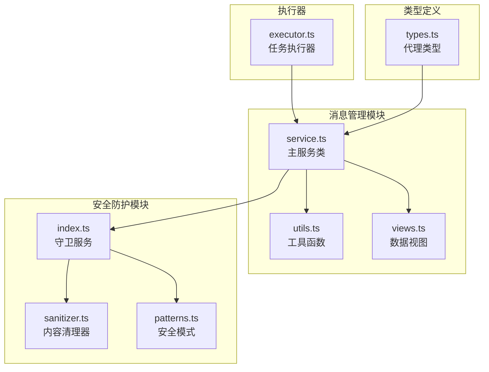
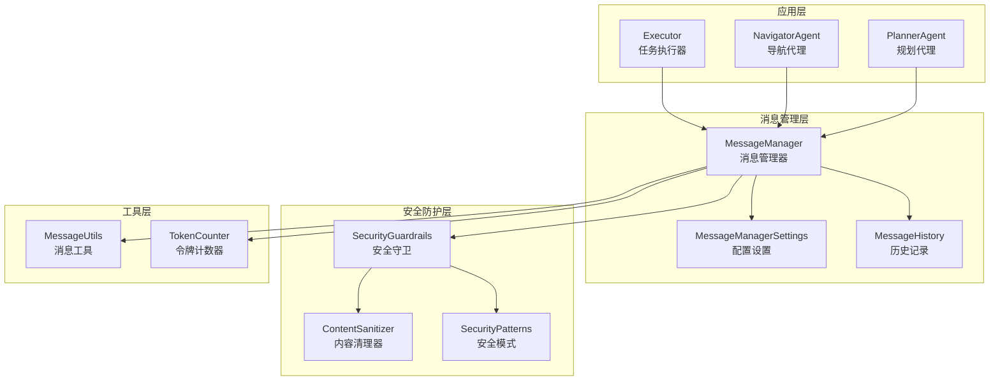
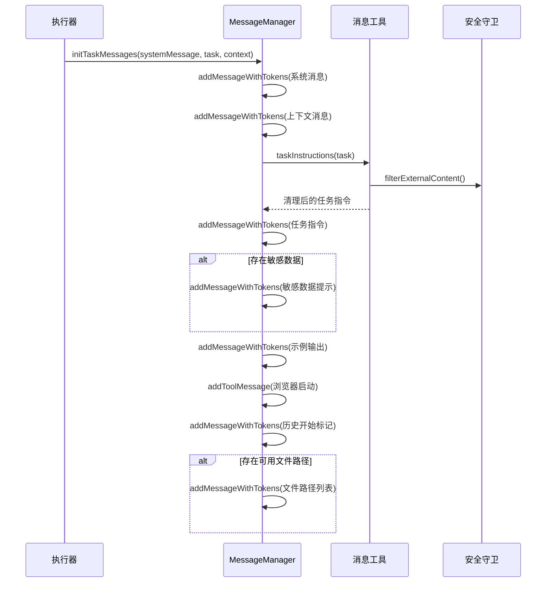
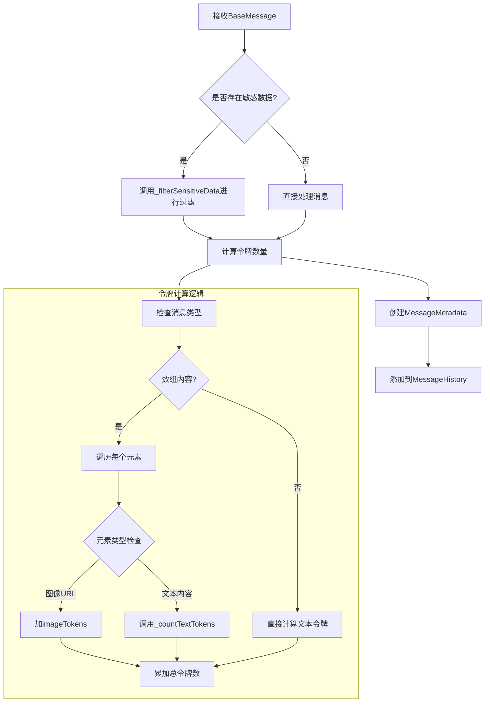
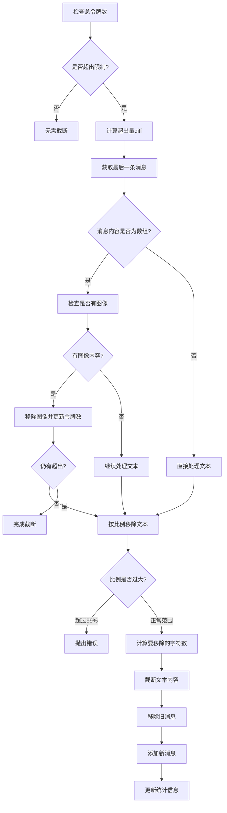
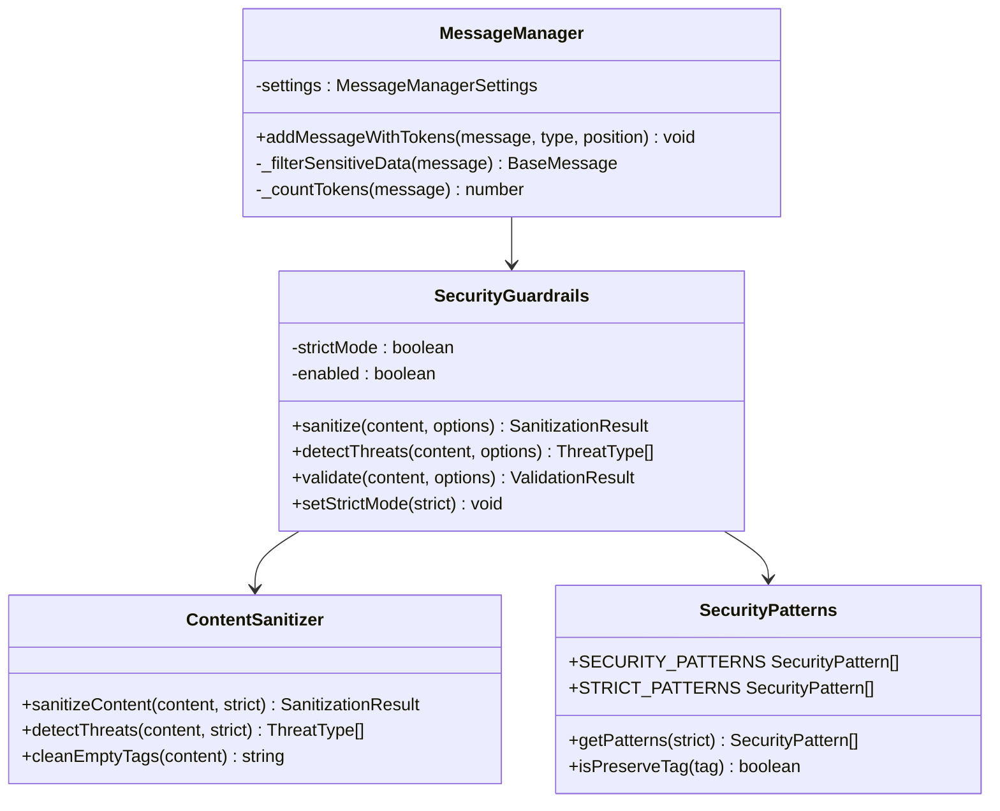

# MessageManager核心功能详细文档

<cite>
**本文档中引用的文件**
- [service.ts](file://chrome-extension/src/background/agent/messages/service.ts)
- [utils.ts](file://chrome-extension/src/background/agent/messages/utils.ts)
- [views.ts](file://chrome-extension/src/background/agent/messages/views.ts)
- [types.ts](file://chrome-extension/src/background/agent/types.ts)
- [executor.ts](file://chrome-extension/src/background/agent/executor.ts)
- [index.ts](file://chrome-extension/src/background/services/guardrails/index.ts)
- [sanitizer.ts](file://chrome-extension/src/background/services/guardrails/sanitizer.ts)
- [patterns.ts](file://chrome-extension/src/background/services/guardrails/patterns.ts)
</cite>

## 目录
1. [简介](#简介)
2. [项目结构](#项目结构)
3. [核心组件](#核心组件)
4. [架构概览](#架构概览)
5. [详细组件分析](#详细组件分析)
6. [依赖关系分析](#依赖关系分析)
7. [性能考虑](#性能考虑)
8. [故障排除指南](#故障排除指南)
9. [结论](#结论)

## 简介

MessageManager是NanoBrowser扩展中的核心消息管理系统，负责处理AI代理与用户之间的所有通信。它提供了完整的消息生命周期管理，包括系统消息初始化、任务指令生成、上下文注入、敏感数据过滤、令牌计算和智能截断等功能。

该系统采用模块化设计，支持多种消息类型（系统消息、人类消息、AI消息、工具消息），具备强大的安全防护机制，并能够智能地管理对话历史以适应不同的令牌限制要求。

## 项目结构

MessageManager相关的文件组织结构如下：



**图表来源**
- [service.ts](file://chrome-extension/src/background/agent/messages/service.ts#L1-L441)
- [utils.ts](file://chrome-extension/src/background/agent/messages/utils.ts#L1-L330)
- [views.ts](file://chrome-extension/src/background/agent/messages/views.ts#L1-L88)

**章节来源**
- [service.ts](file://chrome-extension/src/background/agent/messages/service.ts#L1-L50)
- [utils.ts](file://chrome-extension/src/background/agent/messages/utils.ts#L1-L30)

## 核心组件

MessageManager系统包含以下核心组件：

### MessageManager类
主控制器类，负责消息的完整生命周期管理，包括初始化、添加、过滤和截断。

### MessageManagerSettings配置类
提供灵活的配置选项，支持自定义令牌限制、字符到令牌比率、图像令牌数等参数。

### MessageHistory历史管理类
维护消息历史记录，跟踪总令牌数并支持消息的增删操作。

### 安全防护系统
集成Guardrails服务，提供内容过滤、威胁检测和敏感数据保护功能。

**章节来源**
- [service.ts](file://chrome-extension/src/background/agent/messages/service.ts#L43-L83)
- [views.ts](file://chrome-extension/src/background/agent/messages/views.ts#L25-L87)

## 架构概览

MessageManager采用分层架构设计，确保了良好的可维护性和扩展性：



**图表来源**
- [executor.ts](file://chrome-extension/src/background/agent/executor.ts#L28-L68)
- [service.ts](file://chrome-extension/src/background/agent/messages/service.ts#L43-L83)
- [index.ts](file://chrome-extension/src/background/services/guardrails/index.ts#L15-L44)

## 详细组件分析

### initTaskMessages方法：系统消息初始化流程

initTaskMessages方法是MessageManager的核心入口点，负责构建完整的任务消息序列：



**图表来源**
- [service.ts](file://chrome-extension/src/background/agent/messages/service.ts#L54-L132)
- [utils.ts](file://chrome-extension/src/background/agent/messages/utils.ts#L241-L259)

#### 初始化步骤详解

1. **系统消息添加**：将预定义的系统消息添加到历史记录
2. **上下文注入**：如果提供上下文信息，则添加相应的上下文消息
3. **任务指令生成**：通过静态方法生成格式化的任务指令
4. **敏感数据处理**：识别并标记敏感数据占位符
5. **示例输出**：添加示例输出模板
6. **工具调用初始化**：设置初始的工具调用状态
7. **历史标记**：添加历史记录的起始标记
8. **文件路径处理**：如果存在可用文件路径，则添加文件路径列表

**章节来源**
- [service.ts](file://chrome-extension/src/background/agent/messages/service.ts#L54-L132)

### addMessageWithTokens方法：消息过滤与令牌计算

addMessageWithTokens方法实现了消息的安全处理和精确的令牌计算：



**图表来源**
- [service.ts](file://chrome-extension/src/background/agent/messages/service.ts#L281-L291)
- [service.ts](file://chrome-extension/src/background/agent/messages/service.ts#L334-L373)

#### 关键特性

1. **敏感数据过滤**：自动识别并替换敏感数据为占位符
2. **精确令牌计算**：支持文本和图像内容的混合消息
3. **元数据注入**：自动添加令牌数量和消息类型的元数据
4. **位置控制**：支持在指定位置插入消息

**章节来源**
- [service.ts](file://chrome-extension/src/background/agent/messages/service.ts#L281-L291)
- [service.ts](file://chrome-extension/src/background/agent/messages/service.ts#L334-L373)

### cutMessages方法：智能截断策略

当消息总令牌数超过最大限制时，cutMessages方法采用智能截断策略：



**图表来源**
- [service.ts](file://chrome-extension/src/background/agent/messages/service.ts#L379-L426)

#### 截断算法特点

1. **优先级策略**：先移除图像内容，再按比例移除文本
2. **缓冲机制**：避免过度截断导致信息丢失
3. **错误处理**：当截断比例过大时抛出明确的错误信息
4. **统计更新**：实时更新令牌统计和消息计数

**章节来源**
- [service.ts](file://chrome-extension/src/background/agent/messages/service.ts#L379-L426)

### 安全防护系统集成

MessageManager深度集成了安全防护系统，确保消息内容的安全性：



**图表来源**
- [index.ts](file://chrome-extension/src/background/services/guardrails/index.ts#L15-L44)
- [sanitizer.ts](file://chrome-extension/src/background/services/guardrails/sanitizer.ts#L15-L43)
- [patterns.ts](file://chrome-extension/src/background/services/guardrails/patterns.ts#L10-L36)

**章节来源**
- [index.ts](file://chrome-extension/src/background/services/guardrails/index.ts#L46-L85)
- [sanitizer.ts](file://chrome-extension/src/background/services/guardrails/sanitizer.ts#L41-L79)

## 依赖关系分析

MessageManager系统的依赖关系展现了清晰的分层架构：

```mermaid
graph LR
subgraph "外部依赖"
A[@langchain/core/messages]
B[webextension-polyfill]
end
subgraph "内部模块"
C[log.ts]
D[guardrails模块]
E[browser模块]
end
subgraph "核心组件"
F[MessageManager]
G[MessageHistory]
H[MessageMetadata]
end
A --> F
B --> F
C --> F
D --> F
E --> F
F --> G
F --> H
```

**图表来源**
- [service.ts](file://chrome-extension/src/background/agent/messages/service.ts#L1-L10)
- [views.ts](file://chrome-extension/src/background/agent/messages/views.ts#L1-L5)

### 主要依赖项

1. **LangChain核心消息**：提供BaseMessage、AIMessage、HumanMessage等基础类型
2. **日志系统**：统一的日志记录和调试功能
3. **安全防护**：Guardrails服务提供内容过滤和威胁检测
4. **浏览器上下文**：与浏览器环境的交互能力

**章节来源**
- [service.ts](file://chrome-extension/src/background/agent/messages/service.ts#L1-L10)
- [views.ts](file://chrome-extension/src/background/agent/messages/views.ts#L1-L5)

## 性能考虑

### 令牌计算优化

MessageManager采用了多种优化策略来提高性能：

| 优化策略 | 实现方式 | 性能收益 |
|---------|---------|---------|
| 字符到令牌估算 | 基于字符长度的简单估算公式 | 避免复杂的分词器开销 |
| 缓存机制 | 在内存中缓存令牌计算结果 | 减少重复计算 |
| 增量更新 | 只更新变化的消息的令牌数 | 提高历史管理效率 |
| 智能截断 | 优先移除图像内容而非文本 | 平衡信息保留和性能 |

### 内存管理

1. **消息历史限制**：通过cutMessages方法自动管理历史长度
2. **延迟加载**：只在需要时才计算令牌数量
3. **对象复用**：重用MessageMetadata对象减少GC压力

### 配置建议

为了获得最佳性能，建议合理设置以下参数：

- **maxInputTokens**: 根据模型能力和任务复杂度设置，推荐值：128000
- **estimatedCharactersPerToken**: 根据语言特性调整，英文推荐3，中文推荐4-5
- **imageTokens**: 根据图像分辨率和模型要求设置，推荐值：800

## 故障排除指南

### 常见问题及解决方案

#### 令牌溢出错误
**症状**: 抛出"Max token limit reached"错误
**原因**: 消息历史过长或单条消息内容过多
**解决方案**: 
1. 检查MessageManagerSettings.maxInputTokens配置
2. 使用cutMessages方法自动截断
3. 优化任务描述，减少不必要的细节

#### 敏感数据泄露
**症状**: 敏感信息未被正确过滤
**原因**: 敏感数据配置不完整或过滤规则不足
**解决方案**:
1. 完善MessageManagerSettings.sensitiveData配置
2. 启用严格模式：guardrails.setStrictMode(true)
3. 定期审查过滤规则的有效性

#### 性能下降
**症状**: 消息处理速度明显变慢
**原因**: 令牌计算过于频繁或历史记录过大
**解决方案**:
1. 调整estimatedCharactersPerToken参数
2. 设置合理的maxInputTokens限制
3. 定期清理不需要的历史消息

**章节来源**
- [service.ts](file://chrome-extension/src/background/agent/messages/service.ts#L379-L426)
- [index.ts](file://chrome-extension/src/background/services/guardrails/index.ts#L128-L175)

## 结论

MessageManager作为NanoBrowser扩展的核心组件，展现了优秀的软件架构设计。它不仅提供了完整的消息管理功能，还集成了强大的安全防护机制，确保了系统的可靠性和安全性。

### 主要优势

1. **模块化设计**：清晰的职责分离和良好的封装
2. **安全优先**：内置多层安全防护机制
3. **性能优化**：智能的令牌管理和截断策略
4. **灵活配置**：丰富的配置选项适应不同需求
5. **易于扩展**：良好的接口设计支持功能扩展

### 最佳实践建议

1. **合理配置参数**：根据具体应用场景调整令牌限制和字符比率
2. **定期监控**：关注令牌使用情况和系统性能指标
3. **安全审计**：定期审查敏感数据过滤规则的有效性
4. **版本兼容**：保持与相关依赖库的版本同步

MessageManager的设计体现了现代软件开发的最佳实践，为AI代理系统提供了稳定、安全、高效的消息管理基础设施。