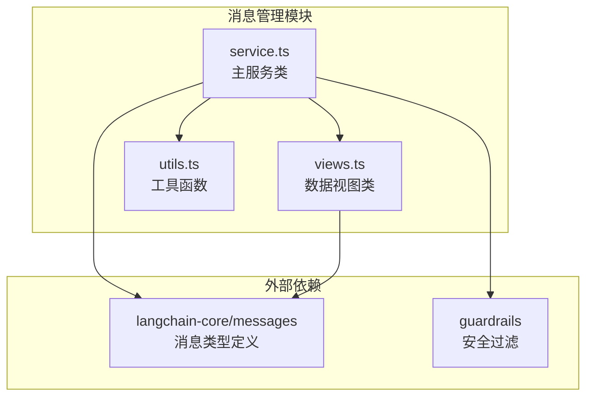
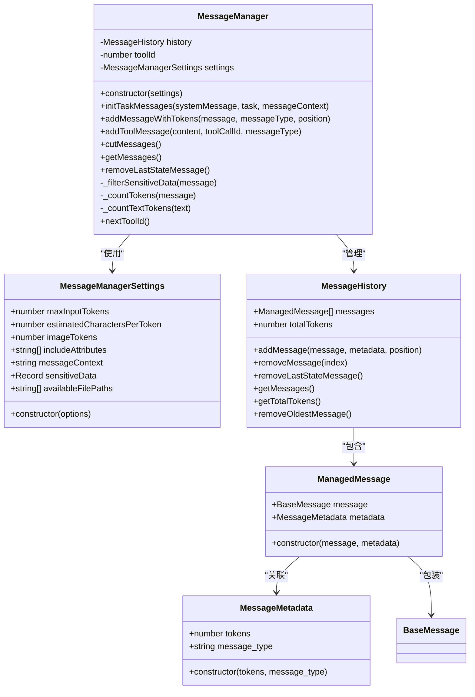
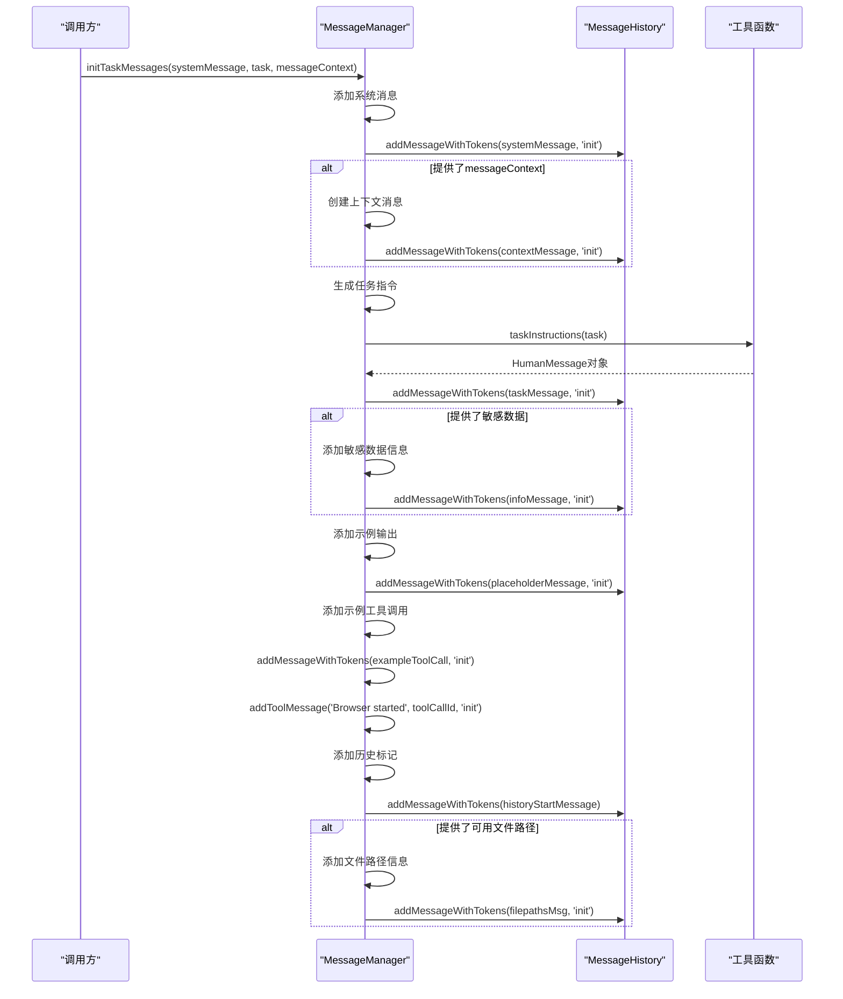
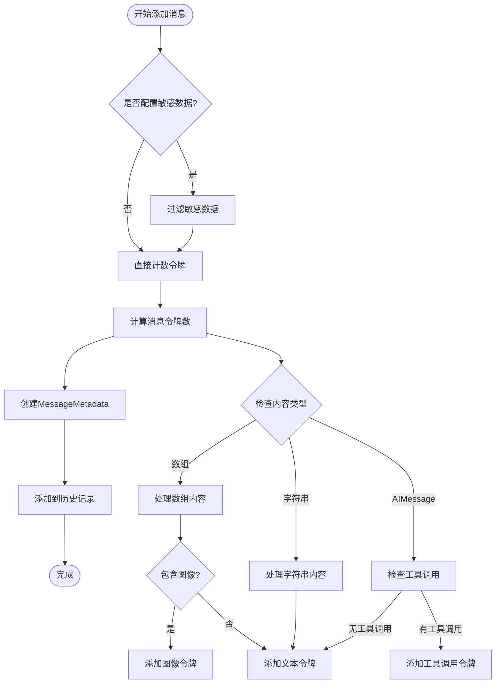
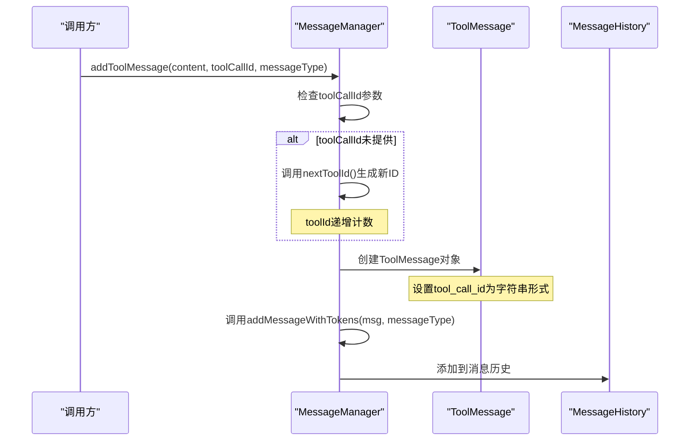
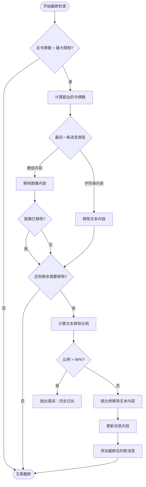
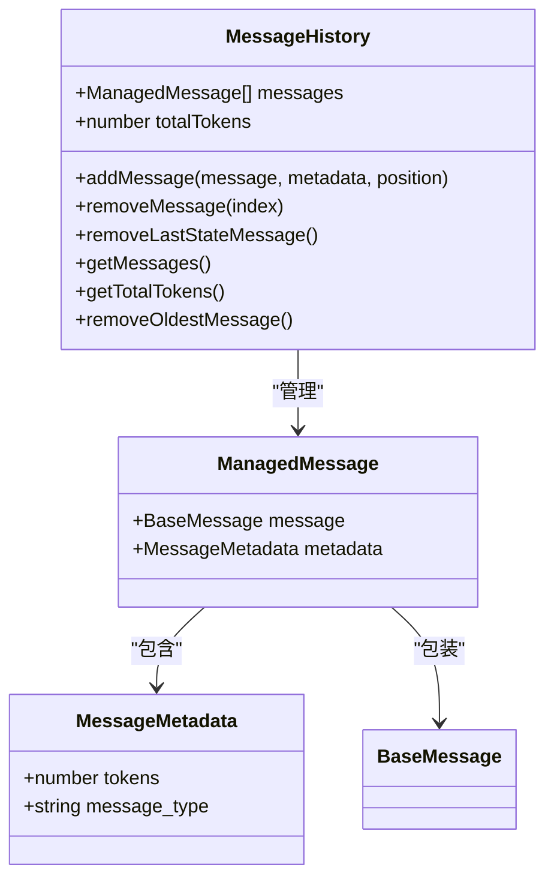
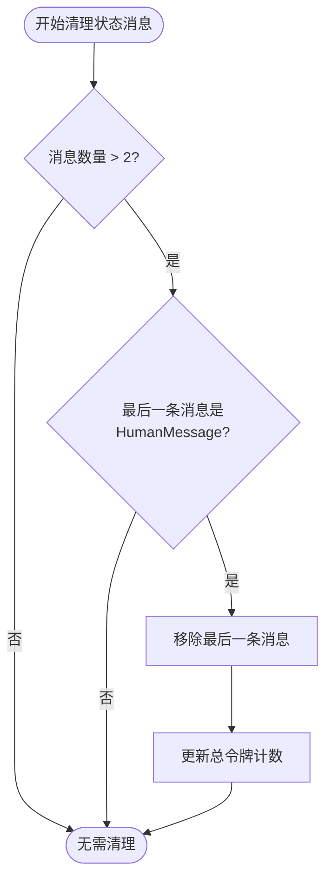
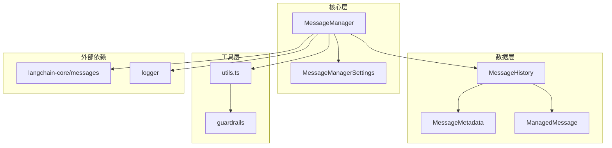

# 消息管理器

<cite>
**本文档中引用的文件**
- [service.ts](file://chrome-extension/src/background/agent/messages/service.ts)
- [views.ts](file://chrome-extension/src/background/agent/messages/views.ts)
- [utils.ts](file://chrome-extension/src/background/agent/messages/utils.ts)
</cite>

## 目录
1. [简介](#简介)
2. [项目结构](#项目结构)
3. [核心组件](#核心组件)
4. [架构概览](#架构概览)
5. [详细组件分析](#详细组件分析)
6. [依赖关系分析](#依赖关系分析)
7. [性能考虑](#性能考虑)
8. [故障排除指南](#故障排除指南)
9. [结论](#结论)

## 简介

MessageManager类是NanoBrowser项目中的核心消息管理系统，负责处理AI对话过程中的所有消息交互。该系统提供了完整的消息历史管理、令牌计算与限制、敏感数据过滤和上下文注入功能。通过智能的令牌管理机制，确保AI模型能够高效地处理大量对话历史，同时保护用户隐私和系统安全。

## 项目结构

MessageManager相关的文件组织结构如下：



**图表来源**
- [service.ts](file://chrome-extension/src/background/agent/messages/service.ts#L1-L10)
- [views.ts](file://chrome-extension/src/background/agent/messages/views.ts#L1-L5)

**章节来源**
- [service.ts](file://chrome-extension/src/background/agent/messages/service.ts#L1-L441)
- [views.ts](file://chrome-extension/src/background/agent/messages/views.ts#L1-L88)

## 核心组件

MessageManager系统由以下核心组件构成：

### MessageManagerSettings配置类
负责管理消息系统的各项参数设置，包括最大输入令牌数、字符每令牌比率、图像令牌消耗等关键配置。

### MessageManager主控制器
作为消息管理的核心协调器，提供完整的消息生命周期管理功能。

### MessageHistory历史管理器
维护消息历史的存储结构，跟踪总令牌数并提供消息操作接口。

### MessageMetadata元数据管理
为每个消息附加令牌计数和类型信息，支持精细化的消息管理。

**章节来源**
- [service.ts](file://chrome-extension/src/background/agent/messages/service.ts#L13-L52)
- [views.ts](file://chrome-extension/src/background/agent/messages/views.ts#L1-L88)

## 架构概览

MessageManager采用分层架构设计，确保功能模块的清晰分离和高效协作：



**图表来源**
- [service.ts](file://chrome-extension/src/background/agent/messages/service.ts#L13-L52)
- [service.ts](file://chrome-extension/src/background/agent/messages/service.ts#L54-L441)
- [views.ts](file://chrome-extension/src/background/agent/messages/views.ts#L1-L88)

## 详细组件分析

### MessageManagerSettings配置系统

MessageManagerSettings类提供了灵活的配置机制，允许开发者根据具体需求调整消息处理行为：

#### 核心配置参数

| 参数名称 | 类型 | 默认值 | 描述 |
|---------|------|--------|------|
| maxInputTokens | number | 128000 | 最大输入令牌限制，控制对话历史长度 |
| estimatedCharactersPerToken | number | 3 | 字符到令牌的估算比率 |
| imageTokens | number | 800 | 单张图像的固定令牌消耗量 |
| includeAttributes | string[] | [] | 需要包含的消息属性列表 |
| messageContext | string | undefined | 全局消息上下文信息 |
| sensitiveData | Record<string, string> | undefined | 敏感数据映射表 |
| availableFilePaths | string[] | undefined | 可用文件路径列表 |

#### 配置使用示例

```typescript
// 基础配置
const basicSettings = new MessageManagerSettings({
  maxInputTokens: 64000,
  estimatedCharactersPerToken: 4
});

// 完整配置
const advancedSettings = new MessageManagerSettings({
  maxInputTokens: 128000,
  estimatedCharactersPerToken: 3,
  imageTokens: 800,
  messageContext: "用户正在执行网页浏览任务",
  sensitiveData: {
    "username": "john_doe",
    "password": "secret_password"
  },
  availableFilePaths: ["/home/user/documents"]
});
```

**章节来源**
- [service.ts](file://chrome-extension/src/background/agent/messages/service.ts#L13-L52)

### initTaskMessages系统消息初始化流程

initTaskMessages方法是MessageManager的核心功能之一，负责系统消息的完整初始化流程：



**图表来源**
- [service.ts](file://chrome-extension/src/background/agent/messages/service.ts#L54-L130)

#### 初始化步骤详解

1. **系统消息添加**：将提供的SystemMessage作为对话的基础指令
2. **上下文注入**：如果提供了messageContext，则添加上下文信息
3. **任务指令生成**：通过taskInstructions静态方法生成具体的任务指令
4. **敏感数据处理**：如果配置了敏感数据，添加相应的占位符信息
5. **示例输出构建**：添加示例输出标记，指导模型生成格式化的响应
6. **工具调用示例**：添加预设的工具调用示例，展示预期的交互模式
7. **历史标记**：添加任务历史的起始标记
8. **文件路径信息**：如果提供了可用文件路径，添加相关提示

**章节来源**
- [service.ts](file://chrome-extension/src/background/agent/messages/service.ts#L54-L130)

### addMessageWithTokens令牌计数机制

addMessageWithTokens方法实现了智能的令牌计数和消息过滤功能：



**图表来源**
- [service.ts](file://chrome-extension/src/background/agent/messages/service.ts#L258-L291)
- [service.ts](file://chrome-extension/src/background/agent/messages/service.ts#L334-L373)

#### 文本和图像内容的令牌估算策略

系统采用分层的令牌估算策略：

1. **文本内容估算**：
   - 基于字符数和预设的字符每令牌比率
   - 使用`Math.floor(text.length / estimatedCharactersPerToken)`公式
   - 支持不同语言和文本类型的适应性调整

2. **图像内容估算**：
   - 固定的图像令牌消耗量（默认800令牌）
   - 适用于视觉理解任务中的图像描述
   - 可通过settings.imageTokens参数自定义

3. **工具调用内容估算**：
   - 将工具调用参数序列化为JSON字符串
   - 基于JSON字符串的字符数进行令牌估算
   - 支持复杂的多步工具调用场景

**章节来源**
- [service.ts](file://chrome-extension/src/background/agent/messages/service.ts#L334-L373)
- [service.ts](file://chrome-extension/src/background/agent/messages/service.ts#L373-L397)

### addToolMessage工具消息处理流程

addToolMessage方法专门处理工具调用相关的消息，确保工具调用的正确性和可追溯性：



**图表来源**
- [service.ts](file://chrome-extension/src/background/agent/messages/service.ts#L428-L439)

#### tool_call_id生成机制

工具调用ID采用递增计数器机制：

1. **ID生成策略**：每次调用nextToolId()方法时，toolId递增1
2. **ID格式转换**：将数字ID转换为字符串格式，符合ToolMessage的要求
3. **唯一性保证**：确保每个工具调用都有唯一的标识符
4. **可追溯性**：通过ID可以追踪特定工具调用的完整生命周期

**章节来源**
- [service.ts](file://chrome-extension/src/background/agent/messages/service.ts#L428-L439)
- [service.ts](file://chrome-extension/src/background/agent/messages/service.ts#L132-L135)

### cutMessages智能截断策略

当消息总令牌数超过最大限制时，cutMessages方法会执行智能截断策略：



**图表来源**
- [service.ts](file://chrome-extension/src/background/agent/messages/service.ts#L354-L426)

#### 截断策略详解

1. **优先级策略**：
   - 首先尝试移除图像内容（因为图像令牌消耗较大）
   - 如果仍有超出，才考虑移除文本内容
   - 移除文本时采用比例截断，保持内容的完整性

2. **比例计算**：
   - 计算需要移除的令牌比例：`diff / lastMsg.metadata.tokens`
   - 设置安全阈值：比例超过99%时抛出错误
   - 确保截断后的消息仍具有足够的信息量

3. **文本截断算法**：
   - 基于字符长度的比例计算
   - 使用`Math.floor()`确保整数字符数
   - 保留消息的开头部分，避免截断中间内容

**章节来源**
- [service.ts](file://chrome-extension/src/background/agent/messages/service.ts#L354-L426)

### MessageHistory内部工作机制

MessageHistory类提供了消息历史的底层存储和管理功能：

#### 消息存储结构



**图表来源**
- [views.ts](file://chrome-extension/src/background/agent/messages/views.ts#L23-L88)

#### 总令牌跟踪机制

MessageHistory维护精确的总令牌计数：

1. **添加消息时**：自动累加消息的令牌数到totalTokens
2. **移除消息时**：自动从totalTokens中减去对应的消息令牌数
3. **批量操作**：确保所有操作都保持令牌计数的一致性
4. **查询优化**：提供快速的总令牌查询接口

#### removeLastStateMessage状态消息清理功能

removeLastStateMessage方法专门用于清理状态消息：



**图表来源**
- [views.ts](file://chrome-extension/src/background/agent/messages/views.ts#L47-L56)

清理逻辑确保：
- 只清理HumanMessage类型的状态消息
- 保留至少两条消息的安全保障
- 自动更新总令牌计数
- 维护消息历史的完整性

**章节来源**
- [views.ts](file://chrome-extension/src/background/agent/messages/views.ts#L23-L88)

## 依赖关系分析

MessageManager系统的依赖关系体现了良好的模块化设计：



**图表来源**
- [service.ts](file://chrome-extension/src/background/agent/messages/service.ts#L1-L10)
- [views.ts](file://chrome-extension/src/background/agent/messages/views.ts#L1-L5)

### 外部依赖说明

1. **langchain-core/messages**：提供BaseMessage、AIMessage、HumanMessage等基础消息类型
2. **guardrails**：提供敏感内容过滤和安全防护功能
3. **logger**：提供统一的日志记录功能，便于调试和监控

### 内部模块耦合

- **低耦合设计**：各模块职责明确，接口清晰
- **高内聚特性**：相关功能集中在同一模块内
- **可扩展性**：支持通过配置和继承扩展功能

**章节来源**
- [service.ts](file://chrome-extension/src/background/agent/messages/service.ts#L1-L10)
- [views.ts](file://chrome-extension/src/background/agent/messages/views.ts#L1-L5)

## 性能考虑

MessageManager在设计时充分考虑了性能优化：

### 令牌计算优化

1. **懒加载策略**：只在需要时计算令牌数
2. **缓存机制**：重复访问的消息令牌数直接返回缓存值
3. **批量操作**：支持批量添加消息，减少重复计算

### 内存管理

1. **及时清理**：自动清理过期的消息和元数据
2. **智能截断**：当内存压力过大时主动截断历史
3. **弱引用**：避免循环引用导致的内存泄漏

### 并发安全

1. **线程安全**：所有公共方法都是线程安全的
2. **原子操作**：关键操作采用原子性保证
3. **锁机制**：在必要时使用适当的同步机制

## 故障排除指南

### 常见问题及解决方案

#### 令牌超限错误

**问题描述**：当消息总令牌数超过maxInputTokens限制时触发

**解决方案**：
1. 检查MessageManagerSettings.maxInputTokens配置
2. 调整estimatedCharactersPerToken参数
3. 启用cutMessages自动截断功能
4. 减少图像内容的使用频率

#### 敏感数据过滤异常

**问题描述**：敏感数据过滤不生效或产生意外结果

**解决方案**：
1. 验证sensitiveData配置的键值对格式
2. 检查正则表达式匹配规则
3. 确认过滤器的执行顺序
4. 查看日志确认过滤过程

#### 工具调用ID冲突

**问题描述**：多个工具调用使用相同的tool_call_id

**解决方案**：
1. 检查nextToolId()方法的调用频率
2. 确认工具调用的生命周期管理
3. 验证ID生成的唯一性保证机制

**章节来源**
- [service.ts](file://chrome-extension/src/background/agent/messages/service.ts#L397-L426)
- [service.ts](file://chrome-extension/src/background/agent/messages/service.ts#L293-L332)

## 结论

MessageManager类是一个功能完善、设计精良的消息管理系统，具备以下核心优势：

### 技术优势

1. **完整的生命周期管理**：从消息初始化到历史清理的全流程覆盖
2. **智能的令牌管理**：基于字符估算和图像固定消耗的混合策略
3. **强大的安全机制**：内置敏感数据过滤和内容安全检查
4. **灵活的配置系统**：支持多种参数的动态调整

### 应用价值

1. **提高开发效率**：提供开箱即用的消息管理功能
2. **保证系统稳定**：通过智能截断和错误处理确保系统稳定性
3. **增强用户体验**：通过上下文注入和状态管理提升AI交互质量
4. **支持复杂场景**：满足多模态、多工具调用的复杂应用需求

### 扩展建议

1. **性能监控**：添加详细的性能指标收集和监控功能
2. **持久化支持**：考虑添加消息历史的持久化存储
3. **分布式支持**：为大规模部署提供分布式消息管理能力
4. **API标准化**：提供更丰富的RESTful API接口

MessageManager系统为NanoBrowser项目提供了坚实的消息管理基础，是实现智能网页浏览代理的关键组件。通过持续的优化和扩展，该系统将在未来的AI应用中发挥更大的作用。