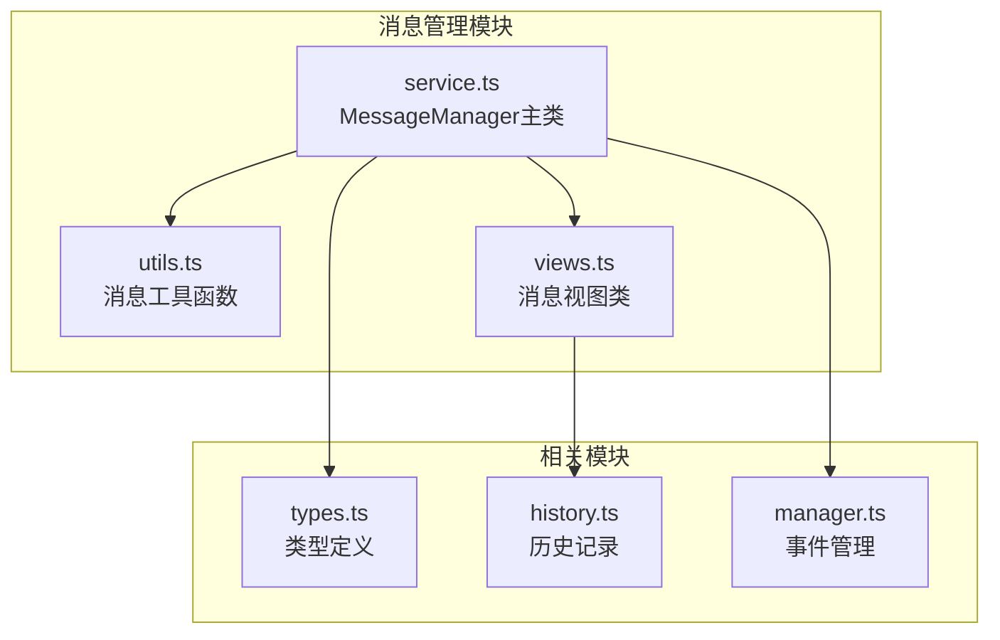
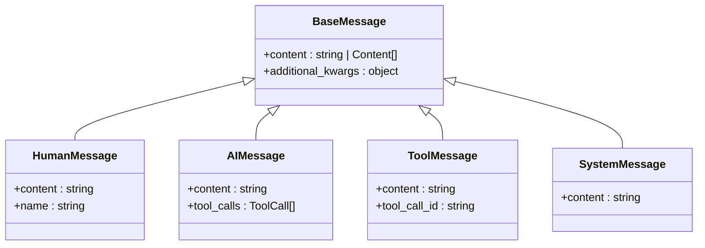
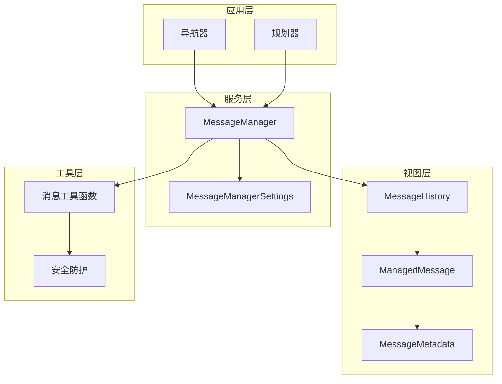
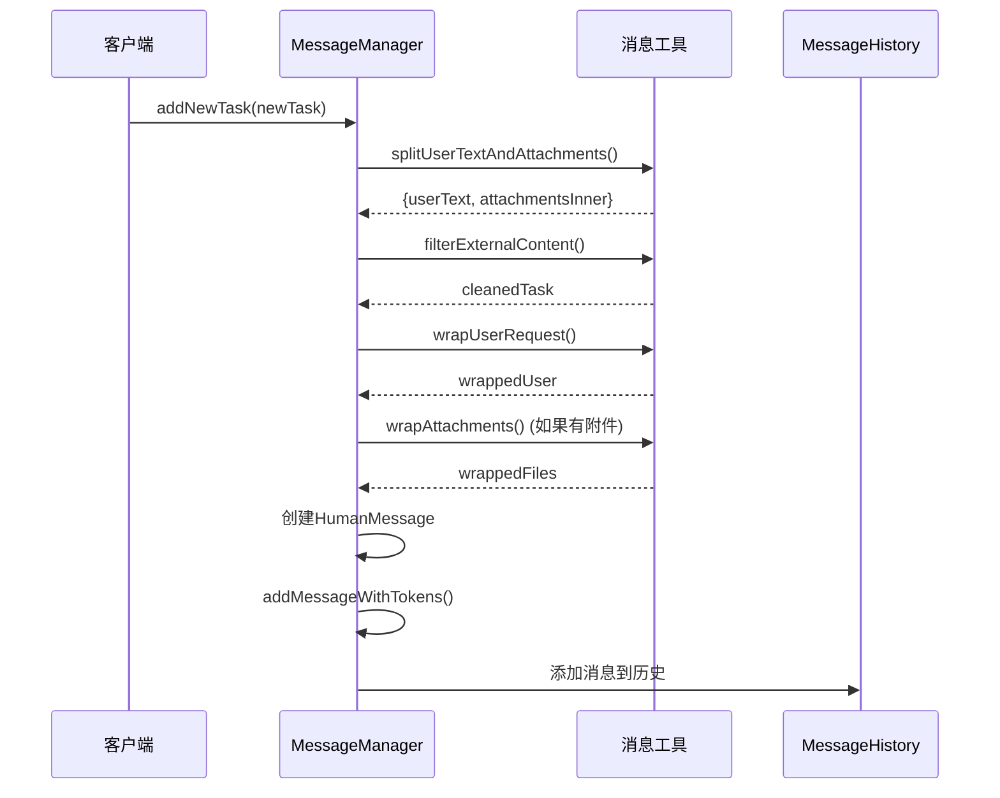
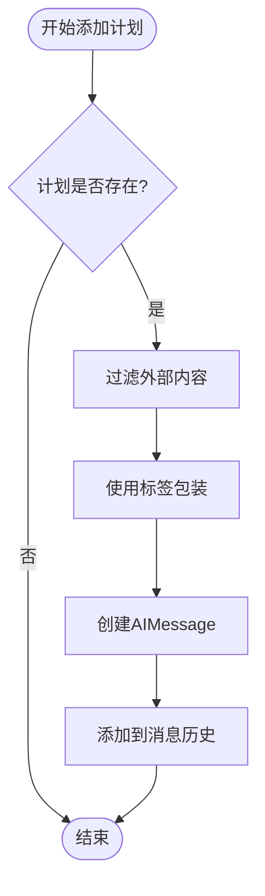
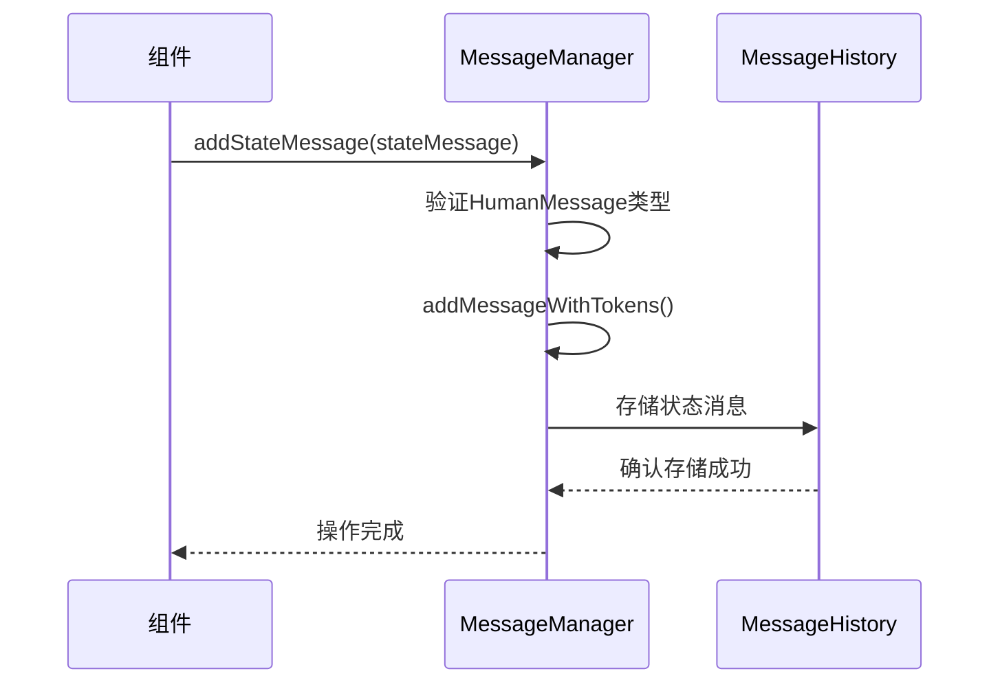
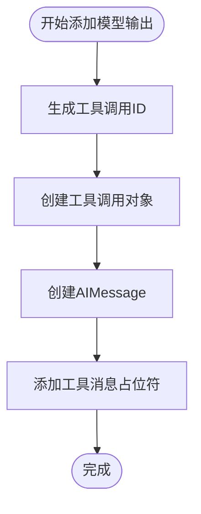
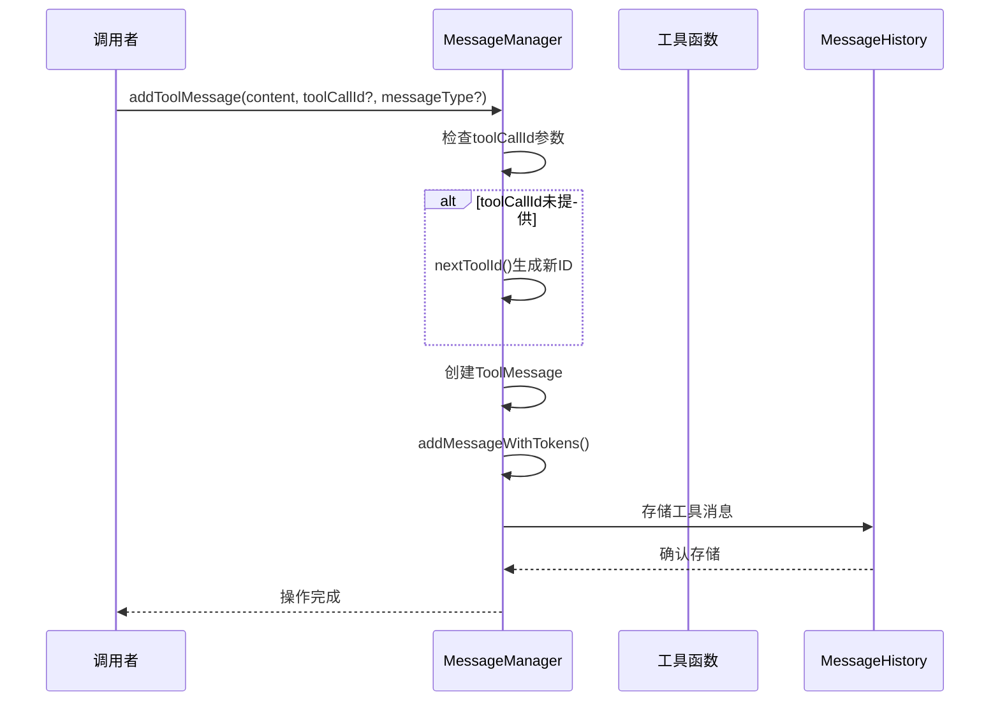
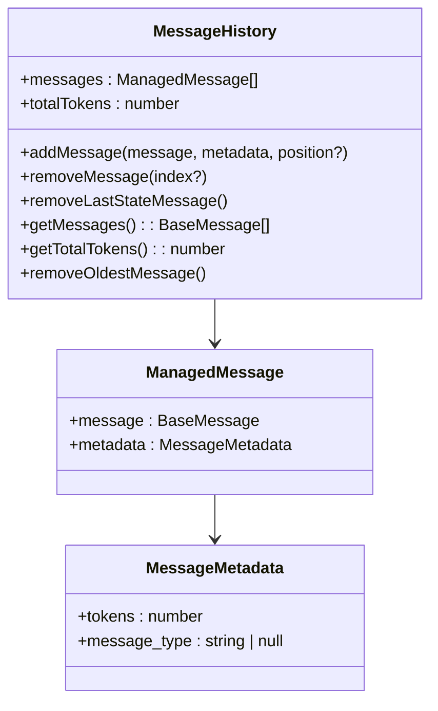
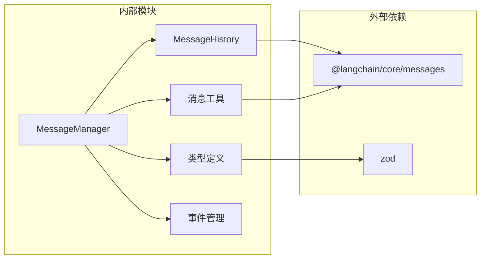

# 消息类型处理

<cite>
**本文档中引用的文件**
- [service.ts](file://chrome-extension/src/background/agent/messages/service.ts)
- [utils.ts](file://chrome-extension/src/background/agent/messages/utils.ts)
- [views.ts](file://chrome-extension/src/background/agent/messages/views.ts)
- [types.ts](file://chrome-extension/src/background/agent/types.ts)
- [navigator.ts](file://chrome-extension/src/background/agent/agents/navigator.ts)
- [history.ts](file://chrome-extension/src/background/agent/history.ts)
- [manager.ts](file://chrome-extension/src/background/agent/event/manager.ts)
</cite>

## 目录
1. [简介](#简介)
2. [项目结构](#项目结构)
3. [核心组件](#核心组件)
4. [架构概览](#架构概览)
5. [详细组件分析](#详细组件分析)
6. [依赖关系分析](#依赖关系分析)
7. [性能考虑](#性能考虑)
8. [故障排除指南](#故障排除指南)
9. [结论](#结论)

## 简介

MessageManager是NanoBrowser项目中的核心消息管理系统，负责处理和管理各种类型的消息，包括人类消息、AI消息和工具消息。该系统提供了完整的消息生命周期管理，从消息创建到存储，再到工具调用和响应处理。

MessageManager支持多种消息类型：
- **人类消息（HumanMessage）**：用户输入和状态更新
- **AI消息（AIMessage）**：模型输出和计划信息
- **工具消息（ToolMessage）**：工具调用结果和响应
- **系统消息（SystemMessage）**：系统指令和配置

## 项目结构

消息管理系统采用模块化设计，主要包含以下核心文件：



**图表来源**
- [service.ts](file://chrome-extension/src/background/agent/messages/service.ts#L1-L441)
- [utils.ts](file://chrome-extension/src/background/agent/messages/utils.ts#L1-L330)
- [views.ts](file://chrome-extension/src/background/agent/messages/views.ts#L1-L88)

**章节来源**
- [service.ts](file://chrome-extension/src/background/agent/messages/service.ts#L1-L50)
- [utils.ts](file://chrome-extension/src/background/agent/messages/utils.ts#L1-L30)

## 核心组件

### MessageManager主类

MessageManager是消息管理的核心控制器，提供以下主要功能：

- **消息创建和管理**：创建不同类型的消息对象
- **工具调用ID生成**：自动生成唯一的工具调用标识符
- **消息历史维护**：跟踪和管理消息历史记录
- **令牌计数**：计算消息的令牌数量
- **敏感数据过滤**：保护敏感信息不被泄露

### 消息类型系统

系统支持四种主要消息类型：



**图表来源**
- [service.ts](file://chrome-extension/src/background/agent/messages/service.ts#L21-L52)
- [views.ts](file://chrome-extension/src/background/agent/messages/views.ts#L1-L45)

**章节来源**
- [service.ts](file://chrome-extension/src/background/agent/messages/service.ts#L21-L83)
- [views.ts](file://chrome-extension/src/background/agent/messages/views.ts#L1-L45)

## 架构概览

消息管理系统采用分层架构设计，确保清晰的职责分离和良好的可扩展性：



**图表来源**
- [service.ts](file://chrome-extension/src/background/agent/messages/service.ts#L21-L52)
- [views.ts](file://chrome-extension/src/background/agent/messages/views.ts#L25-L88)
- [utils.ts](file://chrome-extension/src/background/agent/messages/utils.ts#L1-L50)

## 详细组件分析

### addNewTask方法实现

addNewTask方法用于添加新的任务到消息历史中，支持附件处理和内容过滤：



**图表来源**
- [service.ts](file://chrome-extension/src/background/agent/messages/service.ts#L158-L185)
- [utils.ts](file://chrome-extension/src/background/agent/messages/utils.ts#L280-L330)

关键特性：
- **附件处理**：自动识别和处理用户上传的附件
- **内容过滤**：使用guardrails服务过滤潜在的恶意内容
- **安全包装**：对用户请求进行安全标记和包装
- **上下文保持**：确保新任务能够继承之前的上下文

**章节来源**
- [service.ts](file://chrome-extension/src/background/agent/messages/service.ts#L158-L185)

### addPlan方法实现

addPlan方法专门用于添加AI生成的计划消息，使用XML标签进行包装：



**图表来源**
- [service.ts](file://chrome-extension/src/background/agent/messages/service.ts#L187-L198)

XML标签包装机制：
- **标签格式**：`<plan>计划内容</plan>`
- **内容过滤**：防止注入攻击和恶意内容
- **位置控制**：支持指定插入位置

**章节来源**
- [service.ts](file://chrome-extension/src/background/agent/messages/service.ts#L187-L198)

### addStateMessage方法实现

addStateMessage方法用于添加状态消息，通常包含浏览器状态或执行进度信息：



**图表来源**
- [service.ts](file://chrome-extension/src/background/agent/messages/service.ts#L200-L205)

特点：
- **类型验证**：确保传入的是HumanMessage类型
- **直接存储**：不进行额外的内容处理
- **状态追踪**：用于跟踪执行过程中的状态变化

**章节来源**
- [service.ts](file://chrome-extension/src/background/agent/messages/service.ts#L200-L205)

### addModelOutput方法实现

addModelOutput方法是最复杂的消息处理方法，涉及工具调用序列化：



**图表来源**
- [service.ts](file://chrome-extension/src/background/agent/messages/service.ts#L207-L225)

工具调用序列化过程：
1. **ID生成**：使用`nextToolId()`生成唯一标识符
2. **工具调用创建**：构建`AgentOutput`工具调用
3. **消息创建**：创建包含工具调用的AIMessage
4. **占位符添加**：添加工具响应占位符避免错误

**章节来源**
- [service.ts](file://chrome-extension/src/background/agent/messages/service.ts#L207-L225)

### addToolMessage方法实现

addToolMessage方法处理工具调用的响应消息：



**图表来源**
- [service.ts](file://chrome-extension/src/background/agent/messages/service.ts#L428-L439)

工具调用ID生成机制：
- **自动递增**：每次调用`nextToolId()`时递增
- **唯一性保证**：确保每个工具调用都有唯一标识
- **可选参数**：允许外部指定工具调用ID

**章节来源**
- [service.ts](file://chrome-extension/src/background/agent/messages/service.ts#L428-L439)

### 消息历史管理

MessageHistory类负责维护消息的历史记录和元数据：



**图表来源**
- [views.ts](file://chrome-extension/src/background/agent/messages/views.ts#L25-L88)

**章节来源**
- [views.ts](file://chrome-extension/src/background/agent/messages/views.ts#L25-L88)

## 依赖关系分析

消息管理系统具有清晰的依赖关系结构：



**图表来源**
- [service.ts](file://chrome-extension/src/background/agent/messages/service.ts#L1-L10)
- [views.ts](file://chrome-extension/src/background/agent/messages/views.ts#L1-L5)

**章节来源**
- [service.ts](file://chrome-extension/src/background/agent/messages/service.ts#L1-L10)
- [views.ts](file://chrome-extension/src/background/agent/messages/views.ts#L1-L5)

## 性能考虑

### 令牌计数优化

系统实现了高效的令牌计数机制：

- **字符估算**：基于字符数估算令牌数量
- **图像处理**：为图像内容分配固定令牌数
- **工具调用**：序列化工具调用结构计算令牌

### 内存管理

- **消息截断**：当超过最大令牌限制时自动截断
- **历史清理**：定期清理过期的消息
- **内存监控**：实时监控总令牌使用量

### 并发处理

- **异步操作**：所有消息操作都是异步的
- **事件驱动**：通过事件管理器处理消息变更
- **状态同步**：确保多组件间的状态一致性

## 故障排除指南

### 常见错误类型

#### 消息类型不匹配错误

**症状**：尝试添加错误类型的消息
**原因**：向特定方法传递了不兼容的消息类型
**解决方案**：
- 使用正确的消息构造函数
- 验证消息类型与方法要求的一致性

#### 工具调用ID冲突

**症状**：工具调用响应无法正确关联
**原因**：多个工具调用使用了相同的ID
**解决方案**：
- 确保`nextToolId()`的唯一性
- 避免手动设置重复的工具调用ID

#### 令牌溢出错误

**症状**：消息添加失败，提示令牌超限
**原因**：消息历史超过最大令牌限制
**解决方案**：
- 启用`cutMessages()`方法自动截断
- 调整`maxInputTokens`设置
- 清理不必要的历史消息

### 调试技巧

#### 消息历史检查

```typescript
// 获取当前消息历史
const messages = messageManager.getMessages();
logger.debug('当前消息历史:', messages);

// 检查令牌使用情况
const totalTokens = messageManager.getTotalTokens();
logger.debug('总令牌使用量:', totalTokens);
```

#### 错误日志分析

系统提供了详细的错误日志：
- 消息过滤警告
- 工具调用错误
- 令牌计算异常

**章节来源**
- [service.ts](file://chrome-extension/src/background/agent/messages/service.ts#L227-L259)
- [utils.ts](file://chrome-extension/src/background/agent/messages/utils.ts#L250-L330)

### 最佳实践

#### 消息创建建议

1. **使用专用方法**：优先使用`addNewTask()`、`addPlan()`等专用方法
2. **内容过滤**：始终对用户输入进行内容过滤
3. **适当包装**：对敏感内容使用适当的包装标签

#### 工具调用处理

1. **ID管理**：确保工具调用ID的唯一性
2. **响应及时**：尽快添加工具调用的响应消息
3. **错误处理**：妥善处理工具调用失败的情况

#### 性能优化

1. **定期清理**：定期调用`cutMessages()`清理历史
2. **监控令牌**：实时监控令牌使用情况
3. **合理配置**：根据需求调整最大令牌限制

## 结论

MessageManager消息管理系统是一个功能完整、设计精良的消息处理框架。它提供了：

- **完整的消息类型支持**：涵盖人类、AI、工具和系统消息
- **强大的工具调用机制**：支持复杂的工具链交互
- **智能的令牌管理**：自动处理消息大小限制
- **完善的安全防护**：防止内容注入和敏感信息泄露
- **灵活的扩展能力**：支持自定义消息类型和处理逻辑

该系统的设计充分考虑了实际应用场景的需求，提供了稳定可靠的消息处理能力，是NanoBrowser项目中不可或缺的核心组件。通过合理的使用和配置，可以有效提升系统的整体性能和用户体验。