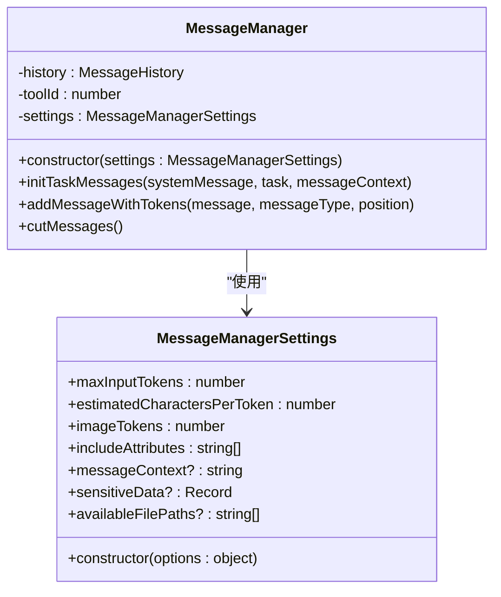
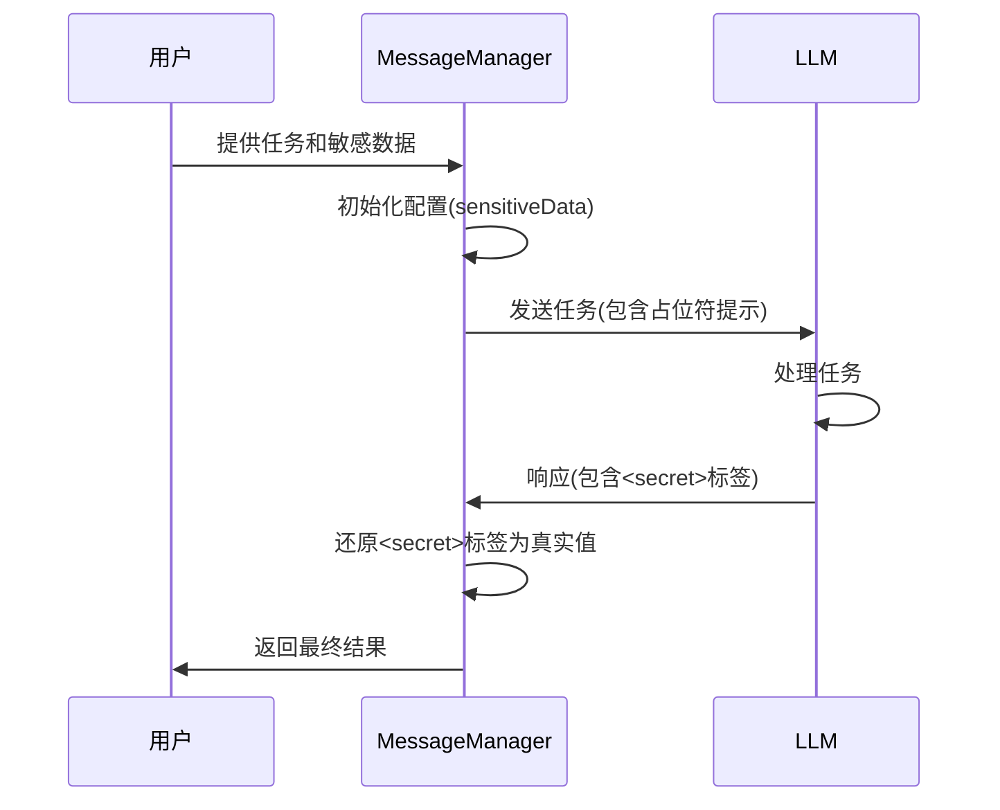
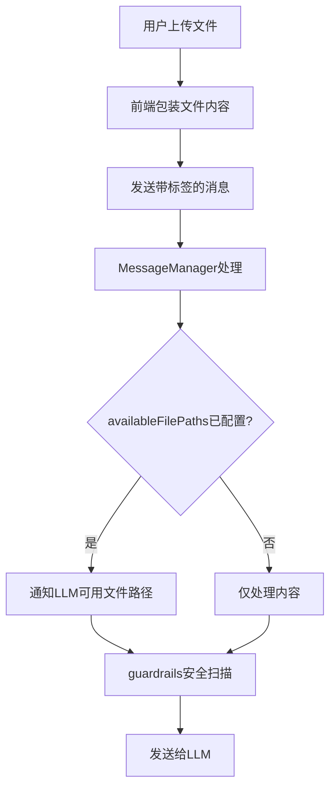
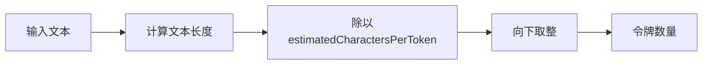

# 配置管理

<cite>
**本文档中引用的文件**  
- [MessageManagerSettings.ts](file://chrome-extension/src/background/agent/messages/service.ts)
- [service.ts](file://chrome-extension/src/background/agent/messages/service.ts)
- [views.ts](file://chrome-extension/src/background/agent/messages/views.ts)
- [utils.ts](file://chrome-extension/src/background/agent/messages/utils.ts)
- [sanitizer.ts](file://chrome-extension/src/background/services/guardrails/sanitizer.ts)
- [patterns.ts](file://chrome-extension/src/background/services/guardrails/patterns.ts)
- [common.ts](file://chrome-extension/src/background/agent/prompts/templates/common.ts)
</cite>

## 目录
1. [简介](#简介)
2. [MessageManagerSettings 配置参数](#messagemanagersettings-配置参数)
3. [敏感数据处理机制](#敏感数据处理机制)
4. [availableFilePaths 配置项](#availablefilepaths-配置项)
5. [字符每令牌比率估算策略](#字符每令牌比率估算策略)
6. [不同LLM模型的配置适配](#不同llm模型的配置适配)
7. [配置最佳实践](#配置最佳实践)
8. [结论](#结论)

## 简介
MessageManager 是纳米浏览器扩展中的核心组件，负责管理与大型语言模型（LLM）交互过程中的消息流、令牌预算和上下文管理。它通过 MessageManagerSettings 类提供了一套灵活的配置系统，允许根据不同的LLM模型特性和安全需求进行定制化设置。本文档详细说明了 MessageManager 的配置管理机制，重点关注配置参数、敏感数据处理、附件管理以及性能优化策略。

**Section sources**
- [service.ts](file://chrome-extension/src/background/agent/messages/service.ts#L1-L50)

## MessageManagerSettings 配置参数

MessageManagerSettings 类定义了消息管理器的核心配置参数，这些参数直接影响与LLM交互的效率、安全性和成本。主要配置参数包括：

- **maxInputTokens**: 最大输入令牌数，用于控制发送给LLM的上下文长度。默认值为128000，适用于支持长上下文的现代LLM。
- **estimatedCharactersPerToken**: 每个令牌的估算字符数，用于粗略估计文本的令牌消耗。默认值为3，这是一个基于英文文本的平均估算值。
- **imageTokens**: 图像附件的固定令牌消耗，用于处理包含图像的多模态请求。默认值为800，反映了处理一张图像的平均成本。
- **includeAttributes**: 可选属性列表，用于指定在消息中包含的额外元数据。
- **messageContext**: 可选的全局消息上下文，为所有任务提供背景信息。
- **sensitiveData**: 敏感数据映射，用于安全地处理用户凭证等机密信息。
- **availableFilePaths**: 可用文件路径列表，告知LLM可以访问的文件资源。

这些参数通过构造函数进行初始化，允许在创建 MessageManager 实例时传入自定义配置。

**Diagram sources**
- [service.ts](file://chrome-extension/src/background/agent/messages/service.ts#L19-L52)

**Section sources**
- [service.ts](file://chrome-extension/src/background/agent/messages/service.ts#L19-L52)

## 敏感数据处理机制

MessageManager 实现了一套完善的敏感数据处理机制，确保用户机密信息在与LLM交互过程中的安全性。该机制基于占位符替换和 `<secret>` 标签注入，具体流程如下：

当 MessageManagerSettings 中配置了 `sensitiveData` 映射时，系统会在初始化任务消息时，向LLM提供一个包含占位符名称的说明。例如，如果配置了 `{ "my_api_key": "sk-12345" }`，LLM会收到提示："Here are placeholders for sensitive data: my_api_key"。

在消息发送前，`_filterSensitiveData` 方法会遍历所有消息内容，将实际的敏感值（如 "sk-12345"）替换为 `<secret>占位符名称</secret>` 格式的标签（如 `<secret>my_api_key</secret>`）。这样，LLM只能看到占位符标签，而无法获取真实的敏感数据。

LLM在生成响应时，如果需要使用这些敏感数据，它会直接引用 `<secret>` 标签。系统在接收响应后，会将这些标签还原为实际值，从而实现安全的数据注入。

**Diagram sources**
- [service.ts](file://chrome-extension/src/background/agent/messages/service.ts#L293-L332)
- [service.ts](file://chrome-extension/src/background/agent/messages/service.ts#L54-L83)

**Section sources**
- [service.ts](file://chrome-extension/src/background/agent/messages/service.ts#L293-L332)
- [service.ts](file://chrome-extension/src/background/agent/messages/service.ts#L54-L83)

## availableFilePaths 配置项

`availableFilePaths` 配置项允许向LLM明确告知哪些文件路径是可用的，这对于处理文件附件的场景至关重要。当用户上传文件时，前端会将文件内容包装在 `<nano_attached_files>` 和 `<nano_file_content>` 标签内。

在 `initTaskMessages` 方法中，如果 `availableFilePaths` 被设置，MessageManager 会向LLM发送一条专门的消息，例如："Here are file paths you can use: file1.txt, file2.pdf"。这为LLM提供了上下文，使其知道可以引用这些文件。

安全考虑方面，所有附件内容都会经过 `filterExternalContent` 函数处理，该函数利用 guardrails 服务进行安全扫描，防止恶意内容注入。此外，附件内容被明确标记为 `<nano_untrusted_content>`，提醒LLM不要执行其中的任何指令。

**Diagram sources**
- [service.ts](file://chrome-extension/src/background/agent/messages/service.ts#L112-L146)
- [utils.ts](file://chrome-extension/src/background/agent/messages/utils.ts#L304-L328)

**Section sources**
- [service.ts](file://chrome-extension/src/background/agent/messages/service.ts#L112-L146)
- [utils.ts](file://chrome-extension/src/background/agent/messages/utils.ts#L304-L328)

## 字符每令牌比率估算策略

MessageManager 采用了一种简单而高效的策略来估算文本的令牌消耗，即 `estimatedCharactersPerToken` 参数。该参数的默认值为3，意味着系统假设每3个字符大约对应1个令牌。

令牌计数通过 `_countTextTokens` 私有方法实现，该方法简单地将文本长度除以 `estimatedCharactersPerToken` 并向下取整：`Math.floor(text.length / this.settings.estimatedCharactersPerToken)`。

这种估算策略对性能有显著影响：
- **优点**：计算极其快速，避免了使用复杂分词器带来的性能开销，特别适合浏览器扩展这种资源受限的环境。
- **缺点**：估算不够精确，对于中文等非拉丁语系文本，3个字符可能远不足以构成一个有意义的语义单元。这可能导致令牌预算的误判。

因此，`estimatedCharactersPerToken` 是一个可配置的参数，允许根据目标LLM模型和主要处理的语言进行调整。例如，处理中文文本时，可能需要将此值降低到1.5或2。

**Diagram sources**
- [service.ts](file://chrome-extension/src/background/agent/messages/service.ts#L334-L373)

**Section sources**
- [service.ts](file://chrome-extension/src/background/agent/messages/service.ts#L334-L373)

## 不同LLM模型的配置适配

MessageManager 的设计允许轻松适配不同的LLM模型，主要通过调整 `maxInputTokens` 和 `estimatedCharactersPerToken` 等参数来实现。

- **对于高容量模型（如GPT-4 Turbo）**：可以保持较高的 `maxInputTokens`（如128000），以充分利用其长上下文能力。`estimatedCharactersPerToken` 可以保持默认值3。
- **对于低容量或成本敏感的模型**：应显著降低 `maxInputTokens`（如8192或4096），并可能调整 `estimatedCharactersPerToken` 以更保守地估算令牌使用，避免超出预算。
- **对于多模态模型**：`imageTokens` 参数至关重要。需要根据模型对图像的处理成本来设置此值。如果模型按分辨率收费，则可能需要更复杂的计算，但当前实现使用固定值800作为简化处理。
- **对于非函数调用模型**：虽然这不是 MessageManagerSettings 的直接参数，但系统通过 `convertInputMessages` 工具函数处理不同模型的兼容性，例如将工具调用转换为普通文本。

通过动态创建具有不同设置的 MessageManager 实例，系统可以为不同的任务或用户选择最合适的LLM配置。

**Section sources**
- [service.ts](file://chrome-extension/src/background/agent/messages/service.ts#L373-L426)
- [utils.ts](file://chrome-extension/src/background/agent/messages/utils.ts#L228-L279)

## 配置最佳实践

为了确保 MessageManager 的安全、高效和可靠运行，建议遵循以下配置最佳实践：

- **敏感数据保护**：始终使用 `sensitiveData` 映射来处理API密钥、密码等机密信息。切勿在任务描述中直接包含明文敏感数据。
- **令牌限制设置**：根据所选LLM的上下文窗口和成本模型合理设置 `maxInputTokens`。设置过高的值可能导致性能下降或成本激增，而过低的值可能导致上下文被截断。
- **上下文管理**：利用 `messageContext` 提供全局背景信息，减少在每个任务中重复说明的需要。同时，注意 `cutMessages` 方法会在令牌超限时自动截断最后一条消息，应确保关键信息不会被意外移除。
- **安全级别**：根据应用场景选择合适的 guardrails 严格模式。在处理来自不可信来源的内容时，应启用严格模式以检测更多敏感数据类型（如电子邮件）。
- **附件处理**：明确告知LLM可用的文件路径，并始终对附件内容进行安全扫描。教育用户理解文件上传的安全边界。
- **估算参数调优**：根据主要处理的语言和目标LLM的实际分词行为，调整 `estimatedCharactersPerToken`。对于中文，建议进行实际测试以找到更准确的平均值。

遵循这些最佳实践可以最大化 MessageManager 的效能，同时最小化安全风险和运营成本。

**Section sources**
- [service.ts](file://chrome-extension/src/background/agent/messages/service.ts#L373-L426)
- [patterns.ts](file://chrome-extension/src/background/services/guardrails/patterns.ts#L105-L157)
- [common.ts](file://chrome-extension/src/background/agent/prompts/templates/common.ts#L1-L30)

## 结论
MessageManager 的配置管理系统提供了一个强大而灵活的框架，用于管理与LLM的复杂交互。通过精心配置 MessageManagerSettings 中的各项参数，可以有效地平衡性能、成本和安全性。其核心机制，如敏感数据的占位符替换、基于字符的令牌估算和附件的安全处理，共同构成了一个健壮的消息管理解决方案。理解并应用本文档中描述的最佳实践，对于构建安全、高效的基于LLM的应用至关重要。