# 消息系统API文档

<cite>
**本文档中引用的文件**
- [service.ts](file://chrome-extension/src/background/agent/messages/service.ts)
- [manager.ts](file://chrome-extension/src/background/agent/event/manager.ts)
- [types.ts](file://chrome-extension/src/background/agent/event/types.ts)
- [views.ts](file://chrome-extension/src/background/agent/messages/views.ts)
- [utils.ts](file://chrome-extension/src/background/agent/messages/utils.ts)
- [navigator.ts](file://chrome-extension/src/background/agent/agents/navigator.ts)
- [planner.ts](file://chrome-extension/src/background/agent/agents/planner.ts)
- [executor.ts](file://chrome-extension/src/background/agent/executor.ts)
- [types.ts](file://chrome-extension/src/background/agent/types.ts)
</cite>

## 目录
1. [简介](#简介)
2. [项目结构](#项目结构)
3. [核心组件](#核心组件)
4. [架构概览](#架构概览)
5. [详细组件分析](#详细组件分析)
6. [依赖关系分析](#依赖关系分析)
7. [性能考虑](#性能考虑)
8. [故障排除指南](#故障排除指南)
9. [结论](#结论)

## 简介

NanoBrowser消息系统是一个复杂而强大的智能体通信框架，专为浏览器自动化任务设计。该系统提供了完整的消息管理、事件驱动架构和智能体间通信机制，支持多智能体协作完成复杂的网页浏览任务。

消息系统的核心功能包括：
- **消息管理**：高效的文本和图像消息处理
- **令牌计算**：精确的token计数和内存管理
- **事件驱动**：基于观察者模式的事件系统
- **智能体通信**：Planner和Navigator之间的协调工作
- **状态同步**：跨智能体的状态共享和同步

## 项目结构

消息系统采用模块化架构，主要分为以下几个层次：

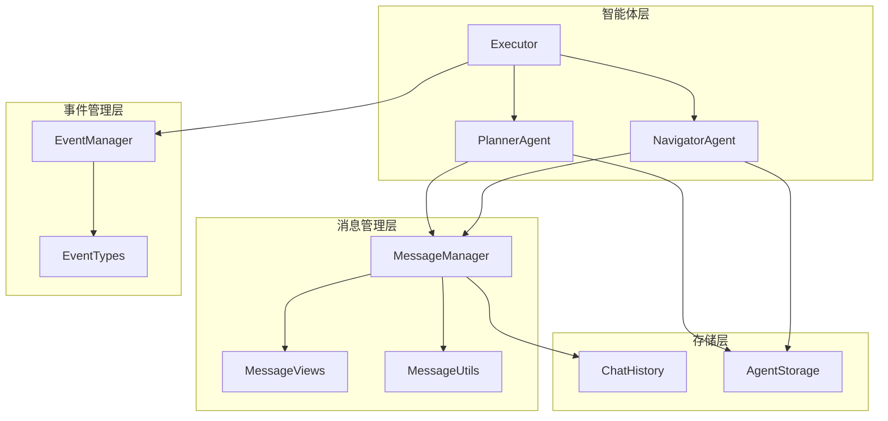

**图表来源**
- [service.ts](file://chrome-extension/src/background/agent/messages/service.ts#L1-L50)
- [manager.ts](file://chrome-extension/src/background/agent/event/manager.ts#L1-L20)
- [executor.ts](file://chrome-extension/src/background/agent/executor.ts#L70-L106)

**章节来源**
- [service.ts](file://chrome-extension/src/background/agent/messages/service.ts#L1-L441)
- [manager.ts](file://chrome-extension/src/background/agent/event/manager.ts#L1-L53)

## 核心组件

### MessageManager类

MessageManager是消息系统的核心控制器，负责管理所有消息的生命周期和令牌计算。

#### 主要特性
- **任务初始化**：`initTaskMessages()`方法设置初始消息序列
- **动态添加**：`addMessageWithTokens()`支持实时消息添加
- **工具消息**：`addToolMessage()`处理智能体工具调用
- **长度管理**：`length()`提供当前消息数量统计

#### 令牌计算机制

系统实现了精确的令牌计算算法：

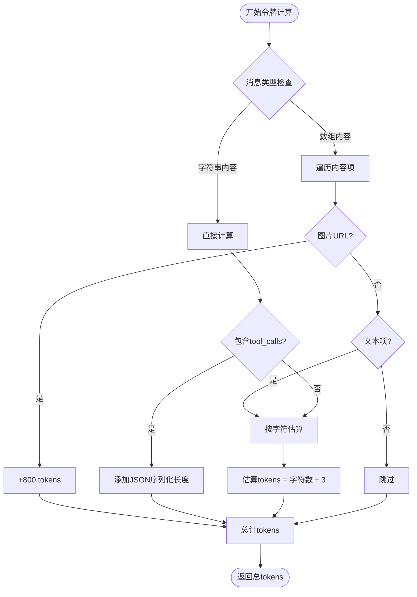

**图表来源**
- [service.ts](file://chrome-extension/src/background/agent/messages/service.ts#L334-L373)

**章节来源**
- [service.ts](file://chrome-extension/src/background/agent/messages/service.ts#L54-L83)
- [service.ts](file://chrome-extension/src/background/agent/messages/service.ts#L258-L291)

### EventManager类

EventManager实现了完整的事件订阅和发布机制，支持智能体间的异步通信。

#### 核心方法
- **订阅管理**：`subscribe()`和`unsubscribe()`方法
- **事件清理**：`clearSubscribers()`批量清除订阅
- **事件发射**：`emit()`异步触发事件回调

#### 事件类型系统

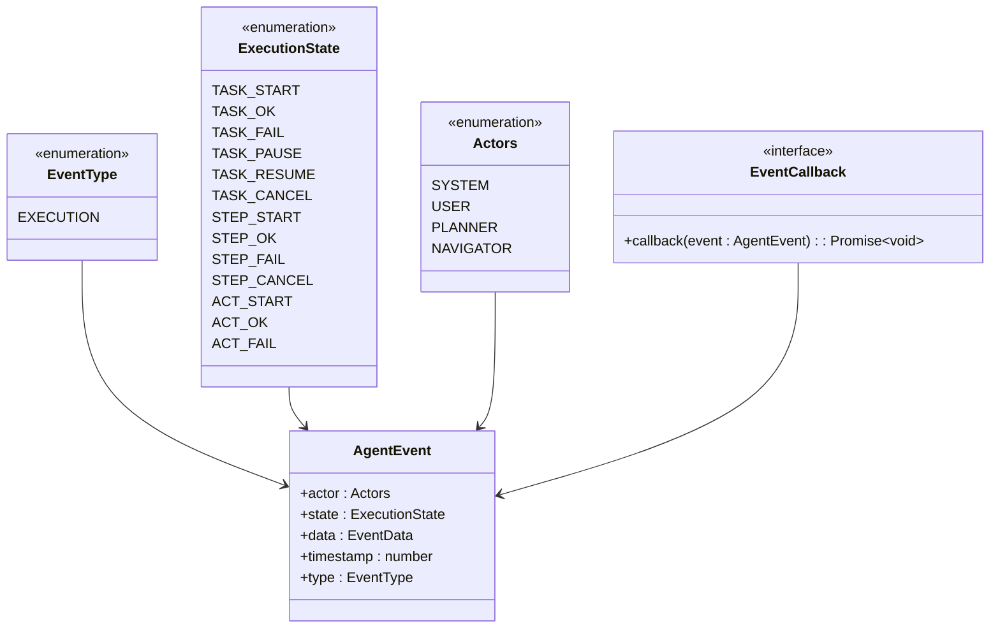

**图表来源**
- [types.ts](file://chrome-extension/src/background/agent/event/types.ts#L1-L77)

**章节来源**
- [manager.ts](file://chrome-extension/src/background/agent/event/manager.ts#L1-L53)
- [types.ts](file://chrome-extension/src/background/agent/event/types.ts#L1-L77)

### 消息类型系统

#### HumanMessage
用户输入消息类型，支持文本和附件处理：

- **内容过滤**：自动过滤恶意内容
- **附件包装**：安全地处理文件附件
- **上下文注入**：支持任务上下文注入

#### AIMessage  
AI模型输出消息类型：

- **工具调用**：支持函数式工具调用
- **计划输出**：格式化的执行计划
- **状态信息**：智能体内部状态表示

#### SystemMessage
系统级消息类型：

- **指令传递**：向模型传递系统指令
- **角色定义**：定义智能体的角色和行为规范
- **约束设置**：设置操作限制和规则

**章节来源**
- [service.ts](file://chrome-extension/src/background/agent/messages/service.ts#L148-L175)
- [service.ts](file://chrome-extension/src/background/agent/messages/service.ts#L177-L212)

## 架构概览

消息系统采用分层架构设计，确保了高度的模块化和可扩展性：

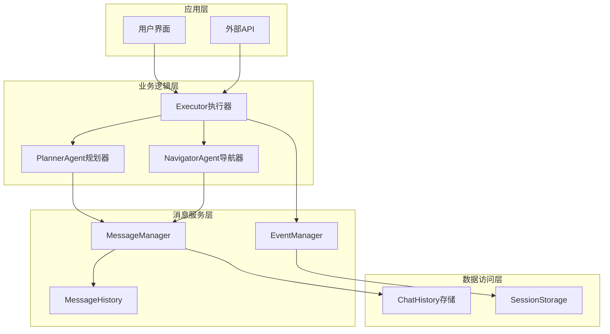

**图表来源**
- [executor.ts](file://chrome-extension/src/background/agent/executor.ts#L70-L106)
- [service.ts](file://chrome-extension/src/background/agent/messages/service.ts#L21-L52)

## 详细组件分析

### MessageManager详细分析

#### 初始化流程

MessageManager的`initTaskMessages()`方法负责构建完整的任务消息序列：

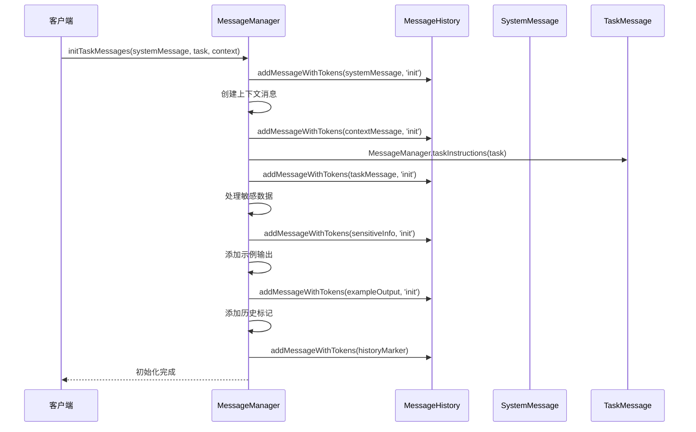

**图表来源**
- [service.ts](file://chrome-extension/src/background/agent/messages/service.ts#L54-L83)

#### 敏感数据处理

系统实现了多层次的敏感数据保护机制：

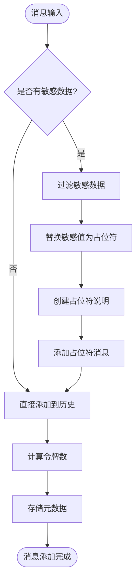

**图表来源**
- [service.ts](file://chrome-extension/src/background/agent/messages/service.ts#L292-L333)

**章节来源**
- [service.ts](file://chrome-extension/src/background/agent/messages/service.ts#L54-L83)
- [service.ts](file://chrome-extension/src/background/agent/messages/service.ts#L292-L333)

### EventManager详细分析

#### 订阅机制

EventManager实现了灵活的订阅系统：

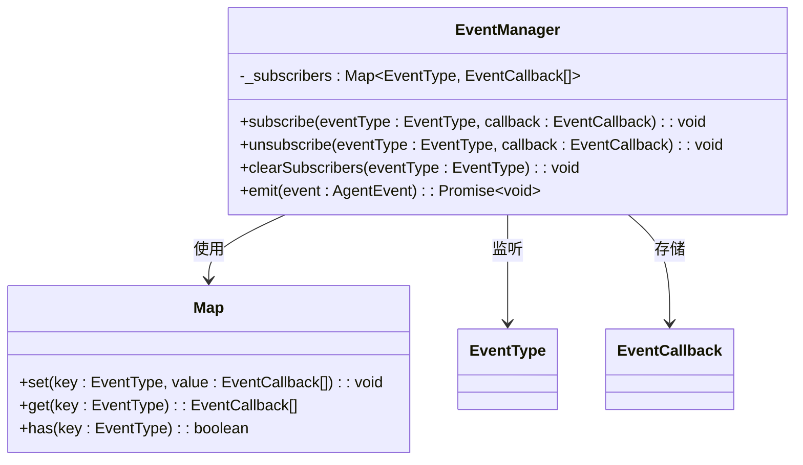

**图表来源**
- [manager.ts](file://chrome-extension/src/background/agent/event/manager.ts#L1-L53)

#### 异步事件处理

事件发射采用异步处理模式，确保不会阻塞主线程：

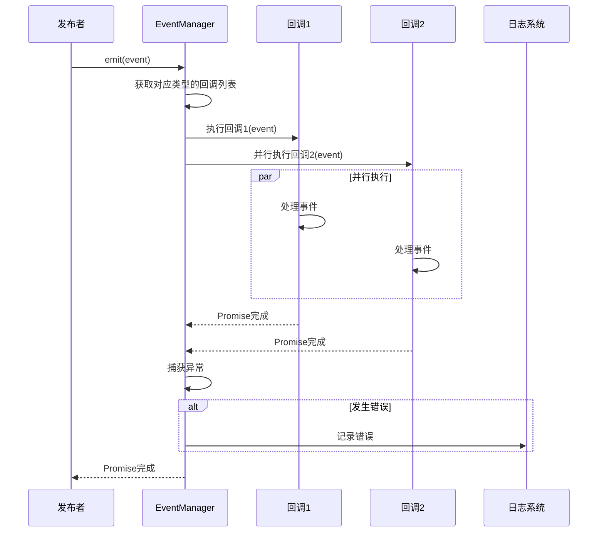

**图表来源**
- [manager.ts](file://chrome-extension/src/background/agent/event/manager.ts#L42-L52)

**章节来源**
- [manager.ts](file://chrome-extension/src/background/agent/event/manager.ts#L1-L53)

### 智能体通信机制

#### Planner-Navigator协作

Planner和Navigator通过消息系统实现紧密协作：

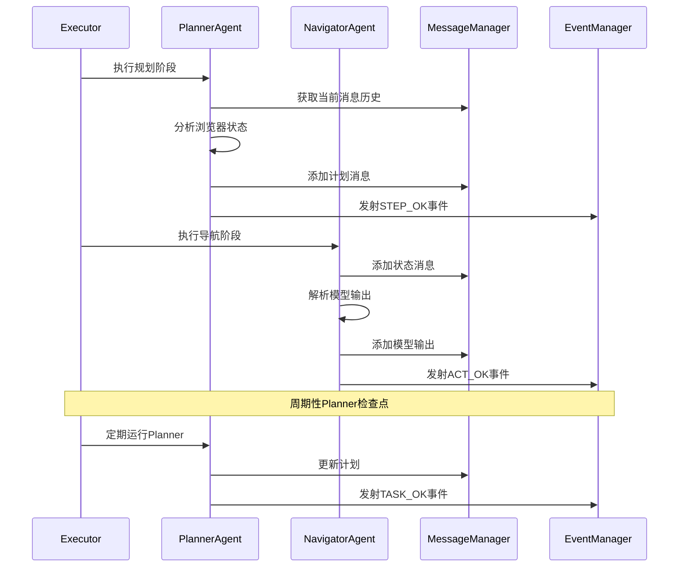

**图表来源**
- [executor.ts](file://chrome-extension/src/background/agent/executor.ts#L231-L271)
- [navigator.ts](file://chrome-extension/src/background/agent/agents/navigator.ts#L164-L194)
- [planner.ts](file://chrome-extension/src/background/agent/agents/planner.ts#L45-L77)

**章节来源**
- [executor.ts](file://chrome-extension/src/background/agent/executor.ts#L231-L271)
- [navigator.ts](file://chrome-extension/src/background/agent/agents/navigator.ts#L164-L194)
- [planner.ts](file://chrome-extension/src/background/agent/agents/planner.ts#L45-L77)

### 消息历史管理

#### 内存优化策略

系统实现了智能的记忆管理机制：

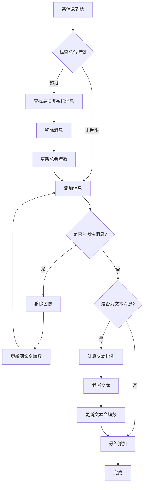

**图表来源**
- [service.ts](file://chrome-extension/src/background/agent/messages/service.ts#L374-L427)

**章节来源**
- [service.ts](file://chrome-extension/src/background/agent/messages/service.ts#L374-L427)

## 依赖关系分析

消息系统的依赖关系体现了清晰的分层架构：

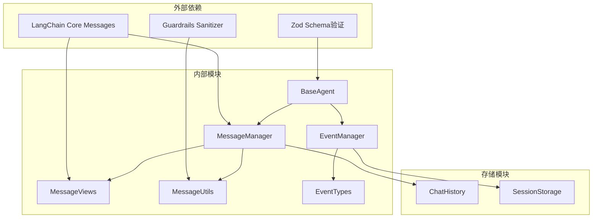

**图表来源**
- [service.ts](file://chrome-extension/src/background/agent/messages/service.ts#L1-L10)
- [manager.ts](file://chrome-extension/src/background/agent/event/manager.ts#L1-L5)

**章节来源**
- [service.ts](file://chrome-extension/src/background/agent/messages/service.ts#L1-L10)
- [manager.ts](file://chrome-extension/src/background/agent/event/manager.ts#L1-L5)

## 性能考虑

### 令牌计算优化

系统采用了多种优化策略来提高性能：

1. **字符估算**：使用简单的字符/令牌比率估算
2. **缓存机制**：避免重复计算相同内容的令牌数
3. **增量更新**：只对变化的部分重新计算
4. **批量处理**：合并多个小消息以减少开销

### 内存管理

- **LRU策略**：最近最少使用的消息优先被移除
- **系统消息保护**：系统消息不参与内存压缩
- **图像优先移除**：图像消息优先被移除以节省空间

### 异步处理

事件系统采用异步处理模式，确保：
- 不阻塞主线程
- 支持并发事件处理
- 错误隔离和恢复

## 故障排除指南

### 常见问题及解决方案

#### 令牌超限错误

**症状**：`Max token limit reached`错误
**原因**：消息历史超过最大令牌限制
**解决方案**：
1. 检查`maxInputTokens`配置
2. 启用消息压缩
3. 减少系统提示词长度

#### 敏感数据泄露

**症状**：敏感信息未被正确过滤
**原因**：敏感数据配置不正确
**解决方案**：
1. 验证`sensitiveData`配置
2. 检查过滤器逻辑
3. 测试数据脱敏效果

#### 事件订阅失效

**症状**：事件回调未被触发
**原因**：订阅关系丢失或回调函数错误
**解决方案**：
1. 检查订阅代码
2. 验证回调函数签名
3. 确认事件类型匹配

**章节来源**
- [service.ts](file://chrome-extension/src/background/agent/messages/service.ts#L374-L427)
- [manager.ts](file://chrome-extension/src/background/agent/event/manager.ts#L42-L52)

## 结论

NanoBrowser消息系统是一个设计精良、功能完备的智能体通信框架。它成功地解决了以下关键挑战：

### 技术优势

1. **模块化设计**：清晰的职责分离和接口定义
2. **性能优化**：智能的内存管理和令牌计算
3. **安全性**：完善的敏感数据保护机制
4. **可扩展性**：灵活的事件系统和插件架构

### 应用价值

- **智能体协作**：Planner和Navigator的高效配合
- **任务管理**：完整的任务生命周期管理
- **状态同步**：跨组件的状态一致性保证
- **错误处理**：健壮的异常处理和恢复机制

### 未来发展方向

1. **更智能的压缩算法**：基于语义重要性的消息压缩
2. **分布式架构**：支持多实例部署
3. **实时同步**：WebSocket等实时通信协议
4. **AI增强**：基于机器学习的优化策略

这个消息系统为复杂的浏览器自动化任务提供了坚实的基础，是现代AI应用开发的重要参考实现。