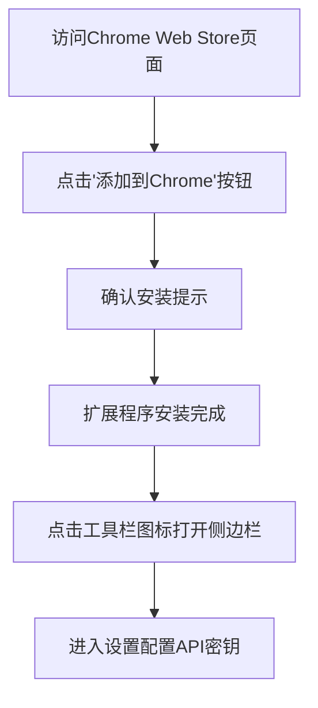
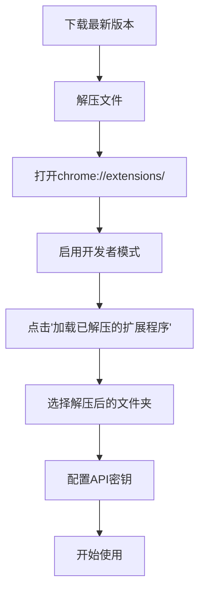
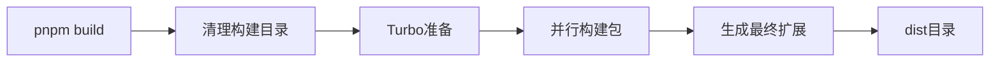
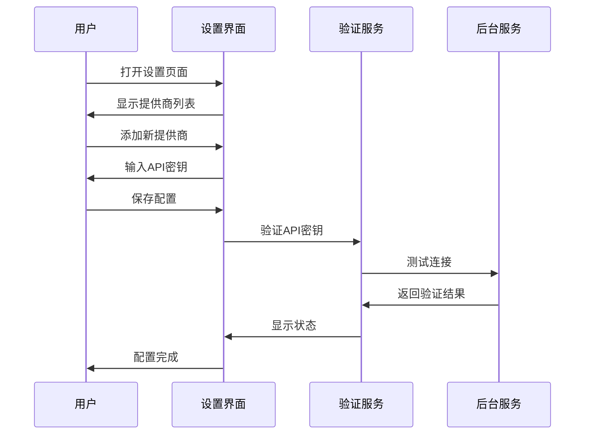
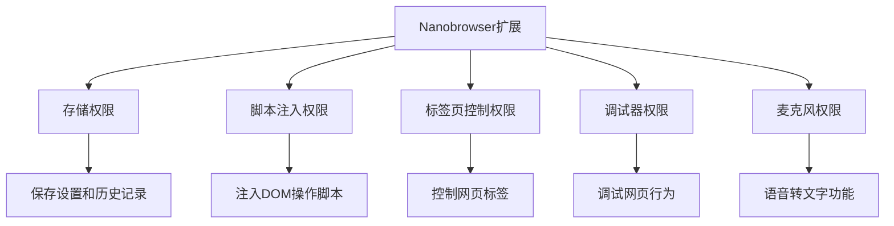
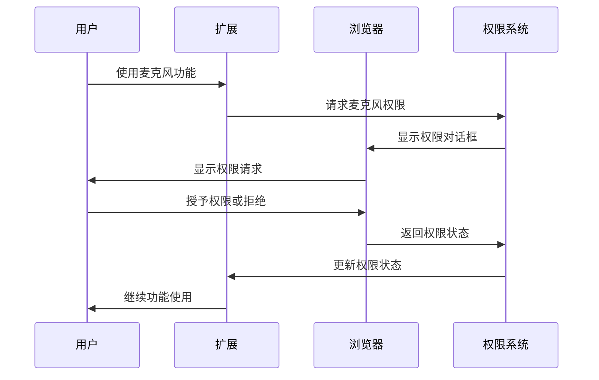
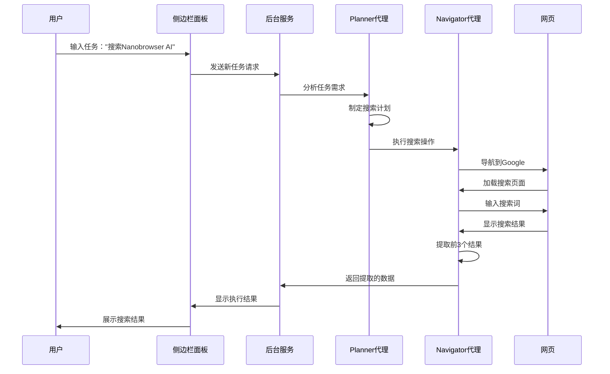
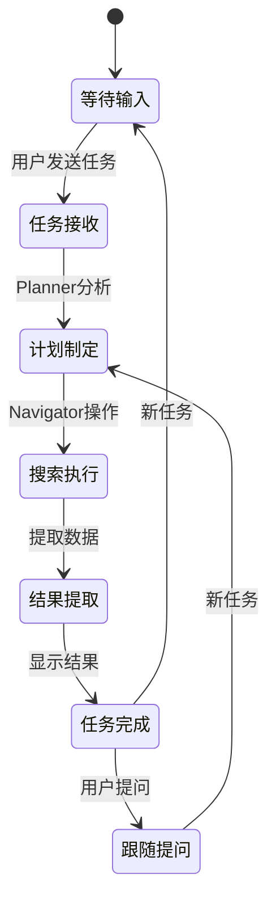
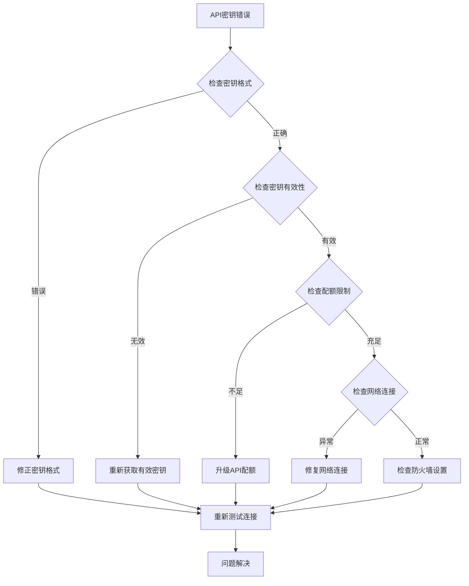
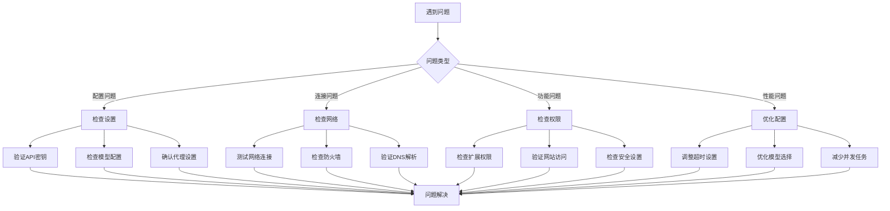

# 快速开始

<cite>
**本文档中引用的文件**
- [README.md](file://README.md)
- [package.json](file://package.json)
- [turbo.json](file://turbo.json)
- [pnpm-workspace.yaml](file://pnpm-workspace.yaml)
- [chrome-extension/package.json](file://chrome-extension/package.json)
- [pages/options/src/Options.tsx](file://pages/options/src/Options.tsx)
- [pages/side-panel/src/SidePanel.tsx](file://pages/side-panel/src/SidePanel.tsx)
- [chrome-extension/src/background/index.ts](file://chrome-extension/src/background/index.ts)
- [chrome-extension/src/background/agent/executor.ts](file://chrome-extension/src/background/agent/executor.ts)
- [packages/storage/lib/settings/llmProviders.ts](file://packages/storage/lib/settings/llmProviders.ts)
- [pages/options/src/components/ModelSettings.tsx](file://pages/options/src/components/ModelSettings.tsx)
- [chrome-extension/public/permission/index.html](file://chrome-extension/public/permission/index.html)
- [chrome-extension/public/permission/permission.js](file://chrome-extension/public/permission/permission.js)
- [chrome-extension/manifest.js](file://chrome-extension/manifest.js)
- [packages/storage/lib/settings/agentModels.ts](file://packages/storage/lib/settings/agentModels.ts)
- [chrome-extension/src/background/agent/agents/errors.ts](file://chrome-extension/src/background/agent/agents/errors.ts)
</cite>

## 目录
1. [简介](#简介)
2. [系统要求](#系统要求)
3. [安装方式](#安装方式)
4. [开发环境设置](#开发环境设置)
5. [配置LLM API密钥](#配置llm-api密钥)
6. [扩展加载到浏览器](#扩展加载到浏览器)
7. [Hello World级别任务示例](#hello-world级别任务示例)
8. [常见问题解决](#常见问题解决)
9. [故障排除指南](#故障排除指南)
10. [总结](#总结)

## 简介

Nanobrowser是一个开源的AI网页自动化工具，可以在浏览器中运行。它提供了灵活的LLM选项和多代理系统，是OpenAI Operator的免费替代方案。本指南将帮助您快速安装、配置和开始使用Nanobrowser。

### 核心特性
- **100% 免费**：无需订阅费用，仅需使用自己的API密钥
- **隐私保护**：所有操作在本地浏览器中进行，您的凭据完全保密
- **灵活的LLM支持**：支持多种LLM提供商，可为不同代理选择不同的模型
- **多代理系统**：专门的AI代理协作完成复杂网络工作流

## 系统要求

### 浏览器支持
- **官方支持**：Chrome、Edge（完整功能）
- **不支持**：Firefox、Safari和其他Chromium变体

### 开发环境要求
- **Node.js**：v22.12.0 或更高版本
- **pnpm**：v9.15.1 或更高版本
- **操作系统**：Windows、macOS、Linux

**章节来源**
- [README.md](file://README.md#L45-L65)
- [package.json](file://package.json#L70-L75)

## 安装方式

Nanobrowser提供两种主要安装方式：Chrome Web Store稳定版本和手动安装最新版本。

### 1. 通过Chrome Web Store安装（推荐）



**图表来源**
- [README.md](file://README.md#L67-L75)

### 2. 手动安装最新版本

手动安装确保您获得最新的功能和修复：



**图表来源**
- [README.md](file://README.md#L77-L95)

**章节来源**
- [README.md](file://README.md#L67-L95)

## 开发环境设置

如果您希望从源码构建Nanobrowser，请按照以下步骤设置开发环境。

### 1. 前置条件检查

首先验证您的开发环境是否满足要求：

```bash
# 检查Node.js版本
node --version

# 检查pnpm版本  
pnpm --version
```

### 2. 克隆仓库

```bash
git clone https://github.com/nanobrowser/nanobrowser.git
cd nanobrowser
```

### 3. 依赖安装

使用pnpm安装所有依赖：

```bash
pnpm install
```

### 4. 构建流程

Nanobrowser使用Turbo作为构建系统，支持并行构建和缓存优化。



**图表来源**
- [package.json](file://package.json#L10-L15)
- [turbo.json](file://turbo.json#L1-L10)

#### 主要构建命令

| 命令 | 功能 | 描述 |
|------|------|------|
| `pnpm build` | 生产构建 | 清理旧构建并重新编译所有包 |
| `pnpm dev` | 开发模式 | 启用热重载，监听文件变化 |
| `pnpm clean` | 清理构建 | 删除所有构建产物和缓存 |
| `pnpm lint` | 代码检查 | 运行ESLint检查代码质量 |
| `pnpm type-check` | 类型检查 | 验证TypeScript类型定义 |

### 5. 开发模式

启动开发服务器以获得实时重载功能：

```bash
pnpm dev
```

这将：
- 启动Vite开发服务器
- 监听文件变化自动重建
- 提供热模块替换（HMR）

**章节来源**
- [README.md](file://README.md#L97-L120)
- [package.json](file://package.json#L10-L20)

## 配置LLM API密钥

Nanobrowser支持多种LLM提供商，您需要为每个代理配置相应的API密钥。

### 支持的LLM提供商

| 提供商 | 类型 | 默认模型 | 特点 |
|--------|------|----------|------|
| OpenAI | 内置 | GPT-4o | 平衡性能和成本 |
| Anthropic | 内置 | Claude 3.5 Sonnet | 强大的推理能力 |
| Gemini | 内置 | Gemini Pro | 谷歌AI模型 |
| Ollama | 本地 | 可自定义 | 零API成本，完全隐私 |
| Groq | 内置 | Llama 3.1 70B | 高速推理 |
| Cerebras | 内置 | WCS 13B | 大规模模型 |
| 自定义OpenAI | 自定义 | 可配置 | 兼容OpenAI格式的API |

### 配置步骤



**图表来源**
- [pages/options/src/Options.tsx](file://pages/options/src/Options.tsx#L1-L50)
- [pages/options/src/components/ModelSettings.tsx](file://pages/options/src/components/ModelSettings.tsx#L55-L124)

### OpenAI配置示例

1. 访问OpenAI平台获取API密钥
2. 在设置页面添加新的提供商
3. 填写配置信息：

| 字段 | 值 |
|------|-----|
| 名称 | OpenAI |
| 类型 | OpenAI |
| API密钥 | sk-...（您的实际密钥） |
| 基础URL | https://api.openai.com/v1 |

### Anthropic配置示例

1. 注册Anthropic账户获取API密钥
2. 配置提供商信息：

| 字段 | 值 |
|------|-----|
| 名称 | Anthropic |
| 类型 | Anthropic |
| API密钥 | sk-ant-...（您的实际密钥） |

### Ollama本地配置

对于Ollama等本地部署的模型：

| 字段 | 值 |
|------|-----|
| 名称 | Ollama |
| 类型 | Ollama |
| API密钥 | ollama |
| 基础URL | http://localhost:11434 |

### 模型参数配置

每个代理都有特定的参数配置：

| 代理 | 推荐温度 | 推荐Top-P | 用途 |
|------|----------|-----------|------|
| Planner | 0.3-0.7 | 0.6-0.9 | 任务规划和决策 |
| Navigator | 0.1-0.3 | 0.5-0.85 | 网页导航和操作 |

**章节来源**
- [packages/storage/lib/settings/llmProviders.ts](file://packages/storage/lib/settings/llmProviders.ts#L106-L199)
- [pages/options/src/components/ModelSettings.tsx](file://pages/options/src/components/ModelSettings.tsx#L277-L526)

## 扩展加载到浏览器

### 开发者模式安装

1. **启用开发者模式**
   - 打开 `chrome://extensions/`
   - 启用右上角的"开发者模式"

2. **加载扩展**
   - 点击"加载已解压的扩展程序"
   - 选择 `dist` 目录中的文件夹

3. **验证安装**
   - 查看扩展列表确认安装成功
   - 点击工具栏图标打开侧边栏

### 权限管理

Nanobrowser需要以下权限：



**图表来源**
- [chrome-extension/manifest.js](file://chrome-extension/manifest.js#L47-L99)

### 权限请求流程

当首次使用某些功能时，系统会请求相应权限：



**图表来源**
- [chrome-extension/public/permission/index.html](file://chrome-extension/public/permission/index.html#L1-L89)
- [chrome-extension/public/permission/permission.js](file://chrome-extension/public/permission/permission.js#L1-L63)

**章节来源**
- [chrome-extension/manifest.js](file://chrome-extension/manifest.js#L47-L99)
- [chrome-extension/public/permission/index.html](file://chrome-extension/public/permission/index.html#L1-L89)

## Hello World级别任务示例

让我们通过一个简单的任务来演示Nanobrowser的工作流程。

### 示例任务：获取Google搜索结果

**任务描述**："在Google上搜索'Nanobrowser AI'，找到前3个结果并提取标题和链接"

### 完整工作流程



**图表来源**
- [pages/side-panel/src/SidePanel.tsx](file://pages/side-panel/src/SidePanel.tsx#L597-L643)
- [chrome-extension/src/background/index.ts](file://chrome-extension/src/background/index.ts#L60-L120)

### 步骤详解

#### 1. 输入任务
- 打开Nanobrowser侧边栏
- 在输入框中键入："搜索Nanobrowser AI"
- 点击发送按钮

#### 2. Planner代理分析
Planner负责理解任务并制定执行计划：
- 识别需要访问Google
- 确定搜索关键词
- 规划提取结果的步骤

#### 3. Navigator代理执行
Navigator负责实际的网页操作：
- 导航到google.com
- 定位搜索输入框
- 输入搜索关键词
- 等待搜索结果加载
- 定位前3个搜索结果
- 提取标题和链接

#### 4. 结果展示
- 将提取的数据格式化显示
- 在侧边栏聊天窗口中展示
- 提供后续操作选项

### 任务执行状态



**图表来源**
- [chrome-extension/src/background/agent/executor.ts](file://chrome-extension/src/background/agent/executor.ts#L108-L153)

**章节来源**
- [pages/side-panel/src/SidePanel.tsx](file://pages/side-panel/src/SidePanel.tsx#L597-L643)
- [chrome-extension/src/background/agent/executor.ts](file://chrome-extension/src/background/agent/executor.ts#L108-L153)

## 常见问题解决

### 1. API密钥无效问题

**症状**：配置了API密钥但收到认证错误

**解决方案**：


**排查步骤**：
1. 验证API密钥格式是否正确
2. 确认密钥未过期且有效
3. 检查API配额是否充足
4. 确保网络连接正常
5. 检查是否有防火墙阻止

### 2. 权限错误

**症状**：无法访问某些网站或功能受限

**解决方案**：
- 检查扩展权限设置
- 确认网站不在阻止列表中
- 验证网络连接状态

### 3. 模型配置问题

**症状**：代理无法正常工作或返回错误

**解决方案**：
1. 验证模型名称拼写
2. 检查模型可用性
3. 确认参数设置合理
4. 重新配置代理设置

### 4. 性能问题

**症状**：执行速度慢或频繁超时

**解决方案**：
- 选择性能更好的模型
- 调整超时参数
- 检查网络连接质量
- 减少并发任务数量

**章节来源**
- [chrome-extension/src/background/agent/agents/errors.ts](file://chrome-extension/src/background/agent/agents/errors.ts#L100-L178)

## 故障排除指南

### 错误诊断流程



### 常见错误代码及解决方案

| 错误类型 | 错误代码 | 解决方案 |
|----------|----------|----------|
| 认证错误 | 401 | 检查API密钥有效性 |
| 权限错误 | 403 | 验证API密钥权限范围 |
| 请求错误 | 400 | 检查请求参数格式 |
| 超时错误 | 408 | 增加超时时间或优化网络 |
| 服务错误 | 500 | 稍后重试或联系支持 |

### 日志和调试

启用详细日志记录以帮助诊断问题：

1. 打开浏览器开发者工具（F12）
2. 切换到Console选项卡
3. 观察错误消息和警告
4. 检查Network选项卡中的请求状态

### 社区支持

- **Discord社区**：获取实时帮助
- **GitHub Issues**：报告bug和功能请求
- **文档中心**：查阅详细文档

**章节来源**
- [chrome-extension/src/background/agent/agents/errors.ts](file://chrome-extension/src/background/agent/agents/errors.ts#L100-L178)

## 总结

本快速开始指南涵盖了Nanobrowser从安装到使用的完整流程：

### 关键要点回顾

1. **安装方式**：可通过Chrome Web Store或手动安装最新版本
2. **开发环境**：需要Node.js v22.12.0+ 和 pnpm v9.15.1+
3. **LLM配置**：支持多种提供商，可根据需求选择合适的模型
4. **权限管理**：理解扩展所需的权限及其用途
5. **工作流程**：熟悉从任务输入到结果展示的完整过程

### 最佳实践建议

- **模型选择**：根据任务复杂度选择合适的模型组合
- **API管理**：定期检查API密钥状态和配额使用情况
- **性能优化**：合理配置超时和并发参数
- **安全考虑**：妥善保管API密钥，避免泄露

### 下一步行动

1. 完成基本配置并测试简单任务
2. 探索高级功能和自定义选项
3. 加入社区获取更多使用技巧
4. 贡献代码或分享使用经验

通过遵循本指南，您应该能够成功安装和配置Nanobrowser，并开始体验其强大的AI网页自动化能力。如果遇到任何问题，欢迎参考故障排除部分或寻求社区帮助。