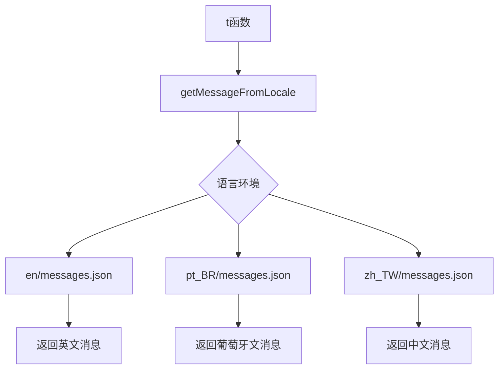
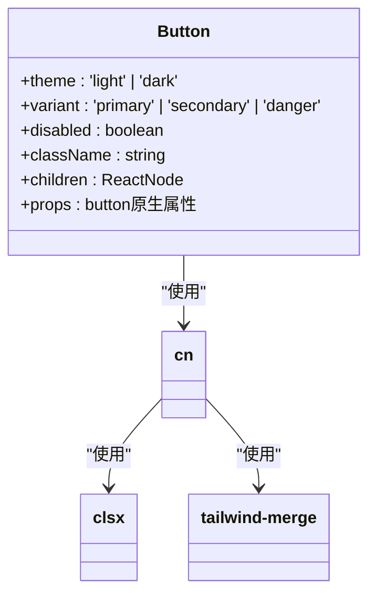
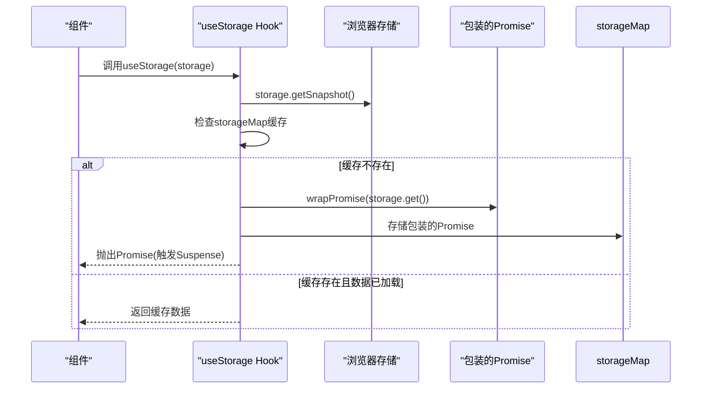
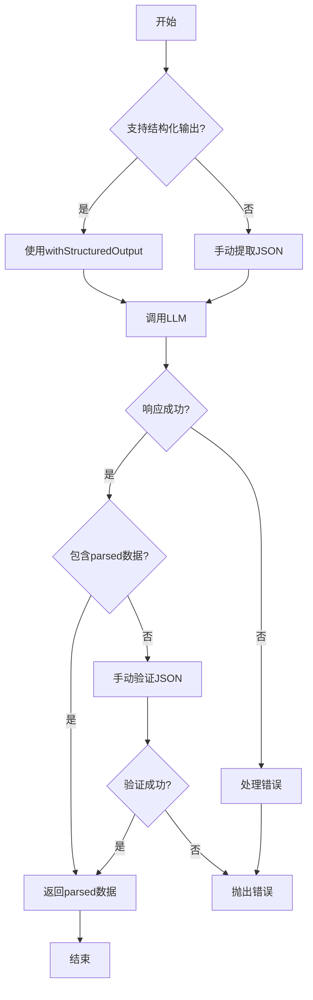
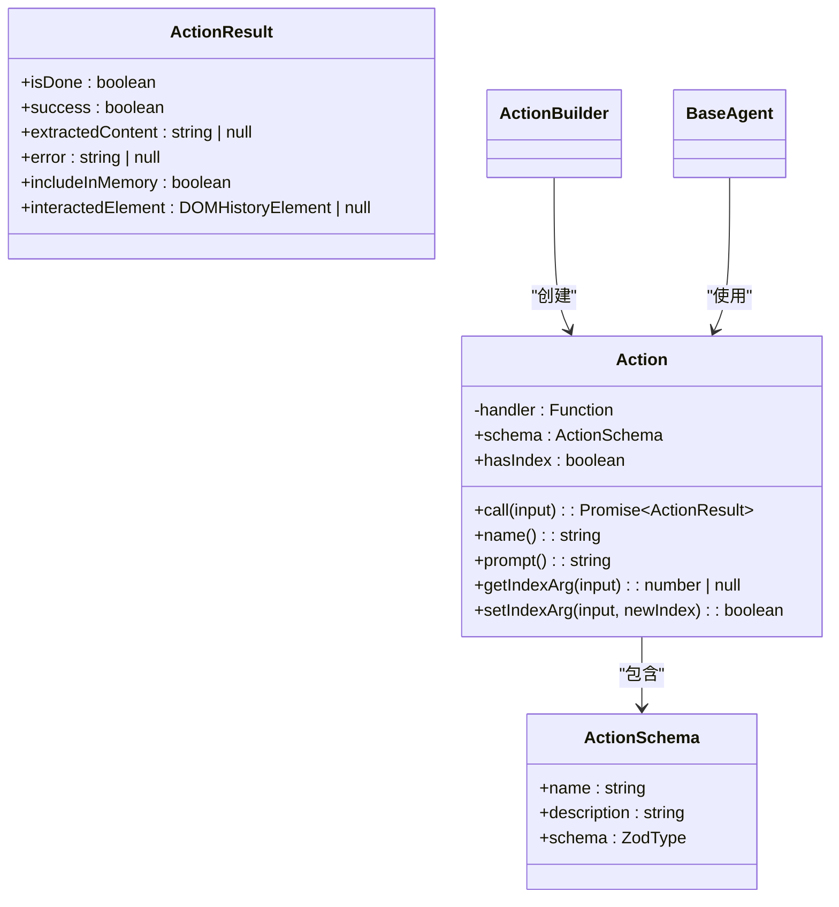
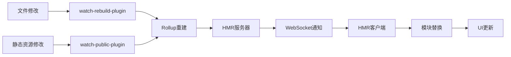

# 扩展开发

<cite>
**本文档中引用的文件**  
- [base.ts](file://chrome-extension/src/background/agent/agents/base.ts)
- [builder.ts](file://chrome-extension/src/background/agent/actions/builder.ts)
- [schemas.ts](file://chrome-extension/src/background/agent/actions/schemas.ts)
- [types.ts](file://chrome-extension/src/background/agent/types.ts)
- [i18n-dev.ts](file://packages/i18n/lib/i18n-dev.ts)
- [index.ts](file://packages/i18n/index.ts)
- [Button.tsx](file://packages/ui/lib/components/Button.tsx)
- [index.ts](file://packages/ui/index.ts)
- [withErrorBoundary.tsx](file://packages/shared/lib/hoc/withErrorBoundary.tsx)
- [useStorage.tsx](file://packages/shared/lib/hooks/useStorage.tsx)
- [index.ts](file://packages/shared/index.ts)
- [index.ts](file://packages/hmr/index.ts)
- [watch-rebuild-plugin.ts](file://packages/hmr/lib/plugins/watch-rebuild-plugin.ts)
- [make-entry-point-plugin.ts](file://packages/hmr/lib/plugins/make-entry-point-plugin.ts)
- [watch-public-plugin.ts](file://packages/hmr/lib/plugins/watch-public-plugin.ts)
</cite>

## 目录
1. [简介](#简介)
2. [共享库使用](#共享库使用)
3. [智能体系统扩展](#智能体系统扩展)
4. [HMR开发体验](#hmr开发体验)
5. [UI组件开发](#ui组件开发)
6. [最佳实践](#最佳实践)

## 简介
本指南为希望扩展nanobrowser功能的开发者提供全面的技术指导。nanobrowser是一个开源的AI网页自动化工具，其架构设计支持高度可扩展性。通过本指南，开发者将学习如何使用核心共享库、扩展智能体系统、利用HMR提升开发效率以及创建和修改UI组件。

nanobrowser采用模块化架构，将核心功能分解为独立的packages，每个包负责特定的功能领域。这种设计使得开发者可以专注于特定功能的扩展，而不会影响系统的其他部分。主要扩展点包括国际化(i18n)、用户界面(ui)、共享工具(shared)和热模块替换(hmr)系统。

**Section sources**
- [README.md](file://README.md#L1-L265)

## 共享库使用

### 国际化(i18n)包
nanobrowser的i18n包提供了完整的国际化支持，允许开发者轻松实现多语言功能。该包通过Chrome扩展的i18n API模式工作，支持消息替换和占位符处理。

核心功能通过`getMessageFromLocale`函数实现，该函数根据当前语言环境从预定义的JSON文件中获取对应的消息。支持的语言包括英语(en)、巴西葡萄牙语(pt_BR)和繁体中文(zh_TW)，这些语言文件位于`packages/i18n/locales`目录下。

开发者通过`t`函数访问国际化消息，该函数接受消息键和可选的替换参数。在开发模式下，系统使用`i18n-dev.ts`中的实现，提供占位符替换逻辑和开发时的默认语言环境支持。

**Diagram sources**
- [i18n-dev.ts](file://packages/i18n/lib/i18n-dev.ts#L1-L44)
- [index.ts](file://packages/i18n/index.ts#L1-L6)

**Section sources**
- [i18n-dev.ts](file://packages/i18n/lib/i18n-dev.ts#L1-L44)
- [index.ts](file://packages/i18n/index.ts#L1-L6)

### UI组件包
ui包提供了预构建的React组件和实用工具，旨在确保整个应用的UI一致性。核心组件包括Button，该组件支持多种主题和变体，通过Tailwind CSS实现响应式设计。

Button组件支持三种主题(light/dark)和三种变体(primary/secondary/danger)，通过`cn`工具函数合并CSS类名，实现灵活的样式组合。组件的样式设计考虑了悬停效果、禁用状态和可访问性。

**Diagram sources**
- [Button.tsx](file://packages/ui/lib/components/Button.tsx#L1-L43)
- [utils.ts](file://packages/ui/lib/utils.ts#L1-L7)

**Section sources**
- [Button.tsx](file://packages/ui/lib/components/Button.tsx#L1-L43)
- [index.ts](file://packages/ui/index.ts#L1-L3)
- [utils.ts](file://packages/ui/lib/utils.ts#L1-L7)

### 共享工具包
shared包包含高阶组件(HOC)、自定义Hook和实用工具函数，为整个应用提供通用功能。主要功能分为三个模块：hoc、hooks和utils。

hoc模块提供`withErrorBoundary`和`withSuspense`两个高阶组件，用于处理组件级别的错误和加载状态。`withErrorBoundary`包装组件并在发生错误时显示备用UI，同时记录错误信息。

hooks模块包含`useStorage`自定义Hook，该Hook使用React的`useSyncExternalStore`实现与浏览器存储的同步。它支持Suspense模式，当数据尚未加载时会抛出Promise，实现无缝的数据获取体验。

**Diagram sources**
- [withErrorBoundary.tsx](file://packages/shared/lib/hoc/withErrorBoundary.tsx#L1-L43)
- [useStorage.tsx](file://packages/shared/lib/hooks/useStorage.tsx#L1-L50)

**Section sources**
- [withErrorBoundary.tsx](file://packages/shared/lib/hoc/withErrorBoundary.tsx#L1-L43)
- [useStorage.tsx](file://packages/shared/lib/hooks/useStorage.tsx#L1-L50)
- [index.ts](file://packages/shared/index.ts#L1-L3)

## 智能体系统扩展

### 智能体基础架构
nanobrowser的智能体系统基于多智能体架构，核心是`BaseAgent`抽象类。该类定义了所有智能体的通用接口和行为，包括LLM集成、提示工程和执行流程。

`BaseAgent`接受Zod模式作为类型参数，确保模型输出的类型安全。它支持结构化输出(structured output)功能，当LLM支持时自动使用`withStructuredOutput`方法，否则回退到手动JSON提取。

智能体的执行流程包括：输入消息转换、LLM调用、响应解析和错误处理。系统根据模型类型和提供商自动选择最佳的工具调用方法，支持function calling等多种模式。

**Diagram sources**
- [base.ts](file://chrome-extension/src/background/agent/agents/base.ts#L1-L210)

**Section sources**
- [base.ts](file://chrome-extension/src/background/agent/agents/base.ts#L1-L210)
- [types.ts](file://chrome-extension/src/background/agent/types.ts#L1-L180)

### 动作系统扩展
动作系统是智能体功能的核心，通过`ActionBuilder`类构建和管理。每个动作由`Action`类表示，包含处理函数、输入模式和元数据。

要创建自定义动作，开发者需要定义动作模式(Schema)和处理逻辑。动作模式使用Zod定义，确保输入参数的类型安全和验证。处理函数接收验证后的输入并返回`ActionResult`。

现有动作包括基本导航(search_google, go_to_url)、元素交互(click_element, input_text)、标签管理(switch_tab, open_tab)和内容操作(cache_content)等。每个动作都通过事件系统与UI交互，提供实时反馈。

**Diagram sources**
- [builder.ts](file://chrome-extension/src/background/agent/actions/builder.ts#L1-L707)
- [schemas.ts](file://chrome-extension/src/background/agent/actions/schemas.ts#L1-L215)

**Section sources**
- [builder.ts](file://chrome-extension/src/background/agent/actions/builder.ts#L1-L707)
- [schemas.ts](file://chrome-extension/src/background/agent/actions/schemas.ts#L1-L215)
- [types.ts](file://chrome-extension/src/background/agent/types.ts#L1-L180)

## HMR开发体验
HMR(热模块替换)包为nanobrowser开发提供了高效的热重载功能，显著提升了开发体验。该系统基于Rollup插件架构，包含多个核心插件协同工作。

`make-entry-point-plugin`负责创建HMR入口点，注入客户端刷新逻辑。`watch-rebuild-plugin`监控源文件变化并触发重建，而`watch-public-plugin`专门监控public目录下的静态资源。

HMR系统通过WebSocket连接实现实时通信，当文件变化时，服务器通知客户端进行模块替换，而无需完全刷新页面。这使得开发者可以快速迭代UI组件和业务逻辑，保持应用状态。

**Diagram sources**
- [index.ts](file://packages/hmr/index.ts#L1-L1)
- [watch-rebuild-plugin.ts](file://packages/hmr/lib/plugins/watch-rebuild-plugin.ts#L1-L100)
- [make-entry-point-plugin.ts](file://packages/hmr/lib/plugins/make-entry-point-plugin.ts#L1-L100)

**Section sources**
- [index.ts](file://packages/hmr/index.ts#L1-L1)
- [watch-rebuild-plugin.ts](file://packages/hmr/lib/plugins/watch-rebuild-plugin.ts#L1-L100)
- [make-entry-point-plugin.ts](file://packages/hmr/lib/plugins/make-entry-point-plugin.ts#L1-L100)

## UI组件开发

### 组件创建流程
创建新的UI组件应遵循标准流程：首先在`packages/ui/lib/components`目录下创建组件文件，然后在`index.ts`中导出组件。组件应使用TypeScript定义精确的Props接口，并通过JSDoc提供文档。

新组件应遵循现有的设计系统，使用Tailwind CSS类名而非内联样式。颜色、间距和字体等设计令牌应从全局配置中引用，确保视觉一致性。

对于复杂组件，建议使用Composition模式而非继承，通过props传递子组件。这提高了组件的灵活性和可重用性。

### 组件修改指南
修改现有组件时，应首先评估变更的影响范围。通过`search_codebase`工具查找组件的所有使用位置，确保修改不会破坏现有功能。

样式修改应优先使用现有的Tailwind类名，避免引入新的CSS规则。功能修改应保持向后兼容，通过可选props支持新功能，而非破坏性变更。

对于Button等核心组件的修改，必须考虑所有主题和变体的状态，包括悬停、聚焦和禁用状态。修改后应更新相关文档和示例。

**Section sources**
- [Button.tsx](file://packages/ui/lib/components/Button.tsx#L1-L43)
- [index.ts](file://packages/ui/index.ts#L1-L3)

## 最佳实践

### 类型安全
始终使用TypeScript的类型系统确保代码质量。对于外部API或不确定的数据，使用Zod进行运行时验证。定义清晰的接口和类型别名，避免使用any类型。

在智能体系统中，充分利用Zod模式的类型推断功能，确保模型输入输出的类型安全。使用泛型参数传递模式类型，避免重复的类型声明。

### 错误处理
实现全面的错误处理策略。在异步操作中使用try-catch块，捕获并适当处理错误。对于用户可见的错误，提供清晰的错误消息和恢复建议。

使用`withErrorBoundary`高阶组件保护UI组件，防止渲染错误导致整个应用崩溃。在关键路径上添加适当的日志记录，便于问题诊断。

### 性能优化
利用`useStorage` Hook的缓存机制减少不必要的存储访问。对于计算密集型操作，考虑使用Web Workers避免阻塞主线程。

在智能体系统中，合理设置`maxSteps`和`retryDelay`等参数，平衡任务完成率和资源消耗。对于频繁调用的LLM操作，考虑实现结果缓存。

### 测试策略
为新功能编写单元测试和集成测试。对于动作系统，测试应覆盖正常流程和各种错误场景。使用Jest和React Testing Library验证组件行为。

对于国际化功能，验证所有语言环境下的消息正确性。对于HMR功能，测试文件修改后的热更新行为，确保状态保持。

**Section sources**
- [base.ts](file://chrome-extension/src/background/agent/agents/base.ts#L1-L210)
- [builder.ts](file://chrome-extension/src/background/agent/actions/builder.ts#L1-L707)
- [useStorage.tsx](file://packages/shared/lib/hooks/useStorage.tsx#L1-L50)