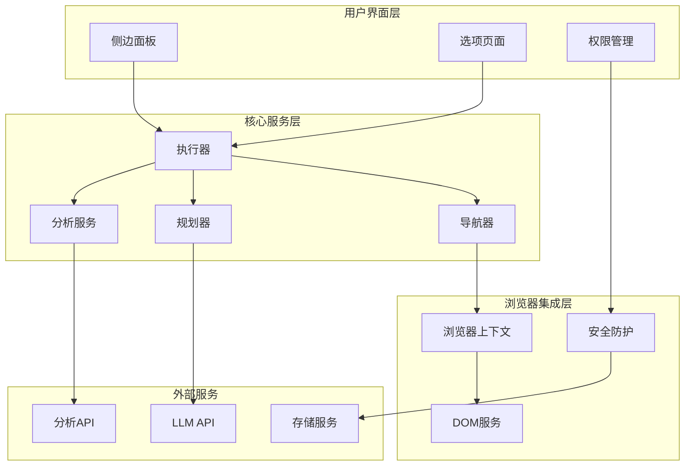
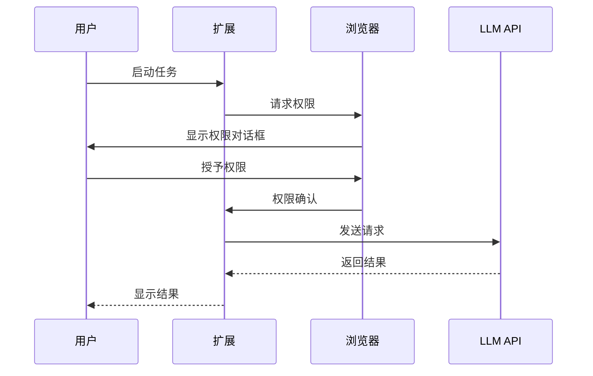
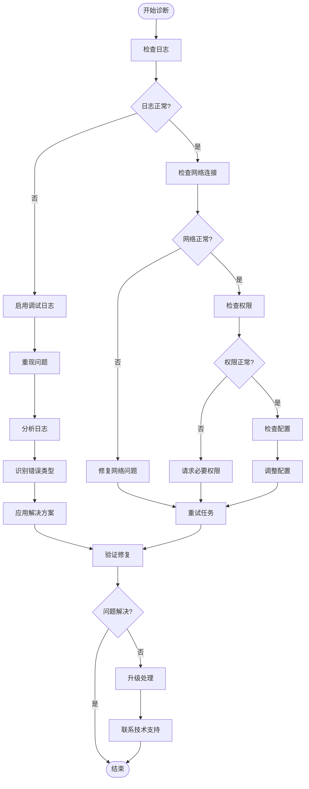

# 故障排除指南

<cite>
**本文档中引用的文件**
- [log.ts](file://chrome-extension/src/background/log.ts)
- [errors.ts](file://chrome-extension/src/background/agent/agents/errors.ts)
- [executor.ts](file://chrome-extension/src/background/agent/executor.ts)
- [generalSettings.ts](file://packages/storage/lib/settings/generalSettings.ts)
- [analytics.ts](file://chrome-extension/src/background/services/analytics.ts)
- [guardrails/index.ts](file://chrome-extension/src/background/services/guardrails/index.ts)
- [util.ts](file://chrome-extension/src/background/browser/util.ts)
- [context.ts](file://chrome-extension/src/background/browser/context.ts)
- [service.ts](file://chrome-extension/src/background/browser/dom/service.ts)
- [permission.js](file://chrome-extension/public/permission/permission.js)
- [index.html](file://chrome-extension/public/permission/index.html)
- [SECURITY.md](file://SECURITY.md)
- [CONTRIBUTING.md](file://CONTRIBUTING.md)
</cite>

## 目录
1. [简介](#简介)
2. [日志系统](#日志系统)
3. [常见问题及解决方案](#常见问题及解决方案)
4. [错误类型详解](#错误类型详解)
5. [配置优化](#配置优化)
6. [安全注意事项](#安全注意事项)
7. [性能优化建议](#性能优化建议)
8. [调试技巧](#调试技巧)
9. [故障排除流程](#故障排除流程)
10. [贡献指南](#贡献指南)

## 简介

NanoBrowser 是一个基于 Chrome 扩展的智能网页操作工具，集成了 LLM（大语言模型）功能来自动执行复杂的网页任务。本故障排除指南旨在帮助用户识别、诊断和解决在使用过程中遇到的各种问题。

### 核心组件架构



**图表来源**
- [executor.ts](file://chrome-extension/src/background/agent/executor.ts#L1-L50)
- [context.ts](file://chrome-extension/src/background/browser/context.ts#L1-L40)
- [analytics.ts](file://chrome-extension/src/background/services/analytics.ts#L1-L50)

## 日志系统

NanoBrowser 使用统一的日志系统来记录各种事件和错误信息。理解日志格式对于故障诊断至关重要。

### 日志级别

| 级别 | 描述 | 使用场景 |
|------|------|----------|
| `debug` | 调试信息（仅开发模式） | 详细执行过程跟踪 |
| `info` | 一般信息 | 任务开始/结束、状态变更 |
| `warning` | 警告信息 | 可能的问题但不影响运行 |
| `error` | 错误信息 | 严重问题需要关注 |

### 日志命名空间

日志消息包含命名空间前缀，便于识别来源：

- `[Agent]` - 主要代理执行
- `[Executor]` - 执行器组件
- `[Navigator]` - 导航器组件  
- `[Planner]` - 规划器组件
- `[BrowserContext]` - 浏览器上下文
- `[SecurityGuardrails]` - 安全防护
- `[Analytics]` - 分析服务

### 日志解读示例

```typescript
// 正常任务执行
[Agent] 🚀 Executing task: 访问网站并填写表单

// 超时警告
[Agent] ⚠️ Task paused due to timeout

// 错误发生
[Agent] ❌ Task failed: Max steps reached
```

**章节来源**
- [log.ts](file://chrome-extension/src/background/log.ts#L1-L40)

## 常见问题及解决方案

### LLM API 调用失败

#### 问题症状
- 任务执行卡住不动
- 出现 "Max steps reached" 错误
- 网络请求超时

#### 诊断步骤
1. 检查网络连接状态
2. 验证 API 密钥配置
3. 查看 LLM 提供商状态
4. 检查请求频率限制

#### 解决方案
1. **检查 API 配置**：确保在设置中正确配置了 LLM 提供商和 API 密钥
2. **调整超时设置**：增加 `minWaitPageLoad` 参数值
3. **重试机制**：系统会自动重试最多 `maxFailures` 次
4. **切换提供商**：尝试使用不同的 LLM 提供商

### 权限错误

#### 问题症状
- 出现 "403 Forbidden" 错误
- "Access denied" 消息
- 扩展冲突警告

#### 诊断步骤
1. 检查扩展权限设置
2. 验证 API 密钥权限
3. 检查防火墙配置

#### 解决方案
1. **重新授权**：在扩展设置中重新授予权限
2. **检查 API 密钥**：确保密钥具有必要的权限
3. **禁用冲突扩展**：使用新的 Chrome 用户配置文件
4. **更新 Ollama 设置**：设置 `OLLAMA_ORIGINS=chrome-extension://*`

### 任务执行卡住或超时

#### 问题症状
- 任务长时间无响应
- 显示 "Task paused" 状态
- 最大步数 Reached 错误

#### 诊断步骤
1. 检查任务复杂度
2. 查看执行历史
3. 分析网络状况

#### 解决方案
1. **增加最大步数**：在设置中提高 `maxSteps` 值
2. **优化任务分解**：将复杂任务拆分为多个简单任务
3. **检查页面加载**：确保目标页面能够正常加载
4. **清理缓存**：清除浏览器缓存和扩展数据

**章节来源**
- [errors.ts](file://chrome-extension/src/background/agent/agents/errors.ts#L1-L100)
- [executor.ts](file://chrome-extension/src/background/agent/executor.ts#L180-L220)

## 错误类型详解

### 认证错误 (AuthenticationError)

#### 特征
- HTTP 401 状态码
- "Authentication" 相关消息
- API 密钥无效或过期

#### 处理方式
```typescript
// 检查认证错误
if (isAuthenticationError(error)) {
  // 重新配置 API 密钥
  // 或者切换到其他 LLM 提供商
}
```

### 权限错误 (ForbiddenError)

#### 特征
- HTTP 403 状态码
- "Forbidden" 相关消息
- API 密钥权限不足

#### 处理方式
```typescript
// 检查权限错误
if (isForbiddenError(error)) {
  // 检查 API 密钥权限设置
  // 或联系服务提供商
}
```

### 请求取消错误 (RequestCancelledError)

#### 特征
- 用户主动取消任务
- 系统资源不足时自动取消

#### 处理方式
```typescript
// 检查请求是否被取消
if (error instanceof RequestCancelledError) {
  // 清理资源
  // 保存部分进度
}
```

### 最大步数 Reached 错误

#### 特征
- 达到 `maxSteps` 限制
- 任务无法完成
- 循环执行导致

#### 处理方式
```typescript
// 增加最大步数限制
const settings = await generalSettingsStore.getSettings();
settings.maxSteps = 200; // 默认是 100
await generalSettingsStore.updateSettings({ maxSteps: 200 });
```

### 最大失败次数 Reached 错误

#### 特征
- 连续失败达到 `maxFailures` 限制
- 网络不稳定或配置错误
- LLM 服务不可用

#### 处理方式
```typescript
// 增加最大失败次数
const settings = await generalSettingsStore.getSettings();
settings.maxFailures = 5; // 默认是 3
await generalSettingsStore.updateSettings({ maxFailures: 5 });
```

**章节来源**
- [errors.ts](file://chrome-extension/src/background/agent/agents/errors.ts#L100-L200)

## 配置优化

### 核心配置参数

| 参数 | 默认值 | 推荐范围 | 说明 |
|------|--------|----------|------|
| `maxSteps` | 100 | 50-200 | 单个任务的最大执行步数 |
| `maxFailures` | 3 | 2-5 | 允许的最大连续失败次数 |
| `maxActionsPerStep` | 5 | 3-10 | 每步允许的最大动作数量 |
| `planningInterval` | 3 | 2-5 | 规划器执行间隔 |
| `minWaitPageLoad` | 250ms | 200-500ms | 页面加载最小等待时间 |

### 性能配置建议

#### 对于简单任务
```typescript
{
  maxSteps: 50,
  maxFailures: 2,
  maxActionsPerStep: 3,
  planningInterval: 2
}
```

#### 对于复杂任务
```typescript
{
  maxSteps: 150,
  maxFailures: 5,
  maxActionsPerStep: 8,
  planningInterval: 4
}
```

### 存储配置

#### 启用历史重放
```typescript
// 在设置中启用
await generalSettingsStore.updateSettings({
  replayHistoricalTasks: true
});
```

#### 清理旧历史记录
```typescript
// 定期清理以节省存储空间
await chatHistoryStore.cleanupOldRecords();
```

**章节来源**
- [generalSettings.ts](file://packages/storage/lib/settings/generalSettings.ts#L20-L40)

## 安全注意事项

### 防火墙配置

NanoBrowser 内置了强大的安全防护系统，防止恶意操作和危险内容。

#### 默认阻止的 URL 前缀
- `https://chromewebstore.google.com` - Chrome Web Store
- `chrome-extension://` - 其他扩展程序
- `chrome://` - Chrome 内部页面
- `javascript:` - JavaScript 协议
- `data:` - 数据 URI
- `file:` - 文件协议
- `vbscript:` - VBScript 协议
- `ws:` 和 `wss:` - WebSocket 协议

#### 自定义防火墙规则

```typescript
// 允许列表配置
const allowList = ['*.example.com', 'api.example.com'];

// 拒绝列表配置  
const denyList = ['malicious-site.com', '*ads*'];

// 检查 URL 是否允许
const isAllowed = isUrlAllowed(targetUrl, allowList, denyList);
```

### 内容安全

#### XSS 防护
- 自动清理 HTML 内容
- 移除危险脚本标签
- 验证输入数据

#### 数据验证
- URL 格式验证
- 字符串长度限制
- 特殊字符过滤

### 权限管理

#### 必需权限
- `storage` - 扩展数据存储
- `scripting` - 动态脚本注入
- `tabs` - 标签页控制
- `activeTab` - 当前标签页访问
- `debugger` - 调试功能
- `unlimitedStorage` - 大容量存储
- `webNavigation` - 导航监控

#### 权限请求流程



**图表来源**
- [permission.js](file://chrome-extension/public/permission/permission.js#L15-L40)
- [util.ts](file://chrome-extension/src/background/browser/util.ts#L10-L30)

**章节来源**
- [guardrails/index.ts](file://chrome-extension/src/background/services/guardrails/index.ts#L1-L50)
- [util.ts](file://chrome-extension/src/background/browser/util.ts#L10-L50)

## 性能优化建议

### LLM 配置优化

#### 选择合适的模型
- **快速响应**：使用较小的模型（如 GPT-3.5-turbo）
- **高质量输出**：使用较大的模型（如 GPT-4）
- **成本控制**：根据任务复杂度选择模型

#### 提示词优化
- 使用清晰明确的指令
- 包含上下文信息
- 避免歧义表达

### 执行器优化

#### 步骤配置
```typescript
// 优化执行参数
const optimizedSettings = {
  maxSteps: 120,
  maxFailures: 4,
  planningInterval: 3,
  minWaitPageLoad: 300
};
```

#### 并发控制
- 限制同时执行的任务数量
- 实施任务队列机制
- 监控系统资源使用

### 缓存策略

#### DOM 缓存
- 缓存页面结构信息
- 减少重复 DOM 查询
- 实施智能缓存失效

#### 结果缓存
- 缓存 LLM 响应
- 避免重复计算
- 实施 TTL 机制

### 网络优化

#### 连接池管理
- 复用 HTTP 连接
- 实施连接超时控制
- 支持 HTTP/2 协议

#### 请求优化
- 压缩传输数据
- 实施请求去重
- 优化请求顺序

**章节来源**
- [executor.ts](file://chrome-extension/src/background/agent/executor.ts#L300-L400)

## 调试技巧

### 启用详细日志

```typescript
// 开发模式下启用调试日志
const logger = createLogger('Agent');
logger.debug('详细执行信息', executionDetails);
```

### 分析执行历史

```typescript
// 获取任务执行历史
const history = await chatHistoryStore.loadAgentStepHistory(taskId);
console.log('执行步骤:', history.history);
```

### 监控系统指标

```typescript
// 监控任务性能
analytics.trackTaskStart(taskId);
// ... 执行任务 ...
analytics.trackTaskComplete(taskId);
```

### 错误分类分析

```typescript
// 分析错误类型
const errorCategory = analytics.categorizeError(error);
console.log('错误类别:', errorCategory);
```

### 性能基准测试

```typescript
// 测试不同配置的性能
const benchmarkResults = await executor.replayHistory(
  sessionId, 
  maxRetries = 5,
  skipFailures = false,
  delayBetweenActions = 1.0
);
```

**章节来源**
- [analytics.ts](file://chrome-extension/src/background/services/analytics.ts#L200-L250)
- [executor.ts](file://chrome-extension/src/background/agent/executor.ts#L400-L435)

## 故障排除流程

### 第一步：问题识别

1. **观察症状**：记录具体的错误信息和行为表现
2. **收集环境信息**：操作系统、浏览器版本、扩展版本
3. **重现问题**：确定问题发生的条件和频率

### 第二步：初步诊断



### 第三步：解决方案实施

#### 系统性修复
1. **重启扩展**：卸载后重新安装
2. **清理缓存**：清除浏览器和扩展缓存
3. **重置配置**：恢复默认设置
4. **更新版本**：确保使用最新版本

#### 个性化修复
1. **调整参数**：根据具体需求修改配置
2. **优化环境**：改善网络和系统环境
3. **定制规则**：添加特定的防火墙规则

### 第四步：验证和监控

1. **功能测试**：验证所有功能正常工作
2. **性能测试**：确保性能满足要求
3. **持续监控**：观察后续使用情况
4. **反馈收集**：收集用户反馈进行改进

### 第五步：文档更新

1. **记录解决方案**：更新故障排除知识库
2. **更新文档**：修改相关技术文档
3. **培训材料**：更新用户培训内容
4. **FAQ 更新**：添加常见问题解答

## 贡献指南

### 报告问题

当您遇到问题时，请按照以下步骤报告：

1. **搜索现有问题**：在 GitHub Issues 中查找类似问题
2. **收集信息**：
   - 清晰的问题描述
   - 重现步骤
   - 环境详情（操作系统、浏览器版本）
   - 相关日志信息
3. **创建 Issue**：使用模板提供完整信息

### 贡献代码

1. **Fork 仓库**：创建项目副本
2. **创建分支**：使用有意义的分支名称
3. **编写代码**：遵循现有代码风格
4. **添加测试**：确保新功能有相应测试
5. **提交 PR**：提供清晰的描述和变更说明

### 安全漏洞报告

如发现安全漏洞，请遵循以下流程：

1. **不公开报告**：避免在公共渠道披露
2. **使用安全咨询**：通过 GitHub Security Advisory 报告
3. **提供详细信息**：包括影响范围和修复建议
4. **配合修复**：协助开发团队解决问题

### 社区参与

1. **参与讨论**：在 Issues 和 PR 中提供反馈
2. **帮助他人**：回答其他用户的疑问
3. **文档改进**：完善项目文档
4. **测试验证**：验证新功能和修复

**章节来源**
- [CONTRIBUTING.md](file://CONTRIBUTING.md#L1-L37)
- [SECURITY.md](file://SECURITY.md#L1-L6)

## 结论

本故障排除指南涵盖了 NanoBrowser 使用过程中可能遇到的各种问题及其解决方案。通过理解日志系统、掌握诊断技巧、合理配置参数和遵循最佳实践，用户可以有效地解决大多数问题。

### 关键要点总结

1. **日志是诊断的第一手资料**，仔细分析日志信息有助于快速定位问题
2. **合理的配置调整**可以显著改善性能和稳定性
3. **安全防护机制**确保了系统的安全性
4. **持续监控和优化**是保持系统良好运行的关键
5. **社区支持**为用户提供额外的帮助资源

### 下一步行动

- 定期检查更新以获得最新的功能和修复
- 参与社区讨论分享您的经验和建议
- 如果遇到未解决的问题，及时寻求帮助
- 考虑贡献代码或文档来帮助改进项目

通过遵循本指南的建议和最佳实践，您将能够充分利用 NanoBrowser 的强大功能，同时有效应对可能出现的各种挑战。