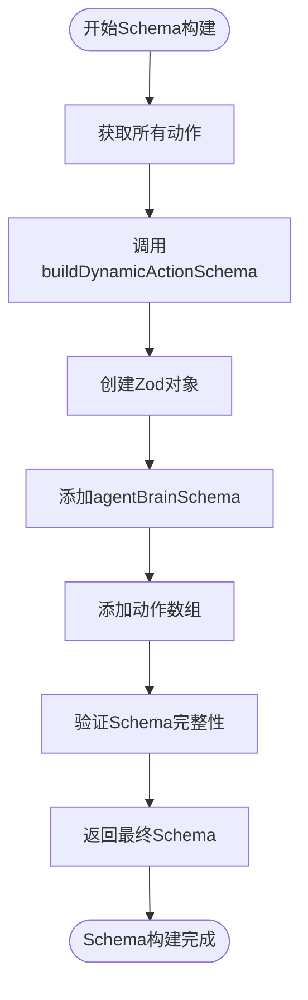

# Navigator动作注册表

<cite>
**本文档中引用的文件**
- [navigator.ts](file://chrome-extension/src/background/agent/agents/navigator.ts)
- [builder.ts](file://chrome-extension/src/background/agent/actions/builder.ts)
- [schemas.ts](file://chrome-extension/src/background/agent/actions/schemas.ts)
- [executor.ts](file://chrome-extension/src/background/agent/executor.ts)
- [base.ts](file://chrome-extension/src/background/agent/agents/base.ts)
- [types.ts](file://chrome-extension/src/background/agent/types.ts)
</cite>

## 目录
1. [简介](#简介)
2. [项目结构](#项目结构)
3. [核心组件](#核心组件)
4. [架构概览](#架构概览)
5. [详细组件分析](#详细组件分析)
6. [依赖关系分析](#依赖关系分析)
7. [性能考虑](#性能考虑)
8. [故障排除指南](#故障排除指南)
9. [结论](#结论)

## 简介

NavigatorActionRegistry类是NanoBrowser项目中智能代理系统的核心组件，负责动态管理各种浏览器操作动作。该类通过registerAction和unregisterAction方法实现了运行时动作的注册与注销功能，同时通过setupModelOutputSchema方法利用Zod库动态构建类型安全的Schema，为LLM提供结构化的输出格式。

该设计模式体现了高度的模块化和可扩展性，允许开发者在不修改核心逻辑的情况下无缝添加新的动作类型。通过buildDynamicActionSchema函数，系统能够根据当前注册的动作集合自动生成联合类型，确保了类型安全性和运行时的灵活性。

## 项目结构

NavigatorActionRegistry所在的项目采用分层架构设计，主要包含以下核心模块：

**图表来源**
- [executor.ts](file://chrome-extension/src/background/agent/executor.ts#L70-L80)
- [navigator.ts](file://chrome-extension/src/background/agent/agents/navigator.ts#L40-L68)
- [builder.ts](file://chrome-extension/src/background/agent/actions/builder.ts#L129-L140)

**章节来源**
- [executor.ts](file://chrome-extension/src/background/agent/executor.ts#L1-L50)
- [navigator.ts](file://chrome-extension/src/background/agent/agents/navigator.ts#L1-L40)

## 核心组件

### NavigatorActionRegistry类

NavigatorActionRegistry是整个动作管理系统的核心控制器，负责维护动作注册表并提供动态Schema生成功能。

#### 主要特性

1. **动态动作管理**：通过registerAction和unregisterAction方法实现运行时动作的增删
2. **类型安全保障**：利用Zod库确保Schema的类型安全性
3. **灵活扩展性**：支持任意数量的新动作类型而无需修改核心逻辑
4. **智能聚合**：自动聚合所有可用动作生成统一的输出格式

#### 核心方法

- `registerAction(action: Action)`: 注册新的动作实例
- `unregisterAction(name: string)`: 移除指定名称的动作
- `getAction(name: string)`: 获取指定名称的动作实例
- `setupModelOutputSchema()`: 构建基于当前注册动作的Schema

**章节来源**
- [navigator.ts](file://chrome-extension/src/background/agent/agents/navigator.ts#L40-L68)

### ActionBuilder类

ActionBuilder负责构建默认的动作集合，为NavigatorActionRegistry提供初始的动作实例。

#### 动作类型覆盖

系统预定义了多种动作类型，包括：
- 基础导航动作：搜索、跳转、后退
- 元素交互动作：点击、输入文本
- 标签页管理：切换、打开、关闭标签页
- 内容操作：缓存、滚动、等待
- 键盘操作：发送按键序列
- 下拉框操作：获取选项、选择选项

**章节来源**
- [builder.ts](file://chrome-extension/src/background/agent/actions/builder.ts#L80-L126)

## 架构概览

NavigatorActionRegistry在整个智能代理系统中扮演着关键的桥梁角色，连接动作定义、Schema生成和LLM输出处理：

**图表来源**
- [executor.ts](file://chrome-extension/src/background/agent/executor.ts#L70-L80)
- [navigator.ts](file://chrome-extension/src/background/agent/agents/navigator.ts#L79-L90)
- [builder.ts](file://chrome-extension/src/background/agent/actions/builder.ts#L129-L140)

## 详细组件分析

### NavigatorActionRegistry深度分析

#### 类结构设计

**图表来源**
- [navigator.ts](file://chrome-extension/src/background/agent/agents/navigator.ts#L40-L68)
- [builder.ts](file://chrome-extension/src/background/agent/actions/builder.ts#L43-L126)
- [schemas.ts](file://chrome-extension/src/background/agent/actions/schemas.ts#L3-L8)

#### registerAction方法实现

registerAction方法实现了动作的动态注册机制：

**图表来源**
- [navigator.ts](file://chrome-extension/src/background/agent/agents/navigator.ts#L48-L50)

#### setupModelOutputSchema方法详解

setupModelOutputSchema方法是Schema生成的核心逻辑：

**图表来源**
- [navigator.ts](file://chrome-extension/src/background/agent/agents/navigator.ts#L60-L68)
- [builder.ts](file://chrome-extension/src/background/agent/actions/builder.ts#L129-L140)

**章节来源**
- [navigator.ts](file://chrome-extension/src/background/agent/agents/navigator.ts#L40-L68)

### buildDynamicActionSchema函数分析

buildDynamicActionSchema函数是Schema动态生成的关键算法：

#### 算法流程

**图表来源**
- [builder.ts](file://chrome-extension/src/background/agent/actions/builder.ts#L129-L140)

#### 类型安全保证

该函数通过以下方式确保类型安全：

1. **动态联合类型**：为每个动作生成独立的可选字段
2. **空值处理**：使用nullable()确保空值的安全处理
3. **描述信息**：通过describe()提供语义化描述
4. **Zod集成**：完全集成Zod类型系统

**章节来源**
- [builder.ts](file://chrome-extension/src/background/agent/actions/builder.ts#L129-L140)

### Action类设计模式

Action类采用了命令模式和策略模式的组合设计：

#### 命令模式实现

**图表来源**
- [builder.ts](file://chrome-extension/src/background/agent/actions/builder.ts#L43-L126)

#### 输入验证机制

Action类实现了严格的输入验证：

**图表来源**
- [builder.ts](file://chrome-extension/src/background/agent/actions/builder.ts#L55-L75)

**章节来源**
- [builder.ts](file://chrome-extension/src/background/agent/actions/builder.ts#L43-L126)

### Schema系统架构

#### ActionSchema接口设计

ActionSchema提供了标准化的动作描述结构：

| 属性 | 类型 | 描述 | 必需 |
|------|------|------|------|
| name | string | 动作唯一标识符 | 是 |
| description | string | 动作功能描述 | 是 |
| schema | z.ZodType | 输入参数Schema | 是 |

#### agentBrainSchema结构

agentBrainSchema定义了代理状态的核心结构：

| 字段 | 类型 | 描述 |
|------|------|------|
| evaluation_previous_goal | string | 对前一目标的评估 |
| memory | string | 当前记忆内容 |
| next_goal | string | 下一步目标 |

**章节来源**
- [schemas.ts](file://chrome-extension/src/background/agent/actions/schemas.ts#L3-L8)
- [types.ts](file://chrome-extension/src/background/agent/types.ts#L158-L165)

## 依赖关系分析

### 组件间依赖图

**图表来源**
- [executor.ts](file://chrome-extension/src/background/agent/executor.ts#L70-L80)
- [navigator.ts](file://chrome-extension/src/background/agent/agents/navigator.ts#L40-L68)
- [builder.ts](file://chrome-extension/src/background/agent/actions/builder.ts#L129-L140)

### 外部依赖

系统依赖以下外部库和模块：

1. **Zod**：类型验证和Schema生成
2. **LangChain**：语言模型集成
3. **i18n**：国际化支持
4. **schema-utils**：JSON Schema转换工具

**章节来源**
- [executor.ts](file://chrome-extension/src/background/agent/executor.ts#L1-L30)
- [navigator.ts](file://chrome-extension/src/background/agent/agents/navigator.ts#L1-L20)

## 性能考虑

### Schema生成优化

1. **延迟计算**：Schema仅在需要时生成，避免不必要的计算开销
2. **缓存机制**：已生成的Schema可以被缓存复用
3. **增量更新**：支持动态添加或移除动作而不重建整个Schema

### 内存管理

1. **弱引用**：动作实例使用弱引用避免内存泄漏
2. **及时清理**：unregisterAction确保资源及时释放
3. **批量操作**：支持批量注册多个动作提高效率

### 扩展性设计

系统通过以下方式确保良好的扩展性：

1. **插件化架构**：新动作类型可通过继承Action基类轻松添加
2. **配置驱动**：动作行为可通过配置文件定制
3. **版本兼容**：向后兼容的API设计确保升级平滑

## 故障排除指南

### 常见问题及解决方案

#### 动作注册失败

**症状**：registerAction调用后动作未生效
**原因**：动作名称冲突或Schema验证失败
**解决方案**：检查动作名称唯一性，验证Schema定义

#### Schema生成错误

**症状**：setupModelOutputSchema抛出异常
**原因**：动作Schema不兼容或循环依赖
**解决方案**：检查动作Schema的完整性，避免循环引用

#### 类型安全问题

**症状**：编译时或运行时报类型错误
**原因**：Zod Schema定义不正确
**解决方案**：使用正确的Zod类型定义，确保类型一致性

**章节来源**
- [builder.ts](file://chrome-extension/src/background/agent/actions/builder.ts#L55-L75)
- [navigator.ts](file://chrome-extension/src/background/agent/agents/navigator.ts#L60-L68)

## 结论

NavigatorActionRegistry类展现了现代软件架构中的几个重要设计原则：

### 设计优势

1. **高内聚低耦合**：动作管理与Schema生成分离，职责清晰
2. **开放封闭原则**：对扩展开放，对修改封闭
3. **单一职责原则**：每个类只负责一个特定功能
4. **依赖倒置原则**：高层模块不依赖低层模块的具体实现

### 技术创新

1. **动态Schema生成**：运行时构建类型安全的Schema
2. **泛型支持**：充分利用TypeScript泛型提供强类型支持
3. **模块化设计**：清晰的模块边界和接口定义
4. **测试友好**：良好的抽象层次便于单元测试

### 应用价值

该设计不仅解决了当前的需求，还为未来的功能扩展奠定了坚实的基础。通过这种架构，开发者可以：

- 快速添加新的浏览器操作动作
- 确保类型安全和运行时稳定性
- 维护清晰的代码结构和可读性
- 支持复杂的LLM交互场景

这种设计模式值得在类似的智能代理系统中推广和应用。