# Navigator智能体架构与行为深度解析

<cite>
**本文档中引用的文件**
- [navigator.ts](file://chrome-extension/src/background/agent/agents/navigator.ts)
- [builder.ts](file://chrome-extension/src/background/agent/actions/builder.ts)
- [schemas.ts](file://chrome-extension/src/background/agent/actions/schemas.ts)
- [base.ts](file://chrome-extension/src/background/agent/agents/base.ts)
- [types.ts](file://chrome-extension/src/background/agent/types.ts)
- [history.ts](file://chrome-extension/src/background/agent/history.ts)
- [utils.ts](file://chrome-extension/src/background/utils.ts)
- [service.ts](file://chrome-extension/src/background/browser/dom/history/service.ts)
- [view.ts](file://chrome-extension/src/background/browser/dom/history/view.ts)
</cite>

## 目录
1. [简介](#简介)
2. [系统架构概览](#系统架构概览)
3. [核心组件分析](#核心组件分析)
4. [NavigatorActionRegistry动态注册机制](#navigatoractionregistry动态注册机制)
5. [Zod模式构建与JSON Schema转换](#zod模式构建与json-schema转换)
6. [execute方法执行流程](#execute方法执行流程)
7. [历史回放机制](#历史回放机制)
8. [动作索引更新机制](#动作索引更新机制)
9. [错误处理与重试策略](#错误处理与重试策略)
10. [性能优化考虑](#性能优化考虑)
11. [总结](#总结)

## 简介

Navigator智能体是NanoBrowser项目中的核心执行者，负责解析Planner的指令并执行具体的网页操作。它作为一个高度智能化的浏览器自动化系统，能够理解自然语言指令，动态构建可执行动作，并在复杂的网页环境中保持稳定的操作能力。

该智能体采用了先进的架构设计，结合了LLM推理能力、动态动作注册、历史回放机制和智能索引更新等核心技术，实现了在动态网页环境中的可靠自动化操作。

## 系统架构概览

Navigator智能体采用分层架构设计，主要包含以下核心层次：

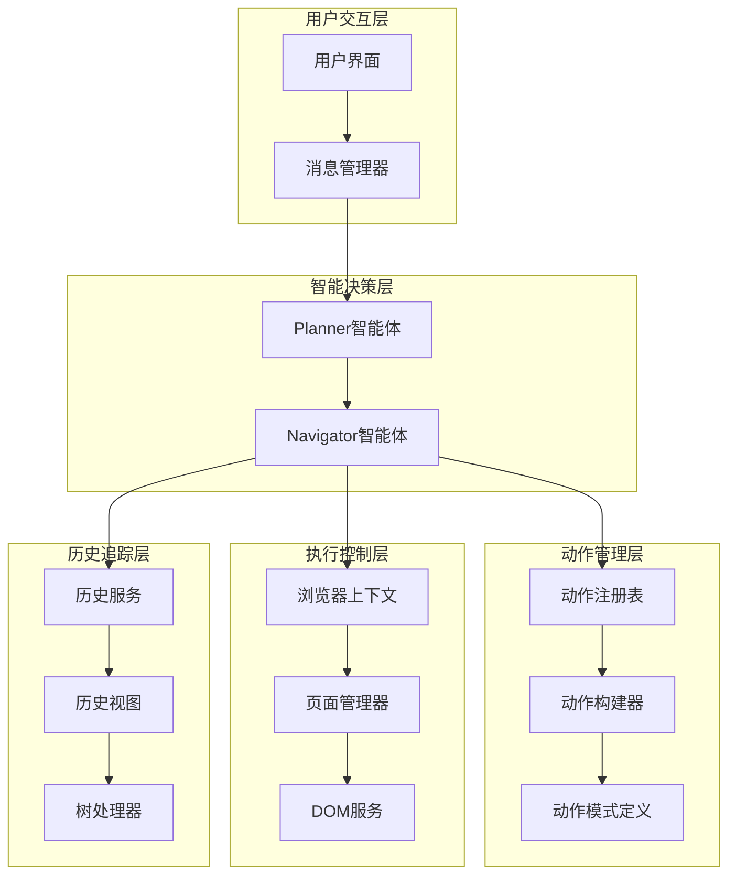

**图表来源**
- [navigator.ts](file://chrome-extension/src/background/agent/agents/navigator.ts#L31-L86)
- [base.ts](file://chrome-extension/src/background/agent/agents/base.ts#L30-L60)
- [builder.ts](file://chrome-extension/src/background/agent/actions/builder.ts#L150-L200)

## 核心组件分析

### NavigatorAgent类架构

NavigatorAgent继承自BaseAgent，是整个系统的核心控制器。它负责协调各个子系统的协作，管理执行流程，并处理异常情况。

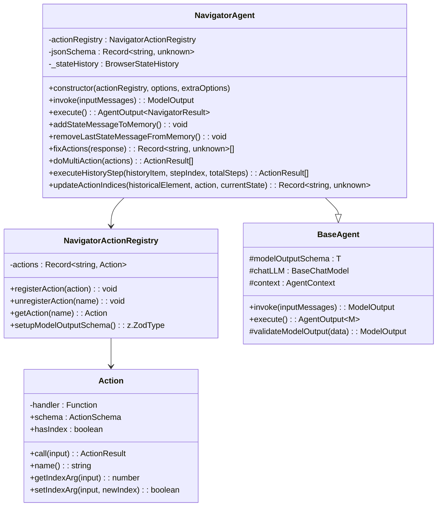

**图表来源**
- [navigator.ts](file://chrome-extension/src/background/agent/agents/navigator.ts#L60-L120)
- [base.ts](file://chrome-extension/src/background/agent/agents/base.ts#L30-L80)
- [builder.ts](file://chrome-extension/src/background/agent/actions/builder.ts#L40-L120)

**章节来源**
- [navigator.ts](file://chrome-extension/src/background/agent/agents/navigator.ts#L60-L120)
- [base.ts](file://chrome-extension/src/background/agent/agents/base.ts#L30-L80)

### 动作系统架构

动作系统是Navigator智能体的核心功能模块，提供了丰富的网页操作能力：

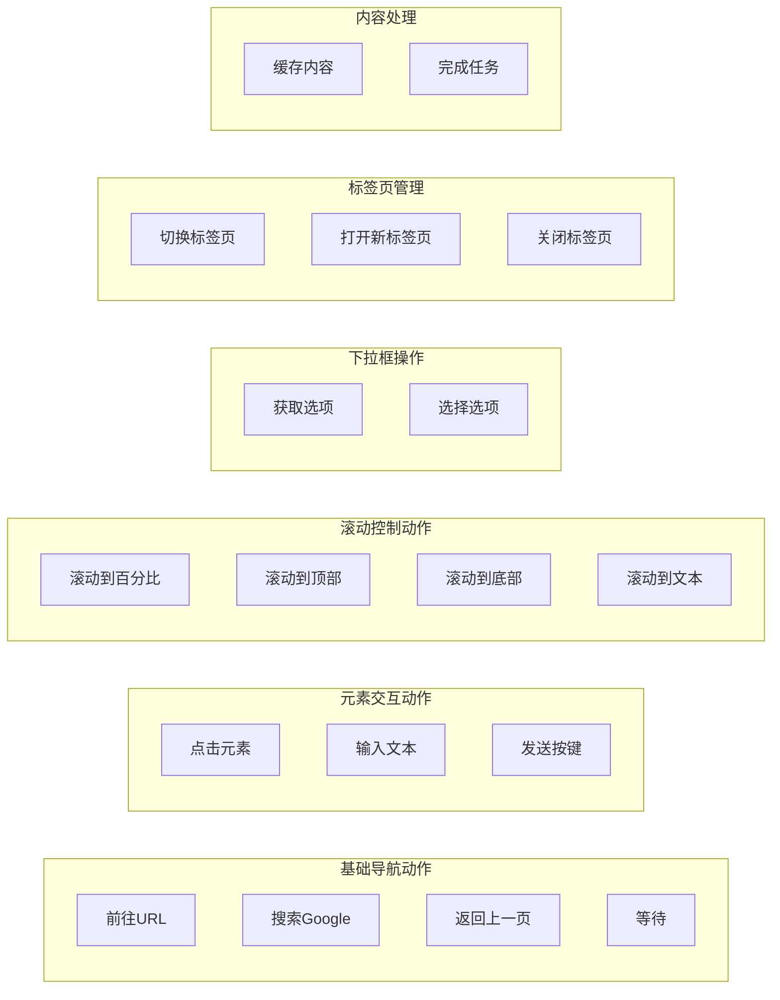

**图表来源**
- [schemas.ts](file://chrome-extension/src/background/agent/actions/schemas.ts#L10-L215)
- [builder.ts](file://chrome-extension/src/background/agent/actions/builder.ts#L150-L700)

**章节来源**
- [schemas.ts](file://chrome-extension/src/background/agent/actions/schemas.ts#L10-L215)
- [builder.ts](file://chrome-extension/src/background/agent/actions/builder.ts#L150-L700)

## NavigatorActionRegistry动态注册机制

NavigatorActionRegistry是Navigator智能体的核心组件之一，负责动态管理和注册可执行动作。它采用注册表模式，支持运行时动态添加和移除动作。

### 注册机制实现

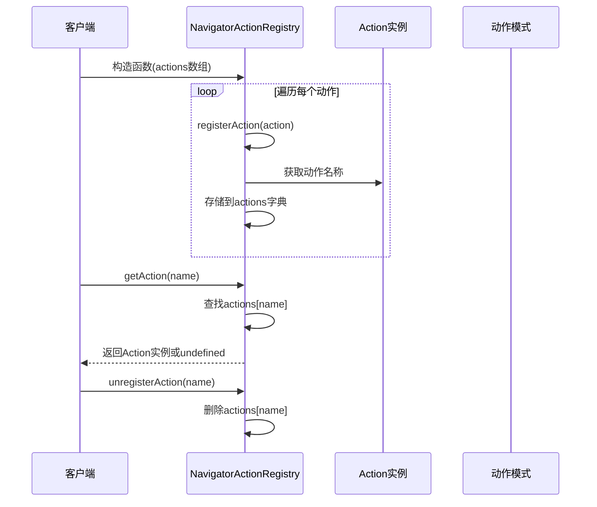

**图表来源**
- [navigator.ts](file://chrome-extension/src/background/agent/agents/navigator.ts#L31-L86)

### 动态模式构建

Registry通过`setupModelOutputSchema`方法动态构建Zod模式，该模式描述了所有可执行动作的结构：

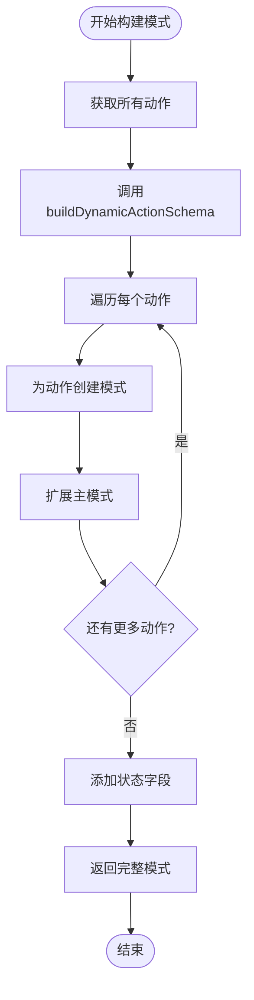

**图表来源**
- [navigator.ts](file://chrome-extension/src/background/agent/agents/navigator.ts#L70-L86)
- [builder.ts](file://chrome-extension/src/background/agent/actions/builder.ts#L130-L152)

**章节来源**
- [navigator.ts](file://chrome-extension/src/background/agent/agents/navigator.ts#L31-L86)
- [builder.ts](file://chrome-extension/src/background/agent/actions/builder.ts#L130-L152)

## Zod模式构建与JSON Schema转换

Navigator智能体使用Zod库构建强类型模式，并通过convertZodToJsonSchema方法将其转换为LLM可用的JSON Schema格式。

### 模式构建过程

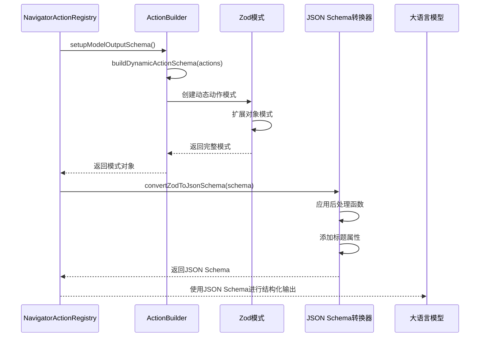

**图表来源**
- [navigator.ts](file://chrome-extension/src/background/agent/agents/navigator.ts#L86-L90)
- [utils.ts](file://chrome-extension/src/background/utils.ts#L100-L127)

### JSON Schema转换特性

转换过程包含以下关键特性：

1. **标题自动添加**: 为每个属性添加人类可读的标题
2. **嵌套结构处理**: 递归处理复杂嵌套结构
3. **条件模式支持**: 支持oneOf、anyOf、allOf等条件模式
4. **OpenAPI兼容**: 转换为目标为OpenAPI 3.0格式

**章节来源**
- [utils.ts](file://chrome-extension/src/background/utils.ts#L100-L127)
- [navigator.ts](file://chrome-extension/src/background/agent/agents/navigator.ts#L86-L90)

## execute方法执行流程

NavigatorAgent的execute方法是整个系统的核心执行引擎，负责协调消息处理、状态管理、动作执行和结果处理。

### 执行流程架构

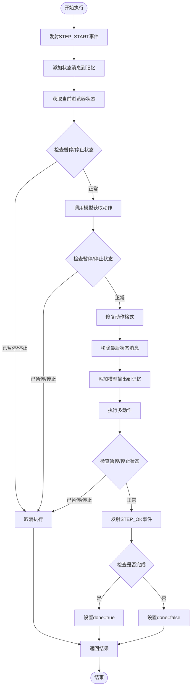

**图表来源**
- [navigator.ts](file://chrome-extension/src/background/agent/agents/navigator.ts#L128-L250)

### 状态消息管理

状态消息管理是Navigator智能体的重要功能，确保LLM能够理解当前的执行上下文：

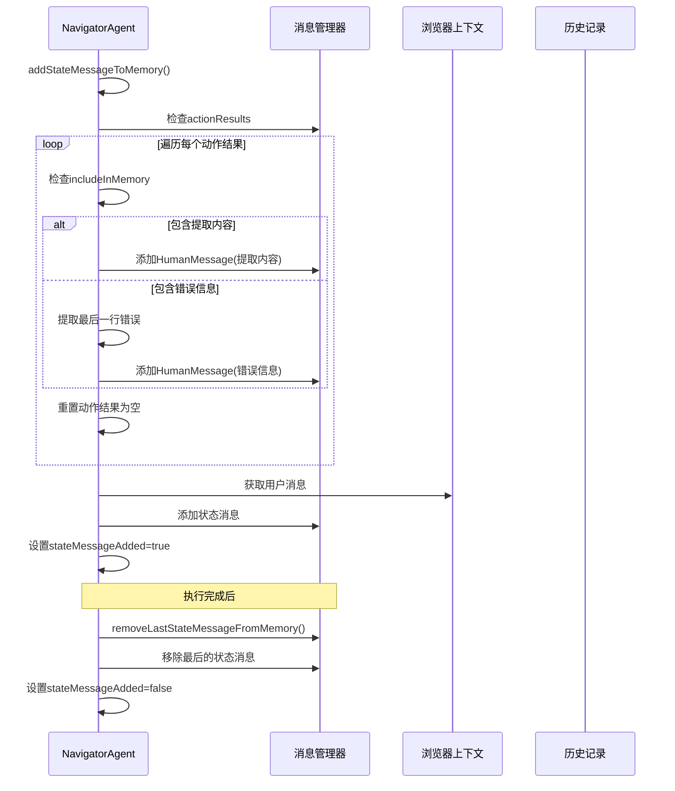

**图表来源**
- [navigator.ts](file://chrome-extension/src/background/agent/agents/navigator.ts#L252-L310)

### 动作执行机制

doMultiAction方法负责执行一系列动作，并处理执行过程中的各种异常情况：

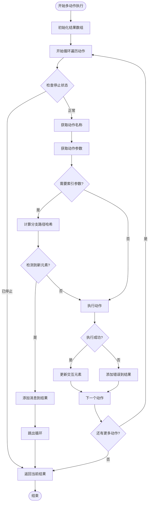

**图表来源**
- [navigator.ts](file://chrome-extension/src/background/agent/agents/navigator.ts#L400-L520)

**章节来源**
- [navigator.ts](file://chrome-extension/src/background/agent/agents/navigator.ts#L128-L250)
- [navigator.ts](file://chrome-extension/src/background/agent/agents/navigator.ts#L400-L520)

## 历史回放机制

Navigator智能体的回放机制是其强大功能的核心，允许系统在页面结构发生变化时重新执行之前的操作序列。

### 回放执行流程

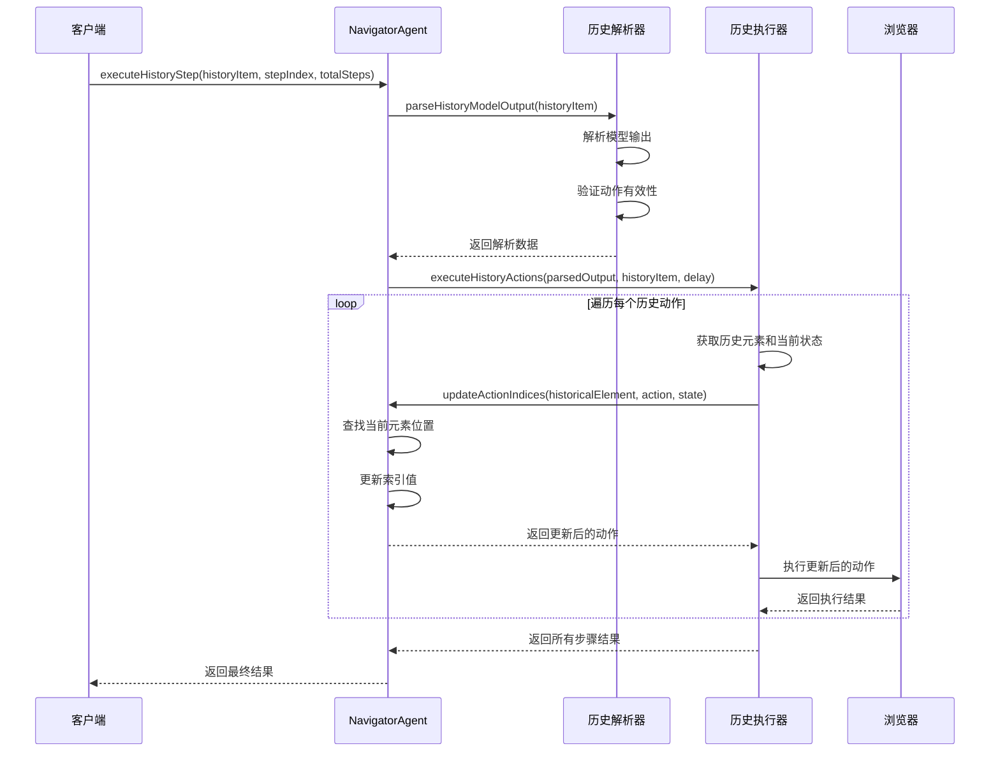

**图表来源**
- [navigator.ts](file://chrome-extension/src/background/agent/agents/navigator.ts#L522-L610)

### 历史数据结构

历史回放依赖于AgentStepRecord结构来存储执行信息：

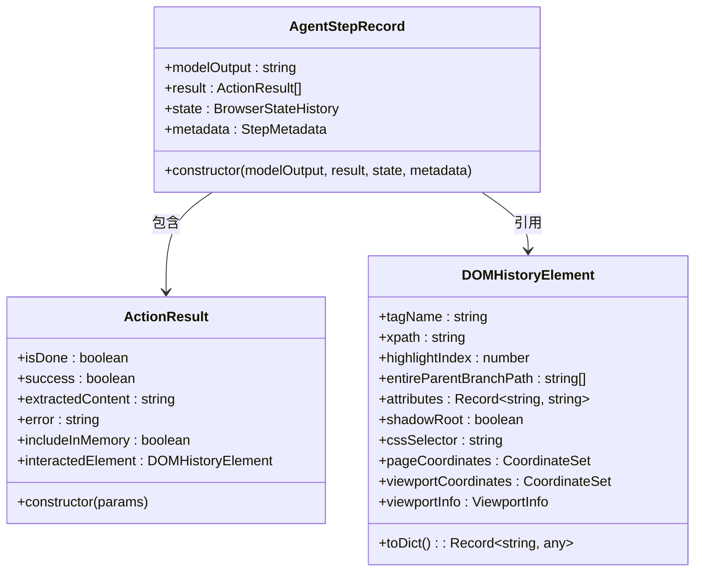

**图表来源**
- [history.ts](file://chrome-extension/src/background/agent/history.ts#L4-L29)
- [view.ts](file://chrome-extension/src/background/browser/dom/history/view.ts#L35-L63)

**章节来源**
- [navigator.ts](file://chrome-extension/src/background/agent/agents/navigator.ts#L522-L610)
- [history.ts](file://chrome-extension/src/background/agent/history.ts#L4-L29)

## 动作索引更新机制

当页面结构发生变化时，Navigator智能体会自动更新动作中的元素索引，确保操作的准确性。

### 索引更新算法

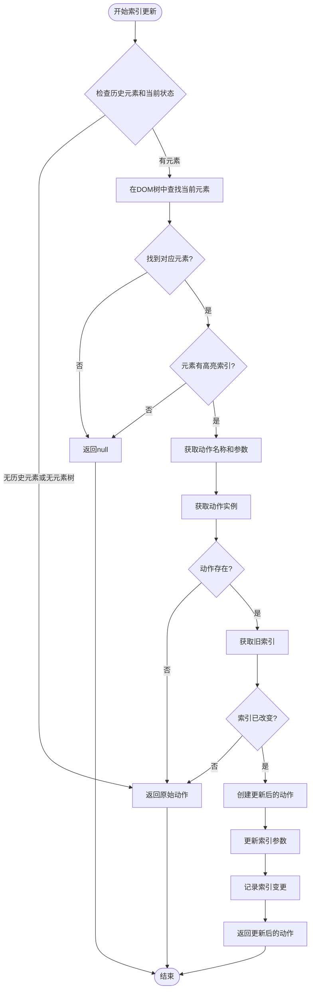

**图表来源**
- [navigator.ts](file://chrome-extension/src/background/agent/agents/navigator.ts#L614-L666)

### DOM历史元素匹配

索引更新依赖于强大的DOM历史元素匹配机制：

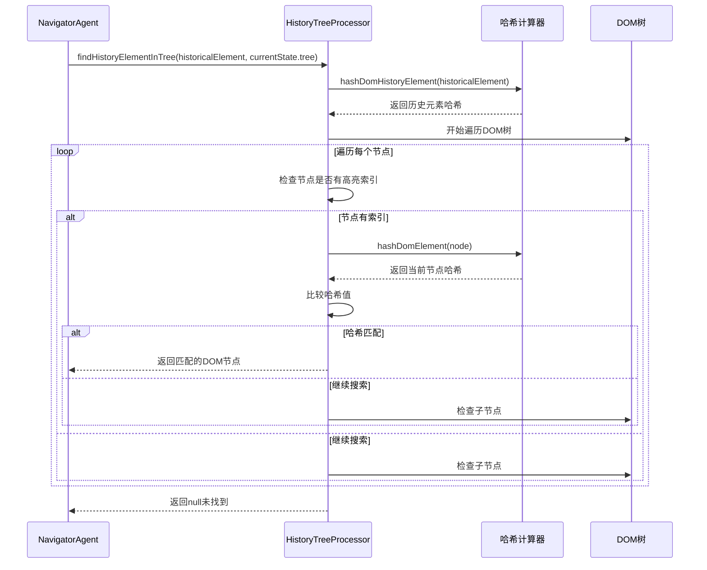

**图表来源**
- [service.ts](file://chrome-extension/src/background/browser/dom/history/service.ts#L20-L74)

**章节来源**
- [navigator.ts](file://chrome-extension/src/background/agent/agents/navigator.ts#L614-L666)
- [service.ts](file://chrome-extension/src/background/browser/dom/history/service.ts#L20-L74)

## 错误处理与重试策略

Navigator智能体实现了完善的错误处理和重试机制，确保在面对各种异常情况时能够优雅地恢复。

### 错误分类处理

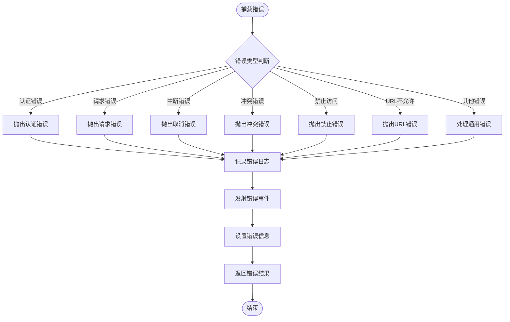

**图表来源**
- [navigator.ts](file://chrome-extension/src/background/agent/agents/navigator.ts#L280-L320)

### 动作执行重试机制

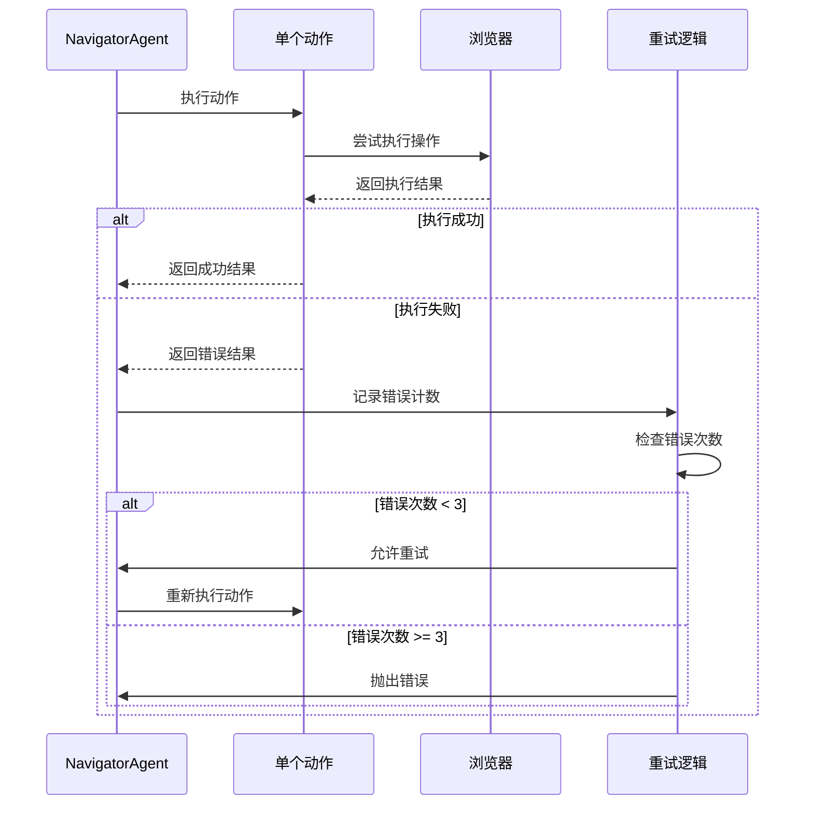

**图表来源**
- [navigator.ts](file://chrome-extension/src/background/agent/agents/navigator.ts#L480-L520)

### JSON格式修复机制

Navigator智能体还具备强大的JSON格式修复能力，能够处理LLM输出中的格式错误：

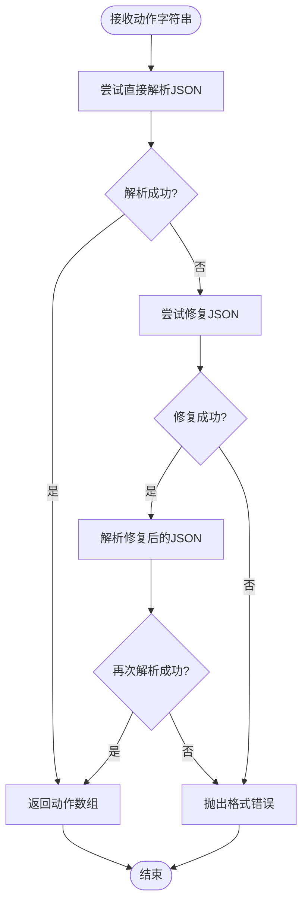

**图表来源**
- [navigator.ts](file://chrome-extension/src/background/agent/agents/navigator.ts#L350-L390)
- [utils.ts](file://chrome-extension/src/background/utils.ts#L30-L50)

**章节来源**
- [navigator.ts](file://chrome-extension/src/background/agent/agents/navigator.ts#L280-L320)
- [navigator.ts](file://chrome-extension/src/background/agent/agents/navigator.ts#L350-L390)
- [utils.ts](file://chrome-extension/src/background/utils.ts#L30-L50)

## 性能优化考虑

Navigator智能体在设计时充分考虑了性能优化，采用了多种策略来提高执行效率和稳定性。

### 并发控制策略

1. **异步操作**: 所有I/O操作都采用异步方式，避免阻塞主线程
2. **Promise链**: 使用Promise链来管理复杂的异步流程
3. **超时控制**: 为长时间运行的操作设置合理的超时时间

### 内存管理优化

1. **状态快照**: 只在必要时保存浏览器状态快照
2. **历史清理**: 及时清理不需要的历史记录
3. **对象复用**: 复用ActionResult对象以减少内存分配

### 网络请求优化

1. **批量操作**: 将多个相关的DOM操作合并执行
2. **缓存机制**: 缓存频繁访问的DOM元素信息
3. **延迟加载**: 按需加载非关键的DOM信息

### 执行效率提升

1. **索引预计算**: 在执行前预先计算必要的索引信息
2. **增量更新**: 只更新发生变化的部分
3. **智能等待**: 根据操作类型调整等待时间

## 总结

Navigator智能体是一个高度复杂且精密设计的自动化系统，它成功地将LLM推理能力与浏览器自动化技术相结合。通过其独特的架构设计，包括动态动作注册、智能历史回放、自动索引更新等核心功能，Navigator智能体能够在复杂的网页环境中实现可靠的自动化操作。

### 核心优势

1. **动态适应性**: 通过动态注册机制，系统能够灵活适应不同的操作需求
2. **容错能力强**: 完善的错误处理和重试机制确保系统稳定性
3. **智能恢复**: 历史回放和索引更新机制使系统能够应对页面变化
4. **类型安全**: 基于Zod的强类型验证确保数据完整性
5. **可扩展性**: 模块化的架构设计便于功能扩展

### 技术创新点

1. **混合模式执行**: 结合结构化输出和手动JSON提取两种执行方式
2. **智能索引映射**: 自动处理DOM元素索引的变化
3. **历史感知回放**: 基于历史数据的智能操作恢复
4. **多层验证机制**: 从输入到输出的全方位验证体系

Navigator智能体代表了现代浏览器自动化技术的发展方向，为构建更加智能和可靠的自动化系统提供了宝贵的参考价值。