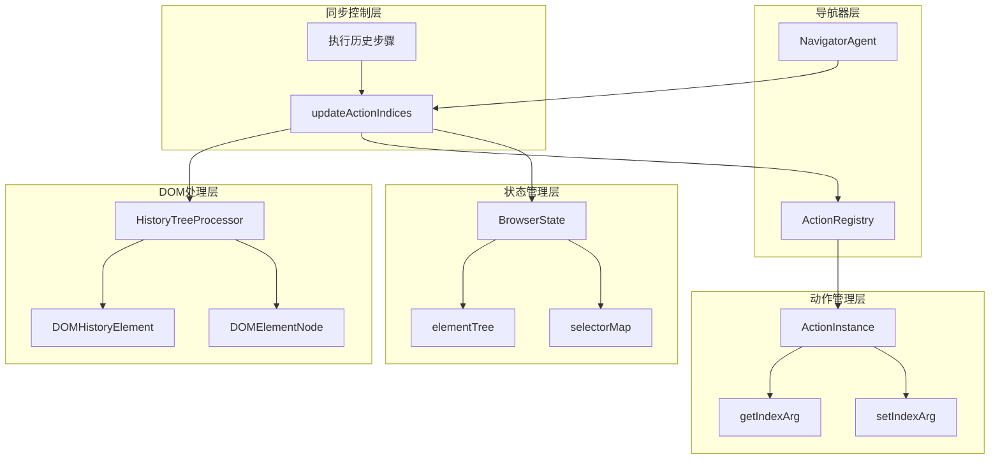
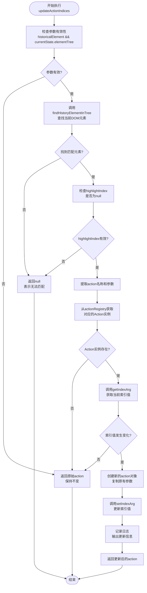
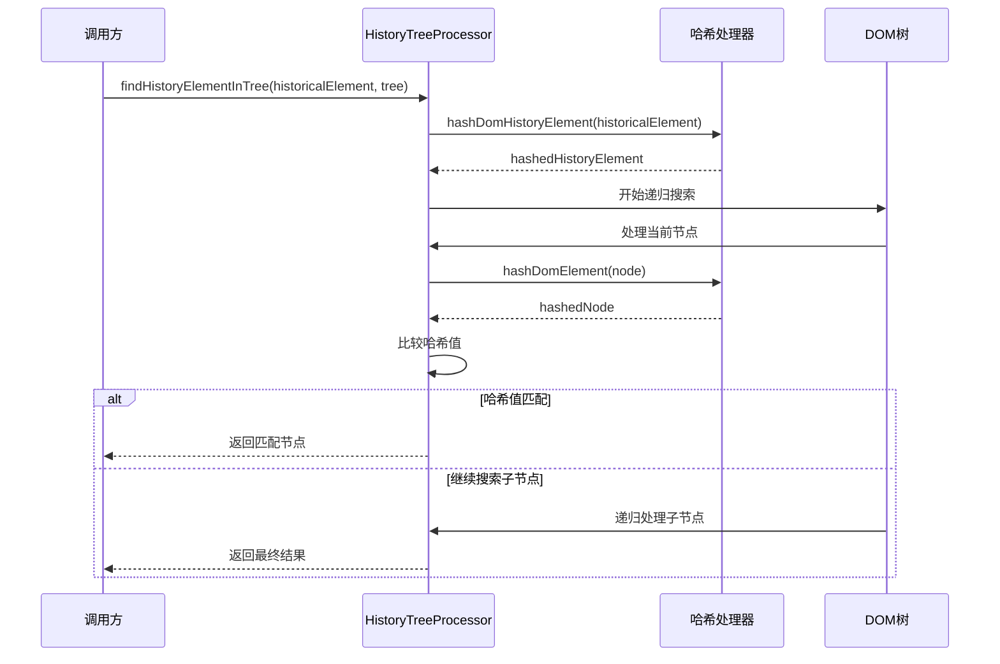
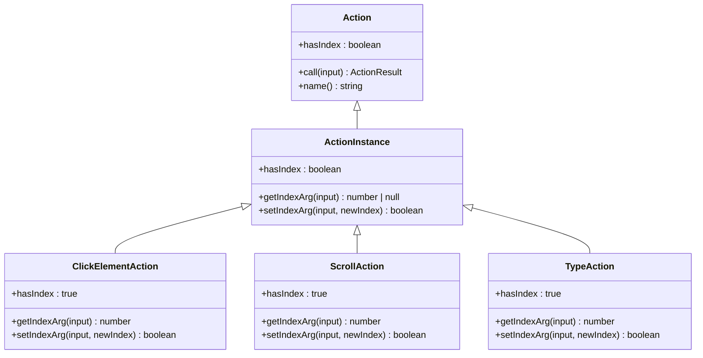
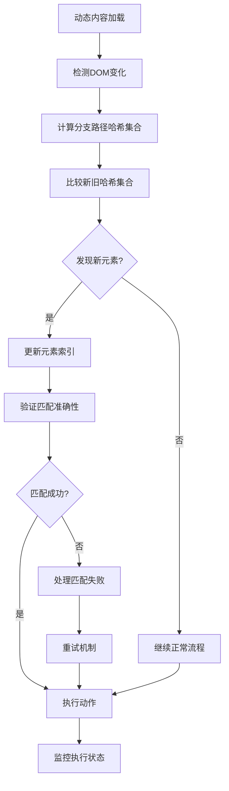
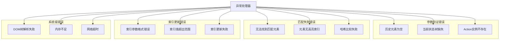
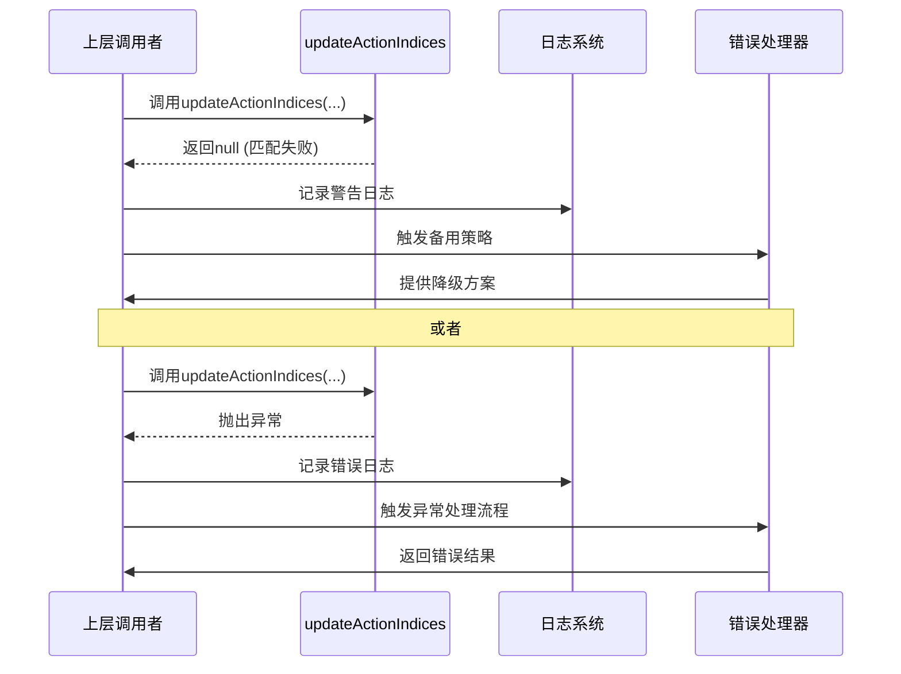
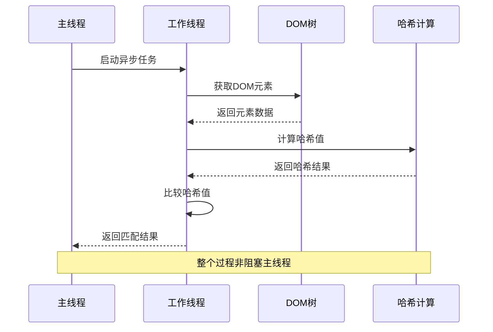

# 元素索引同步机制

<cite>
**本文档引用的文件**
- [navigator.ts](file://chrome-extension/src/background/agent/agents/navigator.ts)
- [service.ts](file://chrome-extension/src/background/browser/dom/history/service.ts)
- [view.ts](file://chrome-extension/src/background/browser/dom/history/view.ts)
- [builder.ts](file://chrome-extension/src/background/agent/actions/builder.ts)
- [schemas.ts](file://chrome-extension/src/background/agent/actions/schemas.ts)
- [views.ts](file://chrome-extension/src/background/browser/dom/views.ts)
- [views.ts](file://chrome-extension/src/background/browser/views.ts)
</cite>

## 目录
1. [概述](#概述)
2. [核心架构](#核心架构)
3. [updateActionIndices方法详解](#updateactionindices方法详解)
4. [HistoryTreeProcessor核心功能](#historytreeprocessor核心功能)
5. [索引参数管理](#索引参数管理)
6. [动态内容加载场景](#动态内容加载场景)
7. [异常处理策略](#异常处理策略)
8. [性能优化考虑](#性能优化考虑)
9. [最佳实践指南](#最佳实践指南)
10. [总结](#总结)

## 概述

元素索引同步机制是NanoBrowser系统中确保自动化操作在DOM结构发生变化时仍能正确执行的关键组件。该机制通过`updateActionIndices`方法实现了历史记录中的元素索引与当前DOM树中对应元素的智能同步，有效解决了动态内容加载、页面刷新等场景下元素位置变动导致的操作失效问题。

该系统的核心价值在于：
- **鲁棒性保障**：即使DOM结构发生显著变化，也能维持自动化操作的连续性
- **智能匹配**：基于多维度特征的元素识别算法，确保精确匹配
- **异常容错**：完善的错误处理机制，保证系统稳定性
- **性能优化**：异步处理和缓存机制，提升响应速度

## 核心架构

元素索引同步机制采用分层架构设计，包含以下核心组件：



**图表来源**
- [navigator.ts](file://chrome-extension/src/background/agent/agents/navigator.ts#L614-L664)
- [service.ts](file://chrome-extension/src/background/browser/dom/history/service.ts#L164-L174)

**章节来源**
- [navigator.ts](file://chrome-extension/src/background/agent/agents/navigator.ts#L614-L664)
- [service.ts](file://chrome-extension/src/background/browser/dom/history/service.ts#L164-L174)

## updateActionIndices方法详解

`updateActionIndices`方法是整个索引同步机制的核心入口点，负责协调各个组件完成元素索引的更新工作。

### 方法签名与输入参数

该方法接收三个关键参数：
- `historicalElement`: 历史记录中的DOM元素描述
- `action`: 待更新的动作对象
- `currentState`: 当前浏览器状态

### 执行流程图



**图表来源**
- [navigator.ts](file://chrome-extension/src/background/agent/agents/navigator.ts#L617-L664)

### 关键实现细节

#### 参数验证阶段
方法首先进行严格的参数验证，确保历史元素和当前状态树都存在。如果任一条件不满足，直接返回原始动作对象，保持其不变。

#### 元素匹配阶段
通过`HistoryTreeProcessor.findHistoryElementInTree`方法，在当前DOM树中寻找与历史元素匹配的节点。该过程采用多维度哈希比较算法，确保匹配的准确性。

#### 索引同步逻辑
只有当检测到索引值确实发生变化时，才会触发更新操作。这种设计避免了不必要的修改，提高了系统的效率。

**章节来源**
- [navigator.ts](file://chrome-extension/src/background/agent/agents/navigator.ts#L617-L664)

## HistoryTreeProcessor核心功能

`HistoryTreeProcessor`是一个专门的工具模块，提供了完整的DOM元素匹配和索引同步功能。

### findHistoryElementInTree方法

这是元素匹配的核心算法，采用递归深度优先搜索策略：



**图表来源**
- [service.ts](file://chrome-extension/src/background/browser/dom/history/service.ts#L25-L74)

### 哈希比较机制

系统采用三重哈希比较确保元素匹配的准确性：

1. **分支路径哈希**：基于元素在DOM树中的位置路径
2. **属性哈希**：基于元素的所有属性组合
3. **XPath哈希**：基于元素的XPath表达式

这种多维度比较策略能够有效应对元素属性变化、位置调整等情况。

### 核心数据结构

#### DOMHistoryElement
历史元素的标准化表示，包含：
- 标签名称和XPath
- 高亮索引
- 父级分支路径
- 属性集合
- 坐标信息

#### HashedDomElement
哈希化后的DOM元素标识，包含三个独立的哈希值用于快速比较。

**章节来源**
- [service.ts](file://chrome-extension/src/background/browser/dom/history/service.ts#L25-L174)
- [view.ts](file://chrome-extension/src/background/browser/dom/history/view.ts#L1-L63)

## 索引参数管理

索引参数管理是元素索引同步机制的重要组成部分，通过`ActionInstance`类提供统一的索引访问接口。

### ActionInstance架构

每个动作都有对应的`ActionInstance`，它继承自基础`Action`类，支持索引参数的获取和设置：



**图表来源**
- [builder.ts](file://chrome-extension/src/background/agent/actions/builder.ts#L33-L152)

### getIndexArg方法实现

该方法负责从动作参数中提取索引值：

```typescript
getIndexArg(input: unknown): number | null {
    if (!this.hasIndex) {
        return null;
    }
    if (input && typeof input === 'object' && 'index' in input) {
        return (input as { index: number }).index;
    }
    return null;
}
```

### setIndexArg方法实现

该方法负责更新动作参数中的索引值：

```typescript
setIndexArg(input: unknown, newIndex: number): boolean {
    if (!this.hasIndex) {
        return false;
    }
    if (input && typeof input === 'object') {
        (input as { index: number }).index = newIndex;
        return true;
    }
    return false;
}
```

### 支持的索引动作类型

系统支持多种需要索引参数的动作：

| 动作类型 | 索引用途 | 参数结构 |
|---------|---------|---------|
| click_element | 点击指定元素 | `{index: number, intent?: string, xpath?: string}` |
| input_text | 在指定输入框输入文本 | `{index: number, text: string, intent?: string, xpath?: string}` |
| scroll_to_percent | 滚动到指定百分比位置 | `{yPercent: number, index?: number, intent?: string}` |
| scroll_to_top | 滚动到顶部 | `{index?: number, intent?: string}` |
| scroll_to_bottom | 滚动到底部 | `{index?: number, intent?: string}` |
| previous_page | 上一页滚动 | `{index?: number, intent?: string}` |
| next_page | 下一页滚动 | `{index?: number, intent?: string}` |

**章节来源**
- [builder.ts](file://chrome-extension/src/background/agent/actions/builder.ts#L73-L152)
- [schemas.ts](file://chrome-extension/src/background/agent/actions/schemas.ts#L40-L180)

## 动态内容加载场景

动态内容加载是现代Web应用的常见特性，元素索引同步机制需要在这种复杂场景下保持稳定运行。

### 动态加载挑战

动态内容加载可能引发以下问题：
- **元素重新排列**：新内容插入导致现有元素位置变化
- **索引重置**：DOM结构重组可能导致索引值失效
- **延迟加载**：部分内容需要等待异步加载完成
- **虚拟滚动**：大量数据采用虚拟化渲染技术

### 同步策略

系统采用多层次的同步策略应对这些挑战：



**图表来源**
- [navigator.ts](file://chrome-extension/src/background/agent/agents/navigator.ts#L530-L580)

### 实际应用场景

#### 场景1：分页加载
用户浏览长列表时，系统会检测到新元素的出现，并自动更新相关动作的索引。

#### 场景2：无限滚动
随着页面滚动，新内容不断加载，系统通过哈希比较确保索引的准确性。

#### 场景3：AJAX请求
异步数据加载完成后，系统重新构建DOM树并同步索引。

**章节来源**
- [navigator.ts](file://chrome-extension/src/background/agent/agents/navigator.ts#L530-L580)

## 异常处理策略

元素索引同步机制包含完善的异常处理策略，确保系统在各种异常情况下都能保持稳定运行。

### 错误分类与处理

系统将可能出现的异常分为以下几类：



### 返回机制设计

不同类型的错误采用不同的返回策略：

| 错误类型 | 返回值 | 处理策略 |
|---------|-------|---------|
| 参数无效 | 原始action | 保持原状，避免破坏执行流程 |
| 匹配失败 | null | 标记为不可执行，通知上层处理 |
| Action实例不存在 | 原始action | 忽略索引更新，继续执行 |
| 系统异常 | 抛出异常 | 中断当前步骤，记录错误日志 |

### 上层调用应对方式

当`updateActionIndices`返回null或抛出异常时，上层调用需要采取相应的应对措施：



**图表来源**
- [navigator.ts](file://chrome-extension/src/background/agent/agents/navigator.ts#L617-L664)

### 重试机制

对于临时性的问题（如网络延迟、DOM未完全加载），系统提供重试机制：

```typescript
// 伪代码示例
async function executeWithRetry(action, maxRetries = 3) {
    let lastError;
    for (let i = 0; i < maxRetries; i++) {
        try {
            const result = await updateActionIndices(...);
            if (result !== null) {
                return result;
            }
            lastError = new Error('Element not found');
        } catch (error) {
            lastError = error;
        }
        await new Promise(resolve => setTimeout(resolve, 1000)); // 等待1秒后重试
    }
    throw lastError;
}
```

**章节来源**
- [navigator.ts](file://chrome-extension/src/background/agent/agents/navigator.ts#L617-L664)

## 性能优化考虑

元素索引同步机制在设计时充分考虑了性能因素，采用了多种优化策略。

### 异步处理机制

所有涉及DOM操作和哈希计算的方法都采用异步处理：



### 缓存策略

系统实现了多级缓存机制：

1. **DOM元素缓存**：避免重复的DOM查询操作
2. **哈希值缓存**：缓存已计算的哈希值，减少重复计算
3. **匹配结果缓存**：缓存最近的匹配结果，提高连续操作的性能

### 内存管理

针对大型DOM树，系统采用以下内存优化策略：

- **懒加载**：只在需要时才加载DOM元素的详细信息
- **弱引用**：对不再使用的DOM元素使用弱引用
- **定期清理**：定期清理过期的缓存数据

### 并行处理

对于多个独立的索引同步任务，系统支持并行处理：

```typescript
// 伪代码示例
async function updateMultipleIndices(actions, historicalElements, currentState) {
    const promises = actions.map((action, index) => 
        updateActionIndices(historicalElements[index], action, currentState)
    );
    return await Promise.all(promises);
}
```

**章节来源**
- [service.ts](file://chrome-extension/src/background/browser/dom/history/service.ts#L25-L74)
- [views.ts](file://chrome-extension/src/background/browser/dom/views.ts#L125-L160)

## 最佳实践指南

为了充分发挥元素索引同步机制的优势，开发者应该遵循以下最佳实践：

### 动作设计原则

1. **明确索引需求**：只有真正需要索引参数的动作才应声明`hasIndex: true`
2. **参数验证**：在动作执行前验证索引值的有效性
3. **错误处理**：为索引相关的错误提供清晰的错误消息

### 状态管理建议

1. **及时更新**：在DOM结构发生变化后立即更新浏览器状态
2. **增量同步**：只同步发生变化的部分，避免全量重建
3. **版本控制**：为浏览器状态添加版本号，便于追踪变更

### 调试与监控

1. **日志记录**：在关键步骤添加详细的日志信息
2. **性能监控**：监控索引同步的执行时间和成功率
3. **异常捕获**：捕获并记录所有异常情况

### 测试策略

1. **单元测试**：测试单个动作的索引处理逻辑
2. **集成测试**：测试完整的工作流程
3. **压力测试**：测试在大规模DOM树下的性能表现

## 总结

元素索引同步机制是NanoBrowser系统中确保自动化操作稳定性的关键技术。通过`updateActionIndices`方法的智能索引更新、`HistoryTreeProcessor`的精确元素匹配、以及完善的异常处理策略，该机制能够在各种复杂的Web环境中保持自动化操作的连续性和准确性。

### 核心优势

1. **鲁棒性强**：能够应对DOM结构的各种变化
2. **精度高**：基于多维度哈希比较确保匹配准确性
3. **性能优**：异步处理和缓存机制提升响应速度
4. **扩展性好**：支持新增动作类型的无缝集成

### 应用价值

该机制特别适用于：
- 自动化测试场景
- 用户行为模拟
- 数据采集任务
- 网页交互自动化

通过持续的优化和完善，元素索引同步机制将继续为NanoBrowser系统提供可靠的技术支撑，推动Web自动化技术的发展和应用。