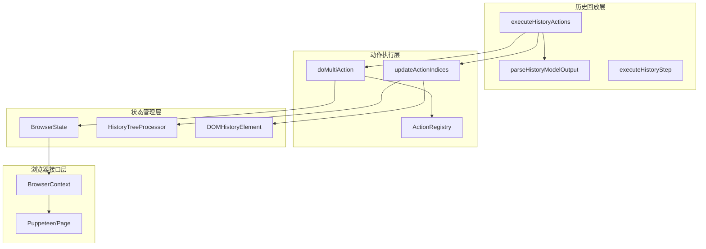
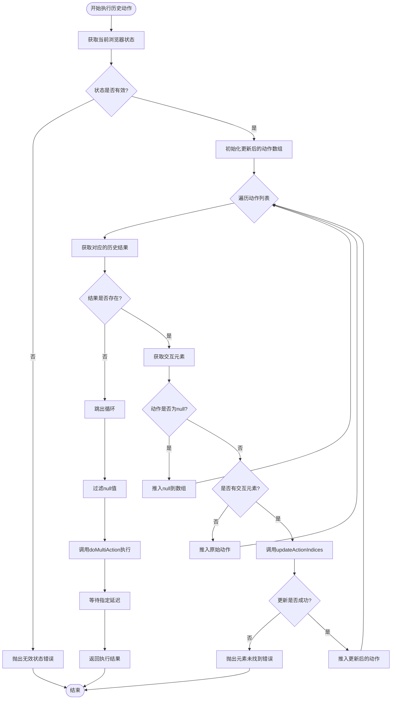
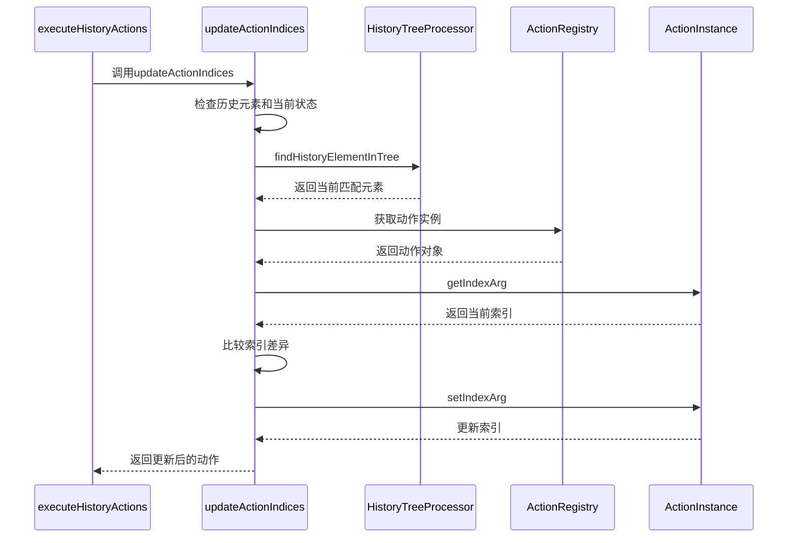
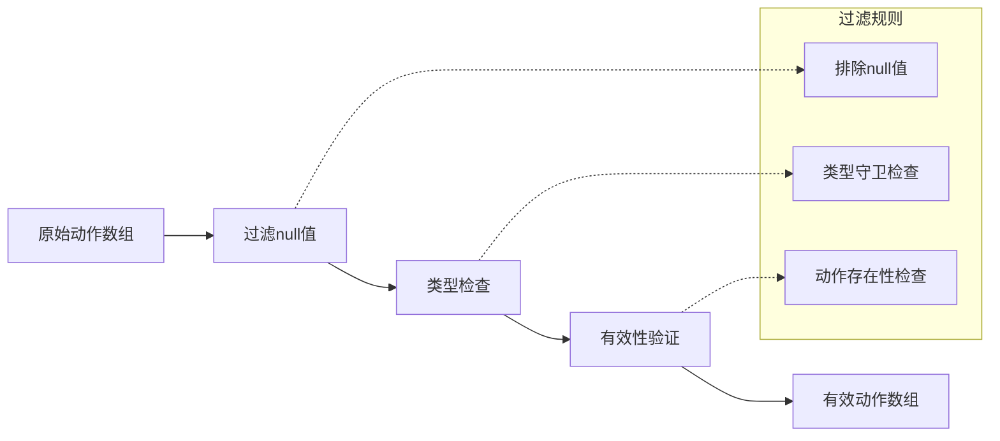
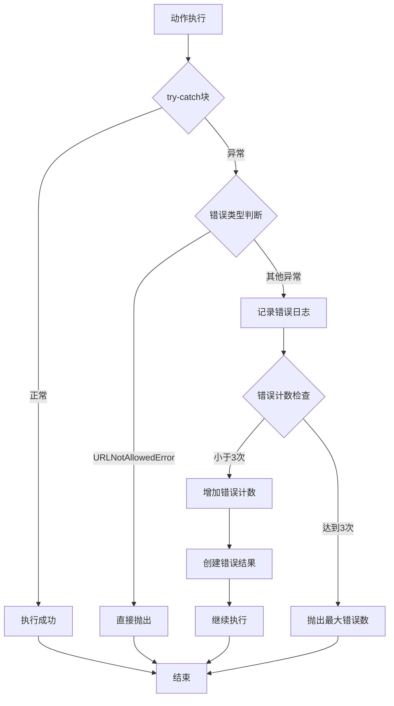

# 历史动作执行流程

<cite>
**本文档中引用的文件**
- [navigator.ts](file://chrome-extension/src/background/agent/agents/navigator.ts)
- [types.ts](file://chrome-extension/src/background/agent/types.ts)
- [history.ts](file://chrome-extension/src/background/agent/history.ts)
- [view.ts](file://chrome-extension/src/background/browser/dom/history/view.ts)
- [service.ts](file://chrome-extension/src/background/browser/dom/history/service.ts)
- [views.ts](file://chrome-extension/src/background/browser/dom/views.ts)
- [context.ts](file://chrome-extension/src/background/browser/context.ts)
</cite>

## 目录
1. [简介](#简介)
2. [核心架构概述](#核心架构概述)
3. [executeHistoryActions方法详解](#executehistoryactions方法详解)
4. [交互元素索引更新机制](#交互元素索引更新机制)
5. [动作过滤与验证](#动作过滤与验证)
6. [延迟控制机制](#延迟控制机制)
7. [性能优化策略](#性能优化策略)
8. [错误处理与重试机制](#错误处理与重试机制)
9. [最佳实践建议](#最佳实践建议)
10. [总结](#总结)

## 简介

`executeHistoryActions`方法是纳米浏览器扩展中历史回放功能的核心组件，负责将解析后的动作指令与当前浏览器状态进行匹配和执行。该方法通过智能的元素索引更新机制，确保在页面结构发生变化时仍能准确执行历史动作，同时提供了完善的错误处理和性能优化机制。

## 核心架构概述

系统采用分层架构设计，主要包含以下核心组件：



**图表来源**
- [navigator.ts](file://chrome-extension/src/background/agent/agents/navigator.ts#L488-L536)
- [types.ts](file://chrome-extension/src/background/agent/types.ts#L111-L127)
- [history.ts](file://chrome-extension/src/background/agent/history.ts#L3-L20)

## executeHistoryActions方法详解

### 方法签名与输入参数

`executeHistoryActions`方法接收三个关键参数：
- `parsedOutput`: 解析后的模型输出，包含目标状态和动作列表
- `historyItem`: 历史记录项，包含原始模型输出和执行结果
- `delay`: 动作间的等待延迟时间

### 执行流程图



**图表来源**
- [navigator.ts](file://chrome-extension/src/background/agent/agents/navigator.ts#L488-L536)

### 关键实现细节

该方法的核心逻辑包括以下几个步骤：

1. **状态验证**: 首先验证当前浏览器状态的有效性
2. **逐个处理动作**: 对每个历史动作进行处理，检查其对应的交互元素
3. **条件分支处理**: 根据不同的条件（动作是否为null、是否有交互元素）采取不同处理策略
4. **批量执行**: 将所有有效的动作收集后统一执行
5. **延迟控制**: 在执行完成后等待指定的时间间隔

**章节来源**
- [navigator.ts](file://chrome-extension/src/background/agent/agents/navigator.ts#L488-L536)

## 交互元素索引更新机制

### interactedElement的作用

`interactedElement`是历史回放过程中的关键概念，它代表了在历史执行过程中用户实际交互过的DOM元素。该元素包含了丰富的元数据信息，用于在当前页面中定位和匹配对应的元素。

### updateActionIndices方法详解

`updateActionIndices`方法负责根据历史交互元素更新动作中的索引参数：



**图表来源**
- [navigator.ts](file://chrome-extension/src/background/agent/agents/navigator.ts#L617-L664)
- [service.ts](file://chrome-extension/src/background/browser/dom/history/service.ts#L15-L30)

### 元素匹配算法

系统使用基于哈希的元素匹配算法来确保准确性：

1. **分支路径哈希**: 基于元素的父级路径计算哈希值
2. **属性哈希**: 基于元素属性集合计算哈希值  
3. **XPath哈希**: 基于XPath表达式计算哈希值

这些多维度的哈希值组合确保了即使在页面结构发生变化时也能准确定位元素。

**章节来源**
- [navigator.ts](file://chrome-extension/src/background/agent/agents/navigator.ts#L617-L664)
- [service.ts](file://chrome-extension/src/background/browser/dom/history/service.ts#L76-L115)

## 动作过滤与验证

### validActions过滤机制

在执行历史动作之前，系统会通过严格的过滤机制确保动作的有效性：



**图表来源**
- [navigator.ts](file://chrome-extension/src/background/agent/agents/navigator.ts#L520-L525)

### doMultiAction协作关系

`doMultiAction`方法与`executeHistoryActions`紧密协作，共同完成动作的执行：

1. **预处理阶段**: `executeHistoryActions`负责索引更新和动作过滤
2. **执行阶段**: `doMultiAction`负责具体的动作执行和结果收集
3. **状态同步**: 两个方法共享相同的浏览器上下文和状态管理

**章节来源**
- [navigator.ts](file://chrome-extension/src/background/agent/agents/navigator.ts#L353-L446)

## 延迟控制机制

### delay参数的实际应用

`delay`参数在历史回放过程中起到关键的节奏控制作用：

1. **防止过度加载**: 控制动作执行的频率，避免对浏览器造成过大压力
2. **模拟真实用户行为**: 创建更自然的执行节奏
3. **资源释放时机**: 给予浏览器足够的时间处理前一个动作

### 实现机制

延迟控制通过`setTimeout`实现，确保在动作执行完成后等待指定时间：

```typescript
// 等待指定延迟
await new Promise(resolve => setTimeout(resolve, delay));
```

这种异步等待机制不会阻塞主线程，保证了系统的响应性。

**章节来源**
- [navigator.ts](file://chrome-extension/src/background/agent/agents/navigator.ts#L533-L536)

## 性能优化策略

### 避免频繁重试的建议

为了避免因频繁重试导致的用户体验下降，系统采用了多层次的优化策略：

1. **智能重试机制**: 最多重试3次，超过限制后停止重试
2. **指数退避**: 后续重试等待时间递增
3. **失败跳过**: 可配置是否跳过失败的动作继续执行

### 内存管理优化

系统在处理大量历史记录时采用以下内存优化策略：

1. **按需加载**: 只在需要时解析和处理历史数据
2. **及时清理**: 执行完成后立即清理临时数据
3. **弱引用**: 对大型对象使用弱引用避免内存泄漏

### 并发控制

通过以下机制控制并发执行：

1. **队列管理**: 动作按顺序执行，避免竞争条件
2. **状态锁定**: 在执行过程中锁定浏览器状态
3. **异常隔离**: 单个动作的异常不影响其他动作执行

**章节来源**
- [navigator.ts](file://chrome-extension/src/background/agent/agents/navigator.ts#L540-L585)

## 错误处理与重试机制

### 多层次错误处理

系统实现了完整的错误处理链：



**图表来源**
- [navigator.ts](file://chrome-extension/src/background/agent/agents/navigator.ts#L400-L446)

### 重试策略

系统采用智能重试策略：

1. **最大重试次数**: 默认最多重试3次
2. **延迟等待**: 每次重试前等待指定时间
3. **失败处理**: 可配置是否跳过失败的动作

**章节来源**
- [navigator.ts](file://chrome-extension/src/background/agent/agents/navigator.ts#L540-L585)

## 最佳实践建议

### 开发者指南

1. **合理设置延迟时间**: 根据页面复杂度调整`delay`参数
2. **监控错误率**: 定期检查动作执行的成功率
3. **优化动作序列**: 减少不必要的动作重复
4. **测试页面变化**: 验证在动态页面中的兼容性

### 用户体验优化

1. **进度反馈**: 提供清晰的执行进度指示
2. **中断处理**: 支持用户随时中断执行
3. **错误报告**: 提供详细的错误诊断信息
4. **性能监控**: 监控系统资源使用情况

### 故障排除

当遇到执行问题时，可以按照以下步骤排查：

1. **检查浏览器状态**: 确认当前页面状态与历史记录一致
2. **验证元素可访问性**: 确保目标元素在当前页面中可见
3. **查看日志信息**: 分析详细的执行日志
4. **测试简化场景**: 使用简单的动作序列进行测试

## 总结

`executeHistoryActions`方法是纳米浏览器扩展历史回放功能的核心，它通过智能的元素索引更新、严格的动作过滤、灵活的延迟控制和完善的错误处理机制，确保了历史动作在各种页面变化情况下的准确执行。

该方法的主要优势包括：

1. **鲁棒性强**: 能够处理页面结构变化和元素位置移动
2. **性能优化**: 通过合理的重试机制和延迟控制避免资源浪费
3. **错误处理完善**: 提供多层次的错误捕获和恢复机制
4. **易于调试**: 详细的日志记录和错误报告帮助快速定位问题

通过深入理解这个方法的工作原理，开发者可以更好地利用历史回放功能，构建更加稳定和高效的自动化操作流程。