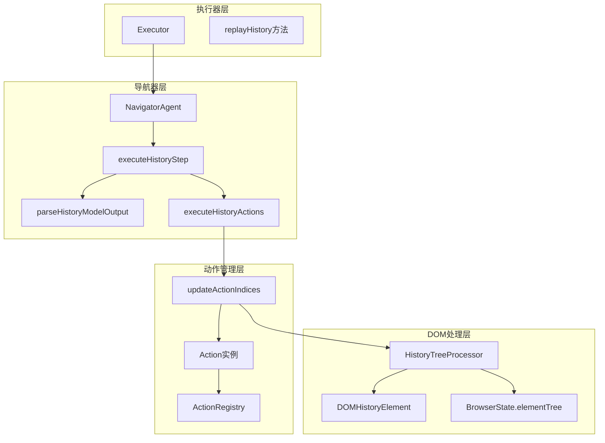
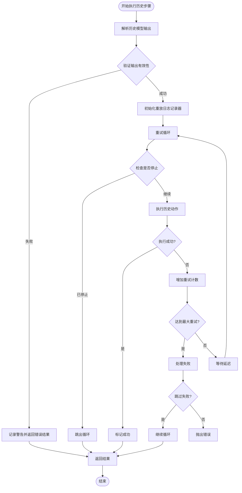
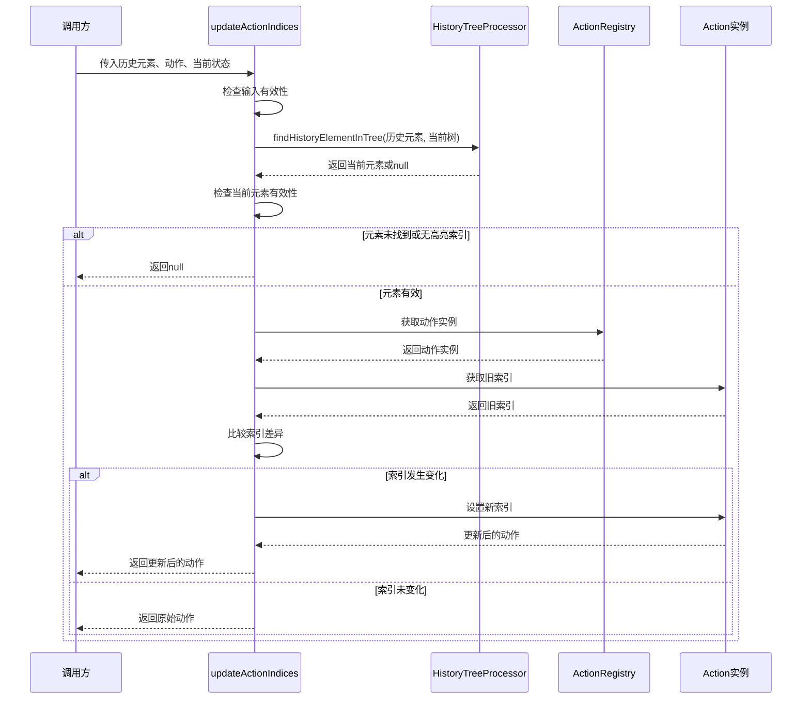
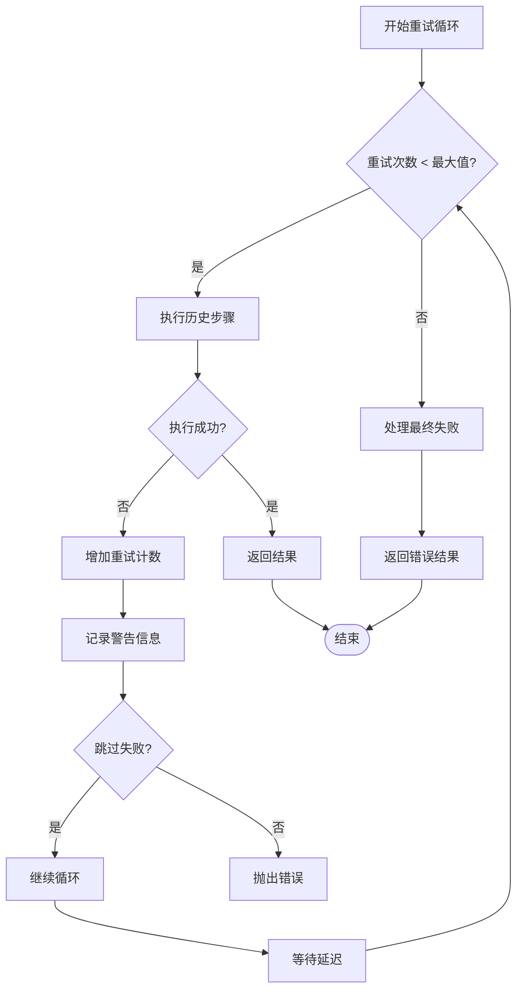
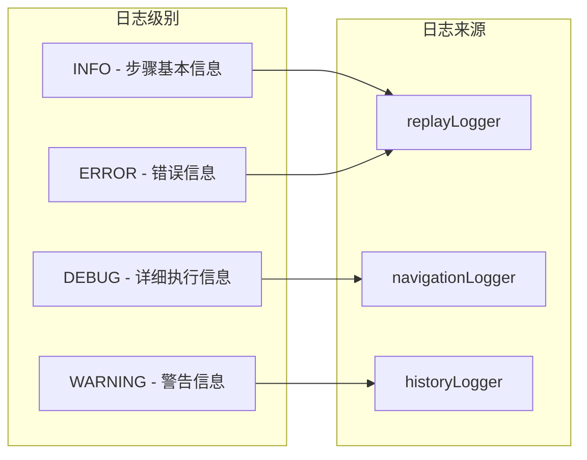

# 历史回放机制

<cite>
**本文档引用的文件**
- [navigator.ts](file://chrome-extension/src/background/agent/agents/navigator.ts)
- [executor.ts](file://chrome-extension/src/background/agent/executor.ts)
- [history.ts](file://chrome-extension/src/background/agent/history.ts)
- [service.ts](file://chrome-extension/src/background/browser/dom/history/service.ts)
- [view.ts](file://chrome-extension/src/background/browser/dom/history/view.ts)
- [views.ts](file://chrome-extension/src/background/browser/dom/views.ts)
- [builder.ts](file://chrome-extension/src/background/agent/actions/builder.ts)
</cite>

## 目录
1. [简介](#简介)
2. [核心架构概述](#核心架构概述)
3. [executeHistoryStep方法详解](#executehistorystep方法详解)
4. [历史模型输出解析](#历史模型输出解析)
5. [动作索引更新机制](#动作索引更新机制)
6. [重试机制与错误处理](#重试机制与错误处理)
7. [调试与监控](#调试与监控)
8. [实际应用场景](#实际应用场景)
9. [最佳实践建议](#最佳实践建议)
10. [总结](#总结)

## 简介

历史回放机制是NanoBrowser系统中一个核心功能，它允许系统重新执行之前保存的用户任务步骤。该机制通过从AgentStepRecord中提取历史模型输出，并通过复杂的DOM树匹配算法确保在页面结构发生变化时仍能准确重现用户操作。

## 核心架构概述

历史回放机制采用分层架构设计，包含以下核心组件：



**图表来源**
- [executor.ts](file://chrome-extension/src/background/agent/executor.ts#L356-L433)
- [navigator.ts](file://chrome-extension/src/background/agent/agents/navigator.ts#L533-L666)
- [service.ts](file://chrome-extension/src/background/browser/dom/history/service.ts#L25-L74)

## executeHistoryStep方法详解

executeHistoryStep是历史回放机制的核心入口点，负责协调整个回放过程。

### 方法签名与参数

该方法接受以下参数：
- `historyItem`: AgentStepRecord对象，包含历史步骤的所有信息
- `stepIndex`: 当前步骤的索引
- `totalSteps`: 总步骤数
- `maxRetries`: 最大重试次数（默认3次）
- `delay`: 延迟时间（毫秒，默认1000ms）
- `skipFailures`: 是否跳过失败而不中断整个回放

### 执行流程



**图表来源**
- [navigator.ts](file://chrome-extension/src/background/agent/agents/navigator.ts#L533-L615)

**章节来源**
- [navigator.ts](file://chrome-extension/src/background/agent/agents/navigator.ts#L533-L615)

## 历史模型输出解析

parseHistoryModelOutput方法负责从AgentStepRecord中提取和验证历史模型输出。

### 解析过程

该方法执行以下步骤：

1. **输入验证**: 检查historyItem.modelOutput是否存在
2. **JSON解析**: 将modelOutput字符串解析为ParsedModelOutput对象
3. **数据提取**: 提取目标步骤的目标(goal)和要重放的动作(actionsToReplay)
4. **有效性验证**: 验证动作列表的有效性

### 输出结构

```typescript
{
  parsedOutput: ParsedModelOutput;
  goal: string;
  actionsToReplay: (Record<string, unknown> | null)[] | null;
}
```

### 错误处理

如果解析过程中出现任何问题，方法会抛出相应的错误，包括：
- "No model output found in history item"
- "Could not parse modelOutput"
- "No action to replay"

**章节来源**
- [navigator.ts](file://chrome-extension/src/background/agent/agents/navigator.ts#L459-L495)

## 动作索引更新机制

updateActionIndices方法是历史回放机制中最复杂和关键的部分，它解决了动态加载内容导致的元素位置变化问题。

### 核心算法



**图表来源**
- [navigator.ts](file://chrome-extension/src/background/agent/agents/navigator.ts#L614-L665)
- [service.ts](file://chrome-extension/src/background/browser/dom/history/service.ts#L25-L74)

### DOM树匹配算法

HistoryTreeProcessor.findHistoryElementInTree使用基于哈希的精确匹配算法：

1. **分支路径哈希**: 对元素的父级分支路径进行SHA-256哈希
2. **属性哈希**: 对元素的所有属性进行组合哈希
3. **XPath哈希**: 对元素的XPath表达式进行哈希
4. **综合比较**: 只有当所有三个哈希值都匹配时才认为元素匹配

### 实际应用场景

#### 场景1：动态加载内容
当页面在回放过程中动态加载新内容时，原有的元素索引可能失效。updateActionIndices会：
- 在当前DOM树中查找对应的新元素
- 如果找到匹配元素，更新动作中的索引
- 如果找不到匹配元素，返回null表示无法执行该动作

#### 场景2：页面滚动
页面滚动可能导致某些元素不再可见，但updateActionIndices仍然可以找到这些元素，因为它是基于DOM结构而非视口位置进行匹配。

**章节来源**
- [navigator.ts](file://chrome-extension/src/background/agent/agents/navigator.ts#L614-L665)
- [service.ts](file://chrome-extension/src/background/browser/dom/history/service.ts#L25-L74)

## 重试机制与错误处理

历史回放机制实现了多层次的重试和错误处理策略。

### 重试配置参数

| 参数 | 默认值 | 描述 |
|------|--------|------|
| maxRetries | 3 | 每个步骤的最大重试次数 |
| delay | 1000ms | 重试之间的延迟时间 |
| skipFailures | true | 是否跳过失败而不中断整个回放 |

### 重试策略



**图表来源**
- [navigator.ts](file://chrome-extension/src/background/agent/agents/navigator.ts#L572-L615)

### 错误分类处理

系统对不同类型的错误采用不同的处理策略：

1. **认证错误**: 立即终止并抛出ChatModelAuthError
2. **请求取消**: 处理用户主动停止的情况
3. **扩展冲突**: 处理与其他扩展的冲突
4. **其他错误**: 进行重试或根据skipFailures参数决定是否继续

**章节来源**
- [navigator.ts](file://chrome-extension/src/background/agent/agents/navigator.ts#L572-L615)
- [executor.ts](file://chrome-extension/src/background/agent/executor.ts#L356-L433)

## 调试与监控

系统提供了完整的调试和监控机制来帮助开发者追踪回放过程中的问题。

### 日志记录系统



### 关键日志信息

1. **步骤级别日志**:
   - 步骤索引和总数
   - 目标描述
   - 动作列表

2. **执行级别日志**:
   - 元素移动检测
   - 索引更新详情
   - 重试尝试记录

3. **错误级别日志**:
   - 解析失败原因
   - 匹配失败详情
   - 最终失败总结

### 调试建议

1. **启用详细日志**: 在开发环境中设置适当的日志级别
2. **监控网络请求**: 观察页面加载和动态内容的变化
3. **检查DOM结构**: 使用浏览器开发者工具验证元素匹配
4. **跟踪索引变化**: 记录元素索引的前后变化情况

**章节来源**
- [navigator.ts](file://chrome-extension/src/background/agent/agents/navigator.ts#L533-L574)
- [executor.ts](file://chrome-extension/src/background/agent/executor.ts#L356-L394)

## 实际应用场景

### 场景1：电商网站购买流程

在电商网站的购买流程中，商品列表可能会动态加载更多产品，或者购物车弹窗会在特定条件下出现。历史回放机制能够：

- 自动适应商品列表的动态增长
- 重新定位购物车相关元素
- 维持整个购买流程的连贯性

### 场景2：社交媒体交互

在社交媒体平台上，用户可能会遇到：
- 新消息的动态插入
- 广告内容的随机出现
- 页面布局的响应式调整

系统能够：
- 忽略新增的广告元素
- 定位真实的用户交互元素
- 保持操作序列的准确性

### 场景3：表单填写

在复杂的表单填写过程中：
- 条件字段的动态显示/隐藏
- 下拉选项的异步加载
- 验证提示的实时更新

系统能够：
- 自适应字段的动态变化
- 重新计算元素索引
- 确保数据正确提交

## 最佳实践建议

### 配置优化

1. **重试参数调优**:
   - 对于稳定的页面，可以减少maxRetries到1-2次
   - 对于动态内容较多的页面，可适当增加到5-10次
   - 根据页面加载速度调整delay参数

2. **错误处理策略**:
   - 生产环境推荐设置skipFailures=true
   - 开发调试阶段可设置skipFailures=false以便及时发现问题

3. **监控指标**:
   - 跟踪重试成功率
   - 监控元素匹配失败率
   - 分析回放完成率

### 开发调试技巧

1. **日志分析**:
   ```javascript
   // 启用详细日志
   const replayLogger = createLogger('NavigatorAgent:executeHistoryStep');
   replayLogger.setLevel('debug');
   ```

2. **断点调试**:
   - 在updateActionIndices方法中设置断点
   - 检查历史元素和当前元素的匹配结果
   - 验证索引更新的正确性

3. **测试策略**:
   - 创建包含各种动态场景的测试用例
   - 模拟网络延迟和页面刷新
   - 验证错误恢复机制的有效性

### 性能优化

1. **DOM树缓存**: 利用HistoryTreeProcessor的哈希机制避免重复计算
2. **批量处理**: 对多个连续步骤使用统一的延迟配置
3. **资源管理**: 及时清理不需要的DOM引用和事件监听器

## 总结

NanoBrowser的历史回放机制是一个高度智能和鲁棒的系统，它通过以下关键技术实现了可靠的页面自动化：

1. **智能索引更新**: 基于DOM结构的精确匹配算法确保了即使在页面动态变化的情况下也能准确定位元素
2. **多层重试机制**: 完善的错误处理和重试策略提高了系统的容错能力
3. **详细的日志记录**: 全面的调试信息帮助开发者快速定位和解决问题
4. **灵活的配置选项**: 可调参数满足不同场景的需求

该机制特别适用于需要处理动态内容和复杂交互的Web应用，为构建可靠的网页自动化解决方案提供了坚实的基础。通过合理配置和持续优化，可以在各种复杂的Web环境中实现稳定可靠的任务回放功能。