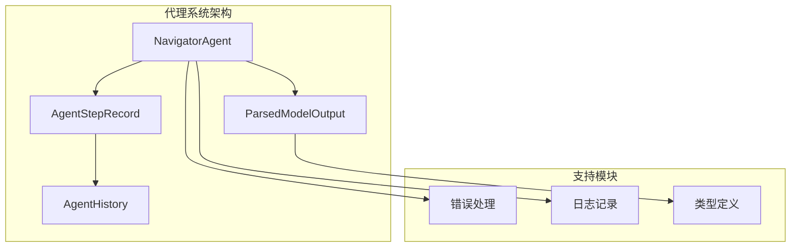
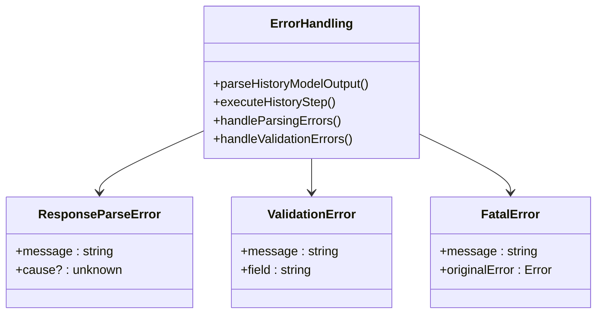
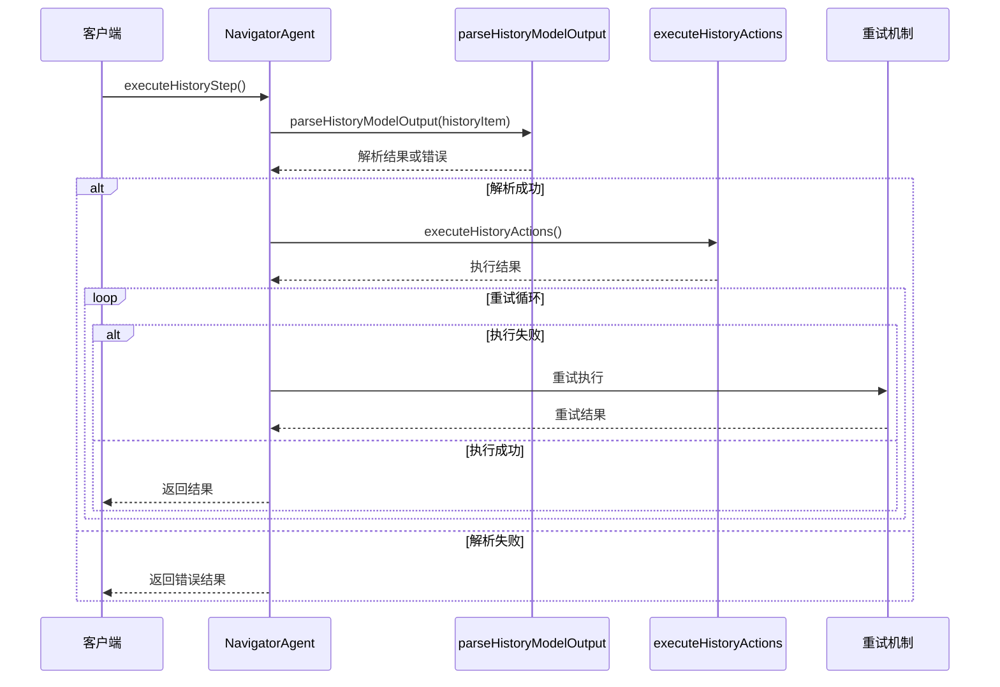
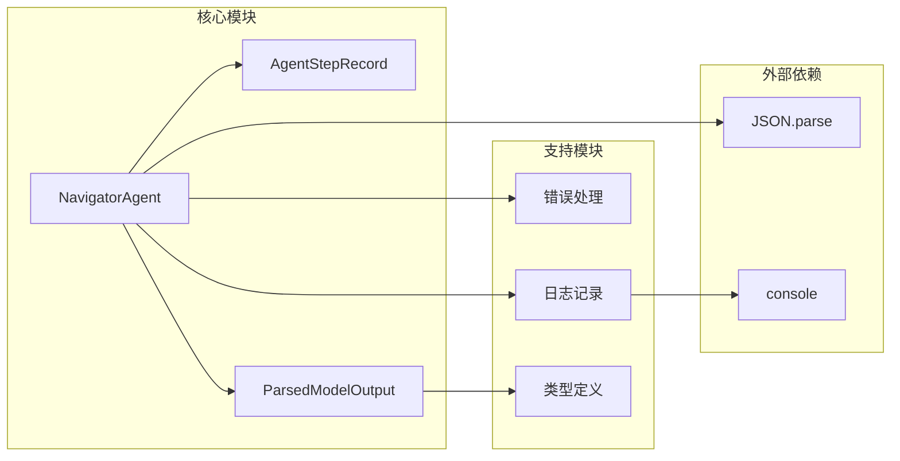

# 历史回放解析机制

<cite>
**本文档引用的文件**
- [navigator.ts](file://chrome-extension/src/background/agent/agents/navigator.ts)
- [history.ts](file://chrome-extension/src/background/agent/history.ts)
- [types.ts](file://chrome-extension/src/background/agent/types.ts)
- [errors.ts](file://chrome-extension/src/background/agent/agents/errors.ts)
- [log.ts](file://chrome-extension/src/background/agent/log.ts)
</cite>

## 目录
1. [简介](#简介)
2. [项目结构概述](#项目结构概述)
3. [核心组件分析](#核心组件分析)
4. [架构概览](#架构概览)
5. [详细组件分析](#详细组件分析)
6. [依赖关系分析](#依赖关系分析)
7. [性能考虑](#性能考虑)
8. [故障排除指南](#故障排除指南)
9. [结论](#结论)

## 简介

NavigatorAgent中的`parseHistoryModelOutput`方法是历史回放功能的核心组件，负责从AgentStepRecord中提取和解析模型输出数据。该方法实现了严格的JSON解析、结构验证和边界情况处理机制，确保历史步骤能够被正确重现。

本文档将深入分析该方法的实现逻辑，包括JSON解析过程、字段提取机制、边界情况处理以及错误处理流程，并提供调试建议和最佳实践指导。

## 项目结构概述

NavigatorAgent位于浏览器扩展的后台代理系统中，负责智能网页导航任务的执行和历史管理。项目采用模块化架构，主要包含以下关键组件：



**图表来源**
- [navigator.ts](file://chrome-extension/src/background/agent/agents/navigator.ts#L33-L38)
- [history.ts](file://chrome-extension/src/background/agent/history.ts#L3-L20)

**章节来源**
- [navigator.ts](file://chrome-extension/src/background/agent/agents/navigator.ts#L1-L50)
- [history.ts](file://chrome-extension/src/background/agent/history.ts#L1-L30)

## 核心组件分析

### ParsedModelOutput接口

`ParsedModelOutput`接口定义了模型输出的标准结构，包含当前状态和动作两个核心字段：

```typescript
interface ParsedModelOutput {
  current_state?: {
    next_goal?: string;
  };
  action?: (Record<string, unknown> | null)[] | null;
}
```

该接口的设计体现了以下特点：
- **可选字段设计**：所有字段都标记为可选，支持部分缺失的情况
- **灵活的动作格式**：支持数组、单个对象或null值
- **类型安全**：使用Record<string, unknown>确保类型安全性

### AgentStepRecord类

AgentStepRecord是历史记录的基本单元，存储单个步骤的所有相关信息：

```typescript
export class AgentStepRecord {
  modelOutput: string | null;
  result: ActionResult[];
  state: BrowserStateHistory;
  metadata?: StepMetadata | null;
}
```

**章节来源**
- [navigator.ts](file://chrome-extension/src/background/agent/agents/navigator.ts#L33-L38)
- [history.ts](file://chrome-extension/src/background/agent/history.ts#L3-L20)

## 架构概览

parseHistoryModelOutput方法在整个历史回放系统中扮演着关键角色，其工作流程如下：

```mermaid
flowchart TD
Start([开始解析]) --> CheckModelOutput{检查modelOutput}
CheckModelOutput --> |为空| ThrowError1[抛出"No model output found"错误]
CheckModelOutput --> |不为空| ParseJSON[尝试JSON解析]
ParseJSON --> ParseSuccess{解析成功?}
ParseSuccess --> |失败| ThrowError2[抛出"Could not parse modelOutput"错误]
ParseSuccess --> |成功| ExtractFields[提取核心字段]
ExtractFields --> ValidateActions{验证动作有效性}
ValidateActions --> |无效| ThrowError3[抛出"No action to replay"错误]
ValidateActions --> |有效| ReturnData[返回解析数据]
ReturnData --> End([结束])
ThrowError1 --> End
ThrowError2 --> End
ThrowError3 --> End
```

**图表来源**
- [navigator.ts](file://chrome-extension/src/background/agent/agents/navigator.ts#L451-L483)

## 详细组件分析

### parseHistoryModelOutput方法实现

#### 方法签名和返回类型

方法接受AgentStepRecord作为输入参数，返回包含三个核心字段的对象：

```typescript
private parseHistoryModelOutput(historyItem: AgentStepRecord): {
  parsedOutput: ParsedModelOutput;
  goal: string;
  actionsToReplay: (Record<string, unknown> | null)[] | null;
}
```

#### 输入验证阶段

方法的第一步是对输入数据进行严格验证：

```typescript
if (!historyItem.modelOutput) {
  throw new Error('No model output found in history item');
}
```

这一验证确保了历史记录中包含有效的modelOutput字段，避免后续解析操作失败。

#### JSON解析阶段

使用标准的JSON.parse方法进行解析，并添加类型断言：

```typescript
let parsedOutput: ParsedModelOutput;
try {
  parsedOutput = JSON.parse(historyItem.modelOutput) as ParsedModelOutput;
} catch (error) {
  throw new Error(`Could not parse modelOutput: ${error}`);
}
```

此阶段的关键特性：
- **异常捕获**：捕获JSON解析过程中可能出现的任何异常
- **错误信息增强**：在错误消息中包含具体的解析错误信息
- **类型断言**：确保解析结果符合预期类型

#### 字段提取过程

从解析后的对象中提取核心字段：

```typescript
const goal = parsedOutput?.current_state?.next_goal || '';
const actionsToReplay = parsedOutput?.action;
```

这种提取方式利用了可选链操作符（?.），确保即使某些字段缺失也不会导致运行时错误。

#### 动作验证机制

这是方法中最复杂的部分，涉及多种边界情况的处理：

```typescript
if (
  !parsedOutput || // No model output string at all
  !actionsToReplay || // 'action' field is missing or null after parsing
  (Array.isArray(actionsToReplay) && actionsToReplay.length === 0) || // 'action' is an empty array
  (Array.isArray(actionsToReplay) && actionsToReplay.length === 1 && actionsToReplay[0] === null) // 'action' is [null]
) {
  throw new Error('No action to replay');
}
```

验证逻辑覆盖了以下场景：
1. **完全缺失**：整个parsedOutput对象不存在
2. **字段缺失**：action字段不存在或为null
3. **空数组**：action是一个空数组
4. **单个null值**：action数组仅包含一个null元素

#### 返回值结构

方法返回一个包含三个核心字段的对象：
- `parsedOutput`：完整的解析后模型输出
- `goal`：当前步骤的目标字符串
- `actionsToReplay`：可用于重放的动作列表

**章节来源**
- [navigator.ts](file://chrome-extension/src/background/agent/agents/navigator.ts#L451-L483)

### 错误处理机制

#### 异常类型和处理策略

系统实现了分层的错误处理机制：



**图表来源**
- [errors.ts](file://chrome-extension/src/background/agent/agents/errors.ts#L280-L314)

#### 日志记录策略

方法中包含了丰富的日志记录点：

```typescript
// logger.info('Parsed output', JSON.stringify(parsedOutput, null, 2));
// logger.info('Interacted element', interactedElement);
// logger.info('Result', result);
```

这些日志点有助于调试和监控，但出于性能考虑，在生产环境中被注释掉了。

**章节来源**
- [navigator.ts](file://chrome-extension/src/background/agent/agents/navigator.ts#L460-L461)
- [errors.ts](file://chrome-extension/src/background/agent/agents/errors.ts#L280-L314)

### 执行历史步骤流程

`executeHistoryStep`方法展示了parseHistoryModelOutput在实际应用中的使用：



**图表来源**
- [navigator.ts](file://chrome-extension/src/background/agent/agents/navigator.ts#L538-L615)

**章节来源**
- [navigator.ts](file://chrome-extension/src/background/agent/agents/navigator.ts#L538-L615)

## 依赖关系分析

### 模块依赖图



**图表来源**
- [navigator.ts](file://chrome-extension/src/background/agent/agents/navigator.ts#L1-L20)
- [history.ts](file://chrome-extension/src/background/agent/history.ts#L1-L10)

### 类型依赖关系

系统中的类型定义形成了清晰的层次结构：

| 类型名称 | 用途 | 依赖关系 |
|---------|------|----------|
| ParsedModelOutput | 定义模型输出结构 | 无直接依赖 |
| AgentStepRecord | 历史记录容器 | 包含ActionResult、BrowserStateHistory |
| ActionResult | 执行结果 | 独立类型 |
| BrowserStateHistory | 浏览器状态历史 | 外部依赖 |

**章节来源**
- [navigator.ts](file://chrome-extension/src/background/agent/agents/navigator.ts#L33-L38)
- [history.ts](file://chrome-extension/src/background/agent/history.ts#L3-L20)

## 性能考虑

### 内存使用优化

1. **延迟解析**：只在需要时才解析JSON字符串
2. **对象复用**：避免创建不必要的中间对象
3. **类型断言**：减少运行时类型检查开销

### 时间复杂度分析

- **JSON解析**：O(n)，其中n是JSON字符串长度
- **字段访问**：O(1)，使用可选链操作符
- **数组验证**：O(m)，其中m是动作数组长度

### 并发处理

方法设计为同步操作，适合在单线程环境中使用。对于大量历史记录的处理，可以考虑异步批处理机制。

## 故障排除指南

### 常见问题和解决方案

#### 1. JSON解析失败

**症状**：抛出"Could not parse modelOutput"错误

**可能原因**：
- modelOutput包含非标准JSON格式
- 字符串中包含特殊字符
- 数据损坏或截断

**调试步骤**：
```typescript
// 启用日志记录
logger.info('原始modelOutput:', historyItem.modelOutput);
```

**解决方案**：
- 检查JSON格式的有效性
- 验证字符串编码
- 确保数据完整性

#### 2. 缺少modelOutput字段

**症状**：抛出"No model output found in history item"错误

**可能原因**：
- 历史记录创建时未正确保存
- 数据库写入失败
- 序列化/反序列化错误

**调试建议**：
```typescript
// 检查历史记录完整性
console.log('历史记录内容:', historyItem);
```

#### 3. 动作验证失败

**症状**：抛出"No action to replay"错误

**可能原因**：
- 动作数组为空
- 动作格式不符合预期
- 数据转换错误

**调试方法**：
```typescript
// 检查解析后的动作
console.log('解析后的动作:', parsedOutput.action);
```

### 调试工具和技巧

#### 日志级别配置

```typescript
// 开发环境启用详细日志
const logger = createLogger('NavigatorAgent:parseHistoryModelOutput');
logger.debug('解析详情:', { parsedOutput, goal, actionsToReplay });
```

#### 错误边界检测

```typescript
// 添加边界检测点
if (!parsedOutput || !parsedOutput.current_state) {
  throw new Error('模型输出结构不完整');
}
```

#### 数据验证工具

```typescript
// 创建数据验证函数
function validateModelOutput(output: any): boolean {
  return output && 
         output.current_state && 
         output.current_state.next_goal !== undefined &&
         Array.isArray(output.action);
}
```

**章节来源**
- [navigator.ts](file://chrome-extension/src/background/agent/agents/navigator.ts#L451-L483)
- [log.ts](file://chrome-extension/src/background/log.ts#L1-L40)

## 结论

`parseHistoryModelOutput`方法展现了现代JavaScript应用程序中错误处理和数据验证的最佳实践。通过严格的输入验证、优雅的错误处理和全面的边界情况处理，该方法确保了历史回放功能的稳定性和可靠性。

### 关键优势

1. **健壮性**：全面的边界情况处理确保了系统的稳定性
2. **可维护性**：清晰的错误分类和日志记录便于维护
3. **性能**：高效的解析算法和内存使用优化
4. **可扩展性**：模块化的设计支持未来的功能扩展

### 最佳实践总结

1. **始终验证输入**：在处理外部数据时，始终进行严格的输入验证
2. **优雅的错误处理**：提供有意义的错误信息和恢复策略
3. **适当的日志记录**：在开发和生产环境中使用合适的日志级别
4. **类型安全**：充分利用TypeScript的类型系统提高代码质量

该方法为浏览器自动化和AI代理系统的历史回放功能提供了坚实的基础，值得在类似项目中借鉴和应用。