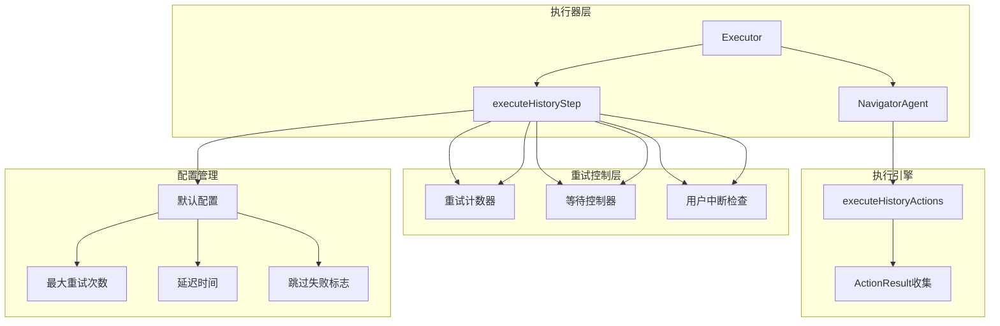
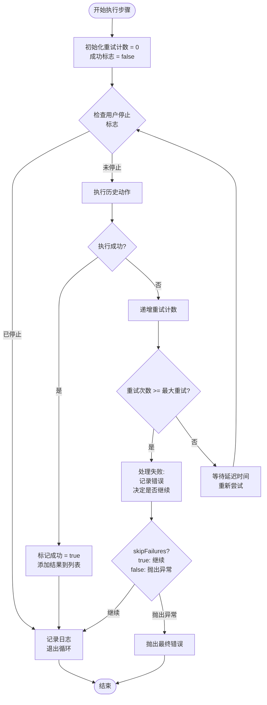
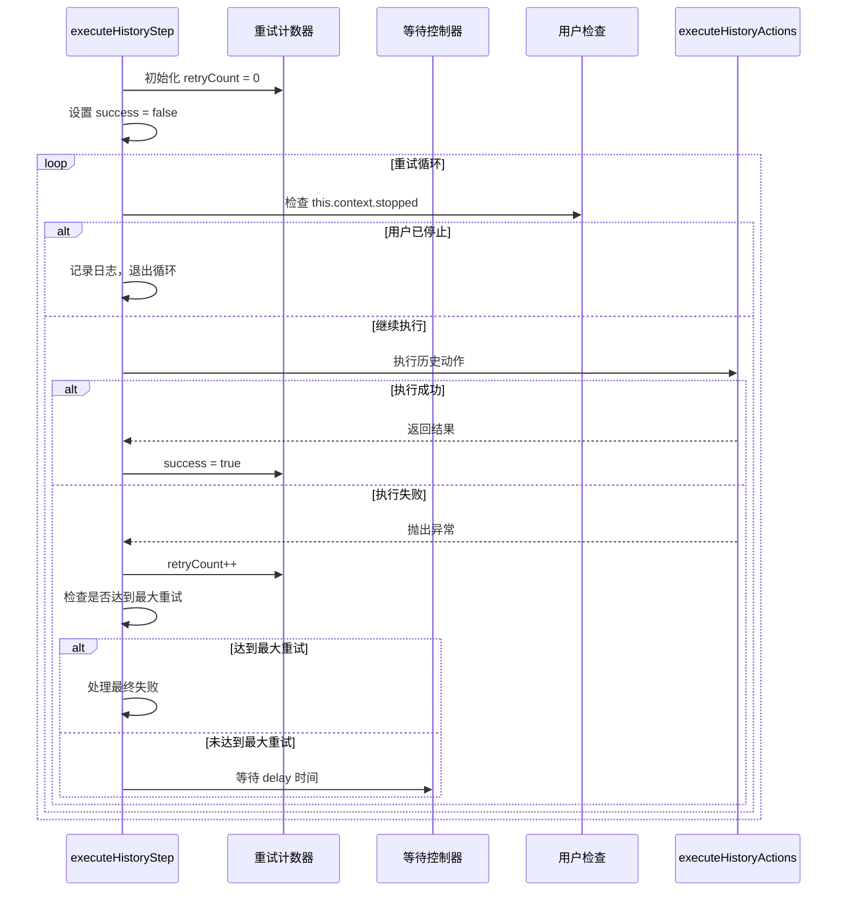
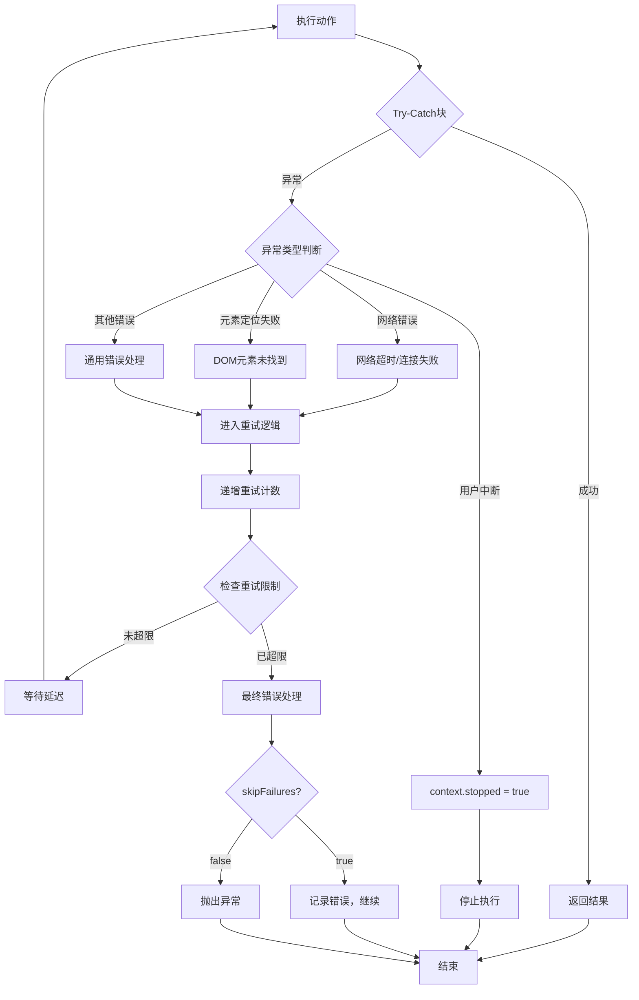
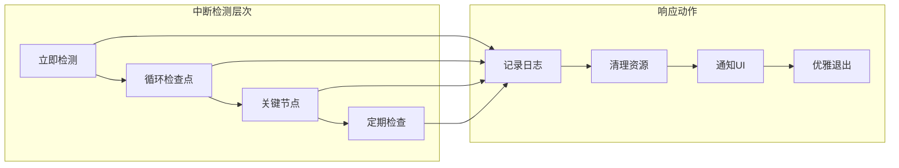
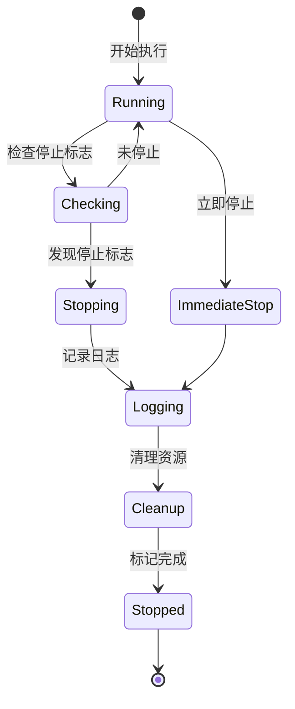
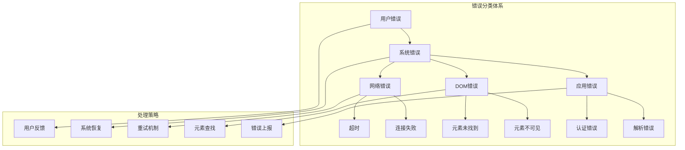
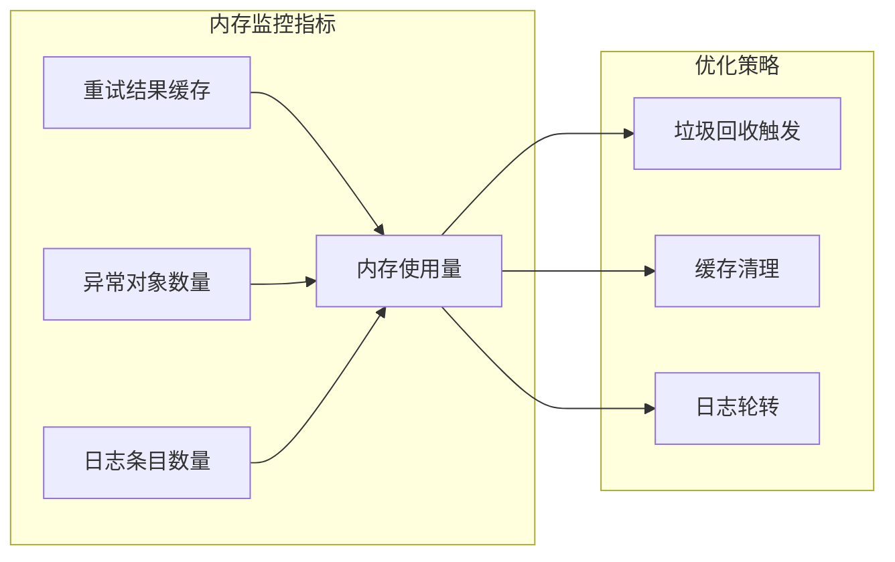

# 回放重试与容错策略

<cite>
**本文档引用的文件**
- [navigator.ts](file://chrome-extension/src/background/agent/agents/navigator.ts)
- [executor.ts](file://chrome-extension/src/background/agent/executor.ts)
- [types.ts](file://chrome-extension/src/background/agent/types.ts)
- [context.ts](file://chrome-extension/src/background/agent/context.ts)
- [errors.ts](file://chrome-extension/src/background/agent/agents/errors.ts)
- [SidePanel.tsx](file://pages/side-panel/src/SidePanel.tsx)
- [GeneralSettings.tsx](file://pages/options/src/components/GeneralSettings.tsx)
</cite>

## 目录
1. [概述](#概述)
2. [核心重试机制架构](#核心重试机制架构)
3. [关键参数详解](#关键参数详解)
4. [重试循环实现分析](#重试循环实现分析)
5. [用户中断响应机制](#用户中断响应机制)
6. [错误处理与日志记录](#错误处理与日志记录)
7. [配置建议与最佳实践](#配置建议与最佳实践)
8. [性能优化考虑](#性能优化考虑)
9. [故障排除指南](#故障排除指南)
10. [总结](#总结)

## 概述

NanoBrowser的回放重试机制是一个精心设计的容错系统，旨在提高自动化任务执行的成功率。该机制通过智能重试策略、灵活的配置选项和完善的用户交互控制，确保在面对网络波动、页面加载延迟或元素定位失败等常见问题时，能够保持稳定的执行表现。

系统的核心设计理念是在可靠性和执行效率之间找到最佳平衡点，通过可配置的重试参数和细粒度的错误处理，为不同场景提供最优的执行策略。

## 核心重试机制架构

### 系统架构概览



**图表来源**
- [executor.ts](file://chrome-extension/src/background/agent/executor.ts#L356-L433)
- [navigator.ts](file://chrome-extension/src/background/agent/agents/navigator.ts#L542-L615)

### 执行流程图



**图表来源**
- [navigator.ts](file://chrome-extension/src/background/agent/agents/navigator.ts#L572-L615)

**章节来源**
- [navigator.ts](file://chrome-extension/src/background/agent/agents/navigator.ts#L542-L615)
- [executor.ts](file://chrome-extension/src/background/agent/executor.ts#L356-L433)

## 关键参数详解

### maxRetries - 最大重试次数

`maxRetries`参数控制每个操作的最大重试次数，是重试机制的核心配置之一。

| 参数名称 | 默认值 | 可配置范围 | 影响因素 |
|---------|--------|-----------|----------|
| maxRetries | 3 | 1-10 | 网络稳定性、页面复杂度、执行环境 |
| 配置位置 | executeHistoryStep方法 | 全局设置 | 用户界面配置 |

**配置建议：**
- **简单页面**：1-2次重试即可满足需求
- **复杂页面**：3-5次重试提供更好的容错能力
- **高延迟网络**：5-10次重试确保执行成功率

### delay - 延迟时间（毫秒）

`delay`参数定义每次重试之间的等待时间，直接影响重试的响应速度和资源消耗。

| 参数名称 | 默认值 | 单位 | 性能影响 |
|---------|--------|------|----------|
| delay | 1000ms | 毫秒 | CPU使用率、用户体验 |
| 动态调整 | 支持 | - | 基于网络状况自适应 |

**延迟策略：**
- **固定延迟**：适用于稳定环境，提供可预测的执行时间
- **指数退避**：可扩展支持，应对突发网络波动
- **动态调整**：基于历史执行数据优化延迟时间

### skipFailures - 跳过失败标志

`skipFailures`参数决定当重试达到上限时的行为模式。

| 行为模式 | skipFailures值 | 执行效果 | 使用场景 |
|---------|---------------|----------|----------|
| 跳过失败 | true | 记录错误但继续执行 | 生产环境，容忍部分失败 |
| 停止执行 | false | 抛出异常，终止执行 | 关键任务，要求完整性 |

**决策逻辑：**
```typescript
if (!skipFailures) {
  throw new Error(failMsg); // 抛出异常，终止执行
} else {
  results.push(new ActionResult({ error: failMsg, includeInMemory: true }));
  // 继续执行下一个步骤
}
```

**章节来源**
- [navigator.ts](file://chrome-extension/src/background/agent/agents/navigator.ts#L542-L544)
- [executor.ts](file://chrome-extension/src/background/agent/executor.ts#L371-L373)

## 重试循环实现分析

### 核心重试算法

重试循环是整个容错机制的核心，其实现体现了精巧的设计思想：



**图表来源**
- [navigator.ts](file://chrome-extension/src/background/agent/agents/navigator.ts#L572-L615)

### 异常捕获与处理

系统采用分层异常处理策略，确保不同类型的错误得到适当的处理：



**图表来源**
- [navigator.ts](file://chrome-extension/src/background/agent/agents/navigator.ts#L580-L615)

### 重试计数递增机制

重试计数的管理体现了系统的智能性：

**递增时机：**
- 每次捕获到异常时自动递增
- 重试间隔内不重置计数
- 成功执行后重置为0

**监控指标：**
- 当前重试次数 vs 最大重试次数
- 连续失败次数统计
- 平均重试成功率计算

**章节来源**
- [navigator.ts](file://chrome-extension/src/background/agent/agents/navigator.ts#L572-L615)

## 用户中断响应机制

### 中断检测机制

系统实现了多层次的用户中断检测，确保良好的交互控制体验：



**图表来源**
- [navigator.ts](file://chrome-extension/src/background/agent/agents/navigator.ts#L576-L582)
- [context.ts](file://chrome-extension/src/background/agent/context.ts#L85-L90)

### 停止标志管理

停止标志的管理体现了系统的响应式设计：

**标志状态转换：**


**图表来源**
- [context.ts](file://chrome-extension/src/background/agent/context.ts#L85-L90)

### 优雅退出策略

当检测到用户中断时，系统采用优雅退出策略：

**退出流程：**
1. **立即停止**：检测到停止标志后立即停止当前操作
2. **资源清理**：释放浏览器上下文和其他资源
3. **状态保存**：保存当前执行状态以便恢复
4. **用户通知**：向UI组件发送停止事件

**章节来源**
- [navigator.ts](file://chrome-extension/src/background/agent/agents/navigator.ts#L576-L582)
- [context.ts](file://chrome-extension/src/background/agent/context.ts#L85-L90)

## 错误处理与日志记录

### 分层错误处理

系统采用分层错误处理架构，确保错误得到适当分类和处理：



**图表来源**
- [navigator.ts](file://chrome-extension/src/background/agent/agents/navigator.ts#L200-L250)
- [errors.ts](file://chrome-extension/src/background/agent/agents/errors.ts#L227-L313)

### 日志记录策略

系统实现了全面的日志记录策略，支持不同级别的调试信息：

**日志级别与用途：**

| 日志级别 | 使用场景 | 记录内容 | 性能影响 |
|---------|----------|----------|----------|
| ERROR | 严重错误 | 完整错误堆栈、执行上下文 | 最低 |
| WARNING | 警告信息 | 错误摘要、重试次数 | 低 |
| INFO | 一般信息 | 步骤进度、关键状态 | 中等 |
| DEBUG | 调试信息 | 详细执行流程、参数值 | 较高 |

**日志格式标准化：**
```
[模块名:函数名] 消息内容 (附加信息)
示例：[NavigatorAgent:executeHistoryStep] Step 3 failed after 3 attempts: Element not found
```

### 错误恢复机制

系统提供了多种错误恢复机制：

**自动恢复策略：**
- **元素重新定位**：当DOM结构变化时重新查找元素
- **页面刷新**：在网络错误时尝试重新加载页面
- **会话重建**：在认证失效时重新建立会话

**手动恢复入口：**
- 用户界面提供的重试按钮
- 配置界面的参数调整功能
- 调试工具的强制重启功能

**章节来源**
- [navigator.ts](file://chrome-extension/src/background/agent/agents/navigator.ts#L580-L615)
- [errors.ts](file://chrome-extension/src/background/agent/agents/errors.ts#L227-L313)

## 配置建议与最佳实践

### 网络环境适配

根据不同网络环境推荐的配置：

**稳定网络环境：**
```typescript
// 推荐配置
const stableNetworkConfig = {
  maxRetries: 2,
  delay: 500,      // 较短延迟，提高效率
  skipFailures: true
};
```

**不稳定网络环境：**
```typescript
// 推荐配置  
const unstableNetworkConfig = {
  maxRetries: 5,
  delay: 2000,     // 较长延迟，避免频繁重试
  skipFailures: true
};
```

**高延迟网络环境：**
```typescript
// 推荐配置
const highLatencyConfig = {
  maxRetries: 8,
  delay: 3000,
  skipFailures: true
};
```

### 页面复杂度调优

根据页面复杂度调整重试参数：

**简单表单页面：**
```typescript
// 简单配置
const simpleFormConfig = {
  maxRetries: 1,
  delay: 1000,
  skipFailures: true
};
```

**动态内容页面：**
```typescript
// 动态内容配置
const dynamicContentConfig = {
  maxRetries: 4,
  delay: 1500,
  skipFailures: true
};
```

**复杂交互页面：**
```typescript
// 复杂交互配置
const complexInteractionConfig = {
  maxRetries: 6,
  delay: 2000,
  skipFailures: false  // 关键任务需要完整性
};
```

### 生产环境配置

生产环境的最佳实践配置：

```typescript
// 生产环境推荐配置
const productionConfig = {
  maxRetries: 3,
  delay: 1000,
  skipFailures: true,  // 生产环境容忍部分失败
  // 结合监控系统进行动态调整
  adaptiveDelay: true, // 启用自适应延迟
  exponentialBackoff: true // 启用指数退避
};
```

### 开发环境配置

开发环境的调试友好配置：

```typescript
// 开发环境配置
const developmentConfig = {
  maxRetries: 1,      // 减少重试次数便于调试
  delay: 500,         // 较短延迟加快测试速度
  skipFailures: false, // 严格模式便于发现问题
  verboseLogging: true // 启用详细日志
};
```

### 配置持久化

系统支持配置的持久化存储：

**配置存储位置：**
- 浏览器本地存储
- 用户偏好设置
- 项目级配置文件

**配置同步机制：**
- 实时配置更新
- 配置版本控制
- 回滚机制支持

**章节来源**
- [GeneralSettings.tsx](file://pages/options/src/components/GeneralSettings.tsx#L84-L105)
- [types.ts](file://chrome-extension/src/background/agent/types.ts#L25-L40)

## 性能优化考虑

### 内存管理优化

重试机制对内存使用有显著影响，系统实现了多项优化措施：

**内存使用监控：**


**优化措施：**
- **结果缓存限制**：限制重试结果的缓存数量
- **异常对象复用**：避免创建大量相似的异常对象
- **日志分级存储**：根据重要性分级存储日志

### CPU使用优化

重试机制可能增加CPU使用，系统采用以下优化策略：

**CPU优化技术：**
- **异步等待**：使用Promise而非轮询等待
- **智能调度**：在低负载时段执行重试
- **批量处理**：合并多个小任务减少调度开销

### 网络优化

针对网络相关的重试进行了专门优化：

**网络优化策略：**
- **连接池管理**：复用HTTP连接减少握手开销
- **请求去重**：避免重复发送相同请求
- **智能超时**：根据网络状况动态调整超时时间

**章节来源**
- [navigator.ts](file://chrome-extension/src/background/agent/agents/navigator.ts#L572-L615)

## 故障排除指南

### 常见问题诊断

**问题1：重试次数过多导致执行缓慢**

*症状*：任务执行时间远超预期，CPU使用率高

*诊断步骤：*
1. 检查网络连接稳定性
2. 查看重试日志确认失败原因
3. 调整maxRetries和delay参数

*解决方案：*
```typescript
// 降低重试频率
const optimizedConfig = {
  maxRetries: 2,
  delay: 1500,
  skipFailures: true
};
```

**问题2：用户中断响应不及时**

*症状*：点击停止按钮后任务仍在运行

*诊断步骤：*
1. 检查中断检测逻辑
2. 验证停止标志传播路径
3. 确认异步操作的取消机制

*解决方案：*
```typescript
// 加强中断检测
const responsiveConfig = {
  interruptCheckInterval: 100, // 更频繁的检查
  gracefulShutdownTimeout: 5000 // 更快的优雅关闭
};
```

**问题3：错误信息不够详细**

*症状*：错误日志无法准确定位问题

*诊断步骤：*
1. 检查日志级别设置
2. 验证错误对象的属性完整性
3. 确认堆栈跟踪信息的收集

*解决方案：*
```typescript
// 增强错误信息
const detailedLoggingConfig = {
  includeStackTrace: true,
  includeContext: true,
  includeTimestamps: true
};
```

### 调试工具

系统提供了丰富的调试工具：

**内置调试功能：**
- 实时重试状态监控
- 错误详情查看器
- 性能指标统计
- 配置参数验证

**外部调试工具：**
- 浏览器开发者工具集成
- 日志文件分析工具
- 性能分析器

### 监控指标

关键监控指标的含义和阈值：

| 指标名称 | 正常范围 | 警告阈值 | 危险阈值 | 说明 |
|---------|----------|----------|----------|------|
| 平均重试次数 | < 1.5 | 1.5-3.0 | > 3.0 | 重试过于频繁 |
| 错误率 | < 5% | 5%-15% | > 15% | 系统稳定性指标 |
| 执行时间 | 基线±20% | 基线±30% | 基线±50% | 性能波动指标 |
| 内存使用 | < 500MB | 500MB-1GB | > 1GB | 内存泄漏预警 |

**章节来源**
- [navigator.ts](file://chrome-extension/src/background/agent/agents/navigator.ts#L580-L615)
- [SidePanel.tsx](file://pages/side-panel/src/SidePanel.tsx#L156-L196)

## 总结

NanoBrowser的回放重试与容错策略展现了现代自动化系统设计的最佳实践。通过精心设计的三参数重试机制（maxRetries、delay、skipFailures），系统能够在保证执行可靠性的同时，维持良好的性能表现。

**核心优势：**
1. **智能重试**：基于失败模式的自适应重试策略
2. **用户友好**：完善的中断响应和状态反馈机制
3. **配置灵活**：支持多种场景的参数调优
4. **易于调试**：全面的日志记录和监控功能

**技术亮点：**
- 分层异常处理确保错误得到适当处理
- 异步编程模型提供良好的响应性
- 内存和CPU优化确保系统稳定性
- 模块化设计便于维护和扩展

**应用价值：**
该重试机制不仅提高了自动化任务的成功率，还为开发者提供了强大的调试和监控工具，是构建可靠自动化系统的重要基础设施。通过合理的配置和使用，可以在各种复杂的执行环境中保持稳定的性能表现。