# 上下文变更验证机制

<cite>
**本文档引用的文件**
- [navigator.ts](file://chrome-extension/src/background/agent/agents/navigator.ts)
- [views.ts](file://chrome-extension/src/background/browser/dom/views.ts)
- [service.ts](file://chrome-extension/src/background/browser/dom/history/service.ts)
- [view.ts](file://chrome-extension/src/background/browser/dom/history/view.ts)
- [page.ts](file://chrome-extension/src/background/browser/page.ts)
- [builder.ts](file://chrome-extension/src/background/agent/actions/builder.ts)
- [errors.ts](file://chrome-extension/src/background/agent/agents/errors.ts)
</cite>

## 目录
1. [引言](#引言)
2. [系统架构概览](#系统架构概览)
3. [核心组件分析](#核心组件分析)
4. [上下文验证流程](#上下文验证流程)
5. [哈希计算机制](#哈希计算机制)
6. [HistoryTreeProcessor的作用](#historytreeprocessor的作用)
7. [动作执行中的上下文检查](#动作执行中的上下文检查)
8. [错误处理与中断机制](#错误处理与中断机制)
9. [性能优化考虑](#性能优化考虑)
10. [总结](#总结)

## 引言

在自动化浏览器操作的场景中，确保动作执行的上下文一致性是至关重要的。本文档详细阐述了NanoBrowser项目中indexArg上下文验证逻辑的实现原理，该机制通过计算页面路径哈希集合并与缓存值进行子集比对，有效检测页面结构的意外变化，从而保障动作执行的鲁棒性。

## 系统架构概览

该上下文验证机制采用分层架构设计，主要包含以下层次：

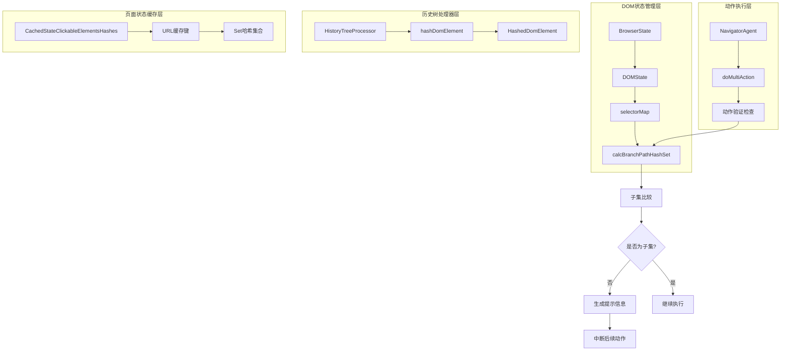

**图表来源**
- [navigator.ts](file://chrome-extension/src/background/agent/agents/navigator.ts#L353-L376)
- [views.ts](file://chrome-extension/src/background/browser/dom/views.ts#L585-L590)
- [service.ts](file://chrome-extension/src/background/browser/dom/history/service.ts#L164-L174)

## 核心组件分析

### DOMState接口

DOMState是整个验证机制的核心数据结构，它维护了DOM元素树和选择器映射关系：

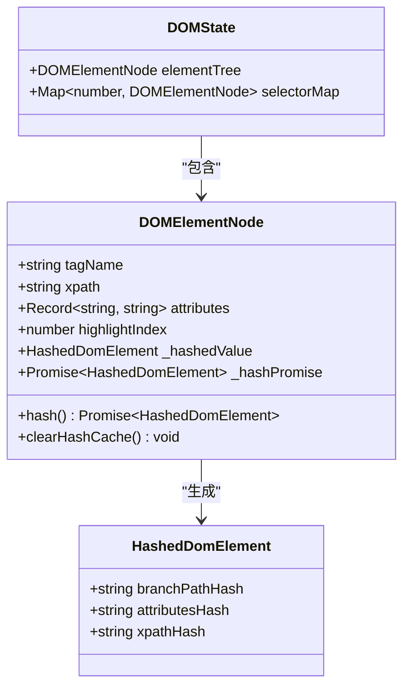

**图表来源**
- [views.ts](file://chrome-extension/src/background/browser/dom/views.ts#L556-L590)
- [view.ts](file://chrome-extension/src/background/browser/dom/history/view.ts#L0-L62)

### CachedStateClickableElementsHashes类

该类负责缓存页面状态的可点击元素哈希集合，支持URL级别的缓存策略：

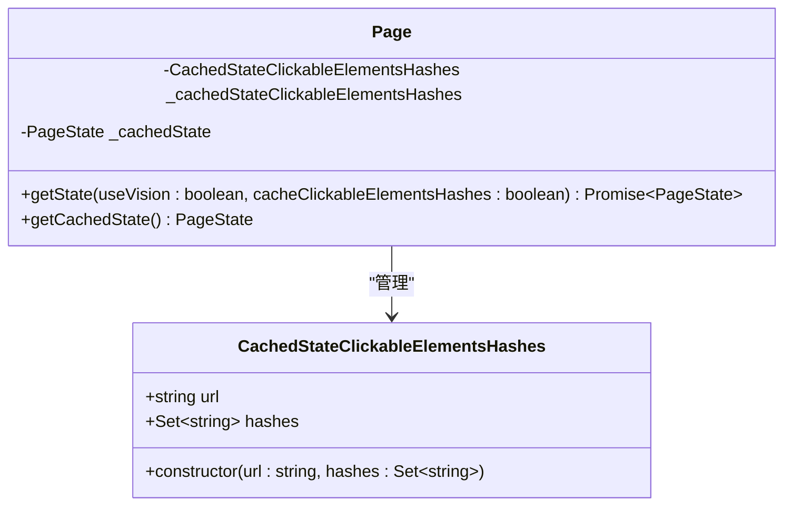

**图表来源**
- [page.ts](file://chrome-extension/src/background/browser/page.ts#L24-L68)

**节来源**
- [page.ts](file://chrome-extension/src/background/browser/page.ts#L24-L68)

## 上下文验证流程

### 动作执行前的准备阶段

在执行多动作之前，系统会先获取当前页面状态并计算路径哈希集合：

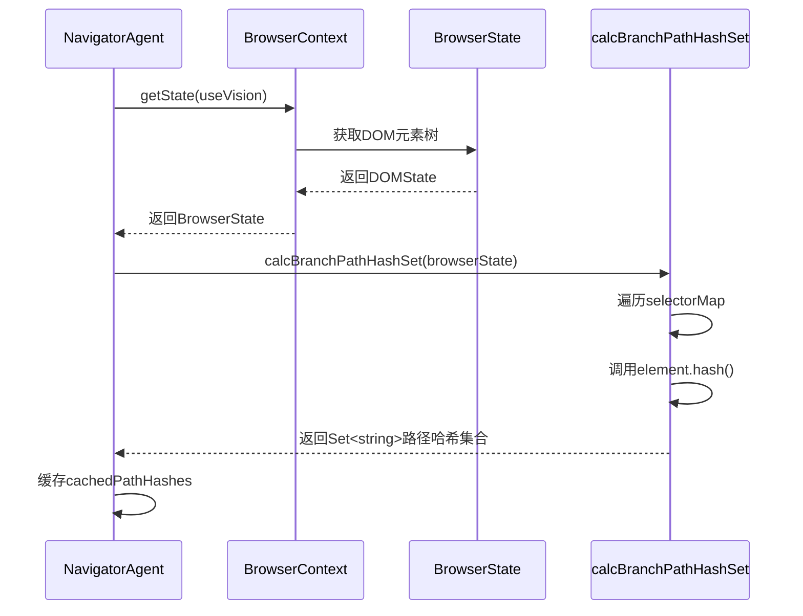

**图表来源**
- [navigator.ts](file://chrome-extension/src/background/agent/agents/navigator.ts#L353-L376)
- [views.ts](file://chrome-extension/src/background/browser/dom/views.ts#L585-L590)

### 动作执行过程中的验证

对于第i个动作（i>0），系统会在执行前进行上下文验证：

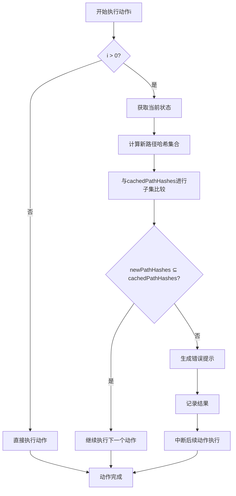

**图表来源**
- [navigator.ts](file://chrome-extension/src/background/agent/agents/navigator.ts#L360-L376)

**节来源**
- [navigator.ts](file://chrome-extension/src/background/agent/agents/navigator.ts#L353-L376)

## 哈希计算机制

### 分支路径哈希计算

calcBranchPathHashSet函数是整个验证机制的核心，它为每个DOM元素计算分支路径哈希：

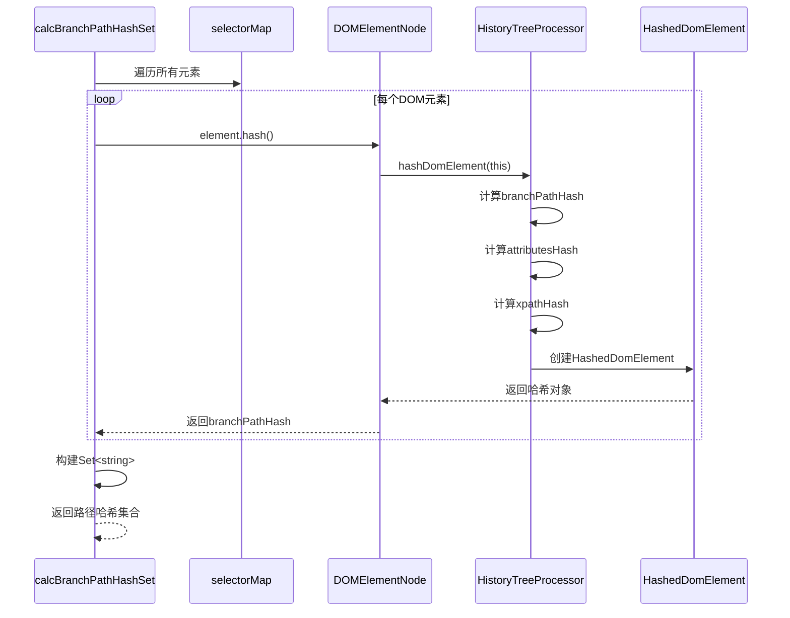

**图表来源**
- [views.ts](file://chrome-extension/src/background/browser/dom/views.ts#L585-L590)
- [service.ts](file://chrome-extension/src/background/browser/dom/history/service.ts#L76-L115)

### 哈希生成算法

系统使用多种因素生成哈希值，确保唯一性和稳定性：

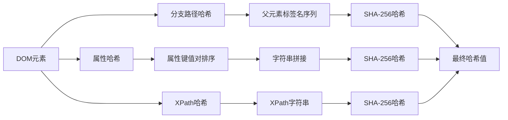

**图表来源**
- [service.ts](file://chrome-extension/src/background/browser/dom/history/service.ts#L117-L174)

**节来源**
- [views.ts](file://chrome-extension/src/background/browser/dom/views.ts#L585-L590)
- [service.ts](file://chrome-extension/src/background/browser/dom/history/service.ts#L76-L115)

## HistoryTreeProcessor的作用

HistoryTreeProcessor是一个命名空间，提供了完整的DOM元素历史树处理功能：

### 主要功能模块

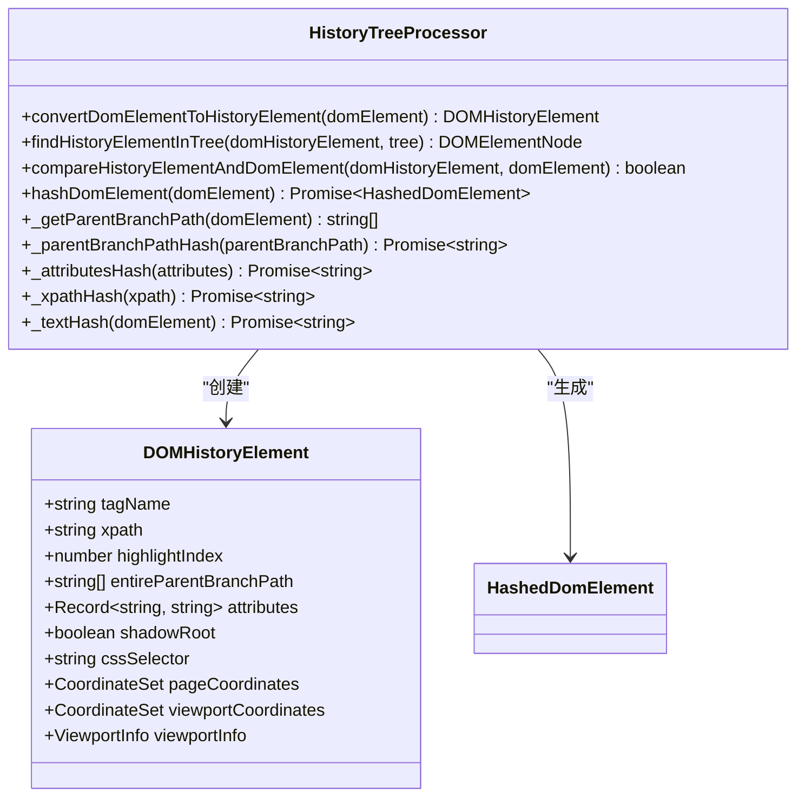

**图表来源**
- [service.ts](file://chrome-extension/src/background/browser/dom/history/service.ts#L164-L174)
- [view.ts](file://chrome-extension/src/background/browser/dom/history/view.ts#L34-L62)

### 元素匹配机制

HistoryTreeProcessor提供了精确的元素匹配功能，用于验证历史元素与当前DOM树的一致性：

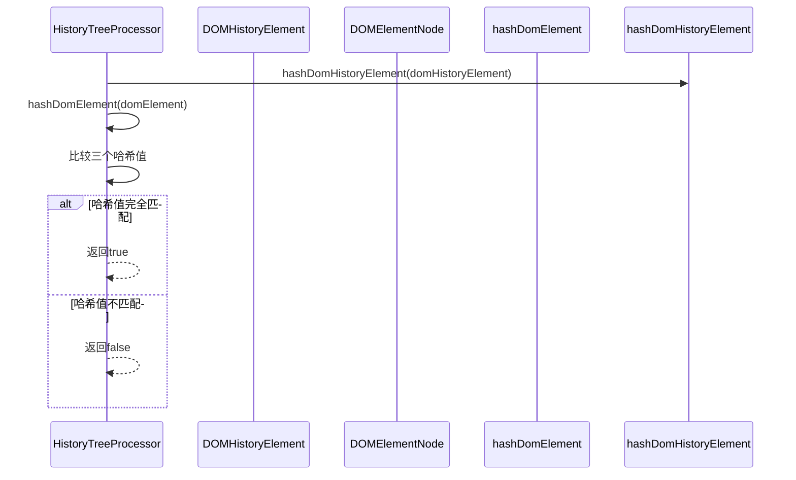

**图表来源**
- [service.ts](file://chrome-extension/src/background/browser/dom/history/service.ts#L32-L74)

**节来源**
- [service.ts](file://chrome-extension/src/background/browser/dom/history/service.ts#L164-L174)

## 动作执行中的上下文检查

### 子集比较逻辑

系统使用JavaScript的Set.prototype.isSubsetOf方法进行子集比较：

```mermaid
flowchart TD
A[新路径哈希集合] --> B[newPathHashes.isSubsetOf(cachedPathHashes)]
B --> C{是否为子集?}
C --> |是| D[继续执行]
C --> |否| E[检测到结构变化]
E --> F[生成错误消息]
F --> G["Something new appeared after action i"]
G --> H[记录到结果数组]
H --> I[中断后续动作]
```

**图表来源**
- [navigator.ts](file://chrome-extension/src/background/agent/agents/navigator.ts#L360-L376)

### 动作索引更新机制

当检测到页面结构变化时，系统会尝试更新动作索引以适应新的DOM结构：

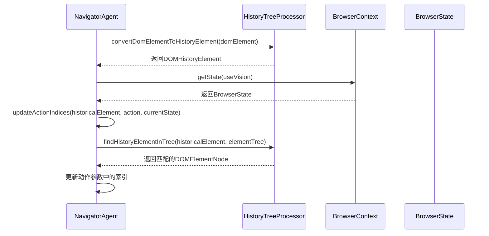

**图表来源**
- [navigator.ts](file://chrome-extension/src/background/agent/agents/navigator.ts#L614-L649)

**节来源**
- [navigator.ts](file://chrome-extension/src/background/agent/agents/navigator.ts#L353-L376)
- [navigator.ts](file://chrome-extension/src/background/agent/agents/navigator.ts#L614-L649)

## 错误处理与中断机制

### 错误类型定义

系统定义了专门的错误类型来处理上下文验证失败的情况：

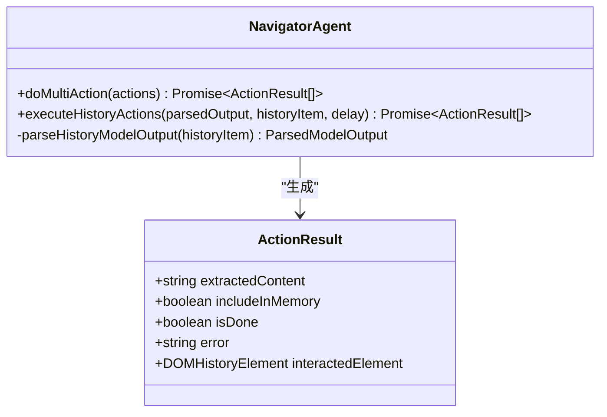

**图表来源**
- [builder.ts](file://chrome-extension/src/background/agent/actions/builder.ts#L33-L75)

### 中断执行流程

当检测到页面结构变化时，系统按照以下流程处理：

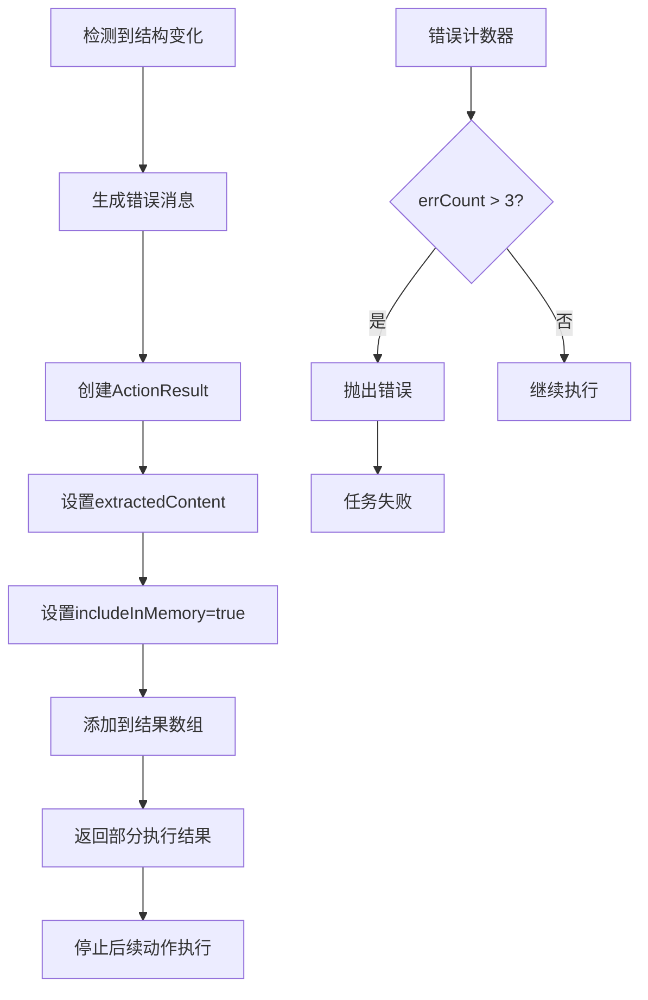

**图表来源**
- [navigator.ts](file://chrome-extension/src/background/agent/agents/navigator.ts#L377-L400)

**节来源**
- [builder.ts](file://chrome-extension/src/background/agent/actions/builder.ts#L33-L75)
- [navigator.ts](file://chrome-extension/src/background/agent/agents/navigator.ts#L353-L400)

## 性能优化考虑

### 哈希缓存机制

为了提高性能，DOMElementNode实现了智能的哈希缓存：

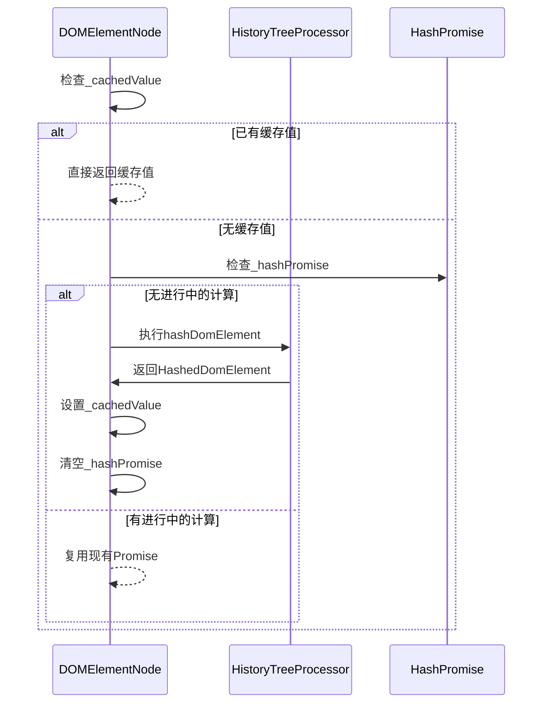

**图表来源**
- [views.ts](file://chrome-extension/src/background/browser/dom/views.ts#L125-L160)

### 并发哈希计算

系统使用Promise.all进行并发哈希计算，提高效率：

```mermaid
flowchart LR
A[selectorMap.values()] --> B[Array.from转换]
B --> C[map映射到Promise]
C --> D[Promise.all并发执行]
D --> E[Set构造函数去重]
E --> F[返回路径哈希集合]
```

**图表来源**
- [views.ts](file://chrome-extension/src/background/browser/dom/views.ts#L585-L590)

**节来源**
- [views.ts](file://chrome-extension/src/background/browser/dom/views.ts#L125-L160)
- [views.ts](file://chrome-extension/src/background/browser/dom/views.ts#L585-L590)

## 总结

NanoBrowser的上下文变更验证机制通过以下关键特性确保了动作执行的鲁棒性：

1. **多层次验证体系**：从DOM元素到历史树再到页面状态的完整验证链
2. **智能哈希计算**：结合分支路径、属性和XPath的多维度哈希生成
3. **高效的子集比较**：利用JavaScript原生Set.isSubsetOf方法进行快速验证
4. **完善的错误处理**：提供详细的错误信息和优雅的中断机制
5. **性能优化设计**：通过缓存和并发计算提升系统响应速度

该机制有效解决了自动化浏览器操作中的上下文一致性问题，为复杂的网页交互提供了可靠的保障。通过这种设计，系统能够在页面结构发生变化时及时发现并采取适当的应对措施，确保自动化任务的稳定执行。