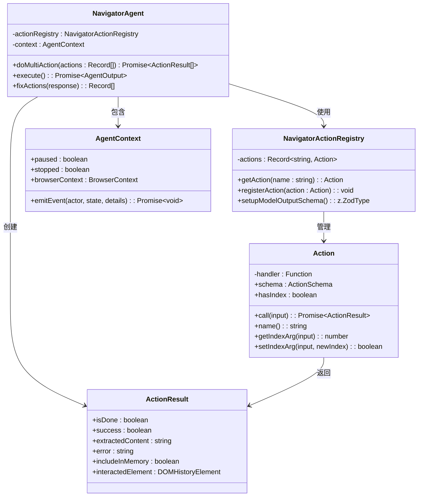
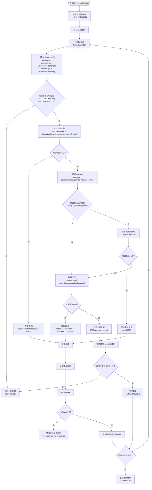
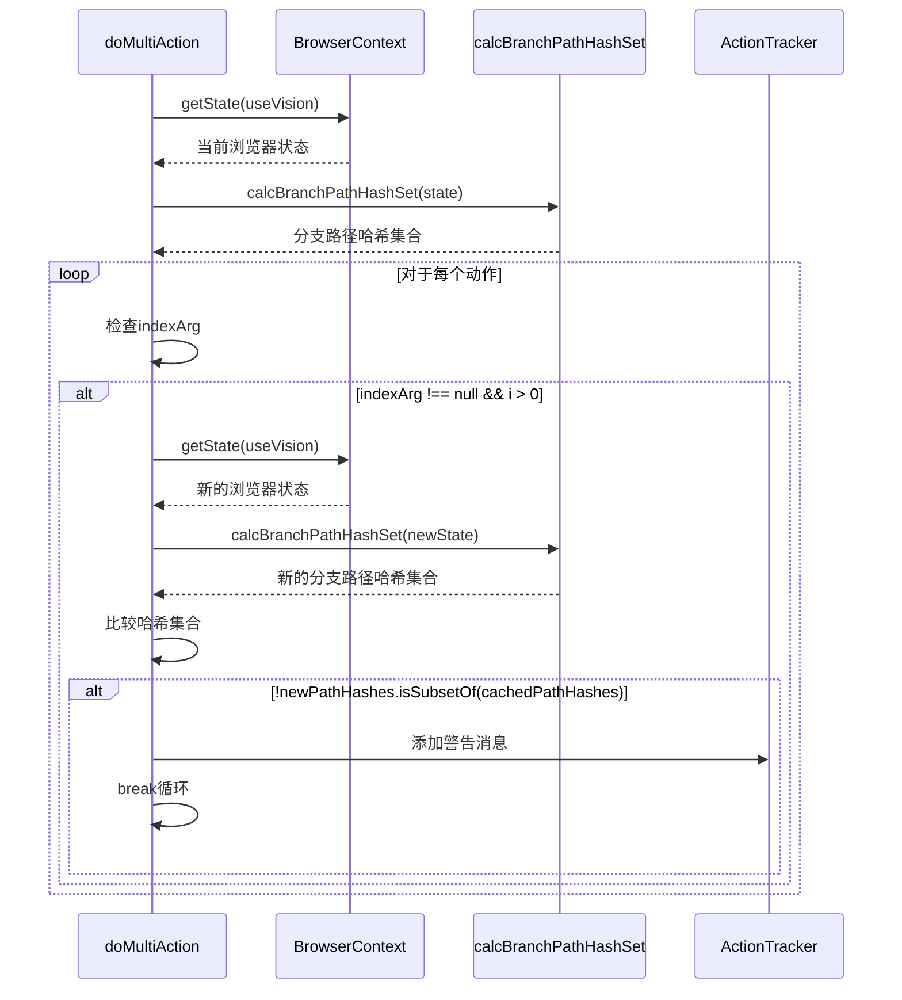
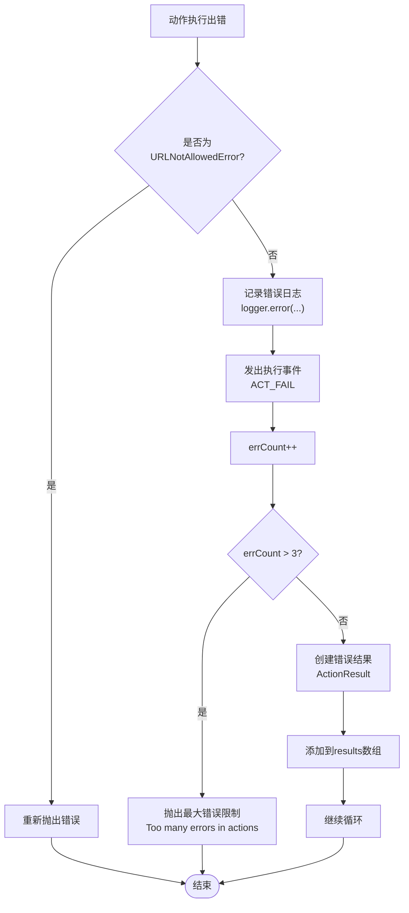

# 动作序列执行

<cite>
**本文档中引用的文件**
- [navigator.ts](file://chrome-extension/src/background/agent/agents/navigator.ts)
- [types.ts](file://chrome-extension/src/background/agent/types.ts)
- [views.ts](file://chrome-extension/src/background/browser/dom/views.ts)
- [context.ts](file://chrome-extension/src/background/browser/context.ts)
- [builder.ts](file://chrome-extension/src/background/agent/actions/builder.ts)
</cite>

## 目录
1. [简介](#简介)
2. [核心架构概览](#核心架构概览)
3. [doMultiAction方法详解](#domultiAction方法详解)
4. [动作序列处理流程](#动作序列处理流程)
5. [暂停/停止检测机制](#暂停停止检测机制)
6. [indexArg上下文验证](#indexarg上下文验证)
7. [1秒延迟等待策略](#1秒延迟等待策略)
8. [错误处理与重试机制](#错误处理与重试机制)
9. [实际应用示例](#实际应用示例)
10. [性能优化建议](#性能优化建议)

## 简介

doMultiAction方法是NanoBrowser导航代理的核心组件，负责执行一系列预定义的动作序列。该方法实现了智能的动作调度、状态监控、错误处理和上下文验证功能，确保自动化任务能够可靠地完成复杂的网页交互操作。

## 核心架构概览



**图表来源**
- [navigator.ts](file://chrome-extension/src/background/agent/agents/navigator.ts#L74-L665)
- [types.ts](file://chrome-extension/src/background/agent/types.ts#L111-L127)
- [builder.ts](file://chrome-extension/src/background/agent/actions/builder.ts#L35-L85)

## doMultiAction方法详解

doMultiAction方法是一个异步函数，接受动作数组作为输入，返回动作执行结果数组。该方法的核心功能包括：

### 方法签名与初始化

```typescript
private async doMultiAction(actions: Record<string, unknown>[]): Promise<ActionResult[]>
```

方法接收以下参数：
- `actions`: 动作数组，每个动作都是一个包含动作名称和参数的对象

初始化阶段创建结果数组和错误计数器：
- `results`: 存储所有动作执行结果
- `errCount`: 跟踪连续错误次数

**章节来源**
- [navigator.ts](file://chrome-extension/src/background/agent/agents/navigator.ts#L353-L446)

### 核心执行逻辑

doMultiAction方法采用for循环遍历动作数组，逐个处理每个动作。循环结构如下：



**图表来源**
- [navigator.ts](file://chrome-extension/src/background/agent/agents/navigator.ts#L353-L446)

## 动作序列处理流程

### 动作解构过程

每个动作都遵循统一的解构模式：

```typescript
const actionName = Object.keys(action)[0];  // 获取动作名称
const actionArgs = action[actionName];      // 获取动作参数
```

这种设计允许动作以灵活的键值对格式传递，例如：
- `{ click: { index: 1 } }`
- `{ input: { index: 2, text: "hello" } }`
- `{ scroll: { index: null, yPercent: 50 } }`

### 动作验证与执行

1. **动作存在性检查**: 确保注册表中存在对应的动作实例
2. **参数验证**: 使用Zod Schema进行输入验证
3. **执行调用**: 通过`actionInstance.call(actionArgs)`执行动作
4. **结果处理**: 处理执行结果并更新交互元素信息

**章节来源**
- [navigator.ts](file://chrome-extension/src/background/agent/agents/navigator.ts#L370-L385)
- [builder.ts](file://chrome-extension/src/background/agent/actions/builder.ts#L45-L70)

## 暂停/停止检测机制

暂停/停止检测是doMultiAction方法的关键安全特性，确保用户可以随时中断长时间运行的任务。

### 检测点位置

暂停/停止检测在以下关键位置执行：

1. **循环开始前**: 在处理每个动作之前检查
2. **动作执行后**: 在等待1秒延迟之前检查
3. **异常处理前**: 在捕获错误时检查

### 实现逻辑

```typescript
if (this.context.paused || this.context.stopped) {
  return results;
}
```

当检测到暂停或停止状态时，方法立即返回当前已执行的结果，允许用户中断任务而不丢失已完成的工作。

**章节来源**
- [navigator.ts](file://chrome-extension/src/background/agent/agents/navigator.ts#L365-L367)
- [navigator.ts](file://chrome-extension/src/background/agent/agents/navigator.ts#L415-L417)

## indexArg上下文验证

### 上下文验证的重要性

indexArg验证机制确保动作在页面状态发生变化时能够正确处理动态内容。这是防止因页面重新渲染导致的元素定位失效的关键机制。

### calcBranchPathHashSet的应用

```typescript
const cachedPathHashes = await calcBranchPathHashSet(browserState);
```

`calcBranchPathHashSet`函数为当前浏览器状态计算分支路径哈希集合，用于后续比较。

### 验证流程



**图表来源**
- [navigator.ts](file://chrome-extension/src/background/agent/agents/navigator.ts#L375-L385)
- [views.ts](file://chrome-extension/src/background/browser/dom/views.ts#L585-L590)

### 检测页面动态变化

当检测到新元素出现在页面上时（即新的分支路径哈希不在缓存集合中），系统会：
1. 记录警告信息
2. 将警告消息添加到结果中
3. 终止后续动作的执行

这种机制确保用户能够及时了解页面状态的变化，并采取相应的措施。

**章节来源**
- [navigator.ts](file://chrome-extension/src/background/agent/agents/navigator.ts#L375-L385)

## 1秒延迟等待策略

### 设计考量

当前实现中使用固定1秒延迟等待策略：

```typescript
// TODO: wait for 1 second for now, need to optimize this to avoid unnecessary waiting
await new Promise(resolve => setTimeout(resolve, 1000));
```

### 等待策略的目的

1. **页面加载适应性**: 给予页面足够时间完成渲染和JavaScript执行
2. **资源释放**: 允许浏览器释放CPU和内存资源
3. **网络请求完成**: 等待可能的网络请求完成
4. **动画效果结束**: 等待页面动画效果完成

### 性能影响分析

虽然1秒延迟简单有效，但存在以下问题：
- **效率低下**: 即使页面快速加载也会浪费时间
- **响应性差**: 用户无法感知任务进度
- **可变性不足**: 固定时间不适用于不同复杂度的页面

### 优化建议

未来的优化方向包括：
- **条件等待**: 根据页面复杂度动态调整等待时间
- **事件驱动**: 等待特定DOM事件或网络请求完成
- **渐进式等待**: 初始短时间等待，超时后延长

**章节来源**
- [navigator.ts](file://chrome-extension/src/background/agent/agents/navigator.ts#L425-L427)

## 错误处理与重试机制

### errCount计数器的作用

errCount计数器跟踪连续错误的数量，提供以下功能：

1. **错误聚合**: 将多个相关错误视为单一问题
2. **阈值控制**: 防止无限循环中的错误累积
3. **用户体验**: 提供清晰的错误边界

### 错误处理流程



**图表来源**
- [navigator.ts](file://chrome-extension/src/background/agent/agents/navigator.ts#L429-L446)

### 错误封装与结果收集

当发生错误时，系统创建标准化的ActionResult对象：

```typescript
new ActionResult({
  error: errorMessage,
  isDone: false,
  includeInMemory: true,
})
```

这种封装确保：
- **一致性**: 所有错误都以相同格式处理
- **可追踪性**: 错误信息被完整记录
- **内存管理**: 错误结果被适当地存储

### 终止策略

当连续错误超过3次时，系统抛出致命错误：

```typescript
throw new Error('Too many errors in actions');
```

这种策略防止系统陷入无效的错误循环，确保用户能够及时发现问题。

**章节来源**
- [navigator.ts](file://chrome-extension/src/background/agent/agents/navigator.ts#L435-L442)

## 实际应用示例

### 基本动作序列示例

典型的动作序列可能包括：

```typescript
const actions = [
  { go_to_url: { url: "https://example.com" } },
  { click: { index: 1 } },
  { input: { index: 2, text: "search query" } },
  { click: { index: 3 } },
  { wait: { seconds: 2 } },
  { scroll: { yPercent: 75 } },
  { done: { text: "Task completed" } }
];
```

### 复杂场景处理

对于复杂的多步骤任务，doMultiAction能够：

1. **状态保持**: 在步骤间维护页面状态
2. **错误恢复**: 在遇到错误时提供回滚能力
3. **进度跟踪**: 记录每个步骤的执行状态
4. **资源清理**: 确保临时资源得到适当释放

### 动态内容适应

当页面包含动态加载的内容时，系统能够：

- 检测新元素的出现
- 更新元素索引映射
- 调整后续动作的参数
- 提供适当的错误报告

**章节来源**
- [navigator.ts](file://chrome-extension/src/background/agent/agents/navigator.ts#L531-L531)

## 性能优化建议

### 等待策略优化

1. **智能等待**: 根据页面特征动态调整等待时间
2. **事件监听**: 监听特定的DOM事件而非固定时间
3. **并发处理**: 对独立的操作使用并发执行

### 内存管理

1. **结果清理**: 及时清理不需要的中间结果
2. **状态压缩**: 压缩浏览器状态信息
3. **垃圾回收**: 主动触发JavaScript垃圾回收

### 错误处理改进

1. **分类处理**: 不同类型的错误采用不同的处理策略
2. **重试机制**: 实现指数退避的重试算法
3. **降级策略**: 在部分失败时尝试继续执行

### 并发控制

1. **队列管理**: 实现动作队列的优先级控制
2. **资源限制**: 控制同时执行的动作数量
3. **负载均衡**: 在多个标签页间分配工作负载

doMultiAction方法通过其精心设计的执行逻辑，为NanoBrowser提供了强大而可靠的自动化基础。它不仅处理了基本的动作执行需求，还包含了必要的安全机制、错误处理和性能考虑，确保了复杂网页交互任务的成功完成。