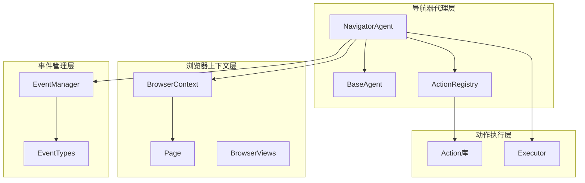
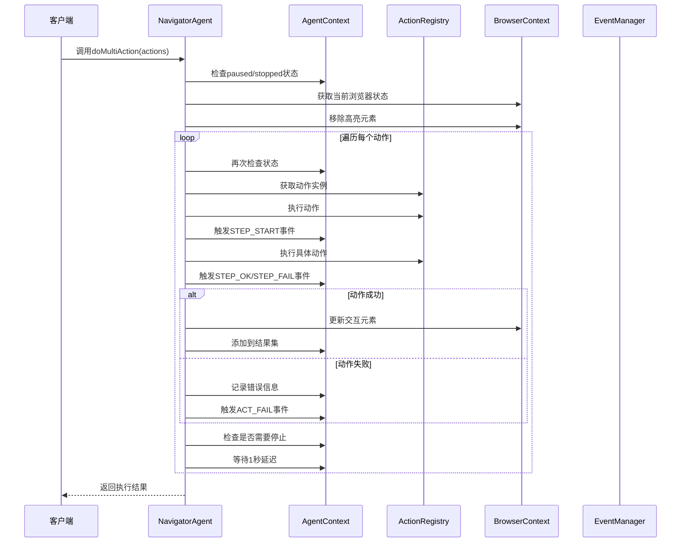
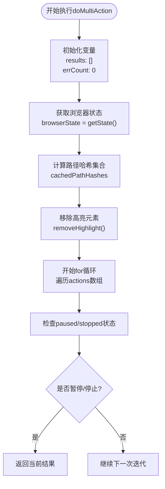
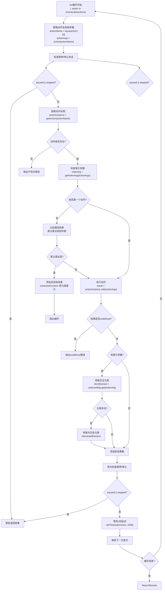
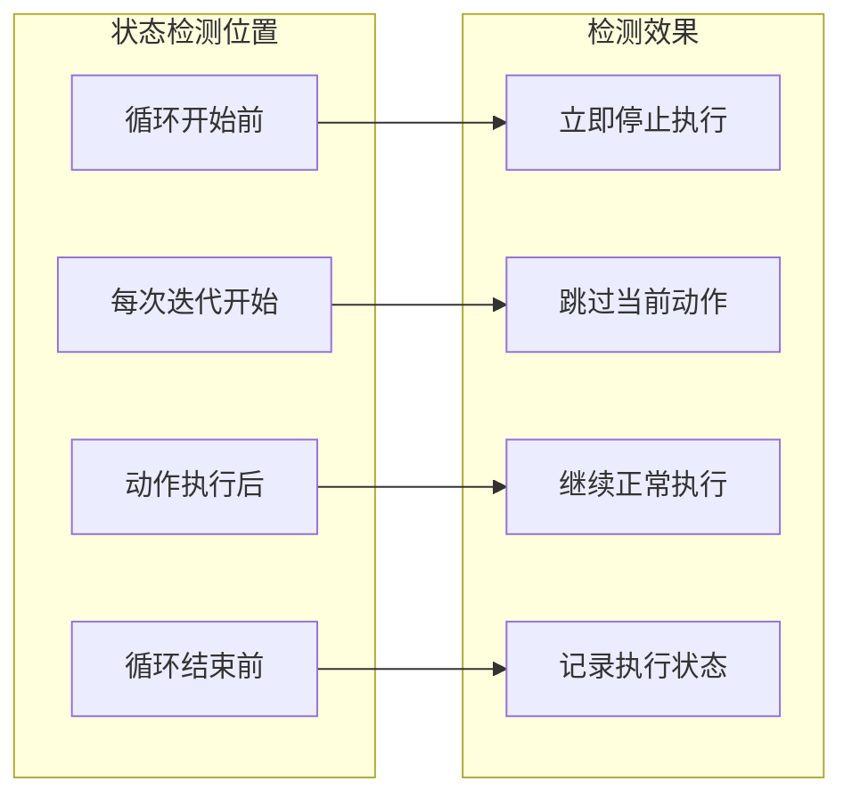
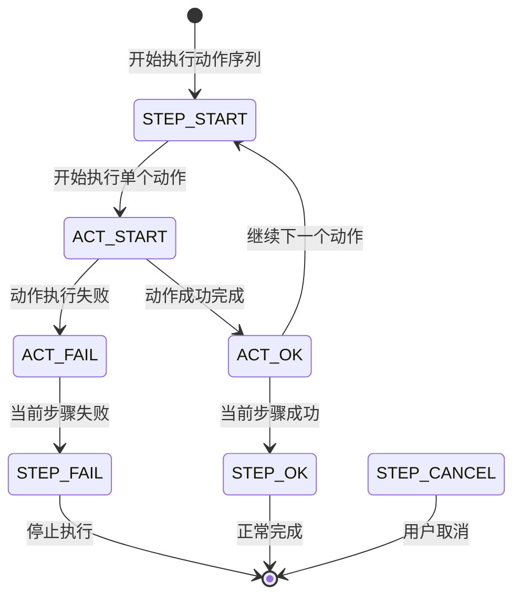
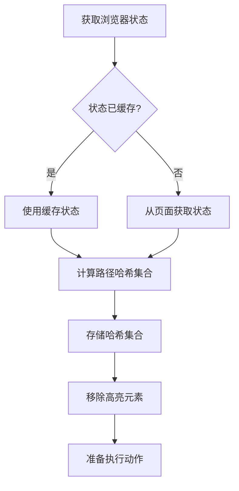
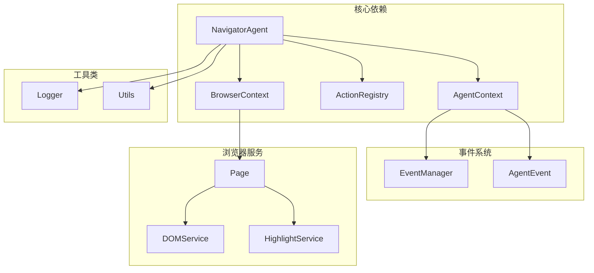

# 动作执行流程控制

<cite>
**本文档中引用的文件**
- [navigator.ts](file://chrome-extension/src/background/agent/agents/navigator.ts)
- [context.ts](file://chrome-extension/src/background/browser/context.ts)
- [types.ts](file://chrome-extension/src/background/agent/types.ts)
- [base.ts](file://chrome-extension/src/background/agent/agents/base.ts)
- [views.ts](file://chrome-extension/src/background/browser/views.ts)
- [manager.ts](file://chrome-extension/src/background/agent/event/manager.ts)
- [page.ts](file://chrome-extension/src/background/browser/page.ts)
</cite>

## 目录
1. [简介](#简介)
2. [项目结构概述](#项目结构概述)
3. [核心组件分析](#核心组件分析)
4. [架构概览](#架构概览)
5. [详细组件分析](#详细组件分析)
6. [依赖关系分析](#依赖关系分析)
7. [性能考虑](#性能考虑)
8. [故障排除指南](#故障排除指南)
9. [结论](#结论)

## 简介

NavigatorAgent中的`doMultiAction`方法是整个浏览器自动化系统的核心执行引擎，负责遍历动作数组并逐个执行每个动作。该方法实现了复杂的流程控制机制，包括任务暂停/停止检测、事件触发管理、状态同步和错误处理等关键功能。

本文档将深入分析`doMultiAction`方法的执行流程控制机制，重点阐述for循环遍历动作数组的实现方式、上下文状态检测机制、事件触发时机以及各种优化策略。

## 项目结构概述

该项目采用模块化架构设计，主要包含以下核心模块：



**图表来源**
- [navigator.ts](file://chrome-extension/src/background/agent/agents/navigator.ts#L1-L50)
- [base.ts](file://chrome-extension/src/background/agent/agents/base.ts#L1-L30)
- [context.ts](file://chrome-extension/src/background/browser/context.ts#L1-L40)

**章节来源**
- [navigator.ts](file://chrome-extension/src/background/agent/agents/navigator.ts#L1-L100)
- [base.ts](file://chrome-extension/src/background/agent/agents/base.ts#L1-L50)

## 核心组件分析

### NavigatorAgent类结构

NavigatorAgent继承自BaseAgent，提供了专门针对网页导航场景的智能代理功能。其核心特性包括：

- **动作注册表管理**：维护可执行动作的注册表
- **模型输出模式**：支持结构化输出和手动JSON提取
- **状态历史跟踪**：记录浏览器状态变化历史
- **多步骤执行**：支持复杂任务的分步执行

### 执行上下文管理

AgentContext提供了完整的执行环境管理，包括：

- **任务生命周期控制**：paused和stopped状态管理
- **事件发射机制**：统一的事件通知系统
- **资源管理**：AbortController用于任务取消
- **历史记录存储**：保存执行历史和结果

**章节来源**
- [navigator.ts](file://chrome-extension/src/background/agent/agents/navigator.ts#L60-L120)
- [types.ts](file://chrome-extension/src/background/agent/types.ts#L35-L99)

## 架构概览

`doMultiAction`方法在整个执行流程中扮演着关键角色，它连接了动作解析、执行控制和结果收集等各个环节：



**图表来源**
- [navigator.ts](file://chrome-extension/src/background/agent/agents/navigator.ts#L340-L450)
- [types.ts](file://chrome-extension/src/background/agent/types.ts#L65-L85)

## 详细组件分析

### doMultiAction方法执行流程

`doMultiAction`方法实现了严格的流程控制机制，确保每个动作都能安全、可靠地执行：

#### 初始化阶段



**图表来源**
- [navigator.ts](file://chrome-extension/src/background/agent/agents/navigator.ts#L340-L360)

#### 动作执行循环

for循环是`doMultiAction`的核心控制结构，它逐个处理动作数组中的每个动作：



**图表来源**
- [navigator.ts](file://chrome-extension/src/background/agent/agents/navigator.ts#L360-L450)

#### 上下文状态检测机制

`doMultiAction`方法在多个关键节点执行上下文状态检测，确保任务能够响应外部控制信号：

##### 初始状态检测
在循环开始前和每次迭代开始时，都会检查`context.paused`和`context.stopped`状态：

```typescript
// 循环开始前的状态检查
if (this.context.paused || this.context.stopped) {
  return results;
}

// 每次迭代开始前的状态检查
if (this.context.paused || this.context.stopped) {
  return results;
}
```

这种双重检查机制确保：
- **及时响应**：用户可以随时暂停或停止任务
- **资源释放**：避免在不必要的状态下消耗资源
- **状态一致性**：保持执行状态与外部控制的一致性

##### 状态检测的作用域



**图表来源**
- [navigator.ts](file://chrome-extension/src/background/agent/agents/navigator.ts#L365-L375)
- [navigator.ts](file://chrome-extension/src/background/agent/agents/navigator.ts#L410-L420)

#### 事件触发机制

`doMultiAction`方法实现了完整的事件驱动架构，通过`emitEvent`方法在关键时间点触发相应事件：

##### 事件类型和状态流转



**图表来源**
- [types.ts](file://chrome-extension/src/background/agent/event/types.ts#L20-L50)
- [manager.ts](file://chrome-extension/src/background/agent/event/manager.ts#L40-L52)

##### 事件触发时机和作用

| 触发时机 | 事件类型 | 作用描述 |
|---------|---------|---------|
| 动作开始前 | `ExecutionState.STEP_START` | 标记动作序列开始，准备执行环境 |
| 动作执行前 | `ExecutionState.ACT_START` | 标记单个动作开始，初始化执行状态 |
| 动作成功后 | `ExecutionState.ACT_OK` | 记录动作成功结果，更新状态信息 |
| 动作失败后 | `ExecutionState.ACT_FAIL` | 记录动作失败原因，触发错误处理 |
| 动作序列完成后 | `ExecutionState.STEP_OK` | 标记整个序列成功完成，清理资源 |
| 执行被取消时 | `ExecutionState.STEP_CANCEL` | 处理用户取消请求，释放资源 |

##### 事件数据结构

每个事件都携带丰富的上下文信息：

```typescript
interface EventData {
  taskId: string;           // 任务唯一标识
  step: number;             // 当前步骤编号
  maxSteps: number;         // 最大步骤数
  details: string;          // 事件详细描述
}
```

**章节来源**
- [navigator.ts](file://chrome-extension/src/background/agent/agents/navigator.ts#L365-L375)
- [types.ts](file://chrome-extension/src/background/agent/types.ts#L65-L85)

#### 浏览器上下文状态初始化

在执行动作之前，系统会进行必要的上下文初始化操作：

##### 状态获取和缓存



**图表来源**
- [navigator.ts](file://chrome-extension/src/background/agent/agents/navigator.ts#L345-L355)

##### 高亮元素移除机制

`removeHighlight()`方法负责清理页面上的视觉标记：

```typescript
// 在执行动作前移除所有高亮元素
await browserContext.removeHighlight();
```

这一步骤的重要性在于：
- **避免视觉干扰**：清除上一个动作留下的视觉标记
- **保持页面整洁**：确保下一个动作在干净的页面环境中执行
- **提高识别准确性**：减少视觉元素对DOM元素识别的影响

**章节来源**
- [navigator.ts](file://chrome-extension/src/background/agent/agents/navigator.ts#L350-L355)
- [context.ts](file://chrome-extension/src/background/browser/context.ts#L340-L350)

#### 1秒延迟等待策略

`doMultiAction`方法在每个动作执行后引入1秒的延迟等待：

```typescript
// 等待1秒，避免过于频繁的动作执行
await new Promise(resolve => setTimeout(resolve, 1000));
```

##### 延迟等待的合理性

1. **页面稳定时间**：给页面足够的时间渲染和稳定
2. **网络请求处理**：允许异步网络请求完成
3. **JavaScript执行**：让页面上的JavaScript代码有机会执行
4. **用户体验模拟**：模拟真实用户的操作节奏

##### 可优化空间

虽然1秒延迟是一个保守的安全值，但在某些场景下可能存在优化空间：

| 场景 | 推荐延迟 | 优化策略 |
|------|---------|---------|
| 快速页面加载 | 500ms | 根据页面响应时间调整 |
| 网络延迟较高 | 2-3秒 | 基于网络状况动态调整 |
| 静态页面 | 200ms | 减少不必要的等待 |
| 动态内容较多 | 1.5-2秒 | 增加等待时间确保稳定性 |

##### 动态延迟策略建议

```typescript
// 基于页面加载时间和网络状况的动态延迟
const calculateOptimalDelay = async (browserState: BrowserState): Promise<number> => {
  const networkLatency = await measureNetworkLatency();
  const pageLoadTime = await measurePageLoadTime();
  
  // 基础延迟 + 网络延迟 + 页面加载时间
  return Math.max(1000, networkLatency * 2 + pageLoadTime);
};
```

**章节来源**
- [navigator.ts](file://chrome-extension/src/background/agent/agents/navigator.ts#L440-L445)

### 错误处理和恢复机制

`doMultiAction`方法实现了完善的错误处理机制，包括：

#### 错误计数限制

```typescript
let errCount = 0;

// 如果连续错误超过3次，则抛出异常
if (errCount > 3) {
  throw new Error('Too many errors in actions');
}
```

#### 错误事件触发

```typescript
// 动作执行失败时触发ACT_FAIL事件
this.context.emitEvent(Actors.NAVIGATOR, ExecutionState.ACT_FAIL, errorMessage);
```

#### 结果记录

```typescript
results.push(
  new ActionResult({
    error: errorMessage,
    isDone: false,
    includeInMemory: true,
  })
);
```

**章节来源**
- [navigator.ts](file://chrome-extension/src/background/agent/agents/navigator.ts#L425-L445)

## 依赖关系分析

`doMultiAction`方法依赖于多个核心组件，形成了复杂的依赖关系网络：



**图表来源**
- [navigator.ts](file://chrome-extension/src/background/agent/agents/navigator.ts#L1-L30)
- [types.ts](file://chrome-extension/src/background/agent/types.ts#L35-L60)

### 关键依赖说明

| 依赖组件 | 作用 | 重要性 |
|---------|------|--------|
| AgentContext | 提供执行上下文和状态管理 | 核心 |
| ActionRegistry | 管理可执行动作的注册表 | 核心 |
| BrowserContext | 管理浏览器页面和状态 | 核心 |
| EventManager | 处理事件通知和回调 | 重要 |
| Page | 提供页面操作接口 | 重要 |

**章节来源**
- [navigator.ts](file://chrome-extension/src/background/agent/agents/navigator.ts#L1-L50)
- [base.ts](file://chrome-extension/src/background/agent/agents/base.ts#L1-L30)

## 性能考虑

### 并发控制

`doMultiAction`方法采用串行执行模式，确保动作按顺序执行：

- **避免竞态条件**：串行执行防止多个动作同时修改页面状态
- **状态一致性**：保证每个动作都在一致的页面状态下执行
- **资源隔离**：避免资源竞争和内存泄漏

### 内存管理

```typescript
// 动作执行完成后清理临时数据
const actionResultsCopy = actionResults.map(result => {
  return new ActionResult({
    isDone: result.isDone,
    success: result.success,
    extractedContent: result.extractedContent,
    error: result.error,
    includeInMemory: result.includeInMemory,
    interactedElement: result.interactedElement,
  });
});
```

### 异步处理优化

- **Promise链式调用**：确保异步操作按序执行
- **超时控制**：通过AbortController控制长时间运行的操作
- **错误边界**：在每个动作执行点设置错误边界

## 故障排除指南

### 常见问题和解决方案

#### 1. 动作执行卡住

**症状**：`doMultiAction`方法长时间无响应

**可能原因**：
- 页面加载超时
- 动作执行阻塞
- 网络连接问题

**解决方案**：
```typescript
// 设置合理的超时时间
const timeout = 30000; // 30秒超时
const result = await Promise.race([
  actionInstance.call(actionArgs),
  new Promise((_, reject) => 
    setTimeout(() => reject(new Error('Action timeout')), timeout)
  )
]);
```

#### 2. 状态不一致

**症状**：动作执行后页面状态与预期不符

**可能原因**：
- 元素定位失效
- 页面结构发生变化
- 高亮元素未正确移除

**解决方案**：
```typescript
// 在动作执行前后验证状态
const preState = await browserContext.getState();
// 执行动作...
const postState = await browserContext.getState();
// 对比状态差异
```

#### 3. 事件触发异常

**症状**：事件监听器无法接收到预期的事件

**可能原因**：
- 事件管理器配置错误
- 回调函数异常
- 事件类型不匹配

**解决方案**：
```typescript
// 确保事件管理器正确配置
try {
  await this.context.emitEvent(actor, state, details);
} catch (error) {
  logger.error('Event emission failed:', error);
  // 降级处理
}
```

**章节来源**
- [navigator.ts](file://chrome-extension/src/background/agent/agents/navigator.ts#L425-L445)
- [manager.ts](file://chrome-extension/src/background/agent/event/manager.ts#L40-L52)

## 结论

`doMultiAction`方法展现了现代浏览器自动化系统的设计精髓，通过精心设计的流程控制机制实现了：

### 核心优势

1. **健壮的流程控制**：多重状态检测确保任务能够响应外部控制
2. **完整的事件驱动**：基于事件的架构提供了良好的可观测性和可调试性
3. **灵活的错误处理**：多层次的错误处理机制保证系统的稳定性
4. **高效的资源管理**：合理的资源分配和清理策略

### 设计亮点

- **串行执行策略**：确保动作间的状态一致性
- **延迟等待机制**：平衡执行效率和系统稳定性
- **状态快照技术**：通过路径哈希检测页面结构变化
- **事件驱动架构**：提供清晰的任务执行轨迹

### 改进建议

1. **动态延迟调整**：根据页面特性和网络状况动态调整等待时间
2. **并发安全增强**：在保证状态一致性的前提下适当增加并发度
3. **监控指标完善**：添加更多执行指标用于性能分析和优化
4. **容错能力提升**：增强对异常情况的自动恢复能力

这个设计为构建可靠的浏览器自动化系统提供了坚实的基础，其设计理念和实现技巧对于类似项目的开发具有重要的参考价值。