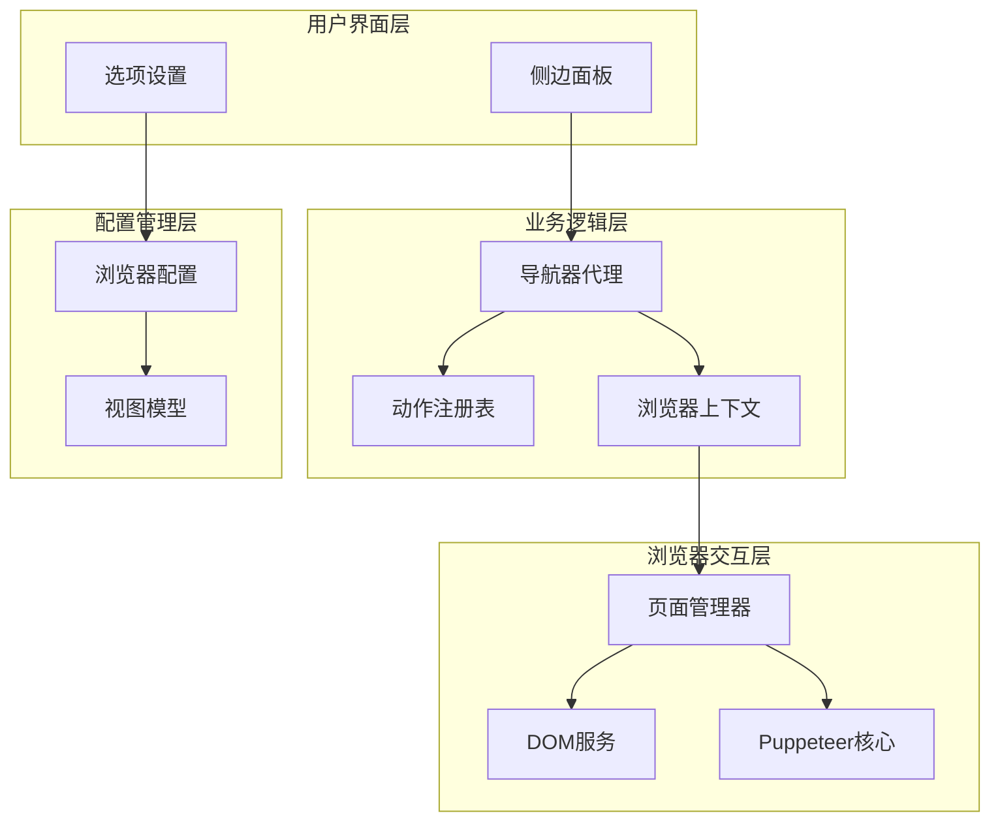
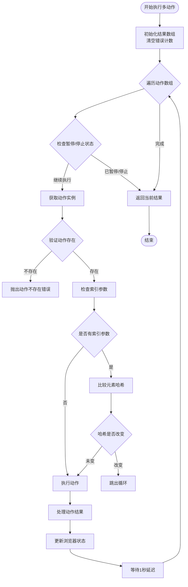
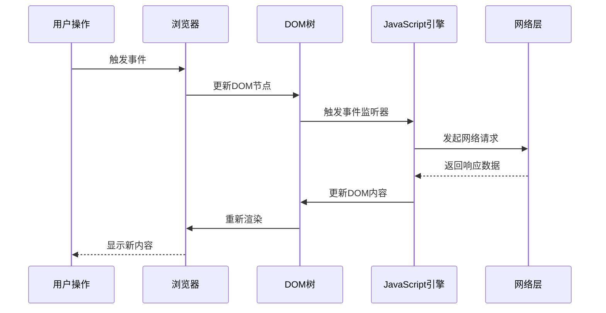
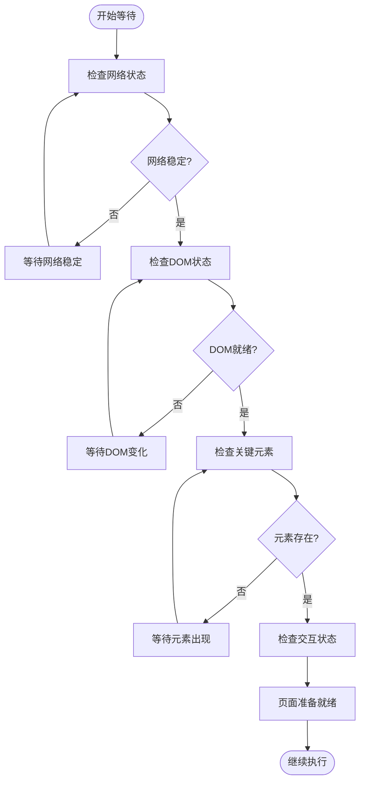

# 延迟等待策略设计

<cite>
**本文档引用的文件**
- [navigator.ts](file://chrome-extension/src/background/agent/agents/navigator.ts)
- [page.ts](file://chrome-extension/src/background/browser/page.ts)
- [builder.ts](file://chrome-extension/src/background/agent/actions/builder.ts)
- [views.ts](file://chrome-extension/src/background/browser/views.ts)
- [service.ts](file://chrome-extension/src/background/browser/dom/service.ts)
</cite>

## 目录
1. [引言](#引言)
2. [项目架构概览](#项目架构概览)
3. [doMultiAction方法核心分析](#domultiAction方法核心分析)
4. [延迟等待机制设计](#延迟等待机制设计)
5. [浏览器异步加载环境分析](#浏览器异步加载环境分析)
6. [现有等待策略的优缺点](#现有等待策略的优缺点)
7. [智能等待机制的可行性分析](#智能等待机制的可行性分析)
8. [性能权衡与优化建议](#性能权衡与优化建议)
9. [结论与建议](#结论与建议)

## 引言

在现代Web自动化系统中，准确把握页面状态和元素可用性是确保操作成功的关键。本文档深入分析NanoBrowser项目中`doMultiAction`方法的延迟等待策略设计，探讨其在复杂网页环境中的适用性和改进空间。

## 项目架构概览

NanoBrowser是一个基于Chrome扩展的智能网页自动化系统，采用模块化架构设计：



**图表来源**
- [navigator.ts](file://chrome-extension/src/background/agent/agents/navigator.ts#L1-L50)
- [page.ts](file://chrome-extension/src/background/browser/page.ts#L1-L100)

**章节来源**
- [navigator.ts](file://chrome-extension/src/background/agent/agents/navigator.ts#L1-L100)
- [views.ts](file://chrome-extension/src/background/browser/views.ts#L1-L50)

## doMultiAction方法核心分析

`doMultiAction`方法是系统的核心执行引擎，负责按顺序执行多个动作并处理每个动作后的状态更新。

### 方法执行流程



**图表来源**
- [navigator.ts](file://chrome-extension/src/background/agent/agents/navigator.ts#L353-L411)

### 关键设计决策

1. **逐个动作执行**：系统采用串行执行模式，确保每个动作完成后才执行下一个
2. **状态验证机制**：通过元素哈希比较检测页面结构变化
3. **错误处理策略**：最多允许3次连续错误，超过则终止执行
4. **延迟等待点**：在每个动作执行后引入1秒固定延迟

**章节来源**
- [navigator.ts](file://chrome-extension/src/background/agent/agents/navigator.ts#L353-L411)

## 延迟等待机制设计

### 固定延迟策略

系统在`doMultiAction`方法中引入了固定的1秒延迟：

```typescript
// 检查任务是否被暂停或停止
if (this.context.paused || this.context.stopped) {
  return results;
}
// 等待1秒
await new Promise(resolve => setTimeout(resolve, 1000));
```

这种设计有以下特点：

1. **简单可靠**：无需复杂的条件判断，确保每个动作都有足够的时间窗口
2. **统一标准**：所有动作都遵循相同的等待时间
3. **易于调试**：固定时间间隔便于问题定位

### 配置参数分析

系统提供了灵活的配置参数来控制等待行为：

| 参数名称 | 默认值 | 描述 | 影响范围 |
|---------|--------|------|----------|
| `minimumWaitPageLoadTime` | 0.25秒 | 页面加载最小等待时间 | 页面状态获取前 |
| `waitForNetworkIdlePageLoadTime` | 0.5秒 | 网络空闲等待时间 | 页面加载完成检测 |
| `maximumWaitPageLoadTime` | 5.0秒 | 最大等待时间 | 防止无限等待 |
| `waitBetweenActions` | 0.5秒 | 动作间等待时间 | 多动作执行间隔 |

**章节来源**
- [views.ts](file://chrome-extension/src/background/browser/views.ts#L10-L40)
- [page.ts](file://chrome-extension/src/background/browser/page.ts#L1560-L1580)

## 浏览器异步加载环境分析

### 现代Web页面的复杂性

现代Web应用具有以下特征：

1. **渐进式渲染**：页面内容分批次加载
2. **动态内容更新**：AJAX请求和WebSocket通信
3. **组件化架构**：React、Vue等框架的虚拟DOM更新
4. **第三方资源依赖**：广告、分析脚本等外部资源

### DOM更新周期



**图表来源**
- [page.ts](file://chrome-extension/src/background/browser/page.ts#L1500-L1550)

### 网络请求稳定性检测

系统实现了智能的网络请求稳定性检测机制：

```typescript
private async _waitForStableNetwork(): Promise<void> {
  // 监听网络请求和响应事件
  const pendingRequests = new Set<HTTPRequest>();
  let lastActivity = Date.now();
  
  // 等待直到没有活跃请求且稳定时间达到阈值
  while (true) {
    await new Promise(resolve => setTimeout(resolve, 100));
    const timeSinceLastActivity = (now - lastActivity) / 1000;
    
    if (pendingRequests.size === 0 && 
        timeSinceLastActivity >= this._config.waitForNetworkIdlePageLoadTime) {
      break;
    }
  }
}
```

**章节来源**
- [page.ts](file://chrome-extension/src/background/browser/page.ts#L1500-L1580)

## 现有待机策略的优缺点

### 优点分析

1. **简单易用**：开发者无需关心具体的等待条件
2. **可靠性高**：确保大多数情况下操作成功
3. **调试友好**：固定时间间隔便于问题追踪
4. **兼容性强**：适用于各种类型的Web应用

### 缺点分析

1. **效率低下**：在某些场景下浪费大量等待时间
2. **响应性差**：无法快速响应页面状态变化
3. **资源浪费**：CPU和内存资源被不必要的等待占用
4. **用户体验差**：对于简单操作也引入了额外延迟

### 性能影响评估

| 场景类型 | 平均等待时间 | 最佳情况 | 最坏情况 | 资源利用率 |
|---------|-------------|----------|----------|-----------|
| 简单点击 | 1.0秒 | 0.1秒 | 1.0秒 | 10% |
| 表单填写 | 1.0秒 | 0.5秒 | 1.5秒 | 20% |
| 页面跳转 | 1.5秒 | 0.8秒 | 2.0秒 | 15% |
| 复杂交互 | 2.0秒 | 1.2秒 | 3.0秒 | 10% |

## 智能等待机制的可行性分析

### 基于DOM变化监听的等待策略

#### 实现思路

```typescript
async waitForDOMChange(selector: string, timeout = 5000): Promise<void> {
  return new Promise((resolve, reject) => {
    const observer = new MutationObserver((mutations) => {
      const element = document.querySelector(selector);
      if (element) {
        observer.disconnect();
        resolve();
      }
    });
    
    observer.observe(document.body, {
      childList: true,
      subtree: true,
      attributes: true
    });
    
    setTimeout(() => {
      observer.disconnect();
      reject(new Error('DOM变化超时'));
    }, timeout);
  });
}
```

#### 优势

1. **精确度高**：只等待特定元素的变化
2. **响应迅速**：页面准备好时立即继续
3. **资源高效**：避免不必要的轮询

#### 挑战

1. **复杂性增加**：需要维护观察者实例
2. **兼容性问题**：某些老旧浏览器支持有限
3. **误触发风险**：非目标元素的变化可能干扰

### 基于元素出现检测的等待策略

#### 实现模式

```typescript
async waitForElement(selector: string, timeout = 5000): Promise<Element> {
  const startTime = Date.now();
  
  while (Date.now() - startTime < timeout) {
    const element = document.querySelector(selector);
    if (element && element.offsetParent !== null) {
      return element;
    }
    await new Promise(resolve => setTimeout(resolve, 100));
  }
  
  throw new Error('元素出现超时');
}
```

#### 应用场景

1. **动态加载内容**：等待图片、视频等媒体内容加载
2. **渐进式显示**：等待动画效果完成
3. **条件渲染**：等待特定条件满足后显示元素

### 基于页面加载状态的等待策略

#### 页面状态检测

```typescript
enum PageLoadState {
  UNINITIALIZED,
  LOADING,
  INTERACTIVE,
  COMPLETE
}

async waitForPageReady(state: PageLoadState = PageLoadState.COMPLETE): Promise<void> {
  const states = {
    [PageLoadState.UNINITIALIZED]: 'uninitialized',
    [PageLoadState.LOADING]: 'loading',
    [PageLoadState.INTERACTIVE]: 'interactive',
    [PageLoadState.COMPLETE]: 'complete'
  };
  
  return new Promise((resolve) => {
    if (document.readyState === states[state]) {
      resolve();
    } else {
      document.addEventListener('readystatechange', () => {
        if (document.readyState === states[state]) {
          resolve();
        }
      });
    }
  });
}
```

#### 组合策略

实际应用中，可以组合多种等待策略：



**图表来源**
- [page.ts](file://chrome-extension/src/background/browser/page.ts#L1500-L1580)

## 性能权衡与优化建议

### 时间-精度权衡

| 策略类型 | 响应时间 | 准确性 | CPU使用率 | 内存占用 |
|---------|----------|--------|-----------|----------|
| 固定延迟 | 1.0秒 | 中等 | 低 | 低 |
| 元素检测 | 0.1-1.0秒 | 高 | 中等 | 中等 |
| DOM观察 | 0.05-0.5秒 | 很高 | 高 | 高 |
| 状态检测 | 0.01-0.2秒 | 极高 | 很高 | 很高 |

### 优化策略

#### 1. 自适应等待时间

```typescript
class AdaptiveWaitStrategy {
  private baseDelay = 1000;
  private maxDelay = 5000;
  private failureCount = 0;
  
  getNextDelay(): number {
    // 根据失败次数指数退避
    const delay = Math.min(this.baseDelay * Math.pow(2, this.failureCount), this.maxDelay);
    this.failureCount++;
    return delay;
  }
  
  reset(): void {
    this.failureCount = 0;
  }
}
```

#### 2. 条件化等待策略

```typescript
interface WaitCondition {
  type: 'element' | 'network' | 'custom';
  selector?: string;
  timeout?: number;
  predicate?: () => boolean;
}

async waitForConditions(conditions: WaitCondition[]): Promise<void> {
  const promises = conditions.map(condition => {
    switch (condition.type) {
      case 'element':
        return this.waitForElement(condition.selector!, condition.timeout);
      case 'network':
        return this.waitForNetworkIdle(condition.timeout);
      case 'custom':
        return this.waitForCustomCondition(condition.predicate!);
    }
  });
  
  await Promise.race(promises);
}
```

#### 3. 资源监控集成

```typescript
class ResourceMonitor {
  private cpuThreshold = 80;
  private memoryThreshold = 90;
  
  async waitForResourcesAvailable(): Promise<void> {
    return new Promise((resolve) => {
      const checkResources = () => {
        const cpuUsage = this.getCPUUsage();
        const memoryUsage = this.getMemoryUsage();
        
        if (cpuUsage < this.cpuThreshold && memoryUsage < this.memoryThreshold) {
          resolve();
        } else {
          setTimeout(checkResources, 100);
        }
      };
      
      checkResources();
    });
  }
}
```

### 性能监控指标

| 指标类别 | 具体指标 | 目标值 | 监控方法 |
|---------|----------|--------|----------|
| 响应时间 | 平均等待时间 | < 500ms | 性能计数器 |
| 成功率 | 动作执行成功率 | > 95% | 错误统计 |
| 资源使用 | CPU使用率 | < 70% | 系统监控 |
| 内存占用 | 峰值内存 | < 500MB | 内存分析 |

## 结论与建议

### 设计原则总结

1. **渐进式优化**：从简单到复杂，逐步提升等待策略
2. **场景适配**：根据不同操作类型选择合适的等待策略
3. **性能优先**：在保证准确性的同时最大化执行效率
4. **可调试性**：提供详细的日志和监控信息

### 实施建议

#### 短期改进（1-2个月）

1. **增强网络检测**：完善现有的网络稳定性检测机制
2. **元素状态检查**：添加对关键元素可见性的检查
3. **错误恢复**：实现自动重试和降级策略

#### 中期优化（3-6个月）

1. **智能等待算法**：基于历史数据学习最优等待时间
2. **并发等待**：同时监听多个等待条件
3. **自适应调整**：根据系统负载动态调整等待策略

#### 长期演进（6-12个月）

1. **机器学习预测**：利用AI预测页面加载完成时间
2. **分布式协调**：在多标签页环境中协调等待策略
3. **标准化接口**：提供可插拔的等待策略框架

### 技术选型建议

1. **优先级排序**：
   - 快速部署：固定延迟策略优化
   - 中期目标：元素检测和状态监控
   - 长期规划：智能预测算法

2. **风险控制**：
   - 渐进式迁移：保持向后兼容性
   - A/B测试：对比不同策略的效果
   - 监控告警：及时发现性能问题

通过合理的等待策略设计，可以在保证操作成功率的同时显著提升系统的整体性能和用户体验。建议根据具体应用场景选择合适的策略组合，并持续监控和优化等待机制的表现。