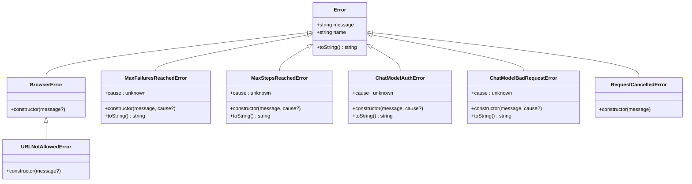
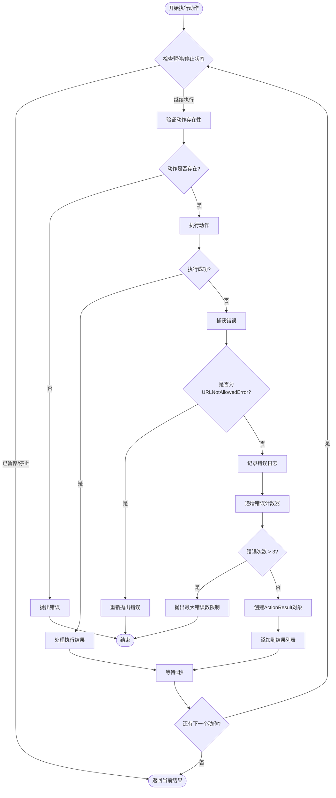
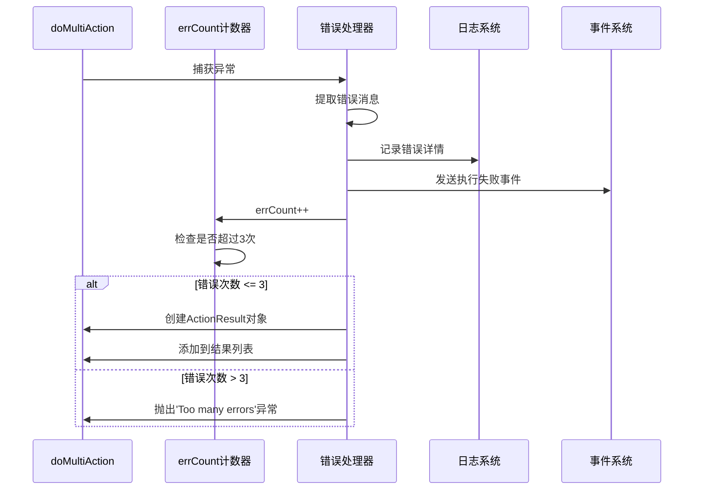
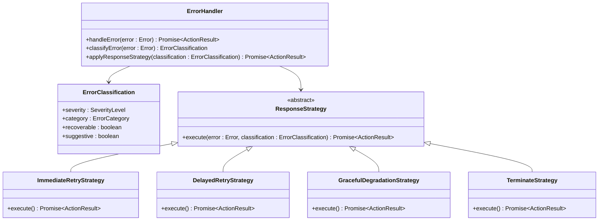

# 错误处理与重试机制

<cite>
**本文档引用的文件**
- [navigator.ts](file://chrome-extension/src/background/agent/agents/navigator.ts)
- [views.ts](file://chrome-extension/src/background/browser/views.ts)
- [errors.ts](file://chrome-extension/src/background/agent/agents/errors.ts)
- [types.ts](file://chrome-extension/src/background/agent/types.ts)
- [analytics.ts](file://chrome-extension/src/background/services/analytics.ts)
- [builder.ts](file://chrome-extension/src/background/agent/actions/builder.ts)
- [executor.ts](file://chrome-extension/src/background/agent/executor.ts)
</cite>

## 目录
1. [简介](#简介)
2. [核心错误处理架构](#核心错误处理架构)
3. [doMultiAction方法中的错误处理机制](#domultiAction方法中的错误处理机制)
4. [错误分类与处理策略](#错误分类与处理策略)
5. [ActionResult对象的错误封装](#actionresult对象的错误封装)
6. [重试机制分析](#重试机制分析)
7. [错误监控与追踪](#错误监控与追踪)
8. [当前机制的局限性](#当前机制的局限性)
9. [未来改进方向](#未来改进方向)
10. [总结](#总结)

## 简介

NanoBrowser项目实现了一套完整的错误处理与重试机制，专门针对浏览器自动化任务中的各种异常情况进行处理。该系统通过多层次的错误分类、智能的重试策略和详细的监控追踪，确保自动化任务的稳定性和可靠性。

## 核心错误处理架构

### 错误类型层次结构



**图表来源**
- [views.ts](file://chrome-extension/src/background/browser/views.ts#L142-L150)
- [errors.ts](file://chrome-extension/src/background/agent/agents/errors.ts#L227-L313)

### 错误处理流程



**图表来源**
- [navigator.ts](file://chrome-extension/src/background/agent/agents/navigator.ts#L353-L446)

**章节来源**
- [navigator.ts](file://chrome-extension/src/background/agent/agents/navigator.ts#L353-L446)
- [views.ts](file://chrome-extension/src/background/browser/views.ts#L142-L150)

## doMultiAction方法中的错误处理机制

### errCount计数器的工作原理

在`doMultiAction`方法中，`errCount`计数器是一个关键的错误控制机制：

```typescript
private async doMultiAction(actions: Record<string, unknown>[]): Promise<ActionResult[]> {
    const results: ActionResult[] = [];
    let errCount = 0;  // 初始化错误计数器
    // ...
    
    for (const [i, action] of actions.entries()) {
        // ... 动作执行逻辑 ...
        
        try {
            // 执行动作逻辑
            const result = await actionInstance.call(actionArgs);
            
            // 正常处理结果
            results.push(result);
        } catch (error) {
            // 错误处理逻辑
            errCount++;
            if (errCount > 3) {
                throw new Error('Too many errors in actions');
            }
            
            // 创建包含错误信息的ActionResult
            results.push(new ActionResult({
                error: errorMessage,
                isDone: false,
                includeInMemory: true,
            }));
        }
    }
    
    return results;
}
```

### 连续错误检测机制

系统通过以下机制检测连续错误：

1. **实时计数**：每次捕获错误时立即递增`errCount`
2. **阈值检查**：当`errCount > 3`时触发终止条件
3. **快速失败**：一旦达到最大错误次数，立即抛出异常终止整个动作序列

### 异常捕获块的处理流程



**图表来源**
- [navigator.ts](file://chrome-extension/src/background/agent/agents/navigator.ts#L420-L446)

**章节来源**
- [navigator.ts](file://chrome-extension/src/background/agent/agents/navigator.ts#L353-L446)

## 错误分类与处理策略

### URLNotAllowedError的特殊处理

`URLNotAllowedError`是一种特殊的错误类型，具有独特的处理策略：

```typescript
catch (error) {
    if (error instanceof URLNotAllowedError) {
        throw error;  // 直接重新抛出，不计入errCount
    }
    // 其他错误的处理逻辑...
}
```

这种设计的原因：
- **安全考虑**：阻止访问被禁止的URL是系统的核心功能
- **明确失败**：URL访问被拒绝应该导致任务立即终止
- **用户体验**：向用户清晰地传达权限问题

### 其他错误的统一处理

对于所有非`URLNotAllowedError`的错误，系统采用统一的处理策略：

```typescript
const errorMessage = error instanceof Error ? error.message : String(error);
logger.error(
    'doAction error',
    actionName,
    JSON.stringify(actionArgs, null, 2),
    JSON.stringify(errorMessage, null, 2),
);
// 发送事件通知
this.context.emitEvent(Actors.NAVIGATOR, ExecutionState.ACT_FAIL, errorMessage);
```

### 错误类型分类函数

系统提供了多种错误类型检测函数：

| 函数名 | 用途 | 检测标准 |
|--------|------|----------|
| `isAuthenticationError()` | 验证认证错误 | 包含"authentication"或"401"关键字 |
| `isBadRequestError()` | 验证请求错误 | 包含"400"或"badrequest"关键字 |
| `isForbiddenError()` | 验证权限错误 | 包含"403 Forbidden" |
| `isAbortedError()` | 验证取消错误 | 错误名称为"AbortError"或包含"Aborted" |
| `isExtensionConflictError()` | 验证扩展冲突 | 包含"chrome-extension"相关描述 |

**章节来源**
- [navigator.ts](file://chrome-extension/src/background/agent/agents/navigator.ts#L420-L446)
- [errors.ts](file://chrome-extension/src/background/agent/agents/errors.ts#L120-L178)

## ActionResult对象的错误封装

### 错误信息的封装方式

当发生错误时，系统会创建一个专门的`ActionResult`对象来封装错误信息：

```typescript
results.push(
    new ActionResult({
        error: errorMessage,           // 错误消息内容
        isDone: false,                // 标记任务未完成
        includeInMemory: true,        // 包含在记忆中以便后续参考
    }),
);
```

### ActionResult属性详解

| 属性名 | 类型 | 默认值 | 用途 |
|--------|------|--------|------|
| `isDone` | `boolean` | `false` | 标记任务是否已完成 |
| `success` | `boolean` | `false` | 标记操作是否成功 |
| `error` | `string \| null` | `null` | 错误信息（仅在失败时设置） |
| `extractedContent` | `string \| null` | `null` | 提取的内容（仅在成功时设置） |
| `includeInMemory` | `boolean` | `false` | 是否包含在记忆中 |
| `interactedElement` | `DOMHistoryElement \| null` | `null` | 交互的元素信息 |

### includeInMemory策略的应用

`includeInMemory`标志决定了错误信息是否会被存储在记忆中：

```typescript
// 在addStateMessageToMemory方法中
if (r.error) {
    const errorText = r.error.toString().trim();
    const lastLine = errorText.split('\n').pop() || '';
    const msg = new HumanMessage(`Action error: ${lastLine}`);
    messageManager.addMessageWithTokens(msg);  // 存储错误信息
}
```

这种策略的优势：
- **调试支持**：保留错误信息便于问题诊断
- **上下文保持**：错误信息有助于理解后续动作的上下文
- **历史追踪**：完整的执行历史便于回溯分析

**章节来源**
- [navigator.ts](file://chrome-extension/src/background/agent/agents/navigator.ts#L420-L446)
- [types.ts](file://chrome-extension/src/background/agent/types.ts#L105-L152)

## 重试机制分析

### 当前重试机制的局限性

尽管系统实现了基本的错误处理，但其重试机制存在明显的局限性：

#### 1. 固定阈值限制
```typescript
if (errCount > 3) {
    throw new Error('Too many errors in actions');
}
```
**问题**：
- **硬编码阈值**：3次错误限制是固定的，无法适应不同场景
- **缺乏灵活性**：无法根据错误类型调整重试策略
- **无动态调整**：不考虑任务复杂度或环境因素

#### 2. 缺乏智能重试策略
系统没有实现基于错误类型的智能重试：
- **相同错误重复尝试**：即使某个错误反复出现，系统也不会改变策略
- **无退避算法**：重试之间没有指数退避或随机延迟
- **无上下文感知**：不考虑页面状态或网络状况的变化

#### 3. 缺少错误分类细化
```typescript
// 统一处理所有非URLNotAllowedError
const errorMessage = error instanceof Error ? error.message : String(error);
```
**问题**：
- **粗粒度过滤**：所有错误都被同等对待
- **丢失错误特征**：无法识别特定类型的错误模式
- **缺乏针对性策略**：无法为不同错误类型制定专门的处理方案

### 历史重试机制的对比

系统还实现了基于历史记录的重试机制，这与当前的实时错误处理形成对比：

```typescript
while (retryCount < maxRetries && !success) {
    try {
        // 执行历史动作
        const stepResults = await this.executeHistoryActions(parsedOutput, historyItem, delay);
        results.push(...stepResults);
        success = true;
    } catch (error) {
        retryCount++;
        // 重试逻辑
    }
}
```

**章节来源**
- [navigator.ts](file://chrome-extension/src/background/agent/agents/navigator.ts#L353-L446)
- [navigator.ts](file://chrome-extension/src/background/agent/agents/navigator.ts#L531-L666)

## 错误监控与追踪

### 错误分类系统

系统实现了完整的错误分类和追踪机制：

```mermaid
flowchart TD
Error[错误发生] --> Categorize{错误分类}
Categorize --> TypeBased[类型基础分类]
TypeBased --> ErrorType[ERROR_TYPE_CATEGORIES]
TypeBased --> MessageBased[消息模式匹配]
MessageBased --> Patterns[MESSAGE_PATTERNS]
ErrorType --> AuthError[认证错误<br/>ChatModelAuthError]
ErrorType --> BadRequest[请求错误<br/>ChatModelBadRequestError]
ErrorType --> NetworkError[网络错误<br/>NetworkError]
ErrorType --> TimeoutError[超时错误<br/>TimeoutError]
Patterns --> ElementNotFound[element not found]
Patterns --> NetworkPattern[network|fetch|connection]
Patterns --> TimeoutPattern[timeout|timed out]
Patterns --> PermissionDenied[permission|denied|forbidden]
AuthError --> Track[追踪事件]
BadRequest --> Track
NetworkError --> Track
TimeoutError --> Track
ElementNotFound --> Track
NetworkPattern --> Track
TimeoutPattern --> Track
PermissionDenied --> Track
```

**图表来源**
- [analytics.ts](file://chrome-extension/src/background/services/analytics.ts#L15-L50)
- [analytics.ts](file://chrome-extension/src/background/services/analytics.ts#L205-L245)

### AnalyticsService的错误追踪功能

系统通过`AnalyticsService`提供详细的错误追踪：

| 方法名 | 功能 | 参数 |
|--------|------|------|
| `trackTaskFailed()` | 跟踪任务失败 | `taskId: string, errorCategory: string` |
| `trackTaskComplete()` | 跟踪任务完成 | `taskId: string` |
| `trackTaskStart()` | 跟踪任务开始 | `taskId: string` |
| `trackTaskCancelled()` | 跟踪任务取消 | `taskId: string` |
| `categorizeError()` | 错误分类 | `error: Error \| string` |

### 错误类别映射表

| JavaScript错误类型 | 分类标识符 | 描述 |
|-------------------|------------|------|
| `ChatModelAuthError` | `llm_auth_error` | 大语言模型认证错误 |
| `ChatModelBadRequestError` | `llm_bad_request_error` | 大语言模型请求错误 |
| `ChatModelForbiddenError` | `llm_forbidden_error` | 大语言模型权限错误 |
| `URLNotAllowedError` | `url_blocked_error` | URL访问被阻止 |
| `RequestCancelledError` | `request_cancelled_error` | 请求被取消 |
| `ExtensionConflictError` | `extension_conflict_error` | 扩展冲突 |
| `MaxStepsReachedError` | `max_steps_reached` | 达到最大步骤数 |
| `MaxFailuresReachedError` | `max_failures_reached` | 达到最大失败次数 |

**章节来源**
- [analytics.ts](file://chrome-extension/src/background/services/analytics.ts#L15-L50)
- [errors.ts](file://chrome-extension/src/background/agent/agents/errors.ts#L15-L50)

## 当前机制的局限性

### 技术层面的限制

1. **静态错误阈值**
   - 固定的3次错误阈值无法适应不同复杂度的任务
   - 缺乏自适应机制来调整重试策略

2. **缺乏上下文感知**
   - 错误处理不考虑页面状态变化
   - 无法识别临时性故障和永久性错误的区别

3. **无智能恢复策略**
   - 不同类型的错误需要不同的恢复策略
   - 缺少基于历史数据的学习能力

### 用户体验方面的不足

1. **错误信息不够详细**
   - 当前的错误信息可能不足以帮助用户理解问题
   - 缺少具体的解决方案建议

2. **缺乏进度反馈**
   - 用户无法了解错误处理的进展
   - 重试过程缺乏透明度

3. **配置选项有限**
   - 用户无法自定义错误处理行为
   - 缺少针对特定场景的配置选项

### 可扩展性问题

1. **错误类型扩展困难**
   - 新的错误类型需要修改多个模块
   - 缺少插件化的错误处理框架

2. **监控系统耦合度高**
   - 错误追踪与业务逻辑紧密耦合
   - 难以独立部署和维护监控功能

**章节来源**
- [navigator.ts](file://chrome-extension/src/background/agent/agents/navigator.ts#L353-L446)
- [errors.ts](file://chrome-extension/src/background/agent/agents/errors.ts#L227-L313)

## 未来改进方向

### 动态重试次数配置

#### 实现方案
```typescript
interface RetryConfig {
    maxRetries: number;
    baseDelay: number;
    maxDelay: number;
    multiplier: number;
    jitter: boolean;
    failureThreshold: number;
}

class AdaptiveRetryStrategy {
    private configs: Map<string, RetryConfig>;
    
    getRetryConfig(errorType: string): RetryConfig {
        // 基于错误类型的动态配置
        return this.configs.get(errorType) || this.getDefaultConfig();
    }
    
    calculateDelay(attempt: number, config: RetryConfig): number {
        const delay = Math.min(
            config.baseDelay * Math.pow(config.multiplier, attempt),
            config.maxDelay
        );
        return config.jitter ? delay * (1 + Math.random() * 0.1) : delay;
    }
}
```

#### 改进优势
- **自适应阈值**：根据错误类型动态调整最大重试次数
- **指数退避**：避免对服务器造成过大压力
- **随机抖动**：减少惊群效应
- **上下文感知**：考虑网络状况和系统负载

### 错误类型分级响应

#### 实现架构


#### 分级响应策略

| 严重级别 | 错误类别 | 响应策略 | 示例错误 |
|----------|----------|----------|----------|
| 致命 | 网络连接中断 | 立即终止 | `NetworkError` |
| 高危 | 权限被拒绝 | 立即终止 | `ChatModelForbiddenError` |
| 中等 | 临时性故障 | 延迟重试 | `TimeoutError` |
| 低危 | 元素未找到 | 渐进式重试 | `ElementNotFoundError` |
| 信息 | 配置警告 | 记录并继续 | `InvalidInputError` |

### 智能学习与优化

#### 机器学习集成
```typescript
class LearningErrorHandler {
    private errorPatterns: Map<string, ErrorPattern>;
    private performanceMetrics: PerformanceMetrics;
    
    async handleAndLearn(error: Error, context: ExecutionContext): Promise<ActionResult> {
        const classification = this.classifyError(error);
        const pattern = this.identifyPattern(error, context);
        
        // 更新学习模型
        await this.updateModel(pattern, classification);
        
        // 基于学习结果选择策略
        const strategy = this.selectOptimalStrategy(pattern);
        return await strategy.execute(error, classification);
    }
    
    private identifyPattern(error: Error, context: ExecutionContext): ErrorPattern {
        // 基于历史数据和上下文识别错误模式
        return new ErrorPattern(error, context);
    }
}
```

#### 性能指标监控
- **错误频率统计**：跟踪不同类型错误的发生频率
- **恢复成功率**：监控不同策略的成功率
- **响应时间分析**：测量错误处理的平均耗时
- **资源使用情况**：监控内存和CPU使用情况

### 用户界面增强

#### 实时错误报告
```typescript
interface ErrorReport {
    timestamp: number;
    errorType: string;
    severity: 'low' | 'medium' | 'high' | 'critical';
    description: string;
    suggestedAction: string;
    progress: number;
    estimatedTimeRemaining: number;
}

class ErrorReportingService {
    reportError(report: ErrorReport): void {
        // 更新用户界面
        this.updateUI(report);
        
        // 发送通知
        this.sendNotification(report);
        
        // 记录到分析系统
        this.analytics.trackError(report);
    }
}
```

#### 可配置的错误处理规则
- **自定义阈值**：允许用户设置不同的错误阈值
- **优先级排序**：让用户可以调整错误处理的优先级
- **通知偏好**：配置错误通知的方式和频率
- **自动修复选项**：启用或禁用自动修复功能

**章节来源**
- [analytics.ts](file://chrome-extension/src/background/services/analytics.ts#L205-L245)
- [errors.ts](file://chrome-extension/src/background/agent/agents/errors.ts#L15-L50)

## 总结

NanoBrowser项目的错误处理与重试机制展现了现代自动化系统的设计理念。通过多层次的错误分类、智能的错误封装和全面的监控追踪，系统能够在复杂的浏览器环境中保持稳定运行。

### 关键成就

1. **完善的错误分类体系**：从基础的JavaScript错误到特定领域的专业错误，形成了完整的分类体系
2. **灵活的错误处理策略**：针对不同类型的错误采用差异化的处理方式
3. **全面的监控追踪**：通过AnalyticsService实现详细的错误追踪和性能监控
4. **可扩展的架构设计**：模块化的设计便于未来的功能扩展和优化

### 技术亮点

- **URLNotAllowedError的特殊处理**：体现了系统对安全性的重视
- **ActionResult的统一错误封装**：确保了错误信息的一致性和完整性
- **多层级的错误检测函数**：提供了精确的错误类型识别能力
- **智能的错误分类算法**：结合类型检测和消息模式匹配

### 改进空间

虽然当前的错误处理机制已经相当完善，但仍存在一些改进空间：

1. **动态重试策略**：需要引入自适应的重试机制
2. **智能错误预测**：可以通过机器学习预测潜在的错误
3. **更精细的错误分类**：需要建立更细粒度的错误类型体系
4. **更好的用户体验**：需要提供更直观的错误报告和处理界面

### 未来展望

随着人工智能技术的发展和用户需求的增长，错误处理与重试机制将继续演进。未来的系统可能会更加智能化、自适应化，能够根据历史数据和实时环境自动调整处理策略，为用户提供更加稳定可靠的自动化体验。

通过持续的技术创新和用户反馈，NanoBrowser的错误处理机制将不断优化，为浏览器自动化领域树立新的标准。