# 执行流程控制

<cite>
**本文档中引用的文件**
- [navigator.ts](file://chrome-extension/src/background/agent/agents/navigator.ts)
- [base.ts](file://chrome-extension/src/background/agent/agents/base.ts)
- [history.ts](file://chrome-extension/src/background/agent/history.ts)
- [types.ts](file://chrome-extension/src/background/agent/types.ts)
- [builder.ts](file://chrome-extension/src/background/agent/actions/builder.ts)
- [views.ts](file://chrome-extension/src/background/browser/views.ts)
- [errors.ts](file://chrome-extension/src/background/agent/agents/errors.ts)
- [service.ts](file://chrome-extension/src/background/agent/messages/service.ts)
- [context.ts](file://chrome-extension/src/background/browser/context.ts)
</cite>

## 目录
1. [概述](#概述)
2. [执行生命周期架构](#执行生命周期架构)
3. [状态消息管理](#状态消息管理)
4. [LLM调用机制](#llm调用机制)
5. [动作序列执行](#动作序列执行)
6. [异常处理与恢复](#异常处理与恢复)
7. [历史记录持久化](#历史记录持久化)
8. [数据流追踪](#数据流追踪)
9. [性能优化策略](#性能优化策略)
10. [总结](#总结)

## 概述

NavigatorAgent.execute方法是整个导航代理系统的核心执行引擎，负责协调浏览器状态监控、LLM推理、动作执行和结果收集的完整生命周期。该方法采用严格的错误处理机制和状态管理策略，确保在复杂网页交互场景下的稳定性和可靠性。

## 执行生命周期架构

NavigatorAgent.execute方法遵循严格的三阶段执行模式：初始化阶段、推理阶段和执行阶段，每个阶段都有明确的状态检查和错误处理机制。

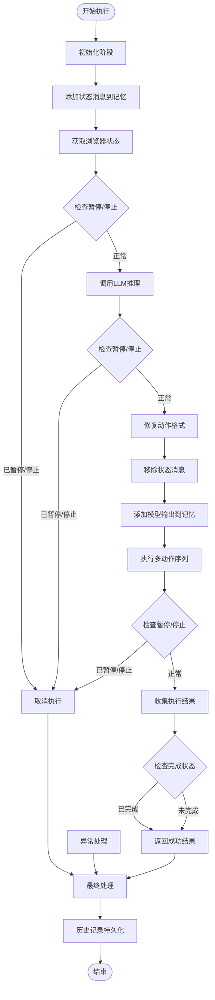

**图表来源**
- [navigator.ts](file://chrome-extension/src/background/agent/agents/navigator.ts#L145-L257)

**节来源**
- [navigator.ts](file://chrome-extension/src/background/agent/agents/navigator.ts#L145-L257)

## 状态消息管理

### addStateMessageToMemory方法详解

addStateMessageToMemory方法负责将当前浏览器状态注入对话上下文，建立智能代理与环境之间的状态连接。

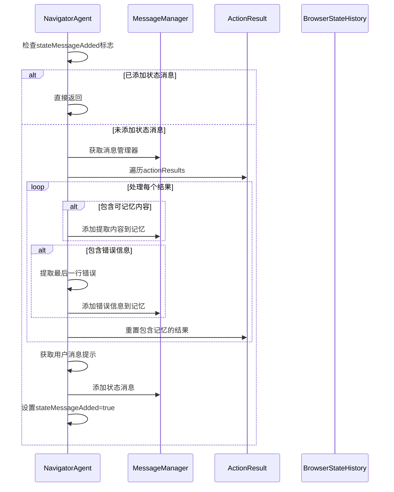

**图表来源**
- [navigator.ts](file://chrome-extension/src/background/agent/agents/navigator.ts#L259-L295)

#### 内存清理机制

状态消息管理包含智能的内存清理策略，确保历史动作结果不会重复影响后续推理：

1. **条件性包含**：只有标记为`includeInMemory`的动作结果才会被添加到记忆
2. **错误信息处理**：提取错误的最后一行，避免冗余信息污染记忆
3. **自动重置**：处理完成后自动重置相关动作结果，防止重复处理

**节来源**
- [navigator.ts](file://chrome-extension/src/background/agent/agents/navigator.ts#L259-L295)

### removeLastStateMessageFromMemory方法

该方法提供精确的状态消息移除功能，确保记忆空间的有效利用：

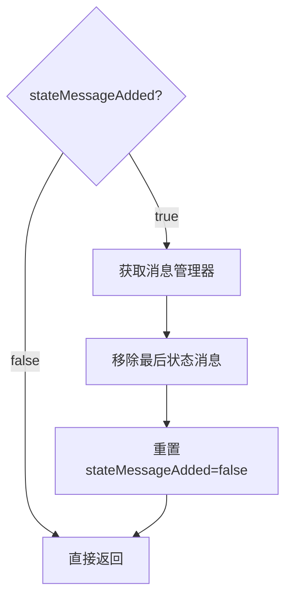

**图表来源**
- [navigator.ts](file://chrome-extension/src/background/agent/agents/navigator.ts#L297-L303)

**节来源**
- [navigator.ts](file://chrome-extension/src/background/agent/agents/navigator.ts#L297-L303)

## LLM调用机制

### 双模式调用架构

NavigatorAgent采用智能的双模式调用机制，优先使用结构化输出以获得最佳性能，失败时自动降级到JSON解析容错策略。

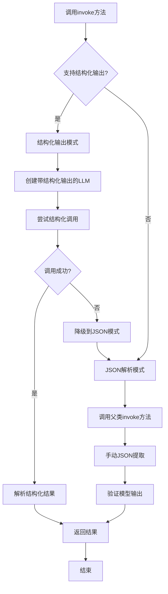

**图表来源**
- [navigator.ts](file://chrome-extension/src/background/agent/agents/navigator.ts#L105-L144)
- [base.ts](file://chrome-extension/src/background/agent/agents/base.ts#L95-L210)

### 结构化输出实现

结构化输出模式提供最高性能和最准确的结果解析：

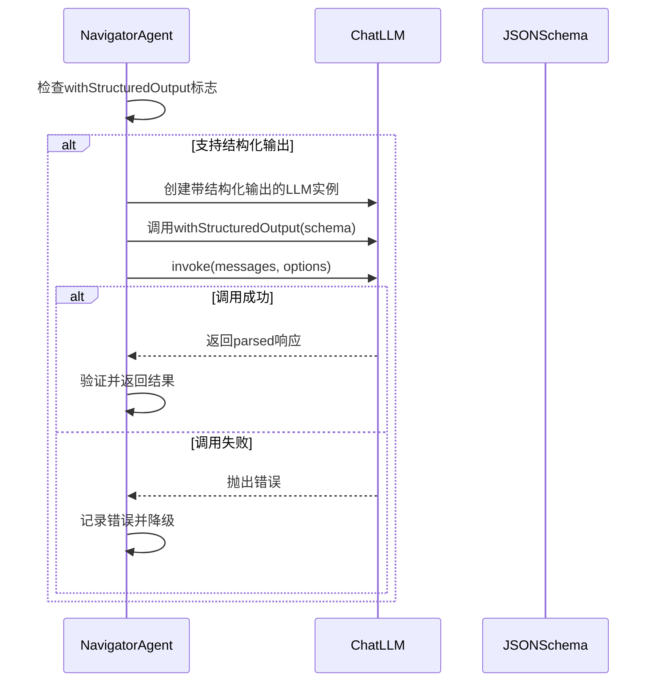

**图表来源**
- [navigator.ts](file://chrome-extension/src/background/agent/agents/navigator.ts#L105-L144)

### 容错策略

当结构化输出不可用时，系统自动启用JSON解析容错机制：

1. **手动JSON提取**：从原始响应中提取JSON字符串
2. **语法修复**：尝试修复损坏的JSON格式
3. **严格验证**：确保解析结果符合预期模式

**节来源**
- [navigator.ts](file://chrome-extension/src/background/agent/agents/navigator.ts#L105-L144)
- [base.ts](file://chrome-extension/src/background/agent/agents/base.ts#L95-L210)

## 动作序列执行

### doMultiAction核心逻辑

doMultiAction方法实现了复杂的动作序列执行，包含暂停检测、异常处理和智能等待策略。

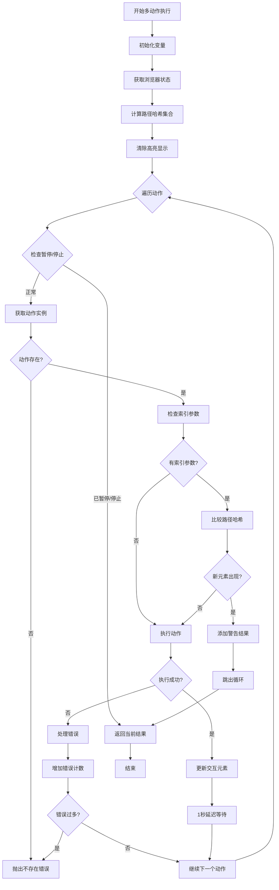

**图表来源**
- [navigator.ts](file://chrome-extension/src/background/agent/agents/navigator.ts#L355-L450)

### 暂停/停止检测机制

系统在多个关键点实施暂停/停止检测，确保用户能够及时中断长时间运行的任务：

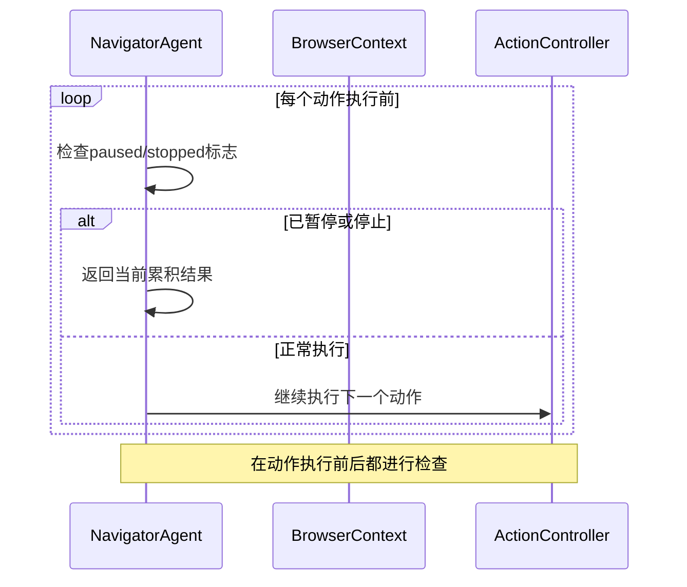

**图表来源**
- [navigator.ts](file://chrome-extension/src/background/agent/agents/navigator.ts#L355-L450)

### 1秒延迟等待策略

1秒延迟设计考虑了以下因素：

1. **页面加载时间**：给浏览器足够时间处理DOM变化
2. **网络请求完成**：确保异步操作完成
3. **用户体验**：避免过于频繁的操作导致界面卡顿
4. **资源平衡**：在响应性和系统负载之间取得平衡

**节来源**
- [navigator.ts](file://chrome-extension/src/background/agent/agents/navigator.ts#L355-L450)

## 异常处理与恢复

### 错误分类处理

系统对不同类型的错误采用专门的处理策略：

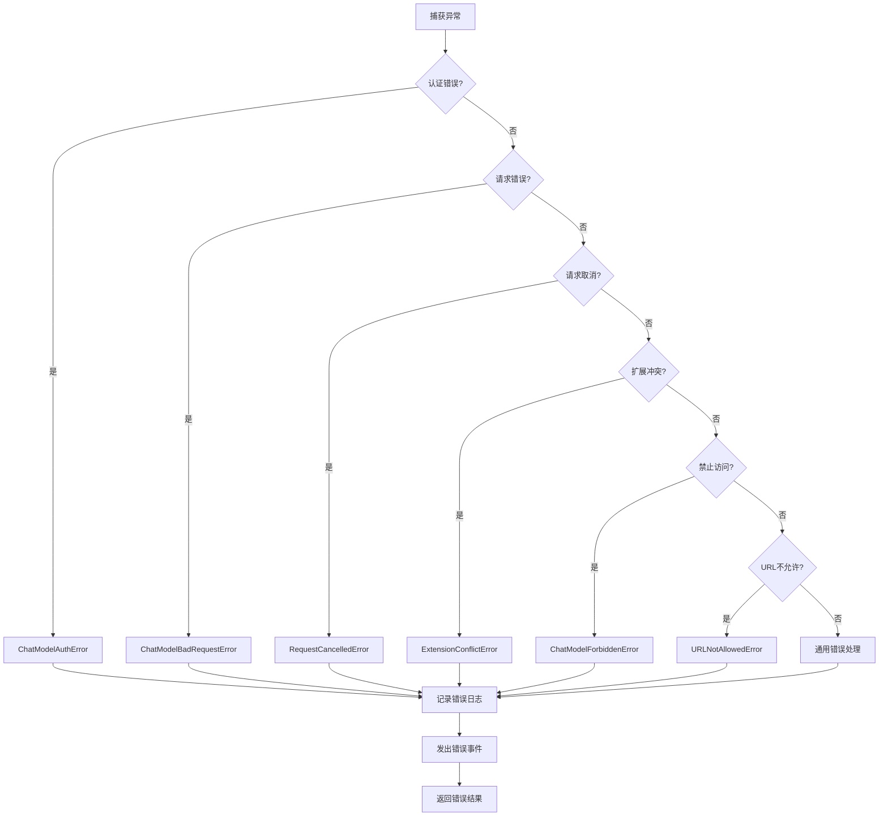

**图表来源**
- [navigator.ts](file://chrome-extension/src/background/agent/agents/navigator.ts#L200-L230)

### 错误恢复策略

系统实现了多层次的错误恢复机制：

1. **即时错误处理**：单个动作失败不影响整体流程
2. **错误计数限制**：最多允许3次连续错误
3. **状态清理**：确保错误发生时清理相关状态
4. **事件通知**：向用户报告具体错误信息

**节来源**
- [navigator.ts](file://chrome-extension/src/background/agent/agents/navigator.ts#L200-L230)

## 历史记录持久化

### AgentStepRecord封装

AgentStepRecord类负责封装单步执行的所有关键信息：

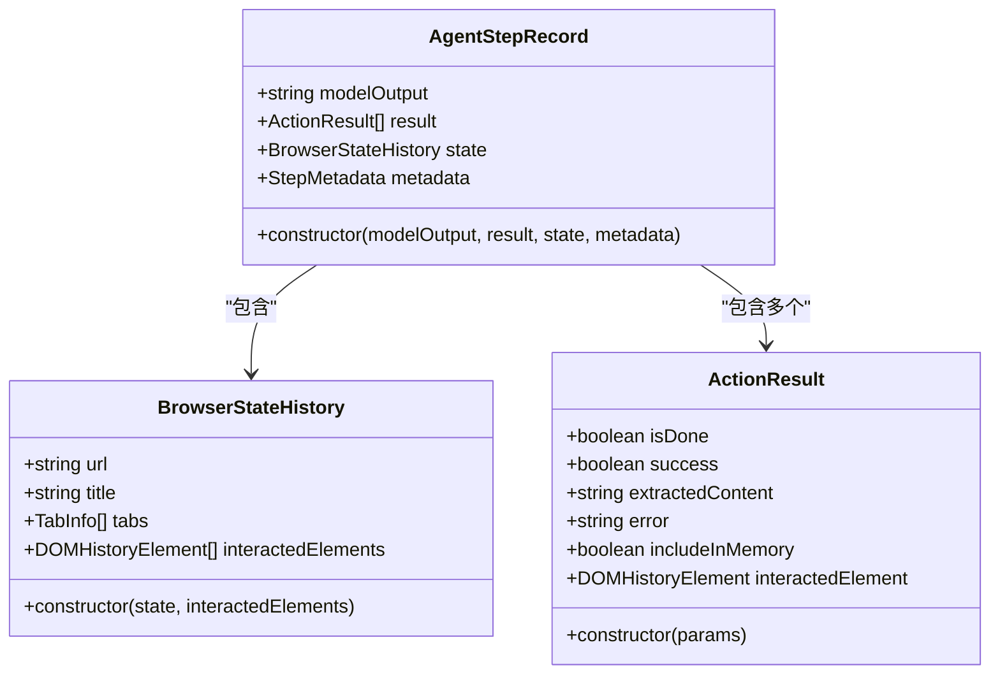

**图表来源**
- [history.ts](file://chrome-extension/src/background/agent/history.ts#L3-L29)

### 最终处理阶段

finally块确保即使在异常情况下也能正确保存执行历史：

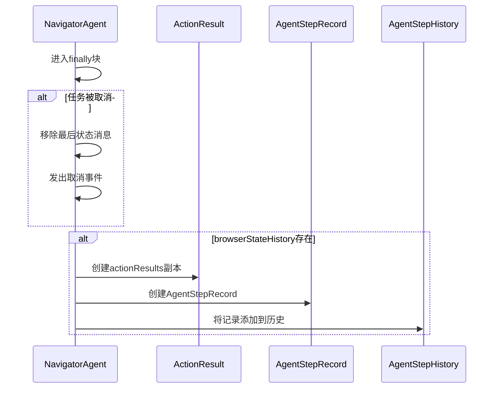

**图表来源**
- [navigator.ts](file://chrome-extension/src/background/agent/agents/navigator.ts#L232-L257)

**节来源**
- [navigator.ts](file://chrome-extension/src/background/agent/agents/navigator.ts#L232-L257)
- [history.ts](file://chrome-extension/src/background/agent/history.ts#L3-L29)

## 数据流追踪

### 典型任务执行流程

让我们追踪一个典型任务从输入到输出的完整数据流：

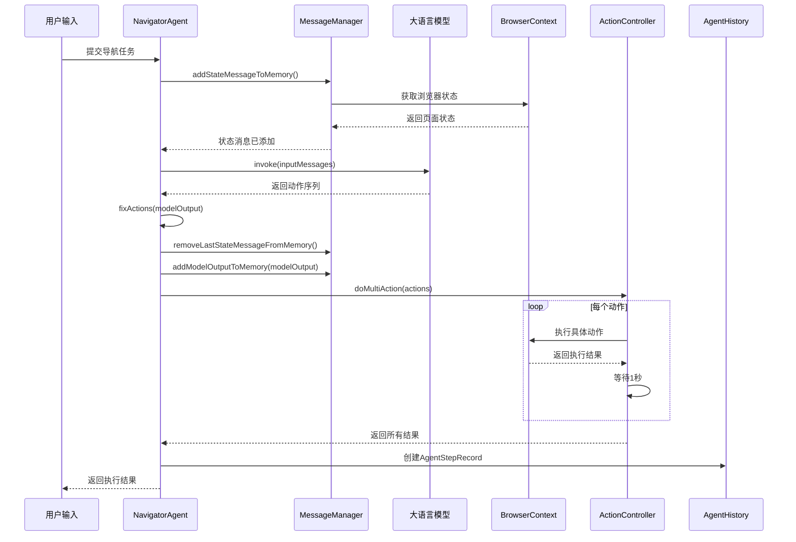

**图表来源**
- [navigator.ts](file://chrome-extension/src/background/agent/agents/navigator.ts#L145-L257)

### actionResults收集机制

actionResults数组作为执行过程中的重要中间状态，记录每个动作的执行情况：

| 字段名 | 类型 | 描述 | 示例值 |
|--------|------|------|--------|
| isDone | boolean | 是否完成任务 | true/false |
| success | boolean | 动作是否成功执行 | true/false |
| extractedContent | string \| null | 提取的内容 | "点击成功" |
| error | string \| null | 错误信息 | "元素不存在" |
| includeInMemory | boolean | 是否包含在记忆中 | true/false |
| interactedElement | DOMHistoryElement \| null | 交互的元素 | DOM节点信息 |

**节来源**
- [navigator.ts](file://chrome-extension/src/background/agent/agents/navigator.ts#L145-L257)

## 性能优化策略

### 缓存机制

系统实现了多层次的缓存策略以提升性能：

1. **浏览器状态缓存**：避免重复获取相同的页面状态
2. **DOM元素哈希缓存**：快速检测页面元素变化
3. **动作结果缓存**：减少重复计算开销

### 并发控制

通过暂停/停止检测机制实现智能并发控制：

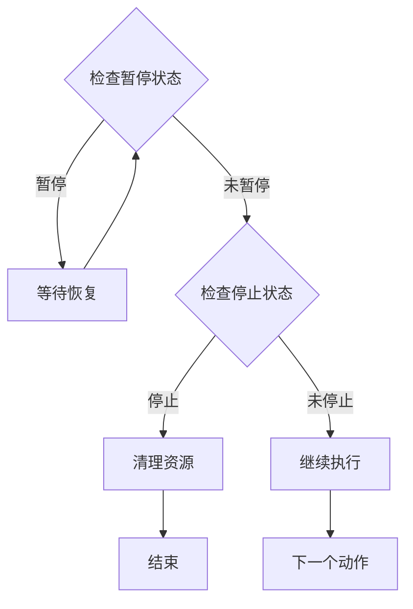

### 内存管理

系统采用主动的内存管理策略：

1. **及时清理**：动作执行完成后立即清理临时状态
2. **选择性保留**：只保留重要的历史记录
3. **批量处理**：优化大量数据的处理效率

## 总结

NavigatorAgent.execute方法展现了现代智能代理系统的最佳实践，通过以下关键特性确保了可靠性和效率：

### 核心优势

1. **健壮的错误处理**：多层次的异常捕获和恢复机制
2. **智能状态管理**：动态的记忆管理和状态同步
3. **灵活的执行策略**：双模式LLM调用和自适应等待策略
4. **完善的审计跟踪**：完整的执行历史记录和状态快照

### 设计原则

- **模块化架构**：清晰的职责分离和接口定义
- **容错设计**：最小化单点故障的影响范围
- **性能优化**：智能缓存和资源管理策略
- **可维护性**：良好的代码组织和文档注释

### 应用价值

该执行流程控制机制为复杂的网页自动化任务提供了坚实的基础，支持从简单的表单填写到复杂的多步骤导航等各种应用场景，是构建智能浏览器代理系统的核心组件。