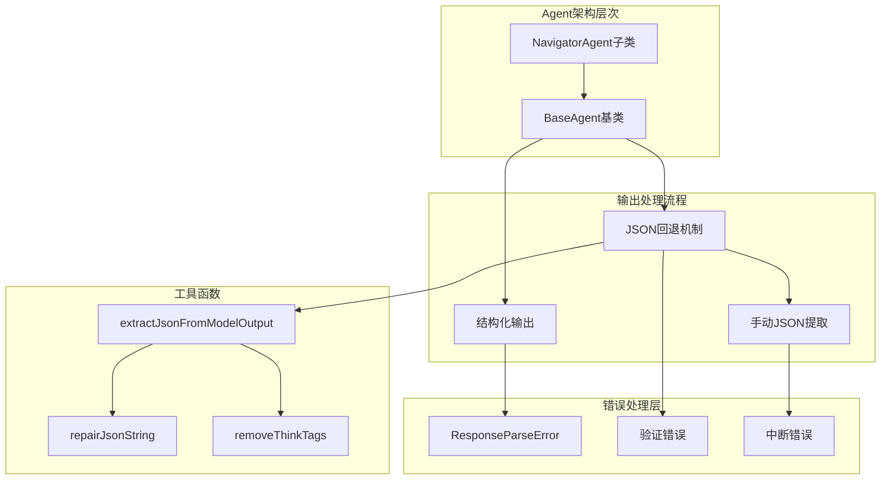
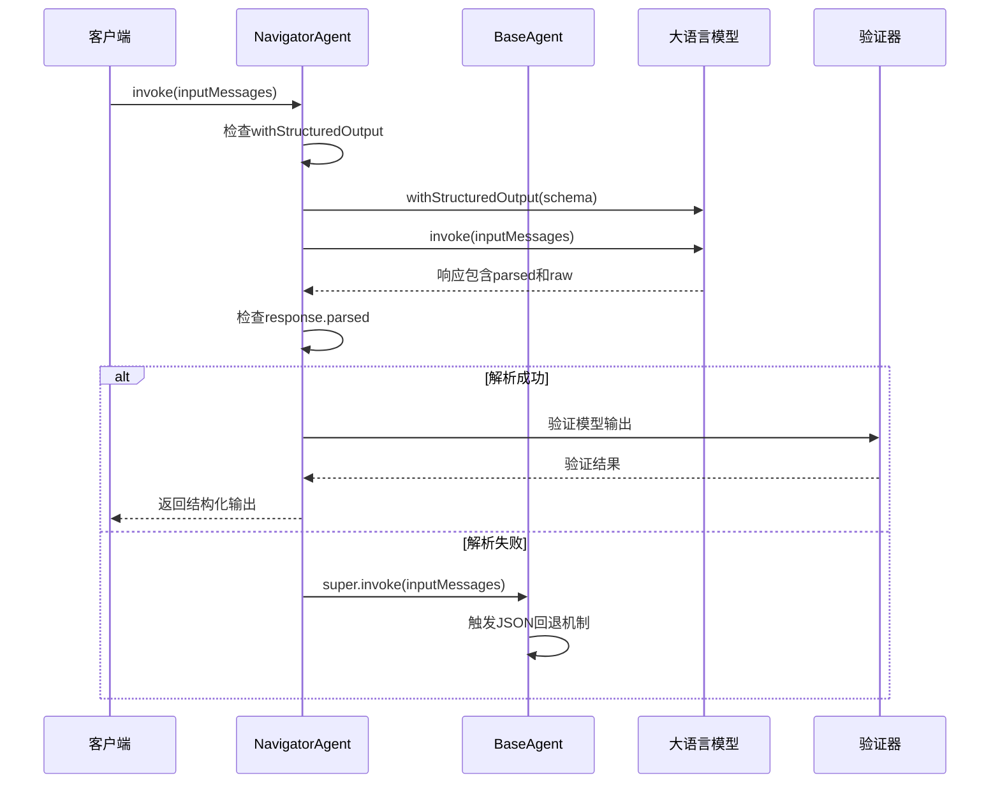
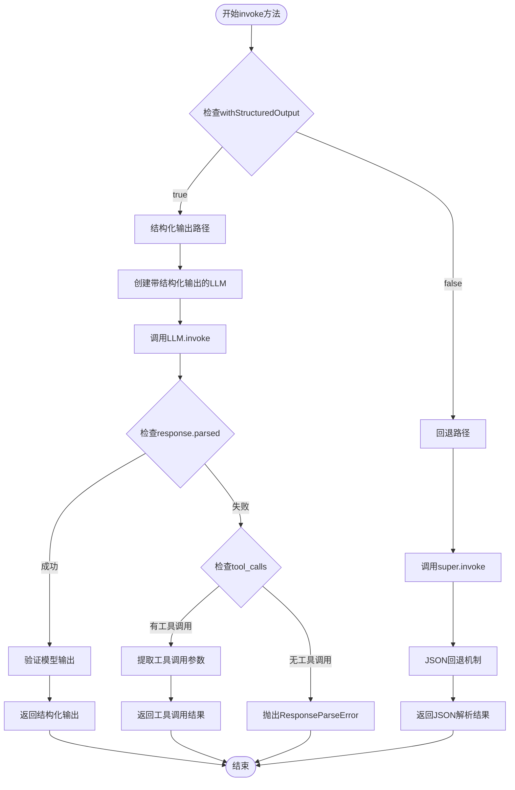
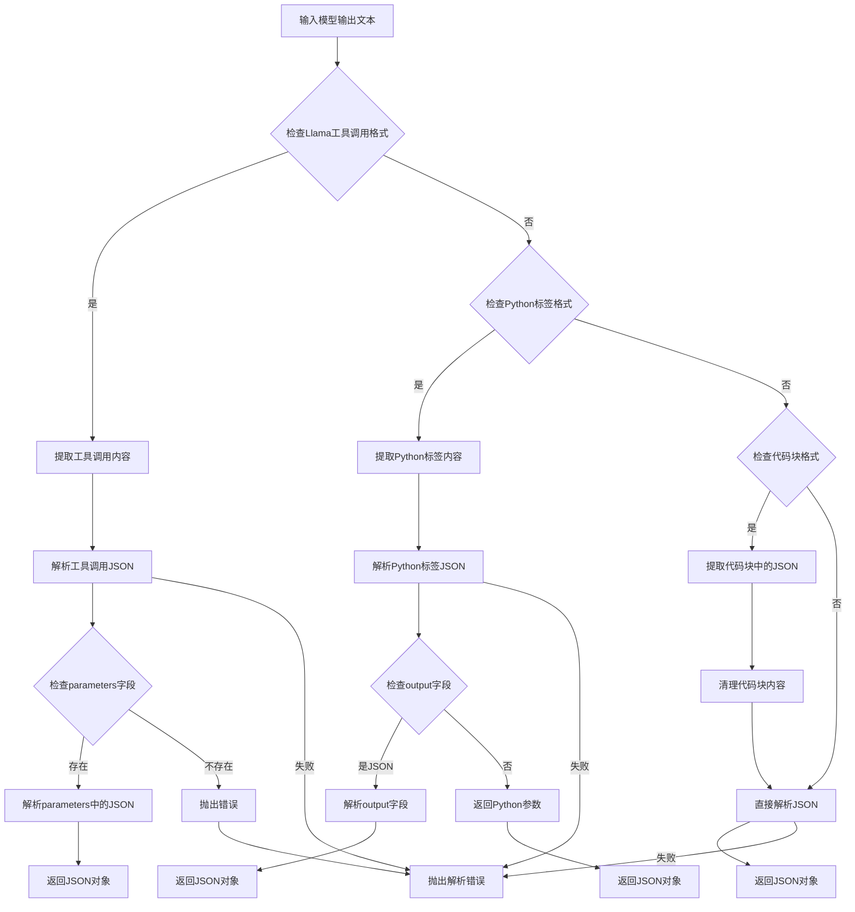
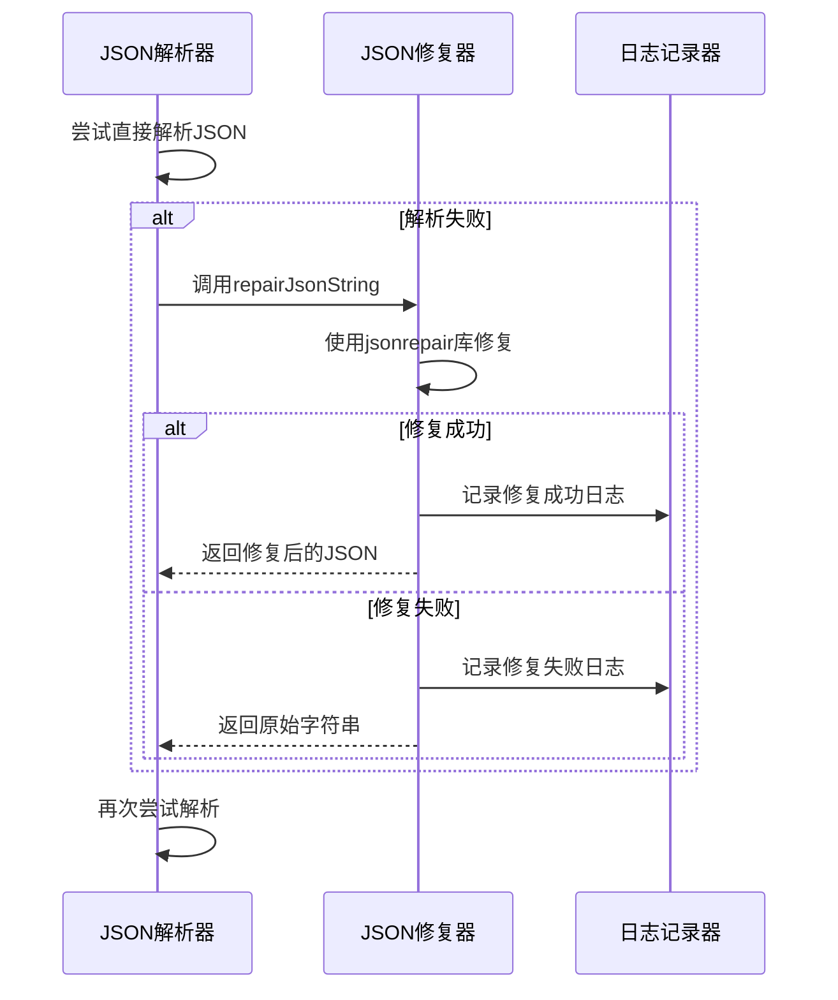
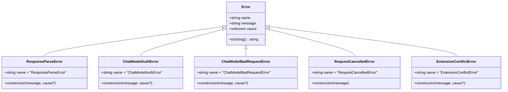
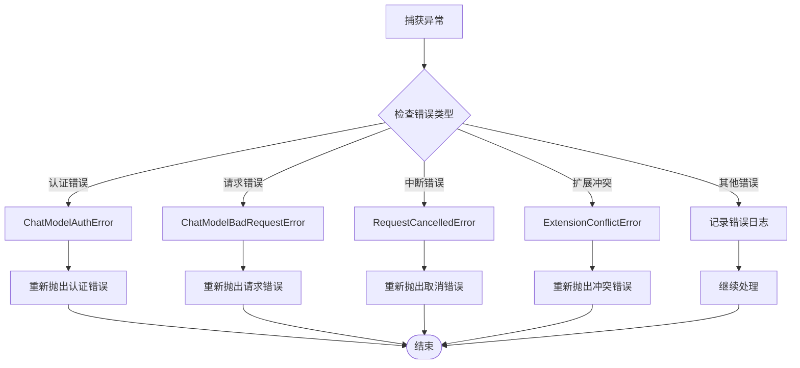
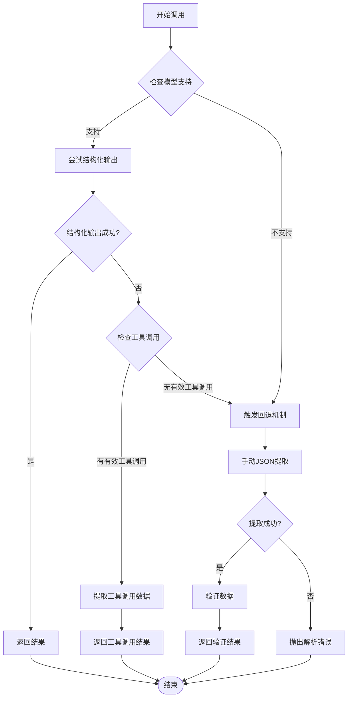

# JSON回退机制

<cite>
**本文档中引用的文件**
- [navigator.ts](file://chrome-extension/src/background/agent/agents/navigator.ts)
- [base.ts](file://chrome-extension/src/background/agent/agents/base.ts)
- [utils.ts](file://chrome-extension/src/background/agent/messages/utils.ts)
- [errors.ts](file://chrome-extension/src/background/agent/agents/errors.ts)
- [utils.ts](file://chrome-extension/src/background/utils.ts)
- [types.ts](file://chrome-extension/src/background/agent/types.ts)
</cite>

## 目录
1. [简介](#简介)
2. [系统架构概览](#系统架构概览)
3. [结构化输出与JSON回退机制](#结构化输出与json回退机制)
4. [NavigatorAgent.invoke方法分析](#navigatoragentinvoke方法分析)
5. [JSON解析与回退流程](#json解析与回退流程)
6. [错误处理与异常传播](#错误处理与异常传播)
7. [性能与可靠性对比](#性能与可靠性对比)
8. [触发条件与使用场景](#触发条件与使用场景)
9. [实际代码示例](#实际代码示例)
10. [最佳实践与优化建议](#最佳实践与优化建议)

## 简介

在NanoBrowser项目中，JSON回退机制是一个关键的设计模式，用于处理当结构化输出不可用或失败时的容错处理。该机制确保即使在LLM（大语言模型）不支持结构化输出的情况下，系统仍能从非结构化的响应中提取出有效的JSON数据。

该机制的核心思想是：优先尝试使用结构化输出（如果模型支持），当结构化输出失败时，自动降级到手动JSON提取的回退策略。这种设计提供了更好的兼容性和可靠性，同时保持了类型安全的优势。

## 系统架构概览



**图表来源**
- [base.ts](file://chrome-extension/src/background/agent/agents/base.ts#L117-L209)
- [navigator.ts](file://chrome-extension/src/background/agent/agents/navigator.ts#L86-L162)

## 结构化输出与JSON回退机制

### 结构化输出机制

结构化输出是现代LLM的重要特性，它允许模型按照预定义的模式生成输出。在NanoBrowser中，结构化输出通过以下方式实现：



**图表来源**
- [base.ts](file://chrome-extension/src/background/agent/agents/base.ts#L117-L162)
- [navigator.ts](file://chrome-extension/src/background/agent/agents/navigator.ts#L86-L162)

### JSON回退机制原理

当结构化输出不可用时，系统会自动切换到JSON回退机制。这个过程涉及多个步骤：

1. **模型兼容性检测**：系统首先检查当前使用的LLM是否支持结构化输出
2. **回退触发**：当结构化输出失败时，自动触发回退机制
3. **内容预处理**：移除思考标签、格式化文本等
4. **JSON提取**：从非结构化文本中提取JSON内容
5. **数据验证**：使用Zod模式验证提取的数据

**节来源**
- [base.ts](file://chrome-extension/src/background/agent/agents/base.ts#L117-L209)
- [navigator.ts](file://chrome-extension/src/background/agent/agents/navigator.ts#L86-L162)

## NavigatorAgent.invoke方法分析

### 方法签名与职责

NavigatorAgent的invoke方法是整个回退机制的核心入口点。该方法继承自BaseAgent，并实现了特定于导航任务的输出处理逻辑。



**图表来源**
- [navigator.ts](file://chrome-extension/src/background/agent/agents/navigator.ts#L86-L162)

### 结构化输出处理逻辑

当withStructuredOutput为true时，方法会尝试使用结构化输出功能：

1. **LLM配置**：使用`withStructuredOutput`方法配置LLM
2. **响应处理**：检查`response.parsed`字段
3. **工具调用处理**：如果解析失败但存在工具调用，尝试从工具调用中提取数据
4. **错误处理**：捕获并处理各种可能的错误情况

**节来源**
- [navigator.ts](file://chrome-extension/src/background/agent/agents/navigator.ts#L86-L162)

### 回退机制触发点

当结构化输出失败时，系统会自动调用父类的invoke方法：

```typescript
// Fallback to parent class manual JSON extraction for models without structured output support
return super.invoke(inputMessages);
```

这行代码是整个回退机制的关键触发点，它确保了系统的向后兼容性。

**节来源**
- [navigator.ts](file://chrome-extension/src/background/agent/agents/navigator.ts#L158-L162)

## JSON解析与回退流程

### extractJsonFromModelOutput函数详解

这是JSON回退机制的核心函数，负责从非结构化的模型输出中提取JSON数据。



**图表来源**
- [utils.ts](file://chrome-extension/src/background/agent/messages/utils.ts#L48-L134)

### 支持的JSON提取格式

extractJsonFromModelOutput函数支持多种JSON提取格式：

| 格式类型 | 检测标识 | 提取方法 | 示例 |
|---------|---------|---------|------|
| 工具调用格式 | `<\|tool_call_start_id\|>` | 提取标签间内容 | `<\|tool_call_start_id\|>{...}<\|tool_call_end_id\|>` |
| Python标签格式 | `<\|python_tag\|>` | 提取Python标签内容 | `<\|python_tag\|>{...}<\|/python_tag\|>` |
| 代码块格式 | ``` | 提取代码块内容 | ```json<br/>{...}<br/>``` |
| 直接JSON | 无特殊标记 | 直接解析 | `{...}` |

**节来源**
- [utils.ts](file://chrome-extension/src/background/agent/messages/utils.ts#L48-L134)

### JSON修复机制

当JSON格式不完整时，系统会尝试修复JSON字符串：



**图表来源**
- [utils.ts](file://chrome-extension/src/background/utils.ts#L30-L43)

**节来源**
- [utils.ts](file://chrome-extension/src/background/utils.ts#L30-L43)

## 错误处理与异常传播

### 错误类型分类

系统定义了多种错误类型来处理不同的异常情况：



**图表来源**
- [errors.ts](file://chrome-extension/src/background/agent/agents/errors.ts#L275-L313)

### 错误处理流程



**图表来源**
- [navigator.ts](file://chrome-extension/src/background/agent/agents/navigator.ts#L200-L230)

### 异常传播机制

系统采用分层的异常传播机制：

1. **本地处理**：在invoke方法内部处理特定的错误情况
2. **类型转换**：将通用错误转换为具体的业务错误类型
3. **向上抛出**：将错误传递给调用者进行进一步处理
4. **日志记录**：记录详细的错误信息用于调试

**节来源**
- [navigator.ts](file://chrome-extension/src/background/agent/agents/navigator.ts#L200-L230)

## 性能与可靠性对比

### 结构化输出 vs JSON回退

| 特性 | 结构化输出 | JSON回退 |
|-----|-----------|----------|
| **性能** | 更快，直接解析 | 较慢，需要文本处理 |
| **可靠性** | 取决于模型支持 | 更高，兼容性更好 |
| **类型安全性** | 完整的类型检查 | 运行时类型检查 |
| **错误恢复** | 有限的恢复能力 | 强大的修复机制 |
| **资源消耗** | 较低 | 较高（文本处理开销） |
| **适用场景** | 现代LLM | 所有LLM |

### 性能优化策略

为了平衡性能和可靠性，系统采用了以下优化策略：

1. **智能检测**：根据模型名称和提供商自动选择最优策略
2. **缓存机制**：缓存已验证的输出结果
3. **早期退出**：在检测到明显错误时立即终止
4. **批量处理**：对多个消息进行批量预处理

**节来源**
- [base.ts](file://chrome-extension/src/background/agent/agents/base.ts#L80-L116)

## 触发条件与使用场景

### 结构化输出不可用的场景

结构化输出回退机制会在以下情况下被触发：



**图表来源**
- [base.ts](file://chrome-extension/src/background/agent/agents/base.ts#L117-L209)
- [navigator.ts](file://chrome-extension/src/background/agent/agents/navigator.ts#L86-L162)

### 具体触发条件

1. **模型不支持**：某些旧版本或特定提供商的模型不支持结构化输出
2. **API限制**：API调用参数配置不当导致结构化输出失败
3. **网络问题**：网络连接不稳定导致请求失败
4. **格式错误**：模型返回的格式不符合预期
5. **权限问题**：API密钥或权限不足

### 使用场景分析

| 场景 | 推荐策略 | 原因 |
|-----|---------|------|
| 生产环境 | 优先使用结构化输出 | 性能和类型安全优先 |
| 开发测试 | 启用回退机制 | 兼容性测试需要 |
| 旧版模型 | 强制使用回退 | 结构化输出不可用 |
| 不稳定网络 | 启用重试机制 | 网络问题导致失败 |
| 自定义模型 | 配置回退策略 | 模型定制化程度高 |

**节来源**
- [base.ts](file://chrome-extension/src/background/agent/agents/base.ts#L80-L116)

## 实际代码示例

### 基本使用示例

以下展示了如何使用NavigatorAgent的invoke方法：

```typescript
// 基本调用示例
const navigator = new NavigatorAgent(actionRegistry, options);
try {
    const result = await navigator.invoke(inputMessages);
    // 处理结构化输出
    console.log('导航结果:', result);
} catch (error) {
    if (error instanceof ResponseParseError) {
        console.error('响应解析失败:', error.message);
    }
}
```

### JSON回退处理示例

```typescript
// 手动JSON提取示例
const rawContent = "```json\n{\"action\": [{\"click\": {\"index\": 1}}]}\n```";
try {
    const jsonData = extractJsonFromModelOutput(rawContent);
    console.log('提取的JSON:', jsonData);
} catch (error) {
    console.error('JSON提取失败:', error.message);
}
```

### 错误处理示例

```typescript
// 错误处理示例
try {
    const result = await navigator.invoke(messages);
} catch (error) {
    if (isAuthenticationError(error)) {
        console.error('认证失败，请检查API密钥');
    } else if (isBadRequestError(error)) {
        console.error('请求格式错误');
    } else if (isAbortedError(error)) {
        console.error('操作被用户取消');
    } else {
        console.error('未知错误:', error.message);
    }
}
```

**节来源**
- [navigator.ts](file://chrome-extension/src/background/agent/agents/navigator.ts#L86-L162)
- [utils.ts](file://chrome-extension/src/background/agent/messages/utils.ts#L48-L134)
- [errors.ts](file://chrome-extension/src/background/agent/agents/errors.ts#L120-L180)

## 最佳实践与优化建议

### 设计原则

1. **渐进增强**：优先使用高级功能，降级时保持基本可用性
2. **错误隔离**：不同类型的错误应该有不同的处理策略
3. **日志记录**：充分记录错误信息便于调试
4. **性能监控**：监控回退机制的使用频率和性能影响

### 优化建议

1. **模型选择**：优先选择支持结构化输出的现代LLM
2. **输入预处理**：在调用前对输入消息进行标准化处理
3. **缓存策略**：缓存已验证的输出结果避免重复计算
4. **超时控制**：设置合理的超时时间防止长时间阻塞
5. **重试机制**：对于临时性错误实施指数退避重试

### 调试技巧

1. **启用详细日志**：在开发环境中启用DEBUG级别的日志
2. **监控指标**：跟踪结构化输出的成功率和回退频率
3. **测试覆盖**：编写单元测试覆盖各种错误场景
4. **性能基准**：建立性能基准测试回退机制的影响

### 安全考虑

1. **输入验证**：对所有输入进行严格验证
2. **输出过滤**：过滤潜在的恶意内容
3. **权限控制**：确保只有授权的操作可以触发回退机制
4. **审计日志**：记录所有回退操作的详细信息

通过合理使用JSON回退机制，系统能够在保证类型安全的同时，提供更好的兼容性和可靠性，这是现代AI应用中不可或缺的设计模式。