# 模型调用机制深度解析

<cite>
**本文档中引用的文件**
- [navigator.ts](file://chrome-extension/src/background/agent/agents/navigator.ts)
- [base.ts](file://chrome-extension/src/background/agent/agents/base.ts)
- [errors.ts](file://chrome-extension/src/background/agent/agents/errors.ts)
- [utils.ts](file://chrome-extension/src/background/utils.ts)
- [context.ts](file://chrome-extension/src/background/browser/context.ts)
- [utils.ts](file://chrome-extension/src/background/agent/messages/utils.ts)
- [builder.ts](file://chrome-extension/src/background/agent/actions/builder.ts)
</cite>

## 目录
1. [引言](#引言)
2. [项目架构概览](#项目架构概览)
3. [NavigatorAgent.invoke方法详解](#navigatoragentinvoke方法详解)
4. [双模式调用机制](#双模式调用机制)
5. [结构化输出模式](#结构化输出模式)
6. [手动JSON提取模式](#手动json提取模式)
7. [工具调用处理](#工具调用处理)
8. [错误处理与容错机制](#错误处理与容错机制)
9. [模型生命周期追踪](#模型生命周期追踪)
10. [LLM提供商兼容性](#llm提供商兼容性)
11. [性能优化考虑](#性能优化考虑)
12. [总结](#总结)

## 引言

NavigatorAgent.invoke方法是NanoBrowser项目中的核心组件，它实现了智能的双模式调用机制，能够根据不同的LLM提供商和模型特性自动选择最优的响应解析策略。该方法不仅支持现代LLM的结构化输出能力，还具备强大的容错机制，确保在各种复杂场景下都能稳定运行。

本文档将深入分析这个方法的实现细节，包括其双模式调用机制、结构化输出处理、工具调用解析、错误恢复策略等关键特性。

## 项目架构概览

NanoBrowser采用模块化的架构设计，主要包含以下几个核心层次：

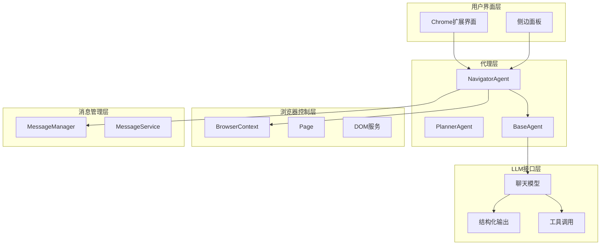

**图表来源**
- [navigator.ts](file://chrome-extension/src/background/agent/agents/navigator.ts#L74-L665)
- [base.ts](file://chrome-extension/src/background/agent/agents/base.ts#L34-L209)
- [context.ts](file://chrome-extension/src/background/browser/context.ts#L15-L360)

**章节来源**
- [navigator.ts](file://chrome-extension/src/background/agent/agents/navigator.ts#L1-L665)
- [base.ts](file://chrome-extension/src/background/agent/agents/base.ts#L1-L211)

## NavigatorAgent.invoke方法详解

NavigatorAgent.invoke方法是整个系统的核心入口点，它实现了智能的响应解析机制：

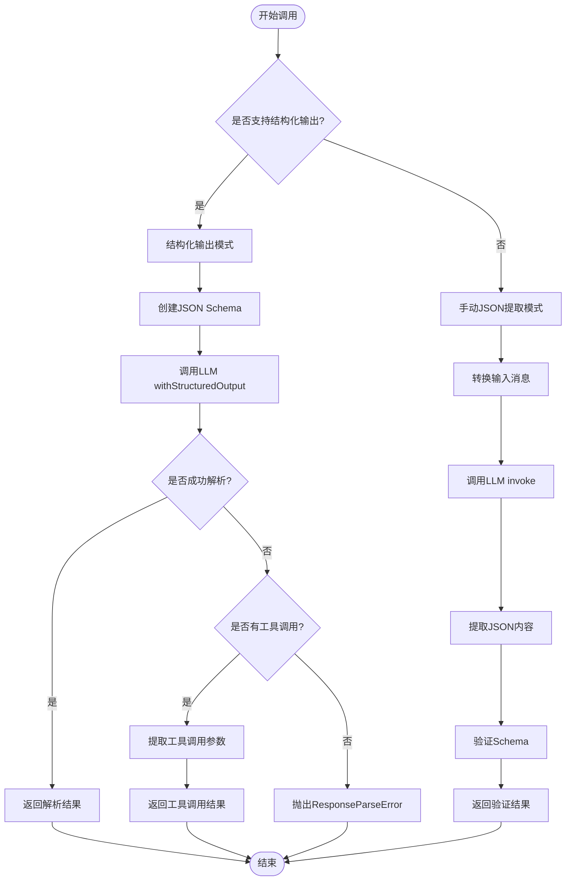

**图表来源**
- [navigator.ts](file://chrome-extension/src/background/agent/agents/navigator.ts#L92-L143)
- [base.ts](file://chrome-extension/src/background/agent/agents/base.ts#L106-L118)

**章节来源**
- [navigator.ts](file://chrome-extension/src/background/agent/agents/navigator.ts#L92-L143)

## 双模式调用机制

双模式调用机制是NavigatorAgent.invoke方法的核心特性，它能够根据模型的能力自动选择最适合的调用方式：

### 结构化输出检测逻辑

系统通过以下逻辑判断是否启用结构化输出：

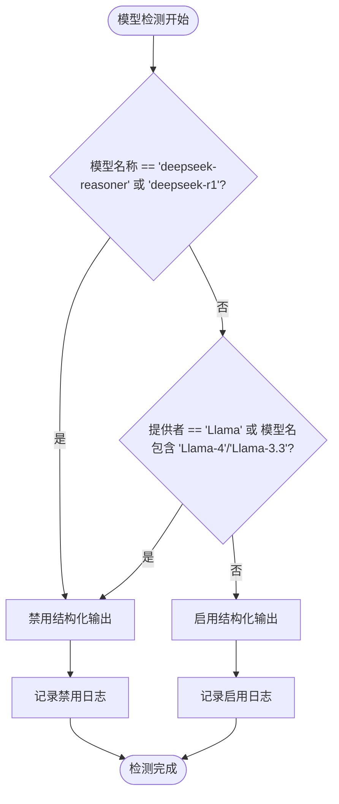

**图表来源**
- [base.ts](file://chrome-extension/src/background/agent/agents/base.ts#L106-L118)

### 模式切换决策流程

| 模型类型 | 结构化输出支持 | 手动提取支持 | 切换条件 |
|---------|---------------|-------------|----------|
| DeepSeek系列 | ❌ | ✅ | 特殊禁用规则 |
| Llama API | ❌ | ✅ | 提供商检测 |
| OpenAI系列 | ✅ | ✅ | 默认启用 |
| Groq系列 | ✅ | ✅ | 默认启用 |
| 其他模型 | ✅ | ✅ | 默认启用 |

**章节来源**
- [base.ts](file://chrome-extension/src/background/agent/agents/base.ts#L106-L118)

## 结构化输出模式

结构化输出模式是现代LLM的最佳实践，它直接利用模型的原生结构化输出能力：

### convertZodToJsonSchema转换过程

系统使用Zod模式定义复杂的输出结构，并将其转换为JSON Schema格式：

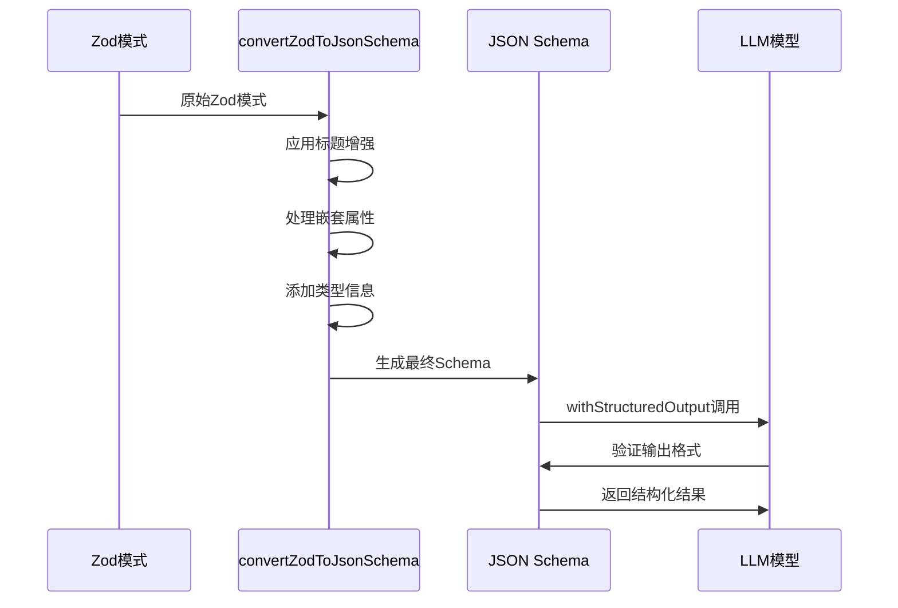

**图表来源**
- [utils.ts](file://chrome-extension/src/background/utils.ts#L106-L126)
- [navigator.ts](file://chrome-extension/src/background/agent/agents/navigator.ts#L86-L88)

### 结构化输出配置

结构化输出模式的关键配置参数：

| 参数 | 类型 | 描述 | 默认值 |
|------|------|------|--------|
| includeRaw | boolean | 是否包含原始响应 | true |
| name | string | 工具名称 | `${agentId}_output` |
| schema | object | JSON Schema定义 | 动态生成 |

**章节来源**
- [navigator.ts](file://chrome-extension/src/background/agent/agents/navigator.ts#L96-L100)

### tool_calls处理逻辑

当结构化输出失败但存在tool_calls时，系统会执行特殊的回退处理：

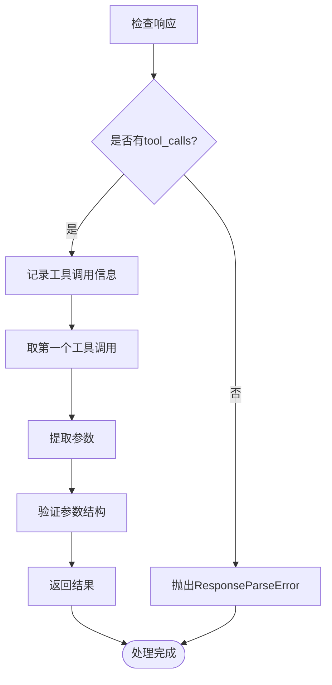

**图表来源**
- [navigator.ts](file://chrome-extension/src/background/agent/agents/navigator.ts#L128-L143)

**章节来源**
- [navigator.ts](file://chrome-extension/src/background/agent/agents/navigator.ts#L128-L143)

## 手动JSON提取模式

当模型不支持结构化输出时，系统会自动降级到手动JSON提取模式：

### JSON提取算法

手动提取模式使用多阶段解析策略：

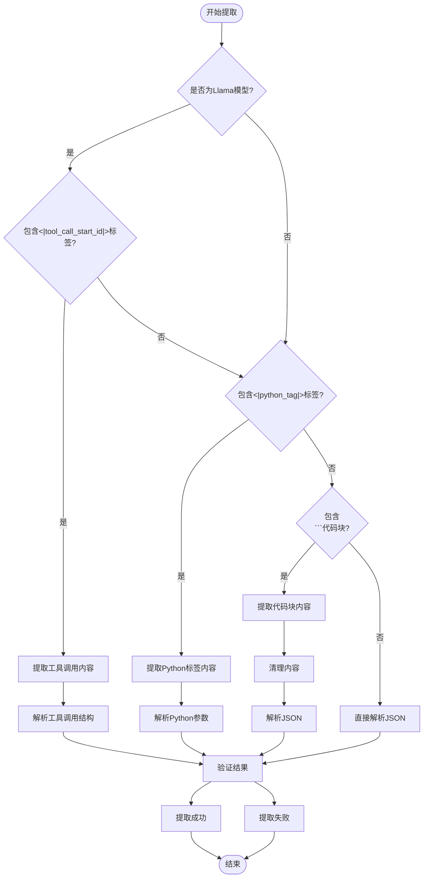

**图表来源**
- [utils.ts](file://chrome-extension/src/background/agent/messages/utils.ts#L47-L114)

### 错误恢复策略

手动提取模式具备多层次的错误恢复机制：

| 错误类型 | 检测方法 | 恢复策略 | 优先级 |
|---------|---------|---------|--------|
| 格式错误 | JSON.parse异常 | 使用jsonrepair修复 | 高 |
| 标签缺失 | 内容格式检测 | 尝试多种解析方式 | 中 |
| 编码问题 | 字符串编码验证 | 转义字符处理 | 低 |
| 结构损坏 | Schema验证失败 | 重试解析 | 中 |

**章节来源**
- [utils.ts](file://chrome-extension/src/background/agent/messages/utils.ts#L47-L114)

## 工具调用处理

工具调用是现代LLM的重要特性，系统对其进行了专门的处理：

### raw属性特殊处理

当LLM返回空内容但包含tool_calls时，系统会特别处理：

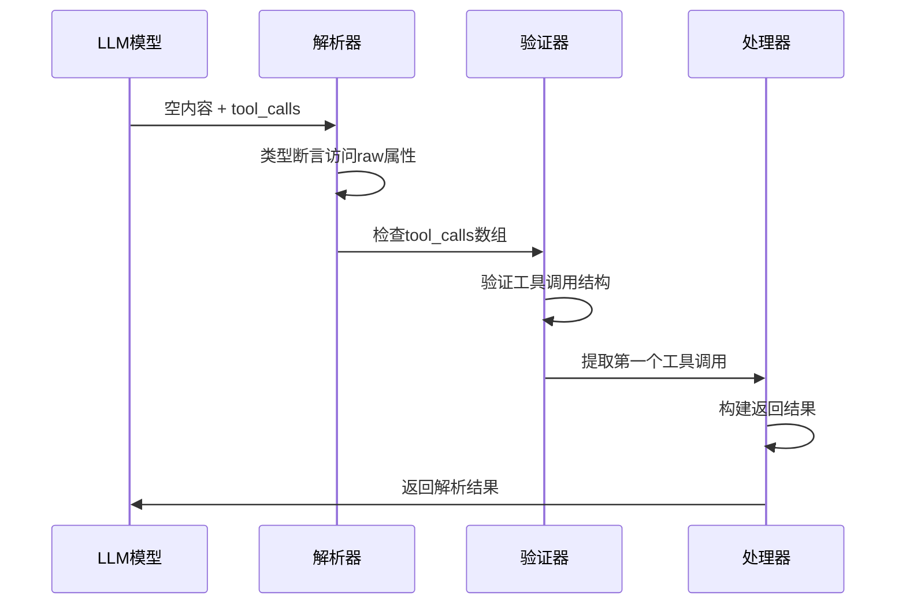

**图表来源**
- [navigator.ts](file://chrome-extension/src/background/agent/agents/navigator.ts#L128-L143)

### 工具调用参数提取

系统对不同格式的工具调用参数进行统一处理：

| 格式类型 | 检测标识 | 提取方法 | 示例 |
|---------|---------|---------|------|
| 标准格式 | `tool_calls`数组 | 直接访问args属性 | `{currentState, action}` |
| Llama格式 | `<|tool_call_start_id|>`标签 | 标签解析 | Python字典结构 |
| Python格式 | `<|python_tag|>`标签 | JSON解析 | 嵌套参数对象 |

**章节来源**
- [navigator.ts](file://chrome-extension/src/background/agent/agents/navigator.ts#L128-L143)

## 错误处理与容错机制

系统实现了完善的错误处理和容错机制：

### ResponseParseError异常

ResponseParseError是专门用于处理响应解析失败的自定义异常：

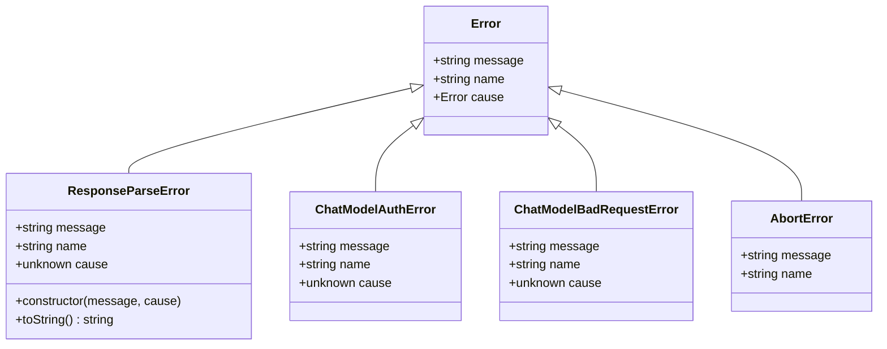

**图表来源**
- [errors.ts](file://chrome-extension/src/background/agent/agents/errors.ts#L292-L313)

### 错误分类与处理策略

系统对不同类型的错误采用不同的处理策略：

| 错误类型 | 检测函数 | 处理策略 | 用户反馈 |
|---------|---------|---------|---------|
| 认证错误 | `isAuthenticationError()` | 重新认证 | API密钥提示 |
| 请求错误 | `isBadRequestError()` | 参数修正 | 错误详情 |
| 中止错误 | `isAbortedError()` | 立即停止 | 取消通知 |
| 扩展冲突 | `isExtensionConflictError()` | 环境检查 | 配置建议 |
| 解析错误 | `ResponseParseError` | 降级处理 | 重试机制 |

**章节来源**
- [errors.ts](file://chrome-extension/src/background/agent/agents/errors.ts#L100-L178)

### 容错回退机制

系统实现了多层次的容错回退机制：

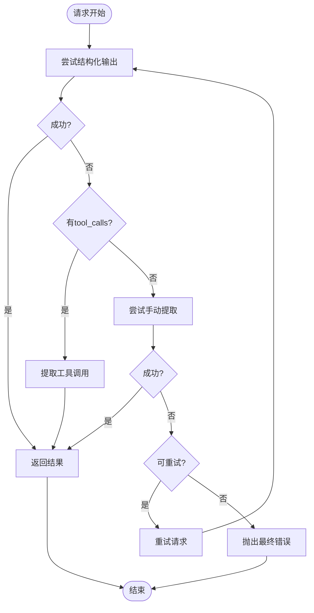

**图表来源**
- [base.ts](file://chrome-extension/src/background/agent/agents/base.ts#L120-L140)

**章节来源**
- [base.ts](file://chrome-extension/src/background/agent/agents/base.ts#L120-L140)

## 模型生命周期追踪

从inputMessages构建到最终输出的完整生命周期：

### 输入消息构建

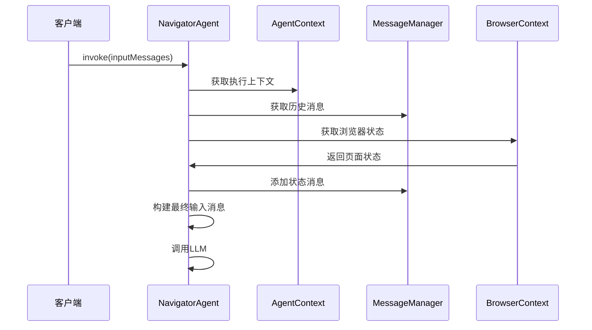

**图表来源**
- [navigator.ts](file://chrome-extension/src/background/agent/agents/navigator.ts#L240-L250)

### 输出处理流程

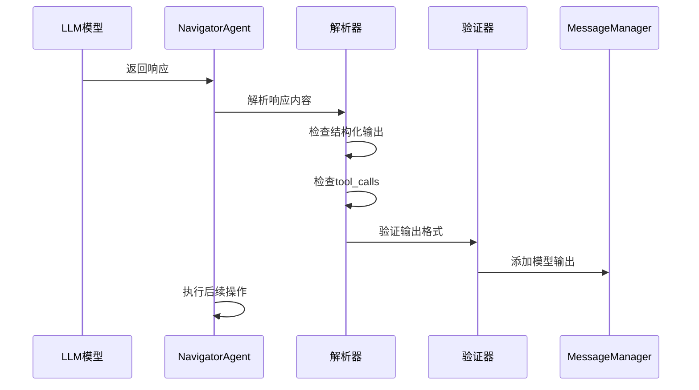

**图表来源**
- [navigator.ts](file://chrome-extension/src/background/agent/agents/navigator.ts#L250-L270)

**章节来源**
- [navigator.ts](file://chrome-extension/src/background/agent/agents/navigator.ts#L240-L270)

## LLM提供商兼容性

系统针对不同LLM提供商进行了专门的适配：

### 支持的LLM提供商

| 提供商 | 模型系列 | 结构化输出 | 工具调用 | 特殊处理 |
|-------|---------|-----------|---------|---------|
| OpenAI | GPT-4, GPT-3.5 | ✅ | ✅ | 默认配置 |
| Anthropic | Claude | ✅ | ✅ | 标签过滤 |
| Google | Gemini | ✅ | ✅ | Gemini格式转换 |
| Groq | Mixtral, Llama | ✅ | ✅ | 函数调用 |
| Ollama | 各种开源模型 | ⚠️ | ⚠️ | 手动提取 |
| 自定义 | 本地部署 | ⚠️ | ⚠️ | 手动提取 |

### 模型特性检测

系统通过模型名称和提供商信息自动检测功能支持：

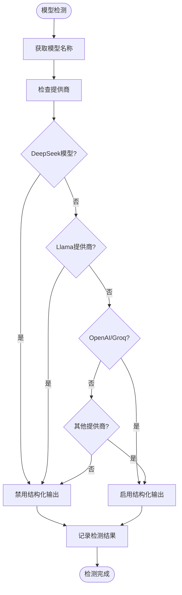

**图表来源**
- [base.ts](file://chrome-extension/src/background/agent/agents/base.ts#L106-L118)

**章节来源**
- [base.ts](file://chrome-extension/src/background/agent/agents/base.ts#L106-L118)

## 性能优化考虑

系统在多个层面进行了性能优化：

### 缓存策略

- **浏览器状态缓存**：避免重复获取DOM信息
- **消息历史缓存**：减少重复的状态消息添加
- **Schema缓存**：一次性转换Zod到JSON Schema

### 并发控制

- **请求信号控制**：支持取消和超时
- **异步操作**：非阻塞的LLM调用
- **批量处理**：合并相似的操作请求

### 资源管理

- **连接池管理**：复用LLM连接
- **内存优化**：及时释放不需要的对象
- **网络优化**：压缩和分片传输

## 总结

NavigatorAgent.invoke方法展现了现代AI应用开发的最佳实践：

1. **智能模式切换**：根据模型能力自动选择最优调用方式
2. **强健的容错机制**：多层次的错误检测和恢复策略
3. **灵活的工具调用处理**：支持多种格式的工具调用
4. **完善的错误分类**：针对性的错误处理和用户反馈
5. **全面的LLM兼容性**：覆盖主流LLM提供商和模型

这种设计不仅确保了系统的稳定性，还为未来的功能扩展提供了良好的基础。通过结构化输出和手动提取的双重保障，系统能够在各种复杂环境下保持可靠的性能表现。