# 结构化输出机制

<cite>
**本文档引用的文件**
- [navigator.ts](file://chrome-extension/src/background/agent/agents/navigator.ts)
- [base.ts](file://chrome-extension/src/background/agent/agents/base.ts)
- [utils.ts](file://chrome-extension/src/background/utils.ts)
- [json_schema.ts](file://packages/schema-utils/lib/json_schema.ts)
- [schemas.ts](file://chrome-extension/src/background/agent/actions/schemas.ts)
- [builder.ts](file://chrome-extension/src/background/agent/actions/builder.ts)
- [errors.ts](file://chrome-extension/src/background/agent/agents/errors.ts)
- [types.ts](file://chrome-extension/src/background/agent/types.ts)
</cite>

## 目录
1. [简介](#简介)
2. [核心架构概述](#核心架构概述)
3. [Zod到JSON Schema转换机制](#zod到json-schema转换机制)
4. [withStructuredOutput配置详解](#withstructuredoutput配置详解)
5. [响应解析流程分析](#响应解析流程分析)
6. [工具调用处理策略](#工具调用处理策略)
7. [类型安全保障机制](#类型安全保障机制)
8. [LLM提供商支持差异](#llm提供商支持差异)
9. [错误处理与恢复](#错误处理与恢复)
10. [性能优化考虑](#性能优化考虑)
11. [总结](#总结)

## 简介

NavigatorAgent中的结构化输出机制是整个智能浏览器自动化系统的核心组件之一。该机制通过将复杂的Zod类型定义转换为JSON Schema格式，确保LLM能够生成符合预期结构的响应，从而实现类型安全的网页操作指令生成。

该系统采用了多层次的容错设计：当LLM支持结构化输出时，优先使用原生的结构化响应解析；当LLM不支持或响应不符合预期时，系统会回退到基于工具调用的处理策略，确保系统的鲁棒性。

## 核心架构概述

结构化输出机制的整体架构采用分层设计，从类型定义到最终执行形成完整的数据流管道：

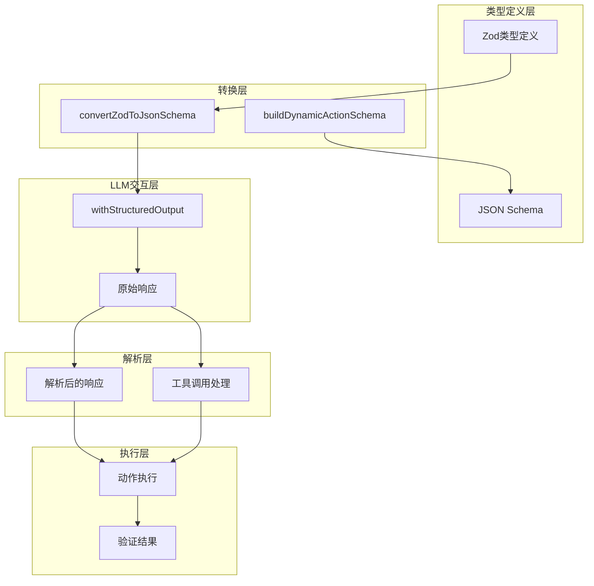

**图表来源**
- [navigator.ts](file://chrome-extension/src/background/agent/agents/navigator.ts#L86-L126)
- [base.ts](file://chrome-extension/src/background/agent/agents/base.ts#L117-L171)

**章节来源**
- [navigator.ts](file://chrome-extension/src/background/agent/agents/navigator.ts#L74-L162)
- [base.ts](file://chrome-extension/src/background/agent/agents/base.ts#L45-L120)

## Zod到JSON Schema转换机制

### 转换器实现原理

`convertZodToJsonSchema`函数是整个结构化输出机制的基础，它负责将复杂的Zod类型定义转换为LLM可理解的JSON Schema格式。

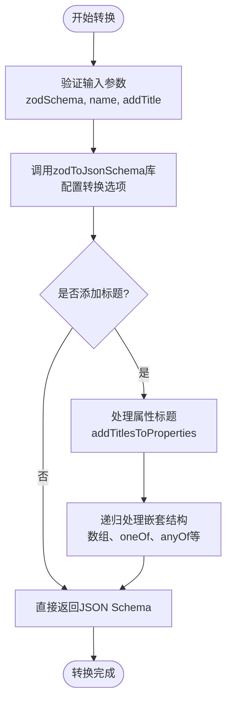

**图表来源**
- [utils.ts](file://chrome-extension/src/background/utils.ts#L106-L126)

### 标题处理机制

为了提高某些模型（如Haiku）对Schema的理解能力，系统实现了自动标题添加机制：

| 处理层级 | 功能描述 | 实现方式 |
|---------|---------|---------|
| 属性级别 | 为每个属性添加标题 | `capitalizeFirstLetter(propertyName)` |
| 嵌套对象 | 递归处理子属性 | 深度优先遍历 |
| 数组项目 | 处理数组元素Schema | 遍历items字段 |
| 联合类型 | 处理oneOf/anyOf/allOf | 分别处理每个选项 |

### 动态动作Schema构建

`buildDynamicActionSchema`函数根据可用的动作集合动态构建动作选择Schema：

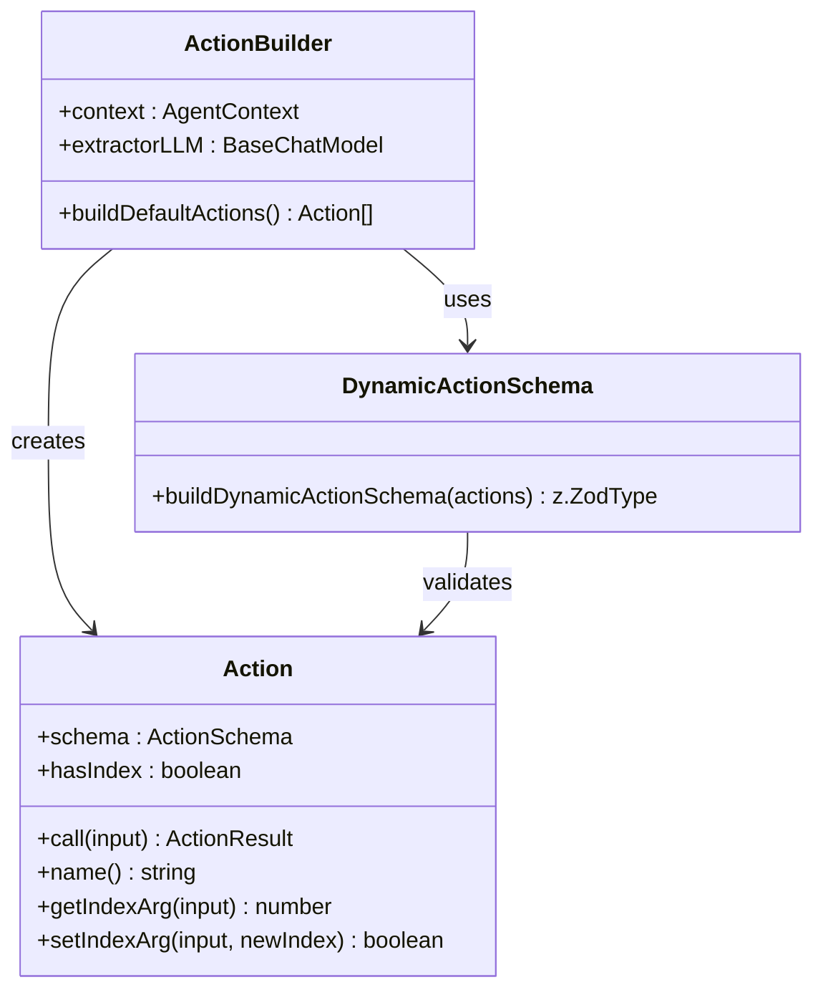

**图表来源**
- [builder.ts](file://chrome-extension/src/background/agent/actions/builder.ts#L110-L152)
- [builder.ts](file://chrome-extension/src/background/agent/actions/builder.ts#L154-L707)

**章节来源**
- [utils.ts](file://chrome-extension/src/background/utils.ts#L106-L126)
- [builder.ts](file://chrome-extension/src/background/agent/actions/builder.ts#L110-L152)

## withStructuredOutput配置详解

### 核心配置参数

`withStructuredOutput`方法接受两个关键配置参数：

| 参数名 | 类型 | 默认值 | 作用说明 |
|-------|------|--------|---------|
| `includeRaw` | boolean | true | 是否包含原始响应数据 |
| `name` | string | modelOutputToolName | 工具名称标识符 |

### 配置参数作用机制

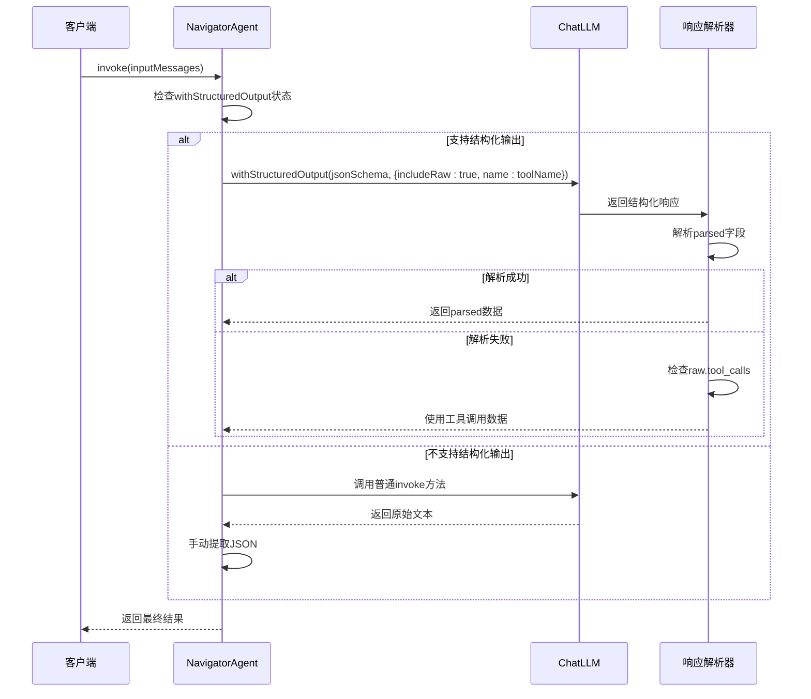

**图表来源**
- [navigator.ts](file://chrome-extension/src/background/agent/agents/navigator.ts#L94-L126)
- [base.ts](file://chrome-extension/src/background/agent/agents/base.ts#L117-L171)

### 模型兼容性检测

系统通过`setWithStructuredOutput`方法自动检测模型对结构化输出的支持情况：

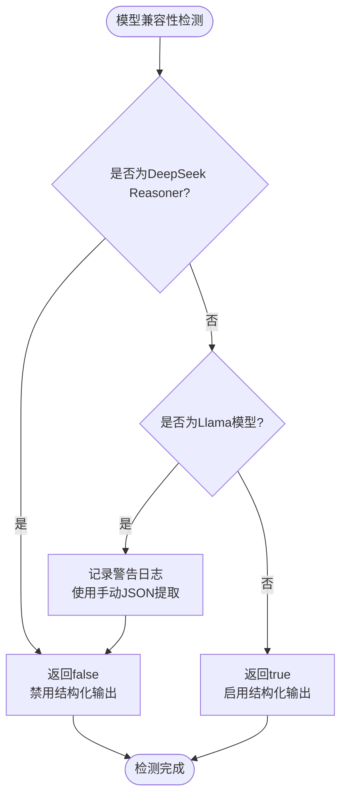

**图表来源**
- [base.ts](file://chrome-extension/src/background/agent/agents/base.ts#L106-L118)

**章节来源**
- [navigator.ts](file://chrome-extension/src/background/agent/agents/navigator.ts#L94-L126)
- [base.ts](file://chrome-extension/src/background/agent/agents/base.ts#L106-L118)

## 响应解析流程分析

### 直接返回逻辑

当LLM成功生成结构化响应时，系统会优先检查`response.parsed`字段：

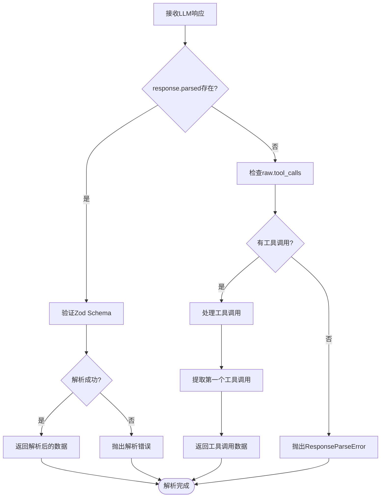

**图表来源**
- [navigator.ts](file://chrome-extension/src/background/agent/agents/navigator.ts#L100-L126)

### 类型验证机制

系统通过多层验证确保响应数据的类型安全性：

| 验证层级 | 验证内容 | 错误处理 |
|---------|---------|---------|
| Schema验证 | Zod Schema匹配 | ResponseParseError |
| 数据完整性 | 必需字段检查 | 抛出验证异常 |
| 类型一致性 | 数据类型匹配 | 自动类型转换 |
| 业务规则 | 业务约束验证 | 返回错误信息 |

**章节来源**
- [navigator.ts](file://chrome-extension/src/background/agent/agents/navigator.ts#L100-L126)
- [base.ts](file://chrome-extension/src/background/agent/agents/base.ts#L172-L185)

## 工具调用处理策略

### 特殊处理场景

当LLM返回空内容但包含tool_calls时，系统采用特殊的处理策略：

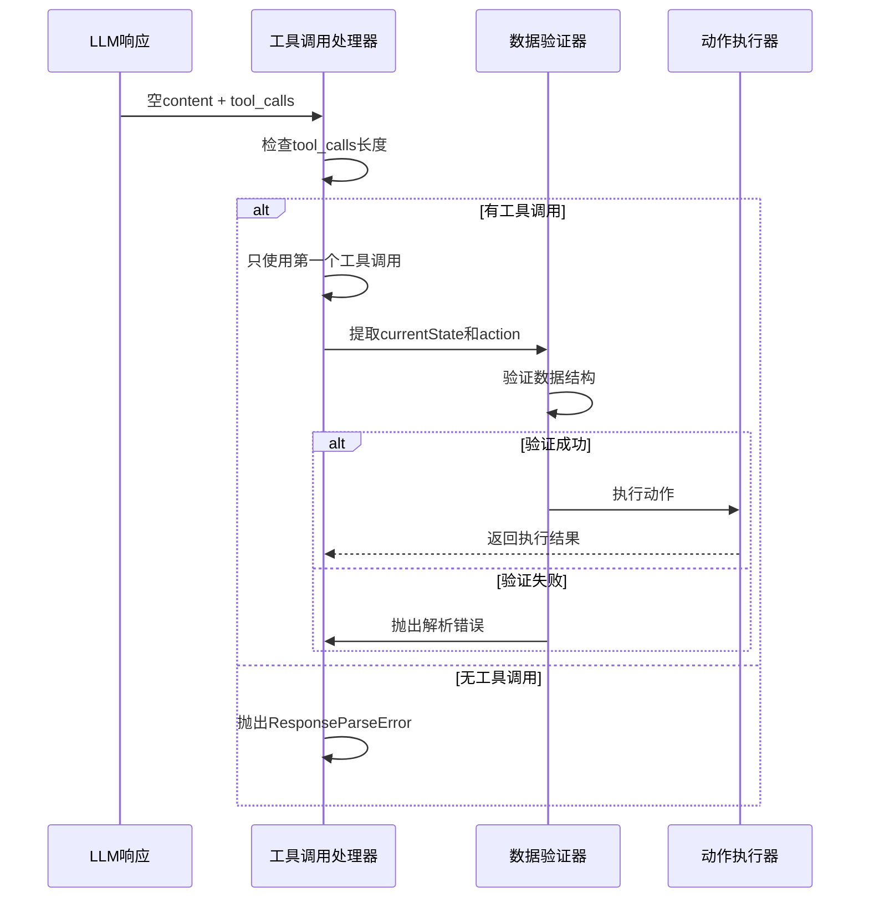

**图表来源**
- [navigator.ts](file://chrome-extension/src/background/agent/agents/navigator.ts#L128-L140)

### 工具调用数据结构

系统通过类型断言确保工具调用数据的正确性：

```typescript
// 类型断言确保工具调用数据结构
const rawResponse = response.raw as BaseMessage & {
  tool_calls?: Array<{
    args: {
      currentState: typeof agentBrainSchema._type;
      action: z.infer<ReturnType<typeof buildDynamicActionSchema>>;
    };
  }>;
};
```

这种设计允许系统在不同LLM提供商之间保持兼容性，同时确保类型安全。

**章节来源**
- [navigator.ts](file://chrome-extension/src/background/agent/agents/navigator.ts#L128-L140)

## 类型安全保障机制

### Zod Schema验证

系统通过严格的Zod Schema验证确保输出数据的类型安全：

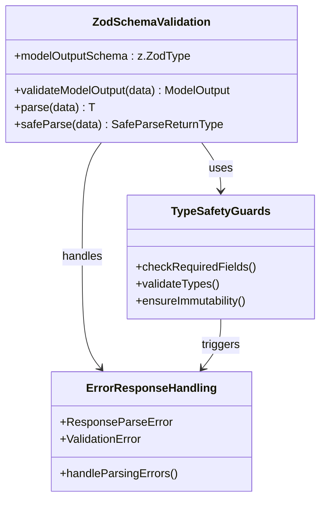

**图表来源**
- [base.ts](file://chrome-extension/src/background/agent/agents/base.ts#L185-L195)

### 运行时类型检查

系统在运行时进行多层次的类型检查：

| 检查阶段 | 检查内容 | 处理方式 |
|---------|---------|---------|
| 输入验证 | 函数参数类型 | Zod safeParse |
| 中间计算 | 中间结果类型 | 类型断言 |
| 输出验证 | 最终结果类型 | Schema验证 |
| 异常处理 | 错误类型分类 | 错误包装 |

**章节来源**
- [base.ts](file://chrome-extension/src/background/agent/agents/base.ts#L185-L195)
- [errors.ts](file://chrome-extension/src/background/agent/agents/errors.ts#L275-L313)

## LLM提供商支持差异

### 支持矩阵

不同LLM提供商对结构化输出的支持程度存在显著差异：

| 提供商 | 模型系列 | 结构化输出支持 | 工具调用支持 | 特殊要求 |
|-------|---------|---------------|-------------|---------|
| OpenAI | GPT-4, GPT-3.5 | ✅ 完全支持 | ✅ 完全支持 | 无需特殊配置 |
| Google | Gemini系列 | ✅ 完全支持 | ✅ 完全支持 | 需要特定格式 |
| Anthropic | Claude系列 | ✅ 完全支持 | ✅ 完全支持 | 需要工具定义 |
| Llama | Llama-4, Llama-3.3 | ❌ 不支持 | ✅ 支持 | 回退到工具调用 |
| DeepSeek | Reasoner, R1 | ❌ 不支持 | ⚠️ 部分支持 | 禁用结构化输出 |

### 兼容性处理策略

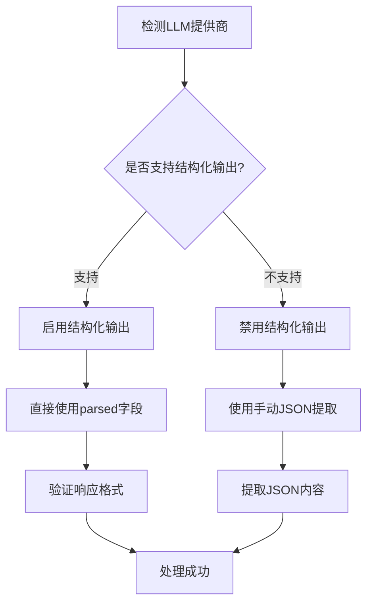

**图表来源**
- [base.ts](file://chrome-extension/src/background/agent/agents/base.ts#L106-L118)

**章节来源**
- [base.ts](file://chrome-extension/src/background/agent/agents/base.ts#L106-L118)

## 错误处理与恢复

### 错误分类体系

系统建立了完善的错误分类和处理体系：

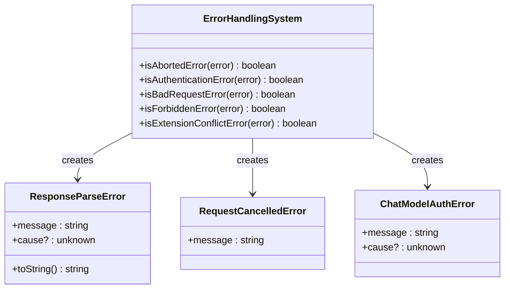

**图表来源**
- [errors.ts](file://chrome-extension/src/background/agent/agents/errors.ts#L146-L313)

### 恢复策略

| 错误类型 | 检测方法 | 恢复策略 | 重试机制 |
|---------|---------|---------|---------|
| 响应解析失败 | ResponseParseError | 使用工具调用 | 不重试 |
| 认证错误 | isAuthenticationError | 更新认证信息 | 有限重试 |
| 请求取消 | isAbortedError | 清理资源 | 不重试 |
| 权限拒绝 | isForbiddenError | 检查权限设置 | 不重试 |
| 网络超时 | 超时检测 | 重新发送请求 | 指数退避 |

**章节来源**
- [errors.ts](file://chrome-extension/src/background/agent/agents/errors.ts#L146-L313)
- [navigator.ts](file://chrome-extension/src/background/agent/agents/navigator.ts#L104-L110)

## 性能优化考虑

### 缓存策略

系统实现了多级缓存机制以提升性能：

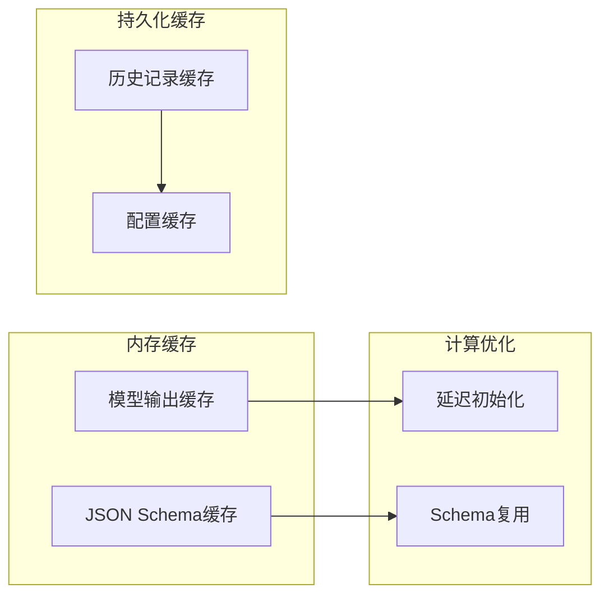

### 内存管理

| 优化技术 | 应用场景 | 效果 |
|---------|---------|------|
| 对象池 | 动作执行器 | 减少GC压力 |
| 延迟加载 | 大型Schema | 降低启动时间 |
| 弱引用 | 缓存条目 | 防止内存泄漏 |
| 流式处理 | 长响应 | 减少内存占用 |

### 并发控制

系统通过多种机制确保并发安全性：

- **信号量控制**：限制并发请求数量
- **队列管理**：保证请求顺序执行
- **资源锁定**：防止竞态条件
- **超时机制**：避免无限等待

## 总结

NavigatorAgent中的结构化输出机制是一个精心设计的类型安全系统，它通过以下关键特性确保了智能浏览器自动化任务的可靠性和效率：

### 核心优势

1. **类型安全保障**：通过Zod Schema提供强类型验证，确保输出数据的正确性
2. **LLM兼容性**：支持多种LLM提供商，具备良好的向后兼容性
3. **容错设计**：当结构化输出不可用时，自动回退到工具调用策略
4. **性能优化**：多级缓存和并发控制确保系统高效运行
5. **错误恢复**：完善的错误处理和恢复机制

### 技术创新点

- **动态Schema生成**：根据可用动作动态构建JSON Schema
- **智能回退机制**：自动检测LLM能力并选择最优处理策略
- **类型安全的工具调用**：即使在工具调用模式下也保持类型安全
- **统一的错误处理**：标准化的错误分类和处理流程

### 应用价值

该机制不仅确保了智能浏览器自动化系统的稳定性，还为未来的扩展提供了坚实的基础。通过模块化的架构设计，系统可以轻松适配新的LLM提供商和功能需求，为构建更复杂的智能代理奠定了技术基础。