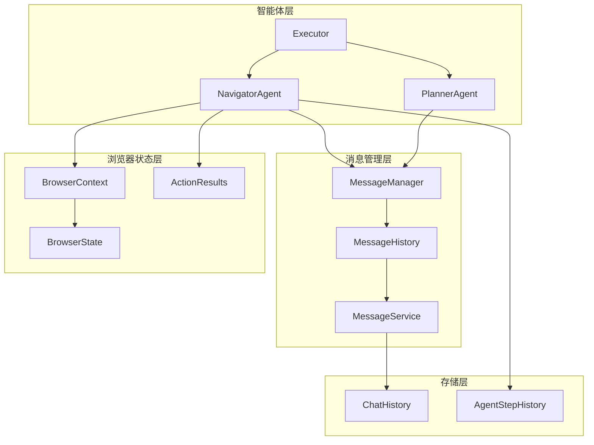
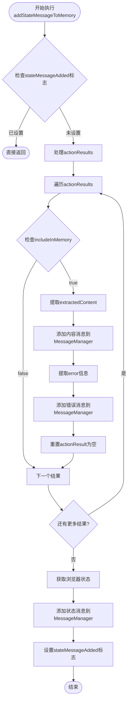
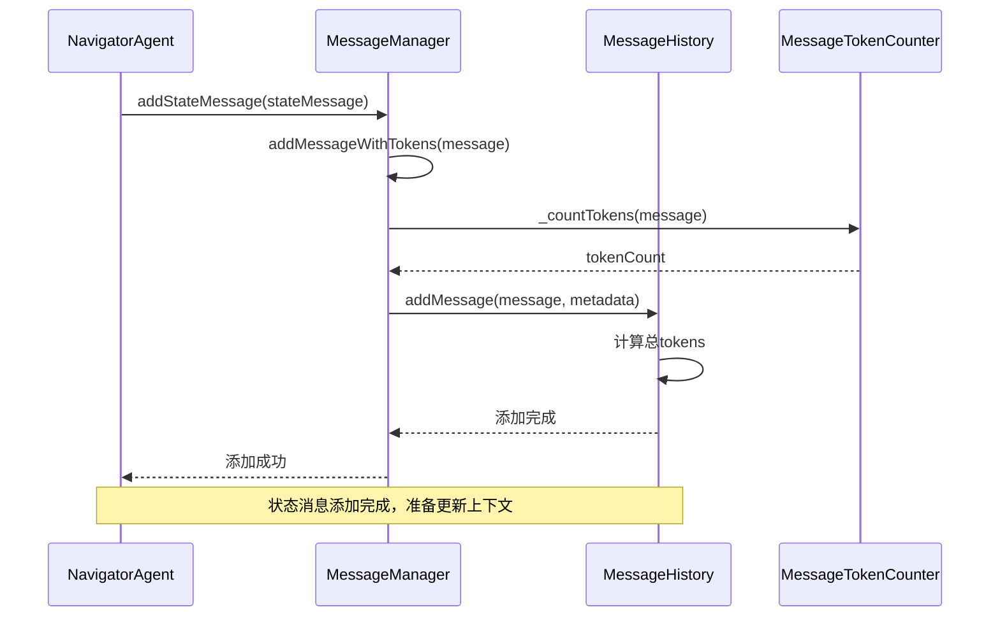
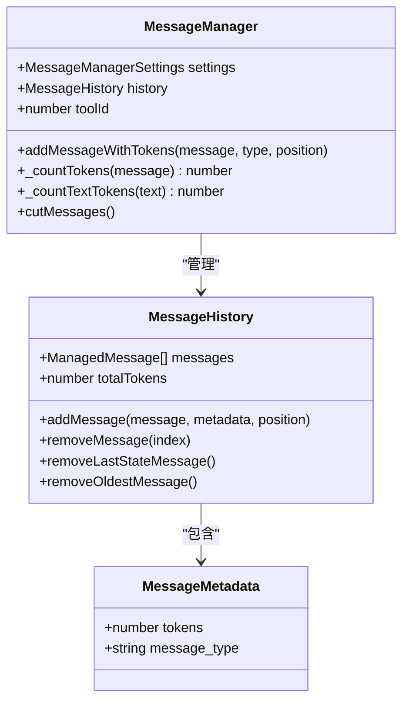
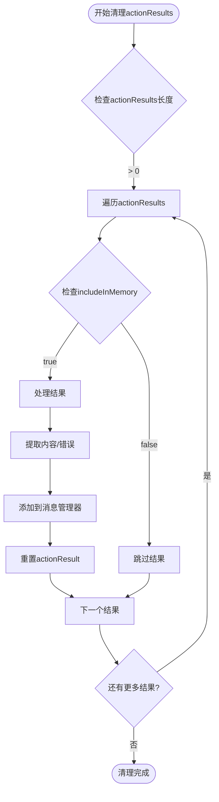
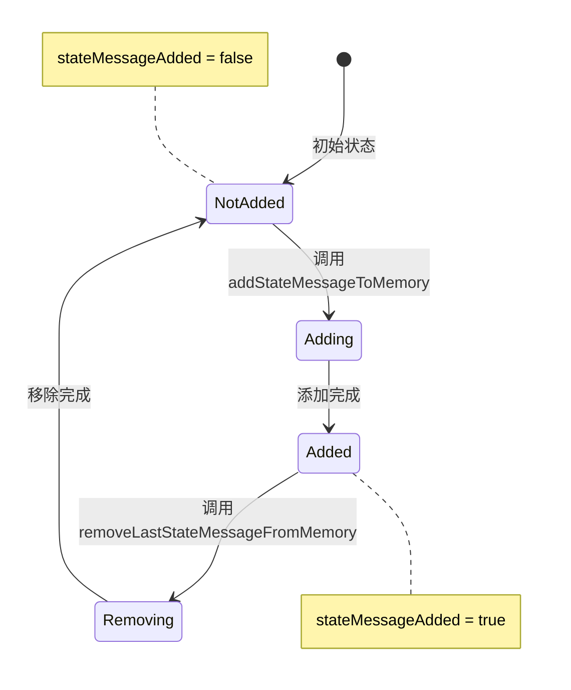
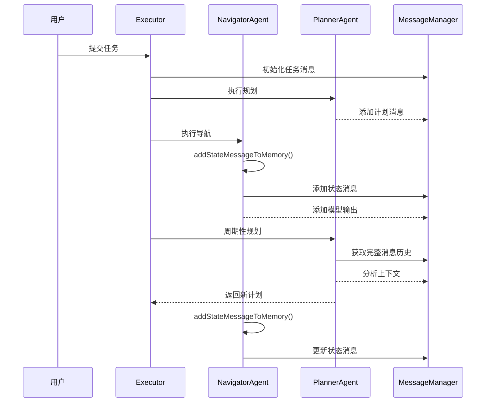
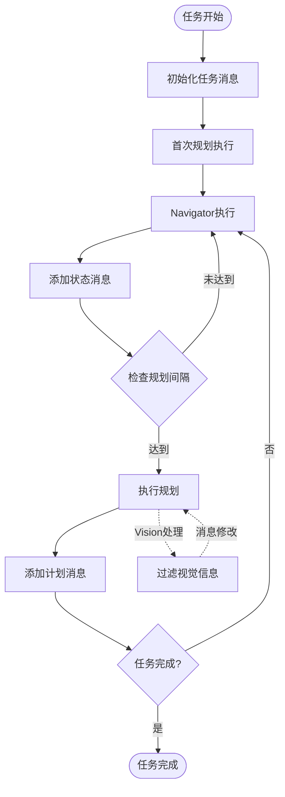
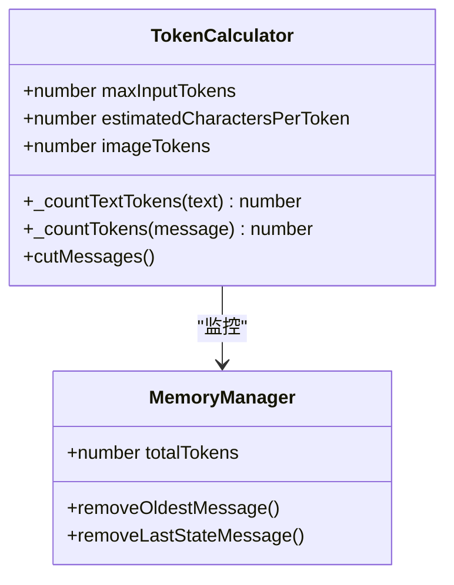

# 状态消息管理

<cite>
**本文档中引用的文件**
- [navigator.ts](file://chrome-extension/src/background/agent/agents/navigator.ts)
- [service.ts](file://chrome-extension/src/background/agent/messages/service.ts)
- [views.ts](file://chrome-extension/src/background/agent/messages/views.ts)
- [types.ts](file://chrome-extension/src/background/agent/types.ts)
- [history.ts](file://chrome-extension/src/background/agent/history.ts)
- [planner.ts](file://chrome-extension/src/background/agent/agents/planner.ts)
- [executor.ts](file://chrome-extension/src/background/agent/executor.ts)
- [views.ts](file://chrome-extension/src/background/browser/views.ts)
</cite>

## 目录
1. [简介](#简介)
2. [系统架构概览](#系统架构概览)
3. [addStateMessageToMemory方法详解](#addstatemessagetomemory方法详解)
4. [MessageManager中的状态消息添加流程](#messagemanager中的状态消息添加流程)
5. [内存清理策略](#内存清理策略)
6. [状态消息标志位控制](#状态消息标志位控制)
7. [多轮对话上下文一致性](#多轮对话上下文一致性)
8. [Navigator与Planner协作关系](#navigator与planner协作关系)
9. [性能考虑](#性能考虑)
10. [故障排除指南](#故障排除指南)
11. [总结](#总结)

## 简介

NavigatorAgent的状态消息管理机制是整个系统中维持对话上下文一致性的核心组件。该机制通过`addStateMessageToMemory`方法将当前浏览器状态注入对话上下文，同时处理历史动作结果的内存清理，确保系统在多轮对话中能够准确理解任务进展和环境变化。

## 系统架构概览

系统采用分层架构设计，包含以下核心组件：

**图表来源**
- [navigator.ts](file://chrome-extension/src/background/agent/agents/navigator.ts#L1-L50)
- [executor.ts](file://chrome-extension/src/background/agent/executor.ts#L1-L100)
- [service.ts](file://chrome-extension/src/background/agent/messages/service.ts#L1-L50)

## addStateMessageToMemory方法详解

`addStateMessageToMemory`方法是状态消息管理的核心入口点，负责将当前浏览器状态注入对话上下文。

### 方法执行流程

**图表来源**
- [navigator.ts](file://chrome-extension/src/background/agent/agents/navigator.ts#L320-L370)

### 关键实现细节

该方法的核心功能包括：

1. **状态消息去重检查**：通过`stateMessageAdded`标志位避免重复添加相同的状态消息
2. **历史动作结果处理**：遍历`actionResults`数组，根据`includeInMemory`标志决定是否处理
3. **内容提取与封装**：将`extractedContent`转换为`HumanMessage`并添加到消息管理器
4. **错误信息处理**：从`error`属性提取错误文本，只保留最后一行作为摘要
5. **内存清理**：处理完成后将对应的`actionResult`重置为空对象

**章节来源**
- [navigator.ts](file://chrome-extension/src/background/agent/agents/navigator.ts#L320-L370)

## MessageManager中的状态消息添加流程

MessageManager负责管理所有消息的生命周期，包括状态消息的添加、删除和内存管理。

### 消息添加序列图

**图表来源**
- [service.ts](file://chrome-extension/src/background/agent/messages/service.ts#L180-L190)
- [views.ts](file://chrome-extension/src/background/agent/messages/views.ts#L20-L35)

### 消息令牌计算机制

MessageManager使用精确的令牌计数机制来管理内存使用：

**图表来源**
- [service.ts](file://chrome-extension/src/background/agent/messages/service.ts#L25-L50)
- [views.ts](file://chrome-extension/src/background/agent/messages/views.ts#L10-L30)

**章节来源**
- [service.ts](file://chrome-extension/src/background/agent/messages/service.ts#L180-L200)
- [views.ts](file://chrome-extension/src/background/agent/messages/views.ts#L20-L50)

## 内存清理策略

系统实现了多层次的内存清理策略，确保长期运行时的内存效率。

### context.actionResults的清理策略

**图表来源**
- [navigator.ts](file://chrome-extension/src/background/agent/agents/navigator.ts#L325-L350)

### 内存管理的影响因素

1. **includeInMemory标志**：决定是否将结果包含在对话上下文中
2. **extractedContent**：提取的内容会被封装为HumanMessage添加到内存
3. **error信息**：错误信息被提取并简化后添加到内存
4. **actionResult重置**：处理完成后重置为默认空对象

**章节来源**
- [navigator.ts](file://chrome-extension/src/background/agent/agents/navigator.ts#L325-L360)

## 状态消息标志位控制

`stateMessageAdded`标志位是防止重复添加状态消息的关键控制机制。

### 标志位状态机

**图表来源**
- [navigator.ts](file://chrome-extension/src/background/agent/agents/navigator.ts#L315-L320)
- [navigator.ts](file://chrome-extension/src/background/agent/agents/navigator.ts#L375-L385)

### 控制逻辑实现

标志位的控制遵循严格的生命周期管理：

1. **添加前检查**：在添加状态消息前检查标志位状态
2. **添加时设置**：添加完成后立即设置标志位为true
3. **移除时重置**：移除状态消息后重置标志位为false
4. **异常处理**：确保在异常情况下也能正确重置标志位

**章节来源**
- [navigator.ts](file://chrome-extension/src/background/agent/agents/navigator.ts#L315-L390)

## 多轮对话上下文一致性

状态消息管理机制在多轮对话中维持上下文一致性发挥关键作用。

### 上下文一致性保证机制

**图表来源**
- [executor.ts](file://chrome-extension/src/background/agent/executor.ts#L230-L280)
- [navigator.ts](file://chrome-extension/src/background/agent/agents/navigator.ts#L150-L200)

### 上下文信息传递

每次状态消息添加都会向对话历史中注入以下关键信息：

1. **浏览器状态快照**：当前页面URL、标题、DOM结构等
2. **动作结果汇总**：成功的操作和遇到的错误
3. **用户交互记录**：点击的元素、填写的表单等
4. **任务进展信息**：已完成的步骤和待办事项

**章节来源**
- [navigator.ts](file://chrome-extension/src/background/agent/agents/navigator.ts#L150-L220)
- [executor.ts](file://chrome-extension/src/background/agent/executor.ts#L230-L280)

## Navigator与Planner协作关系

NavigatorAgent和PlannerAgent通过状态消息管理机制实现紧密协作。

### 协作流程图

**图表来源**
- [executor.ts](file://chrome-extension/src/background/agent/executor.ts#L120-L180)
- [planner.ts](file://chrome-extension/src/background/agent/agents/planner.ts#L45-L80)

### 视觉信息处理差异

PlannerAgent在处理视觉信息时有特殊的优化：

1. **Vision配置检查**：根据`useVisionForPlanner`配置决定是否包含图像
2. **图像内容过滤**：当启用视觉但不适用于Planner时，移除图像内容
3. **文本内容保留**：仅保留纯文本部分用于规划决策

**章节来源**
- [planner.ts](file://chrome-extension/src/background/agent/agents/planner.ts#L55-L75)
- [executor.ts](file://chrome-extension/src/background/agent/executor.ts#L230-L250)

## 性能考虑

状态消息管理机制在设计时充分考虑了性能优化。

### 内存使用优化

1. **选择性内存包含**：通过`includeInMemory`标志控制内存使用
2. **内容截断机制**：当超过最大令牌限制时自动截断长消息
3. **定期清理策略**：及时清理不再需要的历史数据

### 令牌计算优化

**图表来源**
- [service.ts](file://chrome-extension/src/background/agent/messages/service.ts#L15-L25)
- [service.ts](file://chrome-extension/src/background/agent/messages/service.ts#L350-L400)

**章节来源**
- [service.ts](file://chrome-extension/src/background/agent/messages/service.ts#L350-L440)

## 故障排除指南

### 常见问题及解决方案

1. **状态消息重复添加**
   - **症状**：对话历史中出现重复的状态消息
   - **原因**：`stateMessageAdded`标志位未正确设置或重置
   - **解决方案**：检查标志位控制逻辑，确保添加和移除操作配对

2. **内存泄漏**
   - **症状**：长时间运行后内存使用持续增长
   - **原因**：`actionResults`未正确清理或消息历史未及时截断
   - **解决方案**：验证清理策略的有效性，检查令牌计算准确性

3. **上下文丢失**
   - **症状**：规划器无法正确理解任务进展
   - **原因**：状态消息未正确添加或消息顺序错误
   - **解决方案**：检查消息添加时机，确保按正确顺序处理

**章节来源**
- [navigator.ts](file://chrome-extension/src/background/agent/agents/navigator.ts#L375-L390)
- [service.ts](file://chrome-extension/src/background/agent/messages/service.ts#L350-L400)

## 总结

NavigatorAgent的状态消息管理机制是一个精心设计的系统，通过以下关键特性确保了多轮对话中上下文的一致性和有效性：

1. **智能的状态消息去重**：通过`stateMessageAdded`标志位防止重复添加
2. **选择性的内存管理**：基于`includeInMemory`标志决定哪些内容保留在内存中
3. **完善的错误处理**：在异常情况下也能正确清理资源
4. **与Planner的协作**：支持两种不同智能体的特殊需求
5. **性能优化**：通过令牌计算和自动截断机制控制内存使用

该机制为整个系统的可靠运行提供了坚实的基础，使得复杂的网页浏览任务能够在保持上下文一致性的同时高效执行。