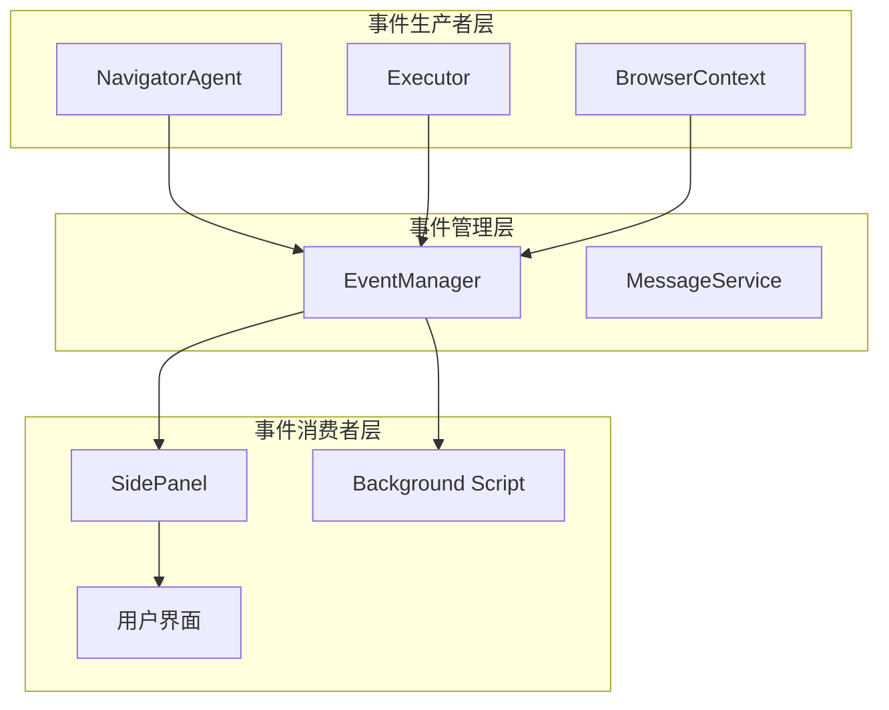
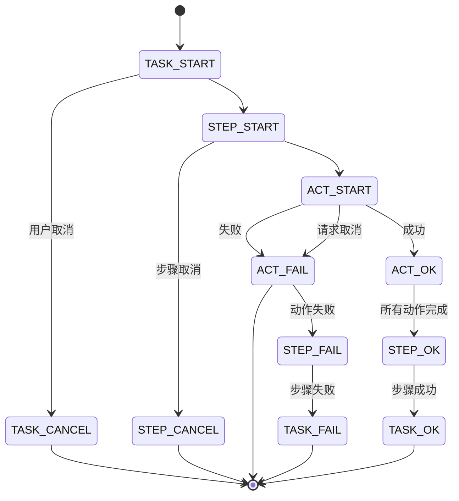
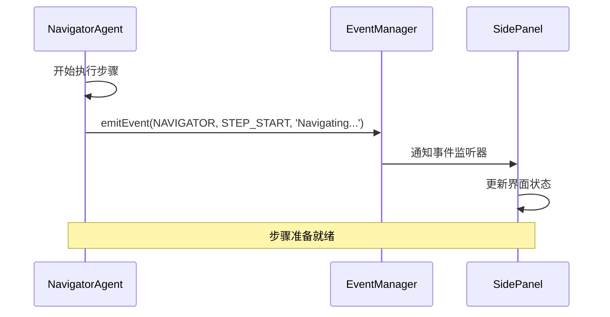
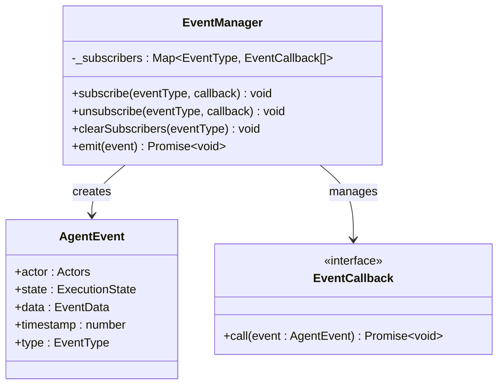
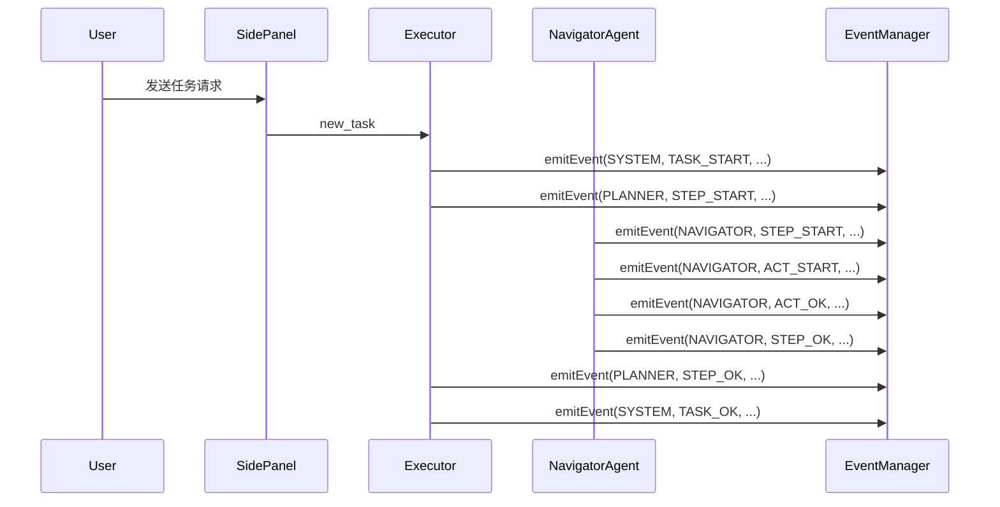
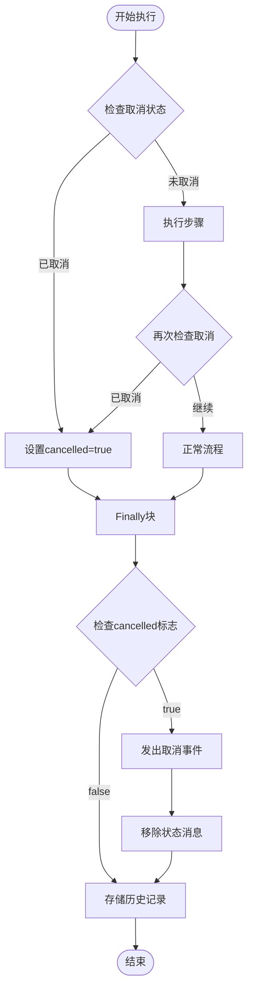
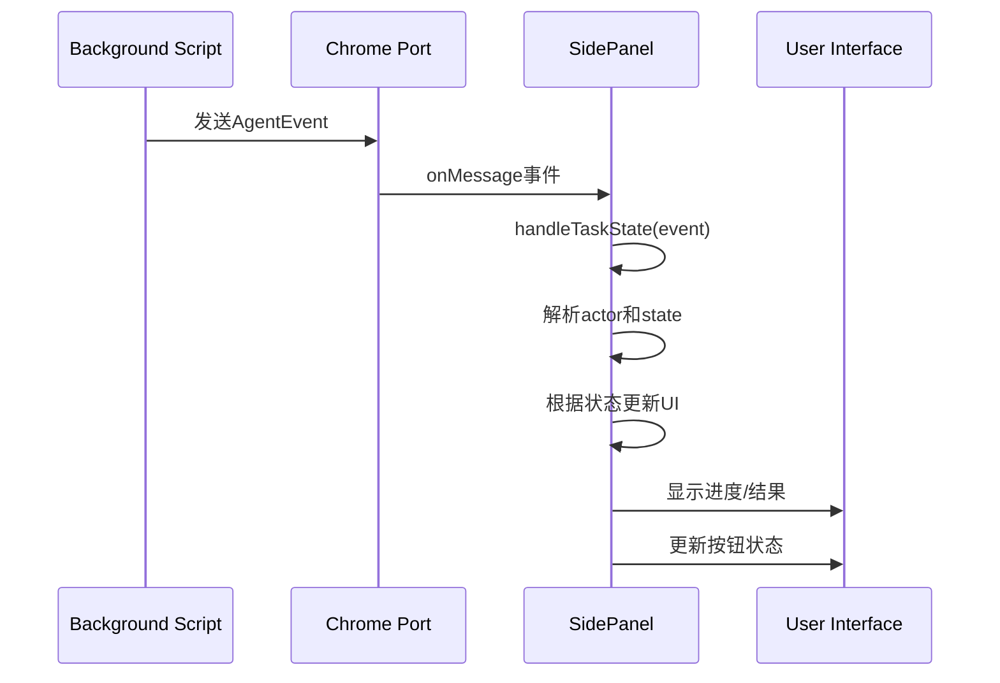
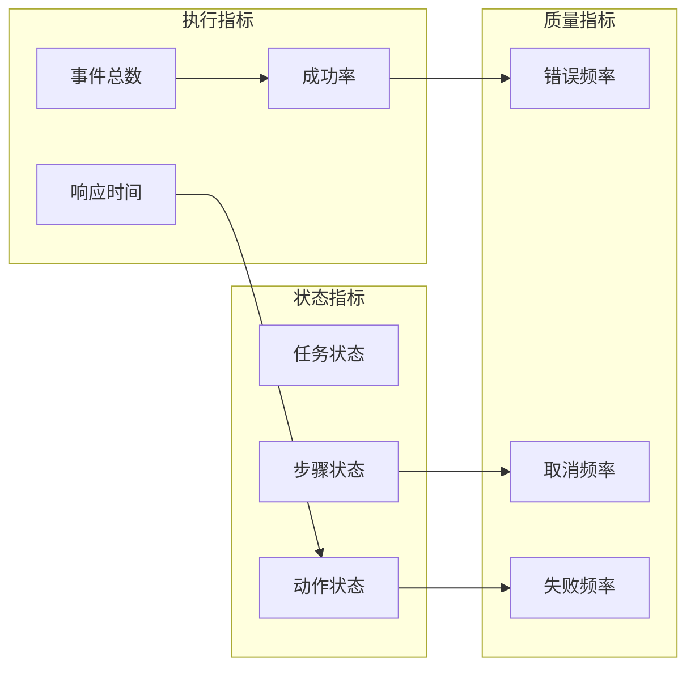

# 执行状态事件通知

<cite>
**本文档中引用的文件**
- [navigator.ts](file://chrome-extension/src/background/agent/agents/navigator.ts)
- [types.ts](file://chrome-extension/src/background/agent/event/types.ts)
- [manager.ts](file://chrome-extension/src/background/agent/event/manager.ts)
- [SidePanel.tsx](file://pages/side-panel/src/SidePanel.tsx)
- [context.ts](file://chrome-extension/src/background/browser/context.ts)
- [service.ts](file://chrome-extension/src/background/agent/messages/service.ts)
- [index.ts](file://chrome-extension/src/background/index.ts)
</cite>

## 目录
1. [简介](#简介)
2. [事件系统架构](#事件系统架构)
3. [ExecutionState枚举详解](#executionstate枚举详解)
4. [NavigatorAgent事件触发机制](#navigatoragent事件触发机制)
5. [事件通知机制实现](#事件通知机制实现)
6. [Actor标识符系统](#actor标识符系统)
7. [取消操作事件传播](#取消操作事件传播)
8. [用户界面更新机制](#用户界面更新机制)
9. [系统可观测性](#系统可观测性)
10. [最佳实践与故障排除](#最佳实践与故障排除)

## 简介

NavigatorAgent事件通知系统是NanoBrowser扩展的核心组件之一，负责在整个任务执行过程中提供实时的状态反馈和进度跟踪。该系统采用发布-订阅模式，通过精心设计的事件层次结构实现了高效的跨组件通信，为用户界面提供了丰富的交互反馈，并确保了系统的可观察性和可调试性。

## 事件系统架构

事件系统采用分层架构设计，包含以下核心组件：

**图表来源**
- [navigator.ts](file://chrome-extension/src/background/agent/agents/navigator.ts#L130-L140)
- [manager.ts](file://chrome-extension/src/background/agent/event/manager.ts#L1-L52)

**章节来源**
- [types.ts](file://chrome-extension/src/background/agent/event/types.ts#L1-L77)
- [manager.ts](file://chrome-extension/src/background/agent/event/manager.ts#L1-L52)

## ExecutionState枚举详解

ExecutionState枚举定义了任务执行过程中的所有可能状态，采用层次化命名规范：`<SCOPE>.<STATUS>`，其中SCOPE表示执行范围，STATUS表示状态类型。

### 状态分类体系

| 状态范围 | 状态类型 | 描述 | 使用场景 |
|---------|---------|------|----------|
| **Task级别** | TASK_START | 任务开始执行 | 初始化任务时触发 |
| | TASK_OK | 任务成功完成 | 任务正常结束时触发 |
| | TASK_FAIL | 任务执行失败 | 异常或错误发生时触发 |
| | TASK_CANCEL | 任务被取消 | 用户主动取消或系统中断时触发 |
| | TASK_PAUSE | 任务暂停 | 暂停执行等待恢复 |
| | TASK_RESUME | 任务恢复 | 从暂停状态恢复执行 |

| **Step级别** | STEP_START | 步骤开始执行 | 新步骤启动时触发 |
| | STEP_OK | 步骤成功完成 | 单个步骤正常结束 |
| | STEP_FAIL | 步骤执行失败 | 步骤内发生错误 |
| | STEP_CANCEL | 步骤被取消 | 步骤被中断 |

| **Action级别** | ACT_START | 动作开始执行 | 具体操作开始前触发 |
| | ACT_OK | 动作成功完成 | 操作正常执行完毕 |
| | ACT_FAIL | 动作执行失败 | 操作过程中出现错误 |

### 状态转换图

**章节来源**
- [types.ts](file://chrome-extension/src/background/agent/event/types.ts#L18-L58)

## NavigatorAgent事件触发机制

NavigatorAgent作为主要的事件生产者，在执行过程中会根据不同的阶段触发相应的事件。事件触发遵循严格的生命周期管理，确保状态的一致性和完整性。

### 核心事件触发点

#### 1. 步骤开始事件 (STEP_START)
在每个新的导航步骤开始时触发，标志着新阶段的开始。

**图表来源**
- [navigator.ts](file://chrome-extension/src/background/agent/agents/navigator.ts#L130-L132)

#### 2. 步骤成功事件 (STEP_OK)
当步骤成功完成且没有后续步骤时触发。

#### 3. 步骤失败事件 (STEP_FAIL)
当步骤执行过程中发生错误时触发。

#### 4. 动作事件链
每个具体的操作（如点击元素、填写表单等）都会触发相应的行为事件：
- **ACT_START**: 动作开始执行
- **ACT_OK**: 动作成功完成
- **ACT_FAIL**: 动作执行失败

**章节来源**
- [navigator.ts](file://chrome-extension/src/background/agent/agents/navigator.ts#L130-L265)

## 事件通知机制实现

事件通知机制通过`context.emitEvent`方法实现，该方法封装了事件的创建和分发逻辑。

### EventManager核心功能

EventManager负责维护事件订阅关系和协调事件分发：

**图表来源**
- [manager.ts](file://chrome-extension/src/background/agent/event/manager.ts#L6-L52)
- [types.ts](file://chrome-extension/src/background/agent/event/types.ts#L60-L76)

### 事件数据结构

Event数据包含丰富的上下文信息，支持完整的状态追踪：

| 字段名 | 类型 | 描述 | 示例值 |
|--------|------|------|--------|
| taskId | string | 任务唯一标识符 | "task_12345" |
| step | number | 当前步骤编号 | 3 |
| maxSteps | number | 最大允许步骤数 | 15 |
| details | string | 详细描述信息 | "Navigation done" |

**章节来源**
- [types.ts](file://chrome-extension/src/background/agent/event/types.ts#L59-L77)
- [manager.ts](file://chrome-extension/src/background/agent/event/manager.ts#L1-L52)

## Actor标识符系统

Actors枚举定义了系统中不同角色的标识符，用于区分事件的来源和责任主体。

### Actor类型定义

| Actor | 值 | 职责描述 | 使用场景 |
|-------|----|---------|---------|
| SYSTEM | 'system' | 系统级操作和状态变更 | 任务生命周期管理 |
| USER | 'user' | 用户输入和交互 | 用户命令处理 |
| PLANNER | 'planner' | 规划和决策过程 | 计划制定阶段 |
| NAVIGATOR | 'navigator' | 导航和浏览器操作 | 页面浏览和交互 |

### Actor在事件流中的作用

**图表来源**
- [types.ts](file://chrome-extension/src/background/agent/event/types.ts#L1-L7)
- [index.ts](file://chrome-extension/src/background/index.ts#L305-L350)

**章节来源**
- [types.ts](file://chrome-extension/src/background/agent/event/types.ts#L1-L7)

## 取消操作事件传播

取消操作是事件系统中的重要机制，通过finally块中的cancelled标志位确保取消状态的正确传播。

### 取消流程机制

**图表来源**
- [navigator.ts](file://chrome-extension/src/background/agent/agents/navigator.ts#L227-L265)

### 取消事件的具体实现

在finally块中，系统会检查cancelled标志位并相应地处理：

1. **取消检测**: 在每个关键检查点验证任务是否已被取消
2. **状态清理**: 移除最后的状态消息以避免混淆
3. **事件广播**: 发出STEP_CANCEL事件通知所有订阅者
4. **历史记录**: 将取消状态保存到执行历史中

**章节来源**
- [navigator.ts](file://chrome-extension/src/background/agent/agents/navigator.ts#L227-L265)

## 用户界面更新机制

事件系统与用户界面的集成通过SidePanel组件实现，该组件负责接收事件并更新相应的UI状态。

### 事件处理流程

**图表来源**
- [SidePanel.tsx](file://pages/side-panel/src/SidePanel.tsx#L192-L264)
- [index.ts](file://chrome-extension/src/background/index.ts#L305-L350)

### UI状态映射规则

不同Actor和State组合对应不同的UI行为：

| Actor | State | UI行为 | 进度显示 |
|-------|-------|--------|----------|
| NAVIGATOR | STEP_START | 显示进度条 | 是 |
| NAVIGATOR | STEP_OK | 隐藏进度条 | 否 |
| NAVIGATOR | STEP_FAIL | 隐藏进度条 | 否 |
| NAVIGATOR | STEP_CANCEL | 隐藏进度条 | 否 |
| NAVIGATOR | ACT_START | 显示缓存内容 | 否 |
| NAVIGATOR | ACT_OK | 更新消息列表 | 否 |
| NAVIGATOR | ACT_FAIL | 显示错误信息 | 否 |

**章节来源**
- [SidePanel.tsx](file://pages/side-panel/src/SidePanel.tsx#L192-L264)

## 系统可观测性

事件系统为整个执行过程提供了完整的可观测性，支持调试、监控和性能分析。

### 可观测性特征

1. **完整的历史记录**: 每个步骤的状态变化都被记录
2. **实时状态反馈**: 用户界面能够即时反映执行状态
3. **错误追踪**: 详细的错误信息和堆栈跟踪
4. **性能监控**: 事件时间戳支持性能分析

### 监控指标

### 错误处理和恢复

事件系统内置了强大的错误处理机制：

1. **异常捕获**: 所有异步操作都包含错误处理
2. **状态回滚**: 错误发生时自动回滚到安全状态
3. **重试机制**: 支持有限次数的自动重试
4. **降级策略**: 在部分功能失效时提供基础服务

**章节来源**
- [navigator.ts](file://chrome-extension/src/background/agent/agents/navigator.ts#L190-L225)

## 最佳实践与故障排除

### 事件订阅最佳实践

1. **及时清理**: 在组件卸载时取消事件订阅
2. **错误处理**: 事件回调函数应包含适当的错误处理
3. **性能优化**: 避免在事件处理中执行耗时操作
4. **状态一致性**: 确保事件处理不会导致状态不一致

### 常见问题排查

| 问题症状 | 可能原因 | 排查方法 | 解决方案 |
|---------|---------|---------|---------|
| 事件未触发 | 订阅未建立 | 检查subscribe调用 | 重新建立订阅 |
| 界面无响应 | 事件处理阻塞 | 检查回调函数 | 优化异步处理 |
| 状态不一致 | 事件顺序错乱 | 查看事件日志 | 添加事件序列号 |
| 内存泄漏 | 订阅未清理 | 监控订阅数量 | 实现自动清理 |

### 性能优化建议

1. **事件批处理**: 对于高频事件考虑批量处理
2. **条件过滤**: 只订阅感兴趣的事件类型
3. **异步处理**: 将耗时操作移到后台线程
4. **缓存策略**: 缓存频繁访问的事件数据

通过合理使用事件通知系统，开发者可以构建出响应迅速、状态清晰、易于调试的复杂应用程序。该系统不仅提供了强大的功能，还确保了代码的可维护性和系统的稳定性。