# 浏览器状态快照

<cite>
**本文档中引用的文件**
- [context.ts](file://chrome-extension/src/background/browser/context.ts)
- [page.ts](file://chrome-extension/src/background/browser/page.ts)
- [views.ts](file://chrome-extension/src/background/browser/views.ts)
- [navigator.ts](file://chrome-extension/src/background/agent/agents/navigator.ts)
- [history.ts](file://chrome-extension/src/background/agent/history.ts)
- [types.ts](file://chrome-extension/src/background/agent/types.ts)
- [service.ts](file://chrome-extension/src/background/browser/dom/clickable/service.ts)
- [views.ts](file://chrome-extension/src/background/browser/dom/views.ts)
</cite>

## 目录
1. [简介](#简介)
2. [核心架构概述](#核心架构概述)
3. [getState()与getCachedState()方法对比分析](#getstate与getcachestate方法对比分析)
4. [状态快照捕获机制](#状态快照捕获机制)
5. [useVision参数的作用机制](#usevision参数的作用机制)
6. [可点击元素缓存系统](#可点击元素缓存系统)
7. [AgentStepRecord集成机制](#agentsteprecord集成机制)
8. [性能优化策略](#性能优化策略)
9. [智能体决策中的关键作用](#智能体决策中的关键作用)
10. [最佳实践与故障排除](#最佳实践与故障排除)

## 简介

浏览器状态快照是NanoBrowser智能体系统的核心组件，负责捕获和管理浏览器当前页面的状态信息。该系统通过`BrowserContext`类提供统一的状态访问接口，支持两种主要的状态获取模式：实时状态捕获（`getState()`）和缓存状态获取（`getCachedState()`）。这些状态快照不仅包含DOM结构信息，还整合了页面元数据、标签页信息以及视觉特征，为智能体的决策过程提供全面的环境感知能力。

## 核心架构概述

浏览器状态快照系统采用分层架构设计，主要包含以下核心组件：


**图表来源**
- [context.ts](file://chrome-extension/src/background/browser/context.ts#L14-L359)
- [page.ts](file://chrome-extension/src/background/browser/page.ts#L24-L68)
- [views.ts](file://chrome-extension/src/background/browser/views.ts#L92-L130)

**章节来源**
- [context.ts](file://chrome-extension/src/background/browser/context.ts#L14-L359)
- [page.ts](file://chrome-extension/src/background/browser/page.ts#L24-L68)
- [views.ts](file://chrome-extension/src/background/browser/views.ts#L92-L130)

## getState()与getCachedState()方法对比分析

### 方法签名与行为差异

`BrowserContext`类提供了两个核心方法来获取浏览器状态：`getState()`和`getCachedState()`。这两个方法在实现逻辑和应用场景上存在显著差异。

#### getState()方法实现

`getState()`方法执行完整的状态捕获流程，确保返回最新的、准确的浏览器状态：


**图表来源**
- [context.ts](file://chrome-extension/src/background/browser/context.ts#L338-L351)

#### getCachedState()方法实现

`getCachedState()`方法优先使用缓存状态，只有在缓存不可用时才进行完整状态捕获：


**图表来源**
- [context.ts](file://chrome-extension/src/background/browser/context.ts#L322-L336)

### 应用场景对比

| 特性 | getState() | getCachedState() |
|------|------------|------------------|
| **状态新鲜度** | 始终获取最新状态 | 使用缓存状态（可能过期） |
| **性能开销** | 较高（完整捕获） | 较低（优先使用缓存） |
| **适用场景** | 需要精确状态时 | 频繁查询且允许轻微延迟 |
| **错误恢复** | 自动重新捕获 | 可能返回旧状态 |
| **内存占用** | 较高（存储多个状态） | 较低（仅存储一个缓存） |

**章节来源**
- [context.ts](file://chrome-extension/src/background/browser/context.ts#L322-L351)

## 状态快照捕获机制

### PageState与BrowserState结构

状态快照系统基于两个核心数据结构：`PageState`和`BrowserState`，它们分别表示页面级和浏览器级的状态信息。

#### PageState结构详解

`PageState`包含了单个页面的完整状态信息：


**图表来源**
- [views.ts](file://chrome-extension/src/background/browser/views.ts#L92-L110)

#### BrowserState扩展功能

`BrowserState`在`PageState`基础上增加了全局标签页信息：


**图表来源**
- [views.ts](file://chrome-extension/src/background/browser/views.ts#L112-L120)

### 状态整合过程

状态快照的整合过程涉及多个步骤，确保数据的完整性和一致性：


**图表来源**
- [page.ts](file://chrome-extension/src/background/browser/page.ts#L340-L375)
- [context.ts](file://chrome-extension/src/background/browser/context.ts#L338-L351)

**章节来源**
- [views.ts](file://chrome-extension/src/background/browser/views.ts#L92-L130)
- [page.ts](file://chrome-extension/src/background/browser/page.ts#L340-L375)

## useVision参数的作用机制

### 视觉状态捕获原理

`useVision`参数控制是否启用视觉状态捕获功能，该功能为智能体提供类似人类视觉的环境感知能力。

#### 视觉捕获流程


**图表来源**
- [page.ts](file://chrome-extension/src/background/browser/page.ts#L394-L421)

#### 视觉特征提取

当启用`useVision`时，系统会：
1. **禁用动画效果**：防止截图时出现动态效果
2. **调整图像质量**：使用JPEG格式，质量80%
3. **压缩文件大小**：平衡质量和性能
4. **清理临时样式**：移除临时添加的样式表

### 性能影响分析

| 操作 | 时间开销 | 内存开销 | 适用场景 |
|------|----------|----------|----------|
| **基础状态捕获** | ~50ms | ~1MB | 日常操作 |
| **启用useVision** | ~200ms | ~5MB | 视觉任务 |
| **全页面截图** | ~500ms | ~15MB | 复杂视觉分析 |

**章节来源**
- [page.ts](file://chrome-extension/src/background/browser/page.ts#L394-L421)

## 可点击元素缓存系统

### cacheClickableElementsHashes参数机制

`cacheClickableElementsHashes`参数控制是否启用可点击元素的哈希缓存，这对识别新出现的交互元素至关重要。

#### 缓存工作流程


**图表来源**
- [page.ts](file://chrome-extension/src/background/browser/page.ts#L348-L375)

#### 新元素检测算法

系统通过比较当前元素哈希值与缓存集合来识别新出现的元素：


**图表来源**
- [page.ts](file://chrome-extension/src/background/browser/page.ts#L348-L375)

### 缓存失效策略

| 触发条件 | 处理方式 | 影响范围 |
|----------|----------|----------|
| **URL变更** | 清空缓存 | 所有元素重新计算 |
| **页面刷新** | 保留缓存 | 继续使用现有哈希 |
| **导航到新页面** | 清空缓存 | 完全重新计算 |
| **缓存过期** | 自动重建 | 基于时间或访问频率 |

**章节来源**
- [page.ts](file://chrome-extension/src/background/browser/page.ts#L348-L375)
- [service.ts](file://chrome-extension/src/background/browser/dom/clickable/service.ts#L0-L35)

## AgentStepRecord集成机制

### 状态快照与AgentStepRecord的关联

`AgentStepRecord`是智能体执行历史的核心数据结构，它将模型输出、执行结果和状态快照紧密集成。

#### 数据结构关系


**图表来源**
- [history.ts](file://chrome-extension/src/background/agent/history.ts#L3-L20)
- [views.ts](file://chrome-extension/src/background/browser/views.ts#L115-L130)

### NavigatorAgent中的实际调用

在`NavigatorAgent.execute()`方法中，状态快照与AgentStepRecord的集成体现在以下几个关键环节：

#### 状态捕获时机


**图表来源**
- [navigator.ts](file://chrome-extension/src/background/agent/agents/navigator.ts#L227-L265)

#### 执行结果记录

每次智能体执行动作后，系统会自动创建相应的状态记录：


**图表来源**
- [navigator.ts](file://chrome-extension/src/background/agent/agents/navigator.ts#L227-L265)

**章节来源**
- [history.ts](file://chrome-extension/src/background/agent/history.ts#L3-L20)
- [navigator.ts](file://chrome-extension/src/background/agent/agents/navigator.ts#L227-L265)

## 性能优化策略

### 粒度控制机制

状态快照系统采用多层次的粒度控制策略，根据不同的使用场景优化性能：

#### 页面加载等待策略


**图表来源**
- [views.ts](file://chrome-extension/src/background/browser/views.ts#L10-L30)

#### 动态属性过滤

系统提供`includeDynamicAttributes`配置，控制是否包含动态属性：

| 配置值 | 属性包含范围 | 性能影响 | 适用场景 |
|--------|--------------|----------|----------|
| **true** | 包含所有属性 | 较高CPU使用 | 精确匹配需求 |
| **false** | 仅静态属性 | 较低CPU使用 | 通用匹配需求 |

### 更新策略优化

#### 智能缓存策略


#### 条件化资源加载

系统根据使用场景智能选择加载的内容：

```mermaid
graph TB
subgraph "资源加载决策"
A[useVision] --> B{需要截图?}
C[cacheClickableElementsHashes] --> D{需要元素哈希?}
E[displayHighlights] --> F{需要高亮显示?}
B --> |是| G[加载截图服务]
B --> |否| H[跳过截图]
D --> |是| I[加载元素处理器]
D --> |否| J[跳过元素处理]
F --> |是| K[加载高亮服务]
F --> |否| L[跳过高亮]
end
```



**图表来源**
- [page.ts](file://chrome-extension/src/background/browser/page.ts#L394-L421)

**章节来源**
- [views.ts](file://chrome-extension/src/background/browser/views.ts#L10-L30)
- [page.ts](file://chrome-extension/src/background/browser/page.ts#L394-L421)

## 智能体决策中的关键作用

### 状态信息在决策过程中的应用

浏览器状态快照为智能体提供了丰富的环境信息，支持复杂的决策逻辑：

#### 环境感知能力


#### 智能体配置示例

| 配置项 | 推荐值 | 作用描述 |
|--------|--------|----------|
| **useVision** | true | 启用视觉感知 |
| **useVisionForPlanner** | true | 规划阶段也使用视觉 |
| **maxInputTokens** | 128000 | 最大输入令牌数 |
| **planningInterval** | 3 | 规划间隔步数 |

### 状态变化检测机制

智能体通过比较连续的状态快照来检测环境变化：


**图表来源**
- [navigator.ts](file://chrome-extension/src/background/agent/agents/navigator.ts#L350-L380)

**章节来源**
- [types.ts](file://chrome-extension/src/background/agent/types.ts#L10-L30)
- [navigator.ts](file://chrome-extension/src/background/agent/agents/navigator.ts#L350-L380)

## 最佳实践与故障排除

### 性能优化建议

#### 1. 合理使用useVision参数

```typescript
// 推荐：仅在需要视觉理解时启用
const state = await browserContext.getState(true); // 启用视觉

// 不推荐：频繁启用导致性能问题
for (let i = 0; i < 100; i++) {
  await browserContext.getState(true); // 过度使用
}
```

#### 2. 智能缓存策略

```typescript
// 推荐：结合缓存和实时状态
const cachedState = await browserContext.getCachedState();
if (cachedState.timestamp > threshold) {
  // 使用缓存状态
} else {
  // 强制获取最新状态
  const freshState = await browserContext.getState();
}
```

#### 3. 元素哈希缓存优化

```typescript
// 推荐：在导航后启用元素检测
await browserContext.getState(false, true); // 启用元素哈希缓存
```

### 常见问题诊断

#### 状态捕获失败

| 错误症状 | 可能原因 | 解决方案 |
|----------|----------|----------|
| **页面无法访问** | Puppeteer连接断开 | 检查页面附加状态，重新连接 |
| **DOM信息缺失** | 页面加载不完全 | 增加等待时间配置 |
| **截图失败** | 页面渲染异常 | 检查动画禁用逻辑 |
| **元素识别错误** | 动态内容干扰 | 调整元素过滤策略 |

#### 性能问题排查


### 调试工具和技巧

#### 状态快照调试

```typescript
// 启用详细日志
logger.setLevel('debug');

// 检查状态完整性
const state = await browserContext.getState();
console.log('DOM元素数量:', state.elementTree.children.length);
console.log('可点击元素数量:', Array.from(state.selectorMap.values()).length);
console.log('标签页数量:', state.tabs.length);
```

#### 性能监控

```typescript
// 性能测量
const startTime = performance.now();
const state = await browserContext.getState(useVision, cacheClickableElementsHashes);
const endTime = performance.now();
console.log(`状态捕获耗时: ${endTime - startTime}ms`);
```

**章节来源**
- [page.ts](file://chrome-extension/src/background/browser/page.ts#L394-L421)
- [context.ts](file://chrome-extension/src/background/browser/context.ts#L322-L351)