# 结果处理与持久化

<cite>
**本文档引用的文件**
- [navigator.ts](file://chrome-extension/src/background/agent/agents/navigator.ts)
- [history.ts](file://chrome-extension/src/background/agent/history.ts)
- [views.ts](file://chrome-extension/src/background/browser/views.ts)
- [types.ts](file://chrome-extension/src/background/agent/types.ts)
- [manager.ts](file://chrome-extension/src/background/agent/event/manager.ts)
- [types.ts](file://chrome-extension/src/background/agent/event/types.ts)
- [service.ts](file://chrome-extension/src/background/agent/messages/service.ts)
- [views.ts](file://chrome-extension/src/background/agent/messages/views.ts)
- [history.ts](file://packages/storage/lib/chat/history.ts)
- [types.ts](file://packages/storage/lib/chat/types.ts)
</cite>

## 目录
1. [引言](#引言)
2. [系统架构概览](#系统架构概览)
3. [execute方法的finally块关键作用](#execute方法的finally块关键作用)
4. [AgentStepRecord核心组件分析](#agentsteprecord核心组件分析)
5. [actionResultsCopy深拷贝策略](#actionresultsCopy深拷贝策略)
6. [browserStateHistory创建与交互](#browserstatehistory创建与交互)
7. [历史记录持久化机制](#历史记录持久化机制)
8. [cancelled标志位处理流程](#cancelled标志位处理流程)
9. [系统可靠性与可追溯性价值](#系统可靠性与可追溯性价值)
10. [总结](#总结)

## 引言

在NanoBrowser的智能代理系统中，结果处理与持久化是确保任务执行可靠性和可追溯性的核心机制。本文档深入分析了execute方法中finally块的关键作用，详细阐述了AgentStepRecord如何封装模型输出、执行结果和浏览器状态快照，以及整个历史记录持久化系统的设计理念和实现细节。

## 系统架构概览

NanoBrowser的代理系统采用分层架构设计，主要包含以下几个核心层次：

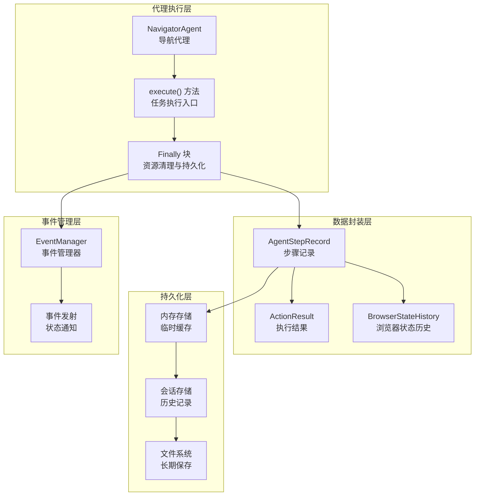

**图表来源**
- [navigator.ts](file://chrome-extension/src/background/agent/agents/navigator.ts#L110-L265)
- [history.ts](file://chrome-extension/src/background/agent/history.ts#L1-L30)

## execute方法的finally块关键作用

execute方法的finally块是整个结果处理与持久化机制的核心所在，它确保了即使在异常情况下也能正确保存执行状态和历史记录。

### finally块的执行时机

finally块在以下情况下被触发：
- 正常执行完成
- 发生未捕获的异常
- 执行被取消（cancelled标志为true）

### 关键职责分析

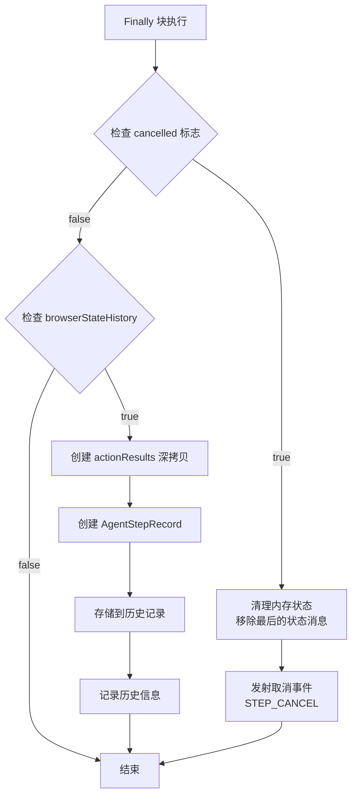

**图表来源**
- [navigator.ts](file://chrome-extension/src/background/agent/agents/navigator.ts#L240-L265)

**节来源**
- [navigator.ts](file://chrome-extension/src/background/agent/agents/navigator.ts#L240-L265)

## AgentStepRecord核心组件分析

AgentStepRecord是历史记录的基本单元，负责封装单个执行步骤的所有关键信息。

### 数据结构设计

AgentStepRecord包含四个核心属性：

| 属性名 | 类型 | 描述 | 用途 |
|--------|------|------|------|
| modelOutput | string \| null | 模型输出的JSON字符串 | 存储AI决策的原始输出 |
| result | ActionResult[] | 执行结果数组 | 记录每个动作的执行状态 |
| state | BrowserStateHistory | 浏览器状态快照 | 保存执行时的页面状态 |
| metadata | StepMetadata \| null | 步骤元数据 | 包含时间戳、令牌数等统计信息 |

### 构造函数实现

AgentStepRecord的构造函数确保了所有必要信息的完整性：

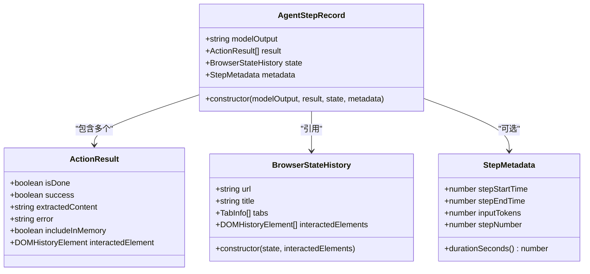

**图表来源**
- [history.ts](file://chrome-extension/src/background/agent/history.ts#L1-L30)
- [types.ts](file://chrome-extension/src/background/agent/types.ts#L80-L120)

**节来源**
- [history.ts](file://chrome-extension/src/background/agent/history.ts#L1-L30)

## actionResultsCopy深拷贝策略

actionResultsCopy采用了深拷贝策略来确保历史记录的一致性和独立性。

### 深拷贝实现机制

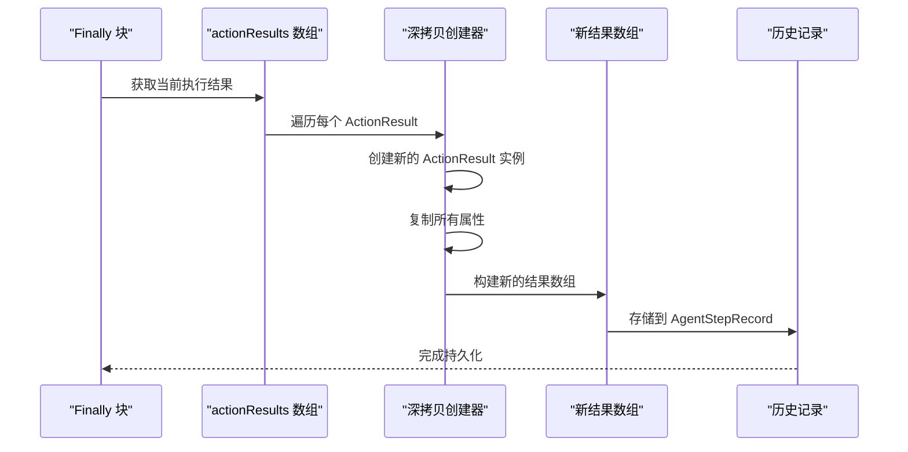

**图表来源**
- [navigator.ts](file://chrome-extension/src/background/agent/agents/navigator.ts#L250-L260)

### 深拷贝的优势

1. **数据隔离**：防止后续修改影响已保存的历史记录
2. **一致性保障**：确保历史记录反映的是执行时刻的真实状态
3. **调试便利**：提供准确的回溯依据

### 元素复制策略

深拷贝过程中，每个ActionResult元素都通过构造函数重新创建：

```typescript
const actionResultsCopy = actionResults.map(result => {
  return new ActionResult({
    isDone: result.isDone,
    success: result.success,
    extractedContent: result.extractedContent,
    error: result.error,
    includeInMemory: result.includeInMemory,
    interactedElement: result.interactedElement,
  });
});
```

**节来源**
- [navigator.ts](file://chrome-extension/src/background/agent/agents/navigator.ts#L250-L260)

## browserStateHistory创建与交互

browserStateHistory是浏览器状态的时间快照，包含了执行时刻的完整页面信息。

### 创建过程分析

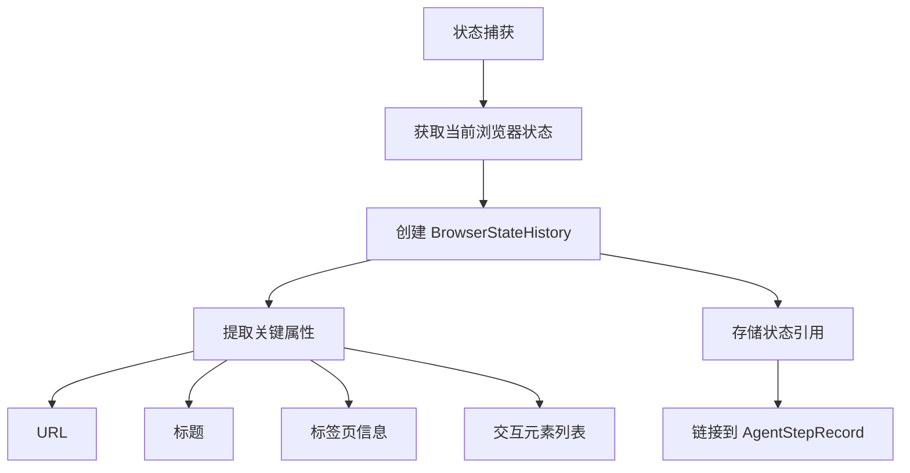

**图表来源**
- [navigator.ts](file://chrome-extension/src/background/agent/agents/navigator.ts#L130-L135)
- [views.ts](file://chrome-extension/src/background/browser/views.ts#L110-L125)

### 与BrowserContext的交互

BrowserStateHistory与BrowserContext通过getState方法建立联系：

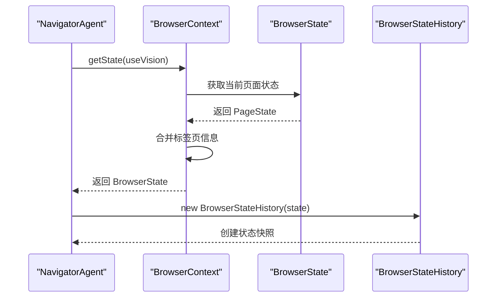

**图表来源**
- [navigator.ts](file://chrome-extension/src/background/agent/agents/navigator.ts#L130-L135)
- [context.ts](file://chrome-extension/src/background/browser/context.ts#L325-L359)

### 状态信息完整性

BrowserStateHistory包含以下关键信息：

| 字段 | 类型 | 描述 | 存储原因 |
|------|------|------|----------|
| url | string | 当前页面URL | 支持任务重放和状态恢复 |
| title | string | 页面标题 | 提供上下文信息 |
| tabs | TabInfo[] | 所有标签页信息 | 维护多标签页状态 |
| interactedElements | DOMHistoryElement[] | 交互元素列表 | 跟踪用户操作轨迹 |

**节来源**
- [views.ts](file://chrome-extension/src/background/browser/views.ts#L110-L125)

## 历史记录持久化机制

历史记录持久化是系统可靠性的基石，支持任务重放、调试和审计需求。

### 存储架构

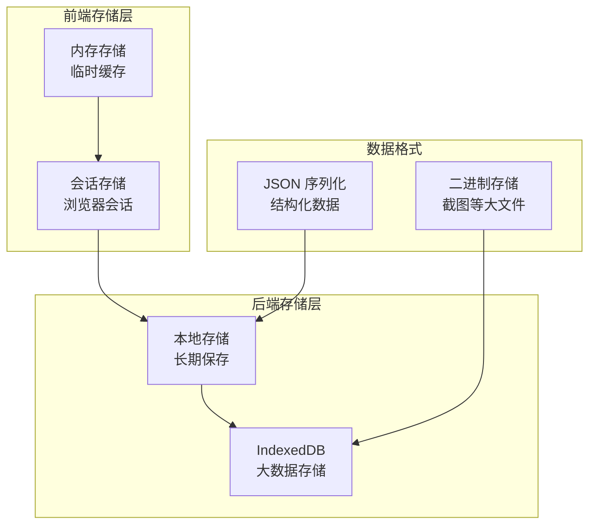

**图表来源**
- [history.ts](file://packages/storage/lib/chat/history.ts#L34-L76)
- [types.ts](file://packages/storage/lib/chat/types.ts#L48-L71)

### modelOutputString的JSON序列化

modelOutputString作为模型输出的JSON序列化存储，具有以下特点：

1. **完整性保证**：存储原始的JSON字符串，不丢失任何信息
2. **可解析性**：保持标准JSON格式，便于后续解析
3. **版本兼容**：支持不同版本的模型输出格式

### ActionResult的完整状态保存

ActionResult的完整状态保存包括：

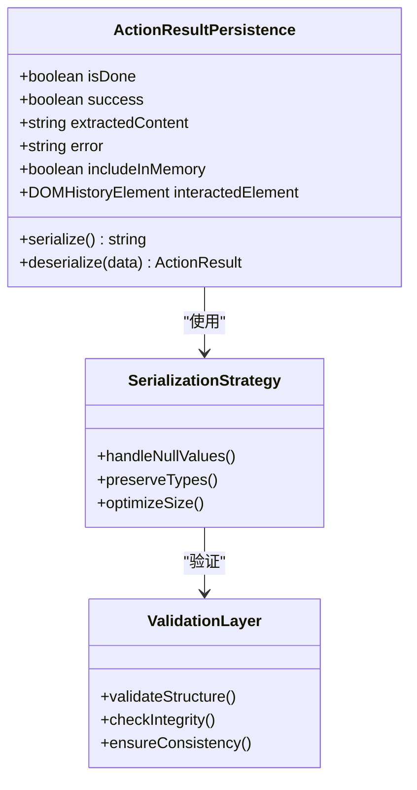

**图表来源**
- [types.ts](file://chrome-extension/src/background/agent/types.ts#L80-L120)

### 会话级别的持久化

系统采用会话级别进行历史记录持久化：

| 存储类型 | 生命周期 | 存储位置 | 适用场景 |
|----------|----------|----------|----------|
| 内存存储 | 会话期间 | 浏览器内存 | 快速访问和临时缓存 |
| 本地存储 | 长期保存 | localStorage | 跨会话历史记录 |
| IndexedDB | 持久化存储 | 浏览器数据库 | 大量历史数据 |

**节来源**
- [history.ts](file://packages/storage/lib/chat/history.ts#L203-L254)

## cancelled标志位处理流程

cancelled标志位是处理取消场景的核心机制，确保系统在各种异常情况下的正确行为。

### 标志位设置时机

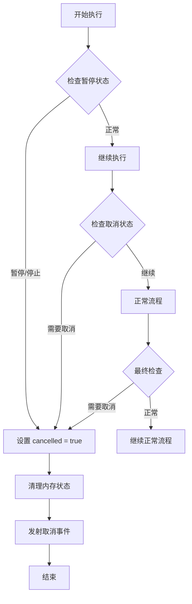

**图表来源**
- [navigator.ts](file://chrome-extension/src/background/agent/agents/navigator.ts#L120-L140)
- [navigator.ts](file://chrome-extension/src/background/agent/agents/navigator.ts#L240-L250)

### 取消处理的具体步骤

1. **内存清理**：调用`removeLastStateMessageFromMemory()`移除最后的状态消息
2. **事件发射**：通过`emitEvent()`发射`STEP_CANCEL`事件
3. **状态更新**：设置相应的取消状态标志

### 事件发射机制

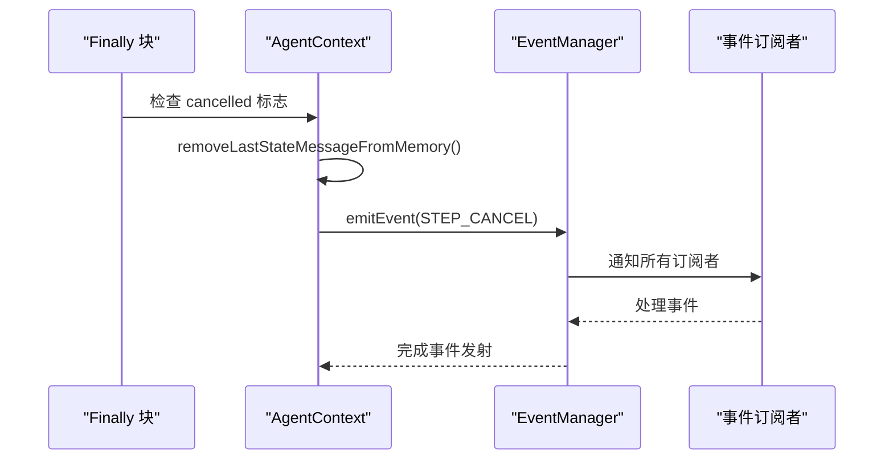

**图表来源**
- [navigator.ts](file://chrome-extension/src/background/agent/agents/navigator.ts#L245-L250)
- [manager.ts](file://chrome-extension/src/background/agent/event/manager.ts#L35-L51)

**节来源**
- [navigator.ts](file://chrome-extension/src/background/agent/agents/navigator.ts#L240-L265)

## 系统可靠性与可追溯性价值

结果处理与持久化机制在系统可靠性与可追溯性方面发挥着至关重要的作用。

### 可靠性保障机制

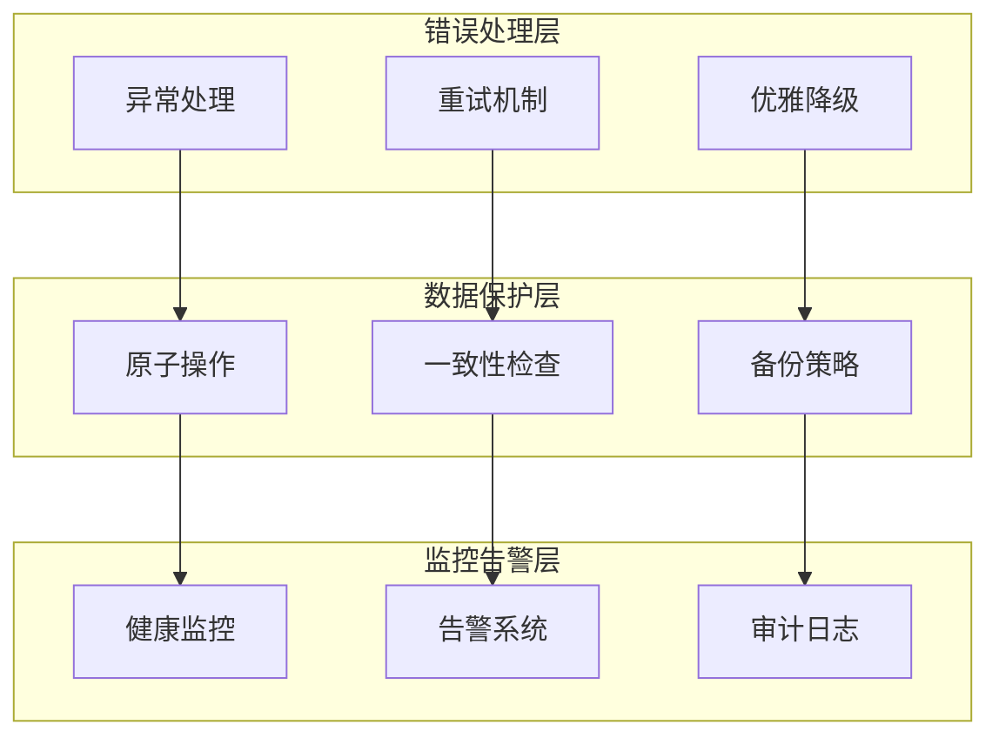

### 可追溯性特征

1. **完整轨迹**：每个步骤都有完整的执行记录
2. **时间戳精确**：每步操作都有精确的时间标记
3. **状态快照**：保存执行时刻的完整页面状态
4. **错误定位**：详细的错误信息和上下文

### 任务重放支持

系统通过历史记录支持任务重放功能：

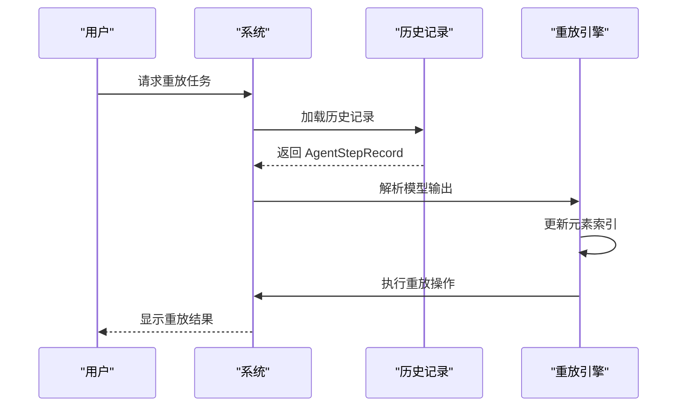

**图表来源**
- [navigator.ts](file://chrome-extension/src/background/agent/agents/navigator.ts#L540-L580)

### 性能优化考虑

为了确保系统的高性能，持久化机制采用了多种优化策略：

| 优化策略 | 实现方式 | 性能收益 |
|----------|----------|----------|
| 延迟写入 | 批量处理历史记录 | 减少I/O操作频率 |
| 数据压缩 | JSON序列化优化 | 降低存储空间占用 |
| 分层存储 | 内存+磁盘结合 | 平衡访问速度和容量 |
| 异步处理 | 非阻塞写入 | 提升用户体验 |

**节来源**
- [navigator.ts](file://chrome-extension/src/background/agent/agents/navigator.ts#L540-L666)

## 总结

NanoBrowser的结果处理与持久化机制通过精心设计的架构，在保证系统可靠性的同时，提供了强大的可追溯性和任务重放能力。execute方法的finally块确保了无论正常还是异常情况下都能正确保存执行状态，AgentStepRecord作为核心数据结构封装了完整的执行信息，而深拷贝策略和持久化机制则保障了历史记录的一致性和完整性。

这一系列机制共同构成了一个健壮的代理系统基础，不仅支持当前的任务执行，还为未来的调试、分析和优化提供了坚实的数据基础。通过合理的错误处理、事件发射和状态管理，系统能够在复杂的应用场景中保持稳定可靠的运行。