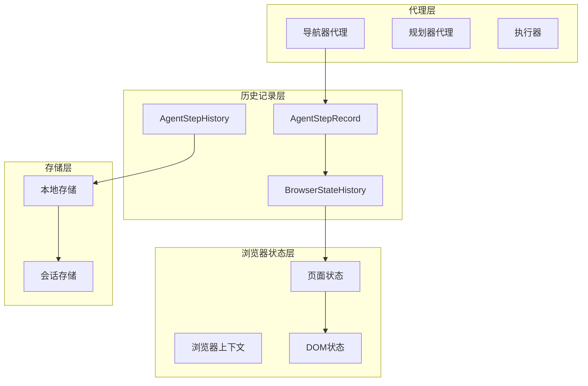
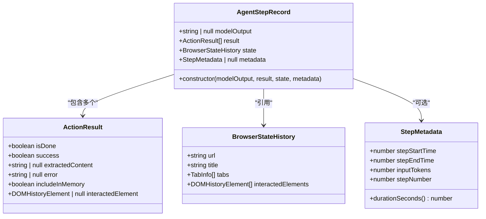
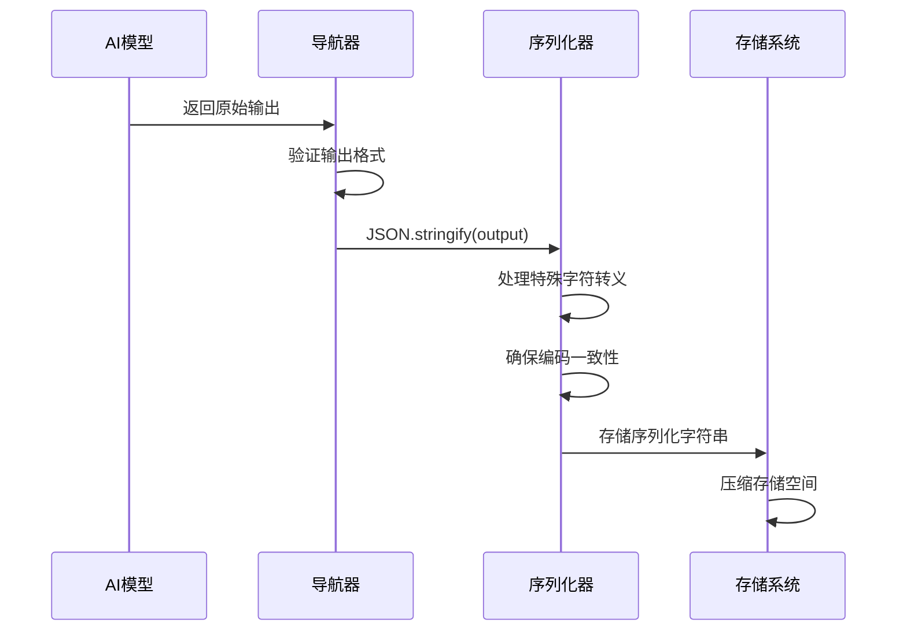
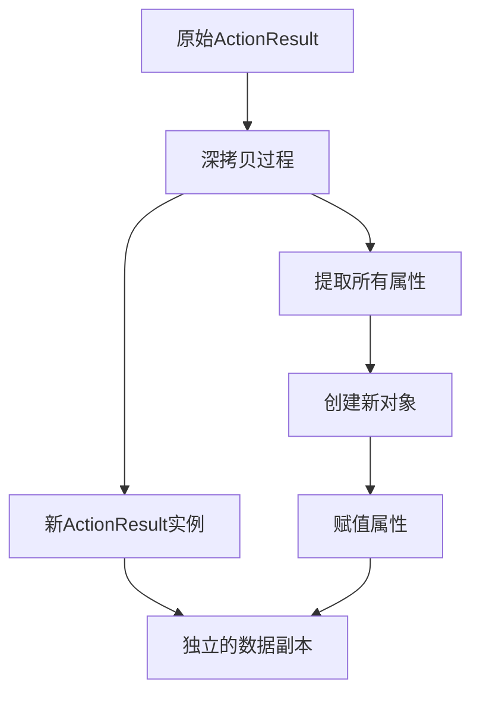
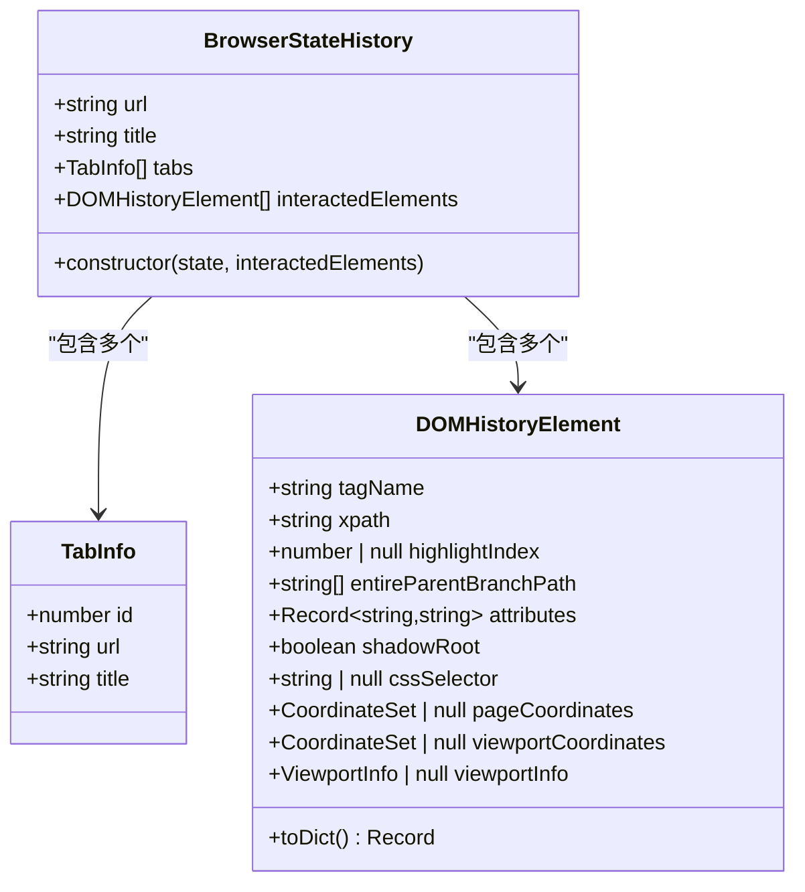
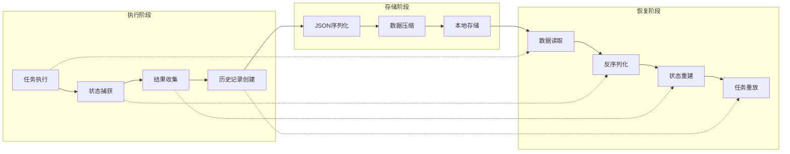
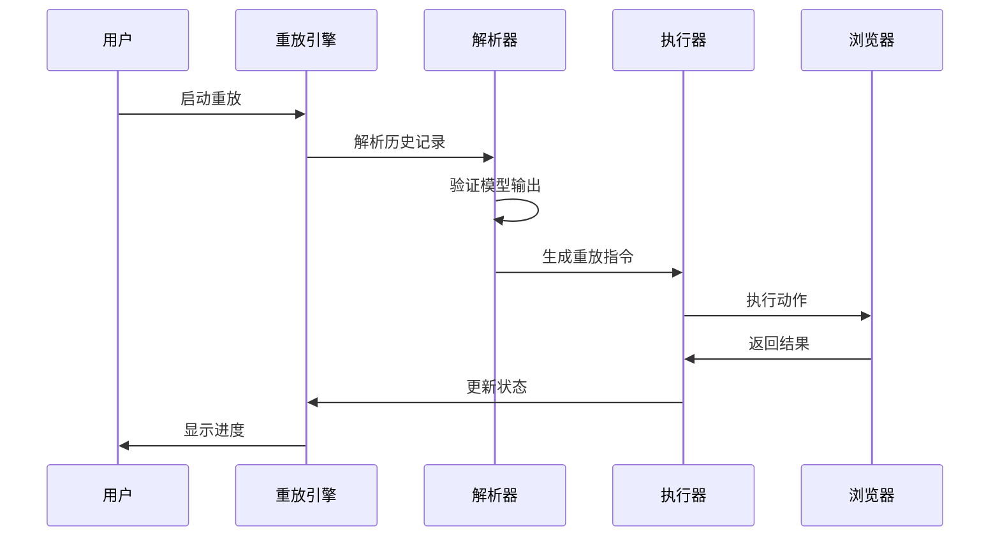
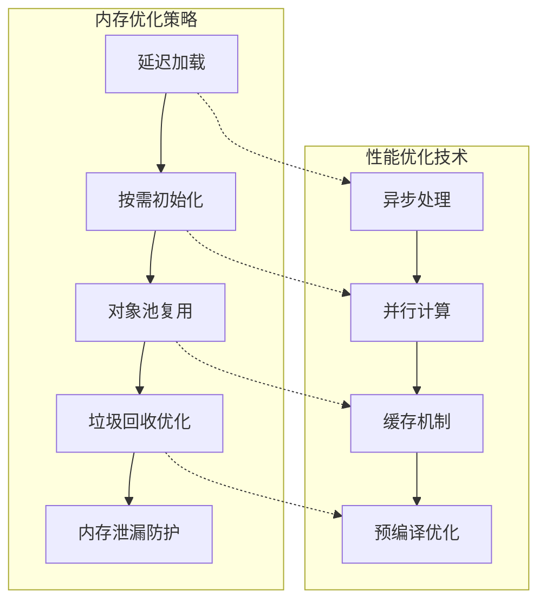

# 结果持久化机制

<cite>
**本文档中引用的文件**
- [history.ts](file://chrome-extension/src/background/agent/history.ts)
- [types.ts](file://chrome-extension/src/background/agent/types.ts)
- [navigator.ts](file://chrome-extension/src/background/agent/agents/navigator.ts)
- [views.ts](file://chrome-extension/src/background/browser/views.ts)
- [service.ts](file://chrome-extension/src/background/browser/dom/history/service.ts)
- [view.ts](file://chrome-extension/src/background/browser/dom/history/view.ts)
- [history.ts](file://packages/storage/lib/chat/history.ts)
</cite>

## 目录
1. [引言](#引言)
2. [项目结构概述](#项目结构概述)
3. [AgentStepRecord核心设计](#agentsteprecord核心设计)
4. [JSON序列化存储策略](#json序列化存储策略)
5. [ActionResult深拷贝实现](#actionresult深拷贝实现)
6. [BrowserStateHistory状态捕获](#browserstatehistory状态捕获)
7. [持久化机制架构](#持久化机制架构)
8. [任务重放与调试支持](#任务重放与调试支持)
9. [内存管理与性能优化](#内存管理与性能优化)
10. [总结](#总结)

## 引言

NanoBrowser项目实现了一套精密的结果持久化机制，通过AgentStepRecord类为核心的数据结构，实现了对浏览器自动化任务执行过程的完整记录和回放能力。这套机制不仅确保了任务历史的完整性，还为调试分析、用户审计和系统监控提供了强大的支持。

## 项目结构概述

NanoBrowser采用模块化的架构设计，主要分为以下几个核心模块：

**图表来源**
- [navigator.ts](file://chrome-extension/src/background/agent/agents/navigator.ts#L240-L255)
- [history.ts](file://chrome-extension/src/background/agent/history.ts#L3-L28)

## AgentStepRecord核心设计

AgentStepRecord是整个持久化机制的核心数据结构，它封装了单个任务步骤的所有关键信息。

### 四个核心属性详解

#### modelOutput：模型输出的JSON序列化存储

modelOutput属性存储经过JSON序列化的模型输出字符串，这是任务执行过程中AI模型决策的直接记录。

**图表来源**
- [history.ts](file://chrome-extension/src/background/agent/history.ts#L3-L20)
- [types.ts](file://chrome-extension/src/background/agent/types.ts#L111-L127)
- [views.ts](file://chrome-extension/src/background/browser/views.ts#L115-L130)

#### result：ActionResult数组的深拷贝

result属性保存了当前步骤所有操作的结果集合，每个ActionResult代表一个具体的操作执行情况。

#### state：BrowserStateHistory的完整快照

state属性捕获了执行前的浏览器状态快照，包括URL、标题、标签页信息和交互元素列表。

#### metadata：步骤元数据的可选存储

metadata属性提供了额外的执行统计信息，如开始时间、结束时间、输入令牌数等。

**章节来源**
- [history.ts](file://chrome-extension/src/background/agent/history.ts#L3-L20)
- [types.ts](file://chrome-extension/src/background/agent/types.ts#L133-L152)

## JSON序列化存储策略

### modelOutputString的JSON序列化保障

系统采用严格的JSON序列化策略来确保模型输出的完整性和一致性：

**图表来源**
- [navigator.ts](file://chrome-extension/src/background/agent/agents/navigator.ts#L184-L185)

### 序列化完整性保障机制

1. **严格的数据验证**：在序列化前对模型输出进行格式验证
2. **字符编码统一**：使用标准UTF-8编码确保跨平台兼容性
3. **特殊字符转义**：自动处理JSON特殊字符的转义
4. **压缩优化**：对大型输出进行适当的压缩以节省存储空间

**章节来源**
- [navigator.ts](file://chrome-extension/src/background/agent/agents/navigator.ts#L151-L185)

## ActionResult深拷贝实现

### 深拷贝实现方式

系统通过构造函数创建ActionResult的新实例来实现深拷贝，确保原始数据不被修改：

**图表来源**
- [navigator.ts](file://chrome-extension/src/background/agent/agents/navigator.ts#L240-L250)

### 避免状态污染的关键价值

深拷贝机制在以下方面发挥关键作用：

1. **数据隔离**：防止不同步骤间的状态相互影响
2. **不可变性**：确保历史记录的不可篡改性
3. **并发安全**：支持多线程环境下的安全访问
4. **调试便利**：提供准确的历史状态快照

**章节来源**
- [navigator.ts](file://chrome-extension/src/background/agent/agents/navigator.ts#L240-L250)

## BrowserStateHistory状态捕获

### DOM结构快照捕获

BrowserStateHistory类负责捕获执行前的完整DOM结构信息：

**图表来源**
- [views.ts](file://chrome-extension/src/background/browser/views.ts#L115-L130)
- [view.ts](file://chrome-extension/src/background/browser/dom/history/view.ts#L35-L62)

### 标签页信息记录

系统精确记录所有打开的标签页信息，包括：
- 标签页ID和URL
- 页面标题信息
- 页面加载状态

### 页面状态快照

除了DOM结构，还捕获：
- 页面滚动位置
- 视口信息
- 元素坐标信息
- 属性映射关系

**章节来源**
- [views.ts](file://chrome-extension/src/background/browser/views.ts#L115-L130)

## 持久化机制架构

### 整体架构设计

**图表来源**
- [history.ts](file://chrome-extension/src/background/agent/history.ts#L25-L27)
- [history.ts](file://packages/storage/lib/chat/history.ts#L203-L254)

### 数据流管理

系统实现了完整的数据流管理机制：

1. **实时捕获**：在任务执行过程中实时捕获状态
2. **批量处理**：定期批量写入以提高性能
3. **增量更新**：只存储变化的部分以减少存储开销
4. **事务保证**：确保数据的一致性和完整性

**章节来源**
- [navigator.ts](file://chrome-extension/src/background/agent/agents/navigator.ts#L240-L255)

## 任务重放与调试支持

### 任务重放机制

系统通过解析历史记录来实现任务的完全重放：

**图表来源**
- [navigator.ts](file://chrome-extension/src/background/agent/agents/navigator.ts#L538-L615)

### 调试分析功能

历史记录为调试提供了丰富的信息：

1. **执行路径追踪**：完整记录每一步的执行路径
2. **错误定位**：精确定位失败的具体步骤
3. **性能分析**：分析各步骤的执行时间和资源消耗
4. **状态对比**：比较不同版本间的状态差异

### 用户审计功能

系统提供完整的审计跟踪：

- 操作时间戳记录
- 用户行为轨迹
- 系统状态变更日志
- 权限访问记录

**章节来源**
- [navigator.ts](file://chrome-extension/src/background/agent/agents/navigator.ts#L451-L483)

## 内存管理与性能优化

### 内存使用策略

系统采用多种策略来优化内存使用：

### 性能优化考量

1. **懒加载机制**：只在需要时加载历史数据
2. **分页加载**：大量历史记录采用分页加载
3. **压缩存储**：使用高效的压缩算法减少存储空间
4. **索引优化**：建立快速检索索引
5. **缓存策略**：智能缓存频繁访问的数据

### 存储效率优化

- **数据去重**：识别并合并重复的历史记录
- **增量备份**：只备份变化的部分
- **压缩算法**：使用高效的压缩算法
- **存储分层**：根据访问频率选择不同的存储介质

**章节来源**
- [history.ts](file://packages/storage/lib/chat/history.ts#L34-L76)

## 总结

NanoBrowser的结果持久化机制通过AgentStepRecord类的精心设计，实现了对浏览器自动化任务的完整记录和可靠回放。该机制具有以下核心优势：

1. **完整性保障**：通过JSON序列化和深拷贝确保数据完整性
2. **可追溯性**：提供完整的任务执行轨迹和状态快照
3. **可重放性**：支持任务的精确重放和调试分析
4. **性能优化**：采用多种优化策略确保高效运行
5. **扩展性**：模块化设计便于功能扩展和维护

这套持久化机制不仅满足了当前的功能需求，还为未来的功能扩展奠定了坚实的基础，是NanoBrowser项目架构中的重要组成部分。