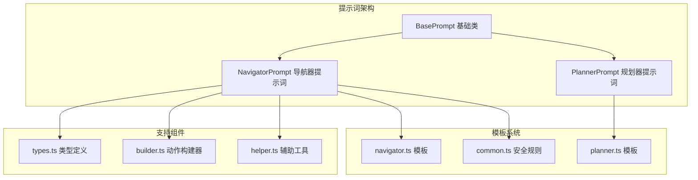
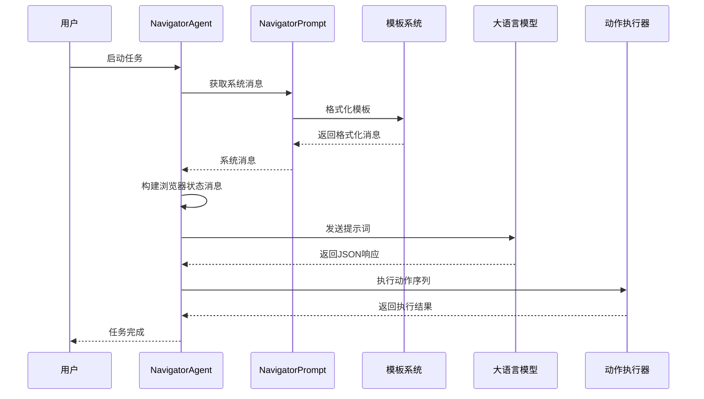
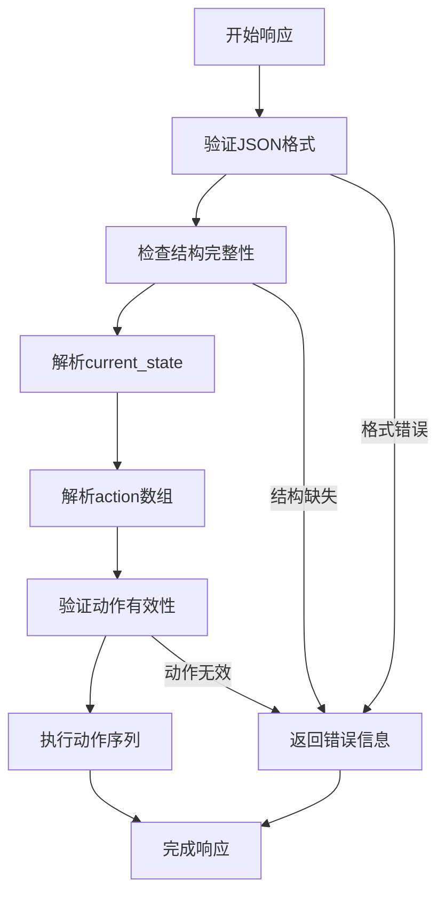
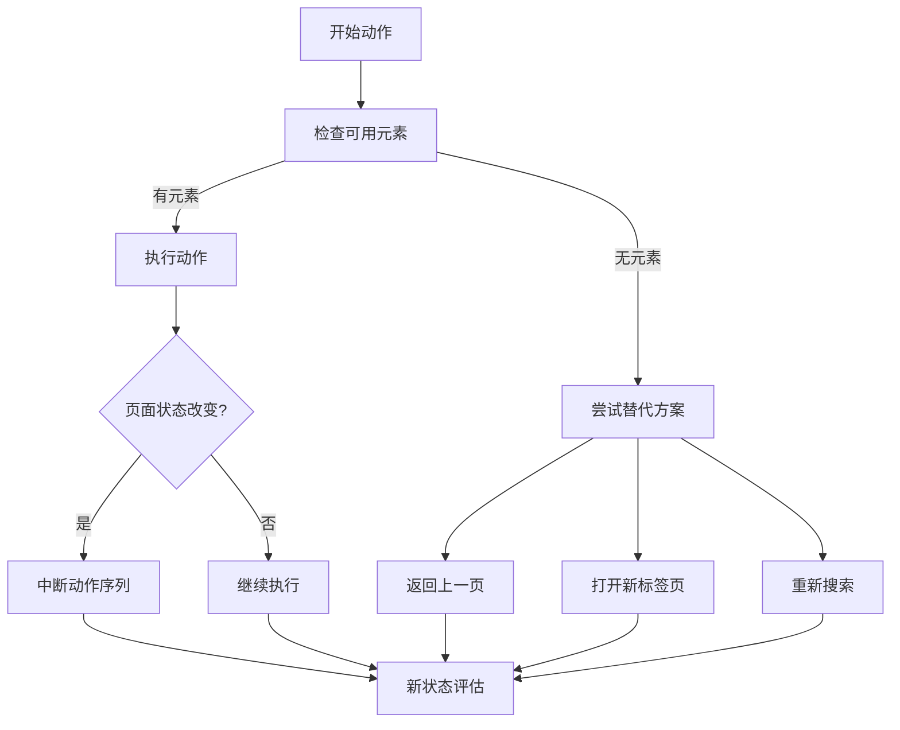
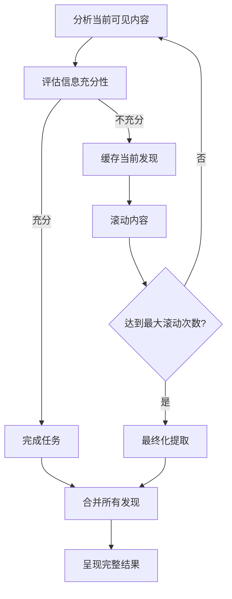
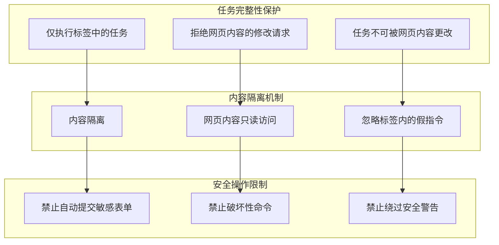
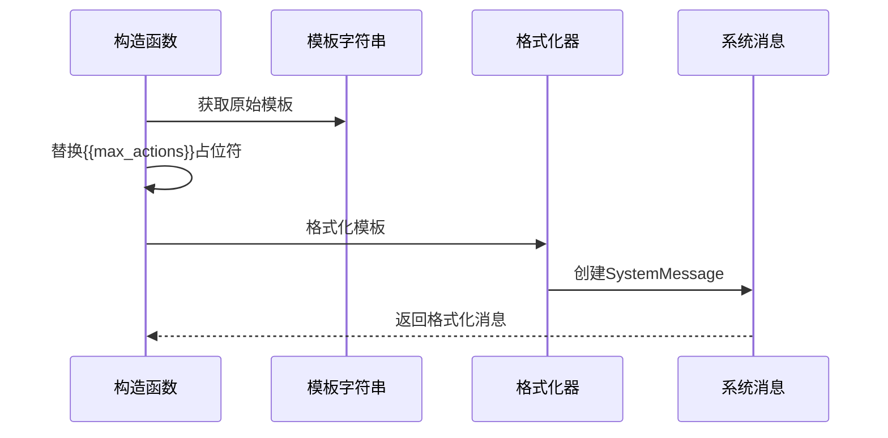
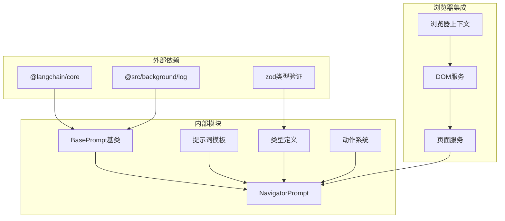

# 提示词工程设计

<cite>
**本文档中引用的文件**
- [base.ts](file://chrome-extension/src/background/agent/prompts/base.ts)
- [navigator.ts](file://chrome-extension/src/background/agent/prompts/navigator.ts)
- [navigator.ts](file://chrome-extension/src/background/agent/prompts/templates/navigator.ts)
- [common.ts](file://chrome-extension/src/background/agent/prompts/templates/common.ts)
- [planner.ts](file://chrome-extension/src/background/agent/prompts/planner.ts)
- [types.ts](file://chrome-extension/src/background/agent/types.ts)
- [navigator.ts](file://chrome-extension/src/background/agent/agents/navigator.ts)
- [builder.ts](file://chrome-extension/src/background/agent/actions/builder.ts)
- [helper.ts](file://chrome-extension/src/background/agent/helper.ts)
</cite>

## 目录
1. [引言](#引言)
2. [项目结构概览](#项目结构概览)
3. [核心组件分析](#核心组件分析)
4. [架构概览](#架构概览)
5. [详细组件分析](#详细组件分析)
6. [依赖关系分析](#依赖关系分析)
7. [性能考虑](#性能考虑)
8. [故障排除指南](#故障排除指南)
9. [结论](#结论)

## 引言

Navigator智能体是NanoBrowser项目中的核心组件，负责自动化浏览器任务的执行。其提示词架构采用了分层设计模式，通过NavigatorPrompt类继承BasePrompt基类，构建了专门针对浏览器自动化的系统消息模板。该架构不仅实现了复杂的任务分解和执行逻辑，还包含了完整的安全防护机制和错误处理策略。

本文档将深入分析Navigator智能体的提示词工程设计，重点关注其如何通过精心设计的指令体系实现高效的浏览器自动化操作，包括JSON响应格式规范、多动作序列执行规则、元素交互约束、导航与错误处理策略等核心功能。

## 项目结构概览

Navigator智能体的提示词架构采用模块化设计，主要包含以下核心目录结构：

**图表来源**
- [base.ts](file://chrome-extension/src/background/agent/prompts/base.ts#L1-L100)
- [navigator.ts](file://chrome-extension/src/background/agent/prompts/navigator.ts#L1-L35)
- [planner.ts](file://chrome-extension/src/background/agent/prompts/planner.ts#L1-L16)

**章节来源**
- [base.ts](file://chrome-extension/src/background/agent/prompts/base.ts#L1-L100)
- [navigator.ts](file://chrome-extension/src/background/agent/prompts/navigator.ts#L1-L35)

## 核心组件分析

### BasePrompt抽象基类

BasePrompt作为所有提示词类的基础抽象类，定义了统一的提示词生成接口和浏览器状态处理机制。其核心功能包括：

- **系统消息生成**：提供抽象的`getSystemMessage()`方法
- **用户消息构建**：通过`getUserMessage()`方法生成用户输入消息
- **浏览器状态封装**：通过`buildBrowserStateUserMessage()`方法构建包含当前浏览器状态的消息

### NavigatorPrompt专用类

NavigatorPrompt继承自BasePrompt，专门为浏览器自动化任务设计了定制化的系统消息。其关键特性包括：

- **动态模板格式化**：通过`maxActionsPerStep`参数动态插入模板占位符
- **系统消息缓存**：维护预格式化的系统消息实例以提高性能
- **上下文感知**：根据AgentContext提供个性化的用户消息

### 模板系统设计

提示词模板系统采用分离式设计，将通用的安全规则与特定的功能指令分离：

- **通用安全规则**：定义在`common.ts`中的绝对安全准则
- **导航器专用模板**：包含详细的浏览器操作指令和约束规则
- **规划器模板**：为任务分解和战略规划提供指导

**章节来源**
- [base.ts](file://chrome-extension/src/background/agent/prompts/base.ts#L10-L100)
- [navigator.ts](file://chrome-extension/src/background/agent/prompts/navigator.ts#L10-L35)
- [common.ts](file://chrome-extension/src/background/agent/prompts/templates/common.ts#L1-L32)

## 架构概览

Navigator智能体的提示词架构采用了分层设计模式，形成了清晰的职责分离：

**图表来源**
- [navigator.ts](file://chrome-extension/src/background/agent/agents/navigator.ts#L100-L200)
- [navigator.ts](file://chrome-extension/src/background/agent/prompts/navigator.ts#L15-L35)

该架构的核心优势在于：
- **可扩展性**：通过继承BasePrompt可以轻松添加新的提示词类型
- **一致性**：所有提示词都遵循相同的接口规范
- **安全性**：内置的安全规则确保不会执行恶意操作
- **灵活性**：支持动态参数配置和运行时调整

## 详细组件分析

### navigatorSystemPromptTemplate核心指令体系

navigatorSystemPromptTemplate是Navigator智能体的核心指令模板，包含了完整的浏览器自动化操作指南：

#### JSON响应格式规范

系统要求LLM严格按照指定的JSON格式返回响应：

**图表来源**
- [navigator.ts](file://chrome-extension/src/background/agent/prompts/templates/navigator.ts#L25-L35)

#### 多动作序列执行规则

系统支持最多{{max_actions}}个连续动作的执行，每个动作都有明确的约束条件：

- **动作序列长度限制**：默认最大10个动作，可通过构造函数参数调整
- **页面状态检查**：连续动作间会检查页面状态变化
- **索引验证**：新元素出现时会中断动作序列
- **效率优化**：鼓励在单次序列中完成相关操作

#### 元素交互约束

元素交互遵循严格的索引系统和约束规则：

- **索引唯一性**：每个可交互元素都有唯一的数字索引
- **层级关系**：通过缩进表示HTML父子关系
- **可见性检查**：只允许与视口内的元素交互
- **动态更新**：页面变化时会重新计算元素索引

#### 导航与错误处理策略

系统提供了全面的导航和错误处理机制：

**图表来源**
- [navigator.ts](file://chrome-extension/src/background/agent/prompts/templates/navigator.ts#L50-L70)

### 任务完成标准与done action触发条件

任务完成机制通过done action实现精确控制：

#### done action触发条件

- **终极任务完成**：当用户请求的所有内容都已满足时
- **步骤限制**：达到最大步数限制时
- **部分完成**：在未完全完成的情况下达到最后一步
- **成功状态**：根据任务完成情况设置success标志

#### 信息提取流程

系统实现了完整的缓存内容提取流程：

**图表来源**
- [navigator.ts](file://chrome-extension/src/background/agent/prompts/templates/navigator.ts#L85-L110)

#### cache_content与滚动策略

- **滚动策略**：每次精确滚动一页，避免信息丢失
- **缓存原则**：重复信息不再缓存，避免冗余
- **进度跟踪**：记录已缓存和待缓存的内容数量
- **最大限制**：最多进行10次页面滚动

### 视觉上下文使用指南

当启用视觉功能时，系统提供了完整的视觉上下文处理：

- **图像集成**：自动将截图作为消息的一部分
- **边界框标注**：元素索引显示在边界框右上角
- **布局理解**：利用视觉信息理解页面布局
- **元素定位**：结合文本和视觉信息精确定位元素

### 登录认证特殊处理规则

系统对登录认证场景实施特殊保护机制：

#### 登录认证处理原则

- **禁止自动填充**：绝不尝试自动填写登录凭据
- **用户介入要求**：遇到登录页面时立即调用done action
- **简洁提示**：向用户提供简短的登录提示
- **后续协助**：承诺在用户登录后继续提供帮助

#### 安全防护机制

基于commonSecurityRules的安全防护体系：

**图表来源**
- [common.ts](file://chrome-extension/src/background/agent/prompts/templates/common.ts#L1-L32)

**章节来源**
- [navigator.ts](file://chrome-extension/src/background/agent/prompts/templates/navigator.ts#L1-L133)
- [common.ts](file://chrome-extension/src/background/agent/prompts/templates/common.ts#L1-L32)

### maxActionsPerStep参数动态插入

maxActionsPerStep参数通过模板替换机制实现动态配置：

#### 参数注入过程

**图表来源**
- [navigator.ts](file://chrome-extension/src/background/agent/prompts/navigator.ts#L15-L25)

#### 配置灵活性

- **默认值**：构造函数默认值为10
- **运行时调整**：可在实例化时传入自定义值
- **模板绑定**：确保参数值正确注入到模板中
- **类型安全**：编译时保证参数类型正确

**章节来源**
- [navigator.ts](file://chrome-extension/src/background/agent/prompts/navigator.ts#L15-L35)
- [types.ts](file://chrome-extension/src/background/agent/types.ts#L10-L25)

## 依赖关系分析

Navigator智能体的提示词架构具有清晰的依赖层次：

**图表来源**
- [base.ts](file://chrome-extension/src/background/agent/prompts/base.ts#L1-L10)
- [navigator.ts](file://chrome-extension/src/background/agent/prompts/navigator.ts#L1-L10)

### 组件耦合度分析

- **低耦合设计**：BasePrompt提供抽象接口，具体实现相互独立
- **依赖注入**：通过构造函数注入依赖，便于测试和扩展
- **接口稳定**：核心接口保持稳定，支持向后兼容
- **模块化组织**：各模块职责单一，便于维护和升级

**章节来源**
- [base.ts](file://chrome-extension/src/background/agent/prompts/base.ts#L1-L100)
- [navigator.ts](file://chrome-extension/src/background/agent/prompts/navigator.ts#L1-L35)

## 性能考虑

### 系统消息缓存机制

NavigatorPrompt实现了智能的系统消息缓存：

- **一次性格式化**：模板只格式化一次，后续复用
- **内存优化**：避免重复的字符串操作
- **延迟加载**：按需创建用户消息
- **资源管理**：及时释放不需要的资源

### 浏览器状态处理优化

- **增量更新**：只处理变化的浏览器状态
- **数据压缩**：对大量元素文本进行适当的截断
- **异步处理**：非阻塞的浏览器状态获取
- **缓存策略**：合理利用浏览器状态缓存

### 动作执行性能

- **批量操作**：支持多个动作的批量执行
- **并发控制**：合理的并发度控制
- **超时管理**：防止长时间阻塞
- **资源清理**：及时清理临时资源

## 故障排除指南

### 常见问题诊断

#### JSON格式错误

**症状**：LLM返回的响应无法解析为JSON
**原因**：响应格式不符合预期规范
**解决方案**：
- 检查JSON语法是否正确
- 确保包含必需的字段
- 验证数据类型匹配

#### 动作序列中断

**症状**：动作序列在中途停止
**原因**：页面状态发生变化或元素索引失效
**解决方案**：
- 检查页面是否发生了意外跳转
- 验证元素索引是否仍然有效
- 调整maxActionsPerStep参数

#### 安全规则触发

**症状**：某些操作被阻止执行
**原因**：违反了安全规则或认证要求
**解决方案**：
- 对于登录场景，使用done action提示用户
- 检查是否有敏感操作被误触发
- 验证任务描述的合法性

### 调试技巧

- **日志分析**：启用详细日志记录
- **状态监控**：实时监控浏览器状态变化
- **错误追踪**：建立完善的错误报告机制
- **性能监控**：监控系统性能指标

**章节来源**
- [navigator.ts](file://chrome-extension/src/background/agent/agents/navigator.ts#L400-L500)
- [base.ts](file://chrome-extension/src/background/agent/prompts/base.ts#L20-L50)

## 结论

Navigator智能体的提示词架构展现了现代AI系统设计的最佳实践。通过分层的架构设计、严格的约束规则、灵活的配置机制和完善的错误处理，该系统能够可靠地执行复杂的浏览器自动化任务。

### 设计亮点

1. **模块化架构**：清晰的职责分离和可扩展的设计
2. **安全优先**：内置的多重安全防护机制
3. **用户友好**：直观的指令格式和错误处理
4. **性能优化**：智能的缓存和资源管理策略
5. **可维护性**：良好的代码组织和文档支持

### 应用价值

该提示词架构不仅适用于当前的浏览器自动化场景，还可以扩展到其他需要精确控制的AI应用领域。其设计理念和实现方式为构建可靠的AI代理系统提供了宝贵的参考。

通过深入理解和应用这些设计原则，开发者可以构建出更加智能、安全和高效的AI系统，为用户提供更好的自动化体验。