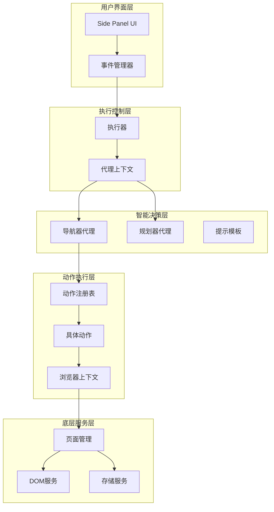
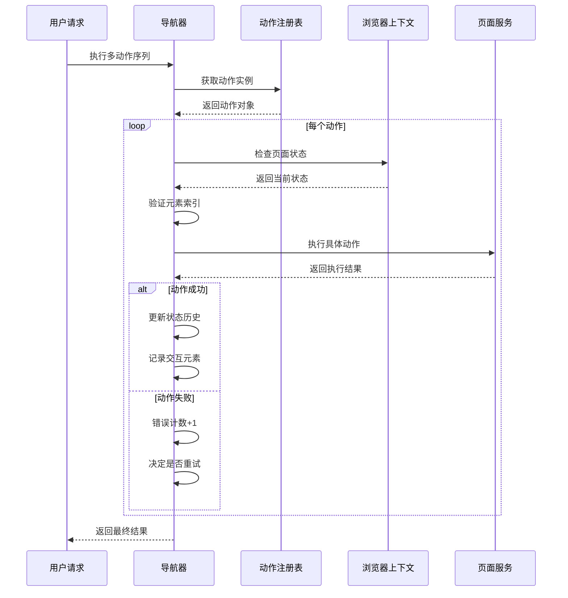
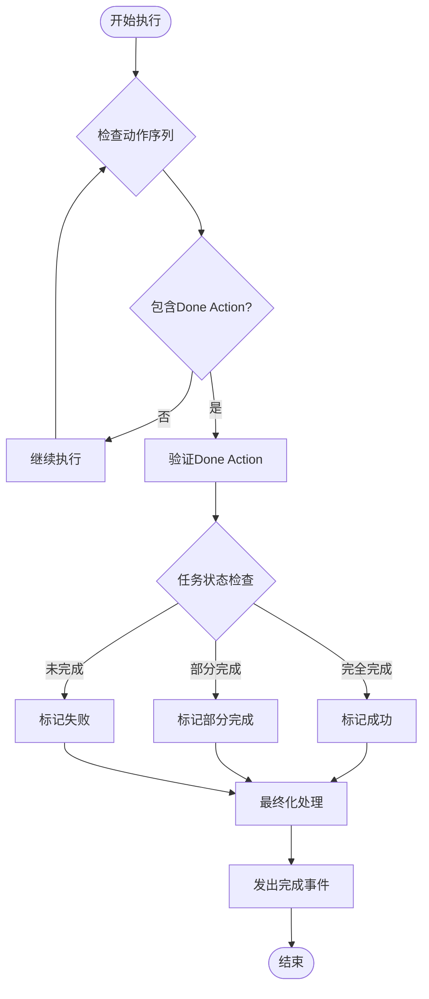
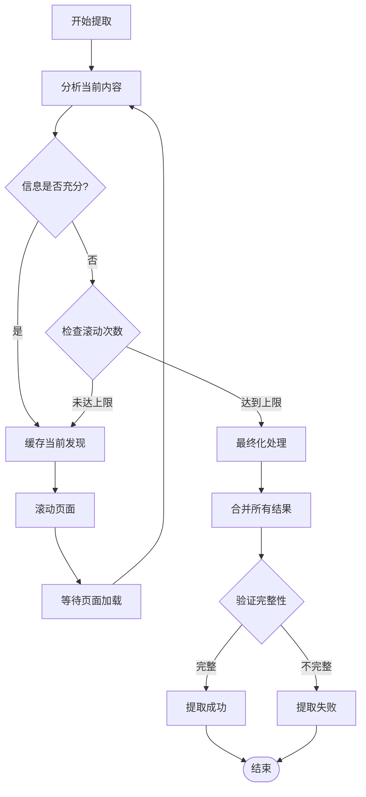
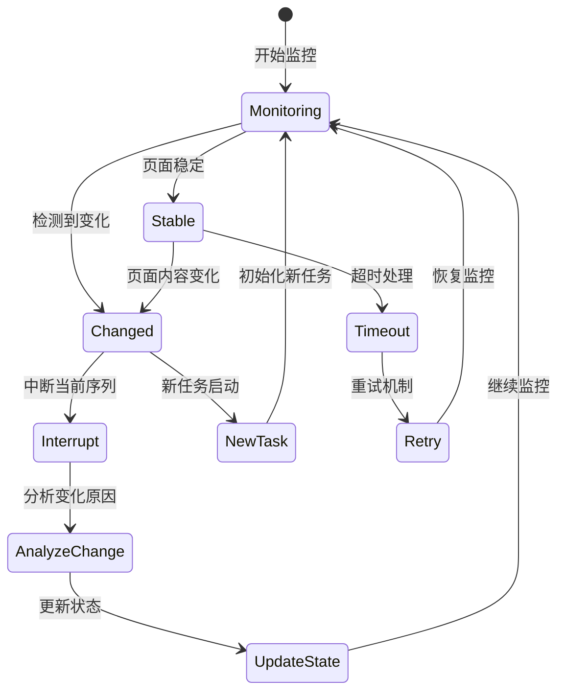
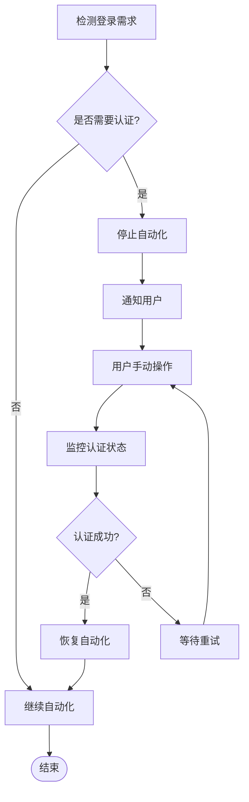
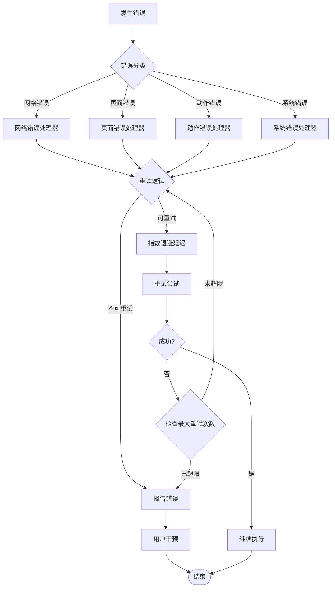
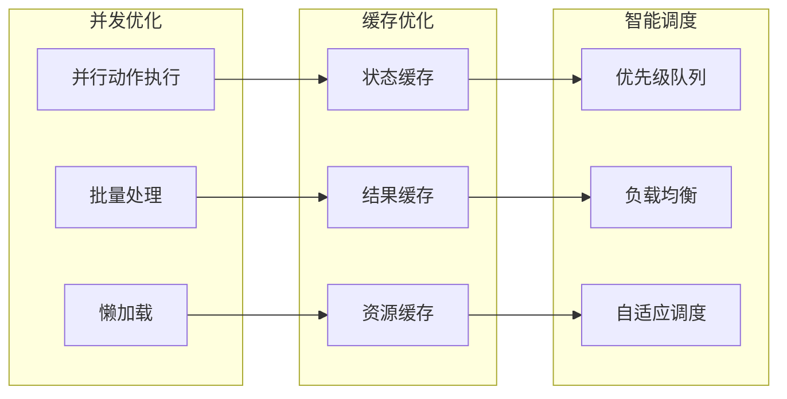

# 行为规范与执行策略

<cite>
**本文档引用的文件**
- [navigator.ts](file://chrome-extension/src/background/agent/agents/navigator.ts)
- [executor.ts](file://chrome-extension/src/background/agent/executor.ts)
- [page.ts](file://chrome-extension/src/background/browser/page.ts)
- [service.ts](file://chrome-extension/src/background/browser/dom/service.ts)
- [builder.ts](file://chrome-extension/src/background/agent/actions/builder.ts)
- [types.ts](file://chrome-extension/src/background/agent/types.ts)
- [navigator.ts](file://chrome-extension/src/background/agent/prompts/navigator.ts)
- [navigator.ts](file://chrome-extension/src/background/agent/prompts/templates/navigator.ts)
- [views.ts](file://chrome-extension/src/background/browser/dom/views.ts)
- [service.ts](file://chrome-extension/src/background/browser/dom/clickable/service.ts)
- [manager.ts](file://chrome-extension/src/background/agent/events/manager.ts)
- [types.ts](file://chrome-extension/src/background/agent/events/types.ts)
</cite>

## 目录
1. [引言](#引言)
2. [系统架构概览](#系统架构概览)
3. [动作执行规则体系](#动作执行规则体系)
4. [任务完成标准与状态管理](#任务完成标准与状态管理)
5. [信息提取流程与缓存策略](#信息提取流程与缓存策略)
6. [页面状态变更与中断机制](#页面状态变更与中断机制)
7. [登录认证特殊处理规则](#登录认证特殊处理规则)
8. [错误处理与恢复策略](#错误处理与恢复策略)
9. [性能优化与最佳实践](#性能优化与最佳实践)
10. [总结](#总结)

## 引言

Navigator智能体是一个复杂的自动化浏览器代理系统，通过多层架构实现智能化的网页交互。该系统采用基于规则的行为规范体系，确保动作执行的准确性、可靠性和用户体验的连续性。本文档深入分析其行为规范体系，涵盖动作执行规则、任务完成标准、信息提取流程以及各种特殊情况的处理机制。

## 系统架构概览

Navigator智能体采用分层架构设计，包含以下核心组件：

**图表来源**
- [executor.ts](file://chrome-extension/src/background/agent/executor.ts#L1-L50)
- [navigator.ts](file://chrome-extension/src/background/agent/agents/navigator.ts#L1-L50)
- [types.ts](file://chrome-extension/src/background/agent/types.ts#L1-L50)

**章节来源**
- [executor.ts](file://chrome-extension/src/background/agent/executor.ts#L1-L100)
- [navigator.ts](file://chrome-extension/src/background/agent/agents/navigator.ts#L1-L100)

## 动作执行规则体系

### 多动作序列编排逻辑

Navigator智能体支持复杂多动作序列的编排，遵循严格的执行顺序和状态检查机制：

**图表来源**
- [navigator.ts](file://chrome-extension/src/background/agent/agents/navigator.ts#L353-L450)
- [builder.ts](file://chrome-extension/src/background/agent/actions/builder.ts#L1-L100)

### 动作验证与参数处理

每个动作都经过严格的验证和参数处理：

| 动作类型 | 参数验证 | 索引检查 | 特殊处理 |
|---------|---------|---------|---------|
| 点击元素 | 验证元素存在性和可交互性 | 检查高亮索引 | 文件上传特殊处理 |
| 输入文本 | 验证输入格式和长度 | 确认元素类型 | 自动等待页面稳定 |
| 滚动操作 | 验证滚动目标和边界 | 检查元素可见性 | 分页滚动优化 |
| 下拉选择 | 验证选项列表和选择值 | 确认下拉元素类型 | 编码文本匹配 |

**章节来源**
- [builder.ts](file://chrome-extension/src/background/agent/actions/builder.ts#L100-L300)
- [navigator.ts](file://chrome-extension/src/background/agent/agents/navigator.ts#L353-L450)

## 任务完成标准与状态管理

### Done Action触发条件

任务完成通过专门的Done Action实现，具有明确的触发条件和状态判断依据：

**图表来源**
- [navigator.ts](file://chrome-extension/src/background/agent/agents/navigator.ts#L100-L150)
- [navigator.ts](file://chrome-extension/src/background/agent/prompts/templates/navigator.ts#L80-L100)

### 成功与失败状态判断

系统通过多层次的状态判断确保任务完成的准确性：

| 判断维度 | 成功条件 | 失败条件 | 中间状态 |
|---------|---------|---------|---------|
| 任务完整性 | 所有子任务完成 | 超出最大步数限制 | 进行中任务 |
| 动作执行 | 全部动作成功 | 连续错误超过阈值 | 部分失败 |
| 页面状态 | 页面无显著变化 | 页面状态异常 | 状态不稳定 |
| 用户交互 | 用户确认完成 | 用户取消操作 | 等待用户输入 |

**章节来源**
- [executor.ts](file://chrome-extension/src/background/agent/executor.ts#L150-L250)
- [types.ts](file://chrome-extension/src/background/agent/types.ts#L80-L120)

## 信息提取流程与缓存策略

### 核心提取原则："滚动前必须缓存"

系统实施严格的缓存策略，确保信息提取的完整性和连续性：

**图表来源**
- [navigator.ts](file://chrome-extension/src/background/agent/prompts/templates/navigator.ts#L109-L131)
- [builder.ts](file://chrome-extension/src/background/agent/actions/builder.ts#L373-L401)

### 缓存策略与内容管理

系统采用多层次的缓存策略确保信息不丢失：

| 缓存层级 | 存储内容 | 生命周期 | 清理机制 |
|---------|---------|---------|---------|
| 内存缓存 | 当前步骤结果 | 步骤间 | 自动清理 |
| 历史缓存 | 完整提取记录 | 任务生命周期 | 任务完成后清理 |
| 持久化缓存 | 关键提取结果 | 长期保存 | 主动删除 |
| 视觉缓存 | 截图和视觉数据 | 临时 | 定期清理 |

**章节来源**
- [navigator.ts](file://chrome-extension/src/background/agent/agents/navigator.ts#L200-L300)
- [views.ts](file://chrome-extension/src/background/browser/dom/views.ts#L100-L200)

## 页面状态变更与中断机制

### 状态变更检测与响应

系统实时监控页面状态变化，及时调整执行策略：

**图表来源**
- [navigator.ts](file://chrome-extension/src/background/agent/agents/navigator.ts#L353-L450)
- [page.ts](file://chrome-extension/src/background/browser/page.ts#L300-L400)

### 表单填写连续性保证

系统确保表单填写过程的连续性和一致性：

| 连续性保障 | 实现机制 | 检测方法 | 应对策略 |
|-----------|---------|---------|---------|
| 字段填充顺序 | 动作序列验证 | 索引检查 | 重新排序或跳过 |
| 页面状态稳定性 | 变更检测 | DOM哈希比较 | 等待或重新获取状态 |
| 用户交互响应 | 事件监听 | 状态轮询 | 自动重试或人工介入 |
| 数据完整性 | 校验和验证 | 结果对比 | 数据修正或重新填写 |

**章节来源**
- [builder.ts](file://chrome-extension/src/background/agent/actions/builder.ts#L200-L300)
- [service.ts](file://chrome-extension/src/background/browser/dom/clickable/service.ts#L1-L50)

## 登录认证特殊处理规则

### 自动化停止机制

当遇到登录认证场景时，系统采用特殊的处理策略：

**图表来源**
- [navigator.ts](file://chrome-extension/src/background/agent/prompts/templates/navigator.ts#L120-L131)

### 用户手动操作交权

系统在认证场景下优雅地将控制权交给用户：

| 场景类型 | 处理方式 | 用户提示 | 后续流程 |
|---------|---------|---------|---------|
| 登录表单 | Done Action提示 | "请手动登录后继续" | 用户登录后自动恢复 |
| 验证码 | 显示验证码图片 | "请完成验证码验证" | 验证完成后继续 |
| 双因素认证 | 提供输入框 | "请输入验证码" | 输入后继续流程 |
| 权限拒绝 | 显示权限页面 | "请授予必要权限" | 授权后继续操作 |

**章节来源**
- [navigator.ts](file://chrome-extension/src/background/agent/prompts/templates/navigator.ts#L120-L131)

## 错误处理与恢复策略

### 多层次错误处理机制

系统实现了完善的错误处理和恢复策略：

**图表来源**
- [navigator.ts](file://chrome-extension/src/background/agent/agents/navigator.ts#L250-L350)
- [executor.ts](file://chrome-extension/src/background/agent/executor.ts#L300-L400)

### 错误恢复与状态回滚

系统提供多种错误恢复机制：

| 恢复策略 | 适用场景 | 实现方式 | 效果评估 |
|---------|---------|---------|---------|
| 自动重试 | 网络波动、临时故障 | 指数退避算法 | 成功率提升 |
| 状态回滚 | 页面状态异常 | 历史状态恢复 | 减少数据丢失 |
| 动作替换 | 元素失效 | 备用动作序列 | 提升兼容性 |
| 用户介入 | 复杂错误场景 | 人工干预提示 | 确保任务完成 |

**章节来源**
- [navigator.ts](file://chrome-extension/src/background/agent/agents/navigator.ts#L450-L550)
- [types.ts](file://chrome-extension/src/background/agent/types.ts#L100-L180)

## 性能优化与最佳实践

### 执行效率优化策略

系统采用多种优化策略提升执行效率：

**图表来源**
- [page.ts](file://chrome-extension/src/background/browser/page.ts#L400-L500)
- [service.ts](file://chrome-extension/src/background/browser/dom/service.ts#L100-L200)

### 最佳实践指南

基于系统设计，推荐以下最佳实践：

| 实践领域 | 推荐做法 | 注意事项 | 性能影响 |
|---------|---------|---------|---------|
| 动作设计 | 单一职责原则 | 避免复杂嵌套 | 提升可维护性 |
| 错误处理 | 分层处理机制 | 明确错误边界 | 增强系统稳定性 |
| 状态管理 | 不变性设计 | 避免状态突变 | 提升执行可靠性 |
| 资源使用 | 按需分配原则 | 及时释放资源 | 优化内存占用 |

**章节来源**
- [builder.ts](file://chrome-extension/src/background/agent/actions/builder.ts#L500-L708)
- [types.ts](file://chrome-extension/src/background/agent/types.ts#L1-L181)

## 总结

Navigator智能体的行为规范体系体现了现代自动化代理系统的先进设计理念。通过严格的动作执行规则、完善的任务完成标准、智能的信息提取流程以及灵活的错误处理机制，系统实现了高度可靠和高效的网页自动化操作。

核心优势包括：
- **规则驱动的执行模式**：确保动作执行的一致性和可预测性
- **智能的状态感知**：实时监控页面变化并做出相应调整
- **完善的缓存策略**：防止信息丢失并提升执行效率
- **人性化的错误处理**：在自动化与人工干预之间找到平衡
- **可扩展的架构设计**：支持功能的持续增强和优化

这一行为规范体系不仅保证了系统的稳定运行，也为未来的功能扩展和性能优化奠定了坚实基础。随着技术的不断发展，该体系将继续演进以适应更加复杂的自动化需求。