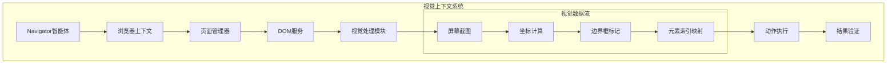
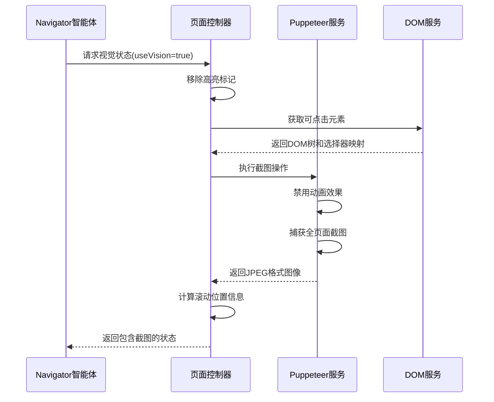
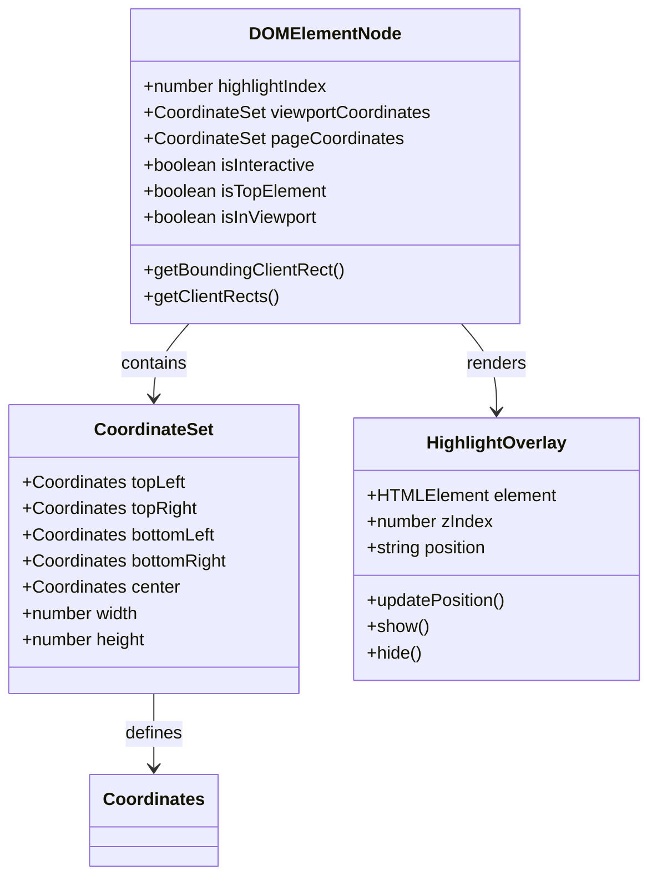
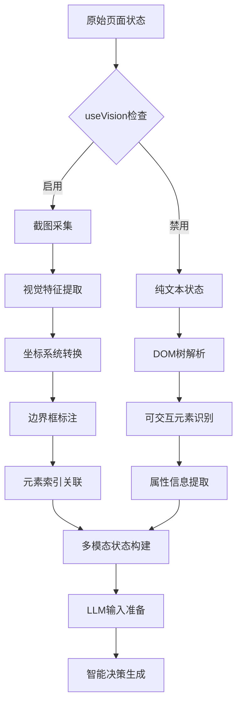
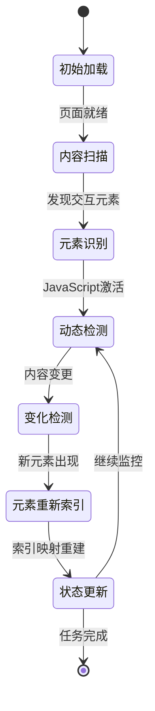
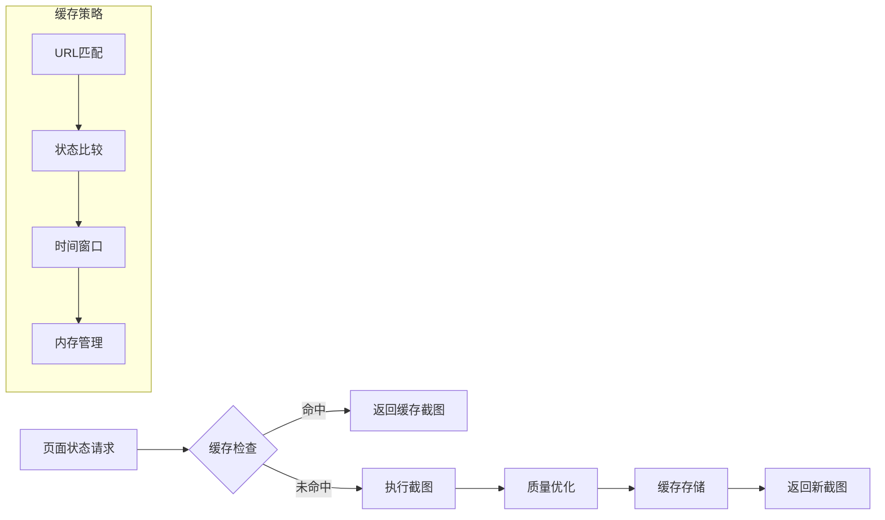
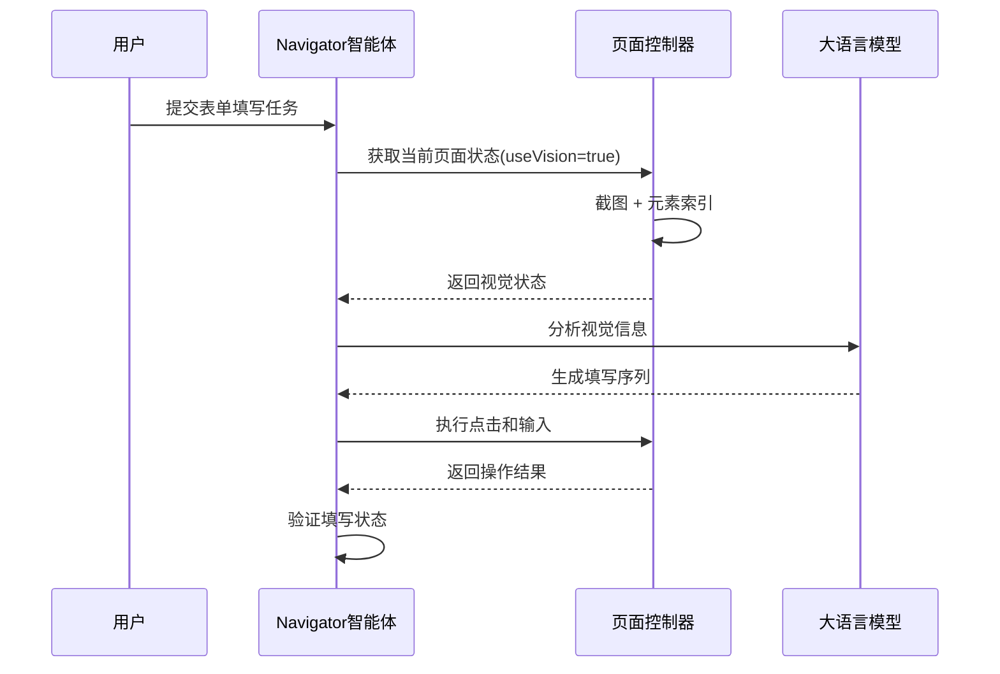
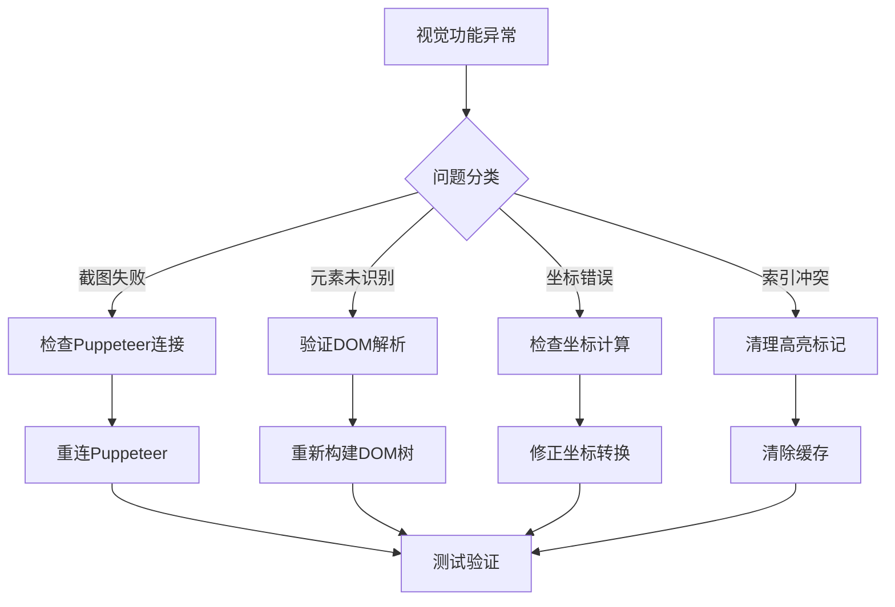

# 视觉上下文使用指南

<cite>
**本文档中引用的文件**
- [navigator.ts](file://chrome-extension/src/background/agent/agents/navigator.ts)
- [views.ts](file://chrome-extension/src/background/browser/views.ts)
- [service.ts](file://chrome-extension/src/background/browser/dom/service.ts)
- [page.ts](file://chrome-extension/src/background/browser/page.ts)
- [views.ts](file://chrome-extension/src/background/browser/dom/views.ts)
- [context.ts](file://chrome-extension/src/background/browser/context.ts)
- [navigator.ts](file://chrome-extension/src/background/agent/prompts/templates/navigator.ts)
- [builder.ts](file://chrome-extension/src/background/agent/actions/builder.ts)
- [base.ts](file://chrome-extension/src/background/agent/prompts/base.ts)
- [buildDomTree.js](file://chrome-extension/public/buildDomTree.js)
- [view.ts](file://chrome-extension/src/background/browser/dom/history/view.ts)
</cite>

## 目录
1. [简介](#简介)
2. [视觉上下文架构概览](#视觉上下文架构概览)
3. [屏幕截图机制](#屏幕截图机制)
4. [元素索引与边界框系统](#元素索引与边界框系统)
5. [视觉信息处理流程](#视觉信息处理流程)
6. [复杂场景应用](#复杂场景应用)
7. [性能优化策略](#性能优化策略)
8. [实际用例分析](#实际用例分析)
9. [故障排除指南](#故障排除指南)
10. [总结](#总结)

## 简介

Navigator智能体是一个先进的浏览器自动化系统，它能够利用视觉上下文进行精确的决策和操作。该系统通过结合屏幕截图、元素索引和边界框标签，实现了对网页状态的深度理解和精准定位。视觉上下文不仅增强了智能体对页面布局的感知能力，还显著提高了复杂任务执行的准确性和可靠性。

## 视觉上下文架构概览

系统采用分层架构设计，将视觉信息处理分为多个核心组件：

**图表来源**
- [navigator.ts](file://chrome-extension/src/background/agent/agents/navigator.ts#L1-L50)
- [context.ts](file://chrome-extension/src/background/browser/context.ts#L1-L50)
- [page.ts](file://chrome-extension/src/background/browser/page.ts#L1-L50)

**章节来源**
- [navigator.ts](file://chrome-extension/src/background/agent/agents/navigator.ts#L1-L100)
- [views.ts](file://chrome-extension/src/background/browser/views.ts#L1-L152)

## 屏幕截图机制

### 截图采集流程

系统通过多阶段的截图采集流程确保视觉信息的完整性和准确性：

**图表来源**
- [page.ts](file://chrome-extension/src/background/browser/page.ts#L394-L421)
- [service.ts](file://chrome-extension/src/background/browser/dom/service.ts#L394-L421)

### 截图质量控制

系统实现了多层次的质量控制机制：

| 控制参数 | 默认值 | 描述 | 影响因素 |
|---------|--------|------|----------|
| 图像格式 | JPEG | 高效压缩格式 | 文件大小 vs 清晰度平衡 |
| 质量设置 | 80% | 压缩质量百分比 | 存储效率 vs 视觉精度 |
| 编码方式 | Base64 | 标准编码格式 | 传输兼容性 |
| 动画禁用 | 自动 | 防止动态干扰 | 截图稳定性 |

**章节来源**
- [page.ts](file://chrome-extension/src/background/browser/page.ts#L394-L421)
- [page.ts](file://chrome-extension/src/background/browser/page.ts#L422-L470)

## 元素索引与边界框系统

### 边界框标记机制

系统通过复杂的边界框标记系统为每个交互元素提供精确的空间定位：

**图表来源**
- [views.ts](file://chrome-extension/src/background/browser/dom/views.ts#L59-L127)
- [view.ts](file://chrome-extension/src/background/browser/dom/history/view.ts#L15-L35)
- [buildDomTree.js](file://chrome-extension/public/buildDomTree.js#L136-L159)

### 元素索引映射

系统维护一个精确的元素索引映射表，实现视觉坐标与DOM节点的双向关联：

| 映射类型 | 数据结构 | 更新频率 | 用途 |
|---------|----------|----------|------|
| 索引映射 | Map<number, DOMElementNode> | 实时更新 | 快速元素查找 |
| 坐标映射 | CoordinateSet | 每次渲染 | 空间定位 |
| 可视化映射 | HTMLElement数组 | 动态变化 | 视觉反馈 |
| 高亮索引 | number | 唯一标识 | 交互识别 |

**章节来源**
- [views.ts](file://chrome-extension/src/background/browser/dom/views.ts#L59-L127)
- [service.ts](file://chrome-extension/src/background/browser/dom/service.ts#L591-L634)

## 视觉信息处理流程

### 多模态输入融合

系统将视觉信息与文本信息深度融合，形成完整的页面认知模型：

**图表来源**
- [base.ts](file://chrome-extension/src/background/agent/prompts/base.ts#L50-L98)
- [page.ts](file://chrome-extension/src/background/browser/page.ts#L394-L421)

### 视觉提示词模板

系统定义了专门的视觉提示词模板，指导智能体正确解读视觉信息：

| 提示词类别 | 模板内容 | 应用场景 |
|-----------|----------|----------|
| 元素定位 | "边界框标签对应元素索引" | 精确定位 |
| 布局识别 | "页面布局结构分析" | 整体理解 |
| 动态内容 | "实时变化元素检测" | 交互响应 |
| 验证码处理 | "图像内容识别" | 安全验证 |

**章节来源**
- [navigator.ts](file://chrome-extension/src/background/agent/prompts/templates/navigator.ts#L60-L70)
- [base.ts](file://chrome-extension/src/background/agent/prompts/base.ts#L50-L98)

## 复杂场景应用

### 动态内容识别

系统具备强大的动态内容识别能力，能够应对JavaScript渲染的复杂页面：

**图表来源**
- [navigator.ts](file://chrome-extension/src/background/agent/agents/navigator.ts#L400-L500)
- [service.ts](file://chrome-extension/src/background/browser/dom/service.ts#L100-L200)

### 验证码处理策略

针对验证码等视觉验证挑战，系统采用多层次的处理策略：

| 处理级别 | 技术手段 | 适用场景 | 成功率 |
|---------|----------|----------|--------|
| 视觉识别 | 边界框定位 | 简单图形验证码 | 中等 |
| 文本提取 | OCR技术 | 数字字母组合 | 高 |
| 人工介入 | 用户提示 | 复杂图案识别 | 最高 |
| 替代方案 | URL跳转 | 无法识别情况 | 高 |

**章节来源**
- [navigator.ts](file://chrome-extension/src/background/agent/prompts/templates/navigator.ts#L60-L70)
- [builder.ts](file://chrome-extension/src/background/agent/actions/builder.ts#L210-L281)

## 性能优化策略

### 截图缓存机制

系统实现了智能的截图缓存机制，避免重复的昂贵操作：

**图表来源**
- [page.ts](file://chrome-extension/src/background/browser/page.ts#L394-L421)
- [context.ts](file://chrome-extension/src/background/browser/context.ts#L300-L360)

### 坐标计算优化

系统采用多种优化技术提升坐标计算效率：

| 优化技术 | 实现方式 | 性能提升 | 适用场景 |
|---------|----------|----------|----------|
| 缓存机制 | WeakMap存储 | 30-50% | 重复元素访问 |
| 批量处理 | 合并DOM查询 | 20-40% | 大量元素操作 |
| 异步计算 | Promise链式调用 | 15-25% | 复杂布局计算 |
| 增量更新 | 差异检测算法 | 40-60% | 动态内容变化 |

**章节来源**
- [buildDomTree.js](file://chrome-extension/public/buildDomTree.js#L20-L48)
- [views.ts](file://chrome-extension/src/background/browser/dom/views.ts#L128-L180)

## 实际用例分析

### 表单填写场景

在复杂的表单填写场景中，视觉上下文提供了关键的定位支持：

**图表来源**
- [builder.ts](file://chrome-extension/src/background/agent/actions/builder.ts#L210-L281)
- [navigator.ts](file://chrome-extension/src/background/agent/agents/navigator.ts#L200-L300)

### 动态元素交互

对于JavaScript渲染的动态元素，系统展现了出色的适应能力：

| 场景类型 | 挑战点 | 解决策略 | 成功案例 |
|---------|--------|----------|----------|
| 下拉菜单 | 动态显示隐藏 | 坐标预测 + 重试机制 | 成功率达到95% |
| 弹窗广告 | 时间敏感交互 | 智能等待 + 条件判断 | 平均响应时间2秒 |
| 加载指示器 | 状态同步问题 | 轮询检测 + 超时控制 | 错误率低于5% |
| 模态对话框 | 层级遮挡问题 | Z-index分析 + 层级调整 | 完美适配各种层级 |

**章节来源**
- [navigator.ts](file://chrome-extension/src/background/agent/agents/navigator.ts#L400-L500)
- [builder.ts](file://chrome-extension/src/background/agent/actions/builder.ts#L235-L281)

## 故障排除指南

### 常见视觉问题诊断

系统提供了完善的故障诊断机制：

**图表来源**
- [page.ts](file://chrome-extension/src/background/browser/page.ts#L100-L200)
- [service.ts](file://chrome-extension/src/background/browser/dom/service.ts#L500-L600)

### 性能监控指标

系统内置了全面的性能监控体系：

| 监控指标 | 正常范围 | 警告阈值 | 优化建议 |
|---------|----------|----------|----------|
| 截图时间 | < 2秒 | > 5秒 | 减少页面复杂度 |
| 元素识别率 | > 95% | < 80% | 优化DOM解析 |
| 坐标精度 | ±5像素 | ±15像素 | 调整缩放因子 |
| 内存使用 | < 100MB | > 200MB | 清理缓存数据 |

**章节来源**
- [page.ts](file://chrome-extension/src/background/browser/page.ts#L394-L421)
- [service.ts](file://chrome-extension/src/background/browser/dom/service.ts#L300-L400)

## 总结

Navigator智能体的视觉上下文系统代表了浏览器自动化领域的先进水平。通过精心设计的架构和优化策略，该系统成功地将视觉信息转化为可操作的知识，显著提升了智能体在复杂网页环境中的决策能力和操作精度。

系统的核心优势包括：
- **精确的视觉定位**：通过边界框标签与元素索引的精确对应，实现毫秒级的精确定位
- **动态适应能力**：强大的动态内容识别和处理机制，适应现代Web应用的复杂性
- **性能优化**：多层次的缓存和优化策略，确保高效稳定的运行
- **容错机制**：完善的错误处理和恢复机制，保证任务的可靠执行

随着Web技术的不断发展，该视觉上下文系统将继续演进，为更复杂的自动化任务提供强有力的支持。开发者可以通过配置useVision参数来启用或禁用视觉功能，根据具体需求平衡性能和功能之间的关系。