# Planner智能体设计与实现深度解析

<cite>
**本文档中引用的文件**
- [planner.ts](file://chrome-extension/src/background/agent/agents/planner.ts)
- [schemas.ts](file://chrome-extension/src/background/agent/actions/schemas.ts)
- [planner.ts](file://chrome-extension/src/background/agent/prompts/planner.ts)
- [executor.ts](file://chrome-extension/src/background/agent/executor.ts)
- [planner.ts](file://chrome-extension/src/background/agent/prompts/templates/planner.ts)
- [base.ts](file://chrome-extension/src/background/agent/agents/base.ts)
- [types.ts](file://chrome-extension/src/background/agent/types.ts)
- [errors.ts](file://chrome-extension/src/background/agent/agents/errors.ts)
- [base.ts](file://chrome-extension/src/background/agent/prompts/base.ts)
- [utils.ts](file://chrome-extension/src/background/agent/messages/utils.ts)
</cite>

## 目录
1. [引言](#引言)
2. [项目架构概览](#项目架构概览)
3. [Planner智能体核心设计](#planner智能体核心设计)
4. [Zod模式定义与输出结构](#zod模式定义与输出结构)
5. [执行流程深度分析](#执行流程深度分析)
6. [与Executor的协作机制](#与executor的协作机制)
7. [错误处理策略](#错误处理策略)
8. [代码示例与使用场景](#代码示例与使用场景)
9. [性能优化考虑](#性能优化考虑)
10. [总结](#总结)

## 引言

Planner智能体是NanoBrowser扩展中的高级决策者，负责Web浏览任务的高层次规划、目标分解和进度跟踪。作为整个智能代理系统的核心组件，Planner不仅需要理解复杂的用户需求，还要制定有效的执行策略，并与Navigator智能体协同工作以完成实际的网页交互操作。

## 项目架构概览

NanoBrowser采用多智能体协作架构，其中Planner智能体扮演着战略规划者的角色：

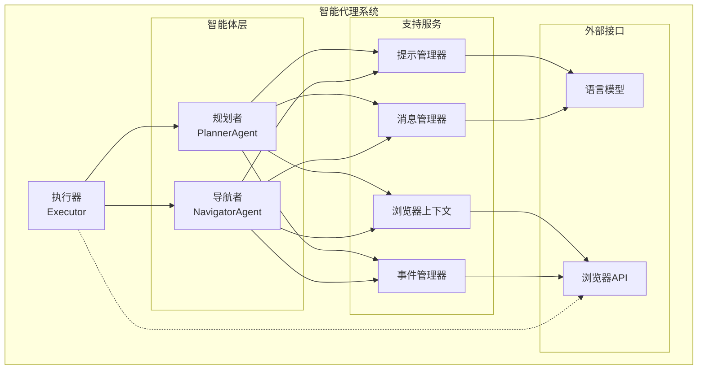

**图表来源**
- [executor.ts](file://chrome-extension/src/background/agent/executor.ts#L40-L80)
- [planner.ts](file://chrome-extension/src/background/agent/agents/planner.ts#L45-L50)

**章节来源**
- [executor.ts](file://chrome-extension/src/background/agent/executor.ts#L40-L80)
- [types.ts](file://chrome-extension/src/background/agent/types.ts#L1-L50)

## Planner智能体核心设计

Planner智能体继承自BaseAgent基类，实现了高度模块化和可扩展的设计：

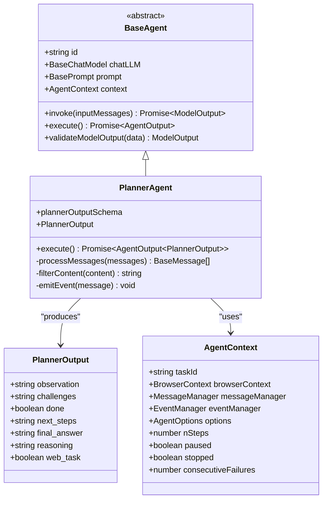

**图表来源**
- [base.ts](file://chrome-extension/src/background/agent/agents/base.ts#L40-L80)
- [planner.ts](file://chrome-extension/src/background/agent/agents/planner.ts#L45-L50)
- [types.ts](file://chrome-extension/src/background/agent/types.ts#L50-L100)

**章节来源**
- [base.ts](file://chrome-extension/src/background/agent/agents/base.ts#L40-L80)
- [planner.ts](file://chrome-extension/src/background/agent/agents/planner.ts#L45-L50)

## Zod模式定义与输出结构

Planner智能体使用严格的Zod模式来确保输出的一致性和可靠性：

### 输出结构详解

PlannerOutput类型定义了六个关键字段，每个字段都有明确的语义和用途：

| 字段名 | 类型 | 描述 | 必需性 |
|--------|------|------|--------|
| `observation` | string | 对当前状态的简要分析，说明已完成的工作 | 必需 |
| `challenges` | string | 潜在挑战或障碍的列表 | 必需 |
| `done` | boolean \| string | 任务是否完全完成，支持字符串转换 | 必需 |
| `next_steps` | string | 2-3个高层下一步行动建议 | 条件必需 |
| `final_answer` | string | 完整的用户友好答案（当done=true时） | 条件必需 |
| `reasoning` | string | 推荐下一步行动或完成决定的推理说明 | 必需 |
| `web_task` | boolean \| string | 任务是否与Web浏览相关 | 必需 |

### 关键字段关系规则

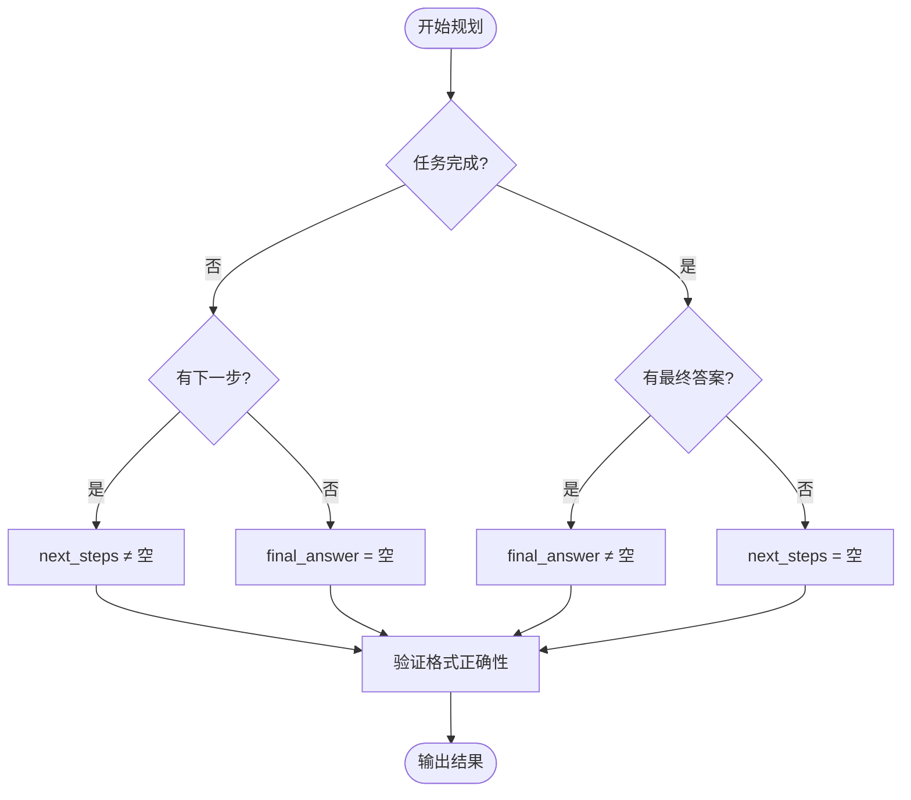

**图表来源**
- [planner.ts](file://chrome-extension/src/background/agent/prompts/templates/planner.ts#L70-L85)

**章节来源**
- [planner.ts](file://chrome-extension/src/background/agent/agents/planner.ts#L18-L45)
- [planner.ts](file://chrome-extension/src/background/agent/prompts/templates/planner.ts#L70-L85)

## 执行流程深度分析

Planner智能体的execute方法实现了复杂的决策逻辑和消息处理流程：

### 核心执行步骤

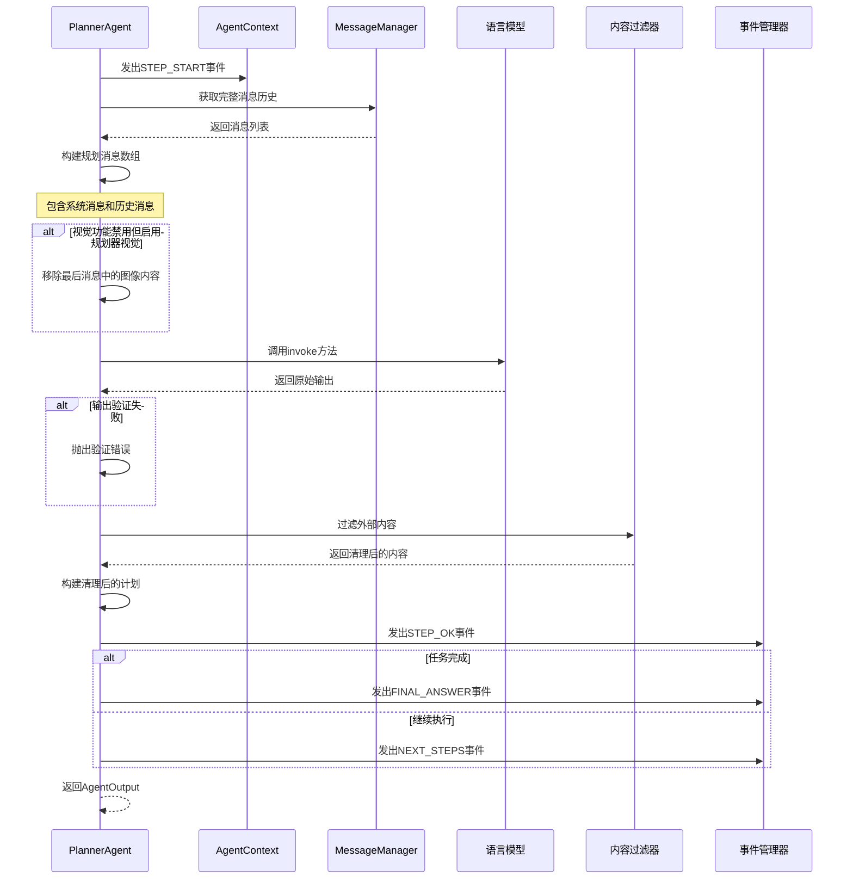

**图表来源**
- [planner.ts](file://chrome-extension/src/background/agent/agents/planner.ts#L52-L131)

### 消息历史构建过程

Planner的消息构建遵循特定的逻辑，确保上下文信息的准确传递：

1. **消息提取**：从MessageManager获取所有历史消息
2. **消息重组**：移除第一条消息（通常是系统消息），保留完整的对话历史
3. **视觉处理**：根据配置调整最后一条消息的内容
4. **格式标准化**：确保消息格式符合LLM输入要求

### 内容过滤机制

Planner实现了严格的内容过滤系统来防止提示注入攻击：

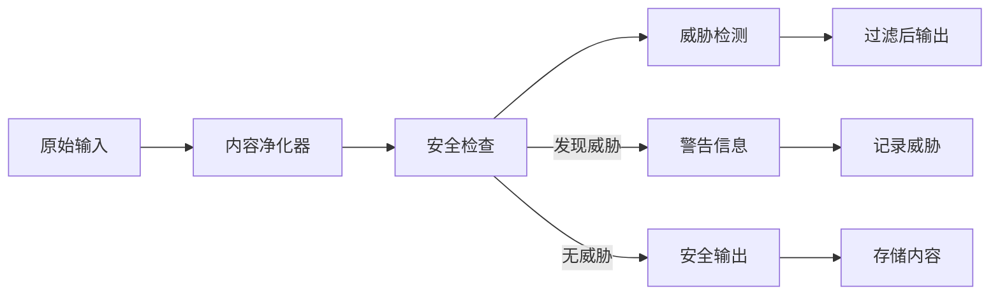

**图表来源**
- [utils.ts](file://chrome-extension/src/background/agent/messages/utils.ts#L280-L320)

**章节来源**
- [planner.ts](file://chrome-extension/src/background/agent/agents/planner.ts#L52-L131)
- [utils.ts](file://chrome-extension/src/background/agent/messages/utils.ts#L280-L320)

## 与Executor的协作机制

Planner智能体与Executor紧密协作，形成高效的周期性执行模式：

### 周期性执行策略

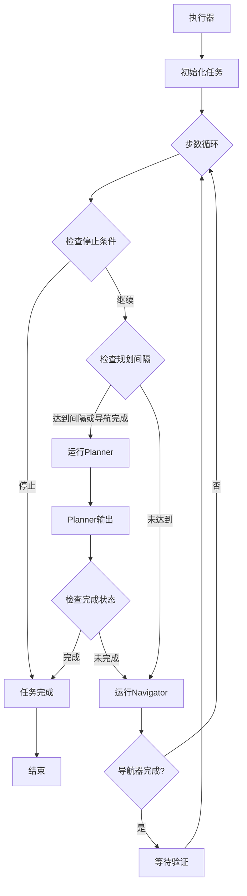

**图表来源**
- [executor.ts](file://chrome-extension/src/background/agent/executor.ts#L140-L180)

### 任务完成判断机制

Executor通过多个层面来判断任务是否完成：

1. **Planner直接确认**：Planner明确标记任务完成
2. **Navigator反馈**：Navigator报告操作完成
3. **状态一致性检查**：验证前后状态的一致性

### 状态同步机制

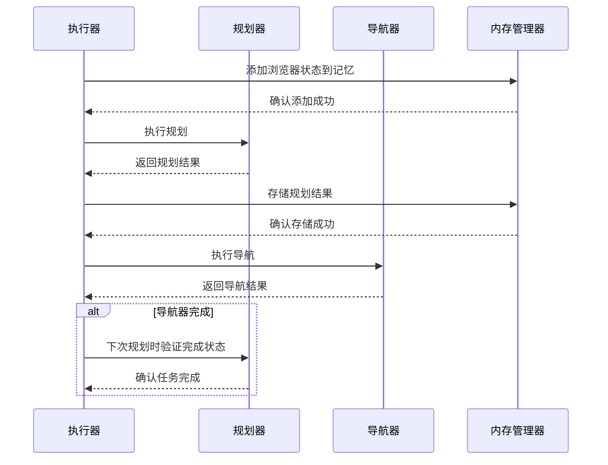

**图表来源**
- [executor.ts](file://chrome-extension/src/background/agent/executor.ts#L231-L271)

**章节来源**
- [executor.ts](file://chrome-extension/src/background/agent/executor.ts#L140-L180)
- [executor.ts](file://chrome-extension/src/background/agent/executor.ts#L231-L271)

## 错误处理策略

Planner智能体实现了分层的错误处理机制，能够优雅地处理各种异常情况：

### 异常分类与处理

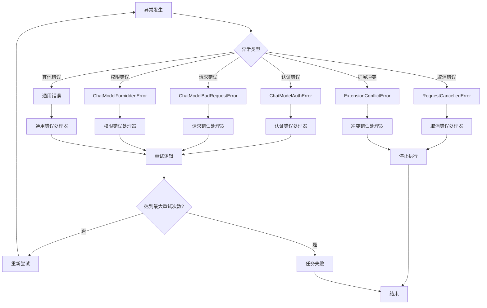

**图表来源**
- [errors.ts](file://chrome-extension/src/background/agent/agents/errors.ts#L1-L50)
- [planner.ts](file://chrome-extension/src/background/agent/agents/planner.ts#L104-L131)

### 错误检测机制

Planner使用多种策略来识别不同类型的错误：

1. **认证错误检测**：检查错误名称和消息内容
2. **请求错误检测**：识别HTTP状态码和错误模式
3. **权限错误检测**：专门处理403 Forbidden错误
4. **取消错误检测**：监控用户中断操作

### 重试策略

当遇到可恢复的错误时，Planner会实施指数退避重试策略：

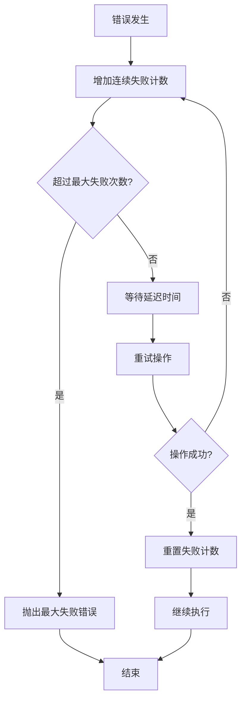

**图表来源**
- [executor.ts](file://chrome-extension/src/background/agent/executor.ts#L270-L290)

**章节来源**
- [errors.ts](file://chrome-extension/src/background/agent/agents/errors.ts#L1-L315)
- [planner.ts](file://chrome-extension/src/background/agent/agents/planner.ts#L104-L131)

## 代码示例与使用场景

### 基本任务规划示例

以下展示了Planner如何处理不同类型的任务：

#### Web浏览任务示例

对于需要Web浏览的任务，Planner会：
1. 分析当前页面状态
2. 识别用户需求
3. 制定详细的执行计划
4. 预测潜在挑战

#### 非Web任务示例

对于非Web任务，Planner会：
1. 直接回答用户问题
2. 设置任务完成标志
3. 提供简洁的答案

### 复杂任务分解案例

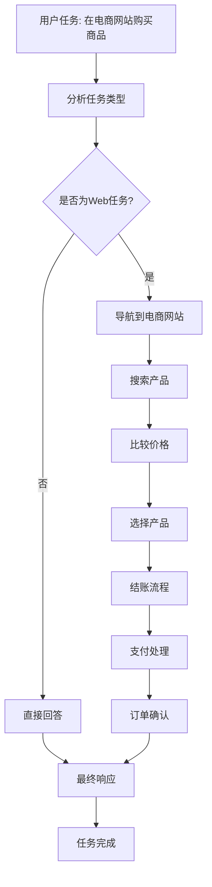

**图表来源**
- [planner.ts](file://chrome-extension/src/background/agent/prompts/templates/planner.ts#L10-L50)

### 与其他智能体的协作示例

Planner与Navigator的协作体现了智能代理系统的协调性：

1. **规划阶段**：Planner制定高层次策略
2. **执行阶段**：Navigator执行具体操作
3. **反馈阶段**：Navigator向Planner报告进展
4. **调整阶段**：Planner根据反馈调整策略

**章节来源**
- [planner.ts](file://chrome-extension/src/background/agent/prompts/templates/planner.ts#L10-L85)
- [executor.ts](file://chrome-extension/src/background/agent/executor.ts#L140-L180)

## 性能优化考虑

### 模型调用优化

Planner智能体采用了多种策略来优化LLM调用性能：

1. **结构化输出**：使用Zod模式确保高效解析
2. **消息压缩**：只传递必要的上下文信息
3. **缓存机制**：避免重复计算相同的信息
4. **批量处理**：合并相似的操作请求

### 内存管理

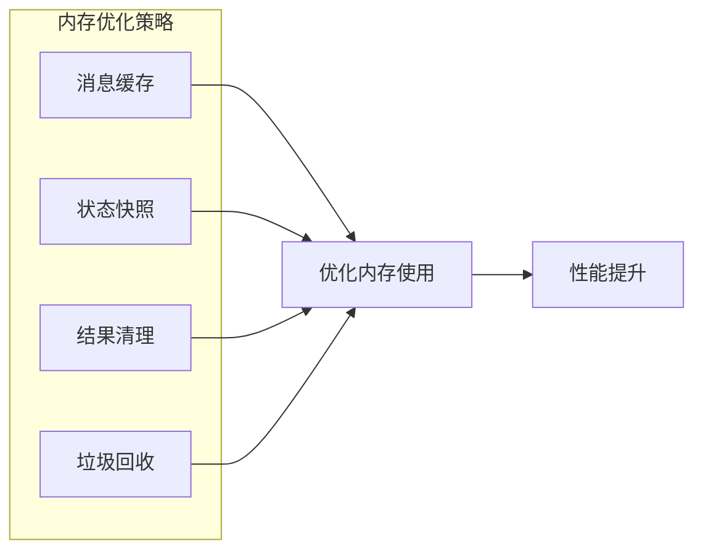

### 并发控制

Planner实现了智能的并发控制机制，确保系统稳定性：

1. **请求限流**：限制同时进行的LLM请求数量
2. **超时处理**：设置合理的请求超时时间
3. **资源监控**：实时监控系统资源使用情况

## 总结

Planner智能体作为NanoBrowser系统的核心组件，展现了现代智能代理系统的设计精髓。其主要特点包括：

### 设计优势

1. **模块化架构**：清晰的职责分离和接口定义
2. **强类型系统**：使用Zod确保数据一致性和可靠性
3. **健壮的错误处理**：多层次的异常捕获和恢复机制
4. **协作式执行**：与Navigator智能体的高效配合
5. **安全性保障**：严格的内容过滤和威胁检测

### 技术创新

1. **周期性规划**：结合定期规划和事件驱动的混合策略
2. **上下文感知**：动态调整规划策略以适应当前状态
3. **自适应学习**：根据执行结果不断优化决策过程
4. **多模态支持**：整合文本和视觉信息进行综合判断

### 应用价值

Planner智能体不仅解决了复杂的Web浏览自动化问题，更为智能代理系统的开发提供了宝贵的参考模式。其设计理念和技术实现对于构建更智能、更可靠的AI系统具有重要的指导意义。

通过深入理解Planner智能体的设计与实现，开发者可以更好地掌握智能代理系统的核心原理，并将其应用到更广泛的AI应用场景中。