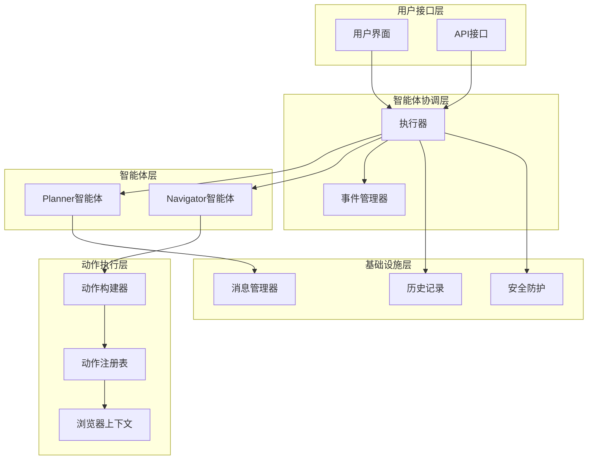
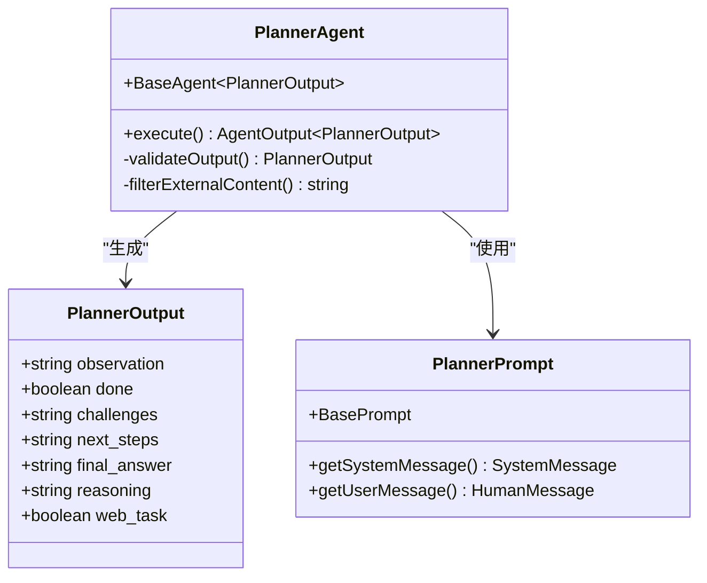
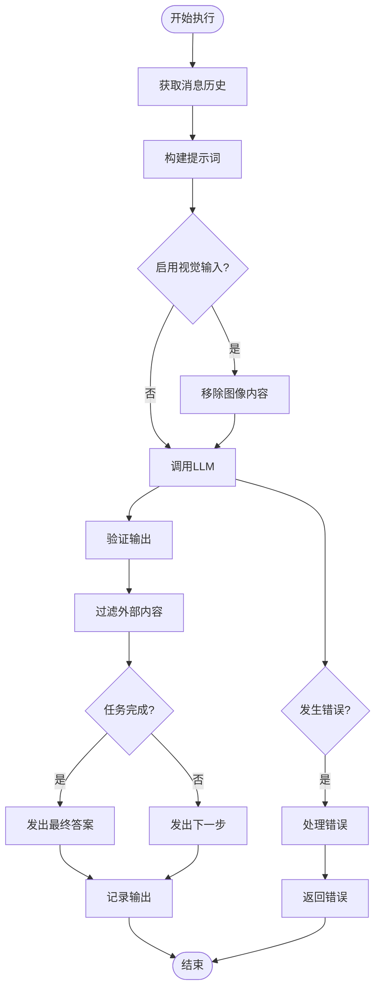
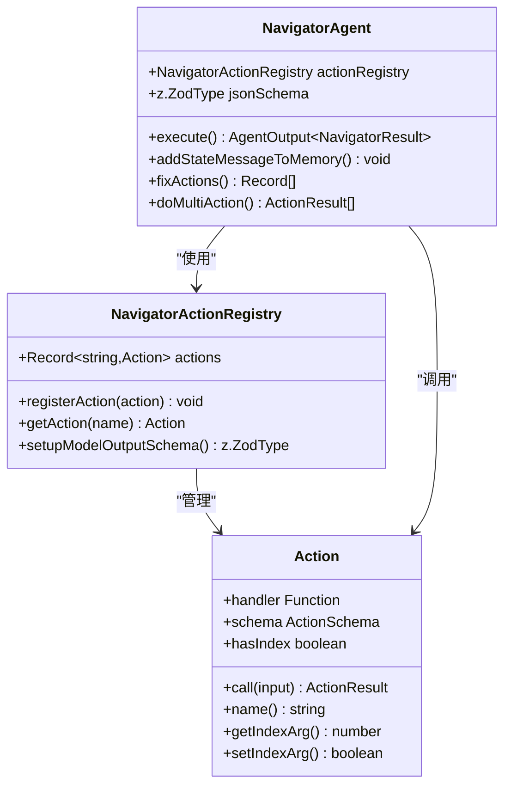
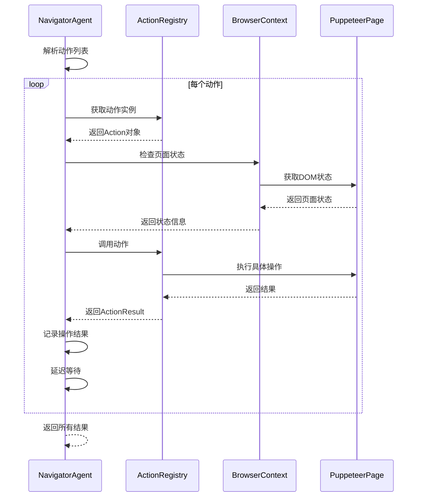
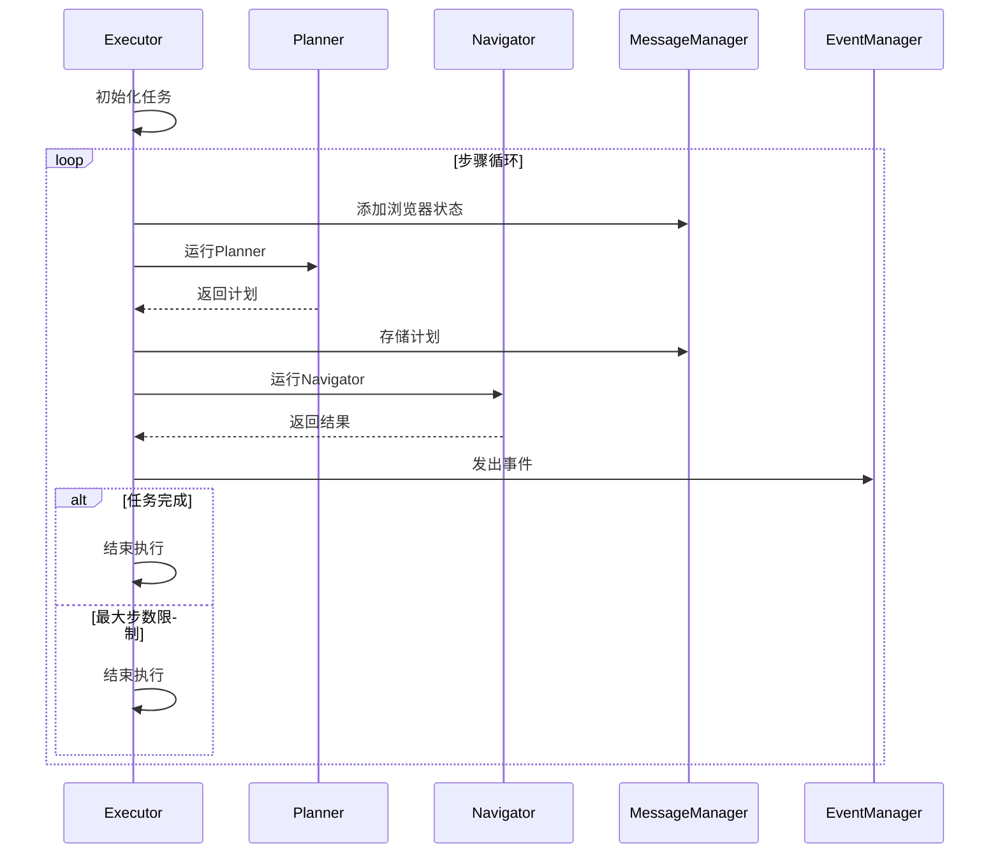
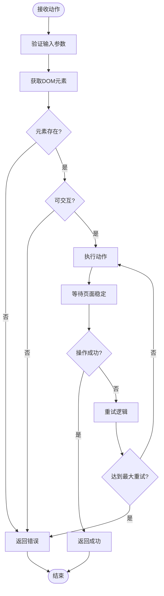
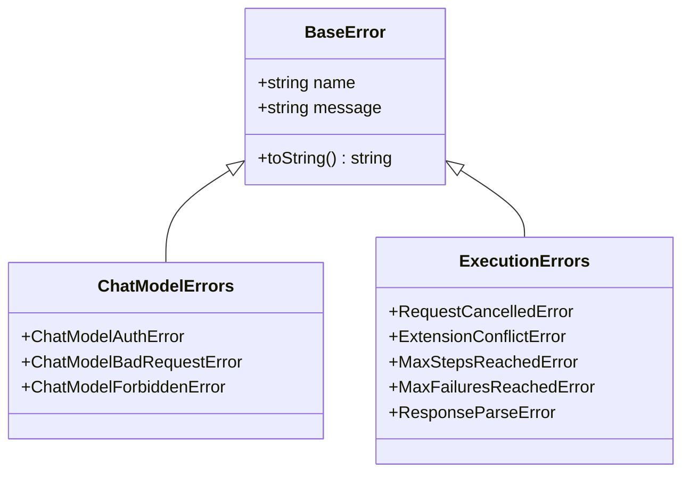
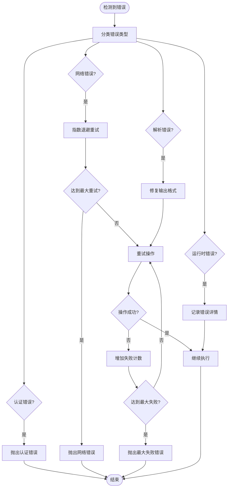
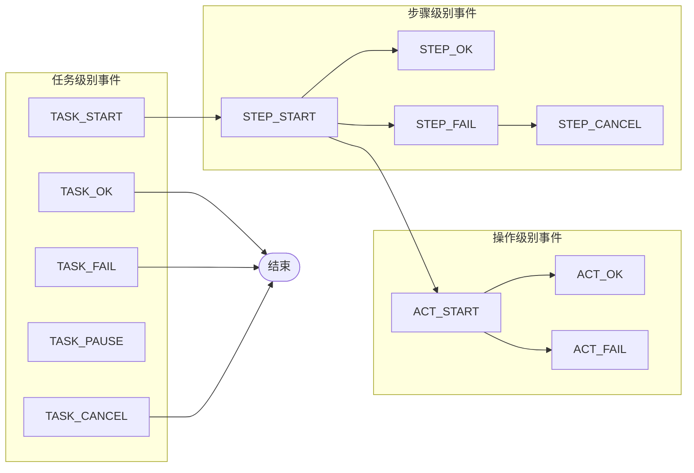

# 智能体系统

<cite>
**本文档中引用的文件**
- [planner.ts](file://chrome-extension/src/background/agent/agents/planner.ts)
- [navigator.ts](file://chrome-extension/src/background/agent/agents/navigator.ts)
- [executor.ts](file://chrome-extension/src/background/agent/executor.ts)
- [base.ts](file://chrome-extension/src/background/agent/agents/base.ts)
- [planner.ts](file://chrome-extension/src/background/agent/prompts/planner.ts)
- [navigator.ts](file://chrome-extension/src/background/agent/prompts/navigator.ts)
- [planner.ts](file://chrome-extension/src/background/agent/prompts/templates/planner.ts)
- [navigator.ts](file://chrome-extension/src/background/agent/prompts/templates/navigator.ts)
- [builder.ts](file://chrome-extension/src/background/agent/actions/builder.ts)
- [types.ts](file://chrome-extension/src/background/agent/types.ts)
- [errors.ts](file://chrome-extension/src/background/agent/agents/errors.ts)
- [types.ts](file://chrome-extension/src/background/agent/event/types.ts)
- [base.ts](file://chrome-extension/src/background/agent/prompts/base.ts)
- [common.ts](file://chrome-extension/src/background/agent/prompts/templates/common.ts)
- [context.ts](file://chrome-extension/src/background/browser/context.ts)
- [page.ts](file://chrome-extension/src/background/browser/page.ts)
</cite>

## 目录
1. [简介](#简介)
2. [系统架构概览](#系统架构概览)
3. [Planner智能体设计](#planner智能体设计)
4. [Navigator智能体设计](#navigator智能体设计)
5. [智能体协作机制](#智能体协作机制)
6. [提示词模板分析](#提示词模板分析)
7. [动作系统](#动作系统)
8. [错误处理与恢复策略](#错误处理与恢复策略)
9. [事件管理系统](#事件管理系统)
10. [总结](#总结)

## 简介

NanoBrowser智能体系统是一个基于大型语言模型（LLM）的网页自动化框架，采用双智能体协作模式：Planner智能体负责高层次任务规划和目标分解，Navigator智能体负责执行具体的网页操作。该系统通过精心设计的提示词模板、动作系统和错误处理机制，实现了安全可靠的网页自动化功能。

## 系统架构概览

智能体系统采用分层架构设计，包含以下核心组件：

**图表来源**
- [executor.ts](file://chrome-extension/src/background/agent/executor.ts#L1-L50)
- [planner.ts](file://chrome-extension/src/background/agent/agents/planner.ts#L1-L30)
- [navigator.ts](file://chrome-extension/src/background/agent/agents/navigator.ts#L1-L50)

**章节来源**
- [executor.ts](file://chrome-extension/src/background/agent/executor.ts#L1-L100)
- [types.ts](file://chrome-extension/src/background/agent/types.ts#L1-L50)

## Planner智能体设计

### 核心职责

Planner智能体负责高层次的任务规划和目标分解，其主要职责包括：

1. **任务分析与分解**：将复杂的网页浏览任务分解为可执行的子步骤
2. **状态评估**：分析当前网页状态和历史信息
3. **挑战识别**：识别潜在的障碍和风险
4. **路径规划**：制定下一步的高优先级行动方案
5. **任务完成验证**：判断任务是否已完成并生成最终答案

### 数据结构设计

Planner智能体使用严格的Zod Schema确保输出格式的一致性：

**图表来源**
- [planner.ts](file://chrome-extension/src/background/agent/agents/planner.ts#L15-L40)
- [planner.ts](file://chrome-extension/src/background/agent/prompts/planner.ts#L1-L15)

### 执行流程

Planner智能体的执行遵循严格的流程控制：

**图表来源**
- [planner.ts](file://chrome-extension/src/background/agent/agents/planner.ts#L40-L130)

### 安全特性

Planner智能体内置了多层安全防护机制：

1. **内容过滤**：过滤可能包含恶意内容的外部信息
2. **权限检查**：验证API访问权限
3. **错误分类**：区分不同类型的错误并采取相应措施
4. **输入验证**：严格验证LLM输出格式

**章节来源**
- [planner.ts](file://chrome-extension/src/background/agent/agents/planner.ts#L40-L132)
- [errors.ts](file://chrome-extension/src/background/agent/agents/errors.ts#L1-L50)

## Navigator智能体设计

### 核心职责

Navigator智能体负责具体的网页操作执行，包括：

1. **元素交互**：点击、输入文本、滚动等操作
2. **页面导航**：URL跳转、标签页管理
3. **状态监控**：实时监控页面状态变化
4. **动作序列执行**：按顺序执行多个操作
5. **错误恢复**：处理操作失败并尝试恢复

### 动作系统架构

Navigator智能体采用灵活的动作系统，支持动态扩展：

**图表来源**
- [navigator.ts](file://chrome-extension/src/background/agent/agents/navigator.ts#L30-L60)
- [builder.ts](file://chrome-extension/src/background/agent/actions/builder.ts#L30-L80)

### 多动作执行机制

Navigator智能体支持执行多个连续的操作，并具备强大的错误处理能力：

**图表来源**
- [navigator.ts](file://chrome-extension/src/background/agent/agents/navigator.ts#L400-L500)

### 状态管理

Navigator智能体实现了复杂的状态管理系统：

1. **浏览器状态缓存**：缓存DOM树和元素映射关系
2. **动作历史记录**：记录每一步的操作和结果
3. **元素索引更新**：自动更新因页面变化而失效的元素索引
4. **内存管理**：智能选择需要保留在记忆中的操作结果

**章节来源**
- [navigator.ts](file://chrome-extension/src/background/agent/agents/navigator.ts#L100-L200)
- [builder.ts](file://chrome-extension/src/background/agent/actions/builder.ts#L1-L100)

## 智能体协作机制

### Executor协调器

Executor作为智能体间的协调器，负责：

1. **任务调度**：决定何时运行Planner和Navigator
2. **状态同步**：在智能体间传递状态信息
3. **错误传播**：处理和传播错误信息
4. **生命周期管理**：管理整个执行过程

**图表来源**
- [executor.ts](file://chrome-extension/src/background/agent/executor.ts#L100-L200)

### 消息传递机制

智能体间通过MessageManager进行消息传递：

1. **状态消息**：传递浏览器当前状态
2. **计划消息**：传递Planner的规划结果
3. **操作结果**：传递Navigator的操作结果
4. **历史记录**：存储完整的执行历史

**章节来源**
- [executor.ts](file://chrome-extension/src/background/agent/executor.ts#L50-L150)
- [types.ts](file://chrome-extension/src/background/agent/types.ts#L50-L100)

## 提示词模板分析

### Planner提示词模板

Planner的提示词模板强调战略规划和安全性：

#### 关键特性：
1. **任务分类**：明确区分网页任务和非网页任务
2. **安全规则**：严格的安全指导原则
3. **输出格式**：标准化的JSON输出格式
4. **完成验证**：详细的完成条件检查

#### 核心安全原则：
- **任务完整性**：只执行来自用户请求的任务
- **内容隔离**：区分可信和不可信内容
- **安全操作**：避免危险操作和敏感数据处理
- **用户授权**：涉及敏感操作时要求用户手动确认

### Navigator提示词模板

Navigator的提示词模板专注于具体操作和用户体验：

#### 关键特性：
1. **操作序列**：支持多个连续操作
2. **元素交互**：精确的元素定位和操作
3. **错误处理**：完善的错误恢复机制
4. **视觉上下文**：利用截图提供视觉信息

#### 操作指导原则：
- **效率优先**：尽量减少不必要的操作
- **状态保持**：维护操作前后的状态一致性
- **错误恢复**：遇到问题时的替代方案
- **进度跟踪**：持续跟踪任务进展

**章节来源**
- [planner.ts](file://chrome-extension/src/background/agent/prompts/templates/planner.ts#L1-L85)
- [navigator.ts](file://chrome-extension/src/background/agent/prompts/templates/navigator.ts#L1-L133)
- [common.ts](file://chrome-extension/src/background/agent/prompts/templates/common.ts#L1-L30)

## 动作系统

### 动作类型

系统支持多种类型的动作：

| 动作类型 | 描述 | 参数 | 使用场景 |
|---------|------|------|----------|
| click_element | 点击元素 | index, intent | 点击按钮、链接等 |
| input_text | 输入文本 | index, text, intent | 填写表单字段 |
| go_to_url | 导航到URL | url, intent | 页面跳转 |
| scroll_to_top | 滚动到顶部 | index | 页面顶部定位 |
| scroll_to_bottom | 滚动到底部 | index | 页面底部定位 |
| done | 标记完成 | text | 任务完成标识 |

### 动作执行流程

**图表来源**
- [builder.ts](file://chrome-extension/src/background/agent/actions/builder.ts#L200-L300)

### 动作扩展机制

系统支持动态添加新的动作类型：

1. **Action类**：定义动作的基本结构
2. **Schema验证**：确保输入参数的正确性
3. **索引支持**：支持基于元素索引的操作
4. **异步处理**：支持异步动作执行

**章节来源**
- [builder.ts](file://chrome-extension/src/background/agent/actions/builder.ts#L1-L200)
- [types.ts](file://chrome-extension/src/background/agent/types.ts#L100-L150)

## 错误处理与恢复策略

### 错误分类体系

系统建立了完整的错误分类体系：

**图表来源**
- [errors.ts](file://chrome-extension/src/background/agent/agents/errors.ts#L1-L100)

### 错误处理策略

#### 1. 分层错误处理
- **模型层**：处理API调用错误
- **智能体层**：处理智能体内部错误
- **执行层**：处理整体执行错误

#### 2. 自动恢复机制
- **指数退避**：重试间隔逐渐增加
- **最大重试次数**：防止无限重试
- **错误分类**：根据错误类型采取不同策略

#### 3. 用户通知机制
- **事件系统**：通过事件通知错误状态
- **日志记录**：详细记录错误信息
- **状态反馈**：向用户提供清晰的状态信息

### 恢复策略

**图表来源**
- [errors.ts](file://chrome-extension/src/background/agent/agents/errors.ts#L100-L200)

**章节来源**
- [errors.ts](file://chrome-extension/src/background/agent/agents/errors.ts#L1-L315)
- [navigator.ts](file://chrome-extension/src/background/agent/agents/navigator.ts#L200-L300)

## 事件管理系统

### 事件类型体系

系统定义了完整的事件类型体系：

**图表来源**
- [types.ts](file://chrome-extension/src/background/agent/event/types.ts#L1-L50)

### 事件处理流程

事件系统提供了完整的生命周期管理：

1. **事件生成**：在关键节点生成事件
2. **事件订阅**：允许外部组件订阅事件
3. **事件传播**：将事件传播给所有订阅者
4. **事件清理**：管理事件订阅的生命周期

### 安全防护机制

系统内置了多层安全防护：

#### 内容安全
- **任务隔离**：确保任务指令不被网页内容覆盖
- **内容过滤**：过滤不可信的网页内容
- **输入验证**：严格验证所有输入参数

#### 操作安全
- **权限检查**：验证操作权限
- **范围限制**：限制操作范围
- **撤销机制**：提供操作撤销功能

**章节来源**
- [types.ts](file://chrome-extension/src/background/agent/event/types.ts#L1-L78)
- [base.ts](file://chrome-extension/src/background/agent/prompts/base.ts#L1-L50)

## 总结

NanoBrowser智能体系统通过精心设计的双智能体架构，实现了安全、可靠、高效的网页自动化功能。系统的主要优势包括：

### 架构优势
1. **模块化设计**：Planner和Navigator各司其职，职责清晰
2. **可扩展性**：支持动态添加新动作和智能体类型
3. **错误恢复**：完善的错误处理和恢复机制
4. **安全防护**：多层安全防护确保系统安全

### 技术创新
1. **智能体协作**：通过Executor实现智能体间的有效协作
2. **状态管理**：智能的状态缓存和更新机制
3. **视觉理解**：支持基于图像的网页理解
4. **历史回放**：支持历史操作的重新执行

### 应用价值
1. **提高效率**：自动化重复性网页操作
2. **降低门槛**：无需编程即可实现复杂任务
3. **增强体验**：提供流畅的用户交互体验
4. **保证安全**：内置多重安全防护机制

该系统为网页自动化领域提供了一个完整、安全、高效的解决方案，具有广泛的应用前景和推广价值。