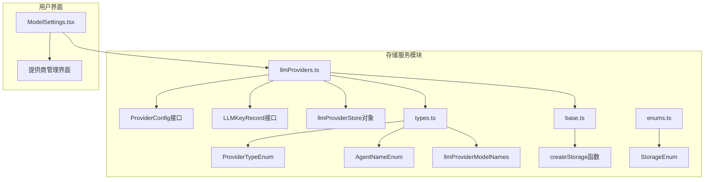
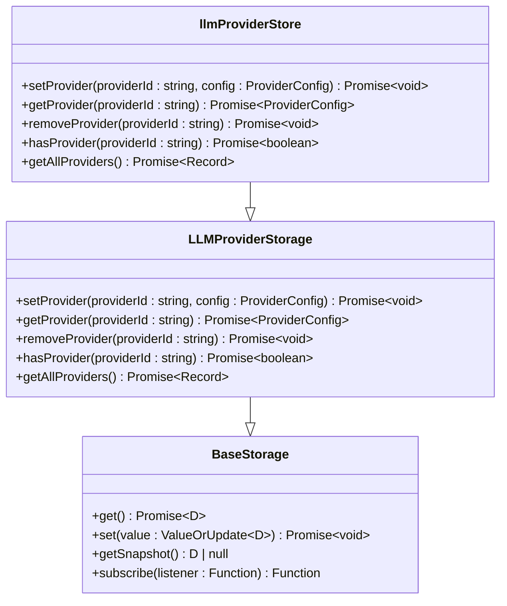
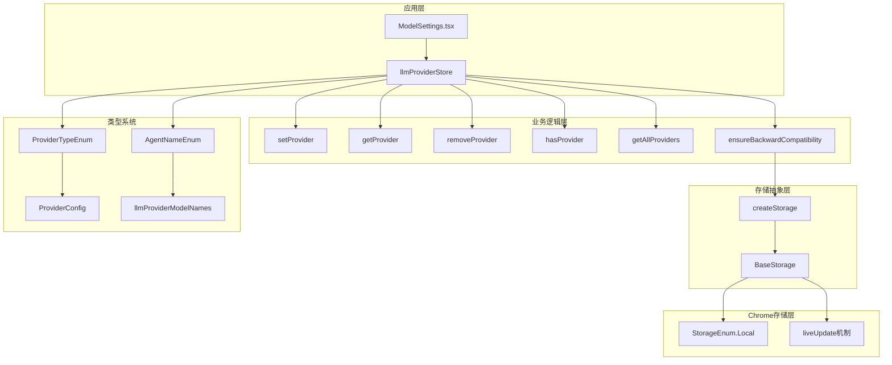
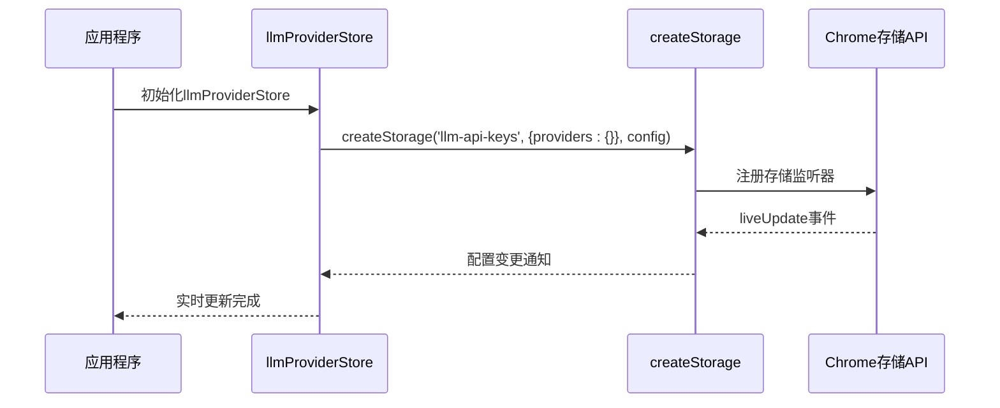
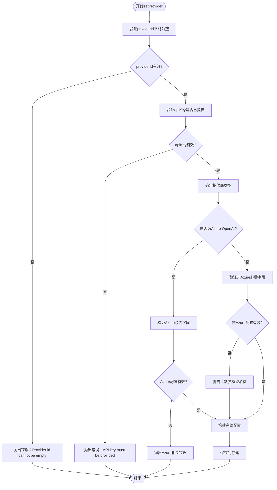
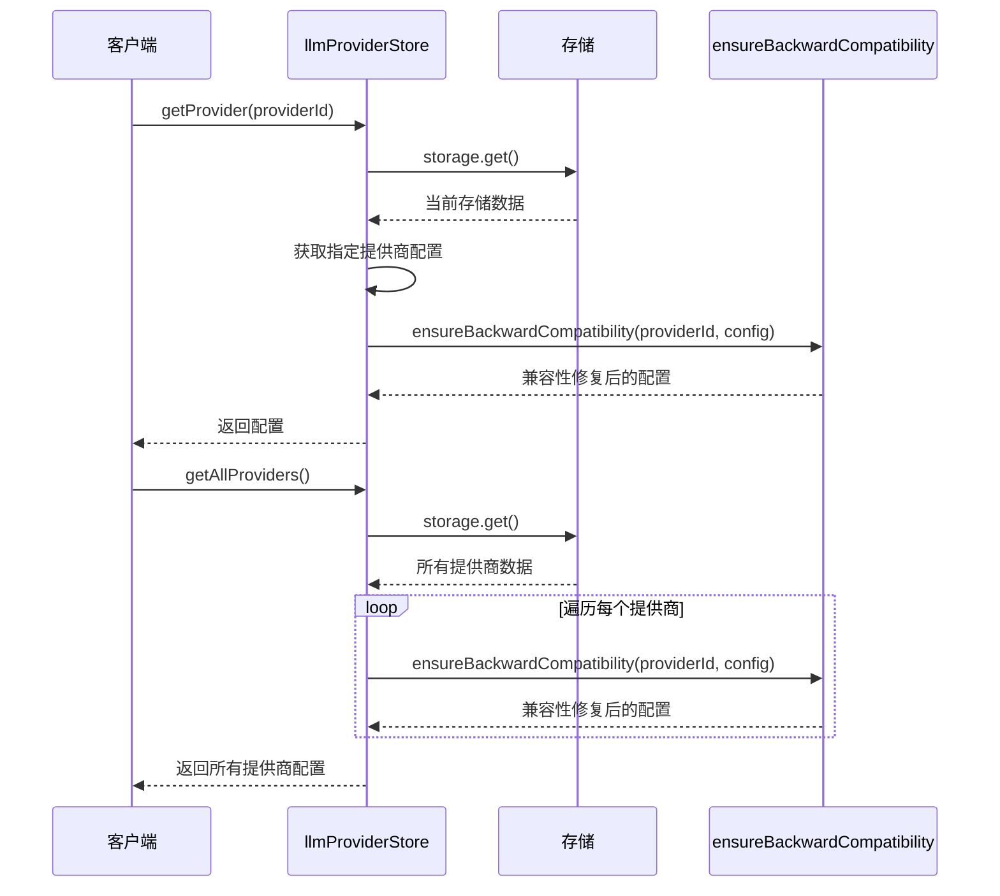
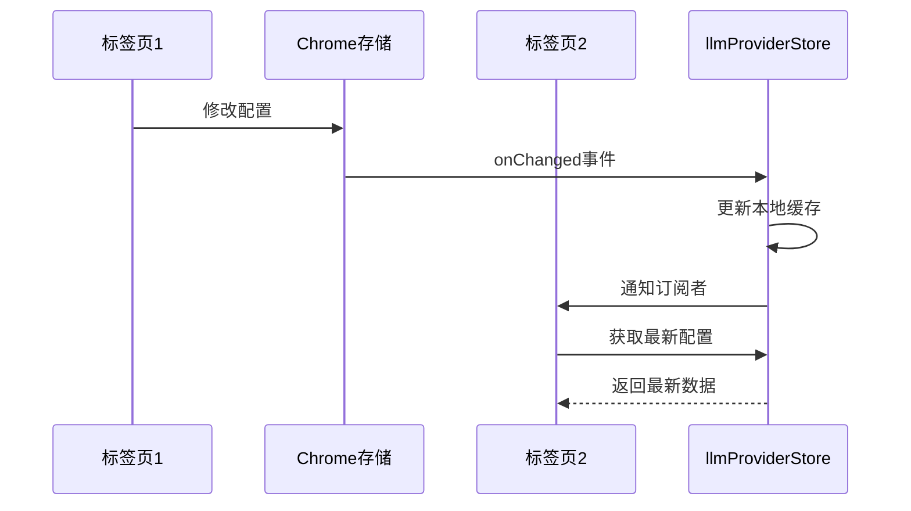
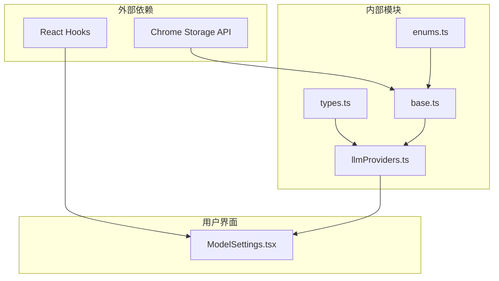

# LLM提供商存储服务

<cite>
**本文档中引用的文件**
- [llmProviders.ts](file://packages/storage/lib/settings/llmProviders.ts)
- [types.ts](file://packages/storage/lib/settings/types.ts)
- [base.ts](file://packages/storage/lib/base/base.ts)
- [enums.ts](file://packages/storage/lib/base/enums.ts)
- [ModelSettings.tsx](file://pages/options/src/components/ModelSettings.tsx)
- [index.ts](file://packages/storage/lib/index.ts)
</cite>

## 目录
1. [简介](#简介)
2. [项目结构](#项目结构)
3. [核心组件](#核心组件)
4. [架构概览](#架构概览)
5. [详细组件分析](#详细组件分析)
6. [依赖关系分析](#依赖关系分析)
7. [性能考虑](#性能考虑)
8. [故障排除指南](#故障排除指南)
9. [结论](#结论)

## 简介

LLM提供商存储服务是一个专门为浏览器扩展设计的配置管理系统，用于存储、管理和维护各种大型语言模型（LLM）提供商的配置信息。该服务提供了完整的CRUD（创建、读取、更新、删除）功能，支持多种LLM提供商类型，包括OpenAI、Anthropic、Azure OpenAI、Ollama等，并具备向后兼容性和实时更新机制。

该存储服务基于Chrome扩展的存储API构建，采用本地持久化存储策略，支持配置的实时同步和版本兼容性处理。通过统一的接口设计，开发者可以轻松地添加新的LLM提供商或修改现有配置。

## 项目结构

LLM提供商存储服务位于`packages/storage/lib/settings/`目录下，主要包含以下关键文件：

**图表来源**
- [llmProviders.ts](file://packages/storage/lib/settings/llmProviders.ts#L1-L317)
- [types.ts](file://packages/storage/lib/settings/types.ts#L1-L154)
- [base.ts](file://packages/storage/lib/base/base.ts#L1-L156)

**章节来源**
- [llmProviders.ts](file://packages/storage/lib/settings/llmProviders.ts#L1-L317)
- [types.ts](file://packages/storage/lib/settings/types.ts#L1-L154)

## 核心组件

### ProviderConfig接口

ProviderConfig是单个LLM提供商配置的核心数据结构，定义了所有必要的配置字段：

| 字段名 | 类型 | 必需 | 描述 |
|--------|------|------|------|
| name | string? | 否 | 显示名称，在选项界面中显示 |
| type | ProviderTypeEnum? | 否 | 提供商类型，决定使用哪个LangChain ChatModel包 |
| apiKey | string | 是 | API密钥，必须提供，本地模型可为空 |
| baseUrl | string? | 否 | 可选的基础URL，对于Azure为端点地址 |
| modelNames | string[]? | 否 | 选择的模型名称数组（不适用于Azure OpenAI） |
| createdAt | number? | 否 | 创建时间戳（毫秒） |
| azureDeploymentNames | string[]? | 否 | Azure部署名称数组 |
| azureApiVersion | string? | 否 | Azure API版本 |

### LLMKeyRecord接口

LLMKeyRecord用于存储多个LLM提供商配置，采用键值对结构：

| 字段名 | 类型 | 描述 |
|--------|------|------|
| providers | Record<string, ProviderConfig> | 键为提供商ID，值为配置对象 |

### llmProviderStore对象

llmProviderStore是存储服务的主要入口点，继承自BaseStorage并扩展了专门的方法：

**图表来源**
- [llmProviders.ts](file://packages/storage/lib/settings/llmProviders.ts#L26-L32)
- [base.ts](file://packages/storage/lib/base/base.ts#L6-L12)

**章节来源**
- [llmProviders.ts](file://packages/storage/lib/settings/llmProviders.ts#L10-L32)

## 架构概览

LLM提供商存储服务采用分层架构设计，从底层的Chrome存储API到高层的应用接口：

**图表来源**
- [llmProviders.ts](file://packages/storage/lib/settings/llmProviders.ts#L26-L317)
- [base.ts](file://packages/storage/lib/base/base.ts#L36-L156)
- [types.ts](file://packages/storage/lib/settings/types.ts#L1-L154)

## 详细组件分析

### 存储服务初始化

存储服务通过`createStorage`函数创建，配置如下：

**图表来源**
- [llmProviders.ts](file://packages/storage/lib/settings/llmProviders.ts#L35-L42)
- [base.ts](file://packages/storage/lib/base/base.ts#L121-L156)

存储配置参数：
- **存储键**: `'llm-api-keys'`（向后兼容）
- **默认值**: `{ providers: {} }`
- **存储类型**: `StorageEnum.Local`
- **实时更新**: `true`

### setProvider方法实现

setProvider方法负责验证和保存提供商配置，包含完整的验证逻辑：

**图表来源**
- [llmProviders.ts](file://packages/storage/lib/settings/llmProviders.ts#L226-L287)

验证逻辑详解：

1. **基础验证**：
   - 检查providerId是否为空
   - 确保apiKey字段已提供

2. **Azure OpenAI验证**：
   - 验证Azure端点（baseUrl）不能为空
   - 确保至少有一个Azure部署名称
   - 验证Azure API版本不能为空
   - 确保API密钥不为空

3. **其他提供商验证**：
   - 对于CustomOpenAI和Ollama类型，允许空API密钥
   - 其他类型要求API密钥不为空

4. **模型名称验证**：
   - 非Azure类型的提供商会发出警告，提示缺少模型名称

### getProvider和getAllProviders方法

这两个方法都集成了`ensureBackwardCompatibility`函数来确保配置的兼容性：

**图表来源**
- [llmProviders.ts](file://packages/storage/lib/settings/llmProviders.ts#L288-L314)

### ensureBackwardCompatibility函数

该函数确保配置与当前版本兼容，处理以下情况：

| 场景 | 处理方式 |
|------|----------|
| 缺少name字段 | 使用默认显示名称 |
| 缺少type字段 | 根据providerId推断类型 |
| Azure配置 | 添加默认API版本，初始化部署名称数组，删除modelNames字段 |
| 非Azure配置 | 确保modelNames存在，使用默认模型列表 |
| 缺少createdAt字段 | 设置默认创建时间 |

### liveUpdate机制

liveUpdate机制实现了配置的实时更新：

**图表来源**
- [base.ts](file://packages/storage/lib/base/base.ts#L121-L156)

**章节来源**
- [llmProviders.ts](file://packages/storage/lib/settings/llmProviders.ts#L226-L314)
- [base.ts](file://packages/storage/lib/base/base.ts#L121-L156)

## 依赖关系分析

LLM提供商存储服务的依赖关系图展示了各组件之间的相互依赖：

**图表来源**
- [llmProviders.ts](file://packages/storage/lib/settings/llmProviders.ts#L1-L6)
- [base.ts](file://packages/storage/lib/base/base.ts#L1-L10)

### 主要依赖项

1. **Chrome存储API**: 基础存储功能
2. **React Hooks**: 状态管理和UI更新
3. **类型定义**: TypeScript类型安全
4. **枚举类型**: 存储类型和提供商类型

**章节来源**
- [llmProviders.ts](file://packages/storage/lib/settings/llmProviders.ts#L1-L6)
- [base.ts](file://packages/storage/lib/base/base.ts#L1-L10)

## 性能考虑

### 存储优化

1. **增量更新**: 只更新变更的部分，避免全量重写
2. **缓存机制**: 内存缓存减少重复读取
3. **批量操作**: 支持批量获取所有提供商配置

### 实时更新优化

1. **事件驱动**: 基于Chrome存储事件触发更新
2. **订阅模式**: 只有关注的组件才会收到更新通知
3. **防抖处理**: 避免频繁的存储变更导致的性能问题

### 内存管理

1. **懒加载**: 按需加载提供商配置
2. **垃圾回收**: 及时清理不再使用的配置缓存
3. **内存泄漏防护**: 正确管理事件监听器

## 故障排除指南

### 常见问题及解决方案

| 问题 | 症状 | 解决方案 |
|------|------|----------|
| API密钥验证失败 | 抛出"API key must be provided"错误 | 确保提供有效的API密钥 |
| Azure配置无效 | 抛出Azure相关错误 | 检查端点、部署名称和API版本 |
| 配置丢失 | 重新加载后配置消失 | 检查Chrome存储权限设置 |
| 实时更新失效 | 配置更改后未同步 | 检查liveUpdate配置和事件监听器 |

### 调试技巧

1. **日志记录**: 启用setProvider方法中的调试日志
2. **状态检查**: 使用getSnapshot方法检查当前状态
3. **事件监控**: 监听存储变更事件
4. **类型验证**: 使用TypeScript类型检查确保配置正确

**章节来源**
- [llmProviders.ts](file://packages/storage/lib/settings/llmProviders.ts#L226-L287)

## 结论

LLM提供商存储服务是一个设计精良的配置管理系统，具有以下特点：

1. **完整的CRUD功能**: 提供了全面的提供商配置管理能力
2. **强大的验证机制**: 确保配置的完整性和有效性
3. **向后兼容性**: 通过兼容性函数处理旧版本配置
4. **实时更新**: 支持多标签页间的配置同步
5. **类型安全**: 基于TypeScript的强类型系统
6. **易于扩展**: 支持添加新的LLM提供商类型

该服务为浏览器扩展提供了可靠的LLM提供商配置管理基础设施，简化了开发者的工作流程，同时保证了系统的稳定性和可维护性。通过合理的架构设计和完善的错误处理机制，它能够满足复杂应用场景的需求，是现代浏览器扩展开发中的优秀实践案例。