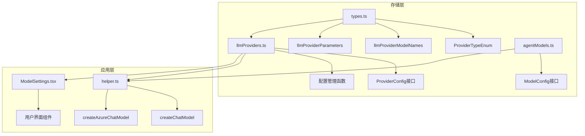
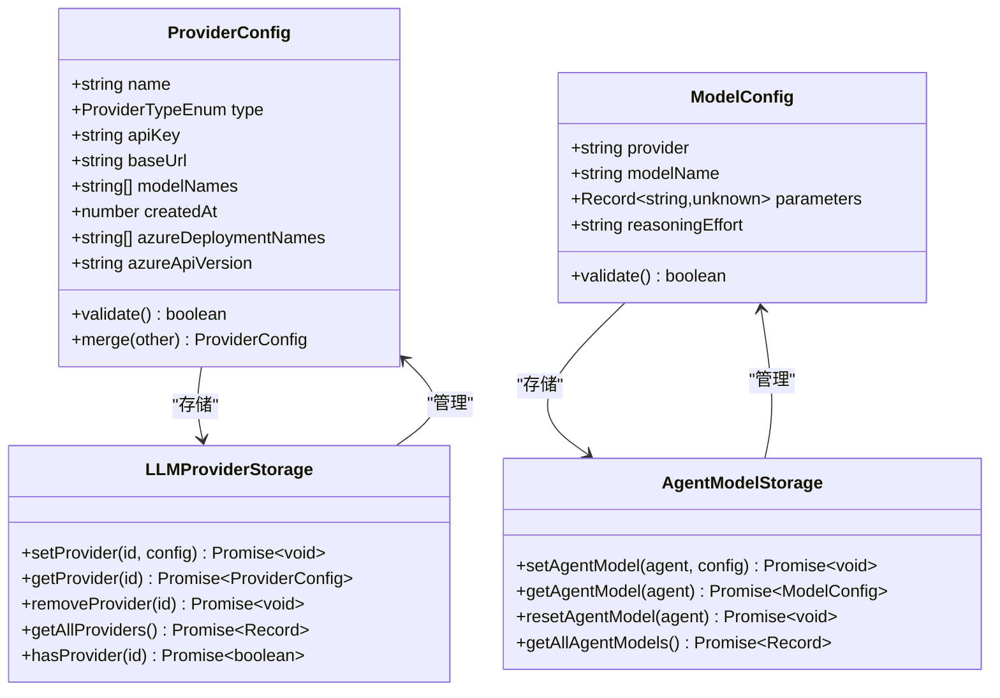
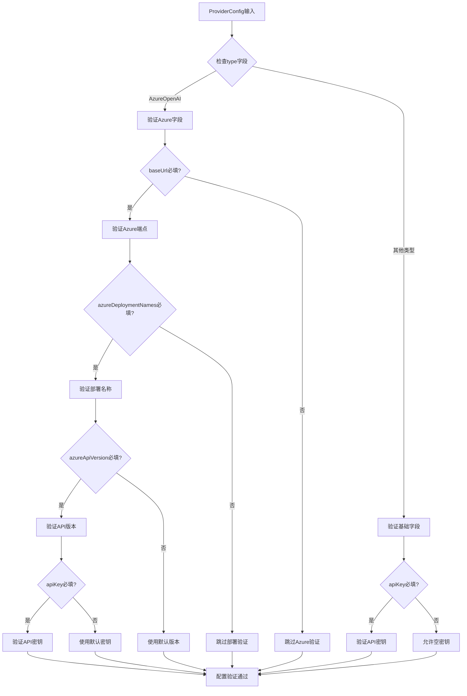
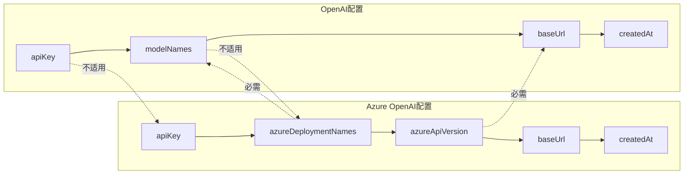
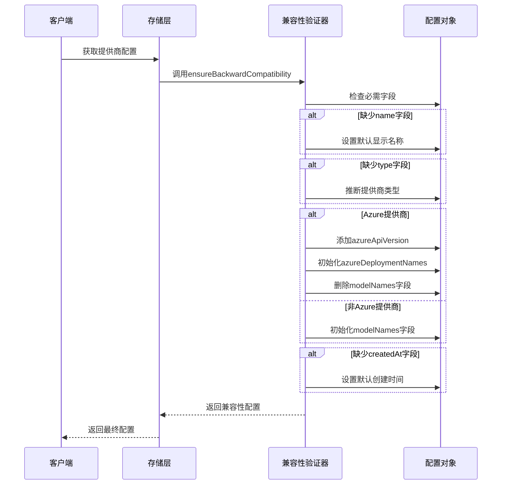

# LLM提供商数据模型

<cite>
**本文档中引用的文件**
- [types.ts](file://packages/storage/lib/settings/types.ts)
- [llmProviders.ts](file://packages/storage/lib/settings/llmProviders.ts)
- [agentModels.ts](file://packages/storage/lib/settings/agentModels.ts)
- [helper.ts](file://chrome-extension/src/background/agent/helper.ts)
- [ModelSettings.tsx](file://pages/options/src/components/ModelSettings.tsx)
</cite>

## 目录
1. [简介](#简介)
2. [项目结构概览](#项目结构概览)
3. [核心数据模型](#核心数据模型)
4. [ProviderTypeEnum枚举](#providertypenum枚举)
5. [ProviderConfig接口详解](#providerconfig接口详解)
6. [llmProviderModelNames常量](#llmprovidermodelnames常量)
7. [llmProviderParameters配置](#llmproviderparameters配置)
8. [提供商类型差异分析](#提供商类型差异分析)
9. [向后兼容性机制](#向后兼容性机制)
10. [实际使用示例](#实际使用示例)
11. [总结](#总结)

## 简介

NanoBrowser的LLM提供商数据模型是一个高度模块化和可扩展的架构，用于统一管理各种大型语言模型提供商的配置。该系统支持多种主流LLM提供商，包括OpenAI、Azure OpenAI、Ollama、Anthropic等，并通过标准化的数据模型确保配置的一致性和向后兼容性。

## 项目结构概览

LLM提供商相关的核心文件分布在以下位置：



**图表来源**
- [types.ts](file://packages/storage/lib/settings/types.ts#L1-L154)
- [llmProviders.ts](file://packages/storage/lib/settings/llmProviders.ts#L1-L317)
- [agentModels.ts](file://packages/storage/lib/settings/agentModels.ts#L1-L122)

## 核心数据模型

### 数据模型架构

系统采用分层架构设计，包含以下核心组件：



**图表来源**
- [types.ts](file://packages/storage/lib/settings/types.ts#L10-L22)
- [llmProviders.ts](file://packages/storage/lib/settings/llmProviders.ts#L26-L32)
- [agentModels.ts](file://packages/storage/lib/settings/agentModels.ts#L10-L18)

**节来源**
- [types.ts](file://packages/storage/lib/settings/types.ts#L1-L154)
- [llmProviders.ts](file://packages/storage/lib/settings/llmProviders.ts#L1-L317)
- [agentModels.ts](file://packages/storage/lib/settings/agentModels.ts#L1-L122)

## ProviderTypeEnum枚举

ProviderTypeEnum定义了系统支持的所有LLM提供商类型，分为内置提供商和自定义提供商两类：

### 内置提供商类型

| 提供商类型 | 枚举值 | 描述 |
|-----------|--------|------|
| OpenAI | `openai` | OpenAI官方API服务 |
| Anthropic | `anthropic` | Anthropic Claude系列模型 |
| DeepSeek | `deepseek` | DeepSeek推理模型 |
| Gemini | `gemini` | Google Gemini模型 |
| Grok | `grok` | xAI Grok模型 |
| Ollama | `ollama` | 本地运行的开源模型 |
| AzureOpenAI | `azure_openai` | Microsoft Azure OpenAI服务 |
| OpenRouter | `openrouter` | 统一访问多个提供商的平台 |
| Groq | `groq` | 高性能推理服务 |
| Cerebras | `cerebras` | Cerebras AI模型 |
| Llama | `llama` | Meta Llama系列模型 |

### 自定义提供商类型

| 提供商类型 | 枚举值 | 描述 |
|-----------|--------|------|
| CustomOpenAI | `custom_openai` | 用户自定义的OpenAI兼容API |

**节来源**
- [types.ts](file://packages/storage/lib/settings/types.ts#L10-L22)

## ProviderConfig接口详解

ProviderConfig是LLM提供商配置的核心数据结构，定义了所有必要的配置字段：

### 基础字段

| 字段名 | 类型 | 必需 | 默认值 | 描述 |
|--------|------|------|--------|------|
| `name` | `string` | 否 | 自动生成 | 在选项中显示的名称 |
| `type` | `ProviderTypeEnum` | 否 | 自动推断 | 帮助决定使用哪个LangChain ChatModel类 |
| `apiKey` | `string` | 是 | `''` | 必须提供，本地模型可为空 |
| `baseUrl` | `string` | 否 | `undefined` | 可选的基础URL，对于Azure为端点 |

### 模型相关字段

| 字段名 | 类型 | 必需 | 默认值 | 描述 |
|--------|------|------|--------|------|
| `modelNames` | `string[]` | 否 | `[]` | 选择的模型名称数组（不适用于Azure OpenAI） |

### Azure专用字段

| 字段名 | 类型 | 必需 | 默认值 | 描述 |
|--------|------|------|--------|------|
| `azureDeploymentNames` | `string[]` | 否 | `[]` | Azure部署名称数组 |
| `azureApiVersion` | `string` | 否 | `'2025-04-01-preview'` | Azure API版本 |

### 时间戳字段

| 字段名 | 类型 | 必需 | 默认值 | 描述 |
|--------|------|------|--------|------|
| `createdAt` | `number` | 否 | `Date.now()` | 创建时间戳（毫秒） |

### 字段验证规则



**图表来源**
- [llmProviders.ts](file://packages/storage/lib/settings/llmProviders.ts#L235-L260)

**节来源**
- [llmProviders.ts](file://packages/storage/lib/settings/llmProviders.ts#L10-L22)

## llmProviderModelNames常量

llmProviderModelNames为每个内置提供商预定义了支持的模型列表：

### 支持的模型列表

| 提供商 | 支持的模型 |
|--------|------------|
| OpenAI | `['gpt-5', 'gpt-5-mini', 'gpt-5-chat-latest', 'gpt-4.1', 'gpt-4.1-mini', 'gpt-4o']` |
| Anthropic | `['claude-opus-4-1', 'claude-sonnet-4-0', 'claude-3-7-sonnet-latest', 'claude-3-5-haiku-latest']` |
| DeepSeek | `['deepseek-chat', 'deepseek-reasoner']` |
| Gemini | `['gemini-2.5-flash', 'gemini-2.5-pro']` |
| Grok | `['grok-3', 'grok-3-fast', 'grok-3-mini', 'grok-3-mini-fast']` |
| Ollama | `['qwen3:14b', 'falcon3:10b', 'qwen2.5-coder:14b', 'mistral-small:24b']` |
| AzureOpenAI | `['gpt-5', 'gpt-5-mini', 'gpt-4.1', 'gpt-4.1-mini', 'gpt-4o']` |
| OpenRouter | `['google/gemini-2.5-pro', 'google/gemini-2.5-flash', 'openai/gpt-4o-2024-11-20']` |
| Groq | `['llama-3.3-70b-versatile']` |
| Cerebras | `['llama-3.3-70b']` |
| Llama | `['Llama-3.3-70B-Instruct', 'Llama-3.3-8B-Instruct', 'Llama-4-Maverick-17B-128E-Instruct-FP8', 'Llama-4-Scout-17B-16E-Instruct-FP8']` |

### 模型命名规范

系统采用统一的模型命名规范：
- **版本号格式**：使用语义化版本号或特定标识符
- **系列区分**：通过前缀区分不同系列（如`gpt-`、`claude-`）
- **性能等级**：包含性能等级标识（如`mini`、`latest`）

**节来源**
- [types.ts](file://packages/storage/lib/settings/types.ts#L24-L48)

## llmProviderParameters配置

llmProviderParameters为不同智能体（Planner/Navigator）设置默认参数：

### 参数配置表

| 提供商 | Planner参数 | Navigator参数 |
|--------|-------------|---------------|
| OpenAI | `temperature: 0.7, topP: 0.9` | `temperature: 0.3, topP: 0.85` |
| Anthropic | `temperature: 0.3, topP: 0.6` | `temperature: 0.2, topP: 0.5` |
| Gemini | `temperature: 0.7, topP: 0.9` | `temperature: 0.3, topP: 0.85` |
| Grok | `temperature: 0.7, topP: 0.9` | `temperature: 0.3, topP: 0.85` |
| Ollama | `temperature: 0.3, topP: 0.9` | `temperature: 0.1, topP: 0.85` |
| AzureOpenAI | `temperature: 0.7, topP: 0.9` | `temperature: 0.3, topP: 0.85` |
| OpenRouter | `temperature: 0.7, topP: 0.9` | `temperature: 0.3, topP: 0.85` |
| Groq | `temperature: 0.7, topP: 0.9` | `temperature: 0.3, topP: 0.85` |
| Cerebras | `temperature: 0.7, topP: 0.9` | `temperature: 0.3, topP: 0.85` |
| Llama | `temperature: 0.7, topP: 0.9` | `temperature: 0.3, topP: 0.85` |

### 参数说明

| 参数名 | 类型 | 范围 | Planner用途 | Navigator用途 |
|--------|------|------|-------------|---------------|
| `temperature` | `number` | `0.0-1.0` | 更创造性、多样化输出 | 更准确、一致的输出 |
| `topP` | `number` | `0.0-1.0` | 控制采样概率分布 | 控制采样概率分布 |

**节来源**
- [types.ts](file://packages/storage/lib/settings/types.ts#L50-L153)

## 提供商类型差异分析

### OpenAI vs Azure OpenAI



**图表来源**
- [llmProviders.ts](file://packages/storage/lib/settings/llmProviders.ts#L106-L162)

### Ollama本地配置

Ollama作为本地运行的模型提供商，具有特殊配置：

| 字段 | OpenAI/Azure | Ollama | 说明 |
|------|--------------|--------|------|
| `apiKey` | 必需 | 默认`'ollama'` | Ollama通常不需要API密钥 |
| `baseUrl` | 可选 | 默认`'http://localhost:11434'` | 本地服务端口 |
| `modelNames` | 使用 | 使用 | 支持的本地模型列表 |
| `azureDeploymentNames` | 不适用 | 不适用 | Azure特有字段 |

### CustomOpenAI配置

自定义OpenAI兼容API的配置特点：

| 字段 | 特点 | 用途 |
|------|------|------|
| `baseUrl` | 必需 | 指定自定义API端点 |
| `modelNames` | 使用 | 支持的模型列表 |
| `apiKey` | 可选 | 如果API需要认证 |

**节来源**
- [llmProviders.ts](file://packages/storage/lib/settings/llmProviders.ts#L106-L162)

## 向后兼容性机制

系统实现了完善的向后兼容性机制，确保新版本能够正确处理旧版本的配置：

### 兼容性检查流程



**图表来源**
- [llmProviders.ts](file://packages/storage/lib/settings/llmProviders.ts#L175-L235)

### 兼容性修复策略

| 问题类型 | 修复策略 | 示例 |
|----------|----------|------|
| 缺少`name`字段 | 使用默认显示名称 | `getDefaultDisplayNameFromProviderId()` |
| 缺少`type`字段 | 推断提供商类型 | `getProviderTypeByProviderId()` |
| Azure配置缺少API版本 | 设置默认API版本 | `AZURE_API_VERSION` |
| Azure配置缺少部署名称 | 初始化为空数组 | `azureDeploymentNames: []` |
| 非Azure配置缺少模型列表 | 使用预定义模型列表 | `llmProviderModelNames` |
| 缺少创建时间戳 | 设置默认时间戳 | `Date.now()` |

**节来源**
- [llmProviders.ts](file://packages/storage/lib/settings/llmProviders.ts#L175-L235)

## 实际使用示例

### OpenAI提供商配置示例

```typescript
// OpenAI配置示例
const openAIConfig: ProviderConfig = {
  name: 'My OpenAI',
  type: ProviderTypeEnum.OpenAI,
  apiKey: 'sk-...',
  baseUrl: undefined,
  modelNames: ['gpt-4o', 'gpt-4o-mini'],
  createdAt: Date.now()
};
```

### Azure OpenAI配置示例

```typescript
// Azure OpenAI配置示例
const azureConfig: ProviderConfig = {
  name: 'Azure OpenAI',
  type: ProviderTypeEnum.AzureOpenAI,
  apiKey: 'your-azure-key',
  baseUrl: 'https://your-instance.openai.azure.com/',
  azureDeploymentNames: ['gpt-4o', 'gpt-4o-mini'],
  azureApiVersion: '2025-04-01-preview',
  createdAt: Date.now()
};
```

### Ollama本地配置示例

```typescript
// Ollama配置示例
const ollamaConfig: ProviderConfig = {
  name: 'Local Ollama',
  type: ProviderTypeEnum.Ollama,
  apiKey: 'ollama', // 默认值
  baseUrl: 'http://localhost:11434',
  modelNames: ['qwen3:14b', 'mistral-small:24b'],
  createdAt: Date.now()
};
```

### 智能体模型配置示例

```typescript
// Planner智能体配置
const plannerConfig: ModelConfig = {
  provider: ProviderTypeEnum.OpenAI,
  modelName: 'gpt-4o',
  parameters: {
    temperature: 0.7,
    topP: 0.9
  }
};

// Navigator智能体配置  
const navigatorConfig: ModelConfig = {
  provider: ProviderTypeEnum.OpenAI,
  modelName: 'gpt-4o',
  parameters: {
    temperature: 0.3,
    topP: 0.85
  }
};
```

**节来源**
- [llmProviders.ts](file://packages/storage/lib/settings/llmProviders.ts#L106-L162)
- [agentModels.ts](file://packages/storage/lib/settings/agentModels.ts#L38-L72)

## 总结

NanoBrowser的LLM提供商数据模型展现了优秀的软件架构设计：

### 主要优势

1. **统一抽象**：通过ProviderConfig接口统一管理不同提供商的配置
2. **类型安全**：利用TypeScript枚举确保类型安全和代码可读性
3. **向后兼容**：完善的兼容性机制确保配置迁移的平滑性
4. **灵活扩展**：支持内置提供商和自定义提供商的灵活配置
5. **参数优化**：针对不同智能体的专门参数配置

### 设计亮点

- **分层架构**：清晰分离存储层、业务逻辑层和应用层
- **配置验证**：严格的配置验证确保系统稳定性
- **默认值策略**：合理的默认值减少用户配置负担
- **错误处理**：完善的错误提示和恢复机制

### 应用价值

该数据模型不仅为NanoBrowser提供了强大的LLM集成能力，也为类似项目提供了可参考的最佳实践，展示了如何构建一个既灵活又稳定的多提供商支持系统。