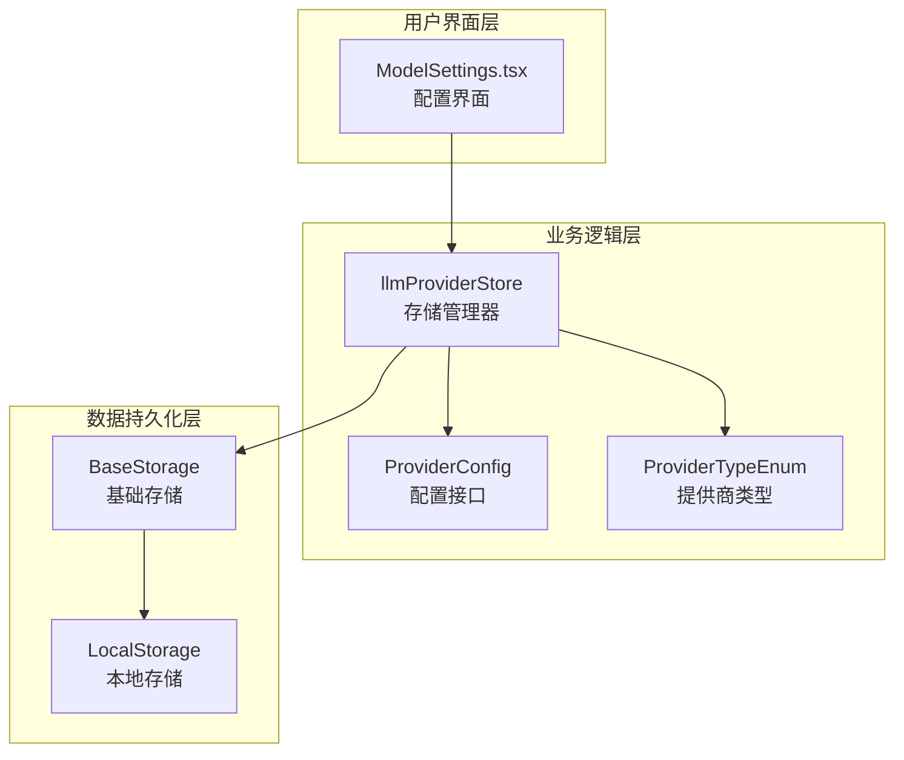
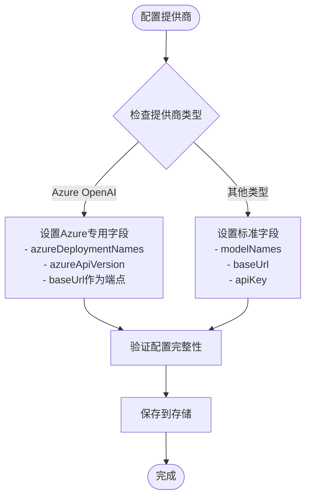
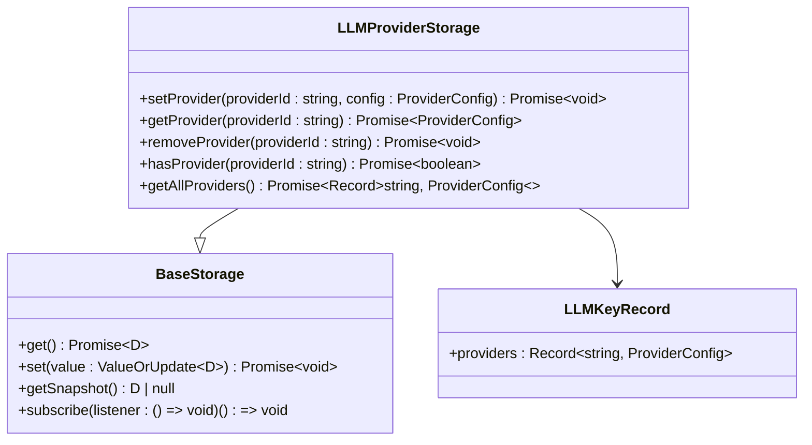
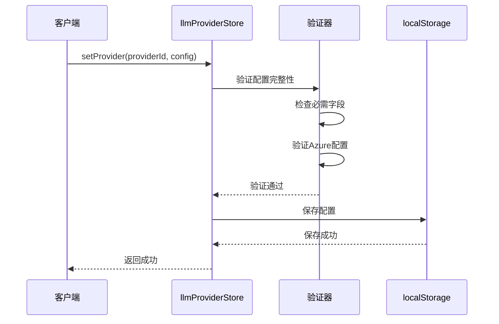
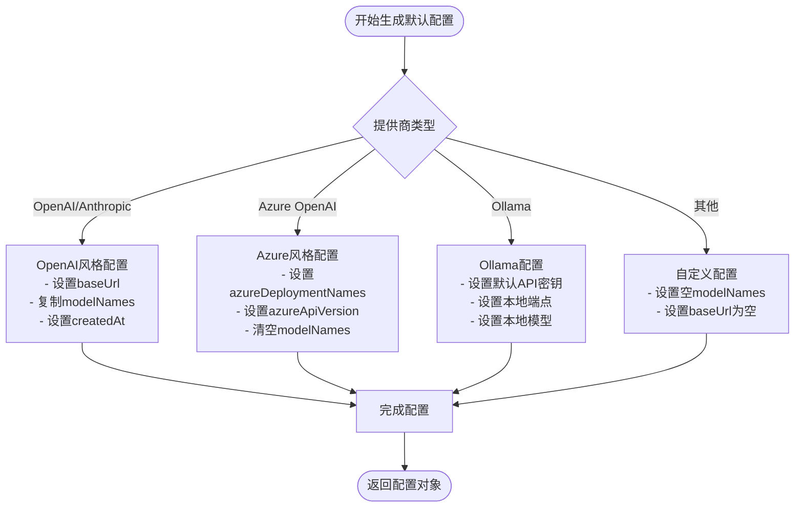
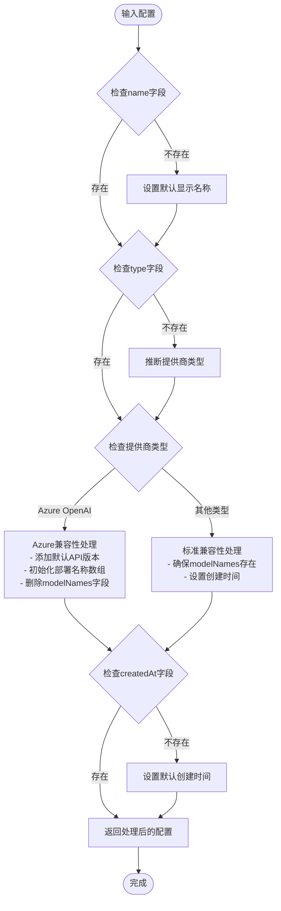
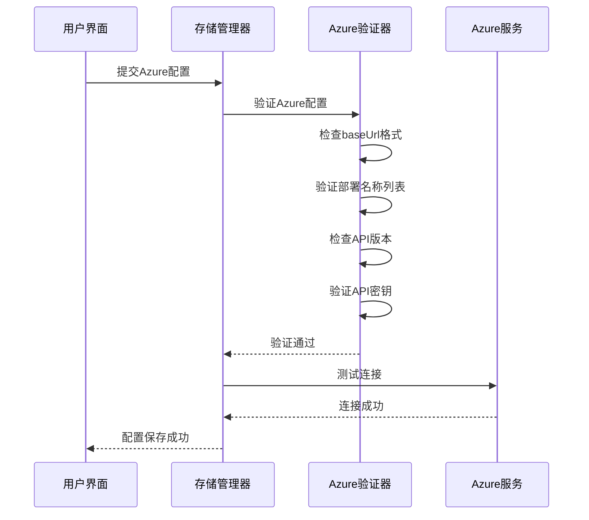
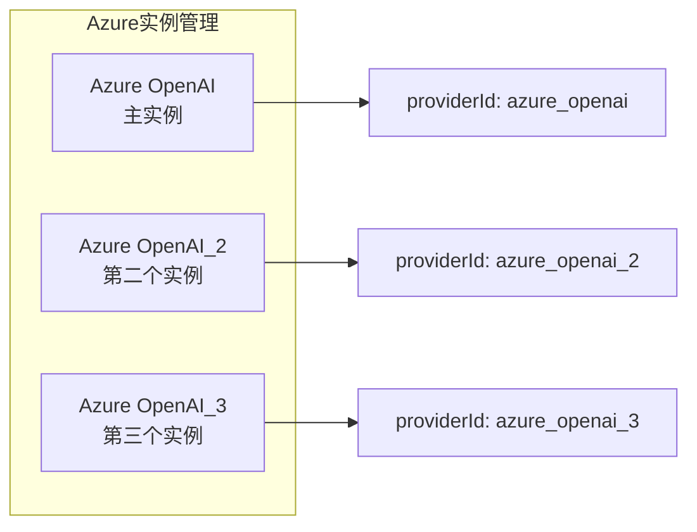
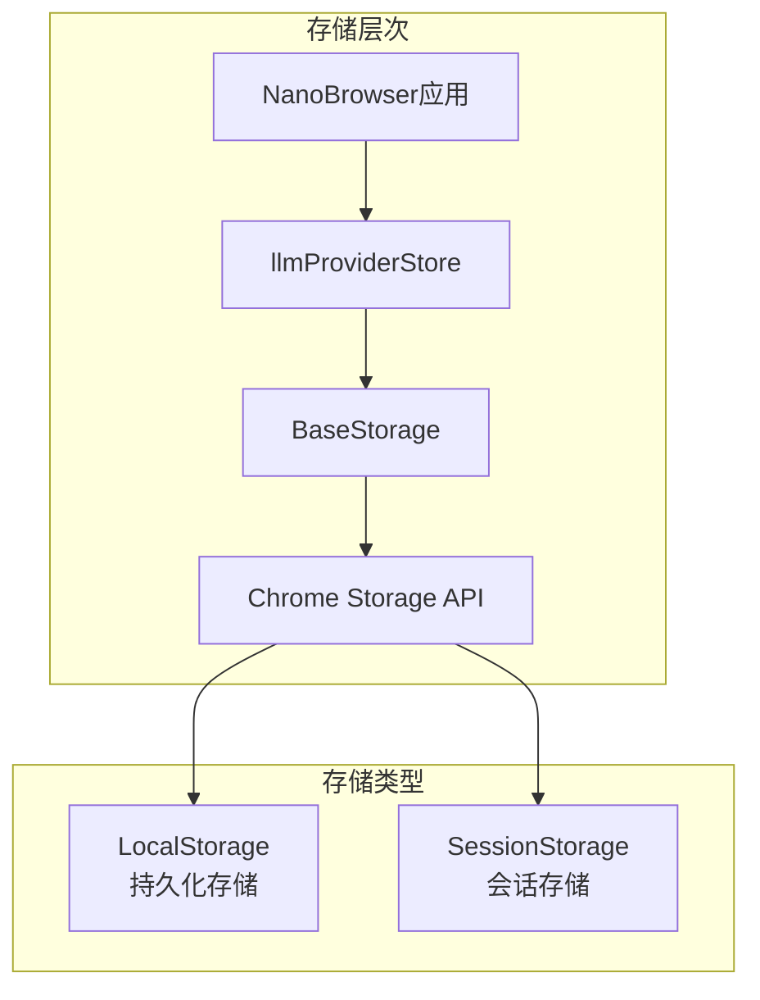

# LLM提供商配置管理

<cite>
**本文档中引用的文件**
- [llmProviders.ts](file://packages/storage/lib/settings/llmProviders.ts)
- [types.ts](file://packages/storage/lib/settings/types.ts)
- [ModelSettings.tsx](file://pages/options/src/components/ModelSettings.tsx)
- [helper.ts](file://chrome-extension/src/background/agent/helper.ts)
- [base.ts](file://packages/storage/lib/base/base.ts)
- [types.ts](file://packages/storage/lib/base/types.ts)
- [enums.ts](file://packages/storage/lib/base/enums.ts)
</cite>

## 目录
1. [简介](#简介)
2. [项目结构概览](#项目结构概览)
3. [ProviderConfig接口详解](#providerconfig接口详解)
4. [llmProviderStore存储机制](#llmproviderstore存储机制)
5. [默认配置生成](#默认配置生成)
6. [向后兼容性处理](#向后兼容性处理)
7. [Azure OpenAI特殊处理](#azure-openai特殊处理)
8. [存储持久化机制](#存储持久化机制)
9. [实际使用示例](#实际使用示例)
10. [最佳实践指南](#最佳实践指南)

## 简介

LLM提供商配置管理系统是NanoBrowser扩展的核心组件之一，负责管理各种大语言模型提供商的配置信息。该系统提供了统一的接口来处理不同类型的LLM提供商，包括OpenAI、Anthropic、Azure OpenAI、本地模型等多种类型，支持动态添加、删除和修改提供商配置。

## 项目结构概览

LLM提供商配置管理系统的架构采用分层设计，主要包含以下核心模块：



**图表来源**
- [llmProviders.ts](file://packages/storage/lib/settings/llmProviders.ts#L27-L56)
- [types.ts](file://packages/storage/lib/settings/types.ts#L10-L22)

**章节来源**
- [llmProviders.ts](file://packages/storage/lib/settings/llmProviders.ts#L1-L317)
- [types.ts](file://packages/storage/lib/settings/types.ts#L1-L154)

## ProviderConfig接口详解

ProviderConfig接口是整个配置管理系统的核心数据结构，定义了所有LLM提供商配置的基本字段和属性。

### 核心字段说明

| 字段名 | 类型 | 必填 | 描述 | 默认值 |
|--------|------|------|------|--------|
| `name` | `string?` | 否 | 显示名称，在选项界面中显示 | 自动生成 |
| `type` | `ProviderTypeEnum?` | 否 | 提供商类型，决定使用哪个LangChain ChatModel包 | 自动推断 |
| `apiKey` | `string` | 是 | API密钥，必须提供（本地模型可为空） | '' |
| `baseUrl` | `string?` | 否 | 基础URL，对于Azure为端点地址 | undefined |
| `modelNames` | `string[]?` | 否 | 选择的模型名称数组（不用于Azure OpenAI） | [] |
| `createdAt` | `number?` | 否 | 创建时间戳（毫秒） | Date.now() |
| `azureDeploymentNames` | `string[]?` | 否 | Azure部署名称数组 | [] |
| `azureApiVersion` | `string?` | 否 | Azure API版本 | '2025-04-01-preview' |

### 字段使用场景分析



**图表来源**
- [llmProviders.ts](file://packages/storage/lib/settings/llmProviders.ts#L235-L260)

**章节来源**
- [llmProviders.ts](file://packages/storage/lib/settings/llmProviders.ts#L8-L24)

## llmProviderStore存储机制

llmProviderStore是一个功能完整的存储管理器，提供了对LLM提供商配置的完整CRUD操作能力。

### 存储接口定义



**图表来源**
- [llmProviders.ts](file://packages/storage/lib/settings/llmProviders.ts#L27-L56)
- [base.ts](file://packages/storage/lib/base/base.ts#L6-L12)

### 核心操作方法

#### setProvider方法
setProvider方法负责验证和保存提供商配置，确保配置的完整性和有效性：

- **参数验证**：检查providerId和apiKey不能为空
- **类型推断**：自动推断提供商类型
- **Azure特殊验证**：对Azure OpenAI进行额外的配置验证
- **配置补全**：自动补全缺失的字段

#### getProvider方法
getProvider方法从存储中获取指定提供商的配置，并应用向后兼容性处理：

- **数据获取**：从localStorage中读取配置
- **兼容性处理**：调用ensureBackwardCompatibility确保配置格式正确
- **返回结果**：返回处理后的配置对象或undefined

#### 配置验证流程



**图表来源**
- [llmProviders.ts](file://packages/storage/lib/settings/llmProviders.ts#L235-L278)

**章节来源**
- [llmProviders.ts](file://packages/storage/lib/settings/llmProviders.ts#L235-L315)

## 默认配置生成

getDefaultProviderConfig函数为每种内置提供商类型生成标准化的默认配置模板。

### 支持的提供商类型

系统支持以下提供商类型：

| 提供商类型 | 枚举值 | 特殊字段 | 默认模型 |
|------------|--------|----------|----------|
| OpenAI | `openai` | `modelNames` | gpt-5, gpt-5-mini, gpt-4o |
| Anthropic | `anthropic` | `modelNames` | claude-opus-4-1, claude-sonnet-4-0 |
| Azure OpenAI | `azure_openai` | `azureDeploymentNames` | gpt-5, gpt-4o |
| Ollama | `ollama` | `modelNames` | qwen3:14b, falcon3:10b |
| OpenRouter | `openrouter` | `modelNames` | google/gemini-2.5-pro |
| 其他 | `custom_openai` | `modelNames` | [] |

### 默认配置生成逻辑



**图表来源**
- [llmProviders.ts](file://packages/storage/lib/settings/llmProviders.ts#L106-L162)

**章节来源**
- [llmProviders.ts](file://packages/storage/lib/settings/llmProviders.ts#L106-L162)
- [types.ts](file://packages/storage/lib/settings/types.ts#L24-L48)

## 向后兼容性处理

ensureBackwardCompatibility函数确保新版本配置能够兼容旧版本的数据格式。

### 兼容性处理策略



**图表来源**
- [llmProviders.ts](file://packages/storage/lib/settings/llmProviders.ts#L173-L220)

### 兼容性处理规则

1. **字段补全**：自动补全缺失的必要字段
2. **类型推断**：根据提供商ID推断正确的类型
3. **Azure特殊处理**：
   - 删除旧版的modelNames字段
   - 初始化azureDeploymentNames数组
   - 添加默认的API版本
4. **时间戳处理**：确保createdAt字段存在

**章节来源**
- [llmProviders.ts](file://packages/storage/lib/settings/llmProviders.ts#L173-L220)

## Azure OpenAI特殊处理

Azure OpenAI是系统中最复杂的提供商类型，需要特殊的配置处理和验证逻辑。

### Azure配置字段

Azure OpenAI配置包含以下特殊字段：

| 字段名 | 类型 | 必填 | 描述 |
|--------|------|------|------|
| `baseUrl` | `string` | 是 | Azure端点URL，格式如：https://your-instance.openai.azure.com/ |
| `azureDeploymentNames` | `string[]` | 是 | 部署名称列表，至少一个 |
| `azureApiVersion` | `string` | 是 | API版本号，如：2025-04-01-preview |

### Azure配置验证流程



**图表来源**
- [llmProviders.ts](file://packages/storage/lib/settings/llmProviders.ts#L235-L250)

### 多实例Azure支持

系统支持在同一环境中配置多个Azure OpenAI实例：



**图表来源**
- [ModelSettings.tsx](file://pages/options/src/components/ModelSettings.tsx#L1020-L1040)

**章节来源**
- [llmProviders.ts](file://packages/storage/lib/settings/llmProviders.ts#L132-L150)
- [helper.ts](file://chrome-extension/src/background/agent/helper.ts#L165-L200)

## 存储持久化机制

系统采用Chrome Extension的Storage API实现配置的持久化存储。

### 存储架构



**图表来源**
- [base.ts](file://packages/storage/lib/base/base.ts#L69-L119)
- [enums.ts](file://packages/storage/lib/base/enums.ts#L1-L20)

### 存储配置特性

| 特性 | 描述 | 实现方式 |
|------|------|----------|
| 持久化存储 | 数据永久保存 | `StorageEnum.Local` |
| 实时同步 | 跨标签页实时更新 | `liveUpdate: true` |
| 订阅机制 | 自动响应数据变化 | `subscribe()` |
| 序列化支持 | 自定义序列化/反序列化 | `serialization`配置 |

### 存储键值映射

系统使用统一的存储键名`llm-api-keys`来保持向后兼容性：

```typescript
// 存储结构示例
{
  "llm-api-keys": {
    "providers": {
      "openai": {
        "name": "OpenAI",
        "type": "openai",
        "apiKey": "sk-...",
        "modelNames": ["gpt-4o", "gpt-4"],
        "createdAt": 1703123456789
      },
      "azure_openai": {
        "name": "Azure OpenAI",
        "type": "azure_openai",
        "apiKey": "abc123...",
        "baseUrl": "https://my-instance.openai.azure.com/",
        "azureDeploymentNames": ["gpt-4o", "gpt-4"],
        "azureApiVersion": "2025-04-01-preview",
        "createdAt": 1703123456789
      }
    }
  }
}
```

**章节来源**
- [llmProviders.ts](file://packages/storage/lib/settings/llmProviders.ts#L35-L45)
- [base.ts](file://packages/storage/lib/base/base.ts#L69-L119)

## 实际使用示例

### 基本配置管理示例

以下是使用llmProviderStore进行基本配置管理的代码示例：

```typescript
// 添加新的OpenAI提供商
const openaiProviderId = 'openai';
const openaiConfig = {
  name: '我的OpenAI',
  apiKey: 'sk-...',
  modelNames: ['gpt-4o', 'gpt-4']
};

await llmProviderStore.setProvider(openaiProviderId, openaiConfig);

// 获取配置
const config = await llmProviderStore.getProvider(openaiProviderId);
console.log(config); // 包含完整配置信息

// 删除配置
await llmProviderStore.removeProvider(openaiProviderId);
```

### Azure OpenAI配置示例

```typescript
// 添加Azure OpenAI提供商
const azureProviderId = 'azure_openai';
const azureConfig = {
  name: 'Azure GPT-4',
  apiKey: 'your-azure-key',
  baseUrl: 'https://your-instance.openai.azure.com/',
  azureDeploymentNames: ['gpt-4o', 'gpt-4'],
  azureApiVersion: '2025-04-01-preview'
};

await llmProviderStore.setProvider(azureProviderId, azureConfig);
```

### 批量配置管理

```typescript
// 获取所有提供商配置
const allProviders = await llmProviderStore.getAllProviders();
console.log('可用提供商:', Object.keys(allProviders));

// 检查特定提供商是否存在
const hasOpenAI = await llmProviderStore.hasProvider('openai');
console.log('OpenAI配置存在:', hasOpenAI);
```

**章节来源**
- [ModelSettings.tsx](file://pages/options/src/components/ModelSettings.tsx#L1000-L1100)
- [helper.ts](file://chrome-extension/src/background/agent/helper.ts#L165-L200)

## 最佳实践指南

### 配置安全性

1. **API密钥保护**：确保API密钥不会被意外暴露
2. **权限控制**：限制对敏感配置的访问权限
3. **定期轮换**：建议定期更换API密钥

### 性能优化

1. **懒加载**：只在需要时加载提供商配置
2. **缓存策略**：合理使用本地缓存减少存储访问
3. **批量操作**：对多个配置进行批量处理

### 错误处理

```typescript
try {
  await llmProviderStore.setProvider(providerId, config);
} catch (error) {
  console.error('配置保存失败:', error.message);
  // 显示用户友好的错误消息
}
```

### 配置迁移

当系统升级时，确保配置能够平滑迁移：

```typescript
// 在应用启动时检查并修复配置
const providers = await llmProviderStore.getAllProviders();
for (const [providerId, config] of Object.entries(providers)) {
  const fixedConfig = ensureBackwardCompatibility(providerId, config);
  if (fixedConfig !== config) {
    await llmProviderStore.setProvider(providerId, fixedConfig);
  }
}
```

### 开发调试

1. **日志记录**：启用详细的日志记录以便调试
2. **配置验证**：在开发环境进行严格的配置验证
3. **单元测试**：为配置管理功能编写单元测试

通过遵循这些最佳实践，可以确保LLM提供商配置管理系统的稳定性、安全性和可维护性。