# LLM提供商集成机制

<cite>
**本文档中引用的文件**
- [llmProviders.ts](file://packages/storage/lib/settings/llmProviders.ts)
- [ModelSettings.tsx](file://pages/options/src/components/ModelSettings.tsx)
- [types.ts](file://packages/storage/lib/settings/types.ts)
- [agentModels.ts](file://packages/storage/lib/settings/agentModels.ts)
- [speechToText.ts](file://packages/storage/lib/settings/speechToText.ts)
- [PRIVACY.md](file://PRIVACY.md)
</cite>

## 目录
1. [简介](#简介)
2. [项目结构概览](#项目结构概览)
3. [核心组件分析](#核心组件分析)
4. [架构概览](#架构概览)
5. [详细组件分析](#详细组件分析)
6. [配置验证与错误处理](#配置验证与错误处理)
7. [类型安全实现](#类型安全实现)
8. [用户界面集成](#用户界面集成)
9. [隐私保护机制](#隐私保护机制)
10. [故障排除指南](#故障排除指南)
11. [总结](#总结)

## 简介

Nanobrowser的LLM提供商集成机制是一个高度模块化和可扩展的系统，支持多种AI服务提供商（如OpenAI、Anthropic、Gemini等）。该系统通过统一的配置接口管理所有提供商，提供类型安全的配置存储，并与用户界面无缝集成，允许用户轻松添加、编辑和切换不同的LLM提供商。

## 项目结构概览

LLM提供商集成机制的核心文件分布在以下目录结构中：

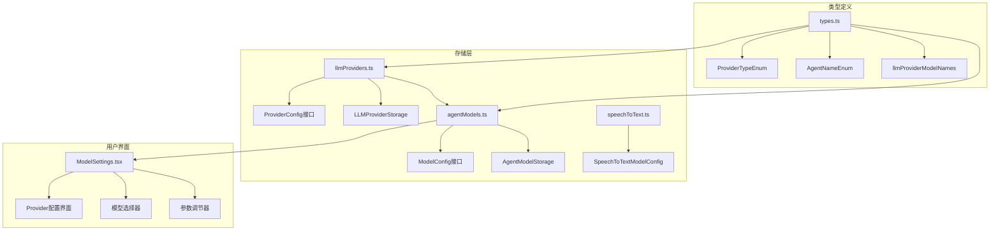

**图表来源**
- [llmProviders.ts](file://packages/storage/lib/settings/llmProviders.ts#L1-L317)
- [ModelSettings.tsx](file://pages/options/src/components/ModelSettings.tsx#L1-L799)
- [types.ts](file://packages/storage/lib/settings/types.ts#L1-L154)

**章节来源**
- [llmProviders.ts](file://packages/storage/lib/settings/llmProviders.ts#L1-L317)
- [ModelSettings.tsx](file://pages/options/src/components/ModelSettings.tsx#L1-L799)
- [types.ts](file://packages/storage/lib/settings/types.ts#L1-L154)

## 核心组件分析

### ProviderConfig接口设计

ProviderConfig是整个LLM提供商系统的核心数据结构，定义了所有提供商配置的标准格式：

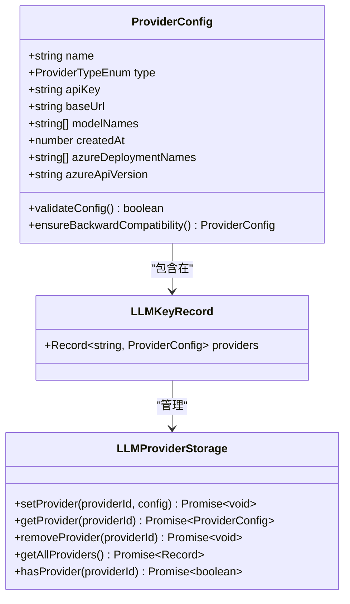

**图表来源**
- [llmProviders.ts](file://packages/storage/lib/settings/llmProviders.ts#L10-L25)
- [llmProviders.ts](file://packages/storage/lib/settings/llmProviders.ts#L27-L35)

### 支持的提供商类型

系统支持以下主要提供商类型：

| 提供商类型 | 描述 | 特殊配置 |
|-----------|------|----------|
| OpenAI | OpenAI官方API服务 | 支持GPT系列模型 |
| Anthropic | Anthropic Claude系列 | 支持Claude Opus等模型 |
| Gemini | Google Gemini模型 | 支持Flash和Pro版本 |
| AzureOpenAI | Microsoft Azure OpenAI服务 | 需要部署名称和API版本 |
| CustomOpenAI | 自定义OpenAI兼容服务 | 用户自定义基础URL |
| Ollama | 本地大语言模型服务 | 本地部署，无需API密钥 |
| OpenRouter | 统一访问多个提供商 | 支持多种模型聚合 |
| Groq | 高速推理服务 | 专注于快速响应 |
| Cerebras | Cerebras系统 | 专用硬件加速 |

**章节来源**
- [types.ts](file://packages/storage/lib/settings/types.ts#L8-L22)
- [llmProviders.ts](file://packages/storage/lib/settings/llmProviders.ts#L106-L180)

## 架构概览

LLM提供商集成系统采用分层架构设计，确保了良好的可维护性和扩展性：

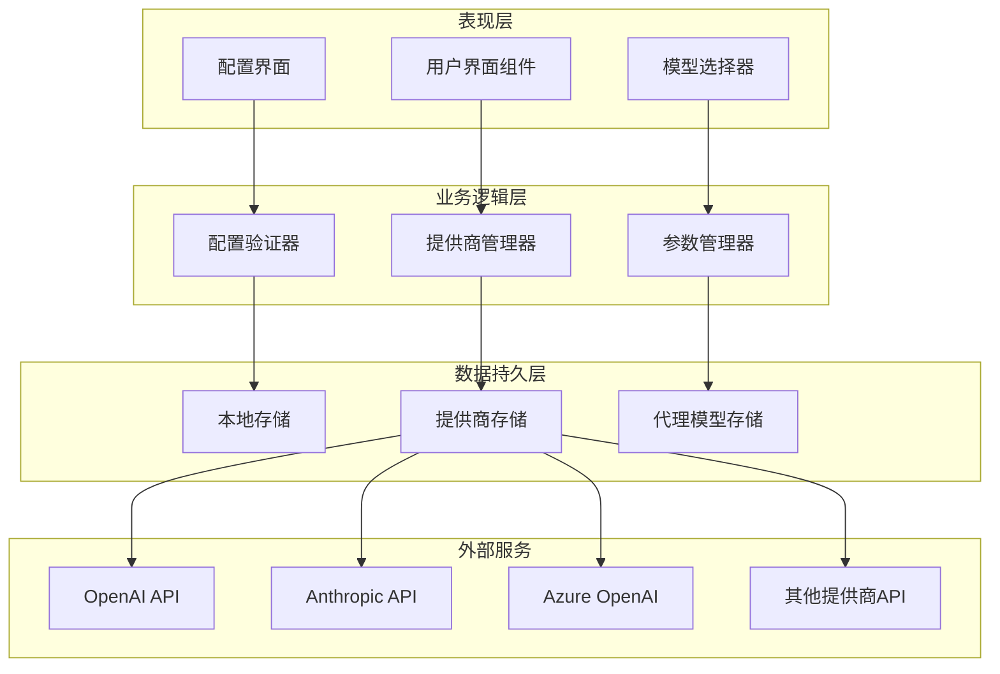

**图表来源**
- [ModelSettings.tsx](file://pages/options/src/components/ModelSettings.tsx#L55-L70)
- [llmProviders.ts](file://packages/storage/lib/settings/llmProviders.ts#L237-L317)

## 详细组件分析

### 提供商配置管理

#### 默认配置生成

系统为每个内置提供商提供预设的默认配置，确保新用户能够快速开始使用：

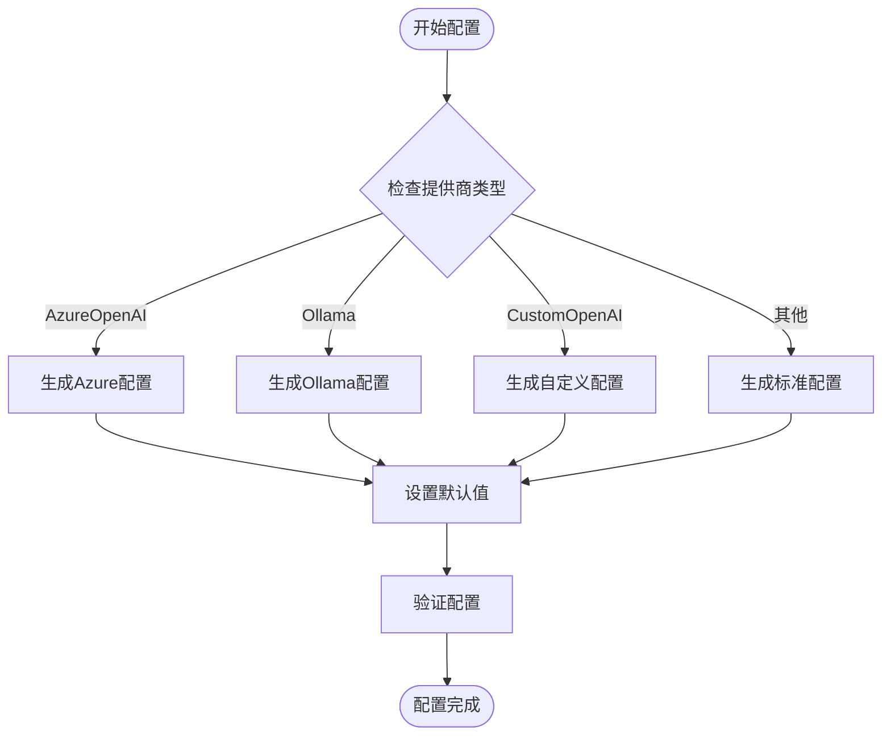

**图表来源**
- [llmProviders.ts](file://packages/storage/lib/settings/llmProviders.ts#L106-L180)

#### 配置验证机制

系统实现了多层次的配置验证机制：

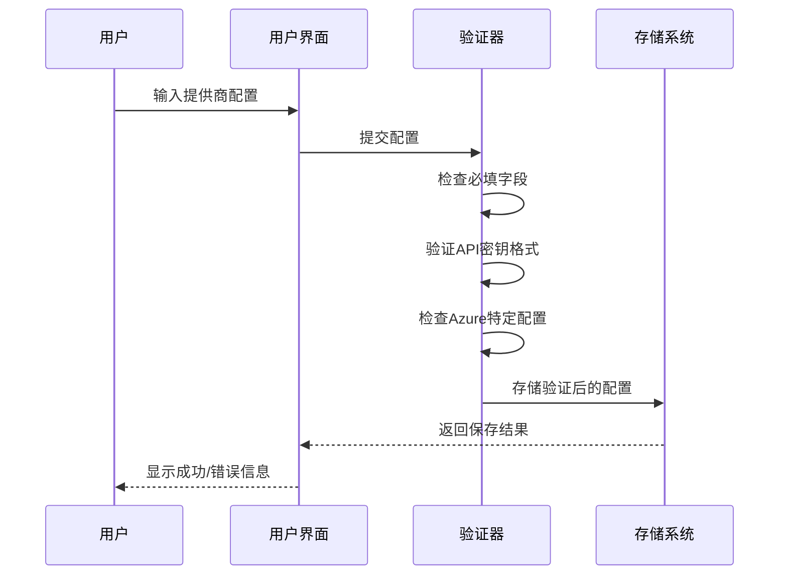

**图表来源**
- [llmProviders.ts](file://packages/storage/lib/settings/llmProviders.ts#L237-L290)

**章节来源**
- [llmProviders.ts](file://packages/storage/lib/settings/llmProviders.ts#L106-L180)
- [llmProviders.ts](file://packages/storage/lib/settings/llmProviders.ts#L237-L290)

### 代理模型配置

#### 模型参数管理

系统为每个代理（Planner和Navigator）提供了独立的模型配置和参数管理：

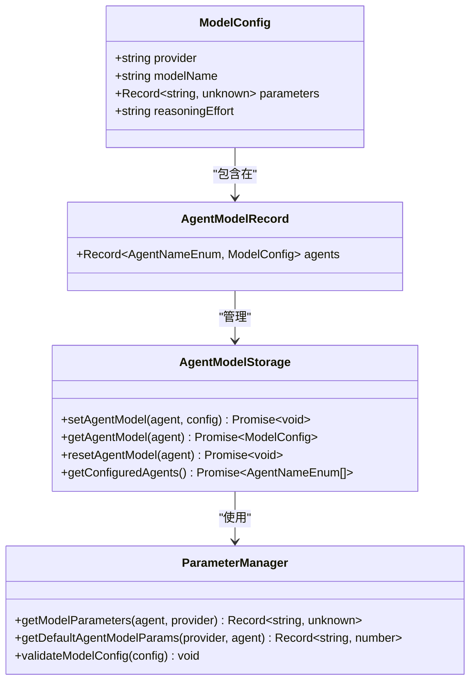

**图表来源**
- [agentModels.ts](file://packages/storage/lib/settings/agentModels.ts#L7-L16)
- [agentModels.ts](file://packages/storage/lib/settings/agentModels.ts#L18-L26)

#### 参数配置表

不同提供商的默认参数配置：

| 代理类型 | OpenAI | Anthropic | Gemini | 其他提供商 |
|---------|--------|-----------|--------|------------|
| Planner温度 | 0.7 | 0.3 | 0.7 | 0.7 |
| Planner Top-P | 0.9 | 0.6 | 0.9 | 0.9 |
| Navigator温度 | 0.3 | 0.2 | 0.3 | 0.3 |
| Navigator Top-P | 0.85 | 0.5 | 0.85 | 0.85 |

**章节来源**
- [types.ts](file://packages/storage/lib/settings/types.ts#L58-L152)
- [agentModels.ts](file://packages/storage/lib/settings/agentModels.ts#L44-L72)

### 语音转文字模型配置

#### 专门的语音处理配置

系统还支持专门的语音转文字模型配置，与主LLM模型分离：

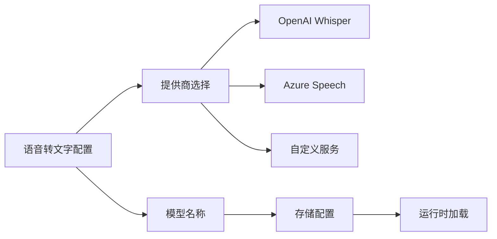

**图表来源**
- [speechToText.ts](file://packages/storage/lib/settings/speechToText.ts#L5-L12)

**章节来源**
- [speechToText.ts](file://packages/storage/lib/settings/speechToText.ts#L1-L54)

## 配置验证与错误处理

### 运行时配置验证

系统在多个层面实施配置验证：

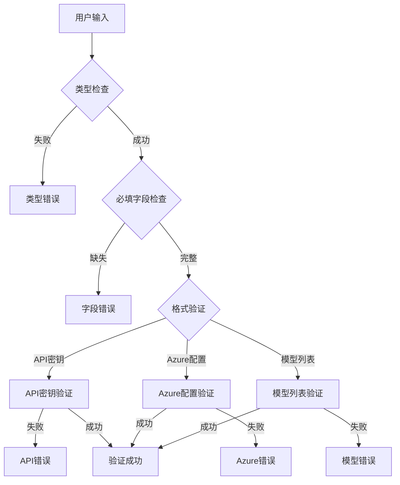

**图表来源**
- [llmProviders.ts](file://packages/storage/lib/settings/llmProviders.ts#L237-L290)

### 错误处理策略

系统实现了分级的错误处理策略：

1. **输入验证错误**：立即阻止无效配置
2. **存储错误**：提供回滚机制
3. **运行时错误**：优雅降级和重试机制
4. **网络错误**：提供离线模式支持

**章节来源**
- [llmProviders.ts](file://packages/storage/lib/settings/llmProviders.ts#L237-L290)
- [ModelSettings.tsx](file://pages/options/src/components/ModelSettings.tsx#L420-L480)

## 类型安全实现

### TypeScript类型系统

系统充分利用TypeScript的类型系统确保配置访问的一致性和正确性：

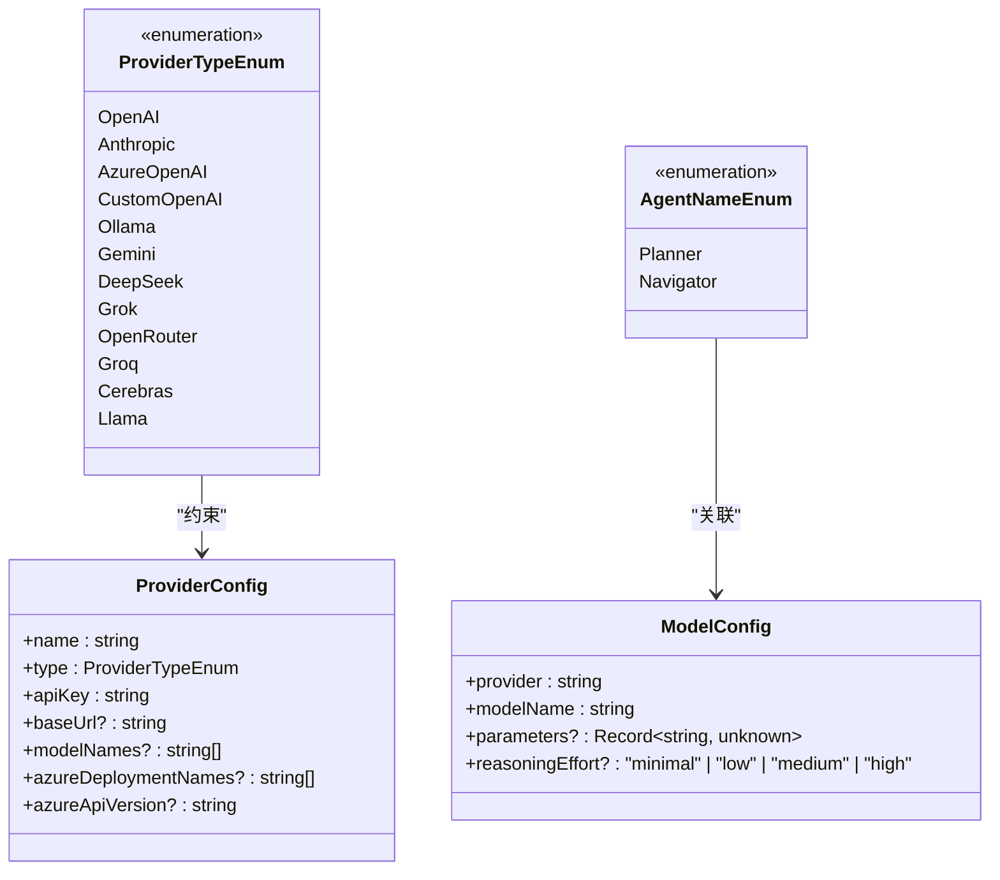

**图表来源**
- [types.ts](file://packages/storage/lib/settings/types.ts#L8-L22)
- [types.ts](file://packages/storage/lib/settings/types.ts#L24-L30)
- [agentModels.ts](file://packages/storage/lib/settings/agentModels.ts#L7-L16)

### 泛型存储模式

系统使用泛型模式确保存储操作的类型安全：

```typescript
// 类型安全的存储接口
export type LLMProviderStorage = BaseStorage<LLMKeyRecord> & {
  setProvider: (providerId: string, config: ProviderConfig) => Promise<void>;
  getProvider: (providerId: string) => Promise<ProviderConfig | undefined>;
  removeProvider: (providerId: string) => Promise<void>;
  getAllProviders: () => Promise<Record<string, ProviderConfig>>;
};
```

**章节来源**
- [types.ts](file://packages/storage/lib/settings/types.ts#L1-L154)
- [llmProviders.ts](file://packages/storage/lib/settings/llmProviders.ts#L27-L35)

## 用户界面集成

### 动态提供商配置界面

ModelSettings组件提供了直观的用户界面来管理LLM提供商：

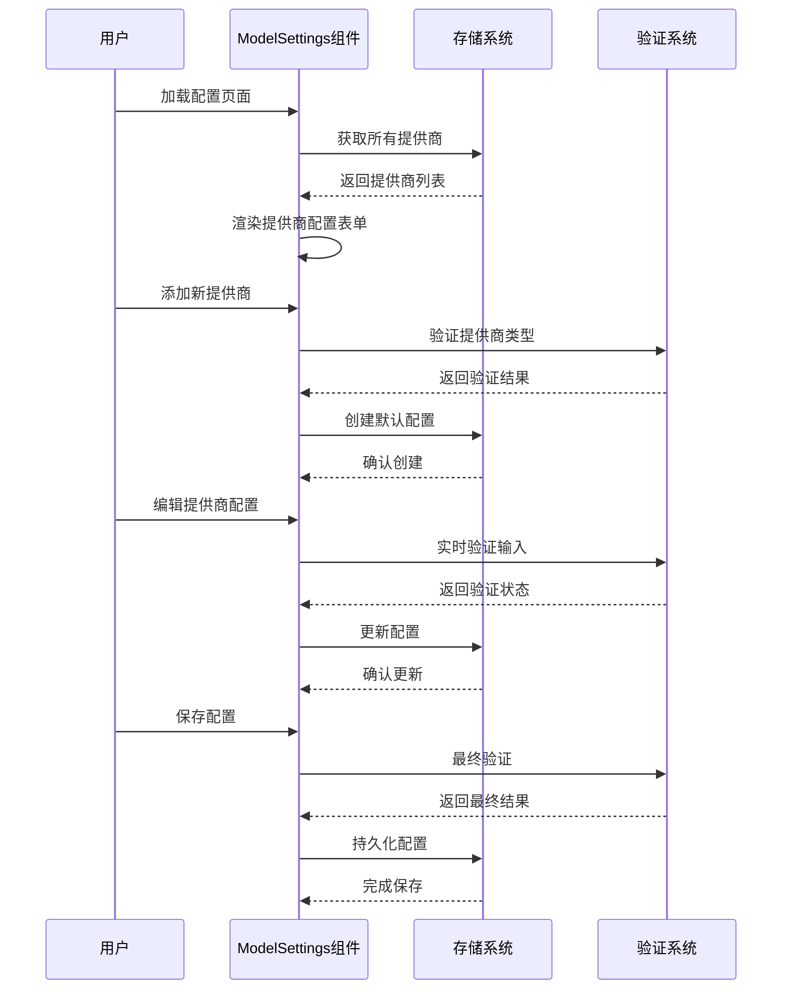

**图表来源**
- [ModelSettings.tsx](file://pages/options/src/components/ModelSettings.tsx#L1126-L1145)
- [ModelSettings.tsx](file://pages/options/src/components/ModelSettings.tsx#L912-L947)

### 模型选择机制

系统提供了智能的模型选择机制，支持：

1. **自动模型发现**：从已配置的提供商中自动发现可用模型
2. **实时过滤**：基于用户输入实时过滤可用模型
3. **优先级排序**：根据使用频率和性能对模型进行排序
4. **跨提供商兼容性**：确保不同提供商的模型可以互换使用

**章节来源**
- [ModelSettings.tsx](file://pages/options/src/components/ModelSettings.tsx#L277-L329)
- [ModelSettings.tsx](file://pages/options/src/components/ModelSettings.tsx#L420-L480)

## 隐私保护机制

### 数据流向透明化

根据PRIVACY.md文档，系统严格遵循隐私保护原则：

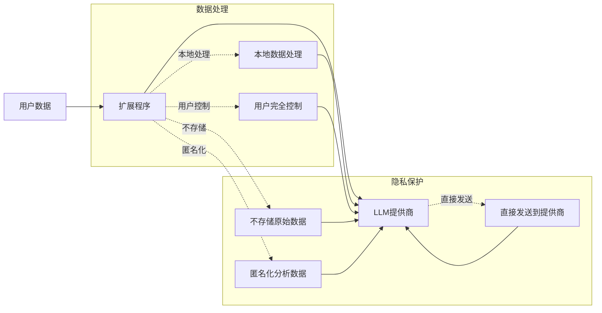

**图表来源**
- [PRIVACY.md](file://PRIVACY.md#L35-L45)

### API密钥安全管理

系统实现了安全的API密钥管理机制：

1. **本地存储**：所有API密钥仅存储在用户的浏览器本地
2. **加密传输**：与提供商的通信使用HTTPS加密
3. **最小权限**：只授予必要的API访问权限
4. **定期轮换**：支持用户定期更换API密钥

**章节来源**
- [PRIVACY.md](file://PRIVACY.md#L1-L53)
- [llmProviders.ts](file://packages/storage/lib/settings/llmProviders.ts#L237-L290)

## 故障排除指南

### 常见问题诊断

#### 配置问题

| 问题症状 | 可能原因 | 解决方案 |
|---------|---------|----------|
| 提供商无法保存 | API密钥格式错误 | 检查API密钥格式和有效性 |
| 模型列表为空 | 网络连接问题 | 检查网络连接和防火墙设置 |
| 参数调整无效 | 配置缓存问题 | 刷新页面或清除浏览器缓存 |
| Azure配置失败 | 部署名称错误 | 验证Azure部署名称列表 |

#### 性能问题

1. **响应速度慢**：
   - 检查网络连接质量
   - 考虑更换更快的提供商
   - 调整模型参数优化性能

2. **频繁超时**：
   - 增加请求超时时间
   - 使用更稳定的网络连接
   - 考虑使用本地模型（如Ollama）

### 调试工具

系统提供了多种调试工具帮助诊断问题：

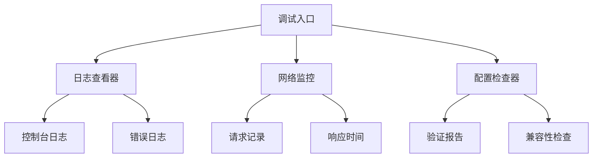

**章节来源**
- [ModelSettings.tsx](file://pages/options/src/components/ModelSettings.tsx#L420-L480)
- [llmProviders.ts](file://packages/storage/lib/settings/llmProviders.ts#L201-L235)

## 总结

Nanobrowser的LLM提供商集成机制是一个设计精良、功能完备的系统，具有以下核心优势：

### 技术优势

1. **模块化设计**：清晰的分层架构便于维护和扩展
2. **类型安全**：完整的TypeScript类型系统确保代码质量
3. **向后兼容**：智能的配置迁移机制保证升级平滑
4. **性能优化**：本地存储和缓存机制提升用户体验

### 用户体验

1. **直观界面**：React组件提供友好的配置界面
2. **实时验证**：即时的配置验证和错误提示
3. **灵活配置**：支持多种提供商和自定义配置
4. **隐私保护**：严格的数据隐私和安全措施

### 扩展性

1. **插件架构**：易于添加新的LLM提供商
2. **配置标准化**：统一的配置格式简化开发
3. **参数管理**：灵活的参数配置适应不同需求
4. **多模型支持**：支持语音转文字等专门模型

该系统不仅满足了当前的功能需求，还为未来的扩展和优化奠定了坚实的基础，是现代Web扩展应用中LLM集成的最佳实践范例。